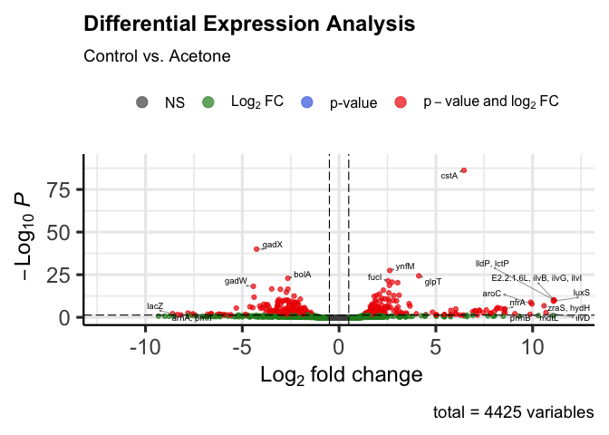

<!-- README.md is generated from README.Rmd. Please edit that file -->
<!-- badges: start -->


<!-- badges: end -->

# Pipeline: RNA-Seq 

**Autor: MsC. Kelly Hidalgo**

Pipeline para el tratamiento de datos de RNA-seq y ensayos de expresión
diferencial. Para este tutorial serán usados los datos obtenidos en el
artículo [RNA-seq analysis of antibacterial mechanism of *Cinnamomum
camphora* essential oil against *Escherichia
coli*](https://www.ncbi.nlm.nih.gov/pmc/articles/PMC7980702/pdf/peerj-09-11081.pdf).
Brevemente, en este estudio fue evaluado el poder bactericida del aceite
esencial de la planta *Cinnamomum camphora* contra *Escherichia coli*
ATCC8739. Fue determinada la concentración mínima inhibitoria (MIC). Con
el fin de evaluar el mecanismo antibacterial del aceite esencial, fue
llevado a cabo un ensayo de expresión diferencial bajo tres
tratamientos, en los cuales fue secuenciado el transcriptoma (RNA-seq)
usando la plataforma Illumina NovaSeq. Las tres condiciones fueron, *E.
coli* tratada con agua, acetona y el aceite esencial en diferentes
concentraciones (1/8, 1/4 y 1/2 MIC).

Los datos pueden ser descargados desde el
[NCBI](https://www.ncbi.nlm.nih.gov/sra?term=SRP289443).

## [**SLIDES**]()

# WORKFLOW

img src=“imgs/workflow.png” align=“center”/&gt;

------------------------------------------------------------------------

# 0. Introducción a UNIX

El shell de Unix es un interpretador de línea de comando. Es una
herramenta poderosa que permite a los usuarios a ejecutar tareas
complejas y poderosas, generalmente con algunas líneas de código. En
este tutorial, usted va entrar en la “pantalla negra” 🖥 , va a aprender
y ejercitar algunos comandos básicos e indispensables, para navegar y se
desenvolver en el *terminal*.

Normalmente la interacción del humano con el computador sucede por medio
de un teclado y un mouse, interfaces gráficas y/o sistemas de
reconocimiento de voz. La manera más comúm de interacturar, es llamada
como interface gráfica de usuário *(**G**raphical **U**ser
**I**nterface)*. Cuando se trabaja en una GUI, las ordenes son dadas
haciendo click con el mouse y usando interaciones orientadas por
diferentes menús. Eso funciona muy bien para escalas pequeñas, pues es
muy intuitivo. Pero ahora imagine que usted necesita ejecutar una tarea
en mil archivos en diferentes carpetas, por ejemplo, copiar la última
línea de todos los archivos y pegarlos en un único archivo. Serían
necesarias muchas horas (tal vez días) ejecutando el proceso y además
podría cometer errores. Es ahí cuando shell es muy útil, ya que por ser
una interface de línea de comando *(**C**ommand **L**ine **I**nterface)*
y un lenguaje de srcipt, permite procesar tareas repetitivas como las
del ejemplo, siendo realizadas de una forma rápida y automática. El uso
de shell es fundamental para el uso de uma amplia variedad de
herramientas ⚒ de bioinformática 🖥. Este tutorial le va a servir para
hacer un uso eficaz de estos recursos.

## 0.1. Login no servidor

Para los usuarios de Windows es necesario la instalación del software
[MobaXterm](https://mobaxterm.mobatek.net/download-home-edition.html#:~:text=MobaXterm%20Home%20Edition%20v22.1%0A(Installer%20edition)).


Después de instalado, clique en la opción *session*, escoja el icono
*ssh* y complete los datos del login: *remote host* (dirección IP).
Después seleccione la opción *specify name* y complete con el nombre del
usuario. Por último será solicitada la contrasenha. Puede salvar los
datos del login.

**Nota**

-   Siempre que ud vea una caja como ésta 👇🏼, es para que usted dígite
    el contenido en la línea de comando y presione \[enter\] ⌨️ para
    **“correr”** el comando.

``` bash
ls
```

## 0.2 Comandos básicos

### `ssh`

`ssh` (Secure Shell) es un protocolo que garantiza que el usuario y el
servidor remoto intercambien informaciones de manera segura e dinámica.
Sirve especificamente para conectarse a un servidor remoto.

    $ ssh -X <user_name>@<ip.address>

### `pwd` (*Print Working Directory*)

Los directorios 📁 son como cajas. Siempre que usted está usando el
shell, usted está dentro de alguna caja **(Directorio)** 📁 de su
computador 💻 o servidor, llamado **directorio actual de trabajo**. Los
comandos solamente leen y graban archivos en el directorio actual de
trabajo (sí usted no indicar otro camino), por lo tanto, es
**importante** :exclamation: saber en cual directorio está antes de
ejecutar un comando. El comando `pwd` muestra donde está.

    pwd

**Output**

     /home/user

### Sintaxis de los comandos

`comando [opciones] [archivo]`

El comando es separado de las opciones (o argumentos, flags) e do
archivo 📄 por un espacio. Los argumentos pueden mudar el comportamiento
del comando. Y el archivo 📄 indica para el comando sobre lo que va a
operar (p.e. archivos 📄 y directorios 📁). A veces los argumentos y el
archivo 📄 son llamados de **parámetros**. Un comando puede tener más de
un argumento y/o archivos 📄 y también podria no tener ninguno de los
dos. Las opciones usualmente tienen un guión y una letra (p.e. `-h`) o
dos guiones y una palabra (p.e. `--help`), **sin** espacio entre lo(s)
guion(es) y la letra/palabra. Vamos a ver con ejemplos prácticos.

**Importante:**:exclamation: el lenguaje usado en UNIX es sensible a
letras mayúsculas e minúsculas (*case sensitive*), es un error común.
**Siempre atento** :exclamation:

### `ls` Listar

Con el comando `ls` ud puede ver (listar) lo que hay dentro del
**directorio actual de trabajo** 📁.

    ls 

**Output**

    Documentos Downloads Imagens

Usted puede usar el **argumento** `-F` para indicar para el comando `ls`
que muestre lo que es cada elemento (directorio o archivo). `/`
significa que es un directorio 📁, el `*` significa que es un archivo
ejecutable y sí no tiene ningún símbolo significa que es un archivo 📄.

El ***flag*** 🚩 `--help` 🆘 es bien importante:exclamation:, y puede ser
usado en **cualquier** comando. El muestra más información sobre el
comando, y como usarlo 🤙🏼. Explore o menú help

Outros **flags** 🚩 interessantes são: `ls -l`, que lista o conteúdo da
pasta 📁 com informações extras, como as permisões, o tamanho, a data 📅 e
hora 🕙 de criação, e o nome de cada um dos elementos. `ls -a` que lista
todos os arquivos incluídos os ocultos. `ls -t` lista os arquivos em
ordem cronolôgica.

Otros **flags** 🚩 interesantes son: `ls -l`, que lista el contenido de
la carpeta 📁 con informaciones extras, como los permisos, el tamaño, la
fecha 📅 y hora 🕙 de creación, y el nombre de cada uno de los
elementos.`ls -a` que lista todos los archivos incluídos los ocultos.
`ls -t` lista los archivos en orden cronológica.

    ls -l

Los permisos se deben entender así: d = Directorio rwx = *read, write* y
*execute*

Se deben leer de tres en tres caracteres. Así, en nuestro ejemplo de
arriba, ninguno de los elementos son directorios porque no inician con
la letra d. La primera tripleta tiene las letras r e w, o sea el usuario
puede leer y escribir esos elementos. La segunda tiene solamente la
letra r, o sea el grupo (pueden ser creados grupos de usuarios) solo
pueden leer esos archivos. Por último, la última tripleta, también solo
tiene a letra r, o sea **todos** los usuarios solo pueden leer los
elementos listados.

### `mkdir` Make Dir

Usted ya aprendió a explorar carpetas 📁 y archivos 📄, ahora va a
aprender como se crean. El comando `mkdir` sirve para crear carpetas 📁.
Vamos a crear varias 📁📁

    # Crea una carpeta llamada datos
    mkdir datos
    # Crea una carpeta llamada analisis y otra llamada tutorial
    mkdir analisis tutorial
    # Lista el contenido 
    ls -F

Note que: 1) puede crear más de una carpeta por línea de comando y 2)
puede diferenciar los archivos de los directorios, pues éstos están de
color azul y con una `/` al final.

Usando el comando `tree` puede ver “graficamente” la organización de los
directorios y archivos dentro del directorio actual.

#### *Tips*

-   No 🚫 use espacios en los nombres de sus carpetas 📁 o archivos 📄
    (p.e. ~~coleta 2020~~). Siempre separe las palabras con `-`, `_` o
    con mayúsculas (p.e. `coleta_2020`, `coleta-2020` o `coletaMaio` 👍🏼)

-   No 🚫 comience nombres con `-`

-   Asigne para sus elementos nombres fáciles de recordar y escribir y
    que describan lo que contienen.

-   Não use caracteres espaciais

### `cd` Change Directory

El comando `cd` sirve para cambiar de **directorio actual de trabajo**
📁. Vaya al directorio `datos/`

    cd datos/

Condirme donde está con el comando `pwd`

Para volver al directorio anterior

    cd ..

El `..` significa: directorio que contiene el directorio actual (o sea
un directorio arriba). Confirme con:

    pwd

**Output**

    /home/user

Ahora entre en la carpeta 📁 `analisis/` y cree otra 📁 llamada
`colecta_2020`, confirme con `ls`

    ## Cambie de directorio
    cd analisis/
    ## Cree un nuevo directorio
    mkdir colecta_2020
    ## Confirme
    ls

**Output**

    colecta_2020/

Ahora entre a la carpeta que acabó de crear usando el comando `cd` y
verifique donde está con `pwd`, después regrese para el directorio base
`/home/user` 📁 y verifique nuevamente.

Al finalizar esos comandos verifique la organización de los directorios
usando el comando `tree`

Por último vuelva a la carpeta `home/user/analisis/coleta_2020` usando
`cd` en una línea de comando solamente. Confirme con `pwd`. Vuelva
nuevamente para la carpeta raíz también con solo una línea de comando.
**Pista**, recuerde que `..` significa directorio de arriba.

#### *Tip* ️

Usted puede usar la tecla Tab :keyboard: para autocompletar las
palabras. Así, economiza tiempo ⏳, y evita errores de digitación ,
porque el sistema solo va a completar los nombres que existan en el
**directorio actual de trabajo**.

Solo tiene que esrcibir las primeras letras de la palabra. p.e. col:

    ## Cambie de carpeta
    cd analisis/col

Oprima :keyboard: \[Tab\]. Automáticamente se no existe ningún otro
elemento que comience por “col”, la palabra coleta\_2020 va a ser
autocompletada.

**Output**

``` coffeesrcipt=
cd analises/colecta_2020
```

Sí por alguna razón existe otro elemento que también comience con “col”,
oprima dos vezes Tab :keyboard: y el sistema va a mostrar las opciones
de palabras que inicien con “col”.

    ## Estando en analisis/ cree uma pasta llamada colecta_2019
    mkdir colecta_2019

Ahora, usted quiere entrar en esa carpeta nueva. Use el comando `cd`
para cambiar de carpeta y use \[Tab\] \[Tab\] para que el sistema
muestre las opciones con comienzo “col”.

    cd col

\[Tab\] \[Tab\]

### `nano` (editor de texto)

**Sintaxis** `nano <nombre_del_archivo>`

Ahora ud va a crear un archivo 📄 `test.txt` dentro de la carpeta 📁
`tutorial/`

    ## Cambie de directorio
    cd tutorial/
    ## Abra el editor de texto nano 
    nano test.txt

Cuando abrir el editor de texto, escriba: “Este es un test” y cierre el
archivo con \[Ctrl + o\] para salvar. En la línea blanca abajo, el
editor de texto preguntará sí quiere mantener el nombre que le dio al
comienzo `test.txt`. \[Enter\] para confirmar. \[Ctrl + x\] para salir.
Confirme que el archivo fue creado con el comando `ls`.

Sí ud quiere entrar de nuevo al arquivo y modificarlo, deve usar el de
nuevo el comando `nano test.txt`.

### `mv` move

El comando `mv` sirve para mover Archivos 📄 de una carpeta 📁 a otra 📁.
Además este comando también puede ser usado para cambiar los nombres de
los elementos. Para mover un archivo de una carpeta 📁 a otra 📁 la
**sintaxis** del comando es: `mv archivo.txt nuevodirectorio/`. En
nuestro ejemplo:

    mv test.txt ../datos/
    ## Confirme
    ls ../datos/

Ud uso `../`, porque ud estaba dentro de la carpeta 📁
`/home/user/tutorial/` y necesitaba volver para 📁 `/home/user/` (📁
carpeta arriba de `tutorial/`) para continuar el camino para 📁 `datos/`.

Ahora use el comando `mv` para cambiar el nombre del archivo 📄
`test.txt` por `prueba.txt`. **Sintaxis**
`mv nombredelarchivo.txt nuevonombredelarchivo.txt`

    ## Cambie de directorio
    cd ../datos/
    ## Confirme
    ls

**Output**

    test.txt

    ## Cambie el nombre del archivo
    mv test.txt prueba.txt
    ## Confirme
    ls

**Output**

    prueba.txt

### `cp` copy

El comando `cp` es similar a `mv`, pero él copia el archivo 📄 en vez de
moverlo. Ahora copie el archivo `/home/user/datos/prueba.txt` en la
carpeta `/home/user/analisis/`. **ATENCIÓN:exclamation:! Haga eso desde
el directorio inicial** `/home/user/`.

**Sintaxis**
`cp directorio/nombredelarchivo.txt nuevodirectorio/nombredelarchivo.txt`

    ## Dónde estoy?
    pwd

**Output**

    /home/user/datos/

No olvide del **tip** 💁🏻‍♀ de usar \[Tab\]

    ## Copiar el archivo
    cp datos/prueba.txt analisis/
    ## Confirme
    ls datos/

**Output**

    prueba.txt

    ## Listar
    ls analisis/

**Output**

    colecta_2019   colecta_2020   prueba.txt

Ud puede usar el comando `cp` para copiar varios archivos 📄📄 en una
línea de comando solamente.

**Sintaxe**
`cp archivo1.txt archivo2.txt archivo3.txt carpetadedestino/`

### `rm` remove

Con o comando `rm` ud puede remover archivos 📄 y/o carpetas 📁.
**CUIDADO**:exclamation: **PRECAUCIÓN**:exclamation: este comando no
tiene reversa, una vez ud oprima \[enter\] no hay como recuperar el
archivo 📄 o carpeta 📁, entonces revise y piense bien antes de rodar este
comando.

**Sintaxis**

`rm directorio/nombredelarchivo.txt`

Ud va a remover el archivo `prueba.txt` de la carpeta 📁
`/home/user/datos`. Sí necesita, use el comando `pwd` para confirmar en
que directorio está.

    ## Remover desde /home/user/
    rm dados/prova.txt
    ## Confirme
    ls

Para eliminar una carpeta 📁 ud necesita del **flag** 🚩`-r`. Elimine la
carpeta 📁 `datos/`

    ## Remover el directorio
    rm -r datos/

### Otros comandos

Para los siguientes comando vamos a crear dos nuevos archivos de texto
llamados `bssA_1.txt` y `bssA_2.txt`, en cada uno vamos a pegar una
secuencia del gen *bssA* que codifica para la enzima *Benzylsuccinate
synthase*.

    ## Cambiar de directorio
    cd tutorial/
    ##Abrir el editor de texto nano
    nano bssA_1.txt

Copie a sequência
[aqui](https://www.ncbi.nlm.nih.gov/nuccore/MW762608.1?report=fasta).
Copie la secuencia desde
[aqui](https://www.ncbi.nlm.nih.gov/nuccore/MW762608.1?report=fasta).

**Atención:** El comando de teclas :keyboard: \[Ctrl + V\] no funciona
en el terminal de Linux. Use \[Ctrl + Shift + V\].

Salve y cierre el editor. Sí quiere, puede confirmar que el archivo fue
creado con el comando `ls`, y entrando en el archivo con el comando
`nano` e el nombre del archivo.

    ## Abrir el editor de texto nano
    nano bssA_1.txt

Repita el proceso para crear el archivo `bssA_2.txt` copiando ésta
[secuencia](https://www.ncbi.nlm.nih.gov/nuccore/FJ810633.1?report=fasta).

### `less`

Este comando serve para imprimir en la pantalla el contenido de un
archivo. Para salir digite `q`

    less bssA_1.txt

Para salir \[Ctrl + c\]

### `head`

Muestra las primeras 10 lineas del archivo

    head bssA_2.txt

### `tail`

Muestra las últimas 10 lineas del archivo

    tail bssA_2.txt

Sí ud quiere, puede aumentar el número de líneas que esos dos últimos
comandos muestran, adicionado un argumento con el número de líneas que
desee imprimir en la pantalla.

    ## Últimas 12 linhas
    tail -12 bssA_1.txt
    ## Primeras 13 linhas
    head -13 bssA_2.txt

### `cat` concatenate

Este comando sirve para juntar dos archivos en uno. Es muy útil para
juntar archivos tipo `.fasta` con secuencias.

    ## Concatenar
    cat bssA_1.txt bssA_2.txt > bssA_all.txt
    ## Confirme
    ls

En el ejemplo anterior, fueron concatenados los archivos `bssA_1.txt` y
`bssA_2.txt` dentro del archivo `bss_all.txt`.

### `wc` Word count

Este comando sirve para contar las líneas, palabras o caracteres de los
archivos.

    ## Contar lineas, palabras y caracteres
    wc bssA_1.txt

**Output**

    28        36      1907 bssA_1.txt

El archivo 📄 `bssA_1.txt` tiene 28 lineas, 36 palabras y 1907
caracteres.

### `grep`

Com o `grep` ud puede buscar un patrón dentro de un archivo. Por ejemplo
en un archivo de secuencias `.fasta` cada secuencia comienza con el
simbolo `>` o podria buscar una secuencia de nucleótidos específica
(p.e. ATCTTGCA)

    grep -c '>' bssA_2.txt

    grep -c 'CGA' bssA_1.txt

El *flag* `-c` es para que el comando solo muestre el número de líneas
que hacen *match* con lo que está siendo procurado.

El comando `grep` tiene varios *flags* diferentes, recuerde que puede
conocer todos ellos digitando `grep --help` para entrar en el menú de
ayuda del comando.

### `find`

Con el comando `find` ud puede buscar archivos con una palabra clave.

    ## Buscar
    find . -name '*.txt'

Lea el comando así: buscar en el \``directorio actual de trabajo`
cualquier archivo que termine con `*.txt`. El simbolo `*` significa
cualquier caracter. Sí ud escribe \`bss\*, el sistema va a entender que
ud está interesado en cualquier elemente que comience con “bss”.

**Output**

    ./bssA_1.txt
    ./bssA_2.txt
    ./bssA_all.txt

Ud podria buscar la palabra en cualquier directorio 📁 del pc modificando
el comando. Procure todos os archivos terminados en ‘.txt’ en la carpeta
raíz `/home/user/`.

    ## Procurar
    find ../ -name "*.txt"

Outros exemplos:

    find ../datos/ -name 'prueba*' # busca archivos que comienzan con prueba dentro de la carpeta /home/user/datos/
    find ../datos/ -iname 'prueba*' #igual pero ignora sí son mayúsculas o minuscúlas.

### `wget`

El comando `wget` sirve para hacer *download* de archivos en la web y
almacenarlos en el **directorio actual de trabajo**, es muy útil para
descargar bases de datos.

**Sintaxis**

    wget https://direccionoweb.com

### `gzip`

Este comando es para compactar y descompactar archivos 📄.

    ## Comprimir
    gzip tutorial/*

Así, el comando `gzip` compactó todos los archivos que están dentro de
la carpeta `tutorial/`. Use el comando `ls` para observar la nueva
extensión de los archivos.

Para descompactar el comando es:

    ## Descompactar
    gzip -d tutorial/bssA_all.txt.gz

### Comandos útiles de Linux

    df    # Muestra el espacio disponible en el disco
    free -g     # info de la memoria
    uname -a    # Muestra la información de la máquina
    du -sh    # muestra el espacio en uso en el disco
    du sh *     # mueestra el espacio usado en disco por archivos y/o directorios 
    du -s * | sort -nr    # Muestra el espacio usado en el disco por archivos y/o directorios ordenados por tamaño
    top     # Muestra el top de consumidores de memoria y CPU 
    who     # Muestra quien está logado en el sistema
    ps    # Muestra los procesos ejecutados por el usuario
    ps -e     # Muestra todos los procesos en ejeción en el sistema
    ps -o %t -p <pid>     # Muestra cuanto tiempo lleva ejecutando un determinado proceso (pid)
    kill <pid>    # Mata el proceso
    paste <archivo1> <archivo2> > <archivo.saida>     # Junta lineas de archivos y separa por tabs (muy útil para tablas)
    cmp <archivo1> <archivo2>     # Muestra las coincidencias de dos archivos
    diff <archivo1> <archivo2>    # Muestra las diferencias entre dos archivos
    csplit -f out fasta_batch "%^>%" "/^>/" "{*}"     # Divide un archivo fasta en varios archivos a cada '>' (cada nueva secuencia)

    sort -k 2,2 -k 3,3n archivo.in > archivo.out    # ordena la tabla, la columna 2 alfabeticamente y la columna 3 numericamente, -k para columna, -n para numerico
    join -1 1 -2 1 <tabla1> <tabla2>    # Junta dos tablas con base a los números especificados de las columnas. De la tabla 1 la columna 1 y de la tabla 2 la colunma 2. Se asume que las tablas están ordenadas.

### `screen`

Screen es una aplicación desarrollada para Linux, que tiene como
objetivo la multiplexación de terminales. O sea, él divide el terminal
físico en varias sesiones virtuales. Funciona así, sí ud está trabajando
en una sesión del terminal, usando screen, cuando apague su computador,
la sesión continuará corriendo los procesos y ud podrá volver a acceder
a ella.

Para iniciar una nueva sesión de screen, es solo digitar en la línea de
comando `screen`. Aparecerá un texto en la pantalla, puede apretar
\[enter\]. De esa manera el sistema criará una neuva sesión virtual e el
nombre de esa sesión será asignado por el sistema. Sin embargo, sí ud
quiere puede darle un nombre a la sesión, para eso es necesario comenzar
con el siguiente comando:

    screen -S mysesson

Para salir de la sesión mantenga oprimido \[Ctrl\], en seguida oprima
\[a\] seguido de \[d\]. Para volver a la sesión use los seguientes
comandos:

    screen -ls # lista las sesiones activas
    screen -r nombredelasesion # entra en la sesión deseada

Para eliminar la sesión oprima \[Ctrl + d\]

### Scripts simples de uma linha de comando

Para renombras muchos archivos *.old* a \*.new. Para probar primero,
subtituya `do mv` por `do echo mv`.

    for i in *.input; do mv $i ${i/\.old/\.new}; done
    for i in *\ *; do mv "$i" "${i// /_}"; done # Substituye espacios en nombres de archivos por underscores

### `scp` Secure Copy Between Machines

`scp` es un comando que sirve para copiar elementos entre el servidor y
su computador y viceversa.

**Sintaxis** `scp source target`

Del servidor para su computador:

    scp user@ip.adress:camin/al/archivo.txt camino/en/su/pc

Del computador para el servidor:

    scp camino/en/su/pc/archivo.txt user@ip.adress:camino/donde/quiere/copiar/enel/servidor/

Se ud quier copiar un directorio completo basta colocar el *flag* `-r`
después de `scp`

### Compresión e Descompresión de archivos

Además de `gzip`, existen otros tipos de compresión de archivos, tales
como `.tar` y `.zip`.

**Compresión**

    tar -cvf archivo.tar midirectorio/ #comprime midirectorio, y el nombre del archivo compreso será archivo.tar
    zip -r midrectorio.zip midirectorio/ #comprime el directorio midirectorio/ en un archivo llamado midirectorio.zip

**Visualizar**

    tar -tvf archivo.tar

**Extrair**

    tar -xvf archivo.tar
    unzip midirectorio.zip

# I. Gestión de Herramientas Bioinformáticas

## Anaconda

Es recomendable instalar Anaconda, pues es la forma más fácil para
instalar las herramientas bioinformáticas. Anaconda es una distribución
libre y abierta de los lenguajes *Python* y *R*, utilizada en ciencia de
datos y bioinformática. Las diferentes versiones de los programas se
administran mediante un sistema de gestión llamado *conda*, el cual hace
bastante sencillo instalar, correr y actualizar programas.
[Aqui](https://conda.io/projects/conda/en/latest/user-guide/install/index.html)
se encuentran las instrucciones para la instalación de Anaconda. Después
de instalado *Anaconda* y su gestor *Conda*, podran ser creados
*ambientes virtuales* para la instalación de las diferentes herramientas
bioinformáticas que serán usadas.

## Algunos comandos de `conda`

    conda create -n miambiente # Crea un ambiente llamado miambiente
    conda activate miambiente # Activa el ambiente mi ambiente
    conda env list # Lista todos los ambientes creados
    cond list # Estando dentro de un ambiente, lista las herramentas instaladas en ese ambiente

Para instalación de cada herramienta, visite la página
<https://anaconda.org/> y en la caja de busqueda procure por la
herramienta que desea, y econtratá el comonado para instalación.

**Nota**: Las herramientas usadas en este tutorial serán instaladas a
medida que van apareciendo dentro del pipeline.

# II. Adquisición y organización de los datos

## 2.1. Organización de directorios

Para mantener el orden durante la ejecución del *pipeline* es
recomendado crear directorios secuenciales a medida que son realizados
los diferentes pasos durante el proceso.

Usando el comando `mkdir`, cree un directorio base para todo el proceso.
Asigne el nombre de transcriptomica

    mkdir transcriptomica

Entre al nuevo directorio usando el comando `cd` (*change directory*)

    cd transcriptomica/

Cree un nuevo directorio para almacenar las secuencias brutas.

> **Tip:** Debido a que la mayoria de las etapas del workflow son
> secuenciales, es recomendable nombrar los directorios comenzando con
> un número y así mantener la organización.

    mkdir 00.RawData

## 2.2 Adquisición de datos

### 2.2.1. SRA Toolkit

Para la adquisición de datos, será instalado el programa [SRA
Toolkit](https://github.com/ncbi/sra-tools/wiki/01.-Downloading-SRA-Toolkit),
el cual nos permitirá descargar las secuencias directamente del NCBI en
el servidor.

Descargue el programa en el siguiente
[link](https://github.com/ncbi/sra-tools/wiki/01.-Downloading-SRA-Toolkit)

Seleccione el archivo según su sistema operativo. En este tutorial será
instalada la version para [Ubuntu Linux
64bits](https://ftp-trace.ncbi.nlm.nih.gov/sra/sdk/3.0.0/sratoolkit.3.0.0-ubuntu64.tar.gz).

Usando el comando `wget`, descargue el archivo de la wed directamente en
el servidor

    # Salga de la carpeta transcriptomica
    cd ..

    # Descargue el programa en la carpeta /home/user/
    wget --output-document sratoolkit.tar.gz https://ftp-trace.ncbi.nlm.nih.gov/sra/sdk/current/sratoolkit.current-ubuntu64.tar.gz

Será descargada un archivo compactado (`sratoolkit.tar.gz`). Use el
comando tar para descompactar

    tar -vxzf sratoolkit.tar.gz

El archivo será descompactado en la carpeta `sratoolkit.3.0.0-ubuntu64/`

Configure el camino al programa

    export PATH=$PATH:$PWD/sratoolkit.3.0.0-ubuntu64/bin

Verifique que la configuración está correcta

    which fastq-dump

Deberá aparecer el camino al directorio que contiene el programa:

    /home/user/sratoolkit.3.0.0-ubuntu64/bin/fastq-dump

Antes de entrar en el menú de configuración, seleccione un directorio
vacio para usarlo como el repositorio de las secuencias a descargar.
Para esto siga la siguiente secuencia de comandos:

    # Cree un directorio llamado secuencias-ncbi
    mkdir secuencias-ncbi

Ingrese al menú de configuración con `vdb-config -i`

-   Verifique que la opción *Remote Access* está habilitada
-   Ingrese a la pestaña *Cache* y verifique que la opción *local
    file-caching* está habilitada.
-   En la opción \*Location of user-repository, busque el directorio
    creado anteriormente `secuencias-ncbi/`
-   En la pestaña *AWS*, habilite la opción *report cloud instance
    identity*
-   Salve las configuraciones y salga del menú con x.

### 2.2.2. Descargando las secuencias

Para la ejecución de este *pipeline* serán usadas las secuencias de
RNA-seq del artículo en estudio y secuencias del genoma de *E.coli*
ATCC8739, el cual será usado como referencia para el ensamble de los
transcriptomas.

**Secuencias RNA-seq**

Para las secuencias de RNA-seq, usando el comando `nano`, cree un
archivo llamado `SRR-seqs-RNA.txt` en donde serán listados los códigos
de acceso (SRR number) de los *datasets*. Siga la secuencia de códigos
presentados a continuación:

    # entre en la carpeta secuencias-ncbi/
    cd secuencias-ncbi/

    # Cree el archivo con nano
    nano SRR-seqs-RNA.txt

Será abierto el programa nano para editar el archivo `SRR-seqs-RNA.txt`

Los códigos de accesso son los siguientes:

SRR12922100 SRR12922099 SRR12922098 SRR12922089 SRR12922097 SRR12922096
SRR12922095 SRR12922094 SRR12922093 SRR12922092 SRR12922091 SRR12922090

Copie y pegue dentro del archivo en el terminal. Para cerrar \[Ctrl +
X\], confirme que desea guardar los cambios con S.

Debido a que es un proceso que va a demorar, es recomendable hacerlo
usando el programa screen.

    screen -S sra

El siguiente comando le permitirá descargar los archivos `.sra`

    prefetch --option-file SRR-seqs-RNA.txt

Comenzará a ser descargadas cada una de las muestras según los códigos
de acceso. Cierre la sesión de screen con \[Ctrl + A + D\]. Cuando
quiera volver a la sesión use el comando `screen -r sra`.

Al terminar el proceso, en la carpeta `secuencias-ncbi`, se encontrarán
una serie de directorios, la carpeta `sra` contiene los archivos `.sra`.
Use los comandos `cd` para cambiar de directorio y `ll` para listar el
contenido.

El siguiente paso es transformar los archivos `.sra` para `.fastq`.
Usando la función `for`, puede automatizar el proceso para que todas los
archivos sean transformados secuencialmente.

    for i in ./*.sra
    do
    fasterq-dump --split-files $i
    done

Use el comando `ll` para revisar el contenido de la carpeta. Mueva los
archivos `.fastq` para la carpeta creada para las secuencias brutas
`transcriptomica/00.RawData`

    mv *.fastq ../../transcriptomica/00.RawData/

Confirme con `ll` que efectivamente los archivos se encuentran en la
nueva ubicación.

**Ensamble Genoma *E.coli* ATCC8739**

Este ensamble se encuentra en la pagina de la coleccion
[ATCC](https://genomes.atcc.org/). Cree una cuenta de usuario, use el
buscador de la página para encontrar el genoma y descargue el ensamble.
Use la interface gráfica de MobaXterm para subir el archivo dentro de la
carpeta `transcriptomica/`. Use el comando `mv` para colocar el ensamble
del genoma dentro de la carpeta `00.RawData/`.

**Secuencias Genoma *Escherichia coli* ATCC 25922**

Con el fin de aprender y practicar el montaje de genomas, serán
descargadas las secuencias brutas de la secuenciación del genoma
completo de la *Escherichia coli* ATCC 25922.

**Nota:** Este genoma no será usado para el proceso de ensamble del
transcriptoma.

El código de acceso a estas secuencias es SRR2889880. Use el programa
SRA Tool kit para descargar este conjunto de datos.

    prefetch SRR2889880

Convierta el archivo `.sra` a archivos `.fastq`.

    fasterq-dump --split-files SRR2889880

Use el comando `mv` para mover los archivos `.fastq` del genoma de *E.
coli* desde la carpeta `secuencias-ncbi/sra/` para la carpeta
`/home/user/transcriptomica/01.RefGenome/`

## 2.3. Organización de los *datasets*

Debido a que los nombres de los archivos son los códigos de acceso SRR,
es recomendable cambiarlos por nombres más fáciles de entender y
reconocer cada archivo. Use la información en la siguente tabla y el
comando `mv` para cambiar los nombres. Para facilitar primero use el
comando `cd` para entrar en el directorio `00.RawData/`.

| Código SRR  | Muestra                           | Nombre Archivo |
|-------------|-----------------------------------|----------------|
| SRR12922100 | 1/2MIC camphor essential oil (R3) | oil1-2\_R3     |
| SRR12922098 | 1/2MIC camphor essential oil (R2) | oil1-2\_R2     |
| SRR12922099 | 1/2MIC camphor essential oil (R1) | oil1-2\_R1     |
| SRR12922089 | acetone                           | acetone        |
| SRR12922097 | 1/4MIC camphor essential oil (R3) | oil1-4\_R3     |
| SRR12922096 | 1/4MIC camphor essential oil (R2) | oil1-4\_R2     |
| SRR12922095 | 1/4MIC camphor essential oil (R1) | oil1-4\_R1     |
| SRR12922094 | 1/8MIC camphor essential oil (R3) | oil1-8\_R3     |
| SRR12922093 | 1/8MIC camphor essential oil (R2) | oil1-8\_R2     |
| SRR12922092 | 1/8MIC camphor essential oil (R1) | oil1-8\_R1     |
| SRR12922091 | water (R2)                        | water\_R2      |
| SRR12922090 | water (R1)                        | water\_R1      |
| SRR2889880  | genoma *E. coli* ATCC 25922       | ecoli          |

*Nota:* Recuerde que debe tener dos archivos con el mismo nombre que
componen una muestra por ser una secuenciación *paired-end*, con
excepción del genoma de *E. coli* ATCC 25922 que es *single-end*. Por
ejemplo: `oil1-2_R3_1.fq` y `oil1-2_R3_2.fq`.

**Tip:** Use la tecla TAB para facilitar y evitar errores a la hora de
digitar el nombre de los archivos.

# III. Control de calidad

## 3.1. Control de Calidad

### 3.1.1. Evaluación de la calidad

Para la evaluación de la calidad será usado el programa
[FastQC](http://www.bioinformatics.babraham.ac.uk/projects/fastqc/) que
es una herramienta que permite observar graficamente la calidad de las
secuencias de Illumina.

**Instalación**

Las instrucciones para instalación usando conda se encuentran
[aqui](https://anaconda.org/bioconda/fastqc). Sin embargo aqui en este
tutorial también serán presentadas

Como ya fue explicado anteriorimente, con conda es posible crear
ambientes virutuales para instalar las herramientas bioinformáticas. El
primer ambiente que será creado se llamará **quality**, donde se
instalaran los programas relacionados con este proceso.

    conda create -n quality

Durante el proceso, el sistema preguntará sí desea proceder con la
creación del ambiente, con las opciones y/n (si o no). Escriba `y` y
después de eso el ambiente virtual estará creado.

Para instalar las herramientas dentro del ambiente anteriormente creado,
es necesario activarlo

    conda activate quality

El ambiente estará activo cuando el nombre de éste se encuentra en el
comienzo de la linea de comando, así: `(quality) user@server:~/$`.

Posteriormente se procede a la instalación del programa:

    conda install -c bioconda fastqc

De nuevo será cuestionado si desea continuar con el proceso o no.
Escriba `y`.

**Uso**

La primera etapa del proceso es la evaluación de la calidad de las
secuencias cortas (Illumina) usando *FastQC*, con el objetivo de
determinar sí es necesario trimar o filtrar las secuencias de baja
calidad en los próximos pasos.

Ésta etapa es para identificar principalmente las secuencias *outlier*
con baja calidad ($Q< 20$).

Active el ambiente `quality`:

    conda activate quality

    ## Confirme que está en el directorio raíz
    pwd

Debe estar em `~/transcriptomica/`. Si ese no es el resultado del
comando `pwd`, use el comando `cd` para llegar en el directorio base.

> **Tip:** **TODAS** las herramientas bioinformáticas tienen un manual
> de ayuda que puede ser accesado en la linea de comando, usando el flag
> `-h` o `--help`. **ANTES de ejecutar una hierramenta siempre lea el
> manual**. Este comando lista todos los argumentos disponibles para la
> herramienta y explica como deben/pueden ser usados.

> **Atención:** Para el uso correcto y seguro del servidor verifique ele
> número de núcleos disponibles para el usuario en el momento del
> análisis. **NUNCA** trabaje con el total de los núcleos de la máquina.
> Ejecute **FastQC**:

    ## Cree un directorio para salvar el output de FastQC
    mkdir 01.FastqcReports

    ## Ejecute usando 10 threads
    fastqc -t 10 00.RawData/* -o 01.FastqcReports/

**Sintaxis**

    fastqc -t <num núcleos> <input_directory> -o <output_directory>

El comando `fastqc` tiene varias opciones o parametros, entre ellas,
escoger el número de núcleos de la máquina para correr el análisis, para
este caso `-t 10`. El input es el directorio que contiene las secuencias
de illumina `00.RawData/*`, el `*` indica al sistema que puede analizar
todos los archivos que están dentro de ese directorio. El output,
indicado por el parametro `-o`, es el directorio donde se desea que sean
guardados los resultados del análisis. A continuación se encuentra una
explicación detallada de cada output generado.

**Outputs**

-   Reportes html `oil1-2_R3.html`: Aqui es posible ver toda información
    de calidad graficamente.
-   Zip files `oil1-2_R3.zip`: Aqui se encuentran cada uno de los
    gráficos de manera separada. \*IGNORE\*\*

Descargue los archivos `html` y explore en su *web browser*.

Revise cada uno de los gráficos y datos que son generados en estos
reportes, los cuales permiten determinar los parametros para el siguente
paso, en el cual se filtraran y eliminaran las secuencias y bases con
baja calidad. En este
[link](https://www.bioinformatics.babraham.ac.uk/projects/fastqc/Help/3%20Analysis%20Modules/)
se encuentra la explicación de cada una de las partes del reporte y como
interpretar los resultados.

Los reportes mostraron que las secuencias de RNA-seq en términos
generales son de alta calidad. Los gráficos que mostraron errores,
pueden ser ignorados, puesto que es normal que esto pase con librerias
de RNA-seq. Por esta razón estas secuencias no serán
depuradas/filtradas. Sin embargo las secuencias *single-end* del genoma
de *E. coli*, presentan varios problemas de calidad. El gráfico *Per
base sequence quality* muestra que algunas bases finales de las
secuencias tienen una calidad inferior a 20 ($Q<20$). El gráfico *Per
base sequence content*, muestra que las primeras 18 bases presentan
diferentes proporción de GC y AT. El gráfico *Per sequence GC content*
muestra que hay una leve desviación entre la distribución teórica del
%GC y la distribución real de %GC por *reads*. Analizando cada uno de
los gráficos son decididos los parametros para la etapa de depuración.
Para este caso es necesario filtrar por calidad, cortar las primeras
bases y filtrar por tamaño.

### 3.1.2. Depuración/*Trimming*

Según fue evaluado en el control de calidad, será necesario filtrar
algunas lecturas del genoma de *E. coli*. Las secuencias de las
librerias de RNA-seq no pasarán por el proceso de depuración. Para esta
etapa será usado o programa [Trimmomatic
v0.39](http://www.usadellab.org/cms/?page=trimmomatic) que permite
filtrar (remover) lecturas o *reads* cortas de baja calidad.

Trimmomatic tiene vários parametros que pueden ser considerados para
filtrar lecturas con baja calidad. Aqui usaremos algunos. Si quiere
saber que otros parametros y como funciona cada uno de ellos, consulte
el
[manual](http://www.usadellab.org/cms/uploads/supplementary/Trimmomatic/TrimmomaticManual_V0.32.pdf).

**Instalación**

Como se trata de una herramienta que participa dentro del proceso de
control de calidad, será instalada dentro del ambiente virtual
**quality**

    # Si no está activado el ambiente
    conda activate quality

    # Instale Trimmomatic
    conda install -c bioconda trimmomatic

**Uso**

Para los datos aqui analizados se usará la siguiente linea de comando:

    # Activa el ambiente quality
    conda activate quality

    # Crie un directorio para salvar las lecturas limpias
    mkdir 02.CleanData

    # Ejecute Trimmomatic
    trimmomatic SE -threads 10 00.RawData/ecoli.fq 02.CleanData/ecoli.fq LEADING:3 TRAILING:3 SLIDINGWINDOW:4:15 HEADCROP:18 MINLEN:80 ILLUMINACLIP:/home/drm/anaconda3/pkgs/trimmomatic-0.36-6/share/trimmomatic-0.36-6/adapters/NexteraPE-PE.fa:2:30:10

**Sintaxis** `trimmomatic SE -threads input output [opciones]`

El comando anterior tiene varias partes. Primero, el nombre del comando
es `trimmomatic`, a continuación la opción `SE` indica para el programa
que las secuencias que irán a ser analizadas son de tipo *single end*,
para *paired-end*, use `PE`. Después se encuentra el input, si se
tratara de secuencias *paired-end* tendria dos inputs, forward (pair1) y
reverse (pair2). Después el output. En el caso de *paired-end* serán
varios outputs, siendo primero las secuencias forward pareadas (limpias)
y no pareadas y después las secuencias reverse. Por último se encuentran
los parametros de depuración. Para este caso usamos los parametros
`SLIDINGWINDOW`, `LEADING`, `TRAILING`, `HEADCROP`, `MINLEN` y
`ILLUMINACLIP`.

-   SLIDINGWINDOW: genera una ventana deslizante, que en este caso va de
    4 en 4 bases, cálcula el promedio del *Phred Score* y si está por
    debajo de 15 esas bases son cortadas.
-   LEADING: corta bases del comienzo de la lectura si están por debajo
    de *threshold* de calidad
-   TRAILING: corta bases del final de la lectura si están por debajo de
    *threshold* de calidad.
-   HEADCROP: corta bases del inicio de la lectura
-   MINLEN: Secuencias con menor tamaño del establecido, son descartadas
-   ILLUMINACLIP: Elimina bases que corresponden con la secuencia de
    adaptadores usados en la plataforma Illumina.

Después de correr Trimmomatic es necesario evaluar la calidad de las
secuencias generadas (“limpias”) usando nuevamente FastQC.

    fastqc -t 10 02.CleanData/* -o 01.FastqcReports/

Descargue el reporte `01.FastqcReports/ecoli.html`.

Observe que ahora todas las bases en ambos archivos tienen $Q>30$.
Después del proceso de filtrado sobrevivieron $60'258.702$ *reads*, es
decir $85.4%$ de las secuencias iniciales ($70'560.424$).

### 3.1.3. Cobertura

Cuando se trabaja con secuenciación de genomas, el siguiente paso
después de conocer la cantidad de secuencias obtenidas y remover las
secuencias con baja calidad, es calcular la cobertura o profundidad de
la secuenciación para ese genoma. El cálculo de la cobertura está dado
por la siguiente ecuación:

$$C = (L*N)/G$$ Donde: L es igual al tamaño de las lecturas, N es igual
al número de lecturas, y G es igual al tamaño aproximado del genoma.

Así, entonces para el genoma del presente tutorial, con el
secuenciamiento Illumina tenemos:

$$C = ((83bp) * 60258702)/5209985bp$$

    #> [1] "La cobertura es de 960X"

# IV. Genómica

## 4.1 Ensamblaje *de novo*

Un ensamblaje es el proceso de alineamiento de secuencias cortas con el
objetivo de recuperar una secuencia mayor. En el caso del ensamblaje *de
novo* son usados algorítmos con base en *k-mers*, que son subsecuencias
com tamaño definido por el usuario (i.e. 21-mers).

[Spades v3.15.3](https://github.com/ablab/spades) es uno de los
ensambladores de genomas, más conocido y con mejores resultados, y puede
ser usado tanto para lecturas cortas como largas. Lea atentamente el
[manual](http://cab.spbu.ru/files/release3.15.2/manual.html), ya que
este programa tiene muchas opciones diferentes. Spades usa el algoritmo
del *Grafo de Bruijn* para el montaje de las secuencias.

**Instalación**

Siga las siguientes instrucciones para la instalación de **Spades**
dentro de ambiente virtual llamado *assembly*.

    # Cree el ambiente assembly
    conda create -n assembly

    # Active el ambiente virtual
    conda activate assembly

    # Instale Spades
    conda install -c bioconda spades

**Uso**

El ensamble será realizado ejecutando el comando:

> **Tip:** El programa nohup permite ejecutar tareas en segundo plano,
> con el objetivo de mantener la ejecución del comando aún con perdida
> de conexión

    nohup spades.py --careful -s 02.CleanData/ecoli.fq -k 21,33,55,77,99,111,127 -o 03.Assembly/01.Careful -t 40

**Sintaxe**

-   *Paired-end*

<!-- -->

    spades.py -1 <pair1> -2 <pair2> -k <kmers list> -o <output_directory> -t <num_nucleos>

-   *Single-end*

<!-- -->

    spades.py -s <single-end-reads> -k <kmers list> -o <output_directory> -t <num_nucleos>

Con el objetivo de comparar ensambles, ejecute nuevamente el comando
anterior sin el flag `--careful`. Este flag intenta reducir el número de
mismatches e indels cortos y es recomendado para el ensamble de genomas
de procariotas. Debe cambiar la carpeta de salida para no sobre escribir
los resultados del primer ensamble, use `03.Assembly/02.NoCareful`.

En el [manual](http://cab.spbu.ru/files/release3.15.2/manual.html)
encuentra más detalles.

**Output**

-   `corrected/`: contiene las reads corregidas por **BayesHammer** en
    `.fastq.gz`

-   `scaffolds.fasta`: contiene los scaffolds obtenidos

-   `contigs.fasta`: contiene los contigis obtenidos

-   `assembly_graph_with_scaffolds.gfa`: contiene el grafo del montaje
    en formato GFA 1.0.

-   `assembly_graph.fastg`: contiene el grafo del montaje en formato
    FASTG

## 4.2 Evaluación del ensamble

El ensamble debe ser evaluado a través de métricas que representan la
calidad del genoma. En este paso será calculado el N50, el número de
contigs, el tamaño del genoma y que tan completo y contaminado está.

### 4.2.1. Quast

[Quast v5.0.2](http://quast.sourceforge.net/docs/manual.html) (*QUality
ASsesment Tool*) es posible evaluar las principales estadísticas del
montaje (i.e. N50, número de contigs, tamaño total del montaje, tamaño
de los contigs, etc). **Quast** genera una serie de archivos y reportes
donde es posible observar esas estadísticas básicas del montaje. Serán
comparados los montajes obtenidos anteriormente, con el objetivo de
escoger el mejor, para las siguientes etapas.

**Instalación**

    # Cree el ambiente quast
    conda create -n quast

    # Active el ambiente quast
    conda activate quast

    # Instale Quast
    conda install -c bioconda quast

**Uso**

    # Vuelva al diretorio base

    # Crie um diretório para el output
    mkdir 04.AssemblyQuality
    mkdir 04.AssemblyQuality/01.Quast

    # Ejecute Quast
    quast.py 03.Assembly/01.Careful/scaffolds.fasta 03.Assembly/02.NoCareful/scaffolds.fasta -o 04.AssemblyQuality/01.Quast

**Sintaxis**
`quast.py path/to/assembly/contigs.fasta -o path/to/output/`

**Interpetación de los resultados**

La idea de usar **Quast**, aparte de evaluar las estidísticas básicas
del montaje, es comparar varios montajes para escoger el mejor. Por
ejemplo: entre menor sea el número de contigs es mejor, porque significa
que el genoma quedó menos fragementado. Y eso se reflejará en el tamaño
de los contigs que serán grandes. El valor de N50, es mejor entre mayor
sea. Así mismo, es ideal menor número de gaps y Ns.

**Outputs**

Explore el directorio de output usando el comando `ls`.

-   `04.AssemblyQuality/01.Quast/report.html`: Este reporte puede ser
    abierto en un *web browser* y contiene las informaciones más
    relevantes. Como número de contigs, tamaño del mayor contig, tamaño
    total del montaje, N50, etc.

Los contigs de tamaño menor de 500 bp no tienen un valor representativo
en el ensamble, por lo tanto es recomendable filtrar esas secuencias.

El programa bbmap tiene un script que permite realizar la depuración por
tamaño. Instale bbmap en un ambiente llamado bioinfo:

    # Cree el ambiente bioinfo
    conda install -n bioinfo

    # Active el ambiente bioinfo
    conda activate bioinfo

    # Instale bbmap
    conda install -c bioconda bbmap

    # Ejecute bbmap (careful)
    reformat.sh in=03.Assembly/01.Careful/scaffolds.fasta out=03.Assembly/01.Careful/scaffolds_filtered.fasta minlength=500

    # Ejecute bbmap (No careful)
    reformat.sh in=03.Assembly/02.NoCareful/scaffolds.fasta out=03.Assembly/02.NoCareful/scaffolds_filtered.fasta minlength=500

Ejecute nuevamente Quast, evaluando los dos ensambles, los contigs
filtrados y sin filtar.

    # Active el ambiente quast
    conda activate quast

    # Ejecute Quast
    quast.py 03.Assembly/01.Careful/scaffolds.fasta 03.Assembly/01.Careful/scaffolds_filtered.fasta 03.Assembly/02.NoCareful/scaffolds.fasta 03.Assembly/02.NoCareful/scaffolds_filtered.fasta -o 04.AssemblyQuality/01.Quast

### 4.2.2. CheckM

Para evaluar que tan completo y contaminado están los ensambles es usada
la herramienta [CheckM](https://github.com/Ecogenomics/CheckM/wiki). La
cual usa una base de datos propia de genes ortólogos de copia única.

Instale el programa en un ambiente llamado `checkm`

    # Cree el ambiente checkm
    conda create -n checkm

    # Active el ambiente
    conda activate checkm

    # Instale checkm
    conda install -c bioconda checkm-genome

Ejecute el ánalisis para todos los ensambles, filtrados y no filtrados.
Los ensambles deben estar todos en un mismo directorio, entonces cree un
nuevo directorio dentro de la carpeta `03.Assembly/` llamado
`03.Scaffolds/`. Después entre en cada carpeta de los ensambles y usando
el comando `mv`, cambie el nombre de los archivos, con el fin de
diferenciarlos (actualmente tienen el mismo nombre) entre careful y no
careful. Por último, nuevamente use `mv` para mover los archivos para el
directorio creado anteriormente (`03.Assembly/03.Scaffolds/`)

    cd 03.Assembly/01.Careful

    mv scaffolds.fasta careful.fasta

    mv scaffolds_filtered.fasta careful_filtered.fasta

    mv careful* ../03.Scaffolds

    cd ../02.NoCareful

    mv scaffolds.fasta Nocareful.fasta

    mv scaffolds_filtered.fasta Nocareful_filtered.fasta

    mv Nocareful* ../03.Scaffolds

Después de organizado los archivos, ya es posible ejecutar CheckM:

    # Cree el directorio para el output
    cd ../../

    mkdir 04.AssemblyQuality/02.Checkm

    checkm lineage_wf 03.Assembly/03.Scaffolds/ 04.AssemblyQuality/02.Checkm -t 40 -x fasta --tab > 04.AssemblyQuality/02.Checkm/output.txt

**Sintaxis**

    checkm lineage_wf <input_directory/> <output_directory/> -t <num_nucleos> -x <format> --tab > output.txt

Explore el archivo de salida `04.AssemblyQuality/02.Checkm/output.txt`
usando el comando `less`. Descargue el reporte en su computador.

Para más detalles sobre la interpretación del reporte visite este
[link.](https://www.biostars.org/p/447744/)

## 4.3. Anotación Taxonómica

La clasificación con base en datos de genoma tiene mayor poder de
resolución en comparación al usar apenas un gene marcador, pues esta
abordaje analiza múltiples genes que presentan un resultado mucho más
robusto de las relaciones de parentesco del organismo de interés.
[GTDB-tk](https://ecogenomics.github.io/GTDBTk/index.html) es una
herramienta que identifica 120 genes marcadores y los compara con una
base de datos curada y constamente actualizada.

Instale el prohrama en un ambiente llamado `gtdbtk`

    # Cree el ambiente gtdbtk
    conda create -n gtdbtk

    # Active el ambiente
    conda activate gtdbtk

    # Instale GTDBtk
    conda install -c conda-forge -c bioconda gtdbtk

Para descargar y configurar la base de datos, siga las
[instrucciones](https://ecogenomics.github.io/GTDBTk/installing/bioconda.html#step-3-download-and-alias-the-gtdb-tk-reference-data).

Ejecute GTDBtk usando el seguinte comando:

    gtdbtk classify_wf --genome_dir 03.Assembly/03.Scaffolds/ --out_dir 05.TaxonomyAnnotation/ -x fasta --cpus 40

**Sintaxis**

    gtdbtk classify_wf --genome_dir <input_directory/> --out_dir <output_directory/> -x <format> --cpus <num_nucleos>

El programa genera varios archivos de salida que están resumidos en
`05.TaxonomyAnnotation/gtdbtk.bac120.summary.tsv`.

## 4.4. Predicción de genes

el objetivo de esta etapa es procurar los ORFs (*Open Reading Frames*)
dentro de los contig/scaffolds. Es decir, predecir donde inician e
terminan los genes. Basicamente el programa busca codones de inicio y de
*stop*.Para este objetivo será usada la herramienta
[Prodigal](https://github.com/hyattpd/prodigal/wiki).

**Instalación**

Instale el programa en el ambiente bioinfo

    # Active el ambiente
    conda activate bioinfo

    # Instale Prodigal
    conda install -c bioconda prodigal

Para ejecutar el programa utilice el seguiente comando:

    # Cree una carpeta para guardar el resultado
    mkdir 06.GenePrediction

    #
    prodigal -f gff -i 03.Assembly/03.Scaffolds/careful_filtered.fasta -o 06.GenePrediction/careful_filtered_orf.gff -a 06.GenePrediction/careful_filtered_proteins.faa -d 06.GenePrediction/careful_filtered_ORFnucleotides.fa -s 06.GenePrediction/careful_filtered_genes

**Sintaxis**

    prodigal -f <output_format> -i <input_assembly.fasta> -o <output_gbk_file> -a <output_protein_seq_file> -d <output_nucleotides_seq_file> -s <output_coordinates_file>

El archivo `06.GenePrediction/careful_filtered_orf.gff` incluyendo las
secuencias condificantes y no codificantes y las posiciones en cada
contig. Adicionalmente, el programa genera archivos con las secuencias
de nucleótidos (`06.GenePrediction/careful_filtered_ORFnucleotides.fa`)
y proteínas (`06.GenePrediction/careful_filtered_proteins.faa`) de cada
gene predicho.

*Nota:* Ejecute el mismo comando en el genoma de *E. coli* ATCC8739. Use
`ecoli_genome_` como prefijo para los nombres de los archivos de salida.

# V. Transcriptómica

En esta sección serán abordadas las etapas y programas para la
evaluación librerias de RNA-seq.

### 5.1. Remoción de secuencias de rRNA

Aunque durante el proceso de extracción de RNA se use un kit para la
depleción de RNA ribosomal, puede suceder que en las librerias de
RNA-seq aún existan algunas secuencias de rRNA, las cuales podrán ser
eliminadas usando el programa
[SortmeRNA](https://github.com/biocore/sortmerna), que a su vez usa
bases de dados de rRNA, tales como Rfam 5S, Rfam 5.8S,
SILVA\_138.1\_NR99\_SSURef\_tax\_silva and
SILVA\_138.1\_LSURef\_tax\_silva, para buscar y eliminar esas secuencias
de las bibliotecas.

**Instalación**

Instale SortmeRNA en un ambiente virtual llamado mapping

    # cree el ambiente
    conda create -n mapping

    # Active el ambiente
    conda activate mappin

    # Instale SortmeRNA
    conda install -c bioconda sortmerna

Las bases de datos son descargadas de las páginas de [SILVA
database](https://www.arb-silva.de/) y [Rfam](https://rfam.xfam.org/).

**Uso**

    for i in 00.RawData/*_1.fq
    do
    SAMPLE=$(basename $i _1.fq)
    nohup sortmerna --ref /home/drm/Documentos/database/Rfam/Rfam_5S.fa --ref /home/drm/Documentos/database/Rfam/Rfam_5.8S.fa --ref /home/drm/Documentos/database/silva/SILVA_138.1_NR99_16S_28S.fasta --ref /home/drm/Documentos/database/silva/SILVA_138.1_23S_28S.fasta --reads $i --reads 00.RawData/${SAMPLE}_2.fq --paired_in --threads 50 --workdir 07.SortmeRNA/${SAMPLE}/ --idx-dir 07.SortmeRNA/${SAMPLE}/ --kvdb 07.SortmeRNA/${SAMPLE}/kvdb --fastx --aligned 07.SortmeRNA/${SAMPLE}/${SAMPLE}_aligned.fasta --other 07.SortmeRNA/${SAMPLE}/${SAMPLE}_other.fasta --out2
    done

El comando anterior, ejecuta SortmeRNA en todas las bibliotecas de
RNA-seq. Al final de proceso, cada muestra tendrá una carpeta dentro del
directorio `07.SortmeRNA/`. Los archivos terminados en `_other_fwd.fq` y
`_other_rev.fq`, contiene las secuencias que *no* alinearon contra las
bases de dados de rRNA, es decir libres de rRNA. Estos serán los
archivos que serán usados para los siguientes pasos.

### 5.2. Alineamiento a um genoma de referencia

Después de la evaluación de la calidad y remoción de rRNA, se debe hacer
un alineamiento o mapeo de las lecturas para determinar en qué parte del
genoma o de dónde se originaron las lecturas. Hay una serie de
herramientas que realizan esta función. En este tutorial usaremos
[HISAT2](https://github.com/DaehwanKimLab/hisat2), pero también una
herramienta como [STAR](https://github.com/alexdobin/STAR) o
[TopHat2](https://github.com/infphilo/tophat), hacen el trabajo.

En este caso será usado el genoma obtenido desde la página de la
colección ATCC, que debe estar almacenado en la carpeta `03.Assembly/`.

La primera etapa del proceso con
[HISAT2](https://daehwankimlab.github.io/hisat2/), es llamada de
busqueda de semillas (*seeds*), y consiste en que para cada read el
programa buscará la porción de la lectura más larga que coincida
exactamente con una o más ubicaciones en el genoma de referencia
(*seed1*). Posteriormente, volverá a buscar la parte no mapeada de la
lectura para encontrar la siguiente secuencia más larga que coincida
exactamente con el genoma de referencia (*seed2*). Y así hasta que
encuentra las *seeds* de todas las lecturas. Esta forma de mapeo hace
que el algorítmo sea eficiente y rápido. La segunda etapa, comprende la
clusterización de *seeds* próximas, para generar una read completa.
Después, el programa unirá las *seeds* baseado en el mejor alineamiento
de las reads (*score* de *mismatches*, *indels*, *gaps*, etc)

**Instalação**

HISAT2 v2.2.1 será instalado en el ambiente virutal mapping. También es
necesario instalar la herramienta [SamTools](http://www.htslib.org/),
que sirve en la manipulación de archivos `.sam` y `.bam`.

    # Activa el ambiente
    conda activate mapping

    # Instala
    conda install -c bioconda hisat2

    # Instala SamTools
    conda install -c bioconda samtools

#### 5.2.1. Indexando el genoma de referencia

El primer paso para el alineamiento es indexar el genoma. Cree un
directorio para todo el proceso de mapeo (p.e. `08.Mapping.RNA`)

    # Indexando
    hisat2-build -p 10 03.Assembly/Escherichia_coli_ATCC_8739.fasta 08.Mapping.RNA/Escherichia_coli_ATCC_8739

**Sintaxis** `hisat2-build -p # [genome] [index]`

-   `-p`: número de threads
-   `[genome]`: Genoma de referencia
-   `[index]`: índice

#### 5.2.2. Mapeo

En el primer comando **HISAT2** va a hacer el alinemiento, el cual
generará una serie de archivos `.sam` (*Sequence aligment Map*). En el
segundo comando, **SamTools** transformará a archivos `.bam` (*Binary
Alignment Map*), los cuales son una versión comprimida de `.sam`.

    hisat2  --dta -p 15 -x 08.Mapping.RNA/Escherichia_coli_ATCC_8739 -1 00.RawData/acetone_1.fq -2 00.RawData/acetone_2.fq -S 08.Mapping.RNA/acetone.sam

    # loop
    for i in 00.RawData/*_1.fq
    do
    sample=$(basename $i _1.fq)
    hisat2 --dta -p 15 -x 08.Mapping.RNA/Escherichia_coli_ATCC_8739 -1 $i -2 00.RawData/${sample}_2.fq -S 08.Mapping.RNA/${sample}.sam
    done

**Sintaxis**

`hisat2 --dta -p <num_nucleos> -x <index> -1 RNA-seqs_pair1 -2 RNA-seqs_pair2`

-   `--dta`: Genera un reporte que será usado en el próximo passo.
-   `-p`: Número de núcleos
-   `-x`: índice
-   `-1`: Secuencias RNA-seq pair 1
-   `-2`: Secuencias RNA-seq pair 2

#### 5.2.3. Transformando los archivos del mapeo

El primer paso es transformar el archivo de salida del mapeo (`.sam`)
para `.bam`

    samtools sort -o 08.Mapping.RNA/acetone.bam 08.Mapping.RNA/acetone.sam

    # loop
    for i in 08.Mapping.RNA/*.sam
    do
    sample=$(basename $i .sam)
    samtools sort -o 08.Mapping.RNA/${sample}.bam $i
    done

**Sintaxis**

    samtools sort -o <output.bam> <input.sam>

### 5.3. Ensamble del transcriptoma

El objetivo de esta etapa es el montaje del transcriptoma, usando los
alineamientos del paso anterior. En este tutorial, usaremos
[StringTie](https://ccb.jhu.edu/software/stringtie/), el cual emplea
algoritmos eficientes para la recuperación de la estructura del
trasncriptoma y la estimación de la abundancia a partir de lecturas de
RNA-Seq alineadas con un genoma de referencia. Toma como entrada los
alineamientos SAM/BAM, ordenados por coordenadas y produce una salida
GTF que consiste en transcritos ensamblados y sus niveles estimados
(FPKM / TPM y valores de cobertura).

**Instalación**

    # Activa el ambiente assembly
    conda activate assembly

    # Instale StringTie
    conda install -c bioconda stringtie

Cree un directorio para la salida del proceso:

    # Cree un directorio para el montaje
    mkdir 09.AssemblyRNA

    # StringTie
    stringtie acetone.bam -p 25 -G 06.GenePrediction/ecoli_genome_orf.gff -o 09.AssemblyRNA/acetone_stringtie.gtf

    # Loop
    for i in 08.Mapping.RNA/*.bam
    do
    sample=$(basename $i .bam)
    stringtie $i -p 25 -G 06.GenePrediction/ecoli_genome_orf.gff -o 09.AssemblyRNA/${sample}_stringtie.gtf
    done

**Sintaxis**

    stringtie <sorted.bam> -p <num_nucleos> -G <reference.genome.gff> -o <output.gtf>  -l <transcriptos_prefix>

El archivo de salida `.gtf` contiene las definiciones estructurales de
los transcriptos ensamblados por **StringTie** a partir de la
información de mapeo.

Use `less` para ver el contenido del archivo de salida
`09.AssemblyRNA/acetone.gtf`.

### 5.3.1. Transcriptoma final

A continuación serán unidos los transcriptomas de cada muestra para
obtner el transcriptoma final. Para esto, será creado un archivo
(`mergelist.txt`) con el nombre de los *output* obtenidos en el comando
de StringTie.

    # Creando el archivo mergelist.txt
    echo -e 'acetone_stringtie.gtf\noil1-2_R1_stringtie.gtf\noil1-2_R2_stringtie.gtf\noil1-2_R3_stringtie.gtf\noil1-4_R1_stringtie.gtf\noil1-4_R2_stringtie.gtf\noil1-4_R3_stringtie.gtf\noil1-8_R1_stringtie.gtf\noil1-8_R2_stringtie.gtf\noil1-8_R3_stringtie.gtf\nwater_R1_stringtie.gtf\nwater_R2_stringtie.gtf ' > 09.AssemblyRNA/mergelist.txt 

Ejecute el comando `merge` de StringTie:

    cd 09.AssemblyRNA

    stringtie --merge -G ../06.GenePrediction/ecoli_genome_orf.gff -o stringtie_merged.gtf mergelist.txt

### 5.3.2. Extrayendo las secuencias

Hasta aqui tenemos el archivo final de coordenadas genómicas
(`09.AssemblyRNA/stringtie_merged.gtf`). En esta etapa usaremos ese
archivo para extraer las secuencias en un archivo `.fasta`, usando el
programa [GFFREAD](https://github.com/gpertea/gffread).

**Instalación**

Instale el programa en el ambiente bioinfo.

    # Active el ambiente
    conda activate bioinfo

    # Instale el ambiente
    conda install -c bioconda gffread

**Uso**

Para extraer las secuencias, ejecute el siguiente comando:

    cd ..

    gffread 09.AssemblyRNA/stringtie_merged.gtf -g 03.Assembly/Escherichia_coli_ATCC_8739.fasta -w 09.AssemblyRNA/all_transcripts.fasta

## 5.4. Cuantificación de la expresión

Después de obtenidos los transcriptos, estos deben ser cuantificados. El
programa que será usado en este tutorial, se llama
[Kallisto](https://pachterlab.github.io/kallisto/). Este software
cuantifica las abundancias de transcriptos. Se basa en la novedosa idea
de pseudoalineación para determinar rápidamente la compatibilidad de
lecturas con los *targets*, sin necesidad de alineación.

**Instalación**

Instale Kallisto el ambiente **bioinfo**

    # Activa el ambiente bioinfo
    conda activate bioinfo

    # Instale Kallisto
    conda install -c bioconda kallisto

Cree un directorio para el proceso de cuantificación

    mkdir 10.TranscriptsQuantification

El primer paso es indexar el archivo
`09.AssemblyRNA/all_transcripts.fasta`:

    kallisto index -i 09.AssemblyRNA/index_transcritos 09.AssemblyRNA/all_transcripts.fasta

A continuación serán cuantificados los transcriptomas de cada libreria.

    kallisto quant -i 09.AssemblyRNA/index_transcritos -o 10.TranscriptsQuantification/acetone -b 1000 -t 20 00.RawData/acetone_1.fq 00.RawData/acetone_2.fq

    # Loop
    for i in 00.RawData/*_1.fq
    do
    sample=$(basename $i _1.fq)
    kallisto quant -i 09.AssemblyRNA/index_transcritos -o 10.TranscriptsQuantification/${sample} -b 1000 -t 20 $i 00.RawData/${sample}_2.fq
    done

Serán creadas carpetas para cada muestra y dentro se encuentra el
archivo de salida de **Kallisto** que es una tabla llamada
`abundance.tsv` con el ID de cada transcrito y el valor de **TPM** para
cada uno de ellos, además del tamaño de cada uno.

Use `less` para ver el contenido de la tabla `abundance.tsv` que se
encuentra dentro de la carpeta `12.TranscriptQuantification/`.

El siguiente paso es unir las tablas de abundancia de cada muestra y
construir la matriz de abundancia para iniciar el análisis de expresión
diferencial. El script `abundance_estimates_to_matrix.pl`, de la
herramienta [Trinity](https://github.com/trinityrnaseq/trinityrnaseq)
permite la construcción de la matriz de abundancia. En este tutorial no
se usará como tal el programa Trinity, que es un ensamblador de RNA-seq
*de novo*, recomendado para tratar datos de metatranscriptómica. Sin
embargo, es necesario descargar el repositorio de la herramienta:

    git clone https://github.com/trinityrnaseq/trinityrnaseq

El comando anterior descargará una carpeta llamada `trinityrnaseq/`. El
script estará en el directorio `trinityrnaseq/util/`

Antes de ejecutar el script, es necesario modificar los nombres de las
tablas de abundancia de cada muestra, de manera que puedan ser
eficientemente diferenciados entre ellos.

    cp 10.TranscriptsQuantification/acetone/abundance.tsv 10.TranscriptsQuantification/acetone.tsv

    cp 10.TranscriptsQuantification/oil1-2_R1/abundance.tsv 10.TranscriptsQuantification/oil1-2_R1.tsv

    cp 10.TranscriptsQuantification/oil1-2_R2/abundance.tsv 10.TranscriptsQuantification/oil1-2_R2.tsv

    cp 10.TranscriptsQuantification/oil1-2_R3/abundance.tsv 10.TranscriptsQuantification/oil1-2_R3.tsv

    cp 10.TranscriptsQuantification/oil1-4_R1/abundance.tsv 10.TranscriptsQuantification/oil1-4_R1.tsv

    cp 10.TranscriptsQuantification/oil1-4_R2/abundance.tsv 10.TranscriptsQuantification/oil1-4_R2.tsv

    cp 10.TranscriptsQuantification/oil1-4_R3/abundance.tsv 10.TranscriptsQuantification/oil1-4_R3.tsv

    cp 10.TranscriptsQuantification/oil1-8_R1/abundance.tsv 10.TranscriptsQuantification/oil1-8_R1.tsv

    cp 10.TranscriptsQuantification/oil1-8_R2/abundance.tsv 10.TranscriptsQuantification/oil1-8_R2.tsv

    cp 10.TranscriptsQuantification/oil1-8_R3/abundance.tsv 10.TranscriptsQuantification/oil1-8_R3.tsv

    cp 10.TranscriptsQuantification/water_R1/abundance.tsv 10.TranscriptsQuantification/water_R1.tsv

    cp 10.TranscriptsQuantification/water_R2/abundance.tsv 10.TranscriptsQuantification/water_R2.tsv

Ejecute el script

    # Active el ambiente bioinfo
    conda activate bioinfo

    # Entre al directorio 10
    cd 10.TranscriptsQuantification/

    # Ejecute el script
    perl trinityrnaseq/util/abundance_estimates_to_matrix.pl --est_method kallisto --gene_trans_map none acetone.tsv oil1-2_R1.tsv oil1-2_R2.tsv oil1-2_R3.tsv oil1-4_R1.tsv oil1-4_R2.tsv oil1-4_R3.tsv oil1-8_R1.tsv oil1-8_R2.tsv oil1-8_R3.tsv water_R1.tsv water_R2.tsv

Los archivos de salida son:

-   `kallisto.isoform.TMM.EXPR.matrix`: matriz normalizada por TMM
-   `kallisto.isoform.TPM.not_cross_norm`: matriz de TPM
-   `kallisto.isoform.counts.matrix`: matriz de counts
-   `kallisto.isoform.TPM.not_cross_norm.TMM_info.txt`: estadística de
    los factores de normalización por profundidad de la secuenciación
-   `kallisto.isoform.TPM.not_cross_norm.runTMM.r`: script en R para
    realizar la normalización en TMM.

## 5.5. Expresión diferencial

El análisis de expresión diferencial consiste en comparar la expresión
de los genes en diferentes condiciones e identificar genes que son
bastante más o menos expresados.

Este análisis puede ser realizado con diferentes bibliotecas del
software R, tales como
[edgeR](https://bioconductor.org/packages/release/bioc/html/edgeR.html),
[DESeq2](https://github.com/mikelove/DESeq2) y
[Sleuth](https://github.com/pachterlab/sleuth). Aqui serán abordado el
análisis con DESeq2. Este análisis será ejecutado en el ambiente
RStudio.

> # Pausa para una brevisiiima introducción al lenguaje R
>
> ## 1. Instalación
>
> Para instalar R, de click [aqui](https://vps.fmvz.usp.br/CRAN/). En
> seguida instele
> &gt;[RStudio](https://www.rstudio.com/products/rstudio/download/#download).
>
> 
>
> RStudio debe lucir parecido a la imagen anterior, con cuatro paneles:
> i) Editor de texto/códigos, ii) consola, iii) Espacio de trabajo e
> historial y iv) Plots, archivos y menú de ayuda.
>
> ## 2. Instalación, actualización y remoción de librerias
>
> -   **install.packages()**: Instala librerias desde el repositorio
>     CRAN. **Nota:** Existen otras maneras de instalar librerias cuando
>     éstas no se encuentran en CRAM, p.e. GitHub, BiocLite, devtools.

``` r
install.packages('ggplot2')
install.packages('tidyverse')
```

> -   Información de ayuda

    help(package = 'ggplot2')

> ## 3. Tipos de datos, constantes y variables
>
> **Tipos de datos**
>
> -   Númericos
>
> -   Enteros
>
> -   Reales
>
> -   Imaginários
>
> -   Caracteres/string o texto
>
> -   Texto
>
> -   Lógicos
>
> -   TRUE
>
> -   FALSE
>
> **Asignación de valores a variables**

``` r
a <- 3
b <- 2
a + b 
#> [1] 5
```

> **Tipos básicos de datos:** númericos, caracteres y lógicos

``` r
a <- 3 
class(a)
#> [1] "numeric"
```

``` r
nombre <- "Maria"
class(nombre)
#> [1] "character"
```

``` r
class(TRUE)
#> [1] "logical"
```

> **Dando nombres a las variables**
>
> Se pueden usar letras, números y underline.
>
> **Reglas**
>
> -   No puede comenzar por número
> -   Puede comenzar por punto seguido de una letra o secuencia de
>     letras.
> -   No puede comenzar por punto seguido de números.
>
> **NOTA** R es un lenguaje *case sensitive*, o sea es sensible a
> mayúscula y minúscula.
>
> ## 4. Operadores y funciones matemáticas
>
> | **Operação**    | **Descrição**                |
> |-----------------|------------------------------|
> | x + y           | Adición                      |
> | x - y           | Substracción                 |
> | x \* y          | Multiplicación               |
> | x / y           | División                     |
> | x ^ 2 (x \*\*y) | Ptenciación o exponenciación |
> | x %% y          | Resto de la división         |
> | x %/% y         | Cosciente (Parte Entera)     |

``` r
17/2 #División exacta
#> [1] 8.5
17%/%2 #Parte exacta
#> [1] 8
17%%2 # Resto de la división
#> [1] 1
```

> **Funciones aritméticas y trigonométricas básicas**

``` r
log2(9)
#> [1] 3.169925
sqrt(9)
#> [1] 3
cos(60)
#> [1] -0.952413
```

> *Otras funciones* `sin(), tan()`
>
> ## 5. Estructura de datos
>
> ### 5.1. Vectores
>
> Es la combinación de múltiples valores (númericos, caracteres o
> lógicos)

``` r
mivector <- c(12,32,7,89) 
class(mivector) #tipo de información contenida en el vector
#> [1] "numeric"
length(mivector) # tamaño del vector
#> [1] 4
letras <- c('a','b','c','d')
class(letras)
#> [1] "character"
length(letras)
#> [1] 4
vector.logico <- c(FALSE,FALSE,TRUE,F,T)
class(vector.logico)
#> [1] "logical"
length(vector.logico)
#> [1] 5
```

> **Formas de crear vectores numéricos**
>
> -   1.  función `c()` concatenar
>
> -   2.  Operador `:`
>
> -   3.  función `seq()`
>
> -   4.  función `rep()`
>
> ### 5.2. Matrices
>
> Es la combinación de múltiples vectores, con el mismo tipo de datos
> (númericos, caracteres o lógicos).

``` r
m1 <- matrix(data = c(2,5,7,8,21,32,22,11), nrow=4,
             ncol = 2, byrow = TRUE)
m1
#>      [,1] [,2]
#> [1,]    2    5
#> [2,]    7    8
#> [3,]   21   32
#> [4,]   22   11
```

> ### 5.3. Data Frames
>
> Matrices y vectores poseen una limitación, solo guardan un tipo de
> información (lógicas, numéricas, texto). Mientras que los data frame
> pueden contener todo tipo de información en un solo objeto. El data
> frame es bidimensional, en líneas y columnas, y en cada columna puede
> tener un tipo de información. Normalmente, cada colunma es una
> variable y las líneas contienen los valores.
>
> Algunas características son:
>
> -   Las columnas tendrán siempre nombres
> -   Los nombres de las líneas deben ser únicos
> -   Cada columna debe presentar un tipo único de datos
> -   Cada columna debe tener el mismo número de líneas

``` r
df <- data.frame(nombres=c('Ana','Juan','Vera'), notas=c(10,2,7.5), situacion=c(T,F,T), row.names = c('l1','l2','l3'))
View(df)
str(df) # presenta la estructura de los datos
#> 'data.frame':    3 obs. of  3 variables:
#>  $ nombres  : chr  "Ana" "Juan" "Vera"
#>  $ notas    : num  10 2 7.5
#>  $ situacion: logi  TRUE FALSE TRUE
```

> Esta fue la brevisiima introducción al lenguaje R. Para mayores
> detalles y profundidad de los conocimientos en este lenguaje, consulte
> otros materiales.

## 5.5. Expresión diferencial (continuación)

Compacte las carpetas `10.TranscriptsQuantification/`

    zip -r 10.TranscriptsQuantification.zip 10.TranscriptsQuantification/

Descargue la carpeta a su computador usando el comando `scp`

    scp user@direccionip:/home/user/transcriptomica/10.TranscriptsQuantification.zip camino/en/su/computador

## 5.6. Anotación Funcional

Antes de hacer el análisis de expresión diferencial, los transcriptos
deben ser anotados, para conocer su función, para lo cual los
transcriptos serán funcionalmente anotados por homología, usando bases
de datos e um alineador.

Para el alineamiento será usado el programa
[Diamond](https://github.com/bbuchfink/diamond/wiki/3.-Command-line-options),
e una base de dayos curada como [KEGG](https://www.kegg.jp/).

**Instalación**

Instale Diamond en un ambiente virtual llamado diamond

    # Cree el ambiente
    conda create -n diamond

    # Active el ambiente
    conda activate diamond

    # Instale Diamond
    conda install -c bioconda diamond

Descargue las bases de datos
[aqui](https://drive.google.com/file/d/1ZxjJdwh1izP32X5CH-B8SN0DK2WAAAvr/view?usp=sharing).
Una vez descargadas las bases de datos, debe subir los archivos al
servidor y almacenarlos en una carpeta llamada `dbs`

Use o siguiente comando para ejecutar Diamond:

    # Cree un directorio para la salida
    mkdir 11.FunctionalAnnotation

    # Diamond
    diamond blastx --more-sensitive --threads 50 -k 1 -f 6 qseqid qlen sseqid sallseqid slen qstart qend sstart send evalue bitscore score length pident qcovhsp --id 60 --query-cover 60 -d dbs/keggdb.dmnd --query 09.AssemblyRNA/all_transcripts.fasta -o 11.FunctionalAnnotation/kegg.txt --tmpdir /dev/shm

El archivo de *output* es una tabla que contiene los códigos de los
genes y las anotaciones (número KEGG), además de otras informaciones
relacionadas al alineamiento de cada secuencia (i.e. cobertura, % de
identidad). Debido a que los genes fueron anotados apenas con los
números KEGG, es necessario cruzar esta información con las anotaciones
detalladas para cada número KEGG, que indican la función y categoria de
los genes. A continuación encontrará una série de pasos para obtener la
tabla final de anotación funcional:

1.  Separar la colunma de los códigos KEGG

<!-- -->

    perl -pe 's/\|?(?:\s+gi|ref)?\|\s*/\t/g' 11.FunctionalAnnotation/kegg.txt > 11.FunctionalAnnotation/kegg_formated.txt

2.  Cortar las columnas 1 (Contig ID) y 4 (KEGG ID) e grabar en un nuevo
    archivo

<!-- -->

    cut -f1,4 11.FunctionalAnnotation/kegg_formated.txt > 11.FunctionalAnnotation/kegg_ID_contigs_keggs.tsv

3.  Ordenando

<!-- -->

    sort -k2,2 11.FunctionalAnnotation/kegg_ID_contigs_keggs.tsv > 11.FunctionalAnnotation/kegg_ID_contigs_keggs_sorted.tsv

4.  Descargue el archivo con las informaciones de los códigos KEGG

<!-- -->

    curl -L https://figshare.com/ndownloader/files/33953774 -o kegg.tsv

    # ordene
    sort -k1,1 kegg.tsv > kegg_sorted.tsv

    # mueva el archivo para 11.FunctionalAnnotation/
    mv kegg_sorted.tsv 11.FunctionalAnnotation

6.  Asigne nombres a las columnas

<!-- -->

    echo -e "target_id\tkegg_id\tlevel1\tlevel2\tlevel3\tGenName" > 11.FunctionalAnnotation/kegg_randomic_analysis.tsv

5.  Asignación randômica

<!-- -->

    cat 11.FunctionalAnnotation/kegg_ID_contigs_keggs_sorted.tsv | while read line ; do echo "$line" | join -1 2 -2 1 -e"NA" -o1.1,0,2.2,2.3,2.4,2.5 -t $'\t' - 11.FunctionalAnnotation/kegg_sorted.tsv | shuf -n1 >> 11.FunctionalAnnotation/kegg_randomic_analysis.tsv ; done

6.  Asigne nombres a las columnas

<!-- -->

    echo -e "target_id\tkegg_id\tlevel1\tlevel2\tlevel3\tGenName" > transcripts_annotations.tsv

7.  Descargue y explore a tabla final de anotaciones
    `11.FunctionalAnnotation/kegg_randomic_analysis.tsv`.

Guarde el archivo en la carpeta `10.TranscriptsQuantification/`

En este punto puede cerrar su conexión con el servidor y trabajar en el
ambiente de RStudio localmente.

En su computador, cree un directorio de trabajo y en èl, descompacte las
carpetas descargadas del servidor.

# RStudio

Abra RStudio, cree un nuevo proyecto: File &lt; New Project &lt;
Existing Directory

Escoja el directorio donde descompactó las carpetas descargadas del
servidor.

Una vez el nuevo proyecto esté creado, abra un script: File &lt; New
File &lt; R Script. En este script debera copiar la serie de comandos
que encontrará a continuación:

1.  Instalando las bibliotecas necesarias:

``` r
# DESeq2
if (! require(DESeq2)) {
  source("https://bioconductor.org/biocLite.R")
  biocLite("DESeq2")
}

# Enhanced Volcano

BiocManager::install("EnhancedVolcano")

# tidyverse
install.packages("tidyverse")

# tibble
install.packages("tibble")
```

2.  Activando las bibliotecas

``` r
#  Librerias
library(DESeq2)
library(EnhancedVolcano)
library(tidyverse)
library(tibble)
```

3.  Leyendo las tablas

``` r
# Leyendo tabla de anotaciones
anot <- read.delim("10.TranscriptsQuantification/kegg_randomic_analysis.tsv",
                   sep = "\t") %>% 
  separate(GenName, c("GenName", "Function"), sep = ';') %>% 
  select(target_id, kegg_id, GenName)


# Leyendo la matriz de counts
data = read.table("10.TranscriptsQuantification/kallisto.isoform.counts.matrix", 
                  header=T, row.names=1, com='')
```

4.  Redondeando los valores de la matriz de expresión y filtrando (al
    menos dos counts por transcripto)

``` r
# redondeando los valores
rnaseqMatrix = round(data)

# Corte a por lo menos 2 counts por transcripto
rnaseqMatrix = rnaseqMatrix[rowSums(rnaseqMatrix) >= 2,]
```

5.  Generando la tabla del diseño experimental

``` r
conditions = data.frame(conditions=factor(c("acetone", rep("oil_tretated_0.5", 3),
                                            rep("oil_treated_0.25",3), 
                                            rep("oil_treated_0.125",3),
                                            rep("control",2))))
rownames(conditions) = colnames(rnaseqMatrix)
```

6.  Generando el objeto DESeq

``` r
ddsFullCountTable <- DESeqDataSetFromMatrix(
  countData = rnaseqMatrix,
  colData = conditions,
  design = ~ conditions)
```

7.  Cálculo de la expresión diferencial

``` r
dds = DESeq(ddsFullCountTable, test="Wald", fitType="mean")
```

8.  Comparando **Acetona vs control**

``` r
# Comparando acetona vc control
acetonevscontrol <- results(dds, alpha=.05, lfcThreshold=1, 
                               contrast = c("conditions","acetone","control"))


acetonevscontrol.df <- as.data.frame(acetonevscontrol) %>% 
  rownames_to_column(var = "target_id")


# Juntando tabla de expresión diferencial y anotación funcional
final.table <- full_join(anot,acetonevscontrol.df) %>% 
  column_to_rownames(var='target_id')
```

9.  Volcano Plot

``` r
EnhancedVolcano(final.table,
                lab = final.table$GenName,
                x = 'log2FoldChange',
                y = 'pvalue',
                pCutoff = 0.05,
                FCcutoff = 0.5,
                xlim = c(-12, 12),
                pointSize = 1.5,
                labSize = 2.5,
                colAlpha = 0.7,
                legendLabSize = 12,
                legendIconSize = 4.0,
                drawConnectors = TRUE,
                widthConnectors = 0.2,
                title = "Differential Expression Analysis",
                subtitle = "Control vs. Acetone",
                max.overlaps = 20,
                colConnectors = 'grey30')
```



A continuación se repetirá el proceso para comparar el tratamiento con
aceite a 1/2 del MIC y el control

8.  Comparando **Aceite 1/2 MIC vs control**

``` r
# Control vs oil_tretated_0.5
controlvsoil0.5 <- results(dds, alpha=.05, lfcThreshold=1, 
                            contrast = c("conditions","oil_tretated_0.5","control"))


controlvsoil0.5.df <- as.data.frame(controlvsoil0.5) %>% 
  rownames_to_column(var = "target_id")


# Juntando tabla de expresión diferencial y anotación funcional
final.table <- full_join(anot,controlvsoil0.5.df) %>% 
  column_to_rownames(var='target_id')
```

9.  Volcano Plot

``` r
EnhancedVolcano(final.table,
                lab = final.table$GenName,
                x = 'log2FoldChange',
                y = 'pvalue',
                pCutoff = 0.05,
                FCcutoff = 0.5,
                xlim = c(-12, 12),
                pointSize = 1.5,
                labSize = 2.5,
                colAlpha = 0.7,
                legendLabSize = 12,
                legendIconSize = 4.0,
                drawConnectors = TRUE,
                widthConnectors = 0.2,
                title = "Differential Expression Analysis",
                subtitle = "Control vs. Cinnamomum camphora Oil (1/2 MIC)",
                max.overlaps = 20,
                colConnectors = 'grey30')
```


Use los comandos anteriores, modificando la condición(es) que quiere
comparar.

10. Plot PCA

``` r
#Criando PCA para visualização da clusterização das amostras
rld <- rlog(dds)
assay(rld)
FALSE               acetone.tsv oil1.2_R1.tsv oil1.2_R2.tsv oil1.2_R3.tsv
FALSE 1_3896        -1.18720156  -1.210122127  -1.206729684  -1.199598091
FALSE 1_2397         7.80833932   7.779245336   7.634123342   7.793512591
FALSE 1_4216         3.68016781   3.525712065   3.247651370   3.505060075
FALSE 1_221         10.70645207   9.416680425   9.548527703   9.425221571
FALSE 1_988          5.80865957   5.540606641   5.762074892   5.916361696
FALSE 1_4090         4.02330420   4.632813209   4.305855818   4.750416907
FALSE 1_674          8.72801457   8.451200948   8.414562558   8.547304543
FALSE 1_3858        10.71750765  10.010499718  10.085652184  10.141936032
FALSE 1_3485         4.27630925   5.217230186   5.261208867   5.112085718
FALSE 1_3393         2.27409630   2.138819542   2.188311854   2.075296403
FALSE 1_664          8.07056451   6.094774470   6.168721918   6.150362152
FALSE 1_552         -1.40485882  -1.416941900  -1.414080600  -1.409676215
FALSE 1_2066         8.92743266   8.571907926   8.587583604   8.575526519
FALSE 1_3401         4.47832674   4.652769557   4.908058750   4.603263505
FALSE 1_3618        11.66197448  12.433816387  12.440050285  12.570232079
FALSE 1_3718         1.91305300   2.282658411   2.950011798   2.362849394
FALSE 1_2988         6.98353265   7.213651966   7.222477687   7.047881647
FALSE 1_2864         7.47960991   7.355045343   7.451678103   7.571324154
FALSE 1_2441         1.92464194   2.447583132   2.539162290   2.226056921
FALSE 1_1225         6.38822222   6.518870125   6.733496646   6.648004089
FALSE 1_3556         9.94302473   9.488835386   9.587113684   9.604284985
FALSE 1_1664         6.82556124   6.797815012   6.828113744   6.780744669
FALSE 1_1764         9.00084132   9.262562858   9.240074171   8.998307087
FALSE 1_88           7.45790566   7.431577714   7.365379467   7.490416260
FALSE 1_2205         9.76107817   8.854158987   8.987827682   8.879942212
FALSE 1_125          0.98882996   0.696854682   0.397314964   0.400995848
FALSE 1_3598         2.50768231   2.338920677   2.580608975   2.208952379
FALSE 1_2281         7.07955480   7.125474487   7.218930379   7.069641442
FALSE 1_3094         5.03300178   5.508346034   5.326981589   5.440522139
FALSE 1_594          6.62065068   6.642862845   6.900249444   6.668346201
FALSE 1_4288         7.08290073   7.114919649   6.858762072   6.869518902
FALSE 1_729          1.21276176   1.137202157   1.166136502   1.375249056
FALSE 1_2459         4.76370817   5.511777474   5.556274537   5.445198464
FALSE MSTRG.1196.4   7.30443199   8.255118818   8.096245096   8.372181715
FALSE 1_1998         4.75411261   5.178134640   5.424608354   5.129480728
FALSE 1_3199         3.02021167   2.936959438   3.270117736   3.102477154
FALSE 1_4083         4.47508673   4.763696459   4.728287346   4.735602344
FALSE 1_2742         6.67625035   6.575136129   6.545614507   6.508891915
FALSE 1_2642         3.65965347   3.675617984   3.793212336   3.740313188
FALSE 1_1291         8.22447823   8.513733612   8.482094346   8.553842480
FALSE 1_3380         3.93427375   3.984476554   3.883805789   4.169926946
FALSE 1_314         12.07893250  10.858502377  10.905536448  10.826641581
FALSE 1_1956         0.05091274   0.007749117   0.102917422   0.035829715
FALSE 1_1842         9.29391012   8.940914879   8.926053515   8.915524588
FALSE 1_2115         8.20099933   7.700013817   7.559697790   7.786684471
FALSE 1_210          4.45862588   4.126790084   3.991239205   4.033093822
FALSE 1_3786         4.05032671   4.628184031   4.389226377   4.483264496
FALSE 1_1155         3.81972659   3.944484365   3.918972219   4.219923092
FALSE 1_4106        10.80219671   7.935375859   7.897385328   8.116032220
FALSE 1_3686         2.29821489   1.918388516   1.687011613   2.574666843
FALSE 1_491          6.00570125   5.640918292   5.546489507   5.425495245
FALSE 1_4182         8.57858423   9.105996160   9.176771211   9.207906618
FALSE 1_3602         5.18389826   5.212259021   5.113025347   5.178111758
FALSE 1_2916         9.01382358   7.853294168   7.824739337   7.745298741
FALSE 1_1834         6.79992118   6.891658055   7.056038732   7.075583882
FALSE 1_3702         6.32441843   6.378781853   6.598283850   6.660627248
FALSE 1_1387        10.68127976   9.410529145   9.470785166   9.387226038
FALSE 1_951          1.64588718   1.574327123   1.997511497   1.621884531
FALSE 1_3075         6.19055060   6.857827721   6.734418955   6.707604140
FALSE 1_2734         5.66548856   6.730442854   6.916396696   6.707444483
FALSE 1_2634         3.89659281   3.374582916   3.145077151   3.387175243
FALSE 1_1419         4.84879236   1.941526681   2.918218548   2.013123699
FALSE 1_979          6.33303168   6.771467299   6.640366246   6.611956938
FALSE 1_969          4.57192737   4.056887882   3.932233250   4.008753174
FALSE 1_3822         3.22981511   3.615188910   3.936938837   3.799927087
FALSE 1_333          6.74672927   6.732029433   6.623000877   6.586412160
FALSE 1_4384         7.44261760   6.748093605   6.687441175   6.645198792
FALSE 1_112          6.89911170   6.827717614   6.659427682   6.739797418
FALSE 1_830          5.91907211   5.122079000   5.321464697   5.268826432
FALSE 1_2275         5.56873189   5.730643625   5.387763489   5.667762061
FALSE 1_3424         0.76799243   0.835380690   1.018566660   0.964655730
FALSE 1_516          3.62340062   4.478430447   4.340811043   2.983505630
FALSE 1_2580         3.28539234   3.157679709   3.335848408   3.295191811
FALSE 1_1388         5.74235858   5.327882410   5.449451691   5.416040319
FALSE 1_4391         8.34805586   8.904339452   8.745723492   8.824685255
FALSE 1_646          3.07499330   3.343220399   2.890280991   3.172470684
FALSE 1_854          7.95736152   7.676277277   7.772256028   7.655210264
FALSE 1_1432         7.28492916   8.901866147   9.008314296   8.898865191
FALSE 1_3990         7.85092079   6.233081491   6.106730385   6.513806127
FALSE 1_396         10.71523702  10.150500443  10.248487850  10.388805091
FALSE 1_1583         4.13952389   4.502747302   4.050635488   4.402287345
FALSE 1_253          7.77471672   7.722054363   7.659760420   7.502515359
FALSE 1_3471         2.49776819   2.741755246   2.780305483   2.789589881
FALSE 1_1444         9.07470121   9.073065894   9.184637543   9.254563623
FALSE 1_1997         5.90099954   6.575457448   6.761641348   6.677611805
FALSE 1_2661         6.61450890   7.087400959   6.991418773   7.020285225
FALSE 1_4287         6.88107137   6.601374572   6.637480642   6.472189574
FALSE 1_2761         6.87529946   6.215962625   6.251141161   6.301658080
FALSE 1_786         10.95781742   9.891574885  10.114889126   9.960033495
FALSE 1_1284        10.23356042  10.088176658  10.116699455  10.272334375
FALSE 1_2987        12.97753538  11.336789743  11.413864846  11.160741923
FALSE 1_24           6.60016374   7.220280534   7.475415643   7.365928324
FALSE 1_2650         7.99211700   7.089250908   7.170155533   7.136528040
FALSE 1_3617         4.99607766   5.911609109   5.689687916   5.891907857
FALSE 1_2750         6.67932926   6.371160490   6.294067606   6.544898917
FALSE 1_3717         7.17704118   7.754370436   7.819872095   7.970944555
FALSE 1_2593         6.85520769   6.423902585   6.425962373   6.578348786
FALSE 1_923          7.17255825   5.997095192   6.084976035   5.964310288
FALSE 1_837          5.52605030   5.184641431   5.105773568   5.006717880
FALSE 1_1850         8.30388148   8.165310564   8.299207365   8.257899572
FALSE 1_1316         7.27014767   7.070825313   6.983818981   7.277137543
FALSE 1_892          7.98441898   8.216308104   8.267787195   8.215111897
FALSE 1_3772         6.83596748   6.703413470   6.765509411   6.413604534
FALSE 1_2613         4.22015973   4.518224406   4.399000455   3.254597395
FALSE 1_3672         7.24331470   7.754804646   7.756044231   7.830177076
FALSE 1_2713         4.61804616   4.237846854   4.521310009   4.322337343
FALSE 1_2294         4.53845788   7.460509784   7.475280481   7.353117356
FALSE 1_4176         7.25340088   7.679917162   7.718374818   7.795963818
FALSE 1_3081         9.85892871  10.010012828  10.096355447   9.866771429
FALSE 1_3983         3.42389335   2.421301244   2.589149674   2.923723252
FALSE 1_217          7.64785317   7.779074509   7.720241460   7.727897534
FALSE 1_2462         5.60158978   5.433184217   5.316775347   5.351193428
FALSE 1_1813         5.91796488   3.373597149   4.083503049   3.268661311
FALSE 1_3597         3.04857123   2.738151182   2.735627388   2.851941003
FALSE 1_3005         6.54259767   6.875954341   6.873855914   7.040633030
FALSE 1_301          6.44730033   6.152781341   6.231034667   6.179906997
FALSE 1_1590         6.54990146   7.172932990   7.178921653   7.031596868
FALSE 1_2853         1.72247765   1.247735315   1.210831711   1.235673979
FALSE 1_2831         0.91322612   0.791043269   1.036317882   0.896327762
FALSE 1_2398         7.65682705   7.681101637   7.526951929   7.605849017
FALSE 1_4325         8.54942731   9.271663924   9.264319940   9.344198890
FALSE 1_156          4.10567859   4.254732020   4.187079066   4.339793368
FALSE 1_1731         3.54631726   3.953209395   4.213519795   4.256128067
FALSE 1_1653         6.83265369   7.164032273   7.086179860   7.300917653
FALSE 1_1753         9.08773034   7.543007174   7.243509505   6.940917535
FALSE 1_1631         8.85664041   8.480591670   8.484153318   8.650929169
FALSE 1_435          7.39350167   7.156523851   7.083067547   7.239390575
FALSE 1_763          7.07942745   7.387588657   7.481205545   7.256129721
FALSE 1_3857         8.35703601   8.640853231   8.557277301   8.595305841
FALSE 1_3266         7.66691114   6.939520213   6.787652825   6.692313348
FALSE 1_2810         8.19010693   7.971550487   7.954263822   8.067017050
FALSE 1_2356         5.72524831   6.487070924   6.510461931   6.457728398
FALSE 1_773          4.16879197   4.468409886   4.322641244   4.575366248
FALSE 1_1610         1.04102593   1.107857465   0.812469110   0.723151585
FALSE 1_1710         5.24326510   5.130738253   4.999474190   5.185092706
FALSE 1_881          0.12673333   0.153914175   0.182694399   0.003186676
FALSE 1_2168         4.85800654   4.808403745   5.132298166   4.949857066
FALSE 1_1876         5.53571772   5.206351566   4.947871461   5.036896604
FALSE 1_2085         6.48961556   6.805406330   6.806661749   6.588888185
FALSE 1_702          6.62133663   2.972952390   2.935469127   3.475275121
FALSE 1_3466         8.07040577   7.871724954   7.764917669   7.839307554
FALSE 1_4113         2.79475669   4.242389765   4.143651423   2.758294808
FALSE 1_2676         2.82679461   3.889649571   3.446911906   3.567861910
FALSE 1_477          7.03873302   7.335641770   7.282822113   7.162400505
FALSE 1_2001         9.45514735   9.252679375   9.252448709   9.229129611
FALSE 1_2903         4.91736775   5.424619770   5.519591438   5.124216422
FALSE 1_2776         7.63621062   8.534641591   8.605722063   8.415403945
FALSE 1_1373         6.76384225   6.382448853   6.553923430   6.467279764
FALSE 1_1923         5.27782834   5.176914353   5.200709462   5.137745252
FALSE 1_1021         2.95776555   5.196561822   4.597774142   4.435844964
FALSE 1_3907         4.05019056   3.906422024   3.922187182   3.730422369
FALSE 1_4150         5.07818830   5.084393173   5.425711440   5.190134456
FALSE 1_1900         3.57977457   4.122780169   4.119777330   4.507048971
FALSE 1_4077         8.64826916   8.555907063   8.583417289   8.344827435
FALSE 1_1539         8.03106612   8.274913325   8.349704204   8.098837018
FALSE 1_2494        11.01595952  11.158698953  11.324613573  11.292611537
FALSE 1_3352         1.59128211   1.992139865   1.784421985   1.894269848
FALSE 1_2262         7.28472706   7.805283834   7.766992536   7.789293909
FALSE 1_2947        -0.44416288  -0.374581330  -0.359514189  -0.347337145
FALSE 1_943          8.48101285   8.237856219   8.337052384   8.285178719
FALSE 1_3154         3.18486982   2.578049321   2.635776244   2.885166352
FALSE 1_865         -0.13511758  -0.066181892   0.170176610  -0.038052873
FALSE 1_3835         4.28236690   4.313293951   4.037933869   3.956326273
FALSE 1_875          4.19350566   4.238957564   4.174999723   4.223992104
FALSE 1_3943         8.30628150   7.741143586   7.639700873   7.672535275
FALSE 1_2370        -0.65577073  -0.387299578  -0.219846589  -0.555752915
FALSE 1_3041         1.63135205   1.495234430   1.548366906   1.587670319
FALSE 1_1074         4.80708941   5.940924549   4.855741615   5.489463483
FALSE 1_22           6.15484476   6.042916470   5.994570551   6.024317258
FALSE 1_1578         8.62106960   8.865150296   8.946279740   9.015949072
FALSE 1_4012         2.63664568   3.143693231   3.141322986   2.870635599
FALSE 1_2920         2.57898059   3.375496895   3.591451611   3.399757043
FALSE 1_4247         8.67186174   8.978464402   9.058649863   9.183821718
FALSE 1_1484         7.94181408   8.335970450   8.304591643   8.302452811
FALSE 1_3978         7.00913639   5.335883664   5.401443105   5.541758618
FALSE 1_1543         5.15218771   5.612400441   5.565935704   5.871598862
FALSE MSTRG.2916.1  10.25355292  10.091289520   9.650090739   9.866014181
FALSE 1_4319         6.96447711   6.451992985   6.646182308   6.573385384
FALSE 1_3328         4.07670153   4.536285442   4.477171398   4.555299895
FALSE 1_1244         2.21307156   1.765499030   2.215606912   1.922500965
FALSE 1_3271         5.53288826   6.093518030   5.922605899   6.205088379
FALSE 1_4220        11.07993509  10.900048558  10.952150608  11.081158406
FALSE 1_3500         5.50225506   5.684320322   5.349040367   5.567626573
FALSE 1_1179         8.14865213   9.044303990   9.023743761   8.849936958
FALSE 1_49          -1.66293402  -1.774429329  -1.769626709  -1.766162009
FALSE MSTRG.783.1    8.78607183   8.972838650   8.955857884   8.899683093
FALSE 1_95           7.22825230   7.193487343   7.195974503   7.001750511
FALSE 1_3939         8.25769825   5.999844366   5.959038425   5.881490943
FALSE 1_3059         4.80576953   4.722277937   4.318878655   4.693945513
FALSE 1_3523         8.03596982   8.145587440   8.080978646   7.897376145
FALSE 1_4203         5.53515171   5.572745968   5.359242633   5.519499640
FALSE 1_1348         5.03330259   6.143611113   6.522928351   6.855976444
FALSE 1_2540         7.51412035   7.579390533   7.671051801   7.701435915
FALSE 1_2569         7.97088933   7.917660972   8.092931344   8.113249610
FALSE 1_626          8.64443725   8.349481140   8.329775369   8.347756812
FALSE 1_1232         7.25543830   6.444956176   6.550270999   6.247988206
FALSE 1_1507         3.71800628   3.111078511   3.751919667   3.480153575
FALSE 1_1095         9.30509550   9.112402961   9.161242893   9.262589668
FALSE 1_4161         4.10039221   4.141190327   4.064740598   4.045398256
FALSE 1_2527         5.86651091   6.096543804   6.097676238   6.147877190
FALSE 1_2475        10.68781010  10.067266644  10.081323862  10.073263414
FALSE 1_4008         2.54953650   3.329807820   3.222206583   3.633013242
FALSE 1_858         -0.28779619  -0.216711232   0.024283943  -0.289976179
FALSE 1_3665         3.63701913   3.589889999   3.698828283   3.997906181
FALSE 1_3224         7.57347236   6.541849132   6.382940338   6.368153689
FALSE 1_3765         4.47667055   4.063733071   3.691128444   4.160338027
FALSE 1_1347         6.14657326   6.279778167   6.318898790   6.034834689
FALSE 1_1219         2.00568053   3.860632071   4.100597140   3.926436196
FALSE 1_1508         1.11165185   1.903776935   1.098986609   1.624025264
FALSE 1_4142         6.56125686   6.474405483   6.084018089   6.302556383
FALSE 1_3646         8.11043771   8.213660151   8.429352722   8.508631061
FALSE 1_3111        10.44988052   8.343191488   8.349395067   8.212589732
FALSE 1_2300         6.11060488   5.520917890   5.434655024   5.442955069
FALSE 1_1004         3.59887331   3.937536266   3.858842407   3.876169265
FALSE 1_3746         6.50171356   6.495377781   6.513250974   6.477940754
FALSE 1_2528         5.59205324   5.583027298   5.522753165   5.744674919
FALSE 1_1970         6.77838458   5.343524294   5.523763686   5.238276853
FALSE 1_1320         3.96268324   4.091530969   4.422217940   4.165091656
FALSE 1_2024         7.13312583   7.778229109   7.743582756   7.831397477
FALSE 1_4344        13.99100599  13.196523799  13.407234560  13.432677785
FALSE 1_3130         3.00538404   3.606114500   3.454719069   3.352733036
FALSE 1_689          4.70956730   4.232240017   4.354249041   4.341585064
FALSE 1_4007         5.28012107   5.964045537   6.026211288   5.928945353
FALSE 1_1626         3.81038060   4.362089102   4.184243347   3.823894089
FALSE 1_1726         9.56269943   9.179737074   9.075127443   9.234379838
FALSE 1_4248         6.85323802   7.451891709   7.475734860   7.410004840
FALSE 1_1303         7.44074351   8.945174253   8.940742486   8.626941164
FALSE 1_1137         6.64237966   7.160654992   7.113081452   6.967560846
FALSE 1_2826         3.73812945   3.820430356   3.527015892   4.012824276
FALSE 1_3327         9.07753893   9.654268190   9.595205354   9.573528094
FALSE 1_482         10.01908650   9.558896902   9.579296311   9.690688417
FALSE 1_4332         5.61508935   1.977975641   4.656501540   3.975641545
FALSE 1_598          6.38298086   6.182996495   6.166243215   5.802266016
FALSE 1_1491         9.72510257   7.925580724   7.950092360   8.063213890
FALSE 1_3977        -0.44416288  -0.374581330  -0.359514189  -0.347337145
FALSE 1_1806         6.56621824   7.234962425   7.351585511   7.317359968
FALSE 1_749          5.20203973   5.125270184   5.227095004   5.229184607
FALSE 1_1882        10.05361129   9.089795120   9.063755026   9.270552422
FALSE 1_2259         7.67723925   7.815092077   7.852194311   7.788503294
FALSE 1_655          5.82522418   5.465969799   5.290485221   5.328098376
FALSE 1_3369         4.83671838   4.835080049   4.854426799   5.042387463
FALSE 1_4134        10.79431765  10.315634546  10.386618500  10.410774703
FALSE 1_318          6.67138106   7.224811848   7.212670096   7.308806967
FALSE 1_2706         7.94541375   8.015284724   8.130823318   7.946693770
FALSE 1_460          5.98093918   5.682250156   5.700409844   5.711186945
FALSE 1_3912         1.27823849   1.107761120   1.220441082   1.246936014
FALSE 1_2606         7.71488990   8.653178219   8.698788665   8.723594067
FALSE 1_2973         7.46330039   7.977360929   7.890963703   7.840464370
FALSE 1_3340         3.61608199   4.050325898   4.052306078   4.701220082
FALSE 1_2071         7.48382845   7.812681654   7.741208048   7.520036077
FALSE 1_2323         3.54954684   3.003809834   3.277344895   3.465969096
FALSE 1_4043         4.68328896   3.744786093   3.446534823   3.308847189
FALSE 1_2782         5.50325820   4.594892845   4.694533479   4.976719136
FALSE 1_3062         1.76299841   1.356592911   1.534485396   1.566520741
FALSE 1_2481         6.18776519   6.924442023   6.554063855   6.647229465
FALSE 1_2948         7.02461044   6.433819175   6.520555203   6.527438832
FALSE 1_2405         8.52703637   7.589085333   7.501420470   7.419253397
FALSE 1_1512         1.66799817   1.394436595   1.711313750   1.356808117
FALSE 1_145          7.69971248   5.383211825   5.844147775   5.380153050
FALSE 1_4078         7.68601091   8.232933519   8.283041535   8.130952172
FALSE 1_2241         6.55510042   7.013883543   6.938114053   6.985315842
FALSE 1_30           5.52971930   5.514154786   5.466370295   5.095315795
FALSE 1_4273         8.73042925   8.651762910   8.769008032   8.781315039
FALSE 1_1792         4.76644320   5.698295775   5.716881989   5.910130151
FALSE 1_1425         7.95280083   8.127883798   8.132811551   8.129842946
FALSE 1_1692         5.71678037   6.646475214   6.534538011   6.534321037
FALSE 1_1577         1.06509201   0.915638042   0.922648366   0.928304943
FALSE 1_2892         9.51267348   8.215967073   8.005107722   8.237406558
FALSE 1_1109         8.29664071   9.028592964   8.994803433   9.126948470
FALSE 1_3570         4.82842887   5.536157985   5.542423990   5.747628232
FALSE 1_2167         4.40944362   4.506530003   4.470141065   4.748246942
FALSE 1_3201         4.84707803   6.703363840   6.727502762   6.755445753
FALSE 1_3285         8.13678111   8.737362953   8.825656640   8.831276259
FALSE 1_3163         7.68638058   7.392041652   7.386058960   7.265476773
FALSE 1_2552         8.59251983   8.326993592   8.348485035   8.384413796
FALSE 1_241          5.05328216   4.306583323   4.545077723   3.576187508
FALSE 1_3445         1.11578755   1.542140416   1.237431543   1.098425401
FALSE 1_668         10.32985371   9.786654709   9.860798068   9.841939954
FALSE 1_2129         2.68110341   2.644995514   2.774585486   3.143587837
FALSE 1_678          4.40034267   3.837074517   4.018574770   4.467614539
FALSE 1_3908         1.78482165   1.979715720   2.336107585   1.879645996
FALSE 1_984          6.10133610   7.528582789   7.757349504   7.466039815
FALSE 1_1359         6.66478518   6.987161031   6.989910795   7.092271677
FALSE MSTRG.147.1    7.63305717   7.462630988   7.441654265   7.111336750
FALSE 1_3532         6.56125686   6.474405483   6.084018089   6.302556383
FALSE 1_2161         3.78366154   3.780947514   4.044374973   3.390872729
FALSE 1_3207         7.57958259   8.256118369   8.218755442   8.029768067
FALSE 1_2008         3.88610328   4.250691636   4.310006664   4.295044900
FALSE 1_1223         8.93214256   6.715881015   6.554606538   6.611330538
FALSE 1_601          6.04011573   5.909533893   6.071570600   6.212619845
FALSE 1_2504         7.80983507   7.200538113   7.064160391   6.900574669
FALSE 1_1028         5.59188699   6.275679873   6.261702432   6.273918099
FALSE 1_2203        -0.39404132  -0.516364086  -0.421891304  -0.512795833
FALSE 1_1524        10.71613812   9.805345729   9.964844656   9.542039106
FALSE 1_2220         3.34923405   3.953595156   4.275467685   3.950998214
FALSE 1_566         -1.69032427  -1.582138025  -1.696048637  -1.693314640
FALSE MSTRG.2514.7   8.11681606   9.593069801   9.468885670   9.258136863
FALSE 1_576          7.49865044   7.597768817   7.563178836   7.593271131
FALSE 1_29           7.51492599   5.462475721   5.545227311   5.353667040
FALSE 1_757          6.54190525   5.680536198   5.679638476   5.850735439
FALSE 1_2487         4.24288144   3.508287935   3.292260625   3.179577931
FALSE 1_842          6.40364470   5.804984496   5.858111109   5.526723201
FALSE 1_2247         2.43411215   2.683505594   2.586864738   2.880518836
FALSE 1_2962         9.62234420   7.303104536   7.021131895   7.236552808
FALSE 1_3395         1.61681744   1.465933649   1.980218140   1.933388157
FALSE 1_3483         3.50123694   3.113799010   3.607147132   3.565478484
FALSE 1_1571         2.06465720   1.259016017   1.277548960   1.292057676
FALSE 1_3544         8.41334811   9.005566850   8.970948138   9.011101860
FALSE 1_1200         5.54606529   5.136391269   5.314871958   5.370789535
FALSE 1_2319         5.88966451   5.244815599   5.047880927   5.351641113
FALSE 1_3048         8.37106737   9.020547236   9.122810811   9.067551466
FALSE 1_3239        -1.19660139  -0.985002397  -1.205676613  -1.202605815
FALSE 1_1153         5.06387686   4.393648737   4.425473260   4.330632649
FALSE 1_1131         5.73192596   5.314998127   5.479375867   5.425130030
FALSE 1_3321         7.22864801   7.962318799   8.021797669   8.191648140
FALSE 1_42           3.70876464   4.782359545   5.001914980   5.210548720
FALSE 1_4370         6.48186488   6.798058847   6.653529665   6.799355845
FALSE 1_2012         7.96106345   7.592316006   7.561724830   7.382393750
FALSE 1_1497        10.71250723   9.701382781   9.712895178   9.248298208
FALSE 1_1944         4.80875200   4.719038646   4.474905796   4.789573436
FALSE 1_3971         3.05470744   2.422274135   2.301792525   2.324939071
FALSE 1_3073         5.88789413   6.926825770   6.752052059   6.825728477
FALSE 1_1110         3.85387611   3.688436243   3.912465219   4.144678457
FALSE 1_3278         9.22733939   9.645351940   9.790077904   9.560648069
FALSE 1_713          3.92891382   4.197570402   4.166144426   4.161541656
FALSE 1_2077         7.75895173   6.647163703   6.555331882   6.958600486
FALSE 1_4262         8.67068239   9.258601616   9.326071100   9.650338433
FALSE 1_3924         7.19616117   7.155049332   7.341154387   7.357468759
FALSE 1_3374         5.93831421   5.151650281   5.004254339   5.024526455
FALSE 1_3117         5.42145839   6.040851196   5.774536784   5.801534849
FALSE 1_2150         1.63564714   1.889246872   1.579704395   2.020639539
FALSE 1_4168         4.59850141   4.533087595   4.271409892   4.121427819
FALSE 1_1052         4.95651611   5.820637405   6.224930345   6.086295758
FALSE 1_3490         4.64601088   4.644441185   4.930509115   4.639976327
FALSE 1_1932         6.15879228   6.689312772   6.884645648   7.063904385
FALSE 1_4085         0.67908476   0.666495627   0.629293591   0.652032776
FALSE 1_696          6.37707286   6.572527630   6.609757567   6.609704225
FALSE 1_187         12.19656442  10.418532935  10.515840426  10.398969356
FALSE 1_2113         2.70291913   2.462087754   2.524776962   2.762457632
FALSE 1_734          2.72241091   2.608740208   2.615648445   2.592329132
FALSE 1_346          4.28908742   3.653583221   3.507931708   3.536127594
FALSE 1_3172         7.47216808   5.243764574   5.215926120   5.341196372
FALSE 1_277          7.73729883   8.107136946   8.165938039   8.218790946
FALSE 1_4001        -1.04938284  -1.057568081  -1.056469950  -1.055570962
FALSE 1_267          7.46668509   7.708667385   7.833073565   8.133939780
FALSE 1_2416         2.65971873   4.147489348   4.116160801   4.411314546
FALSE 1_441          3.94231216   3.705983903   3.612528541   3.605001663
FALSE 1_1164         8.47152584   8.525125622   8.638678829   8.437738644
FALSE 1_1585         7.08806282   6.576423988   6.504340244   6.012354358
FALSE 1_3118         4.52117165   5.381232810   5.307511530   5.364665073
FALSE 1_4129         0.53684183   0.614986515   0.526316748   0.531109171
FALSE 1_1270         8.36293477   7.296103526   7.491938674   7.289129576
FALSE 1_13          -0.99193437  -0.998427407  -0.770719089  -0.996417602
FALSE 1_1501         6.73160633   6.598931755   6.554946373   6.438097391
FALSE 1_750          3.83646317   4.592788744   4.520797105   4.794269325
FALSE 1_809          8.87477874   9.205354716   9.255586289   9.257442825
FALSE 1_4167         9.94363396   8.514707725   8.449138007   8.511697820
FALSE 1_2521         4.98111791   4.735481743   4.581758171   4.841304712
FALSE 1_1919         5.57670345   5.840351718   5.793821989   5.701850782
FALSE 1_1362         3.00358903   4.029810463   3.203624456   4.011735468
FALSE 1_3889         3.78728610   3.096542037   3.185207750   3.073215659
FALSE 1_633          1.76445593   2.021358756   2.258126892   2.313222074
FALSE 1_4241         4.19479742   4.838907306   4.890724690   4.845806117
FALSE 1_2273         6.94820582   6.821909871   6.676086777   6.689434412
FALSE 1_544         10.10124556   7.001849579   7.186461822   6.832530476
FALSE 1_3212         8.34119081   9.257436110   9.262935807   9.284785682
FALSE 1_2039         9.51814854   9.485166898   9.595262757   9.467166690
FALSE 1_1498         4.81630871   5.335408345   4.807450237   5.032377594
FALSE 1_2959         8.00679734   7.845211837   8.009525962   7.835779106
FALSE 1_3277         7.77406205   8.208379753   8.129882108   8.189216451
FALSE 1_528         10.12529150   9.634287902   9.593433711   9.531607275
FALSE 1_2574         6.27464452   5.840947883   5.831839613   5.623477914
FALSE 1_1456         8.33764151   7.998385516   8.087047776   7.934646568
FALSE 1_2078         6.15635672   5.742136969   5.474407462   5.818704341
FALSE 1_614          8.31007149   8.518129705   8.489182681   8.057368579
FALSE 1_2855         6.90964619   6.557835304   6.603280337   6.588934019
FALSE 1_2488         5.85984661   5.651164522   5.530592005   5.651968353
FALSE 1_4259         6.56125686   6.474405483   6.084018089   6.302556383
FALSE 1_2134         2.96103735   2.479937387   2.534468399   2.938902021
FALSE 1_260          3.75368263   4.398230672   4.155535631   3.947152587
FALSE 1_1655         6.95611143   6.401536162   6.573037271   6.565101495
FALSE 1_3020         1.73585245   4.400929023   1.662073653   4.880430246
FALSE 1_3186         5.71752383   5.306470481   5.392809414   5.390932440
FALSE 1_1755         4.17790349   4.179802985   3.617039114   4.028575355
FALSE 1_270          6.14492238   5.706225769   5.648308158   5.531873437
FALSE 1_4071         6.42787380   6.407184887   6.577528378   6.233166633
FALSE 1_3102         9.47440938   9.621129797   9.689461826   9.763250869
FALSE 1_4323        11.03762560  11.424645490  11.393321521  11.472997853
FALSE 1_2043         5.10210780   5.313022706   5.203812901   5.366146574
FALSE 1_2941         3.91015925   3.917535563   4.149752491   4.323773255
FALSE 1_172          7.76609253   7.613077823   7.744725434   8.006211146
FALSE 1_3304         5.95203745   7.174911173   7.247224134   7.230002786
FALSE 1_162          5.60603065   7.308912687   7.184904782   7.333592647
FALSE 1_2332         8.11839218   8.061737595   7.922248227   7.828178452
FALSE 1_3047         8.24857116   8.181137496   8.161434426   8.315885836
FALSE 1_282          6.28420619   5.974147084   6.052129785   6.005737076
FALSE 1_3519        -1.45394716  -1.471417208  -1.466220004  -1.460358407
FALSE 1_3208         8.19750159   8.185135455   8.234671368   8.325352192
FALSE 1_7            6.34697110   5.806985907   5.786131396   5.605093998
FALSE 1_4024         7.05288650   6.845856608   6.701250913   6.674118715
FALSE 1_2344        11.03855089  10.319632964  10.423789541  10.413065315
FALSE 1_1040         6.55510487   6.099030121   6.235554227   6.206178135
FALSE 1_1069         8.74948027   8.466134505   8.309420292   8.380551619
FALSE 1_2595         9.40543313   9.630351097   9.648709918   9.765168308
FALSE 1_2007         3.54313820   3.371186996   3.237006891   3.713836289
FALSE 1_3985         5.40731097   4.931547841   5.253164157   4.808160736
FALSE 1_2615         2.23825673   2.343164718   2.297146739   2.407457010
FALSE 1_1027         4.36800842   6.745677101   6.711127782   6.071481380
FALSE 1_2715         2.34723710   2.558463162   2.783692663   2.323502315
FALSE 1_3699         6.68828727   5.874621439   5.986967381   5.513168495
FALSE 1_3003         4.03519363   4.834554790   4.783164612   4.754812393
FALSE 1_3901         5.47862663   5.421764957   5.689863312   5.607814135
FALSE 1_3799         6.53289410   5.243799257   5.487132381   5.376806080
FALSE 1_2142         1.22345515   1.267658723   1.246237375   1.277195589
FALSE 1_374          5.23383868   6.302757703   6.240538135   6.191875972
FALSE 1_1815        10.18156426   9.457263481   9.550013269   9.404381800
FALSE 1_4300         6.37018363   6.180995640   6.294029457   5.967992217
FALSE 1_364          6.68005300   6.865416605   6.699955677   6.422062579
FALSE 1_3336         5.66365180   5.420397501   5.677396618   5.646341429
FALSE 1_2837         1.68301051   1.541317942   1.518852328   1.463987765
FALSE 1_2384         5.05489920   5.352937397   5.124317054   5.608134022
FALSE 1_1126         6.62903787   6.503804409   6.559835204   6.479265785
FALSE 1_1080         0.36917273   1.756196973   1.132395413   0.735970174
FALSE 1_1737        -1.20643276  -1.222877679  -1.221077806  -1.215652155
FALSE 1_1637         3.32398682   5.304539998   5.154381054   5.288972347
FALSE 1_368         10.99405154  11.328235504  11.392552901  11.435004911
FALSE 1_410         10.58891154  10.215584655  10.252143715  10.335542652
FALSE 1_3851         6.91701573   7.120428232   7.485573656   7.398025030
FALSE 1_2106         0.87445252   0.770928589   0.652756975   0.567245438
FALSE MSTRG.2647.14  4.16276692   7.651209111   7.767162653   7.198221230
FALSE 1_378         12.21980695  12.717025843  12.774435040  12.816608177
FALSE 1_3833         9.25407054   9.622439205   9.614537745   9.720565067
FALSE 1_291          2.33743439   3.065863666   3.416389061   3.307858765
FALSE 1_2182         7.02558913   7.213381568   7.045826605   7.002309436
FALSE 1_3408         3.15886174   3.312863019   3.365368232   3.608207329
FALSE 1_3945         9.29360507   8.603016842   8.551786424   8.551718836
FALSE 1_2083         9.86601721  11.553961871  11.566284831  11.618701863
FALSE 1_2981         6.23699225   6.444327263   6.364141879   6.393856927
FALSE 1_3146         3.27270853   3.169342934   2.886246237   3.009873648
FALSE 1_3611         7.51500127   7.701833299   7.643415401   7.456999993
FALSE 1_3711         3.74802426   3.276746866   3.183473921   3.126680160
FALSE 1_2905         5.22777913   5.511528074   5.670373228   5.435828834
FALSE 1_195          5.32086210   4.986593353   4.908735912   5.328504608
FALSE 1_103          7.31971118   7.464411033   7.632495443   7.745039244
FALSE 1_4115        -0.56656299  -0.499478495  -0.569369750  -0.388846246
FALSE 1_2448         7.93390567   7.727684804   7.802802346   7.589149473
FALSE 1_3730         7.96679533   7.026528147   7.165149350   7.299187683
FALSE 1_1925        -0.40893966  -0.416471037  -0.413765598  -0.411575241
FALSE 1_3630         7.64976506   7.746436934   7.794364733   7.816262259
FALSE 1_3087         5.29480658   5.340216271   5.290539497   5.361839674
FALSE 1_1375         6.16152762   6.490660710   6.450127579   6.398289543
FALSE 1_507          8.16437605   8.505694212   8.430913986   8.388922823
FALSE 1_60           8.29131448   8.178914483   8.099832432   8.162923205
FALSE 1_2288        10.23406017   8.945043211   8.959619785   9.083120010
FALSE 1_3591         8.01807308   8.207151718   8.158199616   8.013909293
FALSE 1_936          7.69591669   7.972096218   7.895307229   7.889768188
FALSE 1_2809         4.73763965   4.299496227   4.477976789   4.258858108
FALSE 1_3525         5.70261433   4.659041885   3.753841286   3.876765929
FALSE 1_1256         4.68190953   4.159201498   4.217494033   4.121172125
FALSE 1_1867         8.46318589   6.773657723   6.919623771   6.970368678
FALSE 1_4205         7.14549532   6.365447991   6.508010947   6.625813735
FALSE 1_1709         5.14600130   4.941878608   4.587171541   5.006087968
FALSE 1_3477         4.30147785   4.765185083   4.155462850   4.873226197
FALSE 1_1609         2.73065223   2.766865006   2.986470124   2.858698719
FALSE 1_1991         6.13440117   5.500398623   5.548336582   5.760042137
FALSE 1_548          9.98403943   9.332735170   9.463121236   9.292619677
FALSE 1_1093         8.58457247   8.483717713   8.734106652   8.777963706
FALSE 1_2667         3.38192002   3.045337718   4.243015552   3.438992517
FALSE 1_4281        -0.96664698  -0.887768652  -0.972897986  -0.971477171
FALSE 1_2767         9.64834308   9.711496385   9.770332791   9.743712144
FALSE 1_1298         6.70664462   6.533893762   6.422137585   6.294240320
FALSE 1_618          8.12238353   6.685065718   6.926254715   6.587881391
FALSE 1_2729        10.81401241  10.412605380  10.460737915  10.309506124
FALSE 1_799          6.65648957   6.627458995   6.637051648   6.538848649
FALSE 1_1829         7.88576001   8.353293331   8.473317036   8.510511356
FALSE 1_3663         5.32751063   5.824707223   6.036675904   5.894825213
FALSE 1_3763         3.76987901   4.582261565   4.550856134   3.725811575
FALSE 1_524          5.94452166   6.129668433   6.131109168   6.376276751
FALSE 1_2473         8.59682976   9.166531885   9.173176007   9.171509982
FALSE 1_3412        10.08708556  10.455756111  10.505889406  10.590991998
FALSE 1_2090         3.78350307   3.661789391   3.374771265   3.721446415
FALSE 1_1394        11.70572870  11.732784471  11.890936314  12.017415869
FALSE 1_206          6.18483118   5.506067004   5.103422206   5.690293871
FALSE 1_1545         5.62365666   6.814250796   6.662748318   6.687600574
FALSE 1_4066         8.20757942   8.207414615   8.377397513   8.254194625
FALSE 1_389          1.07638142   1.279845333   1.043433325   1.307804297
FALSE 1_3849         5.66345725   5.306270314   5.022851511   5.097102466
FALSE 1_1470         4.14054990   3.966473846   4.088403186   3.925154542
FALSE 1_2216         6.10943927   5.615738356   5.617584295   5.771588556
FALSE 1_421         10.46408735  10.219452918  10.305257504  10.387303635
FALSE 1_1192         8.03762056   7.967078093   7.900049752   7.829721691
FALSE 1_1305         8.63167088   8.882168390   9.012041014   8.960611574
FALSE 1_235          6.63393295   7.775922067   7.903775260   8.010050045
FALSE 1_500         10.34700643   9.518834029   9.387640401   9.340173535
FALSE 1_4356         8.25505811   8.071523387   8.135706252   7.744572681
FALSE 1_326          0.25206592   0.238427981   0.620806759   0.247319006
FALSE MSTRG.1518.1  13.85782459  12.741942237  12.852418212  12.840560926
FALSE 1_3290         7.35098578   6.599452103   6.731730021   6.307170851
FALSE 1_1381         9.82912943   9.430289366   9.525476708   9.536002818
FALSE 1_3016         2.25723111   2.565253352   2.640222179   2.567259358
FALSE MSTRG.899.1    5.11416889   5.076716867   3.751480474   6.205110230
FALSE 1_738          5.30943032   4.781098547   4.898121328   4.552085693
FALSE 1_3654         5.89170864   6.201864098   6.521050734   6.204211579
FALSE 1_1566         3.03929141   3.621985640   3.528699379   3.685821582
FALSE 1_4045         6.94819622   5.178702680   5.044329272   5.310995159
FALSE 1_2325         2.59229275   2.599876368   4.506196701   4.649131816
FALSE 1_3754         6.10975136   6.208617509   6.044668421   6.356079995
FALSE 1_815          8.97395358   7.754606464   7.946988978   7.885333715
FALSE 1_2975        -0.02705698  -0.890788424  -0.888345798  -0.886378647
FALSE 1_1868         7.46190768   7.377502843   7.258581881   7.190198514
FALSE 1_1984         6.64458726   6.484715796   6.719526949   6.562019101
FALSE 1_4294         8.52498555   8.768171815   8.792599103   9.022839435
FALSE 1_2176         6.36691776   6.649937286   6.587074713   6.753509274
FALSE 1_417         11.58695818  11.460931558  11.442611150  11.583638000
FALSE 1_2668         3.84919780   3.599238614   2.775141360   3.673733341
FALSE 1_2768         8.13767904   8.856312732   8.821202943   8.781958989
FALSE 1_3478         6.38539036   6.049358812   6.373094502   6.102766067
FALSE 1_3814         0.20863533   0.190002628   0.196804501   0.202220603
FALSE 1_44           2.42135023   2.839378939   2.933634608   3.005697839
FALSE 1_1297         8.58490203   7.366295774   7.193723565   7.190706219
FALSE 1_3439         2.43178779   2.575413565   2.253098871   2.237886178
FALSE 1_131          3.56152110   4.156680088   4.129912454   4.311801618
FALSE MSTRG.377.1   10.67422086  11.140170109  11.069926299  11.054293614
FALSE 1_1400         9.22360250   9.489083261   9.622245736   9.665321535
FALSE 1_2447         7.46863520   7.144210574   7.050345923   7.000175984
FALSE 1_2994        12.76362204  13.228892574  13.415712120  13.517010053
FALSE 1_822         10.46368929  10.214930695  10.314664112  10.236992804
FALSE 1_3088         6.19864309   6.782194209   6.825625843   6.884761392
FALSE 1_3165         5.17233500   4.705576142   4.466930892   4.953136075
FALSE 1_905          4.34589001   4.356536731   4.589909030   4.764741967
FALSE 1_3584         8.98200658   8.744777588   8.876925964   8.890013895
FALSE 1_2420         4.48036968   5.587809653   5.625882885   5.501576982
FALSE 1_453          7.50374964   9.020661238   9.009450610   8.883538305
FALSE 1_2536         6.71273114   7.088819165   6.920938254   6.687543055
FALSE 1_3443         4.76712803   4.531863753   4.278535024   4.727579757
FALSE 1_2287         7.01028642   6.359141161   6.319446189   6.228006608
FALSE 1_2838         4.30877741   4.427016406   4.173566438   4.353121456
FALSE 1_2391         7.90416645   6.904570250   6.966376945   6.938889828
FALSE 1_1738         3.62385010   4.450531312   4.338060036   4.411927986
FALSE 1_1638         7.77903508   7.004675901   7.048764977   7.196108359
FALSE 1_2403         4.66837580   4.232168524   4.126939145   3.830635265
FALSE 1_3966         7.44964008   6.903340714   7.203586683   7.268132787
FALSE 1_1423         6.51614654   6.047144519   6.035641794   6.062263725
FALSE 1_4275         8.65562698   8.607837871   8.666947334   8.646181552
FALSE 1_2879         8.35352397   8.856263554   8.977405591   9.070362623
FALSE 1_1679         5.10803907   3.361655652   3.427282593   3.388177428
FALSE 1_1779         7.94286547   6.972314977   6.910736453   6.577953121
FALSE 1_3407         8.65126188   8.795035238   8.877602453   8.850648765
FALSE 1_856          4.06573900   3.774080317   3.813352709   3.812328114
FALSE 1_2915         6.04775999   5.384158248   4.490654948   5.171528912
FALSE 1_1156         2.06419594   2.445097320   2.733089059   2.801367644
FALSE 1_3785         4.39799072   4.172083662   4.765064384   4.649552228
FALSE 1_4105        10.30780891   7.498703358   7.433779468   7.566282118
FALSE 1_3685         2.88351959   2.660814821   2.744702815   2.125665328
FALSE 1_644          4.15981814   4.215847035   4.138213962   4.026701358
FALSE 1_394          4.11778615   4.438644671   4.123947010   3.942615078
FALSE 1_3701         7.09892056   7.223207914   7.423304435   7.295174189
FALSE 1_3999         5.71822847   5.862901159   5.809678955   6.018556690
FALSE 1_3076         7.77295676   7.945201456   7.987904209   7.818130679
FALSE 1_4181         6.84770583   7.435248532   7.569481785   7.534843126
FALSE 1_3601         8.58745988   8.628084596   8.759846680   8.590577342
FALSE 1_628          2.72436986   3.139044088   3.278115401   3.213666323
FALSE 1_1198         8.56257535   1.913495144   1.986136301   2.040083518
FALSE 1_2589         4.70951531   4.990394873   4.591281460   4.914720681
FALSE 1_3821         7.24074800   7.765633372   7.556182441   7.635939982
FALSE 1_514          6.02391110   6.423357138   6.391455148   6.547293851
FALSE 1_137          3.79051892   3.728667238   3.741315746   3.861006238
FALSE 1_192          4.89192418   5.171195507   4.862242674   4.923220546
FALSE 1_784          7.02293618   7.024411962   7.183561206   7.064276880
FALSE 1_3874         5.86956464   6.390875362   6.536063767   6.380356677
FALSE 1_3418         3.59520124   3.684039402   3.865302573   4.022677945
FALSE 1_1841         8.11595060   8.220132797   8.219658000   8.260852842
FALSE 1_2116         5.15064385   4.952298584   5.177356032   4.825846077
FALSE 1_2641         5.69000437   5.654634835   5.725303785   5.785357701
FALSE 1_411          9.78161399   9.609549240   9.656703999   9.712237299
FALSE 1_2741         7.10079862   7.091256798   6.905688845   6.344627071
FALSE 1_533          4.00633018   4.350416919   4.251626291   4.373393932
FALSE 1_1955         4.44021309   5.105997033   4.685675243   5.038514473
FALSE 1_290          3.91174100   3.721772242   3.829583788   3.673914120
FALSE 1_2442         7.08206302   7.662194564   7.654018788   7.596599837
FALSE 1_1226         7.10628129   8.024993566   8.047907774   8.145241358
FALSE 1_3555         8.88028008   9.734518018   9.788120887   9.862455292
FALSE 1_420          9.55427403   9.569377660   9.573360045   9.585776551
FALSE 1_352          4.66351308   5.058772582   5.034075039   5.048509604
FALSE 1_2206         6.01126564   5.692162266   5.682065778   5.171478446
FALSE MSTRG.3293.1   2.58491922   3.135994934   2.971302791   3.090522844
FALSE 1_1859         7.72493051   7.104233227   7.213080212   7.044202477
FALSE 1_2282         5.91740538   6.545470056   6.366791331   5.989429334
FALSE 1_2659         6.88596145   7.138061142   6.888371562   6.761405197
FALSE 1_2759         5.92192132   5.590268098   5.772692698   5.559754505
FALSE 1_1619         2.38856092   3.074378646   3.064647953   3.592156494
FALSE 1_1719         8.32054724   8.454666278   8.504415596   8.305737803
FALSE 1_949         10.88137849  10.184280067  10.327892395  10.249773851
FALSE 1_3895         5.87799010   6.024668031   5.901919419   6.065612897
FALSE 1_2819         6.60759982   6.790595389   7.002056298   6.725543782
FALSE 1_3486         3.74070541   3.860314961   3.629399243   3.747836264
FALSE 1_3402         4.26508483   5.122680322   4.630236546   5.080789600
FALSE 1_2188         5.63999775   3.717250946   3.956255563   4.125774430
FALSE 1_2065         9.49374285   8.728030553   8.831018728   8.880742122
FALSE 1_154         10.22468419   9.915186304   9.978497745  10.263967067
FALSE 1_2434         9.06587195   7.783696048   7.887892663   8.135205525
FALSE 1_676          5.98737861   7.468215446   7.401327925   7.494603999
FALSE 1_666          4.75523529   5.661804032   5.466794414   5.718073956
FALSE 1_3804         6.05533721   6.265595518   6.242168258   6.157750510
FALSE 1_1732        -1.44707672  -1.459102551  -1.280811528  -1.451561267
FALSE 1_297          5.18534903   4.930750531   4.788628690   5.107904700
FALSE 1_75           5.04702977   5.614791680   5.684393663   5.901029653
FALSE 1_4099         8.08786409   8.074062353   8.192606151   7.802683210
FALSE 1_3183         4.33382505   4.107721430   4.042780047   4.128214015
FALSE 1_404          9.78938835   9.693579951   9.765312664   9.803003084
FALSE 1_232          1.59859233   1.762889294   1.538551224   1.353722433
FALSE 1_2832        -1.32142019  -1.332534338  -1.201167932  -1.326633755
FALSE 1_2046         3.73719406   4.101947744   4.281524158   4.213390198
FALSE 1_4326         6.78392645   7.476457469   7.286597114   7.455839171
FALSE 1_3624         6.15493371   5.688753135   5.750030014   5.976261158
FALSE 1_3265        10.04136663   8.551528968   8.614956088   8.673679935
FALSE 1_130          1.97724727   1.989875829   1.672197166   1.268187613
FALSE 1_3724         7.51630572   7.585013890   7.703242592   7.524828201
FALSE 1_2355         7.27110736   7.954266453   7.839452396   7.920726872
FALSE 1_2187         4.74517375   3.578445918   3.061241491   3.729798619
FALSE 1_1315         9.92853659  10.570820274  10.552871389  10.727594623
FALSE 1_501          7.58112567   8.424219887   8.411083860   8.485448399
FALSE 1_4175        -0.90651544  -0.914685203  -0.912095179  -0.910013658
FALSE 1_2844         3.22344372   3.183304626   3.141078673   3.206250954
FALSE 1_3006        -0.07370171   0.560536126   0.120220767   0.599691292
FALSE 1_3671         7.07044461   7.192524013   7.110397241   7.402657141
FALSE 1_1644         5.89697729   5.640845792   5.820345105   5.982037533
FALSE 1_3771         7.25869370   7.170533862   7.270250125   6.968562313
FALSE 1_1744         0.94110919   1.031030606   0.812075747   1.181521514
FALSE 1_2461         7.64762437   8.820425034   8.867272461   8.887898237
FALSE 1_3082        10.82912663  11.798590723  11.795524374  12.004301963
FALSE 1_2413         8.04896458   8.215111310   8.223170922   8.277657121
FALSE 1_316          7.23385969   7.450121632   7.560209871   7.501130477
FALSE 1_3472         1.79026017   1.357963201   1.550134245   1.480423741
FALSE 1_2762        10.66474102  10.537972197  10.656118732  10.624763326
FALSE 1_2662         4.35962419   4.636747863   4.606865895   4.388317010
FALSE 1_683          7.35673563   7.000574628   7.026637057   6.618497790
FALSE 1_3190         7.96923603   8.184962421   8.178721142   8.235358842
FALSE 1_3389         6.39461464   6.540491673   6.734168052   6.930336833
FALSE 1_1862         5.25513408   5.521633222   5.411526642   5.422830416
FALSE 1_27           9.57688408   7.983062428   7.905045854   7.957170439
FALSE 1_26           6.87611447   6.894396733   6.914183680   6.825352598
FALSE 1_3417         6.39837053   6.735232163   6.634047856   6.900072884
FALSE 1_2450         9.84663386  10.439089389  10.281386075  10.234985246
FALSE 1_596          7.77761395   7.906167850   7.838492346   7.700452303
FALSE 1_902          7.31509326   7.454658039   7.558946030   7.540275242
FALSE 1_18           7.52364359   7.384644599   7.373767157   7.272539821
FALSE 1_825          7.42493422   7.868734618   7.771741427   7.722989927
FALSE MSTRG.2647.15  8.60561296   9.820876960   9.322742096   9.880514610
FALSE 1_743          4.30147785   4.765185083   4.155462850   4.873226197
FALSE MSTRG.3607.1   1.98751162   1.832255281   1.605310828   4.194773827
FALSE 1_2276         6.49901903   6.484643436   6.692475287   6.476231820
FALSE 1_4194        10.05401935  10.187898123  10.255339881  10.256379071
FALSE 1_427          3.17861380   4.567798042   5.156919254   4.951595658
FALSE 1_1197         9.85518412   7.326743963   7.242735131   7.317592673
FALSE 1_1453         3.75931429   4.327138697   4.090558294   3.625506321
FALSE 1_1431         4.18832719   4.345699536   4.314426842   4.409204091
FALSE 1_3139         1.91940602   1.645400457   1.418198052   1.674733410
FALSE 1_4364         9.14874008   8.513373999   8.733910085   8.789188705
FALSE 1_1253         5.57900333   5.662199168   5.441763494   5.566112015
FALSE 1_1231         8.41908886   7.860334576   7.811177475   7.842112161
FALSE 1_41           3.46419738   3.248171769   3.261807220   3.333132003
FALSE 1_1979         3.39665122   3.374972182   3.823765649   3.847118359
FALSE 1_1096         6.52947711   4.878597308   5.125864685   5.273061373
FALSE 1_1329         6.48055774   5.637559207   5.630825003   5.615017947
FALSE 1_1210         5.77910486   6.008511754   6.089576122   6.105400663
FALSE 1_1367         8.31053284   7.421665858   7.559792034   7.393328955
FALSE 1_2309         7.82652912   8.144780826   8.145619365   8.147278028
FALSE 1_3178         3.75613495   4.058113926   4.129090755   4.307693481
FALSE 1_3666         6.84577074   6.177471643   6.059103536   6.156344036
FALSE 1_1554         4.88240154   4.724892002   5.270955746   4.024237898
FALSE 1_723         -0.11595091  -0.040383100  -0.121214927  -0.009238492
FALSE 1_3766         6.89740116   7.383954126   7.192865734   7.119566435
FALSE 1_2476         7.75174189   7.615491971   7.669456063   7.664402347
FALSE 1_1938        10.08288972   8.702300841   8.697566791   8.603227087
FALSE 1_447          2.41769551   3.298144205   1.472080680   1.488416614
FALSE 1_1058         5.70351672   6.071180720   6.134068406   6.192192313
FALSE 1_4162         6.81518066   7.065411605   7.133872166   7.031623169
FALSE 1_963          8.62490477  10.486379770  10.631950750  10.873767019
FALSE 1_3349        -0.22122879  -0.232714474  -0.228552770  -0.225213116
FALSE 1_2018         6.42102619   5.097643682   4.961181864   4.997963495
FALSE 1_973          0.19716416   0.389159546   0.353993216   0.194536032
FALSE 1_600          7.15126644   6.087379660   6.097405813   6.186329347
FALSE 1_339          2.20050192   2.224290520   2.237503185   2.401045995
FALSE 1_2514         6.05765352   3.904218149   3.721786357   4.305840695
FALSE 1_845          5.29638280   5.458597172   5.499521308   5.805601749
FALSE 1_4063         7.14815584   6.775362952   6.989691502   6.955453640
FALSE 1_2250         6.08391076   6.835726434   6.749033642   7.136857240
FALSE 1_3217         5.74672793   6.527776604   6.493838418   6.440283590
FALSE 1_3360         4.69798761   2.247337715   2.293959500   2.329535498
FALSE 1_4268         7.38697311   7.450525501   7.362699250   7.659007068
FALSE MSTRG.3410.1   8.82760787   8.675045696   7.406436185   9.057700602
FALSE 1_1894         8.66752393   8.814772859   8.789559334   8.717691443
FALSE 1_2213         5.01492477   5.141875828   4.885840910   5.016336987
FALSE 1_3272         9.16282747  10.005889758  10.173653163  10.254261786
FALSE 1_2694         7.64929801   7.643544454   7.558741705   7.487682743
FALSE 1_2794         6.57758430   6.548524329   6.838385161   6.655349959
FALSE 1_4030         3.48038794   4.021102659   4.041941715   3.733288815
FALSE 1_2261         2.56583723   3.675720101   3.431359718   4.042579212
FALSE 1_3333         3.83796324   3.803668097   3.474949348   3.599856594
FALSE 1_3351         3.31321039   4.201936140   4.315775507   4.001792721
FALSE 1_3107         3.64775644   2.946154763   2.973433401   2.451195708
FALSE 1_1123        11.04130343  10.487096674  10.500642264  10.434096169
FALSE 1_2337         5.42913950   5.725944076   5.541388339   5.616204790
FALSE 1_3042         4.55924654   5.438994100   4.959393634   5.250691427
FALSE 1_3836         6.12958785   6.350332342   6.258591060   6.023909707
FALSE 1_2103         2.93003593   2.024000352   2.052929555   2.178523175
FALSE 1_1784         4.66338742   4.468044547   4.453387815   4.291007971
FALSE 1_4011         2.83709006   3.045259154   2.778386324   2.896261279
FALSE 1_1684         4.98234386   2.082202235   2.120684513   2.150261131
FALSE 1_2968         7.24950462   6.372028472   6.594886596   6.593366243
FALSE 1_2884         5.43476460   5.211410570   5.180194623   4.871941047
FALSE 1_2120         4.91462321   4.249877959   4.970530777   4.468341460
FALSE 1_2086         7.84478374   7.894608537   7.843194787   7.782276649
FALSE 1_1875         3.25974757   3.896427176   3.665739939   3.744822215
FALSE 1_408         10.09773628   9.761659417   9.818942814   9.855942172
FALSE 1_3143         3.65719157   4.535988179   3.934679845   4.196796421
FALSE 1_2002         6.16402310   5.617954559   5.268214650   5.216070298
FALSE 1_2675         3.56209412   4.253565572   4.394154738   3.951623273
FALSE 1_2775         8.09774136   8.349949612   8.505197841   8.453891242
FALSE 1_986         11.92484567  11.843208400  11.986671228  11.993441488
FALSE 1_3034         6.56216453   6.623604861   6.524778093   6.510489072
FALSE 1_3954        10.49099844   8.568665901   8.706724398   8.625205233
FALSE 1_2147         3.05872268   3.546834423   3.551485434   3.117115794
FALSE 1_1100         6.78602588   6.356951787   6.296710276   6.506922347
FALSE 1_1022         3.60626929   4.544225087   5.047483177   4.066848956
FALSE 1_3579         7.38841568   7.730489116   7.667569717   7.604500461
FALSE 1_4159         3.12671609   3.498586538   3.693359448   4.276307636
FALSE 1_2234         6.72011863   7.386164216   7.273467187   7.397298437
FALSE 1_3286         8.45131717   8.929015846   9.055930288   9.034161706
FALSE 1_3202         5.34901568   6.788161160   6.618209102   6.804264389
FALSE 1_3537         8.01598426   8.236087261   8.217350025   7.995771850
FALSE 1_158         12.89177374  12.829076014  12.617221484  12.788774876
FALSE 1_2148         3.32198935   3.484414305   3.573542595   2.113883921
FALSE 1_607          6.38671445   5.995371458   5.947776478   5.839767289
FALSE 1_2551         5.67955939   6.445790202   6.596314246   6.200767445
FALSE 1_929          7.84271874   6.695967924   6.757786705   6.569766315
FALSE 1_50           3.67006127   4.362741062   4.649710026   4.385893846
FALSE 1_3446         1.58116568   1.908239069   1.731739010   1.552640040
FALSE 1_779          4.35329407   5.074878294   4.938263515   4.975617020
FALSE 1_2379         4.61441112   4.881108102   4.794341500   4.963948434
FALSE 1_769          4.78036710   4.407160415   5.051444595   4.566959163
FALSE 1_3108         4.99319737   5.219620479   5.009247744   5.213162158
FALSE 1_1511         3.36067661   2.981487398   3.020991058   2.700786732
FALSE 1_2929         9.55048487  10.635924641  10.681093415  10.849069557
FALSE 1_440          6.86734490   6.899485896   6.984270377   6.804657246
FALSE 1_2406         9.57574759   9.725203126   9.807608788   9.708883781
FALSE 1_2482         5.06102775   5.256671627   5.410312158   5.220529441
FALSE 1_3061        -0.73102835  -0.576906844  -0.734450795  -0.732900420
FALSE 1_1426         5.07423763   5.188071559   4.413715350   4.665990897
FALSE 1_1530         5.17381910   5.329675825   4.712365847   4.390473090
FALSE 1_2338         7.05065468   6.666667238   6.723715324   6.531156568
FALSE 1_2891         6.40879263   6.322281627   6.173444915   6.279009610
FALSE MSTRG.2647.7   7.81295097   9.134723439   9.708003915   9.341145401
FALSE 1_751          7.23989215   7.149210670   7.107553338   7.301248237
FALSE 1_2242         3.10612225   2.516327649   2.512105002   2.628715783
FALSE 1_2967         8.11207981   7.150240265   6.995456102   7.235293302
FALSE 1_1909         6.95054128   6.913742561   6.917034530   7.031364106
FALSE 1_1691         5.49792503   5.676595301   5.870862965   5.926946514
FALSE 1_1791         4.18255047   4.920623209   4.692827553   4.411237934
FALSE 1_788          4.11536165   3.610530332   3.422171165   3.764993056
FALSE 1_4331         9.91959524   9.060773816   9.060110286   9.376697991
FALSE 1_4353         7.95448187   8.729050743   8.576329802   8.518999188
FALSE 1_1264         3.60438658   3.608196867   3.817035310   3.874432945
FALSE 1_1625         3.16132989   3.523025513   3.640463098   3.217322206
FALSE 1_3930         8.35374982   8.162992415   8.267125784   8.166973244
FALSE 1_1725         5.08310903   5.939714753   5.707513050   5.688833578
FALSE 1_3050         4.71493579   5.069880165   5.378689271   5.137647144
FALSE 1_2017         8.25219354   6.176190206   6.586442612   6.464282195
FALSE 1_1492         7.94966368   8.109014363   8.045831173   8.208150692
FALSE 1_3218         3.18202734   3.383774278   3.279637249   3.396692240
FALSE 1_4229         7.08954537   6.773583760   6.617131910   6.705305588
FALSE 1_3509         0.23293779   0.223084272   0.226611986   0.516732719
FALSE 1_2825         1.43011792   1.771763308   2.662771362   2.935194094
FALSE 1_1170         8.75604506   9.353636847   9.366204255   9.369027452
FALSE 1_2072         7.33190900   7.285409445   7.332714897   7.267809580
FALSE 1_3013         4.80745197   4.646197182   4.557644396   4.845703882
FALSE 1_3911         2.99221460   2.735056479   2.808358727   2.804074129
FALSE 1_4267         9.71226271   9.687211930   9.646378423   9.678782035
FALSE 1_1805         9.43957874   9.847967819   9.922806466  10.029151699
FALSE 1_285          7.95211522   5.005924536   5.035160951   5.058751889
FALSE 1_2681         7.92645186   7.337719907   7.304831546   7.091219419
FALSE 1_4310         5.16708623   5.400767070   5.394516612   5.377623420
FALSE 1_1563         4.31512825   3.749982902   3.488041033   3.931059739
FALSE 1_175          8.61873409   6.065963849   6.086291411   5.938207867
FALSE MSTRG.2770.3   9.23573473   8.414596615   8.394870129   8.603091776
FALSE 1_2705         8.12129924   8.542333991   8.521031125   8.618829899
FALSE 1_2605         7.18748626   6.755297533   6.732116957   6.507245360
FALSE 1_165          3.63605412   4.574761276   4.225915245   3.741676404
FALSE 1_1881         3.67151363   5.350686034   4.955350147   5.530685475
FALSE 1_271          2.90167323   2.699249430   2.775227042   2.833885610
FALSE 1_261          3.69315873   4.141526311   4.097791936   4.468928248
FALSE 1_2173         4.28472330   5.895547650   5.637229679   5.676044217
FALSE 1_398         10.26941333   9.853640822   9.961240163  10.126007179
FALSE 1_3112         2.97850773   3.651224964   3.750975579   3.725221155
FALSE 1_3645         8.34078195   8.590786390   8.712603763   8.862992501
FALSE 1_648          4.67632001   4.611130488   4.675010175   4.592561311
FALSE 1_3745         6.85317970   6.748900251   6.831081557   6.873366933
FALSE 1_4054         7.39272324   7.405788053   7.077292074   7.255339966
FALSE 1_2560         7.95864234   7.987637479   8.147589431   8.103040590
FALSE 1_3177         4.86705450   4.293792205   4.411907504   4.501266086
FALSE 1_518          7.85269075   7.573678981   7.691952882   7.767976573
FALSE MSTRG.2915.1   9.87845149   9.652451199   9.293520388   9.460618854
FALSE 1_1368         7.06284415   6.376122339   6.729950632   6.762201047
FALSE 1_1937         7.86832649   8.066745092   8.032805553   8.111369905
FALSE 1_3314         3.90518381   4.892780883   4.635777917   4.247292615
FALSE 1_259          4.74703855   4.894370385   5.057938365   4.808253706
FALSE 1_1057         6.55423601   6.607362441   6.563046696   6.764101281
FALSE 1_2549         6.01875740   6.737673250   6.626610468   6.645730952
FALSE 1_624          6.67697250   6.250464821   6.142485712   5.936041442
FALSE 1_1238         3.85582987   3.586243366   3.545948514   3.615818387
FALSE 1_705          8.97697627   6.269247214   6.192684615   6.067572886
FALSE 1_793          8.10026236   8.524219581   8.495765889   8.415031097
FALSE 1_1342         1.20253743   1.450926077   1.356893524   1.535482636
FALSE 1_1910         6.78865093   7.137991600   7.085098646   7.004518537
FALSE 1_4120         6.25817276   6.143802302   6.208311082   6.443230587
FALSE 1_4086         5.24504974   4.815485436   4.920225788   4.602676178
FALSE 1_3171         5.32101627   3.838125652   4.088558480   3.845488142
FALSE 1_1144         8.69052749  11.180030261  11.239330441  10.834716911
FALSE 1_208          1.55323093   1.778587282   1.739683369   1.866537808
FALSE 1_1279         6.05527214   6.876130013   7.047877585   7.241687858
FALSE 1_4002         7.73548246   8.498920673   8.393527488   8.675123227
FALSE 1_1931         8.12744087   8.146266207   8.122537129   8.175909508
FALSE 1_1033        -1.71268688  -1.739574684  -1.728864488  -1.721137951
FALSE 1_1051         2.78241593   3.450623047   3.251390829   3.051065743
FALSE 1_1953         7.14334806   7.157490410   7.128952462   7.180214238
FALSE 1_383          3.75662715   4.410681525   4.176693254   4.171927122
FALSE 1_3322         7.20870742   7.873801064   7.854034420   7.745475936
FALSE 1_3783         2.17922470   2.612164489   2.028320679   2.515398390
FALSE 1_4337         9.38903688   8.521384407   8.575432516   8.532797623
FALSE 1_4103         4.81010467   4.814595220   5.073990650   4.959580663
FALSE 1_3683         3.42248470   3.363082572   2.878345162   3.474411203
FALSE 1_3972         3.98772530   3.590826497   3.734209890   3.651577447
FALSE 1_2011         6.89099160   6.770424877   7.022918811   6.829608132
FALSE 1_2913         8.93716033   8.530573636   8.590778656   8.549110310
FALSE 1_880          2.79611771   2.730873214   3.308066587   2.871513935
FALSE 1_616          7.79225587   8.411388229   8.485754425   8.509972188
FALSE 1_1132         7.96749700   7.386968121   7.325246752   7.313012867
FALSE 1_2030         7.10422017   7.038918898   7.276143378   7.134088042
FALSE 1_1334         9.77367606  10.450110139  10.428455377  10.426315967
FALSE 1_546          4.84933873   4.333966574   4.184279243   4.339534394
FALSE 1_3917         2.79292836   3.175012172   3.244361389   3.240790498
FALSE 1_4261         6.96731040   7.578257983   7.775548243   7.645436566
FALSE 1_2787         7.44669817   7.493410188   7.244789160   7.347057190
FALSE 1_2687         7.36647861   7.312732430   7.412061517   7.302297714
FALSE 1_862          1.42346745   1.333648118   1.180798199   1.764261924
FALSE 1_872          2.09661138   1.878616935   1.694747704   1.892856044
FALSE 1_3124        -1.98645041  -1.993272409  -1.990555009  -1.988594626
FALSE MSTRG.2917.1   8.32660744   8.302154339   7.864292375   8.362712479
FALSE 1_1887         5.46876258   6.178901793   5.949007122   5.964373017
FALSE 1_2268         7.31641834   6.907386333   6.709338471   6.835984186
FALSE 1_3893        10.08586611   9.388330571   9.448648004   9.423565918
FALSE 1_3358         3.42106731   1.366965294   1.414731565   1.450112618
FALSE 1_1517         8.14702582   7.205170772   7.071734889   7.147605776
FALSE 1_938          4.46251524   4.854427916   4.913224501   5.001409599
FALSE 1_4213         5.32229529   5.442032204   5.350740547   5.323468439
FALSE 1_3067         9.95896431  10.057217140  10.143345952  10.126119986
FALSE 1_1572         2.53277411   2.655211548   2.548704319   2.338271447
FALSE 1_3029         4.95994166   4.151903700   4.015083357   3.925819275
FALSE 1_4018         0.11241986   0.405734620   0.100544683   0.105987313
FALSE 1_2897        11.18158715  10.379410371  10.286302351  10.134016879
FALSE 1_3396         2.79887536   2.919699446   2.755517287   3.031216692
FALSE 1_2063         0.10573894   0.180958150   0.099412343   0.102281858
FALSE 1_2961         7.38049556   5.638155985   5.206921513   5.335237699
FALSE 1_4250         9.37058801   8.798049793   9.016567795   9.011359141
FALSE 1_1697         5.40315821   5.380532042   5.237810356   5.305552970
FALSE 1_1797        11.85661430  11.394799859  11.421296185  11.468201796
FALSE 1_3690         7.00271551   6.196714014   6.176389531   6.359065476
FALSE 1_3790        11.73828808  11.766187678  12.042569369  12.078622811
FALSE 1_4309         4.40523142   4.521533206   4.566118360   4.613866757
FALSE 1_83          -0.10512462  -0.113914497   0.237298338   0.483613734
FALSE 1_376          9.82110136   9.381775931   9.419651029   9.467245154
FALSE 1_3553         8.38208719   8.522225908   8.463479970   8.502965260
FALSE 1_3531        -1.70834769  -1.731773479  -1.722442303  -1.715710616
FALSE 1_247          6.10281518   7.857783866   7.589229712   7.608200982
FALSE 1_2162         4.38312421   3.975018530   4.154136674   3.892572130
FALSE 1_2364         0.76639388   0.550043503   0.718249912   0.740223771
FALSE 1_1060         5.90262616   5.609274888   5.594886733   5.675839342
FALSE 1_2557         7.76730563   8.047177589   8.020434565   8.014523345
FALSE 1_3510         3.38884814   3.814102538   3.622501677   3.882167001
FALSE 1_109          9.51686811   9.311897908   9.376414074   9.484480332
FALSE 1_21           4.11807434   5.066047458   4.494420851   4.835203446
FALSE 1_1049         6.48416988   7.158600187   7.286005494   7.269908572
FALSE 1_999          7.70847933   7.384432875   7.458342814   7.494701151
FALSE 1_2596         8.53459015   8.347599419   8.291366665   8.306065191
FALSE 1_459          4.93918644   5.130154335   5.261073058   4.920405773
FALSE 1_1313         6.57811112   7.067075593   7.147970397   7.262236992
FALSE 1_2616         4.09848497   3.351602672   2.895782370   3.015958053
FALSE 1_2141         4.23165452   4.167265061   4.248182498   4.451176046
FALSE 1_2716         2.59670692   2.563457613   2.631299572   2.385293537
FALSE 1_461          5.91752116   3.463032112   3.329963202   3.363672873
FALSE 1_3902         6.96413883   6.501545064   6.402604866   5.802333248
FALSE 1_3986         4.06768655   3.909480666   3.760815019   4.010579565
FALSE 1_4173         4.13416369   3.934252963   3.803719904   3.922536046
FALSE 1_1816         8.10187069   7.886106339   7.867867660   7.715425669
FALSE 1_2934         4.73861405   5.064182939   4.636918986   4.917517979
FALSE 1_2054         7.66487911   7.857531290   7.840647883   7.811885215
FALSE 1_1350         4.39236460   4.404554138   4.569238014   5.150171397
FALSE 1_2558         5.56462458   5.725219784   5.685401409   6.023992755
FALSE 1_887          5.53555435   5.791182190   6.120326964   5.850563784
FALSE 1_1518         7.15497111   7.543864537   7.661949029   7.434790622
FALSE 1_4072        10.39587819   9.757546746   9.730818084   9.727640269
FALSE 1_1209         0.81346127   1.218144314   0.926452410   0.542459697
FALSE 1_2267         5.71872937   5.158775090   5.083574623   5.159421949
FALSE 1_2856         7.52559699   5.806498450   5.857499355   5.851524657
FALSE 1_2942         0.64291207   0.856212368   0.634261396   0.745950132
FALSE 1_485          4.86179563   4.891450924   4.778256536   4.805348613
FALSE 1_3101        10.41415292   8.544567594   8.485468268   8.696857462
FALSE 1_2310         3.88010579   4.281806481   4.088090928   4.351712420
FALSE 1_1014         5.44506764   5.199376227   5.223285214   5.080849546
FALSE 1_3068         7.99379107   8.266363273   8.169036861   8.394913994
FALSE 1_3564         8.29734413   8.714054647   8.731278300   8.801081775
FALSE 1_1656         8.93972115   9.268001822   9.219479271   9.209101423
FALSE 1_1756         8.30912907   7.808200909   7.851535765   7.885051617
FALSE 1_3185         6.39282439   4.398462895   4.001998268   4.640395559
FALSE 1_3263         9.88008002  10.078761473  10.006590527  10.130319803
FALSE 1_2898        10.08757485   9.139776020   9.260077902   9.013961153
FALSE 1_2331        10.74763588   8.526901192   8.490732038   8.535793707
FALSE 1_2353        11.62726094  12.046097344  12.118996358  12.155336011
FALSE 1_564          3.11503100   3.095472355   3.196127252   3.140737182
FALSE 1_4017         5.21728186   5.964481653   5.863661163   5.927398603
FALSE 1_574          3.26069862   2.750130182   2.404736243   2.590445709
FALSE 1_2229         5.66530047   5.264497554   5.134043465   5.507065081
FALSE 1_1698         6.94897211   7.327541952   7.258451540   7.421974991
FALSE 1_652          6.67310460   6.972782673   6.978063733   7.017819203
FALSE 1_1798         4.01454719   4.046847344   4.143988668   4.002514803
FALSE 1_142          8.67662732   7.751492306   7.695834222   7.480322806
FALSE 1_4338         6.76270535   6.375176324   6.435432143   6.197314593
FALSE 1_1119         7.54112242   7.937613537   7.992849400   8.062839924
FALSE 1_4242         9.74172082   9.821381204   9.901493951  10.032168401
FALSE 1_3211         9.78855336   9.735452971   9.816198065   9.749365446
FALSE 1_2788         6.52591256   6.988711376   6.767691648   7.002564521
FALSE 1_4379         3.82927988   3.076969417   3.108431480   2.862582112
FALSE 1_2688         9.24213252   9.240192736   9.271487879   9.409791304
FALSE 1_3918         9.05104185   8.358839540   8.434335142   8.534093085
FALSE 1_1455         7.15071601   6.332490721   6.332984634   6.471811406
FALSE 1_240          6.11495887   5.317389399   5.161489798   5.593812104
FALSE 1_3230         7.42723828   7.846336695   7.819290708   7.879922128
FALSE 1_1888         5.55055370   5.915740284   6.146325900   5.934085990
FALSE 1_1964        10.02450989   9.748089676   9.728295769   9.949399248
FALSE 1_694          6.16517231   6.648274579   6.618240171   6.597997153
FALSE 1_1586         6.12267739   6.108248258   6.188830274   6.108444311
FALSE 1_1502         5.60368735   6.164489216   6.184985535   6.127921163
FALSE 1_2415         9.25154974   6.438042391   6.419512375   6.336505231
FALSE 1_4148        11.29836020  10.962021455  10.996316864  11.160107258
FALSE 1_1237        11.32005392  10.886178958  11.043023326  10.936969244
FALSE 1_3499        -0.01947553  -0.033842023  -0.028619688  -0.024442897
FALSE 1_1361         8.54320459   8.508809715   8.656182537   8.475900172
FALSE 1_2159         5.66265396   5.059773576   4.894352089   4.869501665
FALSE 1_4234         4.16744342   4.208857329   4.108919455   4.259678453
FALSE 1_328          8.30430038   8.561936362   8.752617183   8.716041737
FALSE 1_2522         4.77370080   5.193731294   4.859246281   4.881988587
FALSE 1_348          5.90919996   5.896708666   5.855812050   5.895477468
FALSE 1_3708        -0.44416288  -0.374581330  -0.359514189  -0.347337145
FALSE 1_3608         9.05926916  10.200258797  10.091402314  10.107012868
FALSE 1_4188         7.83514521   8.838638846   8.959878694   8.975364368
FALSE 1_719          2.14896364   1.793892129   1.905707769   2.100123960
FALSE MSTRG.836.2   10.52955351  11.153255821  10.871075909  10.646023244
FALSE 1_4065         7.68615141   8.365722956   8.374007639   8.239252534
FALSE 1_698          7.92396523   7.527190353   7.467934435   7.337209189
FALSE 1_3299         9.00122039   8.867769513   8.841681145   8.733568481
FALSE 1_555          7.75705420   7.476306769   7.496414065   7.491581024
FALSE 1_1191         3.50645543   3.448132244   3.209679538   2.914055712
FALSE 1_324          1.43865587   1.155944400   0.873378865   1.381889402
FALSE 1_3828         6.64976205   7.010839666   6.973657905   7.006064951
FALSE 1_2215         5.52512125   5.303562429   5.511737282   5.053787602
FALSE 1_1437         4.49373497   4.541340329   4.769235189   4.615580529
FALSE 1_3526         7.52283853   6.956468168   7.065916587   6.901813857
FALSE 1_1992         4.74760445   6.958204724   6.811548222   6.982975080
FALSE 1_220         10.85449521   9.670482896   9.802207414   9.601823867
FALSE 1_1255         1.95489601   1.901597916   1.951968175   1.915523399
FALSE 1_4206         5.02877345   5.108817200   4.454237249   4.501660827
FALSE 1_3430         4.40251752   4.519593998   4.761805129   4.713029045
FALSE 1_4282         5.99422422   6.018496004   6.242227777   6.208282876
FALSE 1_3411         6.74133091   6.857225644   6.980391302   6.621162616
FALSE 1_1848         5.50831140   5.318436033   5.300717034   5.101843824
FALSE 1_9            3.96256443   4.052603670   3.862618347   3.790542707
FALSE 1_589          8.56712321   6.866405070   6.864625043   7.109676932
FALSE 1_122          4.59057726   5.516739256   5.416279170   5.707300403
FALSE 1_2648         4.23321639   4.528350906   4.359774247   4.370985439
FALSE 1_2748         9.46824848   9.374099744   9.411620473   9.513198980
FALSE 1_3145         6.21392319   7.024413529   7.019562338   7.213233402
FALSE 1_2429         7.17377740   6.317998619   6.331063079   6.293261984
FALSE 1_1873         6.99348343   7.556470398   7.414055597   7.476155762
FALSE 1_4116        12.86225937   7.841556966   7.831947191   7.791641066
FALSE 1_3463         5.86560185   4.742805869   5.074489902   4.781221757
FALSE 1_211          3.35304181   3.430409185   3.678542359   3.721734926
FALSE 1_2982         7.92646080   8.138135049   8.309253752   8.004996433
FALSE 1_2906         6.28636577   8.359708570   8.023350208   8.249891299
FALSE 1_2673        -0.67573488  -0.650688604  -0.779399604  -0.778420623
FALSE 1_3712         1.06034049   1.079678594   1.028968112   1.212013350
FALSE 1_490          5.97835211   5.928999322   5.896865480   6.180904777
FALSE 1_2773        -0.44416288  -0.374581330  -0.359514189  -0.347337145
FALSE 1_3612         6.68040965   7.392682576   6.951338763   6.923976430
FALSE 1_1376         7.20964021   7.163306649   7.136961338   7.140744774
FALSE 1_1926         3.13016450   2.976288069   2.944643933   3.276687732
FALSE 1_831         -0.23140654  -0.238949444  -0.236247308  -0.234053512
FALSE 1_578          4.33906642   4.961442630   4.703386869   4.944325831
FALSE 1_3677         7.19239216   7.604599570   7.589186203   7.741166687
FALSE 1_1409         7.53447548   8.019568250   8.140346350   8.267059063
FALSE 1_568          3.20477409   3.095933063   3.016916962   3.072854706
FALSE 1_3777         6.59335215   5.516503936   5.584962496   5.415619778
FALSE 1_2467         8.93586529   8.714985371   8.785617831   8.902579865
FALSE 1_3335         3.85046226   3.613006011   3.679587894   3.563006336
FALSE 1_1670         7.06271323   5.870681870   5.811318117   6.131081351
FALSE 1_1770         5.12948753   5.503285018   5.297708714   5.532218239
FALSE 1_2870         9.58087066   7.869991982   7.592003250   7.774978200
FALSE 1_1125         8.07510511   7.586001982   7.622133173   7.686995196
FALSE 1_2105         1.30943643   1.138121950   1.167659106   1.191238203
FALSE 1_115          3.01884356   3.024542531   2.884344442   2.699257121
FALSE 1_3946         6.84860756   6.578122104   6.654744103   6.365274827
FALSE 1_3852         8.44294938   7.585818482   7.744598181   7.750549495
FALSE 1_307          9.31733128   9.052354828   9.112012417   9.066313347
FALSE 1_2181         6.62291073   7.299912231   7.291822048   7.102004109
FALSE MSTRG.3157.1   9.47204720   7.554971513   7.626840852   7.686345572
FALSE 1_3454         1.87657279   2.301897877   2.619668712   2.644414830
FALSE 1_913          7.75655547   8.181830046   8.134911766   8.044705060
FALSE 1_2392         6.55104964   6.781339062   6.636914240   6.380502238
FALSE 1_1089         6.97127007   7.054813954   7.177398072   7.020654911
FALSE 1_4276         8.60869679   8.817970468   8.791808958   8.590803188
FALSE 1_2194         7.66723592   7.236272255   7.376704845   7.330089300
FALSE 1_227          5.53440695   5.295776898   5.267116229   5.558095724
FALSE 1_47           0.97607056   1.424662396   1.494669054   1.485835871
FALSE 1_46           2.43649740   2.359677342   3.702345571   2.410379309
FALSE 1_934          5.41714656   6.081185972   6.042931184   5.797153270
FALSE 1_3639         3.23637886   5.154247696   5.195886662   5.618711495
FALSE 1_3166         8.85516672   5.155477275   5.556115271   5.379310689
FALSE 1_2468         7.67578811   7.972092235   7.994088378   7.915967065
FALSE 1_3678         7.70951238   7.601033771   7.625552880   7.645549479
FALSE 1_2535         8.42782525   8.148331381   8.270936628   8.060732722
FALSE 1_3778         6.48032190   6.275000631   6.380768517   6.242258258
FALSE 1_1820         8.81872572   9.217600343   9.321286426   9.393200616
FALSE 1_2175         4.75303723   6.478464566   6.059798262   5.977679955
FALSE 1_803          2.80770997   3.580520075   4.227731361   3.998309918
FALSE MSTRG.1232.1   7.01225964   7.425218188   7.438255222   7.354194535
FALSE 1_895          8.48600841   8.596665838   8.698539092   8.697219592
FALSE 1_2620         0.74281034   0.639112933   0.519367094   0.533186624
FALSE 1_526          7.64934819   7.826895604   7.771817575   7.681251348
FALSE 1_2720         3.63165317   3.673314506   3.484337213   3.641407235
FALSE 1_300          6.97639142   6.461081733   6.451553609   6.603618733
FALSE 1_3643         7.57915093   7.799143131   8.000161198   7.997214249
FALSE 1_639         10.76810463  11.082070583  11.089926889  11.149932820
FALSE 1_3743         9.45376688   8.829643769   9.010899656   8.799545798
FALSE 1_1847         7.50567075   6.498153453   6.493726749   6.397476040
FALSE 1_1700         2.06939183   2.039888598   2.005340543   2.278620324
FALSE 1_1600        -0.44416288  -0.374581330  -0.359514189  -0.347337145
FALSE 1_2647         3.01863407   3.223331864   3.158225131   3.148759297
FALSE 1_2747         6.78811613   6.801237701   6.798964462   7.051820300
FALSE 1_2800         4.75960054   4.906721379   5.250780476   5.047311548
FALSE 1_1623         3.97128530   4.458058465   4.330093758   4.163754225
FALSE 1_3869        13.91882954  13.755795239  13.731829090  13.793983936
FALSE 1_1723         2.74398201   3.240212360   3.238339817   3.315143080
FALSE 1_1382         7.72944343   7.476794481   7.433642423   7.085635629
FALSE 1_1306         1.55872716   1.917319014   1.521202007   1.930615150
FALSE 1_4355         7.59202368   7.879096388   7.692340418   7.985425349
FALSE 1_2823         0.75327848   1.278609602   1.957545585   0.745524030
FALSE 1_1479         5.32341833   4.795886037   4.996610076   5.409875453
FALSE 1_3840         0.45570494   0.422989329   0.435148133   1.410759128
FALSE 1_4187        10.66879328  11.867194325  12.165784987  12.040056431
FALSE 1_1803         7.81346458   9.697461620   9.700993694   9.737907519
FALSE 1_3015         2.79891342   3.478958452   3.077188916   3.194103863
FALSE 1_957          3.07701217   2.961211454   2.635211346   3.451162417
FALSE 1_497          8.92433057   9.164519584   9.206916573   9.136599844
FALSE 1_2976         5.55174884   5.667407402   5.621841349   5.618909826
FALSE 1_2099         6.47040819   4.446281569   4.705878025   4.691011433
FALSE 1_2603         5.72002810   5.922910827   5.737094374   5.805199729
FALSE 1_1438         7.46642931   7.869298816   7.914736067   7.895528116
FALSE 1_204          3.54373918   3.454494818   2.939497084   3.204632542
FALSE 1_3827         4.66378836   3.815167645   3.794525114   4.137543721
FALSE 1_432         10.51539996   9.871466425   9.971831968   9.920393465
FALSE 1_1565         3.83154885   4.003940654   3.760630667   3.595278637
FALSE 1_4046        10.28525641   9.710152225   9.926854478   9.982582492
FALSE 1_1184         9.32394498   9.130828451   9.181250489   9.221801725
FALSE 1_2326         6.47987221   6.833194287   6.909981894   6.772139529
FALSE 1_91           9.39745611   8.341167571   8.580486427   8.605440769
FALSE 1_3100         4.77352730   4.832297863   4.934893506   4.576250407
FALSE 1_2311         1.31831575   0.675871428   0.679855132   0.781344730
FALSE 1_1579         4.93446704   4.701627847   5.075520397   4.797173386
FALSE 1_4037         8.02509323   8.244255464   8.241736434   8.141739911
FALSE 1_3022         3.67069404   4.975392843   4.982306361   4.993387626
FALSE 1_3875         5.56977524   5.995446613   6.014414871   5.920814907
FALSE 1_947         10.92407461  10.756248725  10.828362849  10.929985531
FALSE 1_1143         8.79136699   7.473696408   7.598552804   7.581622044
FALSE 1_1538         5.84357959   6.600595555   6.727331637   6.526850922
FALSE 1_1954         9.42184148   9.951997868  10.011243821   9.995320978
FALSE 1_1034         5.63097951   6.375715014   6.215772059   6.103055752
FALSE 1_2330         4.80334790   4.559022698   4.545518149   4.744765673
FALSE 1_1465         5.57769458   2.954793380   2.992818653   3.022515272
FALSE 1_2914         6.66478540   6.440214356   6.867902564   6.619783597
FALSE 1_818          7.59019015   7.619963055   7.741731658   7.823959320
FALSE 1_1836         5.47467635   6.186975715   5.928714101   5.939939469
FALSE 1_1042         8.36403744   7.744566264   7.928161923   8.091659090
FALSE 1_4104         7.70875381   5.362345278   5.501442241   5.025478084
FALSE 1_3684         2.90716475   3.387630141   3.196158413   3.400666821
FALSE 1_3784         4.31323687   4.359121731   3.929237166   4.116361116
FALSE 1_2636         6.43903479   6.781571026   7.115702992   7.123640745
FALSE 1_473          6.30300013   6.582828972   6.515742046   6.563243984
FALSE 1_735          7.19248400   7.461123934   7.352286628   6.947715644
FALSE 1_463          4.92815659   3.052195936   5.190708392   5.192054790
FALSE 1_2736         8.94602349   7.973070428   8.105348320   7.986334693
FALSE 1_2127         1.20690216   0.960720069   0.989076095   1.092107030
FALSE 1_2169         8.57682705   7.368351942   7.362427591   7.299608306
FALSE 1_1351         6.15909648   6.092607375   6.307683282   6.312718730
FALSE 1_1107        10.04304846  10.597047676  10.538772226  10.589642801
FALSE 1_1333         8.71517748   7.194346437   7.163157449   7.087603513
FALSE 1_4302         2.83059802   7.758284110   7.753764863   7.399678485
FALSE 1_3123         6.59722673   7.169223940   7.111970006   7.360077894
FALSE 1_238          4.76082606   3.904688777   4.344448991   4.162372623
FALSE 1_2140         3.37597262   3.584586628   3.763266383   3.015364978
FALSE 1_4386         7.22181791   6.840388960   6.906078002   7.151677013
FALSE 1_3894         5.60198043   4.387500509   4.573412526   4.594768645
FALSE 1_80           3.14444810   3.611393299   4.175845037   4.485081342
FALSE 1_1272         5.82903018   5.135061755   5.282052113   5.164425034
FALSE 1_4009         2.92732805   3.199608232   2.993606413   3.383639379
FALSE 1_4214         6.01666920   6.184440004   6.173981368   6.341340475
FALSE 1_1349         3.65199204   5.794729561   6.132872786   5.635183487
FALSE 1_139          5.27664136   4.967164778   5.033822798   5.074729636
FALSE 1_2568         8.29333714   7.948383373   8.070486347   8.355738619
FALSE 1_2064         3.43788479   3.396056102   3.293614837   3.310402698
FALSE 1_1360         9.94060145   9.480445502   9.545544208   9.419639153
FALSE 1_2435         9.42027136   7.569607832   7.882974850   7.941694201
FALSE 1_1217         0.44266864   0.108385331   0.115770426   0.121623909
FALSE 1_3367         3.35432849   3.190913946   3.328554031   3.225741821
FALSE 1_486          7.29430883   7.676300551   7.566191346   7.469069300
FALSE 1_2257         7.38745559   7.154873085   7.331081353   7.138582190
FALSE 1_3210        10.17751763  10.380986482  10.486557152  10.497411877
FALSE 1_2866         8.27432046   8.029136790   8.095743950   8.106201964
FALSE 1_1178         8.94680175   7.649968636   7.558141557   7.327047591
FALSE 1_908          9.20918806   9.532539752   9.557186643   9.538909946
FALSE 1_1766         5.31991268   5.476559142   5.500566577   5.719880785
FALSE 1_3554         8.11355236   8.229935504   8.185202592   8.171238568
FALSE 1_1666         7.35664187   7.347615792   7.326110131   7.345511596
FALSE 1_3058         8.69624221   8.628033285   8.764720717   8.379664823
FALSE 1_3938         7.70018665   5.461905124   5.583205164   5.270489388
FALSE 1_1139        10.66475612   7.201036535   7.199220969   7.298955486
FALSE 1_2363         2.57806931   2.781032142   2.746462148   2.707248474
FALSE 1_3231         6.49806088   6.595511224   6.499628210   6.456744515
FALSE 1_3253         5.27761248   4.205473319   3.548472338   3.924345253
FALSE 1_3979         3.58669426   3.902552019   3.638733315   3.759958123
FALSE 1_3096         4.55270312   4.971528997   4.623841678   4.841580006
FALSE 1_3329         2.38253495   2.426710460   2.512746151   2.578760413
FALSE 1_4318         5.69610411   4.884988162   5.325476229   4.780934438
FALSE 1_1177         5.34040957   6.057832130   6.290724674   6.095787945
FALSE 1_3368         5.75428705   5.960424007   5.941305887   5.919818083
FALSE 1_2258         5.71739000   5.002746868   4.970199080   4.850923660
FALSE 1_3057         8.51734491   7.102034939   7.448279713   7.519411108
FALSE 1_2010        11.31079653  10.463081765  10.455719469  10.496669182
FALSE 1_1314         7.19603905   7.523660861   7.479336692   7.409106617
FALSE 1_3937         1.57210916  -0.280440177  -0.269740052  -0.261652620
FALSE 1_4372         3.62746438   2.954298464   3.191461716   3.144322498
FALSE 1_429          8.08832092   7.829442787   8.063090824   8.016404258
FALSE 1_4174         4.60871506   4.686664035   4.682816133   4.471324448
FALSE 1_2296         5.71991572   5.941970069   6.059834230   5.757648484
FALSE 1_2845         1.36122395   1.021704742   1.205401146   1.237661355
FALSE 1_1112         9.98640423   9.212820629   9.256123860   9.102588318
FALSE 1_198          5.62052155   5.979525580   6.078542801   5.936020269
FALSE 1_4249         8.30708263   8.184250174   8.207927564   8.182500233
FALSE 1_4317         6.71655484   6.404893877   6.340255077   6.854231231
FALSE 1_381          9.89197832   8.040749772   8.050098555   7.993147665
FALSE 1_1745         3.82532860   3.687858507   3.214541292   3.391578444
FALSE 1_1645         9.74386893   9.576390700   9.713484686   9.816245046
FALSE 1_4260         1.77739339   2.305273255   2.097331355   2.147740971
FALSE 1_2053         8.24721953   8.158655880   8.336765573   8.279483941
FALSE 1_2951         6.20859937   4.605002028   4.489995308   4.649466359
FALSE 1_2031         6.50865100   6.976591729   7.093495312   7.185325751
FALSE 1_2933         1.38443949   1.225220245   1.234647560   1.361607359
FALSE 1_1013         5.40360227   5.797932445   5.944580505   6.014473603
FALSE 1_1911         8.85233618   9.324289734   9.297740274   9.455758859
FALSE 1_622          5.48486392   5.733008714   5.583034180   5.402611800
FALSE 1_940          7.49997332   7.324191497   7.109479641   7.041019327
FALSE 1_2529         8.34032354   8.810876831   8.874689714   8.726626567
FALSE 1_3805         4.25811065   4.462764148   4.332797725   4.567915581
FALSE 1_2152         1.81029926   2.427760214   2.422249551   2.430327498
FALSE 1_3563        10.19647098   9.748279191   9.855484612   9.759459261
FALSE 1_3881         4.21915991   4.395590789   4.508582346   4.366874550
FALSE 1_365          7.13616397   7.760887772   7.848191257   7.963862439
FALSE 1_375         10.11725487   9.884600850   9.869309999   9.874986838
FALSE 1_3725        11.37552995  11.337491867  11.379706647  11.389738672
FALSE 1_3492         5.24701545   4.835521998   4.404010340   5.146569118
FALSE 1_2354         8.27124671   7.640318766   7.562986711   7.675689229
FALSE 1_1050         5.10824277   6.211124889   6.441805706   6.478704308
FALSE 1_1930         7.65940924   7.498481177   7.573947314   7.923536393
FALSE 1_3625         7.44273120   7.764199908   7.845827808   7.795712970
FALSE 1_3264        10.24525906   9.995261687  10.056576505  10.010150604
FALSE 1_1509         5.25425441   5.389172283   5.144364821   5.381146818
FALSE 1_1218         8.98063377   8.841552338   8.765976332   8.462571288
FALSE 1_3170         4.75423064   4.042131116   3.526363817   3.555733812
FALSE 1_791          7.02937676   7.231259344   7.357410306   7.274600990
FALSE 1_2567        10.46023891  10.583283310  10.673848766  10.742738189
FALSE 1_4121         6.83667059   7.126422491   7.105194719   7.035220149
FALSE 1_3530         6.99898719   7.129852144   7.027690343   7.224085613
FALSE 1_706          9.08749732   7.420889630   7.494053121   7.560672025
FALSE 1_3426         3.81786725   3.936581976   3.661463485   3.983049964
FALSE 1_4195         4.03743496   4.478331903   4.119618946   4.240837449
FALSE 1_2128        -0.54796682  -0.298833937  -0.550776001  -0.455582051
FALSE 1_3791         5.79331852   6.020976643   6.207503999   6.251927790
FALSE 1_3691         5.29354601   5.042923746   4.977878115   5.037953340
FALSE 1_3909         1.12555844   0.888477571   0.905880436   0.919962586
FALSE 1_1108         6.56125686   6.474405483   6.084018089   6.302556383
FALSE 1_3511         6.10416529   5.295119590   5.504528127   5.352601827
FALSE 1_1963         8.58371393   8.253837490   8.155163621   8.247612973
FALSE 1_1061         4.38776247   4.308873640   4.561293086   4.449539965
FALSE 1_358          6.66102573   6.707878960   6.864394443   7.043761184
FALSE 1_2222         2.42269514   2.251673337   2.370963189   2.300977564
FALSE 1_4038         8.20885846   7.334898812   7.208206578   7.456725672
FALSE 1_615          8.48305021   9.261091582   9.417123608   9.116386980
FALSE 1_4233         5.17126438   5.258799025   5.039215046   5.327746612
FALSE 1_4251         2.71966263   2.976826339   2.533879295   2.184302717
FALSE 1_2960         6.14724941   6.149009677   6.150297976   5.955787196
FALSE 1_545          7.35694824   7.773292575   7.891602959   7.888010887
FALSE 1_1286        10.77135831  11.759186303  11.789288670  11.944643451
FALSE 1_2949         1.19290772   1.163499329   1.717379769   1.424041413
FALSE 1_4079         4.12344955   3.923099710   4.131176805   3.627702522
FALSE 1_1537         6.97751698   7.913393957   7.913865034   8.036937745
FALSE 1_1202         8.00244637   7.544310504   7.699950676   7.845529918
FALSE 1_299          9.72590416   8.154579057   8.341608763   7.959206818
FALSE 1_1486         7.98009816   8.283767199   8.332810090   8.413831531
FALSE 1_896          6.42766437   7.325153103   7.169767871   7.185979817
FALSE 1_1402         4.59127491   3.287414477   3.638710794   3.400493358
FALSE 1_2515         3.85619282   3.775041496   4.397370154   3.314143561
FALSE 1_3599         4.19028665   3.596675543   3.347468084   3.866738926
FALSE 1_354          6.84777643   6.806364801   6.752455816   6.698937220
FALSE 1_525          6.83737276   6.904217159   6.877128694   6.565303125
FALSE 1_3719         7.62912870   8.092432132   8.249382996   8.194584851
FALSE 1_3619        10.11351096  11.575573405  11.559447699  11.616878849
FALSE 1_1246         3.47486024   3.916601728   3.849489928   4.351624275
FALSE 1_2989         3.13072320   3.606196461   3.501964637   3.774649809
FALSE 1_1895         7.20290564   7.265255455   7.540312065   7.364749709
FALSE 1_2795         6.60521958   6.606572061   6.484426030   6.545803138
FALSE 1_2422         5.50803793   4.040702545   4.294607160   4.341310683
FALSE 1_2695         5.95088197   5.323918131   4.768094790   4.299596280
FALSE 1_152          5.13893304   4.462967640   4.451075580   4.621095104
FALSE 1_4365         9.13461922   8.926525262   8.957059650   8.837883438
FALSE 1_3859         6.19247444   5.784148434   5.798220083   5.691166552
FALSE 1_911          5.68248332   6.120841921   6.079669629   6.324813788
FALSE 1_250          4.56729662   4.661532645   4.588250952   4.930084678
FALSE 1_1555         2.28210639   3.016562614   1.859160050   3.547425459
FALSE 1_3226         9.46148959   9.610093557   9.563794597   9.582121004
FALSE 1_3841         5.34714032   4.861730716   4.465648580   4.680226469
FALSE 1_1418         1.89214077   1.813606078   3.042647741   2.726138582
FALSE 1_1874         5.20863228   4.895958508   4.840213235   5.257353928
FALSE 1_512          7.72336620   8.121187317   8.225786115   8.208348790
FALSE 1_2674         3.71533349   3.967039738   4.194822593   3.917964001
FALSE 1_2            8.67557799   8.998859373   9.040812419   9.148828120
FALSE 1_3292         9.42196194   9.197124747   9.354914760   9.125947445
FALSE 1_3955         6.83596932   7.188664104   7.162305640   7.088924097
FALSE 1_3464         9.09113092   9.436922006   9.376911777   9.239095590
FALSE 1_3035         5.05390640   5.520183138   5.433669952   5.351266859
FALSE 1_337          3.98595959   3.964828893   4.222524867   3.935872024
FALSE 1_392          5.60161149   5.632543896   5.611691844   5.680327723
FALSE 1_642          7.27283733   7.232415971   7.099127293   6.883238057
FALSE 1_770          6.84191457   6.876956885   7.115679193   6.992940283
FALSE 1_760          6.03386946   5.908953150   6.198149604   6.070863026
FALSE 1_3198         4.97110362   5.308673978   4.971994630   4.764882060
FALSE MSTRG.752.1    1.59109213   1.836253900   1.906098321   1.785794082
FALSE 1_2721         2.31870361   3.523933237   3.378304346   3.151891345
FALSE 1_2621         4.96502168   5.421274409   5.309577401   5.355389494
FALSE 1_449          2.50695716   2.197463097   2.095411045   2.216366274
FALSE 1_2496         8.83589846   8.821592637   8.760540889   8.596596674
FALSE 1_1821         6.01319280   5.897335360   6.071383000   5.934735017
FALSE 1_782          1.90050961   2.102511817   1.989464367   1.776506432
FALSE 1_1685         5.15170417   6.268119969   6.117512510   6.030808602
FALSE 1_3156         2.11156169   2.086429122   1.810408733   2.134547258
FALSE 1_1785         6.97888564   5.307249455   4.842695818   5.158869907
FALSE 1_801          3.09384294   3.267462389   2.907123131   3.351343659
FALSE 1_4289         6.28800185   5.736671350   5.960891027   5.933977229
FALSE 1_194          4.80980528   4.180205540   4.458321189   4.218004392
FALSE 1_1601         5.43244059   5.976869395   5.936269708   6.118185422
FALSE 1_2885        -1.62153707  -1.640197808  -1.632764692  -1.627402302
FALSE 1_1076         3.89851571   3.939588481   3.778255154   4.242724944
FALSE 1_1999         7.70766214   7.741011022   7.847162847   7.974090353
FALSE 1_2458         5.32650036   5.138025046   5.353934157   5.441389423
FALSE 1_1701         5.45436756   6.168680175   6.312601397   6.047893763
FALSE 1_3197         7.25742455   7.072769438   7.208610104   7.083674651
FALSE 1_904          5.05245274   4.682233266   5.035465494   5.011600235
FALSE 1_257          5.47094523   5.321969200   5.256198847   5.258370816
FALSE 1_3431         2.58231275   3.091369709   2.737129871   2.142709744
FALSE 1_3453         3.14231965   3.164408611   2.955952697   2.709800327
FALSE 1_79          -0.94590531  -0.953939861  -0.951977278  -0.212033028
FALSE 1_2193         8.12603778   8.164817620   8.106396835   7.940834901
FALSE 1_2457         7.73492434   8.106967401   8.075339226   8.103368912
FALSE 1_3410         7.99567446   8.385097133   8.454562505   8.424934090
FALSE 1_2235         7.75002696   8.504748208   8.532391381   8.683837862
FALSE 1_2092         6.47818056   6.888952613   7.007925838   6.961168069
FALSE 1_38           4.72486628   2.953298427   3.285837333   3.089580617
FALSE 1_1472         1.76114898   1.545269155   1.595983468   1.470625445
FALSE 1_116          4.49162799   4.249323179   4.040935969   3.988498450
FALSE 1_1190         4.58793561   4.291792843   4.387027562   4.374379302
FALSE 1_3862         6.99715519   6.332153294   6.467753439   6.222609090
FALSE 1_1389        10.17987179  10.035285296  10.073599270  10.009066121
FALSE 1_2871         6.12323363   5.536425811   5.713470040   5.494489846
FALSE 1_1771         9.14450848   7.863858427   7.829581057   7.747538201
FALSE 1_3744         7.64892950   7.789474096   7.849060939   7.971230831
FALSE 1_4055         5.77879562   5.570558321   5.683215823   5.567301910
FALSE 1_1671         4.54816906   3.630606565   3.675850494   3.690389275
FALSE 1_3644         7.40631552   7.502586948   7.659561164   7.845767167
FALSE 1_1006         0.60344654   0.574401804   0.585092187   0.593530986
FALSE 1_1082         7.60358753   7.654173399   7.665858610   7.574444961
FALSE 1_814          9.99556277   9.041616355   9.131400964   8.957779815
FALSE 1_2180         7.56181060   7.832203366   7.999572526   7.996402064
FALSE 1_2026         7.75387833   8.410022254   8.581884923   8.429291371
FALSE 1_4346        12.65013274  12.260482898  12.374437621  11.901983391
FALSE 1_402          9.15328469   8.857718874   8.852630381   9.035170760
FALSE 1_556          7.64555986   8.011545806   7.954898645   7.882390682
FALSE 1_234          6.26551531   6.669180766   6.416092560   6.535826463
FALSE 1_767          4.46160338   4.558195318   4.308559716   4.499178442
FALSE 1_2399         6.66045261   6.538464122   6.492098502   6.612820691
FALSE 1_777          7.31227310   7.760572191   7.716563921   7.672283341
FALSE 1_3315         7.08277817   6.447141042   6.508317374   6.359071779
FALSE MSTRG.1105.1  10.97838533  10.895782821  10.981291506  10.862138133
FALSE 1_609          8.83329052   8.295914608   8.236013142   8.352280847
FALSE 1_330          6.34473227   6.508548304   6.623825997   6.730055840
FALSE 1_1724         7.54693399   8.025107033   7.881282722   7.870056760
FALSE 1_1265         4.59847275   4.333111097   4.860497692   4.463247131
FALSE 1_1624         2.98791034   3.468524521   2.927950116   2.784616984
FALSE 1_927          8.49739389   7.806931818   7.918367669   7.618666062
FALSE 1_833          6.43726897   5.262397938   5.341492250   5.333587541
FALSE 1_2824         1.17565173   2.397672391   1.770767732   2.348443732
FALSE 1_4136         8.75321828   8.779340392   8.845368532   8.862226613
FALSE 1_213          4.13829317   4.047702905   3.954378029   4.040460207
FALSE 1_1804         6.93543310   8.858835897   8.820364935   8.783249846
FALSE 1_3732         5.78145078   5.440653212   5.330623936   5.471957200
FALSE 1_3632         3.41308136   3.584943896   3.566659194   3.648483978
FALSE 1_1183         7.85465606   8.126190120   8.133502421   8.210745020
FALSE 1_2604         6.84389469   7.315054982   7.315839215   7.096042673
FALSE 1_2704         6.20387336   6.860286123   6.909733260   6.816784807
FALSE 1_2652        11.57375166  10.034547750  10.093848586  10.068246589
FALSE 1_2752        12.09393310  12.226113662  12.315610181  12.384712284
FALSE 1_315          6.02760911   6.497030676   6.405951427   6.711528076
FALSE 1_2289         8.59852816   7.486623983   7.638982960   7.668485541
FALSE 1_1946         4.82784751   5.098447033   4.823676634   4.749277073
FALSE 1_658          7.03035234   5.666282701   5.635771961   5.709488918
FALSE 1_107          1.73495547   1.776002086   2.121534712   1.940672063
FALSE 1_595          6.62558538   6.227839952   6.383564185   6.433953120
FALSE 1_503          6.99299772   7.384675043   7.510088390   7.554750300
FALSE 1_2460         9.64263372   9.547929081   9.656990254   9.622837713
FALSE 1_1335         6.24588872   4.746836700   4.889147432   6.032996618
FALSE 1_3770         0.16581691   0.332848387   0.607637293   0.391817858
FALSE 1_3670         3.03909712   2.892211874   2.848861150   2.962898709
FALSE 1_249          7.53653817   7.657622408   7.615395984   7.501306578
FALSE 1_826          7.37517611   7.535524460   7.640597647   7.647373019
FALSE 1_3125         4.57380156   4.876827808   4.510908918   4.870233373
FALSE 1_2449         8.49101008   7.522592900   7.774692609   7.506050026
FALSE 1_3376         8.15519595   7.951043369   7.897143587   7.900840366
FALSE 1_2877         7.26057255   8.152384224   8.298708664   8.510079104
FALSE 1_3926        -0.59336388  -0.598799028  -0.596856723  -0.595275879
FALSE 1_1592         4.28418849   4.744784325   4.608436629   4.575222883
FALSE 1_1777         7.78406566   8.869040132   8.756212959   8.809308683
FALSE 1_3409         9.92282492   9.552308187   9.451600678   9.402483934
FALSE 1_1677         4.64139701   3.446605956   3.464842194   3.728054595
FALSE 1_1145        11.52786674  10.988426343  11.114368152  10.842891185
FALSE 1_2812         3.97266257   4.346967496   4.273612986   4.313844321
FALSE 1_3873         7.18201151   6.671571971   6.458325461   6.579985128
FALSE 1_1463         6.28521017   6.335905988   6.442929055   6.428613098
FALSE 1_4           10.32277656  10.394139241  10.459591183  10.583487125
FALSE 1_1612         2.69364972   3.095299315   2.990594334   2.974575134
FALSE 1_1712         7.76081381   7.032604624   6.964415642   6.953248723
FALSE 1_665          7.57612217   7.536269140   7.560038634   7.485720180
FALSE 1_990          6.86386184   5.703108780   5.883993716   5.855249802
FALSE 1_3848         5.78407214   5.841013410   5.881584857   5.961602524
FALSE 1_1411         7.94223146   8.004310676   8.291486287   8.331365367
FALSE 1_675         10.46128890  10.399562471  10.433741844  10.532248356
FALSE 1_2506         8.26977820   6.479859589   6.431905493   6.321948466
FALSE 1_322          4.54210962   4.551381835   4.731567703   5.167017546
FALSE 1_450          3.27207161   2.701930306   2.836370892   2.574190777
FALSE 1_2582         3.61259927   3.814978958   3.855795127   4.006693251
FALSE 1_1430         2.92597044   2.944210311   2.883652233   2.853252856
FALSE 1_3255        10.32333127   9.752736964   9.897791185   9.635808421
FALSE 1_3992         6.17896204   5.953706887   6.131652735   5.888337301
FALSE 1_1526         6.03341979   5.186677848   5.084341570   5.277056656
FALSE 1_741          6.13076772   6.154111284   6.211207131   5.995422132
FALSE 1_2728        10.63697294  10.440191626  10.545406132  10.581929732
FALSE 1_1299         7.17704118   7.754370436   7.819872095   7.970944555
FALSE 1_2628         5.48847196   4.783470548   6.357425155   6.074008353
FALSE 1_124          3.29950075   3.299823541   3.390826681   3.354257836
FALSE 1_3191         6.80332959   7.189814172   7.285229357   7.551603986
FALSE 1_1828         8.75922920   7.902413136   7.994428888   8.060819870
FALSE 1_3437         2.53326592   2.775517530   3.086561050   3.244244103
FALSE 1_681         11.40406883  10.110923275  10.098673312  10.178292237
FALSE 1_2808         6.02339947   5.534350624   5.356030863   5.749225357
FALSE 1_148          6.04671902   5.984477572   6.053570085   6.109881937
FALSE 1_1608         7.77363504   7.666770306   7.521595712   7.827027518
FALSE 1_2433        -0.20075408  -0.220723274  -0.213088637  -0.207300434
FALSE 1_2451         6.85193554   7.336270206   7.689426474   7.521622139
FALSE 1_1708         4.19204965   3.034293439   3.046721869   2.939546839
FALSE 1_3546         6.88740542   6.848139570   7.072714251   6.957178996
FALSE 1_3803         7.60911005   6.638603231   6.666705776   6.901210515
FALSE 1_2136         2.75858206   3.066489502   2.509539777   2.110446748
FALSE 1_413          9.16090351   9.014510495   9.127578119   9.126342141
FALSE 1_531          7.08874645   5.503148142   4.178092940   6.211976120
FALSE 1_1015         5.81393425   6.189791836   6.050911353   6.012324767
FALSE 1_2727        10.18237971  10.001600340  10.074984456  10.155342191
FALSE 1_2627        -1.27860483  -1.296465664  -1.000122587  -1.287288472
FALSE 1_3438         1.60661152   1.657285587   2.219953558   1.859071703
FALSE 1_868         -0.28778289  -0.605743964  -0.603887795  -0.602375582
FALSE 1_878         -1.71268688  -1.739574684  -1.728864488  -1.721137951
FALSE 1_3184         8.52838751   8.239348039   8.253074187   8.283468393
FALSE 1_3565        10.33065370   9.929257476  10.013793095  10.088999175
FALSE 1_1827        -0.02604754  -0.152529618   0.029634528  -0.147708465
FALSE 1_3382         6.93126101   5.576683394   6.401005696   6.017755572
FALSE 1_72           8.63031467   8.336435290   8.443185798   8.416095293
FALSE 1_3723         6.66810081   6.656551515   6.951616840   6.969273586
FALSE 1_1869         7.03759899   7.701315774   7.546146634   7.489092334
FALSE 1_3623         7.41515804   7.428731076   7.464872219   7.389023536
FALSE 1_2807         3.42043938   3.770725620   3.694841771   3.698230746
FALSE 1_2740         8.23909671   8.294052628   8.246208915   8.464638814
FALSE 1_2640        11.01293482   9.679316858   9.730562180   9.791039491
FALSE 1_3306         6.61080377   6.571898178   6.530512612   6.168293512
FALSE 1_2769         8.10254500   8.708394384   8.784365089   8.988211496
FALSE 1_2669         4.20354139   4.350635392   4.729086332   4.405700649
FALSE 1_1607         8.17857408   7.699584602   7.786107786   7.813738145
FALSE 1_1840         8.28059676   8.489214725   8.520632648   8.624622312
FALSE 1_1707         6.52909060   5.221262527   5.045904433   5.296923451
FALSE 1_3479         4.94806711   5.450692352   5.150277323   5.189533149
FALSE 1_4026         5.01734765   4.823612737   4.754256893   4.407403233
FALSE 1_4180         7.92707205   8.203182599   8.153209183   8.015271555
FALSE 1_3600         8.13512174   8.121356854   8.115382881   8.099729625
FALSE 1_2346         5.66471367   4.984869829   4.732245974   4.412624186
FALSE 1_3700         3.63156107   4.323705127   4.109394381   3.987795458
FALSE 1_3847        10.32769845   9.447582181   9.584999070   9.469241691
FALSE 1_202          3.91740359   4.298889023   4.067174335   4.392758121
FALSE 1_434          8.49373985   7.928535087   7.949049633   8.074718236
FALSE 1_96           8.44148907   8.603090750   8.606131717   8.581646185
FALSE 1_97           7.56646829   7.635878663   7.777337556   7.681950407
FALSE 1_3820         6.90222273   7.019783566   7.254666617   7.062900355
FALSE 1_2843         7.88963919   6.119280288   5.891097531   5.751120528
FALSE 1_2055         6.64487238   6.620312384   6.704433680   6.716928913
FALSE 1_100          8.89767427   9.106711625   9.267854765   9.094725165
FALSE 1_2935         7.67000682   9.013665895   8.912255310   9.008005250
FALSE 1_1743         2.30365090   2.457693238   2.480547342   2.178752931
FALSE 1_1166        11.00253820  11.117211981  11.103743771  11.064672120
FALSE 1_2878         5.87883873   6.977921533   7.038016587   7.161734734
FALSE 1_855          4.61584293   4.351692363   4.225573625   4.038892666
FALSE 1_1678         6.84763846   5.412122109   4.923704247   5.358663394
FALSE 1_2839         2.08817688   1.865608368   1.845043418   2.033450179
FALSE 1_4235         3.30662111   3.840595819   3.716368980   3.340318215
FALSE 1_4092         1.80235902   1.980264138   1.963632040   2.365528185
FALSE 1_1639         8.32153378   7.688438319   7.762205932   7.790386354
FALSE 1_1739         3.57148045   3.749717491   3.929051004   3.701979982
FALSE 1_4193         5.84148818   5.996053650   5.799704321   5.557496619
FALSE 1_3089        -1.46759993  -1.497849980  -1.487794671  -1.478149522
FALSE 1_889         -0.85126493  -0.855364908  -0.853903552  -0.852711010
FALSE 1_997          5.08181709   6.991415801   6.886606372   6.743497546
FALSE 1_932          7.89591836   8.010707456   8.036744490   7.907296628
FALSE 1_1965        10.65880934   9.867332800   9.873109469   9.974086854
FALSE 1_1454         8.28317427   7.502817468   7.571659766   7.460159379
FALSE 1_457         10.70708990  10.421867186  10.587553825  10.616547821
FALSE 1_2576         7.63969373   7.277617464   7.226642481   7.222886166
FALSE 1_3060         5.10781528   5.165933466   4.944463900   4.996737497
FALSE 1_1254         2.99661149   2.666567231   2.674447388   2.568265167
FALSE 1_753          3.98439778   4.504107698   3.967515732   4.324359104
FALSE 1_4363        10.21473997   9.802615920   9.912490316  10.056056607
FALSE 1_309          6.83673664   6.849006882   6.791015871   6.829212627
FALSE 1_1510         4.82996665   4.176569742   3.926446284   4.097737659
FALSE 1_2318         4.99615342   3.841784343   3.969462106   3.802520875
FALSE 1_630          5.47607758   5.675265645   5.390555327   5.704001099
FALSE 1_3049         9.03946724   9.551564517   9.493351154   9.464130931
FALSE 1_1790         4.18930081   4.084777899   3.925788422   4.087677554
FALSE 1_286         10.20126600   9.714508378   9.866399146   9.858401638
FALSE 1_1690         4.72245265   4.583653299   4.274175829   4.494936695
FALSE 1_4257         6.21657789   5.955275340   5.960709303   5.721396855
FALSE MSTRG.1008.1  10.08424389   9.845005537   9.927456578  10.007622243
FALSE 1_166          6.88967556   6.833615762   6.720003488   6.657806491
FALSE 1_2890         6.67513174   6.862649239   6.808807988   6.691238940
FALSE 1_176          4.97638537   5.114462498   5.166600932   5.221075880
FALSE 1_1531         7.42609555   9.000946465   8.873416082   9.208714193
FALSE 1_3572         6.79590418   6.379844893   6.525744479   6.329498824
FALSE 1_2513        -0.44416288  -0.374581330  -0.359514189  -0.347337145
FALSE 1_1396         7.53902092   7.526089757   7.773601220   7.950585406
FALSE 1_4064         7.69313466   8.227548193   8.328596817   8.134156674
FALSE 1_3797         3.21285103   4.071153753   3.826798753   4.052140606
FALSE 1_3697         5.81757067   5.815311836   5.712943499   5.643880664
FALSE 1_1358         3.71848658   5.972514537   6.621566605   6.602014027
FALSE 1_1893         9.45670306   9.026595312   9.133326124   9.266297418
FALSE 1_3517         2.12123308   2.325522817   2.406311101   2.356496693
FALSE 1_2550         6.23761594   7.401586952   7.529804756   7.268718878
FALSE 1_2793         6.21527019   6.953512112   6.616228887   6.512958965
FALSE 1_2693         3.55614308   4.386503671   4.587581388   4.181898256
FALSE 1_2009         5.94126037   5.282411461   5.654388804   5.348345863
FALSE 1_1067         2.31823715   2.194531517   2.603482609   2.425485331
FALSE 1_2214         5.12764909   5.572748524   5.415387094   5.156196225
FALSE 1_68           4.96968568   5.150221581   5.371488939   5.030553497
FALSE 1_1917         5.68797499   5.758096813   5.833003244   5.641274882
FALSE 1_3334         4.93541283   5.173924281   5.082848412   5.089972601
FALSE 1_4169         7.48025603   7.684469796   7.742335220   7.887572212
FALSE 1_2302         8.05740227   7.510710291   7.353169308   7.582461237
FALSE 1_3887         1.64058282   1.204234287   1.044942313   1.264217867
FALSE 1_587          9.07874398   8.021762765   7.812051467   7.985136954
FALSE 1_4140         7.58513378   7.262179975   7.485741486   7.447089350
FALSE 1_2386         5.09964338   5.308244199   4.992187273   4.866632297
FALSE 1_1124        12.03137656  11.314264962  11.386256768  11.209091526
FALSE 1_1683         1.61270931   1.544777722   1.570169945   3.411257744
FALSE 1_1783         6.12318297   4.735357387   4.922909562   5.123286927
FALSE 1_1322         4.11184178   3.626605914   3.572627210   3.513448578
FALSE 1_183          4.14784994   4.519054258   4.287556402   4.866745644
FALSE 1_2104        -1.94826789  -1.956070246  -1.888613067  -1.950720240
FALSE 1_1972         5.98434852   6.341808802   6.460464212   6.428260662
FALSE 1_2883         6.35750429   6.349384222   6.237736526   6.494877712
FALSE 1_263          2.96053746   3.165953636   3.309647106   3.074134339
FALSE MSTRG.3186.1   6.17917968   5.095315080   4.886427766   4.931385052
FALSE 1_3132         5.22376074   5.339082367   5.576451343   5.234845126
FALSE 1_2561         7.35655199   7.849200817   7.740538113   8.051786969
FALSE 1_1171         6.13793172   6.739534589   6.896581540   6.983257318
FALSE 1_3144         1.15133976   0.971049476   0.935953780   0.958371992
FALSE 1_874          2.63717391   2.965817896   2.756123585   3.135573704
FALSE 1_864          3.72393187   3.649056164   3.429338841   3.162764235
FALSE 1_3051         8.61819693   8.659285646   8.550026057   8.608705365
FALSE 1_3953        13.95912695  12.620193483  12.721798514  12.572322711
FALSE 1_74           5.89721365   5.689761002   5.706044573   5.527250229
FALSE 1_3033         8.66689671   8.542258294   8.537038853   8.405780645
FALSE 1_3931         7.59363206   7.992862044   7.958908479   8.093522280
FALSE 1_4330         5.74169367   5.296572418   5.490418990   5.392009614
FALSE 1_1880         3.94239453   7.203168341   7.107011618   7.103877144
FALSE 1_3238        -1.81716918  -1.825684190  -1.822292412  -1.784732088
FALSE MSTRG.798.1    8.05835780   7.904164325   7.764300178   7.905804015
FALSE 1_4311         6.43724365   6.445854741   6.512858997   6.753512964
FALSE 1_2680         2.53756084   2.992128072   2.529685165   2.920351166
FALSE 1_2780         9.40958719   9.126336562   9.223426419   9.090165694
FALSE 1_3910         2.86995018   3.323101233   3.115136661   3.018418564
FALSE 1_2957         1.88169832   1.617334781   1.861362363   1.675420152
FALSE 1_717          3.46028142   3.996880421   4.045673801   4.016314023
FALSE 1_2037         6.23911223   6.658878684   6.981959490   6.498337690
FALSE 1_3342         1.10332568   0.939662352   1.333257387   0.865910709
FALSE 1_3361         6.70722270   7.217841518   6.999669204   7.142521956
FALSE 1_959          4.64331893   4.203838704   4.355274912   4.252856846
FALSE 1_2233         3.60510994   3.670015345   3.163497331   3.281030888
FALSE 1_2251         4.41933512   4.691596539   4.615532515   4.828925039
FALSE 1_128          2.90921516   3.239296047   3.195831414   3.263953506
FALSE 1_2079         6.02249912   4.877903042   4.879313099   5.052249855
FALSE 1_2996        13.01575616  12.561970112  12.735857898  12.876244885
FALSE 1_499          9.24269921   7.574793544   8.040977210   7.641339543
FALSE 1_3586         7.91212558   8.444703861   8.474520340   8.389624857
FALSE 1_3237         5.90184996   6.195102514   6.190319242   6.330757188
FALSE 1_3502         6.31124821   5.237240052   5.284328678   4.996055854
FALSE 1_961          3.65371946   2.129896088   3.865163538   2.187741825
FALSE 1_2958         3.54842621   3.935403640   3.756163139   4.011232256
FALSE 1_2038         7.60464783   8.524593030   8.678502200   8.534408963
FALSE 1_971          1.98004080   1.836770797   1.662775377   1.318383254
FALSE 1_1499         5.39827944   5.658884840   5.599225434   5.513622157
FALSE 1_2534         9.35919243   8.844800702   8.915170666   8.931261366
FALSE 1_144          6.78726987   6.122553458   6.229851951   6.454036062
FALSE 1_2542         8.67905866   8.766979866   8.853091439   9.007354941
FALSE 1_721          7.31111542   6.740191465   6.777610637   6.580667590
FALSE 1_3964         8.52330130   8.090854481   8.273835293   8.395075213
FALSE 1_3888         3.83809938   3.320101468   3.225340716   3.230725549
FALSE 1_1230         7.14352976   8.087447060   8.036910942   8.054959897
FALSE 1_3455         0.07430872   0.091300316  -0.243216556  -0.241259625
FALSE 1_985          8.79225860   9.525870438   9.598929872   9.567948040
FALSE 1_342          5.68797673   5.867797789   5.780098389   5.617216638
FALSE 1_53           4.43279650   4.342894760   4.420420002   4.458492749
FALSE 1_2195         6.49077991   6.455053892   6.325996724   6.556758193
FALSE 1_637          5.48021931   5.632207491   5.806732059   5.949265958
FALSE 1_4128         4.90557730   5.632597279   5.648749203   5.669379599
FALSE 1_3119         5.80324976   6.959667185   6.758028889   7.220382816
FALSE 1_1211         2.31248314   3.134496127   3.482679527   3.795465490
FALSE 1_692          6.43294251   7.101910791   7.136041904   7.026697018
FALSE 1_1263         3.11614823   3.290710694   3.033985758   3.291889031
FALSE 1_4354         8.29226904   8.701506927   8.797801931   8.931700376
FALSE 1_3798         4.80184478   4.544531119   4.494905594   4.667254133
FALSE 1_3698         7.38459897   7.687621724   7.665166284   7.767046622
FALSE 1_710          5.39243979   4.592907092   4.375275527   4.769528264
FALSE 1_2121         8.74207840   8.298725164   8.215846636   8.349636179
FALSE 1_3209         0.99724438   0.913556908   0.946124390   0.970313407
FALSE 1_3518         3.21664342   3.386698547   3.463854796   3.199629402
FALSE 1_3014         3.39228423   3.564366028   3.430805109   3.205692104
FALSE 1_1357         8.30443653   8.561102552   8.585495364   8.733088548
FALSE 1_1101         5.85992935   5.697495997   5.607962343   5.803206324
FALSE 1_4152         4.90726185   4.293246119   4.152232193   3.992347651
FALSE 1_1068         3.14827426   3.243861829   3.304697954   3.191747314
FALSE 1_1185         8.27081470   8.780291470   8.927911171   8.964654919
FALSE 1_3756         6.84528880   7.150292797   7.396274404   7.412898038
FALSE 1_1564         1.56768763   1.374999678   1.339518271   1.363998617
FALSE 1_3656         8.04784208   7.233421415   7.242392040   7.223510878
FALSE 1_229          3.74192165   2.994166622   2.808474969   2.849378083
FALSE 1_1902         2.99273181   3.121549661   3.472839434   3.296501593
FALSE 1_4296         6.22213778   7.120253160   7.134833937   7.376006904
FALSE 1_846          5.06185300   5.500542555   5.574907762   5.716195127
FALSE 1_2174         5.98433622   6.905213469   6.942061580   6.607790466
FALSE 1_654          7.63254006   7.396788266   7.586952015   7.574439402
FALSE 1_2249        -0.44416288  -0.374581330  -0.359514189  -0.347337145
FALSE 1_1986         3.31420254   2.728480291   2.853766518   2.969863658
FALSE 1_2317         2.40552453   1.675962135   1.864013005   1.978521982
FALSE 1_3350        -1.12053608  -1.449864779  -1.445407059  -1.439946550
FALSE 1_572          4.87336099   4.735137565   4.567262723   4.557504982
FALSE 1_562          2.43910062   2.383342412   2.117189053   2.450635667
FALSE 1_3816         1.99748112   3.715504905   3.079185937   3.419832779
FALSE 1_2260         7.05197780   7.477753691   7.556533000   7.197703303
FALSE 1_4053         6.60403598   5.991515049   5.799996504   5.867685769
FALSE 1_4031         0.76450361   0.857978344   0.818858523   0.746189805
FALSE 1_2489         4.36696289   3.796420560   2.751621436   3.023068164
FALSE 1_4010         3.21305033   3.807239628   3.624952329   3.668749106
FALSE 1_580          3.85089579   3.737588486   3.503061417   3.850977906
FALSE 1_2922         9.41995545   9.071908996   9.108592811   9.148299445
FALSE 1_3313         8.11695901   7.887290257   8.088028449   7.970377843
FALSE 1_4269         1.34681121   2.656952750   2.294761694   1.335720956
FALSE 1_967          4.24835790   4.093079141   3.916954628   4.076227094
FALSE 1_977          0.83246657   0.809322399   0.817733794   0.824461942
FALSE 1_2865         8.27898051   7.163460011   7.249321733   7.093081581
FALSE 1_2503         5.74871247   6.022285991   5.815998895   5.783796346
FALSE 1_1765         7.89898824   8.049128576   8.136615188   8.080214202
FALSE 1_1224         7.31900469   6.917500525   7.041197217   7.042482509
FALSE 1_4240         4.11761994   4.649556449   4.353358381   4.066601717
FALSE 1_1665         9.32029162   9.250446835   9.252795156   9.188190870
FALSE 1_3348         2.60860797   2.765984187   1.832989042   3.029145063
FALSE 1_2019         6.16693099   6.104037414   6.260276984   6.270066045
FALSE 1_1523         7.95806351   8.705295302   8.507171509   8.219681361
FALSE 1_2204         2.80683446   2.315982162   2.198701928   2.678422567
FALSE 1_3507         1.23382152   1.440589453   1.557834965   1.469900666
FALSE MSTRG.1065.1   8.96267361   9.276081557   9.005434860   8.954591148
FALSE 1_4227         7.52609237   7.422736282   7.417845820   7.372336916
FALSE 1_3232         5.15573935   5.589232557   5.753229009   5.677861517
FALSE 1_1500         8.08285219   8.671459977   8.681441955   8.309020744
FALSE 1_1271         8.00890315   8.132096544   8.185349398   8.254536529
FALSE 1_631          0.44381843   1.129832507   1.824497190   0.436304504
FALSE 1_2308         7.80780913   7.541220086   7.663681292   7.829598577
FALSE 1_3179         6.02261783   4.860698718   4.664642517   4.416231114
FALSE 1_2547         7.38445159   6.293575286   6.551713273   6.695523807
FALSE 1_1059         8.72362158   8.592558031   8.509706809   8.468841519
FALSE 1_1939         8.18507975   7.063445645   7.066304992   7.197673397
FALSE 1_3138         3.18637272   3.388397654   3.260296040   3.176227193
FALSE 1_3484         6.05441563   5.987118548   6.073832923   6.196038260
FALSE 1_1978         2.20769012   2.157928286   2.064568766   1.376691340
FALSE 1_2436        13.35532614  11.890654556  12.068691616  11.938391935
FALSE 1_2520         4.50878160   3.996734205   3.675455127   4.105313074
FALSE 1_443          4.28421507   4.362271187   4.491530952   4.442231633
FALSE 1_727          8.41481533   7.786297808   7.672490884   7.732862243
FALSE 1_1328         4.64673871   4.797602580   4.530604732   4.797510564
FALSE 1_3543         4.24235353   3.912326498   4.538362227   4.706643650
FALSE 1_1154         5.22559324   4.928878174   5.254130101   5.367643459
FALSE 1_1835         8.21146840   7.773874596   7.791051805   7.824437531
FALSE 1_1943         4.47427004   4.359215872   4.378676614   4.212762491
FALSE 1_3074         7.11042822   7.690264853   7.434742811   7.600229130
FALSE 1_1041         8.38896920   8.046214737   8.135379972   8.029539459
FALSE 1_2635         8.37443631   7.552357734   7.575818317   7.495320245
FALSE 1_2735         8.36846415   7.912530474   7.971193843   7.912988237
FALSE 1_3578         9.51603517   9.254444210   9.292169058   9.310599041
FALSE 1_45           2.94263981   3.227928887   3.579881157   3.793375604
FALSE 1_4157        -1.06202003  -1.071947279  -0.812572942  -1.069385897
FALSE 1_4301         9.92018924   9.956909119   9.880662398  10.084648109
FALSE 1_3900         5.41811444   5.421065892   5.195477249   5.376969740
FALSE 1_704         10.04859225   7.115829792   7.476971016   7.382706988
FALSE 1_3539         9.81495807   9.520140198   9.538447527   9.379464220
FALSE 1_4385         3.55297659   0.985037692   1.014579581   1.036778233
FALSE 1_1352         7.19684379   7.539832489   7.588932642   7.523610869
FALSE 1_2940        -0.48511995  -0.353403797  -0.488053916  -0.392875363
FALSE 1_3373         2.39538128   2.436795163   2.156671348   2.107340802
FALSE 1_2312         3.72441684   3.334034734   3.396105775   3.427705036
FALSE 1_4070        -0.90994189  -0.918599807  -0.915901202  -0.913735240
FALSE 1_3021        10.16496419   8.877072335   8.762584787   8.967872695
FALSE 1_1907         6.43928224   5.535412878   5.708990806   5.356819072
FALSE 1_2969         9.15084853   8.644153227   8.686266690   8.728637499
FALSE 1_2927         7.44615539   8.989716366   9.011522240   8.889453829
FALSE 1_2377         4.20664753   4.783764375   4.875964571   5.058062823
FALSE 1_3876         7.08003879  10.588941787  10.614586505  10.227958755
FALSE 1_1466        -1.15038320  -1.159503113  -1.158717824  -1.156694630
FALSE 1_898          5.40842005   5.834733192   5.760677034   5.505296549
FALSE 1_2114         1.90159076   1.666399587   1.556681828   1.361140467
FALSE 1_1163         6.53036623   7.024798000   7.081703836   7.018198664
FALSE 1_2339         6.08926753   5.563990484   5.549512062   5.411250428
FALSE 1_1445         4.98796208   5.712324752   5.835556722   5.688526804
FALSE 1_720          4.87336391   5.455627144   5.236606291   5.268650532
FALSE 1_2221         8.34995852   8.095313900   8.278061358   8.216360364
FALSE 1_1908         4.90407274   4.930513972   4.859656226   4.908078508
FALSE 1_2378         4.43722206   4.689535072   4.653850889   4.685558595
FALSE 1_3109         6.42375428   6.238366846   6.450337742   6.369087365
FALSE 1_2928         6.68720995   7.116415361   7.183526519   7.270571315
FALSE 1_1201         6.66002933   6.511441198   6.412805042   6.337573463
FALSE 1_1570         5.26871700   6.689597369   6.754532704   6.623264315
FALSE 1_4252         4.30847579   4.196456634   3.577273507   4.134512982
FALSE 1_1285        11.54082019  12.106658655  12.092892680  12.237881488
FALSE MSTRG.836.5    9.49214876   5.786921002   8.250022253   9.902230838
FALSE 1_219          4.84988014   5.090853721   5.256332659   5.334090144
FALSE 1_982          8.28604986   8.131499014   8.238573135   8.376941133
FALSE 1_10           4.55695908   4.272267330   4.030736380   4.190221748
FALSE 1_4196         4.42820571   5.075444369   4.955403288   4.641487129
FALSE 1_2274         4.54366235   4.934975896   4.989099605   5.095003949
FALSE 1_3692         5.12837429   4.662321752   4.608399260   4.640902045
FALSE 1_3425         3.88606892   4.295202515   4.453144813   4.380856527
FALSE 1_3792         9.24261055   9.279967610   9.513318874   9.384051943
FALSE 1_2149         3.99895187   4.386590018   4.164483679   4.681640636
FALSE 1_558          3.86333669   0.934339747   3.165977259   0.991839724
FALSE 1_2160         6.25133147   4.840751093   4.851997142   4.923502212
FALSE 1_3577         4.49309448   4.644197062   4.717024728   4.434601739
FALSE 1_970          5.09768059   4.368903325   4.362127583   4.553955306
FALSE 1_603          8.04896720   7.924044615   8.019784075   7.856902904
FALSE 1_695          7.22323128   7.785270480   7.746615038   7.625962251
FALSE 1_960          6.30538529   6.353247705   5.886970180   6.371368860
FALSE 1_4158         6.05654694   5.804466707   5.680220346   5.750028639
FALSE 1_1062         5.89493562   5.852254620   5.806025511   5.809071592
FALSE 1_345          5.26676332   4.623547686   4.331686299   4.790565601
FALSE 1_3512         8.93435759   7.899754305   7.877134492   7.984800339
FALSE 1_2573         7.88245932   7.360638772   7.290660762   7.289548207
FALSE 1_2133         7.24927691   6.943140768   7.020797768   6.985529572
FALSE 1_3806         9.33719912   6.804015288   6.931890750   6.861842749
FALSE 1_2307         3.23694361   4.778737369   4.416339950   4.745339641
FALSE 1_2151         1.65111200   1.768024457   1.498244904   1.428440348
FALSE 1_1369         1.45676292   2.290545373   1.983192697   1.905842208
FALSE 1_3882         3.17287720   2.792979266   2.810321990   2.725335864
FALSE 1_2044         5.52603797   6.311726728   6.203848612   6.344199155
FALSE 1_4324         9.90613017  10.071065142  10.131538928  10.128532989
FALSE 1_1912         7.41704219   7.367004282   7.459480498   7.388159841
FALSE 1_118          6.54837805   7.110938218   7.234229823   6.841633267
FALSE MSTRG.357.1    4.16371351   3.890472397   6.334127043   6.438499885
FALSE 1_2548         7.01262922   9.782012735   9.495572515   9.574766450
FALSE 1_3726         5.27558742   5.555293162   5.064455575   5.296502539
FALSE 1_581          3.65871629   3.429935790   3.148045276   3.526082426
FALSE 1_4000         7.07824703   6.787535655   6.908544176   7.044296542
FALSE 1_3626         1.85442486   2.134949170   1.784173053   1.816309126
FALSE 1_3137         4.79285019   5.274715551   5.210587463   5.185093175
FALSE 1_4122         5.37199630   5.995899156   6.074447482   6.023440639
FALSE 1_3303        -1.32508317  -1.337694188  -1.336184362  -1.330882354
FALSE 1_1327         5.86082236   5.502054165   5.228412764   5.583953224
FALSE 1_1977         3.32404473   3.697285528   3.664767522   4.334700474
FALSE 1_3491         6.45974009   6.849007695   6.695665604   6.696815649
FALSE 1_3970         5.83321784   4.582670797   4.390199287   4.361739625
FALSE 1_2343        11.77372294  11.308474975  11.279573324  11.198391067
FALSE 1_711          7.94709927   8.313289167   8.299947920   8.323591093
FALSE 1_4023         2.96880472   2.749410576   2.831959282   2.657007510
FALSE 1_575          4.93353024   4.900951593   4.969932140   5.115051610
FALSE 1_4371         6.04090606   6.573156916   6.850329275   6.599000631
FALSE 1_3320         7.11983273   8.397006389   8.386371582   7.994117098
FALSE 1_565          4.13526587   3.736965076   3.716565415   3.835773702
FALSE 1_2032         2.78983209   1.412609564   1.432288266   1.447702380
FALSE 1_3347         5.91022933   5.978244718   5.955691351   5.711313784
FALSE 1_484          8.17182223   8.063526588   8.047094674   8.129522470
FALSE 1_2295         5.47484344   5.121304647   5.207156995   5.130376717
FALSE 1_2846         4.58662024   5.144869249   4.695246256   5.025294647
FALSE 1_3508         4.32893450   4.080175266   4.209055566   4.067122409
FALSE 1_3219         8.46896986   8.728343664   8.700576338   8.771841229
FALSE 1_4228         7.28443717   6.988277705   7.191473465   7.180364469
FALSE 1_1746         7.26466689   6.894050504   6.937315088   6.877157453
FALSE 1_1111         9.12425508   8.901088807   9.009895340   8.843875765
FALSE 1_3004         3.99722083   2.059304991   2.098337058   2.128299719
FALSE 1_1646         5.49348789   5.581478903   5.361938993   5.540596749
FALSE 1_3419         3.06426901   2.887642784   2.703909359   3.338336759
FALSE 1_133          1.89738764   1.625806326   1.550195200   1.654847343
FALSE 1_1822         6.38621887   5.901261701   6.041319160   6.059488262
FALSE 1_312          9.83433373   9.483668231   9.542328384   9.469365765
FALSE 1_2622         5.78662543   6.687532846   6.457657653   6.779303803
FALSE 1_2383         7.64981341   7.991748640   8.191137349   8.180642648
FALSE 1_2722         2.42709793   1.767908747   2.508813475   2.625319534
FALSE 1_2495         8.55364268   8.791161979   8.890256740   8.860896073
FALSE 1_1686         3.48240035   3.146775955   3.281814854   3.244563066
FALSE 1_906          3.04963395   3.282451045   3.640789625   3.497659704
FALSE 1_3155         1.61376281   1.995139671   1.704215961   1.389715133
FALSE 1_1786         6.02908608   4.756696903   4.703537579   4.736834787
FALSE 1_1702         0.27921871   0.259188433   1.138936933   1.426337209
FALSE 1_3834         7.48298272   3.574607408   5.650271827   4.373829798
FALSE 1_63           6.68305056   6.930786858   7.077621014   7.050262851
FALSE 1_1602         5.32554061   5.836857100   5.874712613   5.840218818
FALSE 1_1075         1.05823778   1.618857180   1.888447087   1.355034702
FALSE 1_2886         4.56704653   3.653008734   3.582327637   3.656863764
FALSE 1_3387         5.31465396   5.215603237   5.395609322   5.442801291
FALSE 1_488          7.25772882   7.662148096   7.619037690   7.586796990
FALSE 1_592          5.77187719   5.102849037   5.171668815   5.315917064
FALSE 1_2802         4.97827431   4.436697586   4.858837356   4.914891782
FALSE 1_2588         6.10038378   4.798246723   4.831519109   4.769160568
FALSE 1_1199         7.22668540   6.946158804   7.035909412   6.788562573
FALSE 1_114          4.32673219   4.915233418   4.913345776   5.173232921
FALSE MSTRG.65.1     9.80230901   9.317786500   9.277673769   9.328165826
FALSE 1_2084         4.38325185   4.436890396   4.266585450   4.115719270
FALSE 1_1380        10.33501997  10.307279141  10.402999533  10.195727779
FALSE 1_3291         9.17938074   8.893309415   8.986004732   9.259383472
FALSE 1_3842         5.24286023   4.952747764   5.150081919   4.652395012
FALSE 1_3036         8.54572101   8.583754095   8.450228663   8.322080072
FALSE 1_3998         7.80536112   6.570396940   6.144992627   6.472938838
FALSE 1_325          3.91846557   4.423188393   3.924732712   4.421510377
FALSE 1_4366         9.46987763   8.837511475   8.905060090   8.963449059
FALSE 1_554          4.16635319   4.501972218   4.279551623   4.401922021
FALSE 1_236          4.88725704   5.188390427   5.263948459   4.811974489
FALSE 1_662          8.42268724   8.724922794   8.793537614   8.727542643
FALSE 1_2189         5.72514775   4.579873436   4.286693722   4.222515317
FALSE 1_672         10.20839474   9.200950377   9.277513247   9.192789060
FALSE 1_1598         3.53439111   3.818277804   3.846530112   3.566279627
FALSE 1_1094         9.50897814   9.340207077   9.550474323   9.640095267
FALSE 1_2390         9.17579821   9.548617378   9.558352571   9.664708244
FALSE 1_1718         5.55122461   5.884942860   6.088049745   5.684837771
FALSE 1_1618         3.26238258   3.637564523   3.136301361   3.405267126
FALSE 1_2818         3.13019688   3.191308113   2.986406673   2.890848022
FALSE 1_680          4.64976207   5.295310605   5.318937674   5.133389138
FALSE 1_2474         8.27758641   8.343748645   8.313032950   8.476102605
FALSE 1_816         10.77259840   9.527686412   9.754041695   9.951414751
FALSE 1_3764         7.01363435   7.035557364   6.840567502   6.715639777
FALSE 1_4097         8.30704554   7.616722983   7.612104296   7.781488195
FALSE 1_3664         2.70602156   3.295345278   3.594287631   3.786603023
FALSE 1_1556         3.07409163   3.737059656   3.659369456   3.599728911
FALSE 1_3225         6.30150568   6.493762850   6.468574747   6.276913144
FALSE 1_451          4.25171349   3.649095347   3.786265991   4.189999175
FALSE 1_2516         2.24122010   1.992940720   1.296146337   2.208600099
FALSE 1_1485         6.25027092   6.972455904   6.967486889   6.887595358
FALSE 1_2758         8.07873682   6.610806095   6.609713211   6.640532660
FALSE 1_1401         9.77770413   9.951798118  10.131715095  10.241007716
FALSE 1_2658         5.32122447   4.165403251   4.325161385   3.630112505
FALSE 1_991          5.79456509   5.333028971   5.225207425   5.444791266
FALSE 1_740          4.10567859   4.254732020   4.187079066   4.339793368
FALSE 1_1245         3.86260796   4.294794043   4.382163447   4.653815892
FALSE 1_1896         6.03779315   5.815971730   6.089147665   6.041102201
FALSE 1_2421         2.17371802   1.885107128   2.080130795   1.851895130
FALSE 1_2796         2.83192049   2.063791492   2.091103382   2.112448365
FALSE 1_479          9.77099267   9.799464735   9.821322474   9.717414389
FALSE 1_2696         7.96668389   7.559191125   7.408242954   7.338716656
FALSE 1_1857        -0.44416288  -0.374581330  -0.359514189  -0.347337145
FALSE 1_1266         7.02193592   6.816720834   6.744473935   6.746573656
FALSE 1_2757         6.21183222   6.509831229   6.474785634   6.229203354
FALSE 1_3710         2.41633091   2.704714084   2.408707460   2.651338553
FALSE 1_3610         7.06756841   7.613320787   7.546508354   7.647725459
FALSE 1_2657         6.81417370   3.120520131   3.711272694   3.451956140
FALSE 1_2980         8.47344232   8.628665898   8.881700092   8.933438942
FALSE 1_894          8.85465349   9.292151693   9.330661558   9.351591011
FALSE 1_101          5.54926089   6.040804764   6.170739742   6.270176774
FALSE 1_3590         6.12899059   6.398526364   6.346086691   6.141626849
FALSE 1_4135         9.67477781   9.444293372   9.402925820   9.568166959
FALSE 1_356          4.14730497   4.390193243   4.164319182   3.972553692
FALSE 1_3631         1.94277449   2.494868356   1.891044447   2.557950096
FALSE 1_3753         7.83300355   8.886531797   8.982974379   9.227233212
FALSE 1_3653         4.05552505   4.060436946   4.240622445   4.336396001
FALSE 1_3731        10.42250661   8.607284858   8.692304076   8.766309516
FALSE 1_1672         3.01327221   3.100985854   3.195365280   3.069122271
FALSE 1_1772         7.37460362   5.684629876   5.712677386   5.740979567
FALSE 1_4293         3.40246277   4.081264811   3.941280088   3.962359264
FALSE 1_1081        20.41182677  20.043638703  19.955577812  20.163665605
FALSE 1_1983         2.71074627   2.903568972   3.080433082   2.996790007
FALSE 1_2872         5.36515335   4.675609783   4.780285762   4.962248468
FALSE 1_3813         9.34248511   1.612413626   1.684169167   1.737143103
FALSE 1_4056         3.67015347   5.249993136   4.973269798   5.347311459
FALSE 1_293          5.57002753   6.299780338   6.133039612   6.036263659
FALSE 1_530          8.65370269   8.465985824   8.626094774   8.579360291
FALSE 1_1597         4.53590911   5.274518281   5.394073366   4.958261911
FALSE 1_1005         4.10263154   5.052379791   4.797201560   5.107728527
FALSE 1_205          4.26424660   4.175439761   3.936781616   3.870799452
FALSE 1_1717         2.90043213   3.671965003   3.497801818   3.161121081
FALSE 1_2025         7.76514305   7.891811887   8.053340733   8.100617388
FALSE 1_4345        11.19349760  10.957096950  11.106750414  11.071176858
FALSE 1_1617         0.90161728   1.037781768   1.067685315   0.999436344
FALSE 1_4098         7.29074961   6.756006169   6.728585491   6.456617834
FALSE 1_708          6.64778555   5.835739902   5.659216473   5.797005917
FALSE MSTRG.3294.1   9.07718184   9.087958201   8.889164571   8.892944015
FALSE 1_3316         4.75744928   5.063915399   4.792707538   5.235242590
FALSE 1_2817         4.27234611   4.303764768   4.249627829   4.341481739
FALSE 1_3850         8.08598008   8.658322889   8.828689726   8.616093119
FALSE 1_2236         5.59525340   5.922638127   5.816966041   6.247184767
FALSE MSTRG.3580.1  11.37262824  10.720175919  10.854832808  10.968064898
FALSE 1_423          9.82897507   9.700295504   9.740863588   9.868013870
FALSE 1_747          4.66425922   5.214252460   5.440338470   4.930188970
FALSE 1_2587         3.72370599   4.229617493   3.693991080   3.773090758
FALSE 1_2091         6.29744942   6.169187917   5.951919174   5.990872568
FALSE 1_2993        12.16614974  12.848686629  12.990762647  13.097239180
FALSE 1_3284         8.40028522   8.812365492   8.855417899   8.986221303
FALSE 1_3583         4.47569677   5.180579709   5.249524325   5.278339339
FALSE 1_3861         6.16807017   5.687159799   5.701645318   5.474164507
FALSE 1_3997         4.91814276   5.212731099   5.318594458   5.329609619
FALSE 1_1471         2.05959627   2.204614621   2.017501193   2.590730568
FALSE 1_3444         4.19682374   4.614511346   4.678502477   4.670213684
FALSE 1_4280         5.04751254   5.659234146   5.527712333   5.524344760
FALSE 1_58           7.19149254   7.423066940   7.444251226   7.535244260
FALSE 1_1990         9.32236973   8.335735443   8.311314381   8.434657970
FALSE 1_3432         1.96554409   1.969697325   2.715608767   3.136337611
FALSE 1_2404         2.69631053   2.486145969   2.198674966   2.409798789
FALSE 1_687          7.32344845   7.903890631   7.892411209   8.007152934
FALSE 1_196          6.62148427   6.771853343   6.634898555   7.073416218
FALSE 1_1424         4.05320327   4.337206898   4.274886267   4.704499808
FALSE 1_935         -0.77277293  -1.231930519  -1.230846661  -1.226256920
FALSE 1_2760         4.51216460   3.663745391   3.954841060   3.705405556
FALSE 1_189          6.92359668   6.792009058   6.813558872   6.491838101
FALSE 1_2660         3.22783408   2.934379701   2.675809717   4.706198395
FALSE 1_522          9.59038302   9.668449614   9.701975039   9.665630593
FALSE 1_269          7.06665274   6.791481695   6.735212548   6.817473626
FALSE 1_1860         8.44380244   7.464682015   7.567658438   7.500456758
FALSE 1_279          8.47702596   8.140204795   7.955249752   7.835134281
FALSE 1_3192         8.35328968   8.596873529   8.529664857   8.520293589
FALSE 1_2749         5.47602585   5.069344297   5.132172413   5.151999664
FALSE 1_2649         8.88771489  10.165748920  10.139560932  10.203504119
FALSE 1_251          6.82934129   7.619828959   7.646879977   7.656189166
FALSE 1_3394         4.58362948   4.876510892   4.922893338   5.078777685
FALSE 1_2452         6.34068400   7.415596067   7.758113120   7.627356035
FALSE 1_910          6.11126688   6.741158430   6.596554985   6.646278735
FALSE 1_3545        -1.43011146  -1.194408043  -1.439213374  -1.434866238
FALSE 1_2863         6.65834451   6.295804784   6.447465236   6.135444318
FALSE 1_3298         6.89007782   7.099434368   7.133883421   7.263863643
FALSE 1_2581         3.94174143   4.532219531   4.751139587   4.683688940
FALSE 1_1663         7.44949099   6.889961611   6.928052574   6.886399759
FALSE 1_3829         8.01783827   7.505327040   7.476958606   7.337359713
FALSE 1_2097         3.92912966   4.429276689   4.511418308   4.401472264
FALSE 1_2505         6.90973422   6.287986548   6.239977983   5.893934362
FALSE 1_1412         6.41351810   7.058159429   7.084151483   7.319895622
FALSE 1_155          4.63692004   4.692122021   4.657085326   4.705066183
FALSE 1_3867         7.33572414   7.089269402   6.939283508   6.971790738
FALSE 1_3256         8.17323199   7.665457103   7.988882007   7.718108911
FALSE 1_436          7.97930323   7.982416611   8.160398662   8.225388795
FALSE 1_1525         7.13861317   6.494361621   6.592780791   6.209333854
FALSE 1_3991         4.71893746   4.895702622   5.076173633   5.203115593
FALSE 1_3093         4.44230904   4.303784471   4.069060024   4.194885040
FALSE 1_4189         7.05630290   7.496653037   7.470176900   7.331408800
FALSE 1_3609         7.60125380   8.260427665   8.255401022   8.287469446
FALSE 1_1477         4.12411318   3.959846271   3.827138110   4.323675221
FALSE 1_3709         2.82134638   2.218397708   2.264328834   2.121204362
FALSE 1_4390         6.35304945   6.461689405   6.154317236   6.069512002
FALSE 1_3925         6.95240575   7.431244685   7.241817842   7.331287349
FALSE 1_1630         9.63079690   9.207961855   9.364549687   9.220372274
FALSE 1_1730        -0.47459915  -0.335406050  -0.389403090  -0.377184347
FALSE 1_3375         5.44706436   4.449493020   4.367077694   4.491911024
FALSE 1_1087         7.20425137   7.307146125   7.145478000   7.177549565
FALSE 1_2830         3.06674607   2.987470679   3.355583898   3.243572460
FALSE 1_761          4.05936441   3.970517915   4.275233570   4.099303083
FALSE 1_771          4.98567672   4.886892400   4.966130074   4.977704068
FALSE 1_515          8.60540511   8.634192806   8.737706167   8.827323064
FALSE 1_1591         4.56952142   5.249095431   5.265021336   5.656143478
FALSE 1_759          7.96011936   8.233328149   8.250492423   8.521450480
FALSE 1_1711         3.83893546   4.254618319   3.733477670   4.033638931
FALSE 1_645         -1.95166756  -1.963549736  -1.958816718  -1.955402229
FALSE 1_1611         4.31581823   4.966192652   4.600297704   4.794057521
FALSE 1_4084         2.44456768   2.734079378   2.911052275   2.826185458
FALSE 1_1146         6.54392094   6.184428138   6.273742262   6.105331855
FALSE 1_303          9.92929379  10.522420506  10.501388117  10.364257880
FALSE 1_395          2.89003873   3.285302193   3.305644535   2.992012867
FALSE 1_2811         5.67817923   4.815533914   4.776913639   5.164329972
FALSE 1_1833         7.50135261   7.428381834   7.365035774   7.356579929
FALSE 1_178          2.30514471   2.213376372   2.501389734   3.221414891
FALSE 1_1851         7.46427303   7.563163586   7.470130352   7.394190241
FALSE 1_168         10.48659916  10.676525145  10.695076942  10.739431854
FALSE 1_2633         0.67324452   0.743298775   0.527817896   0.350042612
FALSE 1_2751         7.34349986   8.164331605   8.147668331   8.168574114
FALSE 1_1408         6.97292915   7.772574759   7.890804019   7.905212779
FALSE 1_2651         7.26579162   6.391403113   6.462022760   6.534429466
FALSE 1_2733         7.42303589   6.971551801   6.996133066   7.177213860
FALSE 1_288          9.65096406   9.085162017   9.294055276   9.284383751
FALSE 1_1945         7.18728449   7.815114783   7.978542261   8.019713302
FALSE 1_921          8.05607125   7.863251000   8.052287496   7.206268089
FALSE 1_2428         9.58866740   8.383749314   8.449650167   8.247478647
FALSE 1_1336         3.32993933   5.338871725   6.001258212   5.044740446
FALSE 1_3126         6.23300787   6.658091575   6.837185575   7.055636718
FALSE 1_3080         5.56044044   5.793350423   5.908044017   5.901532371
FALSE 1_3637         9.16493899   8.892255553   9.061138379   9.197045250
FALSE 1_785          8.73499018   8.636761716   8.696002510   8.415124613
FALSE 1_4383         7.14404253   7.603687626   7.690984029   7.741732525
FALSE 1_3737         6.11948579   5.617172994   5.268172734   5.481074218
FALSE 1_3423        -0.02795281   0.122787231   0.151999280   0.545633136
FALSE 1_2440        10.76789253  10.623661549  10.690762549  10.497964642
FALSE 1_2469         5.43628640   5.439379822   5.174279886   5.201863007
FALSE 1_1407         9.04016676   9.897378999   9.921885834  10.012249171
FALSE 1_3779         6.71990067   5.697843087   5.552879106   5.416358953
FALSE 1_3679         6.14537025   6.446898413   6.373040617   6.582535697
FALSE 1_824          8.18517318   8.256808398   8.246636408   8.307422489
FALSE 1_2427         6.74848850   7.693414701   7.635134429   7.517820696
FALSE 1_848          6.53821328   6.202983724   5.895486419   6.203451411
FALSE 1_3638         9.03862371   9.205993824   9.339854407   9.429351324
FALSE 1_3738        10.10139047   9.387253208   9.397580576   9.415688631
FALSE 1_2575        10.79459310  10.195183631  10.232599356  10.274085505
FALSE 1_1966         6.34717504   6.865419822   6.795140773   6.658861536
FALSE 1_1088        10.28830444  10.283642524  10.315198562  10.183291217
FALSE 1_1584         4.26148831   3.774661096   4.200312956   3.930289392
FALSE 1_1165        10.04178045  10.837641101  10.746674118  10.532675923
FALSE 1_917          7.43936399   7.938622223   8.034500782   7.986747863
FALSE 1_1443         7.25973460   7.645147011   7.666963161   7.652992002
FALSE 1_3400         6.28124169   4.374446902   4.497068238   4.380109575
FALSE 1_4236         2.81184448   3.630679098   3.568787663   3.656017145
FALSE 1_223          8.14857708   7.506176015   7.568638127   7.576199717
FALSE 1_94           6.66624682   7.096452083   7.124685992   6.842044040
FALSE 1_1283         7.06691490   6.719695233   6.871656384   6.860220716
FALSE 1_4091         5.09471539   5.611579452   5.356702784   5.605379399
FALSE 1_4025         5.02360721   4.721667996   4.921388936   4.754996475
FALSE 1_2345         9.82929839   8.665953119   8.574051719   8.563034786
FALSE 1_3297         5.87735764   6.473416872   6.546148846   6.620788157
FALSE 1_2098         4.41607455   5.033645382   4.702673947   4.876316222
FALSE 1_1439         8.38233623   8.613671053   8.693246415   8.786072209
FALSE 1_2594         7.13790096   7.353054384   7.338855574   7.352851954
FALSE 1_331          7.32764656   7.157693722   7.265245599   7.249095078
FALSE 1_3868         8.05851151   7.860829079   7.861116115   7.763496616
FALSE 1_3984         3.16320319   2.477561571   2.240142844   2.295186137
FALSE 1_2293         4.76562684   5.471419872   5.493782552   4.768238174
FALSE 1_2714         3.28700533   3.291700147   2.617211590   3.363960617
FALSE 1_2614         3.75276042   3.901958410   3.966909741   4.235009883
FALSE 1_493          5.12535872   5.733639455   5.577810553   5.666215103
FALSE 1_2056         5.23542451   5.429952104   5.504326251   5.573391381
FALSE 1_1814         8.08691144   8.067626520   8.104951316   7.830949729
FALSE 1_1478         3.94020834   4.915830110   4.180357741   4.658485548
FALSE 1_2936         1.59741964   1.500526960   1.443439590   1.462346446
FALSE 1_405         10.29830104   9.959871358   9.980524034  10.152045060
FALSE 1_1016         4.51112977   4.784863435   4.709214790   4.900538225
FALSE 1_2854         1.14522193   0.881215669   0.993152048   1.010472930
FALSE 1_807          9.01061044   8.685852059   8.777870688   8.763453840
FALSE 1_2135         3.95343782   4.649700086   4.564385790   4.605030981
FALSE 1_1754         5.03754167   4.060963646   4.361358440   3.815539208
FALSE 1_3566        11.05018652  10.937734733  10.927290467  11.016194094
FALSE 1_1654         5.98129368   5.918951137   6.057137437   6.217470616
FALSE 1_126          5.11722352   4.679245193   4.746046257   4.467105418
FALSE 1_3305         5.83715861   6.166203069   6.153834220   6.114632697
FALSE MSTRG.959.1   11.24106261   9.563835635   9.610897523   9.735096039
FALSE 1_3381         7.45311256   7.494288464   7.363937053   7.461166911
FALSE 1_1290         7.32043532   7.382822659   7.341482310   7.418214100
FALSE 1_3932         2.87573709   3.276639008   3.297145390   3.649170048
FALSE 1_3052         7.48788954   8.191950711   8.062559761   8.227092558
FALSE 1_1490         7.93206392   8.742299306   8.677125209   8.853879735
FALSE 1_4377         3.62209113   3.279342222   3.455993951   3.249504266
FALSE 1_387          2.19001693   2.306190972   2.037200553   2.212643691
FALSE 1_1172         5.19163092   6.106688927   6.209022235   6.203109607
FALSE 1_146          7.92441822   6.655223438   6.435758075   6.732910466
FALSE 1_2904         5.07490833   5.442389923   5.411602117   5.451353198
FALSE 1_4114         6.53630093   3.307428498   4.113730215   4.017769157
FALSE 1_1924         5.26944368   5.511870256   5.728952181   5.447489031
FALSE 1_4312        -0.89802907  -0.904360642  -0.902316761  -0.900663221
FALSE 1_3341         1.94343509   2.821155477   2.743760467   2.773707289
FALSE 1_2070         7.35475850   7.557373285   7.555580384   7.556393908
FALSE 1_1374         5.38322807   5.276833754   5.353021155   5.263187807
FALSE 1_1117        12.00291327  11.420786934  11.474021021  11.480187597
FALSE 1_25           6.58211433   6.581461067   6.610109282   6.116546691
FALSE 1_3110         6.01126732   4.535952914   4.559438408   4.492554131
FALSE 1_2301         7.08426127   7.031382907   7.218014410   7.134197256
FALSE 1_2157         5.84490006   5.583939556   5.549087630   5.719244242
FALSE 1_797          5.85548544   6.591799101   6.529833622   6.403389938
FALSE 1_1278         3.83454147   4.529460609   4.378681816   4.624451107
FALSE 1_732         10.38885076  10.245305897  10.468107786  10.578097796
FALSE MSTRG.2647.6   1.17044443   1.060653311   1.103670596   1.135367842
FALSE 1_2493        10.07623652  10.174202717  10.344060405  10.419072389
FALSE 1_2385         6.33306293   6.779398999   6.986130937   7.068042029
FALSE 1_1239         4.40291025   4.149024598   4.303928764   4.228248620
FALSE 1_3131         6.51308712   6.849576472   6.992481297   6.872806959
FALSE 1_2562         6.88524729   7.747633404   7.720609588   7.601154496
FALSE 1_3153         4.77447656   4.932429261   4.713932862   4.743342681
FALSE 1_1321         3.15824940   3.490131292   3.384909963   3.321004063
FALSE 1_1971         7.14791626   8.967578721   8.989706400   9.030287482
FALSE 1_3944         1.46262542   1.115377295   1.135950138   1.416214055
FALSE 1_1073         2.94263981   3.227928887   3.579881157   3.793375604
FALSE 1_3497         5.74914541   5.653834059   5.542710233   5.682196810
FALSE 1_509          5.91646301   6.095062106   6.085525370   6.148575177
FALSE 1_1483         7.59429716   8.012468593   7.985195374   8.126997249
FALSE 1_92           6.08873995   5.625330130   5.716649789   5.952222237
FALSE 1_3200         0.89516479  -0.175483384  -0.170194047  -0.166116934
FALSE 1_3571        10.53569247   9.572391444   9.668024817   9.570356744
FALSE 1_243          3.78736798   4.568779477   4.587195176   4.195492986
FALSE 1_1544         0.23454790   0.220105555   0.339645956   1.064896509
FALSE 1_1048         4.89889124   5.061637445   5.289472042   5.369822400
FALSE 1_4308         5.11092809   4.690598460   4.986887801   4.928336261
FALSE 1_1243         5.17214293   4.559153812   4.656806834   4.685618260
FALSE 1_3028         5.11611056   5.336878752   5.505265490   5.410302667
FALSE 1_4019         3.51439856   4.467453022   3.961307554   4.514811037
FALSE 1_828          8.48334026   8.839570719   8.775124757   8.743392374
FALSE 1_4204         8.53704254  10.381036428  10.458031689  10.544531318
FALSE 1_3524         7.85763303   7.975997137   7.939477438   8.031438856
FALSE 1_2480         1.90472412   1.965042015   1.752587974   1.685052016
FALSE 1_2227         5.43840681   5.517310016   5.613264131   5.544954954
FALSE 1_3359        -0.16363377  -0.173170011  -0.169629957  -0.166859734
FALSE 1_656          6.90096133   5.340136127   5.324044241   5.774235705
FALSE 1_2269         7.10957976   7.178676430   7.316389422   7.287229802
FALSE 1_1207         3.06849286   3.481439374   3.517271554   3.262958839
FALSE 1_844          7.50568198   7.266462780   7.328645169   7.099334492
FALSE 1_1532         5.76054415   5.954611642   5.713674498   6.092708489
FALSE 1_76           5.75953705   5.018928251   4.944252582   4.850203271
FALSE 1_77           7.83483361   7.447966281   7.557639943   7.393075324
FALSE 1_3223         9.35203148   7.806181579   7.707517150   7.689420222
FALSE 1_2240         4.48665211   5.014209153   5.024739479   4.920881434
FALSE 1_1985         3.13897726   2.972568671   3.057155914   3.355834370
FALSE 1_4032         4.37138869   5.475734841   5.589408317   5.530542475
FALSE 1_3027         0.68834558   0.555546814   0.820302253   0.851790183
FALSE 1_284          9.99421604  10.265171806  10.358427923  10.405970153
FALSE 1_4295         7.63668888   8.303698395   8.370285115   8.490357678
FALSE 1_941          7.85535932   7.826936235   7.900268036   7.857489338
FALSE 1_1799         5.85021760   5.779978245   6.001150724   5.978423093
FALSE 1_1901         3.28259157   3.631742349   3.155551856   3.472311701
FALSE 1_1003         2.15389120   2.445357796   2.000037606   2.190320500
FALSE 1_1699         2.25082219   2.499461459   2.088409789   2.461652692
FALSE 1_164          3.77566526   3.339595860   2.118573485   2.134795353
FALSE 1_3815         8.81300236   6.480272542   6.795656898   6.827435910
FALSE 1_174          5.79215416   5.109192103   4.829061207   4.848463193
FALSE 1_4343        10.31000189  10.242314896  10.346822955  10.360115799
FALSE 1_2023         7.83309467   8.260611089   8.347849105   8.422497063
FALSE 1_2921         4.93318472   4.682687789   4.642459909   4.398830049
FALSE 1_1208         3.37460985   3.561940844   3.937210015   4.456891164
FALSE 1_1519         6.02055895   6.379950413   6.449235033   6.517432445
FALSE 1_3040         8.41668171   8.500783874   8.556089651   8.290477195
FALSE 1_790          0.11116976   0.099198157   0.476004539   0.430386651
FALSE 1_2371         6.63007651   7.696613542   7.921504872   7.650797560
FALSE 1_362          5.29702559   5.483070462   5.641993771   5.395598888
FALSE 1_2000        14.91350895  14.586591529  14.468758509  14.605876041
FALSE 1_372          5.70742484   6.279797458   6.139862264   6.546759057
FALSE 1_1304         6.85855501   7.886004228   7.866588519   7.939370531
FALSE 1_2122         4.70413170   4.645837125   4.911885295   4.633581855
FALSE 1_1047         4.77057872   1.700376360   2.272663817   1.764066560
FALSE 1_625          4.02951699   3.272412418   3.408576533   3.381368901
FALSE 1_2559         8.44930309   8.051402407   8.175722372   8.122923202
FALSE 1_4133        10.18754398  10.289989208  10.347820502  10.375611195
FALSE 1_4307         9.00033906  10.042844751   9.924578167   9.838805653
FALSE 1_4151         3.88113639   3.922544359   4.261935627   4.254300185
FALSE 1_380          6.94879015   6.183677165   6.028933328   6.309502484
FALSE 1_4044         2.43153660   1.901646732   2.023565549   1.934799683
FALSE 1_883          6.92559389   6.441268539   6.346711535   6.519862878
FALSE 1_3755         3.55054364   3.749044253   3.456132106   4.048998080
FALSE 1_1020         8.18912787   8.040606392   7.962390665   8.181977209
FALSE 1_2324         6.59767310   6.788395369   6.530225245   6.371986941
FALSE 1_1186         8.12795312   8.688660613   8.744422919   8.897120454
FALSE 1_3655         6.40311438   5.409127699   5.390576594   5.339765732
FALSE 1_2974         7.76271344   7.483496994   7.521653206   7.367746178
FALSE 1_1102        10.03231586   8.993740617   9.096713815   9.283726804
FALSE 1_1277         6.54139694   7.147325299   7.435893588   7.301409623
FALSE 1_2158         1.19278880   0.762436017   0.771997746   0.779605854
FALSE 1_2541         8.37269967   8.421842207   8.612357086   8.698798776
FALSE 1_3456        -1.29457105  -1.315736863  -1.313284271  -1.176090739
FALSE 1_419         10.19962174  10.081508769  10.049226783  10.104965350
FALSE 1_2196         6.78210626   5.832373633   6.068805699   5.962161575
FALSE 1_4274         6.07373384   5.889904258   6.452375696   5.903758276
FALSE 1_1212         1.83346578   2.036037493   1.922898640   2.033278221
FALSE 1_3498         3.80417697   4.190263009   3.594756137   3.830677749
FALSE 1_4160         3.11128265   2.922034778   2.756860189   2.982940223
FALSE 1_4378         6.41829638   4.637563011   4.979872787   4.685459769
FALSE 1_2689         7.71304531   8.174375669   8.231681609   8.238781987
FALSE 1_612          5.83445711   5.442521965   5.122473553   5.355314111
FALSE 1_2789         8.90839493   8.710047050   8.777499473   8.933499274
FALSE 1_3919         9.62644906   9.242963533   9.329040426   9.517574703
FALSE 1_2995        11.17672552  10.845211605  10.888870807  11.219922550
FALSE 1_1889         7.20478892   7.212542702   7.339518863   7.297561937
FALSE 1_2252         3.67308204   3.472357520   3.179717875   3.401993304
FALSE 1_3362         8.90032272   7.234924516   7.151936807   7.174920104
FALSE 1_876          0.49049269   0.689810300   0.727090190   0.675787182
FALSE 1_866          3.31407434   3.159190959   2.797919224   3.031279561
FALSE 1_3585         8.71047458   8.638700708   8.653097131   8.798081981
FALSE 1_3164         9.98171580   8.923449074   8.854343060   8.876925854
FALSE 1_4339         6.56125686   6.474405483   6.084018089   6.302556383
FALSE 1_1118         6.33381919   6.258285026   6.141160620   6.564538328
FALSE 1_542         11.49559558  11.192117196  11.231766603  11.191320498
FALSE 1_3501         2.80647518   2.713269665   2.353445142   2.489432784
FALSE 1_4221         9.91408350  10.066318494  10.039687012  10.150451349
FALSE 1_33           6.96390372   6.724462812   6.919204099   6.792831233
FALSE 1_3270         8.39004115   8.804608527   8.849469687   8.939156544
FALSE 1_40           6.12023692   5.433292425   5.356960061   4.972447228
FALSE 1_1196         9.55220146   9.873777175   9.929201854   9.960246521
FALSE 1_3273         7.04944877   7.532723213   7.629624477   7.392358827
FALSE 1_2212         5.94206843   6.110729373   5.960781992   5.988346431
FALSE 1_754          1.71127115   2.030822807   1.980785458   2.027827580
FALSE 1_3039         5.17252833   5.007024248   5.008866015   4.993294408
FALSE 1_3959         4.11943982   4.357893607   4.537464222   4.804920044
FALSE 1_2277         5.02215650   4.962963981   5.000199777   5.216279937
FALSE MSTRG.1069.1   5.29830118   6.070269319   5.518216396   5.790887343
FALSE 1_1158         0.99977722   0.966798577   0.978898791   0.988481483
FALSE 1_4062         1.88191543   1.623994937   1.879479918   1.842119528
FALSE 1_1541         7.91387722   7.286183277   7.448489514   7.280808741
FALSE 1_3574         7.28108393   6.713868437   6.667876311   6.644526573
FALSE 1_3078         8.76494452   9.167320262   9.130498850   9.127284861
FALSE 1_3416         4.47183619   4.725115681   4.520942286   4.181365745
FALSE 1_4163         5.81351418   5.778273395   5.742944219   5.924955041
FALSE 1_610          2.08276479   2.029835382   2.011689759   2.117935132
FALSE 1_2118         6.24869272   4.776642105   4.383522369   4.569634872
FALSE 1_886          5.45273739   5.363858612   5.519564536   5.057164361
FALSE 1_1789         3.42192634   3.395136484   3.210602458   3.599542253
FALSE 1_1689         6.41651186   6.792151649   6.581906754   6.498290549
FALSE 1_540          1.08791188   1.033816350   1.210666045   1.069906484
FALSE 1_3521         3.41119699   3.403516935   3.614739571   3.630785178
FALSE 1_2889         8.45013743   8.377282241   8.341486260   8.266172058
FALSE 1_1252         4.29457999   3.134018218   3.545504700   3.667578785
FALSE 1_1995         6.78532724   7.192593720   7.539739653   7.555955062
FALSE 1_4285         7.88785907   8.314374839   8.329264455   8.353100689
FALSE 1_2519         3.99964650   4.205065808   4.305139714   3.787224361
FALSE 1_1921         6.16038390   6.556248327   6.567708402   6.585335541
FALSE 1_1023         3.62264231   4.004959462   4.006146895   3.777104918
FALSE 1_621          3.42367254   3.696609399   3.485489808   3.563792820
FALSE 1_2208         5.06622879   4.410450703   4.438136975   4.561369842
FALSE 1_1371         5.93840672   5.076819257   5.068011154   5.040989817
FALSE 1_3344         2.92396683   2.302243334   2.681245111   2.475828773
FALSE MSTRG.3259.1   9.43597594   9.533727861   9.350538573   9.379823380
FALSE 1_4130        11.49513055  12.033570039  12.082020045  12.193840425
FALSE 1_3595         5.95591524   5.005297531   5.032407964   4.971540771
FALSE 1_3007         7.38785006   7.815331924   7.936494889   7.994327410
FALSE 1_1899         6.99932391   6.561735198   6.572896533   6.541641830
FALSE 1_3615         8.34018169   7.872374389   7.944303109   7.976708889
FALSE 1_3715         9.16678173   7.774243979   7.798571385   7.986288811
FALSE 1_184          6.51593903   6.759638943   7.058479811   6.994722814
FALSE 1_2699         8.49817686   8.645150384   8.626600872   8.678450069
FALSE 1_2901         3.74035061   4.113552043   4.084490040   3.970385676
FALSE 1_737          4.38293202   2.565959606   2.601664676   2.629456153
FALSE 1_2003         3.24917706   2.654351831   2.577947005   2.696204477
FALSE 1_1228         7.82848939   8.049447252   8.031925499   8.201751383
FALSE 1_2799         5.28107621   5.908506042   5.918755745   5.547586789
FALSE 1_792          1.06323664   0.955662195   0.997966755   1.029011216
FALSE 1_274         -0.44416288  -0.374581330  -0.359514189  -0.347337145
FALSE 1_4111         9.04897691   5.463167409   5.575433899   5.450593240
FALSE 1_264          7.79230247   7.194477024   7.149281237   7.135243467
FALSE 1_3855         7.60420231   7.736952900   7.697722978   7.825772450
FALSE 1_873          3.44189703   3.415761955   3.453840425   2.862395638
FALSE 1_863          1.86393882   1.785657637   1.543828717   1.561125162
FALSE 1_3488         5.10445075   4.012631402   4.458896767   4.483389696
FALSE 1_4369         2.61065792   5.005753809   4.319143209   4.902415168
FALSE 1_3134         7.97496179   7.926372531   7.989784004   7.966588887
FALSE 1_945          8.27882315   8.322704853   8.390324064   8.399398994
FALSE 1_418          8.67783619   8.823283146   8.761429724   8.982081106
FALSE 1_360          8.86432262   8.904020271   8.874725112   8.749521680
FALSE 1_1324         8.44529593   7.389453267   7.246872401   7.250728020
FALSE 1_370         10.90684219  10.535078789  10.523658495  10.463781109
FALSE 1_2020        11.66339462  10.713097624  10.743622770  10.894578778
FALSE 1_2186         6.41167007   5.984123880   5.938472730   5.948959359
FALSE 1_4340         6.23354188   5.632075662   5.634187300   5.440403851
FALSE 1_2102         6.04625705   5.492623255   5.710538027   5.497952384
FALSE 1_3941         8.12782006   7.485647267   7.506723401   7.585523905
FALSE 1_3043         2.83779649   5.352097357   5.383957399   4.678263101
FALSE 1_1974         7.18220160   6.597654482   6.194082219   6.470267591
FALSE 1_2304         5.47198617   6.217998866   6.390023977   6.455532900
FALSE 1_1000         6.20568100   5.258873902   5.677053431   5.501235881
FALSE 1_1122         2.93365353   1.968962276   2.895638633   3.381272094
FALSE 1_4327         6.53404334   6.404941721   6.341552683   6.260289194
FALSE 1_3332         1.72642815   1.649976901   1.767997953   1.425827966
FALSE 1_382          5.01177558   4.977945400   5.007390394   5.000574174
FALSE 1_2047         4.61670750   5.171777435   5.115208844   5.650316013
FALSE 1_1559         5.69871510   5.669959531   5.658508026   5.890240715
FALSE 1_4271         7.56896362   7.614968776   7.712988775   7.590993474
FALSE 1_3220         8.02378676   6.827104098   6.987076585   6.684327618
FALSE 1_2243         3.18905172   3.066097863   2.943277615   2.997700553
FALSE 1_39           5.04297162   4.729993104   4.778932673   4.255926973
FALSE 1_547          5.42178028   5.027715596   4.846490064   4.968571992
FALSE 1_3487         5.84936876   6.197477699   6.012943555   5.935993667
FALSE 1_64           5.02004392   5.540252388   5.215823070   5.435254155
FALSE 1_4059         8.04139815   7.470198902   7.459067919   7.635421888
FALSE 1_3962        -0.44416288  -0.374581330  -0.359514189  -0.347337145
FALSE 1_51           8.21141660   6.992599825   7.194586025   7.051264173
FALSE 1_2395         6.72580379   7.289238650   7.022938162   6.836640900
FALSE 1_2483         5.92670755   7.236786875   7.350764130   6.815152678
FALSE 1_2544         5.18031219   5.404601473   4.814508102   3.158405772
FALSE 1_143          5.79646573   5.608212050   5.680808846   5.279139799
FALSE 1_3319         6.37317597   5.527313366   5.562615922   5.393118684
FALSE 1_4328         6.79516996   7.473846572   7.544876007   7.449734844
FALSE 1_617          3.58088346   3.906783709   3.862489367   3.691350730
FALSE 1_2048         6.87142532   7.206913808   7.172939728   7.395593570
FALSE 1_1269         1.28668870   1.262510429   1.932344055   1.878321316
FALSE 1_78           6.90237350   6.910638256   7.400162690   7.328623366
FALSE 1_2532         8.40642186   8.292258173   8.190087760   8.214433837
FALSE 1_3161         3.65914462   3.982399871   3.304377137   3.527435315
FALSE 1_2207         3.78588928   3.708411631   3.746500329   3.702239054
FALSE 1_3008         7.14101492   6.981632012   7.009019498   6.919754147
FALSE 1_1240         4.29001465   4.344073953   4.418776591   4.452553191
FALSE 1_3504         4.70376522   5.340527652   5.499311405   5.338675277
FALSE 1_3203         6.64414203   4.012251398   4.052361154   4.716833777
FALSE 1_1480         5.76745911   5.993541714   5.895514057   6.170390895
FALSE 1_1227         6.23499599   6.389175018   6.289079280   6.513917340
FALSE 1_2924         5.55255971   6.542564968   6.608872126   6.480138330
FALSE 1_2374         5.76356141   5.666539457   5.573106109   5.654872826
FALSE 1_3150         7.29201000   7.487441238   7.303622104   7.429861648
FALSE 1_2117         7.37649788   7.086790705   6.963591408   6.963553175
FALSE 1_2490         5.45301369   5.243682783   5.189743811   5.383351994
FALSE 1_829          9.04768929   8.839173637   9.000395589   9.100016076
FALSE 1_3113         5.45422846   5.994790523   6.181665244   6.231168374
FALSE 1_1904         2.46840534   2.438746237   2.503281116   2.553924904
FALSE 1_246          4.32110916   5.309112770   5.160547963   5.273747234
FALSE 1_2172         5.51968009   6.087836459   6.026955558   5.978002477
FALSE 1_377         11.96661351  11.943570647  11.961723112  12.108569039
FALSE 1_367          5.38627168   5.769115078   6.099645145   6.202116487
FALSE 1_653          7.64572394   7.846206544   8.032228169   8.100448957
FALSE 1_4154         9.15100093   9.040980160   9.127202772   9.225909740
FALSE 1_2239         6.63531051   6.829328570   6.890365211   6.828645198
FALSE 1_1562         5.58121729   5.439738811   5.495592818   5.333526722
FALSE 1_2321         7.12495943   7.388084861   7.378958429   7.440601056
FALSE 1_3012         6.31023939   6.456308455   6.214464326   6.386023603
FALSE 1_730          8.76594415   8.920361495   9.131854069   9.177971893
FALSE 1_2971        10.46674033  10.874998565  10.969472517  10.992639114
FALSE 1_1157         4.29917551   4.559107273   4.583457818   4.780305739
FALSE 1_1301         7.93204832   8.381251215   8.373917374   8.452004550
FALSE 1_15           8.86658714   8.173163567   8.138006830   8.030999290
FALSE 1_2278         8.54146898   8.588666111   8.675045434   8.572225084
FALSE 1_1385         6.81554732   7.239594709   7.196868418   7.452528948
FALSE 1_508          7.34631019   7.637131259   7.687780653   7.705376057
FALSE 1_1493         6.68450415   7.021825556   7.173166210   7.156325323
FALSE 1_3077         8.90731677   9.069651681   9.198120860   9.044294896
FALSE 1_4352         5.04575711   4.913123059   4.864039306   4.646479630
FALSE 1_1293         6.52239910   7.292023450   7.268415331   7.238692295
FALSE 1_3176         3.60027717   3.553125773   3.692936040   3.680001137
FALSE 1_4081         5.95078438   5.474329067   5.439125471   5.714215201
FALSE 1_1614         3.41161487   2.787828301   3.476188254   3.806700390
FALSE 1_1714         8.92801637   7.743953555   7.771910055   7.644883731
FALSE 1_3668         4.66083009   4.856426671   4.813482129   4.778339182
FALSE 1_3768        -1.43131748  -1.445997038  -1.369260679  -1.436855462
FALSE 1_4005         5.66410756   4.776058847   4.636194431   4.789320616
FALSE 1_1936         7.34222909   6.939315040   7.134265499   7.450088603
FALSE 1_2814         2.95024979   3.610698825   3.648375394   2.499617973
FALSE 1_2478         7.07140038   6.986099878   6.897047538   6.596779443
FALSE 1_1056         7.69288632   7.857072167   7.879696317   7.775566022
FALSE 1_1345         7.02621414   7.055053791   6.986188082   6.990580055
FALSE 1_504          8.99486473   8.460865207   8.505238848   8.564601949
FALSE 1_2439         6.81651608   6.494678507   6.523973713   6.591908192
FALSE 1_1098         5.43060895   4.345331846   4.208187477   4.383329031
FALSE 1_1594         7.37918854   8.087471711   8.285207706   8.126941748
FALSE 1_335          7.59815947   4.214665134   4.366066996   4.280364455
FALSE 1_4266         7.48694030   7.337417433   7.348708609   7.405909239
FALSE 1_849          6.97698520   5.987120530   6.164458310   6.474290443
FALSE 1_226          4.45930618   4.632983983   4.280523755   4.939451425
FALSE 1_2290         7.56524383   6.250571721   6.370319122   6.258619639
FALSE 1_401          8.43867444   8.035154140   8.139828686   8.342708717
FALSE 1_1854         6.09133450   6.049622844   6.144940529   6.125791025
FALSE 1_2016         8.35552997   7.575003917   7.416214473   7.418935289
FALSE 1_1135         4.76302991   5.006907677   4.789121630   4.686400183
FALSE 1_2654         8.98083403   9.235925082   9.253262908   9.326710698
FALSE 1_3325         3.95048978   2.956215067   3.383576414   3.161713553
FALSE 1_2754         2.68918012   2.138949487   2.385578789   1.860719998
FALSE 1_3975         2.92785747   3.419338011   3.336893782   3.315627980
FALSE 1_1280         6.20590371   6.789189153   7.146744416   7.030226638
FALSE 1_956          3.46297494   4.043114100   3.899463347   4.054484221
FALSE 1_3391         5.35972825   4.797751445   4.952824902   5.097885031
FALSE 1_3838         3.43466711   3.428408807   3.100843786   3.294477235
FALSE 1_1427         7.24712331   6.191518182   6.263228405   6.244989727
FALSE 1_1575         4.48841169   4.740719011   4.700636664   4.826998372
FALSE 1_3403         3.85794800   3.779855236   4.247723993   3.884553590
FALSE MSTRG.3658.1   6.53808388   7.126452386   7.007482925   7.043058587
FALSE 1_496          3.61419010   4.147058386   3.928676923   4.083811878
FALSE 1_2966         7.32222226   7.182472521   7.176576414   7.162965982
FALSE 1_3879         8.84528748   8.775075206   8.684516756   8.586502200
FALSE 1_1440         0.47123371   0.447720716   0.456456347   0.463284463
FALSE 1_1469         3.15866261   3.527776353   1.837911950   2.113434837
FALSE 1_2407         9.19790128   9.816002676   9.773800607   9.819572031
FALSE 1_123          8.53073773   8.685258266   8.853980017   8.527611259
FALSE 1_3447         4.54669566   4.520102976   4.257775773   4.493006621
FALSE 1_2283        14.29965682  12.678415701  12.759407705  12.725884098
FALSE 1_3994         8.32487678   8.397328638   8.281908311   8.264446881
FALSE 1_2088         6.32156345   6.128891385   6.240829241   6.124959635
FALSE 1_62           9.36008187   8.890342709   8.721787952   8.754064463
FALSE 1_2165         8.74749596   8.705422710   8.752728805   8.726916630
FALSE 1_2584         3.36132125   3.620969962   3.573439370   3.489724069
FALSE 1_3420         1.38785510   1.690647703   1.578716932   1.459483892
FALSE 1_3536         7.96629664   8.019740393   7.972294528   8.139871666
FALSE 1_527          9.92500713   9.761811191   9.745375717   9.767078310
FALSE 1_2443         6.45164186   5.102623857   5.537445847   5.383707634
FALSE 1_3287         6.56773244   6.836824218   7.091086106   6.872320460
FALSE 1_4199        12.03153595  11.089727519  11.079560305  11.018802445
FALSE 1_3981         4.85339381   4.946774950   4.791069754   5.159039052
FALSE 1_3083         5.54080055   5.351713839   5.168501441   5.216833940
FALSE 1_2146         3.06144855   3.441807862   3.282409752   3.313137891
FALSE 1_2611         4.98536766   4.976446181   4.720755822   4.763114228
FALSE 1_4380         6.38737488   5.640535377   5.628492018   5.893097753
FALSE 1_414          9.90369193   9.696481312   9.727002130   9.764887760
FALSE 1_2711         3.12321639   3.026773816   2.819014280   2.806540464
FALSE 1_3905         9.79832475   8.257542432   8.341998989   8.342990121
FALSE 1_3448        -0.24913093  -0.256405581   0.009038485  -0.251685473
FALSE 1_1811         8.08347204   8.179850007   8.304330458   8.325950779
FALSE 1_2730         8.67352782   9.194163796   9.184721728   9.219061022
FALSE 1_2630         6.09539362   5.512140993   5.508444918   5.741745248
FALSE 1_781          6.92576324   7.513596453   7.469081759   7.451776589
FALSE 1_3288         5.28578900   5.744973792   5.695075835   5.370763374
FALSE 1_802          5.82805842   5.988507314   5.474806398   5.627791836
FALSE 1_1830         6.39160458   6.979965489   6.780622247   6.555384222
FALSE 1_2591         5.69828298   5.576311907   5.650275240   5.659032376
FALSE 1_925          7.96019124   6.531928027   6.514522054   6.585515578
FALSE 1_1428         4.68184074   4.287112457   4.309405403   4.341930704
FALSE 1_511          7.20109179   7.599675494   7.634105092   7.549014853
FALSE 1_2336         6.46224198   6.314787019   6.463912888   6.452606949
FALSE 1_775          0.76377675   1.263662728   1.921509068   0.756872784
FALSE 1_433          8.76276007   7.788192174   7.899335500   7.790852816
FALSE 1_765          6.57826768   6.752379401   6.747649203   6.596325448
FALSE 1_3837        10.21529304   9.841614602   9.900420504   9.990334333
FALSE 1_3384         3.72676680   3.900412279   3.657345206   3.733980974
FALSE 1_268          7.16072824   7.035222289   6.919686595   6.795693223
FALSE 1_2851         2.30814681   2.092183582   1.997398157   2.380916020
FALSE 1_3106         4.00142818   4.361338483   4.341648880   4.376611009
FALSE 1_278          6.99559165   7.463606143   7.573524276   7.700849037
FALSE 1_2833         2.11209385   2.361430588   2.347033927   2.220128441
FALSE 1_391         -1.95543032  -1.974665569  -1.967003606  -1.961476121
FALSE 1_3182         1.72114573   1.589327740   1.412079152   1.676149767
FALSE 1_188          8.60401923   8.215489567   8.290667967   8.095042789
FALSE 1_1651         5.86761942   6.178443848   6.218682921   6.070649875
FALSE 1_1733         3.44117795   3.563166477   3.069673748   3.410001333
FALSE 1_4075         6.11718397   5.966336415   5.860846177   5.803592479
FALSE 1_1633         6.83240572   6.711054932   6.688485528   6.763369460
FALSE 1_641         11.56332632  11.261399248  11.114109276  11.060941676
FALSE 1_1751         1.14254614   0.465616078   0.574125118   0.474666861
FALSE 1_2408         8.04367814   8.099569238   8.254658433   8.135045099
FALSE 1_2945         2.08287392   2.056672755   2.123030379   1.868818854
FALSE 1_3090         5.95727986   6.988850636   6.789019859   7.102455994
FALSE 1_1452         1.77526477   2.396353865   1.940177397   2.276360394
FALSE 1_151          5.73225378   4.873221838   4.718694356   4.753895296
FALSE 1_306          4.48546514   4.859792463   4.857636463   4.805719722
FALSE 1_520          8.42075536   8.370547634   8.413560278   8.044749952
FALSE 1_4245         7.62419504   7.518458533   7.790547154   7.787847268
FALSE 1_1660         4.14882189   5.006881719   5.357348222   5.379329142
FALSE 1_289          4.14591462   4.481782573   4.127232762   4.215871152
FALSE 1_912          7.19777693   7.391415199   7.266994235   7.194657596
FALSE 1_1760         5.39049484   5.522602400   5.051715668   5.334316864
FALSE 1_2849         0.80480660   1.059845478   0.797047699   0.987162436
FALSE 1_179          3.44666028   2.413623061   2.243397189   2.663419143
FALSE 1_3216         5.53146653   6.132465647   6.221399157   5.982373864
FALSE 1_2860         0.86000280   0.836411240   1.576837197   1.370232845
FALSE 1_169         10.27226272   9.770984198   9.913556765   9.799301420
FALSE 1_1649         5.58749234   5.959559722   5.898594370   5.935547579
FALSE 1_1749         7.60142195   7.334678391   7.305853379   7.453782627
FALSE 1_3809         0.38737704   0.366443499   0.374182170   0.380262977
FALSE 1_2525         3.10744585   2.626264282   2.688847343   2.666332698
FALSE 1_1366        10.06483362   8.893222275   8.938055953   8.654981918
FALSE 1_758          6.39021911   6.209430231   6.500301078   6.383673174
FALSE 1_2477        13.84465167  12.404649624  12.395162645  12.558894284
FALSE 1_3667         6.99879901   6.931831998   6.939610484   6.782831318
FALSE 1_4094         6.16335078   6.287622560   6.578639702   6.596268564
FALSE 1_3767         3.88030404   4.099284180   4.278994706   4.110273805
FALSE 1_3629         7.78285142   7.637436744   7.578993800   7.438766885
FALSE 1_1863        10.61840202  10.515955021  10.530082885  10.296751455
FALSE 1_3729         8.87501285   7.790153413   8.043072525   8.017403070
FALSE 1_1581         1.53647687   1.198705420   1.306066384   1.253944851
FALSE 1_2663         6.85170048   5.342098585   5.162291901   5.127708466
FALSE 1_2763         6.90149068   7.645503529   7.685964878   7.672733664
FALSE 1_3473         8.13410782   6.470124857   6.480606112   6.420480500
FALSE 1_1097         6.99482280   6.546308366   6.435005718   6.455245417
FALSE 1_255          5.54755623   3.062307657   4.496088229   5.003329800
FALSE 1_1505         0.75549739   0.723112547   0.735155025   0.744558059
FALSE 1_2412         5.60193340   5.573135972   5.072341604   5.565674597
FALSE 1_4088         5.09822412   4.920068350   4.294991502   4.487657714
FALSE 1_709          1.43003739   1.724948526   1.702148795   1.644948927
FALSE 1_850          9.89157783   9.736471657   9.870549165   9.569173625
FALSE 1_4165         2.55745311   3.694641815   3.451006008   3.212036691
FALSE 1_2471         6.67114102   6.441197841   6.616767405   6.405528476
FALSE 1_353          9.88463001   9.879230047   9.701278799   9.392598007
FALSE 1_3661         5.52966489   5.643934489   5.520770537   5.247911374
FALSE 1_3761         6.08714882   6.315447640   6.369243155   6.176740137
FALSE 1_1236         7.99964105   8.544105231   8.408470930   8.416000884
FALSE 1_931         10.08633421  10.295753000  10.414522256  10.491328281
FALSE 1_1587         3.98680206   3.195641575   3.086396423   3.016158368
FALSE 1_4283         6.84496862   7.438059377   7.579657707   7.474701403
FALSE MSTRG.2647.1   4.94075442   5.782235108   3.178976574   4.300602531
FALSE 1_1091         9.77558588   9.769903186   9.809051116   9.855845490
FALSE 1_1993         5.00640431   5.683309309   5.602349252   5.566665607
FALSE 1_3275         8.79832002   8.966854420   8.923084771   8.979875240
FALSE 1_2424         7.96858774   8.170963288   7.964838096   8.063672878
FALSE 1_3580         9.61847858   9.326188462   9.329070823   9.334656031
FALSE 1_677          5.89178188   5.988538916   6.037447207   5.706830086
FALSE 1_2990         5.26388333   4.741792228   4.726622735   4.748276049
FALSE 1_667          9.61870732   9.198440667   9.361126109   9.320200406
FALSE 1_56           9.01603325   5.183046477   5.129790458   5.036059165
FALSE 1_57           7.64882744   7.628962965   7.676364299   7.567282538
FALSE MSTRG.3348.1   8.59130367   8.308481889   8.297131660   8.422193727
FALSE 1_1404         3.65797503   3.772491656   3.597982924   3.626521435
FALSE 1_201          6.05310302   6.234999219   6.074270452   6.087077393
FALSE 1_4016         2.17127929   3.251449176   3.126726803   3.002603763
FALSE 1_3853         4.82491931   4.713655505   4.894473161   5.044342468
FALSE 1_3398         5.68787688   6.783633050   6.666488943   6.517171538
FALSE 1_3045         4.78896236   3.773894398   2.959207573   2.396547802
FALSE 1_3810         6.23558355   6.608770288   6.505098782   6.747540747
FALSE 1_2266         2.06886268   2.915796679   2.037421836   3.068893137
FALSE 1_2857         5.04113985   5.220706775   5.176825465   5.033329310
FALSE 1_3356         9.78180598  10.468738887  10.685042800  10.736621516
FALSE 1_426          7.82937573   6.189958466   5.916157364   6.249524300
FALSE 1_4290         2.25696016   2.047813212   2.029781712   1.898426905
FALSE 1_1657         6.29989896   6.752493243   6.837378779   7.035776398
FALSE 1_1757         7.43375820   7.437440349   7.513831303   7.603898629
FALSE 1_1980         3.07823827   3.591354856   3.608914409   3.656042283
FALSE 1_3987         8.61598812   8.204451168   8.279781315   8.087292795
FALSE 1_34           7.43270768   6.210702246   6.290507699   5.971307453
FALSE 1_597          4.90357315   4.960770205   4.955645120   5.102564208
FALSE 1_2617         2.33468270   2.099425693   2.092619218   2.395957379
FALSE 1_3650         4.73859207   5.123069885   6.102855623   2.776615117
FALSE 1_532          9.32580156   9.065608185   8.830023178   8.872572389
FALSE 1_3750         9.95208044  10.324451252  10.331906951  10.339049407
FALSE 1_2717         4.26947850   3.380279287   3.225002782   3.153254547
FALSE 1_1025         3.32284076   4.866413896   4.758493656   4.348603553
FALSE 1_3593         3.67810442   3.064448469   2.888677502   3.019493201
FALSE 1_69           6.13261299   6.501277481   6.437088380   6.614977091
FALSE 1_1817        10.29276037   9.336019729   9.448426810   9.413342890
FALSE 1_2772         7.59765171   7.894144415   7.907175603   7.931522603
FALSE 1_3613         7.08370354   7.348500087   7.305189528   7.300644696
FALSE 1_2672         5.21054544   5.336355179   5.505760181   5.539168957
FALSE 1_3713         2.63080024   2.386328252   2.225591489   2.256232075
FALSE 1_3294         8.18831921   8.365146940   8.363434489   8.335587613
FALSE 1_8            5.92804716   5.923029882   5.783251117   5.649479713
FALSE 1_2081         8.64862717  10.974844992  11.006022466  11.290347822
FALSE 1_2983         6.47163448   6.996045692   6.706515396   6.309707167
FALSE 1_317          5.27501110   6.166320486   6.093213681   6.160061154
FALSE 1_3462         8.48918299   7.532737090   7.349857254   7.566960158
FALSE 1_1872         9.18135879   8.381648578   8.306298109   8.423249994
FALSE 1_2597         8.09273550   7.022578895   6.826344696   6.757051884
FALSE 1_105          6.81486540   6.953373202   6.823851395   7.068848093
FALSE 1_2005         2.91939318   3.071752777   3.160347292   3.228318060
FALSE 1_193          6.14479660   6.289640647   6.286823970   6.208946232
FALSE 1_995          8.36354576   8.306344657   8.415059331   8.337480704
FALSE 1_660          4.74394048   4.758192381   4.606165623   4.757713547
FALSE 1_2618         5.56741170   3.823270593   3.738780267   3.928210059
FALSE 1_903          5.57666672   5.727698821   5.383639378   5.205606914
FALSE 1_2718         3.39764103   4.076816093   3.770393913   4.291506469
FALSE 1_670          6.33824478   6.492087403   6.623328512   6.829282136
FALSE 1_3864         7.62586701   8.061819410   8.013243985   7.955557336
FALSE 1_3988         5.80977851   5.225119865   5.172931468   4.843250330
FALSE 1_1474         4.94250625   5.609302038   5.535564842   5.575306900
FALSE 1_3441         1.80935904   2.051340176   2.071663809   1.859833224
FALSE 1_1818         7.12833861   7.434576824   7.443652484   7.108218121
FALSE 1_2556         5.88319524   6.504115684   6.489129962   6.406128042
FALSE 1_455          6.09530667   5.982576581   6.172207792   6.014274881
FALSE 1_682          7.86342377   6.843389890   6.839249662   6.631964796
FALSE 1_136          1.41201064   1.366006995   1.193716582   1.295720019
FALSE 1_3205         2.54836573   4.032923838   3.735257889   3.320944138
FALSE 1_2598         6.35576278   5.998102654   5.882689129   6.109467317
FALSE 1_1189         9.62713755   8.036783900   8.142266348   8.198881077
FALSE 1_3281         8.24205048   7.888945760   8.063958353   8.050497034
FALSE 1_2094         5.77317514   5.226784453   5.262709485   5.067946728
FALSE 1_1390        10.68174684  10.255063117  10.448045978  10.361352745
FALSE 1_2896        11.94375525  11.927895650  11.893992821  12.012320882
FALSE 1_2245         3.21287513   3.208133582   2.539763466   2.893227529
FALSE 1_489          7.35936382   7.276387899   7.477411257   6.924852824
FALSE 1_3397         5.09253061   5.845119836   5.533053296   5.943507367
FALSE 1_1421         6.98225216   5.287208152   5.174197542   5.138984048
FALSE 1_1696         4.42168333   4.474115071   4.161732411   4.245889640
FALSE 1_1796         5.70144210   6.274975804   6.155649134   6.144543887
FALSE 1_321          6.74862889   7.224585282   7.222998016   6.872310969
FALSE MSTRG.921.1    6.75990070   5.630119217   5.631992075   5.563338867
FALSE 1_1516         7.87436834   7.157071299   7.211285635   7.326214187
FALSE 1_857         -1.44640633  -1.467572216  -1.461252342  -1.454161782
FALSE 1_2858         5.24811357   4.648907380   4.964075595   4.841480441
FALSE 1_2485         6.95200691   7.432509685   7.314894449   7.302586558
FALSE 1_2393         8.61757407   7.735447619   7.852991561   7.520572382
FALSE 1_3066         9.53507742   9.051517680   8.995517392   8.909534084
FALSE 1_742          6.09375331   5.871545633   5.459089575   5.798498831
FALSE 1_1658         5.91803425   5.958103600   5.791358056   5.895340847
FALSE 1_2401        10.01706890  10.263706582  10.355966086  10.457973334
FALSE 1_1758         7.24847957   7.331039152   7.339423043   7.485910955
FALSE 1_310          8.16930725   8.339297735   8.367981295   8.446362678
FALSE 1_2786         7.84521214   8.494862985   8.421154810   8.568925769
FALSE 1_468          6.30602524   6.247824919   6.685602932   6.546582696
FALSE 1_2686         3.01746804   2.856641307   2.053800154   2.074531354
FALSE 1_478          7.12978164   7.005367497   7.146639462   6.995550646
FALSE 1_2602         4.01073842   4.293342475   4.008315151   3.837244267
FALSE 1_3916        11.72401359  11.356587310  11.385333915  11.294230603
FALSE 1_2702         8.04924140   8.182454534   8.208863883   8.289720637
FALSE 1_1886         5.42925951   5.751981087   6.043463348   5.839537089
FALSE 1_2075         8.02208307   7.247373268   7.223102553   7.104253008
FALSE 1_813          7.67026381   7.741051878   7.799068719   7.933085809
FALSE 1_1802         7.72331814   8.377422211   8.357811323   8.473690274
FALSE 1_3734         3.82692209   4.664606863   4.254167282   4.230360700
FALSE 1_3634         9.87237473  10.283457843  10.340267928  10.508980307
FALSE 1_4336         6.03480437   5.968457846   5.823550865   5.795408025
FALSE 1_590          7.47978807   6.186149882   6.015349357   6.285873936
FALSE 1_233          0.92689736   1.134885670   1.011793054   1.207670139
FALSE 1_2822        -1.10056548  -0.911602856  -1.109003843  -1.107967900
FALSE 1_1495         7.34646025   7.147571319   7.026282809   7.013527174
FALSE 1_1722         6.39517965   6.778694676   6.738693483   6.828814161
FALSE 1_1383         8.13403468   8.016866961   8.287412300   8.176279970
FALSE 1_1622         2.99647809   3.361065420   3.223676864   3.617269828
FALSE 1_4087         4.35646887   4.537778523   4.266439903   4.258033722
FALSE 1_834          3.51611350   2.876222974   3.167860655   3.381580906
FALSE 1_3459         3.92528544   4.605945547   2.911922650   4.263474798
FALSE 1_2199         1.98819142   1.650307195   1.476813071   1.492303184
FALSE 1_3742         9.07891741   9.295425957   9.406089777   9.304872423
FALSE 1_1588         7.14609796   8.249953698   8.180487080   8.164734083
FALSE 1_3642         8.13675007   8.731132223   8.958813696   8.956818016
FALSE 1_4146        10.35061709   9.928076771   9.931671210   9.867227290
FALSE 1_1084         3.70112897   3.669920302   3.441507989   2.815512845
FALSE 1_2380         6.68972917   7.420491888   7.474776672   7.679353865
FALSE 1_214          2.87214239   3.418122322   3.309745872   3.457272037
FALSE 1_3115         5.68271162   5.788372348   5.910393943   6.051731113
FALSE 1_838          8.18033774   7.778155207   7.853416247   8.082260951
FALSE 1_561          6.32909885   6.209435982   6.413928971   6.179442642
FALSE 1_2327         7.93260719   8.655692807   8.742955630   8.395964103
FALSE 1_571         -0.24298044  -0.651297451  -0.470104588  -0.647906807
FALSE 1_4047         9.25288926   8.548759496   8.543281979   8.694831216
FALSE 1_2977         8.47449463   8.532512369   8.488581981   8.579468580
FALSE 1_715          3.04387834   2.908046153   2.853356052   2.656293021
FALSE 1_559          6.26587000   6.775987186   6.564642687   6.619560728
FALSE 1_1307         3.17538290   3.967872239   4.102770369   4.074332957
FALSE 1_1151         3.63817965   3.889561774   3.751494967   3.870583703
FALSE 1_1133        -1.70277247  -1.722188602  -1.714454591  -1.708875130
FALSE 1_3259        10.26681020   9.564558034   9.666860366   9.349164370
FALSE 1_2369        10.28531353   9.365376210   9.482314976   9.347937511
FALSE 1_3706        10.37404473  11.097368474  10.974416068  11.083871346
FALSE 1_218          8.52694251   8.686405107   8.803703111   8.709132760
FALSE 1_2912         7.09156642   6.696812091   6.678114699   6.830796513
FALSE 1_4020         0.81671442   0.799714201   1.350691606   0.810779090
FALSE 1_4186         9.51142843  11.100617114  11.202742651  10.956845160
FALSE 1_3606         8.35476958   8.851804581   8.932949826   8.990833817
FALSE 1_3071         4.72639717   5.269971033   5.041767463   5.275347591
FALSE 1_3973         2.55599828   1.805767024   1.842441786   1.771646934
FALSE 1_1044         5.15888868   6.169675097   5.985693628   5.829690684
FALSE 1_2340         4.23020307   4.908189066   4.886602516   4.730317409
FALSE 1_1548         8.25009043   8.728685139   8.787032810   8.584387396
FALSE 1_3682         6.05650222   5.910669164   5.975664045   5.909164904
FALSE 1_4102         8.80781922   6.084820467   5.991317750   5.908008388
FALSE 1_3323         5.29834099   4.457248681   4.224875546   4.305979483
FALSE 1_3782         3.81982844   3.757314926   4.214846288   3.906605021
FALSE 1_606          8.31847032   7.890602517   7.848970997   8.085885765
FALSE 1_1846         6.47590806   6.791961517   6.866934665   6.894364174
FALSE 1_1952        11.95705231  10.917294062  11.057045562  11.013005706
FALSE 1_1295         9.94616868  10.163209574  10.225306804  10.306211263
FALSE 1_93           3.88340977   4.527073075   4.193972592   3.311011380
FALSE 1_1032         6.38939169   0.116401046   0.170948442   0.209239310
FALSE 1_4003         5.82720802   4.873216926   4.734158108   4.804183805
FALSE 1_2646         4.22628276   4.446883281   4.414838511   4.490010807
FALSE 1_474          7.37790454  10.415148864  10.131455451  10.382677625
FALSE 1_3300         6.52763371   6.901430088   6.983342101   6.949460908
FALSE 1_2111         4.95550519   4.188668033   4.013415284   4.437740325
FALSE 1_464          1.35670715   0.793206755   1.251989450   0.806385940
FALSE 1_2746         4.15353359   4.208827516   4.361955866   4.536552662
FALSE 1_3528         6.54985314   7.179210068   7.139903279   7.307084377
FALSE 1_4208         6.00937480   4.919657130   5.122213691   4.948337423
FALSE 1_1343         1.55399930   3.096513005   1.527272028   2.794429933
FALSE 1_3024         6.73277077   7.504819212   7.302777120   7.461789349
FALSE 1_2130         2.07046942   2.330739426   1.926184667   2.782047534
FALSE 1_585          1.77475383   1.518952342   1.702171427   1.650956874
FALSE 1_1378         5.07348248   5.219755619   5.209156947   5.249710928
FALSE 1_722          5.26242856   4.223213099   4.345045894   4.327215415
FALSE 1_2570         7.69549016   8.098773189   7.995341520   8.031258914
FALSE 1_1928         7.16821441   7.311560768   7.192754141   7.191632998
FALSE 1_2201         3.41683429   3.315720164   3.168325725   3.227856157
FALSE 1_2285         7.31125202   8.245619717   8.221832960   8.053140140
FALSE 1_2163         7.14230566   4.955195689   4.788808642   4.717567238
FALSE 1_3552         7.58256075   8.128795461   7.951527962   8.082681848
FALSE 1_341          3.73363143   4.065654822   3.973808949   4.162161888
FALSE 1_2445         8.89352532   8.080063416   8.130446939   8.074373370
FALSE 1_4118        11.19442585  10.434348291  10.495227354  10.346817624
FALSE 1_3129         7.17704118   7.754370436   7.819872095   7.970944555
FALSE 1_2908         8.61072642   8.436991933   8.550829655   8.636529073
FALSE 1_691          8.98865280   9.810100133   9.801353379   9.881084149
FALSE 1_1221         9.48729996   9.066268389   9.231575989   9.070360092
FALSE 1_4277         9.26884432   9.991217055   9.895744909  10.021926602
FALSE 1_2062        -0.04005202  -0.048036652   0.134175049   0.319062934
FALSE 1_3481         2.34235658   2.418347080   2.376912943   1.244436932
FALSE 1_980          7.13375091   7.132274755   7.264155285   7.297249604
FALSE 1_3948         8.45012347   8.155898979   8.030032110   7.861045573
FALSE 1_1573         5.45575902   5.180163374   5.227830965   5.240138656
FALSE 1_3405         5.64359587   5.481511956   5.254816089   5.110523360
FALSE 1_20           4.83498464   4.788168703   5.075325396   4.958977365
FALSE 1_3241         0.58195489   0.563254428   0.570034099   1.469166187
FALSE 1_1274         6.69119472   6.090100715   5.947969200   6.236779941
FALSE 1_119          5.86861346   5.751869641   5.750449372   5.619156784
FALSE 1_1149         4.82927450   4.204451739   4.170039422   4.350854397
FALSE 1_4212         2.15451116   1.592504962   1.778465117   1.726968763
FALSE 1_972          4.49628095   4.694169110   4.874852416   4.732150006
FALSE 1_1160         8.59677064   8.350772931   8.364206839   8.364332225
FALSE 1_962          5.83062262   6.301391465   6.317304017   5.879202330
FALSE 1_3892         7.56755554   6.955187141   7.119548397   6.863790956
FALSE 1_4278         8.12929978   8.391269742   8.667938210   8.660636731
FALSE 1_3494         5.68710756   5.372000353   5.621234091   5.548519986
FALSE 1_3262        10.81462392  10.860262556  10.920520433  10.972897039
FALSE 1_3947         4.39424153   4.328715258   4.268441277   4.187919400
FALSE 1_2154         5.42643727   5.991452829   5.960582924   5.813278084
FALSE 1_4239         3.96314860   3.847556197   4.182730715   3.731872331
FALSE 1_2835         1.89581309   2.018860633   1.576956921   1.849253185
FALSE 1_4321         2.94083232   2.742258195   2.816675035   2.986810665
FALSE 1_32           3.81284865   4.061305538   3.857342658   3.775595721
FALSE 1_3370         1.01681269   1.896942813   1.002652216   1.415072647
FALSE 1_2943         0.84001854   1.158217063   0.712274078   0.822099166
FALSE 1_2041         9.06534006   9.126175210   9.157107325   9.057384956
FALSE 1_1735         3.08290934   3.144451924   2.841134986   3.006316090
FALSE 1_1635         8.02929851   7.260173758   7.365968656   7.440919678
FALSE 1_3920         9.36474392   9.686275380   9.732124718   9.854786661
FALSE 1_4073         5.56190053   5.616265530   5.603134966   5.466563439
FALSE 1_3168         3.88472199   3.765631723   3.748271703   4.066712364
FALSE 1_1927         5.42099053   5.185403339   5.201306895   5.054327226
FALSE 1_3085        16.07183676  14.654415868  14.658898396  14.743460923
FALSE 1_1377         7.75212089   7.990502397   8.000589842   7.823119360
FALSE 1_2466         6.91259121   6.606056750   6.470019370   6.663076769
FALSE 1_446          5.69378233   5.623452709   6.206365968   6.147694272
FALSE 1_4172         5.01025725   5.228397748   5.205707773   5.239402545
FALSE 1_3676        10.53995134   9.870401324   9.910649952   9.933725741
FALSE 1_1114         8.12398934   7.851048510   7.850399437   7.856207936
FALSE 1_3903         3.04054733   4.660663707   4.512187087   4.702819400
FALSE 1_3001         5.77407998   6.183540614   6.195988395   6.502050737
FALSE 1_3776         8.32294279   7.042072587   6.863757924   7.006236636
FALSE 1_1312         6.50310730   6.873375969   6.732093848   6.802274471
FALSE 1_1940         7.82292705   7.706874623   7.512558093   7.678483665
FALSE 1_4374         2.84420669   3.363014132   2.876176545   3.302228884
FALSE 1_2907         8.50257510   9.031180343   9.181513565   9.388290901
FALSE 1_4117        10.09428872   6.740273883   6.752124706   6.547196178
FALSE 1_1969         7.22089260   6.896051778   6.860318660   6.737935671
FALSE 1_2523         8.37012119   7.863238575   7.955853871   7.981598826
FALSE 1_1019         1.75691777   1.572462749   7.118576117   8.776884826
FALSE 1_3540         3.46759771   4.261736473   4.078184623   4.167859736
FALSE 1_1204         7.03099491   7.269059829   7.179859172   7.250525669
FALSE 1_899          8.49507175   8.778663905   8.833757792   8.671430161
FALSE 1_3569         9.86842740  10.131215455  10.232594284  10.285373506
FALSE 1_635          7.02256662   6.057792915   5.835846375   5.831413951
FALSE 1_1865         6.51580568   6.530401225   6.800049841   6.597733369
FALSE 1_3527         9.55545790   9.163872338   9.158117432   8.962034185
FALSE 1_3475         4.63692004   4.692122021   4.657085326   4.705066183
FALSE 1_2665         7.24333461   6.290732205   6.307800503   6.340467127
FALSE 1_2224        10.41700119  10.594523971  10.761953246  10.843584401
FALSE 1_2765         9.66422822   9.898156930   9.840653853   9.978177157
FALSE 1_987          5.77967124   6.220157197   5.846056022   6.379027129
FALSE MSTRG.468.1   18.72982416  18.137232760  18.091127125  18.229587617
FALSE 1_1520         8.79538622   9.143376792   9.101639088   9.341484624
FALSE 1_1436         9.66266364  10.013839105  10.208949417  10.087194529
FALSE 1_2978         9.41934480   9.474081460   9.549102152   9.730515446
FALSE 1_2328         0.89933906  -0.086538828  -0.082237432  -0.078779877
FALSE 1_2271         4.30953011   4.605573158   4.255811123   4.549817921
FALSE 1_2500         2.05165706   1.667277934   1.882292122   1.690344729
FALSE 1_4243        12.24589063  11.861991221  11.831123207  11.855470871
FALSE 1_1308         4.09711518   3.891936455   4.452934692   4.403111148
FALSE 1_1547         5.69712926   6.147831297   5.929576402   5.727201744
FALSE 1_2059         8.79971878   7.918436079   8.033559809   8.052100352
FALSE 1_712          8.48851398   9.640927871   9.738158319   9.829414966
FALSE 1_4013         1.67957333   2.408136846   2.588205584   2.200950690
FALSE 1_3267         6.91769702   6.528399663   6.460799522   6.532562749
FALSE 1_3856         7.62229572   7.934689038   7.828834828   7.977170418
FALSE 1_3942         4.74208671   5.185124420   5.060375406   5.064955501
FALSE 1_3310         7.48931790   7.372318097   7.342758262   7.378064637
FALSE 1_2357         6.10226340   5.667780075   5.869757038   5.550688818
FALSE 1_2101         1.79692132   1.687135406   1.858614452   1.833492953
FALSE 1_2068         8.66467819   8.945820734   9.049865292   8.999717854
FALSE 1_2564         4.35920726   4.766535567   4.568895926   4.595491132
FALSE 1_2185         5.07251444   5.459800404   5.376551661   5.029536634
FALSE 1_2263         5.31921551   5.891633317   5.887935894   5.914017970
FALSE 1_3898         3.97387240   3.984290347   4.356883274   4.290861930
FALSE 1_3331         2.73949989   3.303953685   2.579080809   3.060846710
FALSE 1_3353         4.56794401   4.667217219   4.866157303   4.728622327
FALSE 1_4050         4.81153550   3.874692934   3.697898951   3.662549313
FALSE 1_3229         7.61719513   8.031642987   8.068425324   8.233094920
FALSE 1_4218        11.55349667  10.718013942  10.773008219  10.904609778
FALSE 1_85           5.75166703   4.956312486   4.789164398   4.722270691
FALSE 1_1121         6.61003332   7.171477121   7.071984985   7.091674653
FALSE 1_570          5.23477739   5.501948010   5.720494278   5.768136729
FALSE 1_4177        10.76104609  10.539560633  10.517706092  10.592364879
FALSE 1_1489         7.68927890   8.078134593   7.834118365   7.704368674
FALSE 1_560          5.29543136   5.444270575   5.479567628   5.014534449
FALSE 1_1922         4.12602868   4.255872335   4.361934822   4.220374118
FALSE 1_3596         1.62582030   1.316947815   1.406670702   1.588831793
FALSE 1_4314         6.00528821   6.074467678   6.241390510   6.032681411
FALSE 1_1372         9.29922748   8.571763038   8.701017744   8.599804480
FALSE 1_582          4.45509431   4.330480373   4.198902360   4.135536396
FALSE 1_3616        12.92725897  13.131218987  13.295588754  13.411045020
FALSE 1_3141         6.16003185   6.704565964   6.893439630   6.353541071
FALSE 1_1174         7.16580618   8.427873890   8.472442442   8.635765921
FALSE 1_3716         5.13073809   4.754073166   4.796615212   4.920304360
FALSE 1_129          3.55235892   3.869226230   4.162327841   4.199533428
FALSE 1_2902         6.65587350   7.027068317   7.228267618   7.077720319
FALSE 1_2986        12.05353807  10.244912784  10.337186619  10.378832431
FALSE 1_1249         2.30366103   2.636176014   2.054494938   2.253227994
FALSE 1_498          8.47024658   8.659432766   8.530747017   8.575273161
FALSE 1_4112        10.11882680   7.095611994   7.022782743   7.360744308
FALSE 1_958          1.37010045   1.773417602   2.155637111   1.748072140
FALSE 1_1260         4.91081307   4.338533217   4.382863189   4.403537796
FALSE 1_3934         7.90790725   7.958898780   7.858531353   8.084980582
FALSE 1_1317         4.20802611   3.416171866   3.483095570   3.437999491
FALSE 1_3054        12.57381922  11.879531699  11.962832957  11.879643849
FALSE 1_3558         8.59386027   8.816425971   8.885056012   8.721129619
FALSE 1_981          7.20141669   7.456346352   7.571084712   7.665807861
FALSE 1_3415        -1.98605356  -1.992079830  -1.964828799  -1.987947668
FALSE 1_2499         5.99754142   6.281349659   6.394636842   6.220665940
FALSE 1_1038         7.41499412   8.046177550   7.969999893   8.135431678
FALSE 1_1958         3.56355181   3.790167924   3.640070001   3.676716907
FALSE 1_1534         4.84812720   5.590776880   5.752749233   5.506344533
FALSE 1_244          5.97144889   6.552260445   6.521796294   6.641456542
FALSE 1_725          3.49165890   3.212040675   2.491063602   2.208216404
FALSE 1_1251         4.84132888   4.943000477   4.746334601   5.142565796
FALSE 1_1233         6.77942317   7.542214220   7.377226238   7.552890769
FALSE 1_3159         2.26926579   2.268857690   2.560641022   2.139302397
FALSE 1_228          8.60959136   7.341632222   7.322813072   7.255558781
FALSE 1_4286         7.59566356   7.811474463   7.806788526   7.502519880
FALSE 1_4202         6.92228795   7.019054936   6.953749116   6.857125822
FALSE 1_1996         6.19777448   7.162231498   6.908775626   7.060584914
FALSE 1_1079         7.91583208   7.245196829   7.353116233   7.235712370
FALSE 1_3522         4.93704626   5.215848240   5.283646064   5.190659637
FALSE 1_1195         8.38120570   8.588323614   8.677919172   8.843405510
FALSE 1_2211         5.85763285   5.326611296   5.222370424   5.282886251
FALSE 1_3788         4.38157665   4.413999974   4.335785386   4.373303318
FALSE 1_1542         5.98316981   6.204528320   6.367104706   5.994938115
FALSE MSTRG.3541.1   1.47860795   1.328610206   3.857635995   1.430241885
FALSE 1_4108         2.01678757   2.020307337   2.080584018   1.685347223
FALSE 1_3688         2.49223501   2.388149580   2.393179500   2.438726249
FALSE 1_843          6.79562910   6.624265079   6.975558717   6.623454491
FALSE 1_975          5.05789170   5.658766384   5.776267166   5.970926630
FALSE 1_2918         5.57589750   5.946737409   6.236487677   6.113312841
FALSE 1_965          6.32329481   8.336003832   8.608326126   8.713861626
FALSE 1_690          7.22516529   7.590662109   7.708595301   7.825947387
FALSE 1_340          4.19156845   4.574081208   4.382105522   4.396496770
FALSE 1_2230         4.26061512   4.272941118   4.401009177   3.948036538
FALSE 1_4061         8.22026315   7.631181746   7.651111118   7.417759737
FALSE 1_2322         8.31947628   8.339745412   8.252689052   7.836036615
FALSE 1_283          9.93912967  10.046904675  10.136294143  10.158406327
FALSE 1_4042         4.29223188   3.578252221   3.564245073   3.380393386
FALSE 1_2783         5.36329270   4.917145869   4.979348481   4.813766351
FALSE 1_2972        10.15707668  10.503634193  10.496225954  10.530396509
FALSE 1_1104         9.83479686   9.269461701   9.293288961   9.156049088
FALSE 1_3913         7.59769649   7.511717789   7.499739433   7.447784076
FALSE 1_3011         5.02455957   5.176168070   5.495354073   5.304469478
FALSE 1_163          7.05424646   7.003701053   7.092041003   7.235415567
FALSE 1_173          3.05341752   2.918150186   2.072097521   2.087346991
FALSE 1_1883         9.01273581   8.906251693   8.849711000   8.612427576
FALSE 1_1561        10.28123754  10.934402290  11.006385526  11.150770792
FALSE 1_3030         1.77643396   1.829859452   2.021904080   2.210115596
FALSE 1_756          1.38225451   1.456268306   2.823806338   3.663327618
FALSE 1_2917        10.84879688   9.428219901   9.485553266   9.404550199
FALSE 1_3950         8.12342134   8.921778896   8.807990302   8.834760429
FALSE 1_4333         8.37499011   7.299843742   7.356006573   7.569698867
FALSE 1_567          1.17762836   1.011670034   0.875755824   1.062612648
FALSE 1_3787         4.33696717   4.412054591   4.655731349   4.760180372
FALSE 1_4351         9.70599057   6.557189024   6.648511428   6.893627185
FALSE 1_577          8.79578132   8.430413970   8.512481084   8.366183908
FALSE 1_4107         4.13361074   4.518574827   4.589117348   4.403883744
FALSE 1_3687         2.81881861   3.156658157   3.029686717   2.999834531
FALSE 1_67           5.78063582   6.221337720   6.144016519   5.773049252
FALSE MSTRG.2679.1   8.09253171   8.207732010   8.104939702   8.161042911
FALSE 1_1302         7.25344484   7.507809817   7.444707470   7.449404948
FALSE 1_66           8.11518316   8.160947915   8.151047900   8.169482760
FALSE 1_2124         5.62497835   5.464549303   5.513326323   5.468699327
FALSE 1_1386         9.16677285   9.628805778   9.656702374   9.817643257
FALSE 1_2880         0.53877786   0.507336770   0.518978912   0.528110736
FALSE 1_1780         8.27304364   7.166468335   7.152826995   6.872271436
FALSE 1_1680         4.82937621   3.937026840   3.596642583   3.718915845
FALSE 1_1037         0.89384682   0.801730454   0.837874625   0.864470942
FALSE 1_1957         2.32346134   2.322502200   2.169367278   2.614553596
FALSE 1_2171         6.43592162   6.815167144   6.852744742   6.720908467
FALSE 1_4143         5.15652868   5.837298170   5.359583717   5.249830451
FALSE 1_884          9.82329591   9.173681169   9.308754480   8.896693840
FALSE 1_4034         3.71459841   4.135645262   3.932396727   3.982587943
FALSE 1_2690         4.28061323   4.335738918   4.411910472   4.139651293
FALSE 1_697          5.28053285   5.834577012   5.749616281   5.716909661
FALSE 1_186          6.56405386   6.386292053   6.276943204   6.345107499
FALSE 1_2790         4.09040909   3.859200725   4.706159420   2.742421208
FALSE 1_632          6.28736282   6.009313560   6.009190374   5.633330139
FALSE MSTRG.1033.1   6.04677723   5.300341184   5.413186288   5.097314439
FALSE 1_4178         6.52504567   7.025898522   6.994203038   6.838011815
FALSE 1_276          5.69712082   5.771089117   5.541585454   5.622081001
FALSE 1_1890         6.30441472   7.633652138   7.643275361   7.599531585
FALSE 1_266          2.82799721   3.010203473   2.571221457   2.464412033
FALSE 1_2553         7.13740571   7.633363815   7.781563160   7.816427956
FALSE 1_2531         9.03358110   7.738883423   7.752326980   7.955821359
FALSE 1_347          5.58303330   5.262688545   4.911843112   5.128569602
FALSE 1_3162         2.97663123   3.427375629   3.149752538   3.011355897
FALSE 1_59           5.16366597   5.332762836   5.370147571   5.696209031
FALSE 1_2254         5.08468378   5.665342472   5.534247465   5.577494688
FALSE 1_4139         7.49468562   6.712290852   6.646408954   6.366355952
FALSE 1_3364         2.60526431   2.392412939   2.804495064   2.626564125
FALSE 1_3557        10.48883776  10.564803688  10.711395868  10.836999410
FALSE 1_2510         7.68246348   6.181013903   6.125817536   6.410500701
FALSE 1_31          -1.18720156  -1.210122127  -1.206729684  -1.199598091
FALSE 1_1318         3.54010700   3.228407930   2.988488180   2.884602942
FALSE 1_3268        11.46219778  11.252301250  11.308405014  11.277311459
FALSE 1_2893         7.17647518   6.983126158   6.931418087   6.778822112
FALSE 1_2358         1.97026882   1.974413103   2.092074285   2.006796701
FALSE 1_1550         8.13913446   7.526686629   7.349053376   7.271149907
FALSE 1_1009         3.66058888   4.056411637   4.103114333   4.102281710
FALSE 1_1693         7.19358068   6.730480685   6.744697198   6.637051727
FALSE 1_4272         9.29262501   8.820432214   8.735507436   8.759013920
FALSE 1_1793         0.18922165   0.259833199   0.437819036   0.185994334
FALSE 1_2067        11.90414354  11.646819237  11.807679088  11.769681767
FALSE 1_1513         4.67788013   4.428158837   4.364939205   4.429814504
FALSE 1_4349         7.53124463   7.300801744   7.347475840   7.201189665
FALSE 1_2029         8.26611413   8.109738253   8.196880851   7.942603419
FALSE 1_439          6.56125686   6.474405483   6.084018089   6.302556383
FALSE 1_3897         4.38230515   4.809417964   4.613748967   4.763891607
FALSE 1_2396         2.78714284   3.169093764   3.920059015   3.797131538
FALSE 1_3063         4.36057503   4.166888971   4.153318002   4.457480032
FALSE 1_3961         4.36783812   4.462673581   4.286371514   4.626086872
FALSE 1_4217         7.00268309   7.666779219   7.653062833   7.663141252
FALSE 1_4360         8.26196016   7.765082455   7.860487150   7.944182859
FALSE 1_1839         3.97016602   4.742923974   4.263511500   4.484944066
FALSE 1_2739         6.92255257   7.188398467   7.190043600   7.020300630
FALSE MSTRG.2647.11  1.17961276   1.121887691   1.143669339   1.160408403
FALSE 1_2639         7.93712150   6.284714985   6.233451794   6.525966005
FALSE 1_2166         8.24589873   8.889544727   8.863445412   9.078528380
FALSE 1_416          9.43873020   9.248037887   9.308859435   9.456354832
FALSE 1_1878         6.82272159   7.335555356   7.315797288   7.054991441
FALSE 1_1414         8.75438475   7.918913260   7.755903532   7.724450781
FALSE MSTRG.836.1   11.64431498  11.935245060  12.018885767  11.893072581
FALSE 1_4190         8.97537886   6.311498165   6.442975741   6.320544695
FALSE 1_3468         7.03478246   6.739665986   6.693863100   6.550869685
FALSE 1_4389         9.58904419   8.955599915   9.102781405   8.904635377
FALSE 1_2678         3.03745158   3.537102643   3.437689197   3.103305490
FALSE 1_3535         3.72133795   4.035864821   4.793050125   4.038205901
FALSE 1_2778         8.18884491   8.409208702   8.317083940   8.607520276
FALSE 1_851          6.81335672   6.412282034   6.677801418   6.856554842
FALSE 1_3392         0.38710287   1.024530041   0.849798023   0.383004253
FALSE 1_2454         5.25760096   7.271215913   7.709715120   7.633879637
FALSE 1_2965         6.62855944   6.673694202   6.625277226   6.606419817
FALSE 1_1576         5.10274469   5.027348093   5.161465885   5.238936368
FALSE 1_869          1.43365390   1.827657508   1.687638452   1.633937486
FALSE 1_879          4.11544538   4.936388765   4.736241534   4.717989426
FALSE 1_3194         4.82086278   4.003871559   3.877027014   3.870914304
FALSE 1_327          7.95373826   8.045458285   8.087717990   8.011556609
FALSE 1_930          9.50302647   7.904040073   7.901090822   7.760738879
FALSE 1_2869         6.81100559   7.254831197   7.292059274   7.099516006
FALSE 1_1640         0.27036256   0.253725516   0.259860067   0.264693691
FALSE 1_4265         6.33500797   5.695033955   5.680320555   5.944047352
FALSE 1_1807         7.65437233   7.850663907   7.935467623   7.929550946
FALSE 1_1740         2.93323478   4.677536735   4.591988226   4.540027603
FALSE 1_3823         5.46091428   5.291216067   5.699698686   5.670554093
FALSE 1_1669         7.43668612   7.033731783   7.062100302   6.825930868
FALSE 1_1769         3.05141046   3.419199451   3.399677965   3.216823224
FALSE 1_2840         5.16036147   5.007027313   4.748766246   5.114995551
FALSE 1_2707         8.03607032   8.098582729   8.185480810   8.144989222
FALSE 1_2607         7.05204453   6.964916114   6.932079058   7.139567037
FALSE 1_1136         6.73742848   7.197513409   7.096050777   7.174052333
FALSE 1_888          6.34478274   6.416796102   6.592079180   6.501451847
FALSE 1_1627         1.07854472   1.383032254   1.063270618   2.075151074
FALSE 1_2015         5.52826112   9.086853379   9.103699389   8.628067896
FALSE 1_1727         5.83947100   5.721520271   5.518115550   5.479661177
FALSE 1_3703         9.64766036  10.574585387  10.393534652  10.804018968
FALSE 1_3099         2.01546597   2.264834362   2.229776171   2.144001835
FALSE 1_3603         9.30408390   9.198380889   9.157418488   8.928220375
FALSE 1_4183         5.30858930   5.375139355   5.310988442   5.339483282
FALSE 1_2827         8.09694130   7.442809127   7.558096458   7.506831790
FALSE 1_304          6.92445932   7.185092544   7.155356623   7.283154456
FALSE 1_3326         6.70711554   6.247859813   6.303490418   6.075907564
FALSE 1_3175         0.49262775   0.695611066   0.658669162   0.681341742
FALSE 1_1843         9.91627662   9.738222006   9.769612142   9.752549941
FALSE 1_1935         7.15567275   7.676648205   7.666783435   7.421472420
FALSE 1_4006         6.83149398   6.012972278   6.202650571   6.175864708
FALSE 1_3620        11.26348850  12.744164649  12.735354804  12.826706706
FALSE 1_200          5.90312567   5.287596131   4.911721198   5.276987311
FALSE 1_3720        11.51721559  11.931951176  11.939475563  11.895340289
FALSE 1_1055         5.63179268   6.330930379   6.377216323   6.495272223
FALSE 1_535          0.74129403   0.701310761   0.716178909   0.727788066
FALSE 1_2643         0.44509642   0.892850037   0.437499966   0.811737827
FALSE 1_2743        10.15016242   9.098106379   9.058865348   9.026271365
FALSE 1_102          7.61175023   8.331301173   8.434241939   8.636950834
FALSE 1_1346         4.57532851   4.598947647   4.585602473   4.032191645
FALSE 1_98          10.12008675  10.029028295  10.115975663  10.056600314
FALSE 1_3647         8.85168657   8.976685402   9.164006619   9.291700730
FALSE 1_3800         1.12436095   1.375417042   1.200759870   1.460040593
FALSE 1_3747         5.81031271   6.335862616   6.167750614   6.363168002
FALSE MSTRG.1702.1   5.98624859   5.938941966   5.934988347   6.003908378
FALSE 1_2526        12.47664650  12.478006516  12.655007813  12.729778435
FALSE MSTRG.2514.1  10.91104506  10.813062542  10.842490190  10.876308484
FALSE 1_320          8.09875903   8.079207034   7.788004252   7.825404090
FALSE 1_1365         6.76404473   6.748369578   6.552139998   6.237754404
FALSE 1_452          6.70835283   7.697614447   7.727974751   7.802121368
FALSE 1_2430         7.53409656   7.637215163   7.670830279   7.780893552
FALSE 1_506          6.73375504   7.223768852   7.290191846   7.519127342
FALSE 1_937          4.28083054   4.537516947   4.364280759   4.457326149
FALSE 1_992          8.18858075   7.629318294   7.599247739   7.787201810
FALSE 1_2411         7.26764900   6.901838020   6.962276928   6.617878025
FALSE 1_1506         6.63656727   6.316225441   6.401221430   6.385472381
FALSE 1_1582         0.16803607   0.045465956   0.048275599   0.243250088
FALSE 1_3648         7.11327921   7.026312897   6.783929558   6.091459926
FALSE 1_685          6.49559395   6.423067374   6.425822624   6.372545576
FALSE 1_3748         6.96916597   6.650116551   6.727986501   6.753518572
FALSE 1_248          8.56242671   8.966774695   8.962881081   8.911783955
FALSE 1_1808         5.89275347   6.734966191   6.625552923   6.658046139
FALSE 1_671          6.13417936   6.444449479   6.573088114   6.456571192
FALSE 1_2708         1.21803886   0.835902285   0.853524520   0.867010784
FALSE 1_1451         4.41543311   4.901368208   4.736086403   4.446569269
FALSE 1_2608         6.33271986   6.423734971   6.282165018   6.710987456
FALSE 1_661          3.25715090   2.572141640   2.495242204   2.816118968
FALSE 1_1433         7.59342536   9.436020559   9.814799714   9.504390763
FALSE 1_1628         4.45450127   4.221019656   4.460225351   4.166036562
FALSE 1_2299         2.23761064   2.283313939   2.197018057   1.720227267
FALSE 1_1728         3.99615559   4.802477230   5.043897543   4.942074271
FALSE 1_659          3.14587957   2.423807291   2.486111061   2.297166731
FALSE 1_4246         3.38579883   3.673518947   3.541006259   3.910366611
FALSE 1_224          4.79557851   5.003833315   4.998997974   5.258241333
FALSE 1_745          0.93821020   1.038048251   1.302029215   0.797172887
FALSE 1_2828         3.26966541   3.995436376   4.203644539   4.406857126
FALSE MSTRG.1786.1   3.75186200   4.878842390   4.866259076   4.888702395
FALSE 1_3215         6.83881738   6.613024763   6.478043454   6.375919712
FALSE 1_2335         6.86328482   7.086360331   7.021454356   7.196144222
FALSE 1_1460         5.34234749   5.855718681   5.862663102   5.837256838
FALSE 1_149          2.37297732   2.578607514   2.365549129   2.242572677
FALSE 1_1449         3.11064439   3.807673321   3.670828908   3.193912839
FALSE 1_3870         9.10669012   8.407336477   8.504550450   8.440549199
FALSE 1_1752         5.83176948   4.949613290   4.763991786   4.656090120
FALSE 1_1652         7.22771455   7.113143974   7.217256469   7.307739754
FALSE 1_954          3.36765268   3.759519485   3.435811223   3.880538628
FALSE 1_3105         4.36508298   4.358449676   4.179585080   4.230919161
FALSE 1_494          6.71132858   8.732788074   8.754845816   8.937578911
FALSE 1_2946         1.09516054   1.304317501   1.418593962   1.660354123
FALSE 1_1289        10.01431962   9.423251574   9.464638515   9.214870886
FALSE 1_207          5.58684488   4.419894464   4.520854003   4.661019249
FALSE 1_4076        10.40345505   9.613944749   9.758884614   9.615712771
FALSE 1_3181         2.95433265   2.589784678   2.713865001   2.643778991
FALSE 1_2145        -1.94892348  -1.957499276  -1.918719196  -1.951618927
FALSE 1_3429         3.11286630   3.869208230   3.898614004   4.433962801
FALSE MSTRG.1964.2  11.59909429  11.028879186  10.979242286  10.923510215
FALSE 1_1812         6.86574556   6.236983688   6.349015621   6.353002479
FALSE 1_2463         7.42705677   6.023438902   6.111063996   5.797458922
FALSE 1_311          7.24796624   7.329707908   7.250704066   7.216346785
FALSE 1_3982         9.57303073  10.011692392  10.136639507  10.236573808
FALSE 1_3906         5.91531463   5.660458376   5.852234765   6.172274643
FALSE 1_2712         1.51609521   1.172494715   1.284023703   1.393619810
FALSE 1_3673         5.64988823   6.126343453   5.956806196   6.274033621
FALSE 1_2612         6.54254598   6.826933201   6.806124688   7.022077787
FALSE 1_3773         6.62351376   6.344964401   6.388175821   6.375859924
FALSE 1_1877         5.92123523   5.758597386   5.641059486   5.573744322
FALSE 1_2592         6.07253678   5.523454012   5.647308055   5.814706014
FALSE 1_2677         3.79357103   3.048033981   2.907005377   3.252534002
FALSE 1_2777        12.64363209  10.939759065  10.965746781  10.826243625
FALSE 1_3467         9.04635842   8.244841843   8.405677325   8.329174633
FALSE 1_591          7.72182713   6.539565427   6.514980718   6.602777046
FALSE 1_134          3.21639831   2.847131051   3.171388158   3.142053952
FALSE 1_1180         9.41971412   9.713923611   9.693482155   9.670204714
FALSE 1_1026         5.68133433   7.414764516   7.491376984   6.802236483
FALSE 1_1399         8.47339169   8.583537305   8.926363669   8.864632488
FALSE 1_787          3.84223726   2.973543115   2.928432838   2.527696395
FALSE 1_3844         4.29672942   4.447931740   4.557803586   4.518189301
FALSE 1_1871         9.57477637   8.539924571   8.692137261   8.629779791
FALSE 1_2006         4.74525376   5.141763147   5.061085475   4.918392399
FALSE 1_2671         7.21338842   7.267694654   7.397150796   7.417475760
FALSE 1_400         10.42751076  10.062356414  10.080218524  10.294444080
FALSE 1_2771         9.38164879   9.428992998   9.220291810   9.326473014
FALSE 1_3461         2.81383473   3.252956329   3.096075273   3.214506886
FALSE 1_2082        10.86982646  15.040095023  15.050495956  15.303467549
FALSE 1_113          3.67692636   4.186841078   4.476376367   4.379534039
FALSE 1_4015         2.43623174   1.516737883   1.529125050   1.539032224
FALSE 1_2804         7.77976978   7.697948425   7.501576788   7.435852734
FALSE 1_647          5.91867532   6.035057607   6.160489670   6.326405001
FALSE 1_397         10.12571221   9.689771602   9.738574729   9.880472891
FALSE 1_54           5.54463916   5.767659267   5.684459952   5.742248191
FALSE 1_2183         6.07707063   6.402640533   6.367823486   6.539181902
FALSE 1_1704         3.80968408   3.978234516   4.007335513   4.160931841
FALSE 1_3832         8.80997039   8.237688607   8.166049592   8.323350823
FALSE 1_332          6.16966108   6.271955504   6.322087475   6.296605904
FALSE 1_3046         4.79309648  -0.287688060  -0.243344367  -0.212002785
FALSE 1_1604         7.93883514   8.005127021   8.056065357   7.994306295
FALSE 1_61           8.86476252   8.911061718   8.845786186   8.799517324
FALSE 1_2624         7.92184970   7.730063611   7.731068306   7.661628596
FALSE 1_2265         5.96357536   5.196754517   5.479167520   5.601901814
FALSE 1_2724         7.91414807   8.030311789   8.065297148   7.957884523
FALSE 1_3355         6.71496429   7.829650131   7.929154272   8.029324350
FALSE 1_1824         8.29631595   7.247578050   7.210016161   7.334432422
FALSE 1_517          4.55290079   4.786982478   4.616832000   4.528847447
FALSE 1_3187         5.52149729   6.252292120   6.094926568   6.194698772
FALSE 1_1193        -0.36336635  -0.370946727  -0.368225344  -0.251493101
FALSE 1_553          4.75580150   4.950076888   4.743537440   4.815906845
FALSE 1_3276         2.16574972   3.477862310   2.245753197   3.695335606
FALSE 1_1457         8.86018152   8.926855269   8.892499445   8.991478470
FALSE 1_608          8.96470093   8.415666116   8.401371068   8.288696289
FALSE 1_157          4.36663461   4.490163265   4.517647519   4.155738254
FALSE 1_4166         5.53056830   6.158192383   6.285377305   6.276571863
FALSE 1_3413        -0.44416288  -0.374581330  -0.359514189  -0.347337145
FALSE 1_216          8.62445878   8.973273150   8.998121080   9.089321468
FALSE 1_2472         9.07578694   9.388138540   9.294916995   9.165734120
FALSE 1_3762         5.85987438   6.586114336   6.318492309   6.266725282
FALSE 1_3662         5.99726671   6.213125639   6.184714155   6.211033981
FALSE 1_2190         6.14642781   5.256793965   5.074851048   5.302156298
FALSE 1_2389         5.42497715   6.033860475   5.977047054   6.012581132
FALSE 1_37           4.94173258   5.426741438   5.721479890   5.810353167
FALSE 1_36           4.70785082   5.335490637   5.405686128   5.508088966
FALSE 1_2417         7.78138954   6.974484045   6.899099687   7.042394146
FALSE 1_3450         0.92914401   0.900694772   0.911089907   0.919358275
FALSE 1_1092         8.79270188   8.654760586   8.740709675   8.739483453
FALSE 1_1235         8.44457505   8.564159521   8.696158847   8.782319549
FALSE 1_836          5.49520810   5.257266428   5.281276091   5.338509233
FALSE MSTRG.2435.1   6.09977698   6.147474564   6.163290953   6.217832896
FALSE 1_510          7.83195706   8.072810416   8.089349306   8.119351736
FALSE 1_4145         7.47045161   7.566753080   7.610904730   7.607906721
FALSE 1_640          9.03498432   8.935030795   9.013012723   8.951974784
FALSE 1_2874         4.64465019   5.080000849   5.093600285   5.320443760
FALSE 1_2418         9.17146654   8.129960067   8.301781800   8.421435244
FALSE 1_922          5.90840492   5.286930079   5.195489225   5.207195833
FALSE MSTRG.3334.1   4.22906451   4.992420616   4.786939548   4.936577340
FALSE 1_805          2.71079026   3.184724941   3.133247593   3.335265170
FALSE 1_3116         4.43046824   5.274970846   5.156193991   5.382730005
FALSE 1_1674         3.62720406   3.483359525   3.227384224   3.815055285
FALSE 1_3741         6.75672864   5.816649071   5.993115094   5.781272998
FALSE 1_1774         5.99241901   5.533777630   5.671170048   5.680057127
FALSE 1_390          5.10657872   5.193061589   5.108673307   5.358261906
FALSE 1_1            8.99989353   9.743809415   9.894808257   9.724599947
FALSE 1_3915         5.40675178   5.350929139   5.092785757   5.269198905
FALSE 1_2785         5.91920280   7.488071739   7.778823669   7.430904028
FALSE 1_2685         7.61036213   7.656693953   7.634667683   7.752368865
FALSE 1_1801         1.21925160   3.014722337   3.196476928   3.214615753
FALSE 1_294          6.29829854   7.177154043   6.982647248   6.982754199
FALSE 1_772          6.59647813   6.729694699   6.790367607   6.632577215
FALSE 1_762          6.13722267   6.999261938   6.824103318   6.768298324
FALSE 1_407         11.31599284  11.153038933  11.097581247  11.171765349
FALSE 1_1458         9.41806366   9.794607422   9.846840455   9.781920149
FALSE 1_2701        14.44865893  13.662705447  13.719781480  13.860262066
FALSE 1_2999         6.91373689   7.104341141   7.131265447   7.385269593
FALSE 1_1885         6.81132584   6.845136043   6.893720882   6.858705353
FALSE 1_2076         8.59026674   7.182778690   7.198981850   7.039415997
FALSE 1_2601         3.09713201   2.146119603   2.189310419   2.116105314
FALSE 1_4335         8.93240621   3.363430589   4.131608432   4.605568660
FALSE 1_3589        10.53646812  10.116809756  10.159897440   9.991472367
FALSE 1_1621         1.10700588   0.628450345   1.533927387   0.640368464
FALSE 1_1496         6.74265900   6.409755680   6.516004475   6.297145759
FALSE 1_780          5.66023500   6.935877835   7.018922001   7.110240479
FALSE 1_2821         4.11509029   3.807777709   4.181372362   4.391067589
FALSE 1_4299         6.48458250   6.794731748   6.654063922   6.774317768
FALSE 1_1989         7.51684593   7.686380931   7.504891912   7.511328118
FALSE 1_2895         4.96230785   5.074161178   4.873924166   5.142686641
FALSE 1_2246         1.76582659   1.968077865   1.709347441   2.030027063
FALSE MSTRG.90.1     2.86419020   3.313463361   3.153274860   2.735629486
FALSE 1_424          5.93886497   6.539375566   6.554907151   6.490834799
FALSE 1_3819         6.26963595   6.340176615   6.475423438   6.315128990
FALSE 1_1695         7.66260595   8.248033059   8.163080278   8.318264366
FALSE 1_1795         8.41506214   8.144703748   8.178238857   8.112719873
FALSE 1_1422         7.35430849   5.192778930   4.872708393   5.061098749
FALSE 1_448          4.22570003   4.234620472   4.414107915   4.514071424
FALSE 1_2486         6.68170856   5.924805252   6.135029119   5.853684642
FALSE 1_1515         6.55342534   6.752418488   6.661998246   6.680711037
FALSE 1_2402         3.22695898   3.013335623   2.678916372   2.730631934
FALSE 1_3188         7.60801073   7.710111525   7.813479107   7.967479560
FALSE 1_3065         6.15413892   6.073912403   5.881426086   6.057331095
FALSE 1_915          8.52864346   8.996865920   8.862678888   9.000608719
FALSE 1_3434         2.50374070   3.071688044   3.062135833   3.137384284
FALSE 1_521         10.11918734   9.873524076   9.802607856   9.754499713
FALSE 1_3442         2.85005377   3.182129133   3.057473182   3.078427889
FALSE 1_150          4.23117647   2.935131771   2.936006890   3.144077755
FALSE 1_2555         5.97520758   5.653796333   5.801992987   5.920266390
FALSE 1_252          5.92063885   5.938132395   5.770284949   5.700174251
FALSE 1_3206         3.58301596   4.361660472   4.073469006   3.891708691
FALSE 1_3282         6.59497618   6.967878610   7.060559676   7.322235085
FALSE 1_73           9.09586743   9.851307341   9.786353619   9.738811556
FALSE 1_3659         6.03414208   5.750633284   5.984075319   6.155026620
FALSE 1_3759         7.91013246   7.543974666   7.514093180   7.656573218
FALSE 1_3379         7.36634182   7.569804068   7.626306985   7.734214439
FALSE 1_611          2.46457087   2.002074658   2.234531043   2.210735279
FALSE 1_2108         2.41076311   1.903590610   1.751454510   2.057582080
FALSE 1_3929         8.23943058   8.376456799   8.408990515   8.343882481
FALSE 1_4230         5.80243545   5.405143843   5.719802409   5.655560930
FALSE 1_3406         8.26195120   8.148091718   8.178057413   8.347482704
FALSE 1_3482         4.75949620   4.483463424   4.596407895   4.477608761
FALSE 1_2061         6.50619726   6.673996718   6.418937560   6.690019630
FALSE 1_2963        10.38064183   2.671451721   2.749630905   2.808240927
FALSE 1_3891         6.00111987   5.702943910   5.865195096   5.697397087
FALSE 1_3338         6.82265559   6.643831039   6.735650596   6.672704822
FALSE 1_1128         9.15229674   8.699543245   8.685234036   8.797268460
FALSE 1_541         10.26191743  10.051004978  10.173954756  10.514814556
FALSE 1_3967         7.59656415   7.023605649   7.192648262   7.263405988
FALSE 1_4211         5.50557320   3.803133863   3.859035204   3.699674002
FALSE MSTRG.2495.1  -1.51600449  -1.383473454  -1.523885993  -1.520121733
FALSE 1_3234         7.94150720   8.233341371   8.354084206   8.533232528
FALSE 1_1960        13.31856311  13.153863212  13.150259077  13.278448562
FALSE 1_428          7.24333851   7.096257136   7.183624836   7.103111523
FALSE 1_1949         4.34505663   4.234295069   3.958281466   3.985273230
FALSE 1_2286         9.87467023   9.427999681   9.381091062   9.295176961
FALSE 1_2202         5.66066000   5.794947786   5.482040348   5.523652554
FALSE 1_199          7.72374024   7.320919101   7.235154115   7.208800513
FALSE 1_2537         4.43037305   3.886579388   3.585877432   3.663921844
FALSE 1_3148         1.18183955   1.266627112   1.230857091   1.254979417
FALSE 1_1222         0.27517266   0.255655168   0.262818175   0.268489817
FALSE 1_3551         6.72992793   7.338874259   7.426600487   7.365891190
FALSE 1_3533         3.60073477   3.590202065   3.622866718   3.916459472
FALSE 1_2446         7.16900893   6.923771608   7.138026236   6.951080018
FALSE 1_444          5.18710151   4.765443667   4.780647908   4.794882505
FALSE 1_371          7.93707609   8.437800689   8.471781730   8.509229332
FALSE 1_1845        10.93546442   9.760792106   9.722168457   9.744398869
FALSE 1_1296         8.28218721   6.924970978   6.754036950   6.877609718
FALSE 1_361          7.16185134   7.509789550   7.336200591   7.471855468
FALSE 1_3173         7.03068977   5.593635223   5.652138927   5.373341539
FALSE 1_298          4.91745788   4.823457754   5.073465368   4.991596023
FALSE 1_2112         0.16407555   0.152777220   0.353923641   0.276195234
FALSE 1_2645         3.38734898   4.106527522   4.015956618   3.723246661
FALSE 1_2745         8.47887427   9.467766884   9.455935355   9.342137935
FALSE 1_1933         5.44519494   5.586159191   5.713735898   5.556871995
FALSE 1_1951         8.15600674   8.056393778   7.904700798   8.021555005
FALSE 1_1053         6.15206836   6.900432702   6.891959768   6.849123346
FALSE 1_3560         7.22503469   7.323831254   7.217896200   6.767723731
FALSE 1_795         10.69520349  11.028504857  11.105866275  11.238289748
FALSE 1_2177         5.41598751   5.745052251   5.901402225   5.929386939
FALSE 1_703         10.83025823   7.922786386   7.803073707   7.971661004
FALSE 1_1258         4.06517940   3.265120022   3.296479745   3.065820334
FALSE 1_359         11.27613887  10.258494045  10.322806092  10.291590596
FALSE 1_1010         4.09554062   4.254550786   4.366680180   4.306334677
FALSE 1_2314         1.74386744   1.451095200   1.463411179   1.473244727
FALSE 1_3549         9.06741060   8.970712367   9.010946771   8.852742169
FALSE 1_4263         7.88219582   7.759752713   7.961397195   7.447419434
FALSE 1_2930         3.91260002   4.521680201   4.151614539   4.463954271
FALSE 1_1354         7.26257188   7.190119482   7.263660199   7.185429857
FALSE 1_3017         4.96047745   5.051346074   4.648227026   4.626833846
FALSE 1_2050         3.62875542   4.270936786   4.365296270   4.386008293
FALSE 1_620          9.46423779   9.217463980   9.399940737   9.234363990
FALSE 1_2218         4.65473757   5.061743343   4.787889962   4.773666302
FALSE 1_942          9.02854865   9.332217762   9.395458222   9.501532382
FALSE 1_2509         9.15819480   8.032320693   8.326864471   7.923035171
FALSE 1_1567         7.84531623   8.773770773   8.559315383   8.620966634
FALSE 1_3825         4.87930028   6.653102352   5.985119178   6.200899021
FALSE 1_1529         5.66358211   4.924360280   4.930001556   4.952299145
FALSE 1_3072         6.61874685   7.677791903   7.406598210   7.379062157
FALSE 1_2013         8.86631248   8.076717470   8.026701485   7.935352237
FALSE 1_2911         6.57053695   7.174138898   7.045818231   7.382780220
FALSE 1_3781         0.96157159   0.936266983   0.945469925   1.195765067
FALSE 1_385          4.74497757   4.979054757   5.238175140   4.871157921
FALSE 1_4101         8.81811866   8.763043444   8.886555215   9.039096553
FALSE 1_4357         9.07410077   8.452870301   8.662277673   8.587705887
FALSE 1_3681         6.90286364   6.877943841   6.603189783   6.566744391
FALSE 1_4068         6.84015751   6.801238384   6.783404423   6.488371681
FALSE 1_1152         3.68722700   3.830117534   3.918781364   3.745659503
FALSE 1_3705         8.98669798   9.494519615   9.474490230   9.592902215
FALSE 1_4185        10.70625597  10.063387444  10.086625066  10.073039124
FALSE 1_3605         7.30075137   7.963357759   7.984984081   7.869986642
FALSE 1_2349         5.37843442   5.146254698   5.266242623   4.936472201
FALSE 1_4029         2.76063911   2.558603716   1.866169351   2.084525695
FALSE 1_3018        -0.33808621  -0.024363478   0.544433997  -0.341366372
FALSE 1_239          4.94346566   4.714101518   4.503385546   4.776718908
FALSE 1_3514         3.24422212   3.567906084   3.403573972   3.480005826
FALSE 1_1568         5.11097260   5.360648606   5.224675932   5.429920782
FALSE 1_3250         2.13472148   2.160599708   2.387669467   2.007846420
FALSE 1_2217         5.17343563   5.479895321   5.503000535   5.803397807
FALSE 1_1435         9.60146116  10.428411897  10.612129255  10.207114735
FALSE 1_2360         2.78671820   3.551667522   3.622338002   4.172928142
FALSE 1_1064         5.72498457   5.637935310   6.017704818   5.947288201
FALSE 1_4358         9.21384057   8.486993300   8.601397038   8.481369135
FALSE 1_3213         6.65978245   7.179332625   7.363042157   7.462321438
FALSE 1_819          7.27359076   6.908188169   6.810446501   6.856469488
FALSE 1_2272         5.47517758   4.510442855   4.764779061   4.369752107
FALSE 1_3694         4.01600013   4.145472410   3.554666421   3.731575172
FALSE 1_3794         4.87930028   6.653102352   5.985119178   6.200899021
FALSE 1_4067         7.32153755   7.621065451   7.660589155   7.570793698
FALSE 1_4254         9.13788776   9.255280336   9.344780808   9.441427109
FALSE 1_2139         1.88320772   2.283114074   2.627529369   3.284473356
FALSE 1_1363         8.39985828   5.842426901   5.855563545   6.135349351
FALSE 1_1866         7.16271239   7.574972987   7.585470163   7.604179841
FALSE 1_1257         1.88709400   1.748769217   1.728081080   1.581551933
FALSE 1_3309         6.64551390   7.331829606   7.142523886   6.896443416
FALSE 1_2178         3.49390461   3.658974902   3.836367255   3.784151484
FALSE 1_604          0.03778714   0.022406521   0.028003643   0.032475072
FALSE 1_476         11.69967486  12.000864839  12.099138197  12.168778132
FALSE 1_2666         4.05213268   3.798666854   3.838146554   3.747714979
FALSE 1_2766         9.32992403   8.986345616   9.003474598   9.111403123
FALSE 1_466          3.72290664   4.568888037   4.719065005   5.127566463
FALSE 1_3476         7.19226458   6.956957979   7.299817904   7.144019154
FALSE 1_3086         3.76854424   4.300320942   4.053154386   4.587660635
FALSE 1_3120         5.50766705   6.051743453   6.007708850   6.112099868
FALSE 1_4171         7.60931391   6.896677268   6.705639421   6.704202517
FALSE 1_2143         1.96814063   2.170787664   2.346605869   2.296629789
FALSE 1_731          8.18153862   7.798582765   8.071630679   8.120313931
FALSE 1_3002         4.05540966   4.573682910   4.734417823   4.483613953
FALSE 1_3675         9.96065794   9.912930459   9.985615705   9.812957168
FALSE 1_2538         6.66824437   6.057026290   5.879059524   6.643374424
FALSE 1_3775         3.72305482   3.692145834   3.328200437   3.545125700
FALSE 1_2465         4.93544902   4.278919109   4.347762360   4.527605758
FALSE 1_2034         9.39448104   8.366129924   8.538952601   8.517613487
FALSE 1_1330         4.67966157   4.510277324   4.450968218   4.477867394
FALSE 1_2954         6.69110638   5.867008395   5.882285695   5.418529389
FALSE 1_52           6.57621026   5.629749974   5.681080371   5.710336893
FALSE 1_3147         1.29914959   1.159285026   1.688370473   1.279266690
FALSE 1_909          5.80717500   7.472243608   7.961739757   8.093814071
FALSE 1_1311         6.43798864   6.701106138   6.510562285   6.724179032
FALSE 1_2579         0.79789352  -0.034394059  -0.030451408  -0.027271415
FALSE 1_627          5.34794684   5.137896290   5.406548975   5.577539904
FALSE 1_1169         7.20750931   7.596004593   7.459386768   7.636914782
FALSE 1_3261        10.19255184  10.170279168  10.251286952  10.306761688
FALSE 1_2333         5.86512360   6.345961243   6.310714920   6.350338572
FALSE 1_2351         8.48290571   8.376999206   8.425632311   8.313086753
FALSE 1_2107        -1.30755221  -1.318949450  -1.247923920  -1.312992584
FALSE 1_4124         6.26476325   6.510157439   6.680427471   6.708519515
FALSE 1_1140         6.65937381   7.339217424   7.269755923   7.167240347
FALSE 1_138          6.43862146   6.692462476   6.541798887   6.702578116
FALSE 1_483          9.49417871   9.531354346   9.535452355   9.456858177
FALSE 1_4322        11.81775516  11.150215692  11.201759014  11.276970533
FALSE 1_2042         9.94379521   8.852837293   8.809858933   8.879792666
FALSE 1_3337         8.41023951   7.582365082   7.557033499   7.679329264
FALSE 1_2836         2.69821545   2.418875902   2.013594321   2.277064064
FALSE 1_3103        11.75499035  11.684418045  11.680795393  11.809355585
FALSE 1_1914         8.40291850   8.256487174   8.365762312   8.142810288
FALSE 1_1736         4.44717284   4.372694623   4.399703720   4.617798924
FALSE 1_1636         9.07713295   8.292674416   8.398536659   8.415052284
FALSE 1_1127         9.78626184   9.474505762   9.657509599   9.387720772
FALSE 1_3968         7.10277311   6.253984945   6.386559742   6.668669250
FALSE 1_3884         2.89961557   3.143882133   3.405296694   3.051330998
FALSE 1_2600         8.43845717   8.494019228   8.553209340   8.518468435
FALSE 1_3346         5.83130213   5.895926311   6.048965561   5.910174563
FALSE 1_302          5.18620835   5.477068827   5.359057977   5.501538627
FALSE 1_2847         0.93771763   0.269448217   0.273692739   0.277126172
FALSE 1_2700         9.10095238   8.722320422   8.616981757   8.548187085
FALSE 1_1800         7.45524509   7.368910155   7.427827360   7.528548940
FALSE 1_4315         0.35770964   0.342175013   0.347796904   1.287142153
FALSE 1_1647         9.21454069   9.048716458   9.130214282   8.915845787
FALSE 1_2820         3.49762306   4.515627557   2.929464383   4.694216946
FALSE 1_1175         9.11433672   8.508034870   8.728437815   8.593152525
FALSE 1_3843         5.90285650   5.288629730   5.511124681   5.289746533
FALSE 1_916          0.11973008   0.103698548   1.155396206   0.114302595
FALSE 1_3055         9.34701567   8.436008308   8.744283743   8.683395903
FALSE 1_3935         6.35281528   6.785371365   6.597685343   6.438392166
FALSE 1_1620         2.19899275   3.181905697   2.518914979   3.042230170
FALSE 1_2803         6.23210844   5.946865542   6.123414580   6.131933453
FALSE 1_3136         7.14768838   7.069117994   6.889901051   7.008606366
FALSE 1_3727         6.24976772   6.075891828   5.933587951   5.591435911
FALSE 1_3627         6.16449977   6.630727167   6.787575239   6.739826555
FALSE 1_1603         5.55168935   5.747137691   5.712463001   5.840229812
FALSE 1_1976         5.07371366   5.330475959   5.536322855   5.382884311
FALSE 1_1099         5.61194075   4.960932301   4.963282307   4.865061856
FALSE 1_1703         3.17725692   2.961739528   3.094420422   3.436104902
FALSE 1_1326        -1.18810161  -1.131775048  -1.197876142  -1.194677743
FALSE 1_891          8.33677665   7.870170614   7.929877234   7.847334611
FALSE 1_2184         5.13476299   5.492285461   5.417326169   5.462899738
FALSE 1_2565        10.37889898  10.271002512  10.305830657  10.325443509
FALSE 1_104          7.19700850   7.284144474   7.203456424   6.924169499
FALSE 1_2382         5.79510925   6.587018660   6.293018566   6.236761946
FALSE 1_2723        10.53253975  10.452960475  10.541890771  10.666668976
FALSE 1_2623         7.36996816   7.060970791   7.112072757   7.169606347
FALSE 1_3807         7.25426958   5.350569990   5.219795644   5.262611975
FALSE 1_3740         6.13392718   6.327219575   6.199651208   6.201909301
FALSE 1_430          9.20175081   8.822665557   8.968668705   9.112147932
FALSE 1_3640         9.12025762   9.585488992   9.710262189   9.783114863
FALSE 1_2306         7.57433566   7.218431556   7.413465577   7.392480383
FALSE 1_3769         5.78335713   4.954497312   5.112999263   5.008929558
FALSE 1_3669         4.83389490   4.514069576   4.913161975   4.944717551
FALSE 1_1823         7.99235929   4.870077834   4.728459313   4.638921897
FALSE 1_2479         8.39327743   7.399898749   7.558068005   7.292910292
FALSE 1_2089         6.65596317   6.701041134   6.895560620   6.992937751
FALSE 1_127          5.26666931   4.563006257   4.775617172   4.618354649
FALSE 1_1194         5.10997476   5.182810318   4.748907310   5.256170223
FALSE 1_806          8.54745547   8.693150983   8.774672431   8.701601942
FALSE 1_4197         8.69118519   8.539814088   8.697475129   8.637892926
FALSE 1_523          6.04030746   6.743941373   6.632483629   6.562668846
FALSE 1_1392        10.53635937  10.301178858  10.458719751  10.566603753
FALSE 1_3414        -1.44227571  -1.515019891  -1.510578134  -1.506424492
FALSE 1_3878         8.03729065   8.081334796   8.069170683   8.232145355
FALSE 1_1468         5.95085760   5.082575780   5.637095944   5.504704369
FALSE 1_1535         4.00957731   4.867246537   4.846742423   4.786517466
FALSE 1_3839         4.59067918   4.316962603   4.128681199   3.638168690
FALSE 1_638          7.15738540   6.700542180   6.875475434   6.904050764
FALSE 1_48           3.32900313   3.989022671   4.022619995   4.345248935
FALSE 1_588          8.94880653   7.293023265   7.279144723   7.267539041
FALSE 1_2376         3.52193446   4.008544861   3.695008312   3.923327429
FALSE 1_3877         9.69682272   9.268827373   9.282357425   9.351454760
FALSE 1_437          5.13640034   5.944871694   5.978486152   6.121609219
FALSE 1_2926         7.00849090   7.603055744   7.721929213   7.729107551
FALSE 1_492          8.59214110   7.108162938   6.861006286   6.603277712
FALSE MSTRG.433.1   12.70093522  12.749298378  12.776895357  12.867634776
FALSE 1_2409         8.24374681   8.420211339   8.397044939   8.315143648
FALSE 1_1467         2.63700572   2.502506767   2.873666648   2.877043331
FALSE 1_1429         4.07623416   3.957042824   4.041699680   3.945818499
FALSE 1_3812        -0.20849010  -0.324406283  -0.156310821  -0.320808456
FALSE 1_2873         4.86664241   5.400909970   5.173735812   5.445434666
FALSE 1_1982         3.34559469   3.268256141   3.550649851   3.602605969
FALSE 1_1773         6.31447886   6.253899542   5.980718917   6.129395548
FALSE 1_4292         7.25338144   7.138356112   7.333761228   7.186910766
FALSE 1_1673         6.23683727   6.144382621   6.010594146   6.135207821
FALSE 1_1906        -0.33071664  -0.260687300  -0.245333591  -0.332754953
FALSE 1_4035         5.50570744   5.216549891   5.080422038   5.267676093
FALSE 1_3652        10.00181942   9.251129685   9.388668312   9.126729358
FALSE 1_3752         8.07151894   8.995067407   8.990213485   8.992756295
FALSE 1_1105         8.41108852   8.755876692   8.764379323   8.760561580
FALSE 1_215         10.19408867   9.628748585   9.473460856   9.572646780
FALSE 1_4156         4.77710251   5.019896982   4.966714358   4.548733434
FALSE 1_3289         8.42267665   8.477993075   8.512594060   8.477485467
FALSE 1_1181         9.75536261  10.414239025  10.466333871  10.574460969
FALSE 1_718          1.96832752   1.571651189   1.599038622   1.496851575
FALSE 1_4198         7.38216582   7.672603950   7.620010138   7.496001347
FALSE 1_3460         4.49486732   4.270504680   4.490143649   4.333787162
FALSE 1_2770         5.59940428   6.719705971   6.529916095   6.550751089
FALSE 1_2670         1.67660976   1.791763972   1.439926545   1.853881902
FALSE 1_699         10.09383675   9.131036270   9.246378297   9.002258571
FALSE 1_835          5.96411496   5.553537574   5.437059871   5.630822780
FALSE 1_349          3.13403149   3.430597945   3.397546466   3.132182558
FALSE 1_2125         5.46489669   5.401002103   4.840244600   4.962310203
FALSE 1_1870         6.14014195   6.721190375   6.720229703   6.582048883
FALSE 1_3449         4.10761274   4.411852471   4.482563269   4.606924648
FALSE 1_3728         5.81615439   6.898344943   6.997969712   6.992488291
FALSE 1_2191         5.76567250   4.559762621   5.377135118   5.406718632
FALSE 1_2437         6.40181040   6.794884035   6.726863070   6.775999890
FALSE 1_1215         3.07184836   3.271721363   3.189411980   3.308576365
FALSE 1_3808         6.25724788   4.820704588   4.490361423   4.967044127
FALSE 1_994         -0.44416288  -0.374581330  -0.359514189  -0.347337145
FALSE 1_3433         3.02795995   3.342955336   3.224533617   3.019108240
FALSE 1_3451         0.25479272   0.180449278   0.038019437   0.309877831
FALSE 1_70           8.55762460   8.852197179   8.956121400   8.624173462
FALSE 1_454          6.78400567   6.797105989   6.928352440   6.968323021
FALSE 1_2546         8.77020476   9.314112240   9.380895276   9.494757395
FALSE 1_579          7.89103792   7.495705800   7.640823197   7.331906465
FALSE 1_569          4.32617148   4.637509409   4.683509189   4.889794462
FALSE 1_2848         3.12388021   2.754152971   2.770629898   2.884564895
FALSE 1_3506         3.52889386   4.323675036   3.965845402   4.054031269
FALSE 1_222          8.01968862   7.116233993   7.295258018   7.283792209
FALSE 1_4226         2.85127241   2.576871822   2.367722595   2.410061976
FALSE 1_1748         7.56430655   7.401479132   7.368233696   7.314754199
FALSE 1_1648         7.29129332   7.659002831   7.758615769   7.821558959
FALSE 1_3582         5.29728296   5.102762054   5.111420535   5.002824188
FALSE 1_3365         6.39377583   6.654819385   6.691683959   6.875401298
FALSE 1_2255         5.41231600   5.629725008   5.414367120   5.449301011
FALSE 1_120          8.30964742   8.300852384   8.450127536   8.262739120
FALSE MSTRG.2647.5   1.17044443   1.060653311   1.103670596   1.135367842
FALSE 1_551          6.96770217   7.015068446   6.973605299   7.006955893
FALSE 1_1688         3.80968408   3.978234516   4.007335513   4.160931841
FALSE 1_3542         6.72986893   7.213539277   7.225588322   6.840792950
FALSE 1_1788         3.43811786   3.031884830   3.175942273   2.958604543
FALSE 1_6            6.80374851   6.880862400   7.028553796   6.993438571
FALSE 1_2964         7.21811115   7.235122923   6.972670879   7.208200678
FALSE 1_2888         8.40426126   8.271908219   8.393876374   8.467337037
FALSE 1_140          8.40802639   9.109322803   9.070962695   8.989340371
FALSE 1_2455         5.30057246   6.015038422   6.391043169   6.165553810
FALSE 1_242          5.51613887   5.908101954   5.723963359   5.592331417
FALSE MSTRG.1374.1   6.83664566   7.279665890   6.990781251   7.358547989
FALSE MSTRG.2462.1   8.92045929  10.238562631  10.166183667   9.930739235
FALSE 1_3195         8.51882591   6.768952893   6.814329011   6.803296933
FALSE MSTRG.2767.1   7.94357069   7.466579494   7.392384258   7.515098146
FALSE 1_2119         9.09101533   8.791465696   8.786245426   8.779340948
FALSE 1_89           8.79464892   8.714797228   8.784311150   8.780356219
FALSE 1_2361         3.62704377   4.066834606   4.123473236   4.046650869
FALSE 1_3233         1.81828933   1.828895814   1.863124159   2.191475556
FALSE 1_3251         5.35497667   5.626790987   5.578605298   5.514883536
FALSE 1_1159         9.29649874   9.113503484   9.124881312   8.917588467
FALSE 1_1522         5.44656595   5.917277967   5.813497600   5.977061400
FALSE 1_3079         6.31409963   7.464763534   7.449507686   7.376381185
FALSE 1_3996         5.18454425   4.510349168   4.495808032   4.368667590
FALSE 1_2586         2.32532708   2.357226085   2.208067332   2.373201719
FALSE 1_458          9.26924810   9.106323518   9.215545065   9.211059375
FALSE MSTRG.2647.13  9.22333838   9.118710712   9.058210484   9.234281041
FALSE 1_2237         4.46449206   5.148755481   5.062102760   5.360438464
FALSE 1_2502         1.52267614   1.445928514   1.503917631   1.549230095
FALSE 1_1415         1.24708761   1.553884694   1.878866305   1.655283947
FALSE 1_3958         4.84949611   4.543716099   4.228866491   4.275093791
FALSE 1_3038         4.25268192   4.722988340   4.608148555   4.894348339
FALSE 1_998          6.25905256   7.192208427   7.369959477   7.223495090
FALSE 1_3534         5.84936620   6.237652826   5.942690500   5.859687533
FALSE 1_329          9.15908014   9.110635101   9.243030447   9.383459922
FALSE 1_1716         5.89541402   5.372171197   5.395775965   5.468903958
FALSE 1_3174         7.47809919   7.785496212   7.690243773   7.767805984
FALSE 1_1141         6.90904391   7.067045202   7.111590131   7.080365251
FALSE 1_1616         1.29573550   1.598057790   1.764707155   1.627137971
FALSE 1_877          2.80949568   2.429117449   2.681327337   2.155591286
FALSE 1_867         -0.80462371  -0.813803602  -0.810463136  -0.807794180
FALSE 1_3249         3.75064251   4.528062597   4.438417092   4.308355840
FALSE 1_3317         5.74762874   4.443042841   4.393473572   4.151280348
FALSE 1_1054         7.90450110   7.934900573   7.927291137   7.588503943
FALSE 1_2350         4.99752036   3.628635756   3.713146122   3.708855822
FALSE 1_481         10.12428601   9.898214366   9.889269497   9.910640105
FALSE 1_1934         8.09838236   7.961594526   7.917525737   8.066498128
FALSE 1_3260        11.03375075  10.754655987  10.815978495  10.821650478
FALSE 1_2816         2.63443250   2.067789424   2.133336746   2.117768697
FALSE 1_1558         6.03588382   6.216769190   6.194114078   6.433820320
FALSE 1_3489         6.80112803   6.743216351   6.781972701   6.855963248
FALSE 1_4368         7.18933330   7.513398313   7.614053619   7.538179923
FALSE 1_4057         9.23165863   9.233138961   9.193622111   9.263948385
FALSE 1_1596         7.22809646   7.520643638   7.550924337   7.441226106
FALSE 1_3922        10.50612267  10.628839862  10.649161622  10.790625175
FALSE 1_2313         5.06308344   4.592863447   4.679994024   4.555405237
FALSE 1_714          2.11909978   2.716417850   2.644445607   2.349024605
FALSE 1_3372         3.71949030   3.329639238   3.550459753   3.447182639
FALSE 1_1353        10.85982363  10.177594920  10.268772049  10.216472248
FALSE 1_1898         8.52507027   8.084500936   7.844066257   7.793032538
FALSE 1_1331         8.90118365   9.264408147   9.386606018   9.196523501
FALSE 1_4264         8.01487510   6.675519352   6.736184957   6.809868931
FALSE 1_2798         4.16848651   5.289604487   5.182699346   4.874517716
FALSE 1_2698         8.00264262   6.657367138   6.570417388   6.521849628
FALSE 1_1229         6.02107083   5.894267157   5.660759492   5.840291115
FALSE 1_584          2.31518796   2.311089384   2.333152009   2.032413934
FALSE 1_4170         5.68068301   5.868303380   6.052142849   5.880009004
FALSE 1_3121         1.20122276   1.170802068   1.181889192   1.190731178
FALSE 1_2209         6.33009992   5.448271506   5.232151394   5.308577599
FALSE 1_650          8.05947436   8.048502388   8.115787446   8.061140473
FALSE 1_2518         2.75125158   3.833252966   3.253706892   3.429959918
FALSE 1_2014        10.02690202  10.253287718  10.338608664  10.207394746
FALSE 1_1310         4.81627668   5.100025402   4.679823326   5.124016264
FALSE 1_1942         4.70968303   4.512078312   4.423547824   5.007820583
FALSE 1_1267         8.46012296   8.015973762   8.049717070   7.850189289
FALSE 1_1856         3.45578625   2.906394916   2.790237981   3.108945124
FALSE 1_733          5.68992123   5.883973636   6.105497513   5.734256118
FALSE 1_2756         5.92865743   4.710676473   5.109506488   4.762175574
FALSE 1_465          5.01727215   3.172339104   5.317190822   5.005550685
FALSE 1_2656         8.39215780   6.611877335   6.417352584   6.743939734
FALSE 1_475          8.40326069   8.374821883   8.273455329   8.229929432
FALSE 1_2572        10.08374956   9.983631595  10.001496204  10.066963263
FALSE 1_3513         3.71953287   4.014997661   3.594271793   4.077852843
FALSE 1_1897        12.32039014  12.585429520  12.651847732  12.714016152
FALSE 1_1063         6.22551305   5.969472883   6.027449592   6.177919475
FALSE 1_1961        10.00365331  10.172240092  10.091252649  10.318478533
FALSE 1_2797         4.27123650   4.177228795   4.047205623   4.171495790
FALSE 1_2697        12.88112376  13.057784372  13.066331695  13.216773721
FALSE 1_1268         6.21644010   6.184260400   6.131668401   6.269971622
FALSE 1_796          7.41398616   7.165556688   7.028256537   7.214380613
FALSE 1_3550         8.51464525   9.365776234   9.435499026   9.533865048
FALSE 1_2517         4.63108821   4.270564722   4.082660555   3.994520182
FALSE 1_3793         7.66597392   6.651021625   6.710960149   6.559485020
FALSE 1_634          7.63164699   8.050921718   7.901740262   8.188171780
FALSE 1_3693         2.99626205   3.263086447   2.871926925   3.093270292
FALSE 1_3009         5.38144338   5.041234885   5.624920067   5.703001369
FALSE 1_3214         9.00445421   9.398140580   9.505948824   9.458457470
FALSE 1_543         10.30556824   9.822378008   9.888550781  10.051618043
FALSE 1_1364         8.91755250   6.888552999   6.783456434   6.656069105
FALSE 1_2060         8.79284102   8.645630935   8.712072399   8.737555381
FALSE 1_4231         5.26101784   5.035929622   5.076160617   4.943665267
FALSE 1_4253         4.97548078   4.393333701   4.341132147   4.192163761
FALSE 1_4096         7.65865318   8.996954898   9.130570186   8.924010695
FALSE 1_11           1.01082690   0.631400602   0.846003756   0.643075098
FALSE 1_209          3.41781085   3.172251622   3.567136103   2.864178882
FALSE 1_1557         1.80236654   1.648835497   1.569484524   1.517915214
FALSE 1_4329         8.92749552   9.457129030   9.569756163   9.602662083
FALSE 1_3318         7.63582475   7.547202613   7.604510992   7.510581763
FALSE 1_2049         5.14789391   5.652909032   5.575652045   5.328860303
FALSE 1_4367         7.85179170   8.907372068   9.002522801   8.478149861
FALSE 1_386          3.06541037   3.162009401   3.333315399   3.305447191
FALSE 1_4210         4.13654549   3.703976378   3.882925430   3.707750738
FALSE 1_3890        10.09764611   9.311202763   9.366974981   9.472125998
FALSE 1_613          6.41091650   6.819524911   6.977899657   6.905379950
FALSE 1_4058         9.79341352  10.850749814  10.842871209  10.906276666
FALSE 1_1162         3.76265824   4.083674015   3.892608369   3.776462217
FALSE 1_147          7.14969534   7.761583359   7.553238442   8.043665127
FALSE 1_108          7.59928369   7.825281538   7.683301807   7.686132101
FALSE 1_2144         2.04429341   1.986510265   1.966519613   2.455380079
FALSE 1_657         13.95667758  11.316670740  11.384425243  11.384967444
FALSE 1_2279         7.73857650   8.232662527   8.192715798   8.025298877
FALSE 1_2953         4.68977236   4.632091388   4.602085028   4.752307348
FALSE 1_2051         6.92549950   6.622118432   6.533937547   6.497421223
FALSE 1_2033         4.75471317   4.252299428   4.237994279   4.546037942
FALSE 1_2931         2.75255152   2.961211555   3.611493234   2.528275015
FALSE 1_55           7.92408477   7.773011008   7.634524731   7.722243567
FALSE 1_2238         3.46598995   3.672382087   3.682552684   3.635091761
FALSE MSTRG.2770.8   5.58748125   3.387588962   3.229761958   2.613761537
FALSE 1_4100         7.40096546   7.874773489   7.800965185   8.112679919
FALSE 1_3680         6.76917228   7.115419466   7.027902342   6.934847810
FALSE 1_3780         6.54187144   6.049728369   5.831017847   6.007667318
FALSE 1_2910         6.50676985   7.095389369   7.015735455   7.134239941
FALSE 1_3957         7.29191164   7.298033553   7.240627760   7.396046987
FALSE 1_3037        11.57109230  10.836685070  10.793459049  10.793617979
FALSE 1_2342         6.25091551   7.579515583   7.516408626   7.603878541
FALSE 1_4022         3.60735649   4.945001989   4.649556279   4.291594383
FALSE 1_1950         6.60985527   6.168859826   6.200537553   5.950189035
FALSE 1_2334         3.32231089   4.199697365   4.214685941   4.312091540
FALSE 1_1030         8.36465219   5.794436948   6.703582614   7.058791013
FALSE 1_882          2.62390107   2.445488055   2.622890168   2.625005978
FALSE 1_1687         3.05462485   3.728298823   3.934411645   3.816003509
FALSE 1_1787         4.34502511   3.941524906   3.720635607   3.852805431
FALSE 1_3302         7.88147991   7.654909224   7.629444112   7.624974070
FALSE 1_4123         9.10058419   8.739360392   8.616425483   8.526369593
FALSE 1_2887         2.70845663   2.258333089   2.133264538   2.256428256
FALSE 1_3386         3.06105858   2.659888134   2.461744698   2.569100791
FALSE 1_860          2.09208201   2.500592602   2.214050207   2.403029673
FALSE 1_870          2.57256601   2.564932435   2.693937777   2.368466511
FALSE 1_1913         9.09768201   9.061543674   9.172248816   9.058829296
FALSE 1_3104         6.58599564   6.834492168   6.688641285   6.763561693
FALSE 1_1011         7.71293716   6.591570894   6.884876473   6.379793337
FALSE 1_3883         2.17292696   2.073397798   2.076980949   2.243861909
FALSE 1_373          2.66373574   2.579943900   3.164942592   2.072764575
FALSE MSTRG.2919.1   8.07798169   7.960395609   7.558713005   8.317063407
FALSE 1_363          7.43580059   7.150309406   7.340866339   7.493079185
FALSE 1_2132         9.87778078   8.204061966   8.149906176   8.338848385
FALSE 1_939          6.05209546   6.436482343   6.463930272   6.677461420
FALSE 1_3561         7.64903028   7.357341925   7.599350167   7.557469636
FALSE 1_4209         2.39128687   2.427553567   2.908218637   3.374994920
FALSE 1_1072         2.42135023   2.839378939   2.933634608   3.005697839
FALSE 1_3529         9.26718321   9.946423676   9.943156232   9.887110814
FALSE 1_82           5.76164547   5.068334890   4.410259014   5.075838680
FALSE 1_4014         1.50453242   1.145251808   1.065244694   1.184290838
FALSE 1_1681         5.19714475   4.078344556   4.264816368   4.157096288
FALSE 1_185          5.78342888   6.760569916   6.314372887   6.752707344
FALSE 1_2805         6.63544396   6.836697223   6.712664843   6.842087379
FALSE 1_1781         6.56909141   5.405963536   5.071071990   5.148293573
FALSE 1_3152         4.85230316   4.536126176   4.737292024   4.861515057
FALSE 1_2881         3.04964747   3.714355380   3.442174275   3.760438630
FALSE 1_265          5.21832621   5.109222259   5.068845926   5.483615021
FALSE 1_1605         7.05384441   6.869297403   6.850493608   6.601952611
FALSE 1_275          1.03967572   1.297797050   1.006765040   1.272090489
FALSE 1_1705         6.41651186   6.792151649   6.581906754   6.498290549
FALSE 1_1017         6.40668206   6.855981838   6.877148907   6.761157257
FALSE 1_3354         1.30049528   1.803286071   1.402540549   1.049791380
FALSE 1_2725        10.23932516  10.321889781  10.395430371  10.426736487
FALSE 1_2492         7.83993493   7.830207868   7.895611393   7.873607073
FALSE 1_2625         7.70440506   7.217105566   7.236922237   7.235504786
FALSE 1_2264         7.17981391   6.957408303   6.952127222   7.010977625
FALSE 1_778          3.67382517   3.964784830   3.888346932   3.849324681
FALSE 1_768          7.09377602   7.231653319   6.953517271   7.230969515
FALSE 1_2170         6.92571956   5.137991206   4.930329522   4.926565918
FALSE 1_1825         6.94706672   7.128847438   6.910673611   7.102564134
FALSE 1_3567         9.32778423   9.257964449   9.263767327   9.190619361
FALSE 1_928          6.60909279   6.257825306   6.272078551   6.150267912
FALSE 1_1560         9.16955965   9.354193161   9.445606845   9.464588247
FALSE 1_3258         7.52086812   6.123486830   6.082507492   6.215062069
FALSE 1_3010         6.90880011   6.988145102   7.048344185   6.982306530
FALSE 1_159          8.39873683   9.152095214   9.060238490   9.119205617
FALSE 1_2057         6.82653574   6.369744046   6.405020364   6.316044337
FALSE 1_4313         5.45664908   5.496319746   5.545700143   5.818711251
FALSE 1_1549         3.41614996   1.210137823   1.233693784   1.251898375
FALSE 1_161          7.56813436   7.846974902   7.969871026   7.790313010
FALSE 1_3296         4.71386635   5.573402660   5.651912307   5.495684732
FALSE 1_171          6.39956778   6.273592309   6.197528880   6.401404953
FALSE 1_3845         7.06194284   4.614884435   5.097651297   4.777460763
FALSE 1_1173         8.47038702   9.696647781   9.668874881   9.816330252
FALSE 1_4350        -0.84258523  -0.847298292  -0.845593616  -0.844223222
FALSE 1_281          5.04551675   5.148548669   4.989180287   5.153817625
FALSE 1_3053         6.73298646   6.749084006   6.543267345   6.722384992
FALSE 1_3951         5.37334609   6.437476201   6.455903255   6.702666151
FALSE 1_3031         2.97648693   2.189545267   2.539294708   2.659915121
FALSE 1_3933         3.86470558   4.135245644   4.026537557   3.732591632
FALSE 1_258          5.61559051   6.495538972   6.450516800   6.533642549
FALSE 1_3222        10.10099801   9.206788174   9.345740202   9.454546144
FALSE 1_4237         4.58738391   5.365901584   5.449524909   5.466774153
FALSE 1_1148         3.50460036   2.853173707   2.928253665   2.924581859
FALSE 1_1533         0.99498634   1.847487906   1.534630839   1.379159093
FALSE 1_519          3.25352409   4.266380214   4.488696128   4.309639739
FALSE 1_1551         3.06389160   3.224597551   3.365634659   3.193158089
FALSE 1_4361        10.78389882  10.131727252  10.271774257  10.254475513
FALSE 1_649          6.40580001   6.304946296   6.447654408   6.386885734
FALSE 1_3960         0.40214870   0.813618680   0.277859335   0.385510687
FALSE 1_755         -1.95153806  -1.965151678  -1.959728976  -1.955816937
FALSE 1_1234         7.00682337   8.854692046   8.961489758   8.796395910
FALSE 1_3949        11.45425487  11.132786766  11.177275942  11.029817523
FALSE 1_399          6.60698667   5.922616877   6.120439295   6.339833630
FALSE 1_442          3.12808937   3.226179216   3.056520539   3.060680018
FALSE 1_2530         7.22282728   7.435627768   7.522026145   7.366646068
FALSE 1_2426         5.80113319   5.680116984   5.667977048   5.273672714
FALSE 1_1891         4.89876955   4.319390114   4.080776416   4.398550070
FALSE 1_1967         7.48608289   7.720488210   7.721614440   7.928010093
FALSE 1_1242         5.13247262   4.903253370   5.147388617   5.218011602
FALSE 1_4119         7.44872128   7.376197440   7.381766455   7.145922123
FALSE 1_2791         6.54027310   6.090287783   5.977457573   6.282744951
FALSE MSTRG.1908.1   8.73469888   8.108115799   8.135874073   8.494864088
FALSE 1_2691         9.27544802   8.819587272   8.840255226   8.916275820
FALSE 1_2909         8.55939972   8.677735095   8.729111275   8.848197410
FALSE 1_1379        10.12850998  10.111693516  10.298073051  10.190255794
FALSE 1_1929         9.19319563   8.855517769   9.059183220   9.246529832
FALSE 1_2511         2.68390946   2.487049947   2.667582949   2.415744034
FALSE 1_789          4.42013962   3.950540077   4.063221131   3.947475812
FALSE 1_1406         4.85672191   4.533407380   4.644426743   4.528169250
FALSE 1_1482         6.52335868   6.011431346   6.008192286   5.933975655
FALSE 1_3914        10.12042346  10.124191365  10.170511397  10.300187621
FALSE 1_1103        14.52237245  13.498595937  13.517814432  13.496754748
FALSE 1_1337         8.71363947   8.800625030   8.792269022   8.642944017
FALSE 1_2684        10.69306125  10.172877795  10.071633001   9.940654072
FALSE 1_2784         6.23476825   8.420775195   8.736144387   8.568599032
FALSE 1_726          4.61957850   4.360173924   4.224882803   3.868762515
FALSE 1_3636        12.21466936  12.321131856  12.298557259  12.408968924
FALSE 1_3736         3.77095327   3.295849984   3.244020127   3.221480439
FALSE 1_1884         6.53666844   7.092867738   6.930799395   7.268909782
FALSE 1_4132        10.79419916  10.830487381  10.836922092  10.974125625
FALSE 1_3127         4.66574911   4.829085138   5.027048345   4.965624763
FALSE 1_4334         8.67790549   7.122844285   7.117305414   7.116183767
FALSE 1_3169         4.13198928   3.269790537   2.847955930   3.098502453
FALSE 1_1261         3.17512731   3.632417278   3.506522199   3.424164722
FALSE 1_2123         4.40387509   4.806388155   4.529561653   4.603755713
FALSE 1_338          3.26917805   3.363726249   3.028922471   3.038990684
FALSE 1_3140         3.13015335   3.431295715   3.139527425   3.499521393
FALSE 1_4238         7.12973770   7.284257747   7.232205266   7.258231557
FALSE 1_1147         5.66522955   5.437829104   5.402654541   5.785029974
FALSE 1_3311         7.49694408   7.403400598   7.317434799   7.352224950
FALSE 1_2100         5.17694960   4.169719643   3.842437143   4.229508698
FALSE MSTRG.618.1    7.05335722   7.115865333   6.823722345   6.655268000
FALSE 1_4342         7.80749197   7.519542353   7.823377466   7.746244197
FALSE 1_2022        10.08193126   9.831562091   9.896193021   9.785046936
FALSE 1_966          7.88424574   5.966895933   5.913719306   5.984032731
FALSE 1_4144         8.33927109   7.236316246   7.356978485   7.436487178
FALSE 1_976          5.94105811   6.636102261   7.001168562   6.992748300
FALSE 1_2875         4.75624957   5.369547264   5.353592417   5.684373879
FALSE 1_1086         7.07409257   6.829900987   6.591767114   6.630834992
FALSE 1_1120         7.86409647   8.283460356   8.190628047   8.226056204
FALSE 1_1002         2.57340844   0.830518105   0.843590723   0.853883565
FALSE 1_4279         5.12670744   5.621553541   5.549520917   5.774089650
FALSE 1_4051         8.08447378   8.044868282   8.169758644   8.275797829
FALSE 1_1775         8.63953714   9.544593744   9.510491327   9.657918953
FALSE 1_4033         2.37431778   1.999067916   2.072352061   1.541456286
FALSE 1_1675         7.08732728   6.315207324   6.335358532   6.314208887
FALSE 1_3330         1.44855255   1.429707884   1.217488559   1.650018937
FALSE 1_3866         3.38540689   1.426085497   1.460770129   1.487025055
FALSE 1_2210         5.55720458   5.050863461   5.316679205   5.589079277
FALSE 1_3257         6.08612934   5.346591563   5.197269264   5.343147300
FALSE 1_1309         2.47182116   2.723821342   1.873849014   2.694680303
FALSE 1_841          8.16266869   7.227174009   7.171474078   7.283484041
FALSE 1_2554         7.45444184   7.852985802   7.977218828   7.984329555
FALSE 1_2058         7.71684710   6.577599919   6.405282760   6.396218351
FALSE 1_2938         6.05630554   5.431973946   5.236700966   5.021428726
FALSE 1_1476         5.21066111   4.965480682   5.126767640   4.981728443
FALSE 1_4060         6.86063687   7.228750536   7.408408379   7.428180504
FALSE 1_3363         8.86106296   8.255824298   8.350627548   8.255963841
FALSE 1_2231         4.28102207   4.154197295   4.138112774   4.113684729
FALSE 1_2253         1.20682849   1.297005591   1.258876609   1.373282283
FALSE 1_2979         9.93207108   9.901871145   9.994086013   9.955918027
FALSE 1_2096         8.09754574   7.794363960   7.693703143   7.761408183
FALSE 1_409         10.76278898  10.571607020  10.633677762  10.696686618
FALSE 1_2329         8.84219518   8.746372479   8.748655260   8.895173265
FALSE 1_4049         4.36054612   3.504583929   3.551568023   3.412211471
FALSE 1_2894        11.58945581  11.729639458  11.724435040  11.807065613
FALSE 1_602          4.54691187   4.650171370   4.481012350   4.240631657
FALSE 1_1213         3.72487775   4.349985742   3.893195521   4.013162947
FALSE 1_1794         5.20415024   3.869596909   3.492687986   3.556360095
FALSE 1_1694         8.50407148   8.400355784   8.504312760   8.556145687
FALSE 1_1018         6.99911335  10.590780522  10.509554062   9.991677077
FALSE 1_1514         5.55416891   6.080058084   5.976463342   6.295331795
FALSE 1_983          8.06870301   7.929295358   7.742181646   8.060094471
FALSE 1_3568         7.86911390   8.624219648   8.706116503   8.850258548
FALSE 1_3064        -0.83608845  -0.844106765  -0.841199550  -0.838868041
FALSE 1_3435         4.23348230   4.555580101   4.108807909   4.199187649
FALSE 1_1250        14.07267231   9.903985903   9.983320293  10.027724098
FALSE 1_16           8.64413167   8.375208030   8.439211651   8.374399988
FALSE 1_17           7.91938308   7.361062184   7.322868353   7.248184666
FALSE 1_3235         5.85306201   5.185815055   3.869236978   5.103576667
FALSE 1_1450         3.41863717   4.340385038   4.206824428   4.155657043
FALSE 1_3092        -0.66551186  -0.670195156  -0.668525449  -0.249977184
FALSE 1_28          10.69374352   8.243422487   8.033778196   8.284628673
FALSE 1_900          8.35947715   8.803200030   8.764935801   8.863879447
FALSE 1_1413         1.89044790   2.993787653   3.360278367   1.873062679
FALSE 1_663         10.05714273   9.948178029   9.907139918  10.081615350
FALSE 1_1662         4.31883591   5.293672311   5.012163134   5.361208846
FALSE 1_1762         9.48704960   9.302516384   9.324082398   9.243222226
FALSE 1_2862         5.67286976   5.244887609   5.484403920   5.232127387
FALSE 1_357          5.06592542   4.807477551   4.314130803   4.470830654
FALSE 1_2431         5.16419191   5.125049515   5.133262946   5.188062501
FALSE 1_2453         8.36972560   8.839882832   8.792680697   9.205544651
FALSE 1_3193         5.99985033   4.922980873   5.104122134   4.858747699
FALSE 1_821         10.34871719  10.354183066  10.470250188  10.247351662
FALSE 1_4089         6.39228933   6.420441173   6.296096059   6.551839844
FALSE 1_1276        11.78913127  10.561812588  10.652064608  10.656939681
FALSE 1_2410         2.92186406   1.380329609   1.536440665   1.413402770
FALSE 1_3457         3.83612092   4.387162121   4.236067527   4.216621128
FALSE 1_4382         8.18500466   8.335539547   8.466914223   8.482131503
FALSE 1_505          9.24114885   9.497612886   9.498214784   9.557315134
FALSE 1_230          5.44435493   4.375297739   4.431312803   4.447364087
FALSE 1_1355         4.63032271   4.956001973   4.725107907   4.915985143
FALSE 1_593          6.54529589   5.976153853   6.037338735   6.211297510
FALSE 1_4306         2.93572384   2.361088630   2.482784115   2.468720240
FALSE 1_3824         1.39019016   1.693238270   1.512265857   1.619212492
FALSE 1_2732         7.00652734   7.555877201   7.715234606   7.577766980
FALSE 1_2632         4.84408860   4.071353619   4.319341570   4.406862312
FALSE 1_686          7.59580732   7.376972659   7.455678758   7.455672134
FALSE 1_810          8.18092800   8.506975508   8.520723691   8.619281523
FALSE 1_197          6.51803390   5.144454743   4.992305234   5.186409310
FALSE 1_3604         6.95203510   7.187297824   7.323485375   7.064619371
FALSE 1_4184        10.25671572  10.312015061  10.412091931  10.488413751
FALSE 1_1046         7.87534073   6.303273951   6.220376886   6.091075693
FALSE 1_132          0.39993737   0.387723103   0.805224398   1.041555468
FALSE 1_3704         8.98850370   6.371564192   8.344287131   7.959969069
FALSE 1_1832         4.61769085   5.087406942   4.887336288   4.637041572
FALSE 1_3871         8.71941606   8.852983705   8.840182201   8.746237966
FALSE 1_1844         9.96726362   9.666320472   9.815642746   9.828007352
FALSE 1_2744        12.08229272  11.855109338  11.931988468  12.052751853
FALSE 1_2644         1.68136749   1.743406593   1.680396836   1.917453092
FALSE 1_1461         7.36961387   7.996320697   7.991555014   8.073272309
FALSE 1_3180         3.25864198   3.772037960   3.266038582   3.585138157
FALSE 1_3026         2.82602097   2.971736066   2.640691818   2.568952101
FALSE 1_746          2.34168654   2.539652083   2.399909008   2.628768399
FALSE 1_334          8.45828600   6.275782298   6.045533519   6.191701355
FALSE 1_3399         4.17743894   4.242836026   3.308941348   4.302222924
FALSE MSTRG.752.2    8.80983329   8.748970799   8.639464572   8.645953129
FALSE 1_2315         3.10480440   2.548131348   2.677155195   2.172990851
FALSE 1_1206         4.62218334   5.164533632   4.973680316   4.949710934
FALSE 1_4255         8.41347850   8.922435071   8.805817162   8.873729865
FALSE 1_1282         7.86162316   6.430367439   6.443314724   6.525280566
FALSE 1_2859         6.42307394   5.985823847   5.628206979   6.004787328
FALSE 1_1759         3.76530890   4.241008822   4.272069069   3.046385540
FALSE 1_1659         5.18377663   6.430398272   6.692501148   6.755355539
FALSE 1_1442         6.38096200   6.921684696   6.866213398   6.882964106
FALSE 1_853          8.21161658   8.021872018   8.216754700   7.936778671
FALSE 1_422         11.22217730  10.949127922  11.042930673  11.117080033
FALSE 1_350          5.88687905   6.154732877   6.098564596   5.954810418
FALSE 1_2226         7.90911053   7.936768439   7.893772401   7.796212367
FALSE 1_3515         4.98714964   4.799261611   4.789748979   4.778838885
FALSE 1_907          8.35616235   8.327554759   8.368825103   8.462694402
FALSE 1_1188         8.94962589   7.058070644   7.227312321   7.014789016
FALSE 1_629          3.29241972   3.444522547   3.353144530   3.820252711
FALSE 1_2599        11.27603467   9.009857210   9.003879980   9.105291567
FALSE 1_536         -0.81565783  -0.823004449  -0.820299119  -0.818164444
FALSE 1_254          7.40665483   7.402398391   7.500878753   7.425201048
FALSE 1_1434         6.00803834   8.349632169   8.601569099   8.444004870
FALSE 1_1065         4.29943341   4.214517598   4.125134570   4.285406170
FALSE 1_2719         2.72518280   2.874145323   2.316919107   2.045972143
FALSE 1_2619         1.34560923   1.173584382   1.195577879   1.213136895
FALSE 1_4191         6.70002984   5.712057739   5.714404830   5.807850595
FALSE 1_3989         7.51278009   6.339353448   6.139722977   6.186653224
FALSE 1_1819         2.90585653   2.956581408   2.789277721   2.905430081
FALSE 1_3795         5.31095772   5.972872948   5.986703870   6.267075894
FALSE 1_3422         3.64161146   3.949847011   3.983162120   4.513812755
FALSE 1_3695         8.78223775   5.751464683   5.375738034   5.716176900
FALSE 1_1589         7.72137978   6.632586248   6.619927861   6.611291245
FALSE 1_2198         4.81284532   4.390091469   4.153416858   4.082083972
FALSE 1_3721         3.08475852   3.642902448   3.452304946   3.812004602
FALSE 1_3621         7.22300123   9.283038339   9.203188058   8.925042514
FALSE 1_3496         1.03035421   0.936993099   0.973486645   1.000454340
FALSE 1_924          9.19948571   7.378160462   7.468235956   7.476802329
FALSE 1_4125         3.07711458   2.971561970   2.830253939   3.223908902
FALSE 1_1915         4.48775934   5.289837499   5.176495121   5.527931827
FALSE 1_3801         6.04332693   6.377076751   6.286692567   6.022195433
FALSE 1_415          5.20056615   5.597943009   5.415553955   5.643161082
FALSE 1_2156         2.55215870   2.752645879   2.967703946   2.700315952
FALSE 1_948          3.08821918   2.984553182   3.068379327   3.078853997
FALSE 1_3885         3.62946972   4.196459336   2.670289486   3.859338362
FALSE 1_3458         3.60840323   3.630983258   4.533290117   3.866371387
FALSE 1_2841         4.92170105   4.090292153   4.306856050   4.277610492
FALSE 1_3774         7.36471573   6.873067402   7.054075670   6.921008975
FALSE 1_1741         2.27557465   1.718635118   1.636754591   1.647280246
FALSE 1_3674         7.15385208   7.096396209   7.124471750   6.964985955
FALSE 1_1641         3.75669934   3.350647277   3.419845536   3.122388521
FALSE 1_1116         7.37255385   7.714594780   7.670693820   7.690815858
FALSE 1_2955         4.46475817   4.796409925   4.452167930   4.546956352
FALSE 1_2292         9.70464873   9.243862278   9.294573446   9.435672235
FALSE 1_190          4.21973230   3.751850686   3.685648743   3.880312244
FALSE 1_817          5.30764316   5.193782337   5.418462016   5.724230331
FALSE 1_2464         5.78174811   4.780650009   5.229850248   5.000091291
FALSE 1_2035        11.05706489  10.252258686  10.332586724  10.260918139
FALSE MSTRG.1604.1   6.27957402   6.860779326   6.567925212   6.997765724
FALSE 1_4376         3.20081814   3.569902171   3.356239786   3.191083930
FALSE 1_237          5.14651568   5.234805619   4.852089192   5.198718091
FALSE 1_764          5.53325592   5.527257345   5.558921750   5.489592344
FALSE 1_292          8.99058317  12.003363314  12.022296428  12.000941879
FALSE 1_774          8.53384682   8.782901127   8.764898042   8.901923453
FALSE 1_84           3.17399085   2.485431528   2.818894760   3.575778946
FALSE 1_1536         5.31319673   5.976191191   6.154622518   6.107250079
FALSE 1_1420         1.11933016   0.588649476   0.597022459   0.603693749
FALSE 1_1287         9.52259064  10.637873772  10.703535610  10.762513847
FALSE 1_2400         8.74494232   8.498422219   8.491197317   8.312696640
FALSE 1_323          1.33755318   1.946184592   1.777749818   1.528239497
FALSE MSTRG.2647.12  2.20115166   2.094271517   2.134666064   2.165639530
FALSE 1_1994         6.56550755   7.201983044   7.158996879   7.294926311
FALSE 1_820         10.40890258  10.358779292  10.323373473  10.518979522
FALSE 1_1447         6.15515815   6.942473064   6.977364251   7.085713719
FALSE 1_4284         5.63410052   6.129797595   6.122622445   6.100348427
FALSE 1_2423         9.94280191   5.940413106   5.742963560   5.908901740
FALSE 1_3440         3.62974362   4.024216513   4.060319273   3.846727820
FALSE 1_1879         6.37920192   5.550422937   5.672983332   5.414842373
FALSE 1_3469         7.47632624   8.408406354   8.507881141   8.589950291
FALSE 1_2779         4.13815010   3.752288261   3.609855242   3.284589753
FALSE 1_4388         7.08027398   7.431461777   7.431502693   7.447450074
FALSE 1_739          4.63692004   4.692122021   4.657085326   4.705066183
FALSE 1_2679        -0.54705943  -0.783036523  -0.859631300  -0.858390726
FALSE 1_1838         9.63923144   9.979289761  10.017845988   9.998771836
FALSE 1_1391        11.19143479  10.620703485  10.868278737  10.930322238
FALSE 1_3280         9.38803723   9.179207153   9.330992665   9.366607322
FALSE 1_3427         7.40280958   7.368999165   7.198317132   6.918459966
FALSE 1_1403         1.52187600   1.390741480   1.439085256   1.547231561
FALSE 1_2638         5.69634023   7.350175383   7.181550590   7.507481732
FALSE 1_3575         9.11865979   9.453753184   9.406133986   9.456873594
FALSE 1_901          6.35238940   7.080415323   7.138942560   7.068898796
FALSE 1_2738        -0.94106804  -0.947744443  -0.760818913  -0.944777526
FALSE 1_3854         8.24934490   8.673619063   8.615561536   8.854330505
FALSE 1_3135         7.61298743   7.141439608   7.155333645   6.976842962
FALSE 1_996         -0.33077820  -0.128948426  -0.166210267   0.009214884
FALSE 1_456          2.69481829   3.591675435   2.779010686   3.403225854
FALSE 1_1325         4.88037747   4.709347712   4.505046792   4.921807707
FALSE 1_2566        12.12585892  12.288195989  12.313741520  12.360609518
FALSE 1_1975        12.03198056  10.799208402  10.991295214  11.112770700
FALSE 1_135          0.63654080   0.659693072   0.605806246   0.619788608
FALSE 1_2305         0.34155574   0.474756523   0.335993635   0.674471789
FALSE 1_2381         5.44132599   6.007856777   6.001295382   5.972133455
FALSE MSTRG.3438.1   1.15672289   1.071175137   3.176433634   1.128944780
FALSE 1_3345         4.00646618   4.506797662   4.151560502   4.274866574
FALSE 1_2297         0.17455848   0.146838917   0.157120765   0.165171541
FALSE 1_3098         8.25563788   8.669563944   8.753481666   8.534582494
FALSE 1_4316         7.13890645   7.043153380   7.057334466   7.215290397
FALSE 1_3594         2.55705583   2.312357803   2.293658713   2.240414510
FALSE 1_231          2.69261660   3.177134667   3.107204599   3.174696801
FALSE 1_2984        10.22445772   9.179819868   9.215611714   9.308418038
FALSE 1_811         10.14585131  10.230851148  10.331733081  10.355833547
FALSE 1_2868        13.03929667   9.376295766   9.378346564   9.380085621
FALSE 1_3293         9.65297533   9.220396563   9.202104276   9.131299804
FALSE 1_3714         5.87104778   5.372985051   5.406596610   5.399573463
FALSE 1_3614         6.61311519   6.986502928   6.761134045   6.756202950
FALSE 1_1176         9.65787289   9.398245229   9.505464574   9.593583849
FALSE 1_1768         8.65322010   6.091622703   6.068577576   5.729828236
FALSE 1_1668         5.85408455   6.038769006   5.825101978   6.126646252
FALSE 1_3056         9.02078267   7.963461709   8.072989560   8.268526384
FALSE 1_3936        11.58850105   9.658054887   9.872056831   9.660618271
FALSE 1_1729         4.19166850   3.759001256   4.040208343   3.713126241
FALSE 1_1629         9.45332268   8.592023318   8.554280643   8.489398607
FALSE 1_3863        10.07620561  10.338661140  10.367142346  10.417091003
FALSE 1_2298         2.41730251   2.271390884   2.253500572   2.506441664
FALSE 1_3581         5.39874870   6.248964939   6.162205698   6.276758985
FALSE 1_3505         0.50068670   0.587625648   0.551422045   0.573368019
FALSE 1_3097         7.99384385   7.869292912   7.870281523   7.618270491
FALSE 1_914          5.92307402   6.536542476   6.505691454   6.605567909
FALSE 1_1473         4.83871063   5.198790662   4.999104648   5.143746909
FALSE 1_4225         2.00299065   1.724134359   1.759114754   1.874534681
FALSE 1_1809         3.61084046   3.363052668   3.201414375   3.574743579
FALSE 1_425          6.47573434   6.236764554   6.462149712   6.305183643
FALSE 1_3366         6.37808585   6.707607002   6.705878569   6.642890880
FALSE 1_2256         8.77199738   8.098520246   8.166124814   8.188926640
FALSE 1_2991        12.83449816  13.650627530  13.863132130  13.941061799
FALSE 1_2093         6.47369034   6.320468513   6.180370036   6.181177874
FALSE 1_2609         9.22401136   8.695438253   8.771624959   8.814103644
FALSE 1_2709         6.53450348   5.891615553   5.780982677   5.594079851
FALSE 1_1767         6.54329294   6.679428398   6.658820611   6.904479588
FALSE 1_3760         7.70817650   7.904963689   7.834652402   7.875802177
FALSE 1_3660         5.57979507   6.015166380   6.090995830   6.088935920
FALSE 1_2470         8.26759796   8.307642770   8.415353197   8.585759742
FALSE 1_369          6.27750177   6.014555472   6.085394477   5.830428891
FALSE 1_1216         4.42550498   4.937806228   5.089778455   4.737573595
FALSE 1_379          7.07292774   7.515846123   7.602120335   7.395531957
FALSE 1_933         19.18390492  17.620609654  17.778168171  17.859920538
FALSE 1_2192         6.55837291   6.185011159   5.698455907   5.486776345
FALSE 1_3749         5.83242619   6.352522488   6.383914446   6.463349596
FALSE 1_3649         9.08677555   9.814217841   9.796390012   9.898245295
FALSE 1_827          8.25363502   8.520301688   8.661140047   8.602695364
FALSE 1_3452         4.43992933   4.173999058   4.116937228   3.873625788
FALSE 1_1090         6.67444755   7.531102246   7.424459606   7.284215668
FALSE 1_2394         9.11661550   9.106961432   9.233247218   9.210524550
FALSE 1_2545         4.16588427   4.405816431   4.417757547   4.429248760
FALSE 1_106          6.22228301   6.521152537   6.208773241   6.212495146
FALSE 1_4155         7.87319002   7.057814168   7.109592086   7.253344458
FALSE 1_804          7.41564019   7.224015116   7.217718153   7.094413853
FALSE 1_1182         9.58684335   9.659204290   9.716795436   9.689697029
FALSE 1_191          6.30857740   6.448848712   6.479097954   6.649549758
FALSE 1_3751        10.31321874  11.482864562  11.453431672  11.477746593
FALSE 1_3633         3.31176370   3.784563605   3.689583737   3.879799477
FALSE 1_4387         9.72006989   8.997747438   9.072383714   9.120345169
FALSE 1_3651         8.33027936   9.161347551   9.274474097   9.083313781
FALSE 1_3733        10.38795932   9.281778436   9.336639274   9.284136320
FALSE 1_388          1.16969352   1.151666780   1.335266158   1.360073038
FALSE 1_3428         3.56310070   3.941131794   3.975087069   4.065924208
FALSE 1_1837         4.20316806   5.065303814   5.128298709   5.099528827
FALSE 1_412         10.08918092   9.837193913   9.885048966  10.043639023
FALSE 1_2080         1.40614485   2.206428793   2.428356507   2.344732908
FALSE 1_2126        10.52968950   9.381974934   9.116892314   9.408466412
FALSE 1_1384         7.17252705   7.133473168   7.059411633   7.226511431
FALSE 1_2637         6.29203891   6.942757206   6.919499731   7.124451985
FALSE 1_2737         8.31594994   8.511595095   8.547114636   8.640963310
FALSE 1_2925         5.39216572   6.211683066   6.509347528   6.388380629
FALSE 1_2375         4.17366101   4.688549674   4.636161270   4.451593672
FALSE 1_3830         8.92341124   9.186055779   9.286653703   9.358813948
FALSE 1_619          4.23562542   4.661487844   4.721136752   4.272539811
FALSE 1_1288         8.74591444   8.139269070   8.204481429   8.050722569
FALSE 1_798          7.79773830   8.210587031   8.253417817   8.128616316
FALSE MSTRG.1392.1   6.41083760   6.494127965   6.789424172   6.466489699
FALSE 1_1981         5.23665670   4.672540352   4.422319971   4.691497025
FALSE MSTRG.1196.2   7.86963941   8.986874120   9.227980014   9.255709719
FALSE 1_1083         8.01436968   8.413876562   8.315614731   8.116541349
FALSE 1_4291         2.98142528   2.286504982   2.102750136   2.305363405
FALSE 1_203          1.41137078   1.499547301   1.272409009   1.577787830
FALSE 1_4036         7.99966829   7.403694092   7.342033554   7.613933801
FALSE 1_1905         4.10291833   3.740289781   3.774455800   3.853539154
FALSE 1_295          6.70376923   7.193175341   7.197836165   7.138823812
FALSE 1_1448         4.28967514   4.603664002   4.785895594   5.001134828
FALSE 1_3811         3.99988288   4.026665926   3.925419532   3.942680569
FALSE 1_262          0.47626650  -0.020167493  -0.017134270  -0.014670441
FALSE 1_272          1.71266624   1.517200857   1.460787150   1.753396032
FALSE 1_3000        12.66409438  12.794875170  12.952711950  13.124819616
FALSE 1_794         10.53879967  10.219210056  10.399326422  10.428286671
FALSE 1_4137         8.16991953   8.598861629   8.558874232   8.531011028
FALSE 1_1248         4.51795126   5.154228782   5.078711222   5.114593230
FALSE 1_182          4.54649826   4.875577304   5.053875805   5.621534844
FALSE 1_1332         4.67330784   4.079930815   4.323819568   4.507105296
FALSE 1_90           9.66643529   8.864266971   9.053285100   8.898174081
FALSE 1_529         11.46274792  10.966169168  11.063361380  11.115413274
FALSE 1_636          6.33274807   6.440091581   6.748736522   6.810463401
FALSE 1_3559         7.56442851   7.424278233   7.523975738   7.504752490
FALSE 1_1488         7.04518641   7.615347091   7.708573035   7.698017846
FALSE 1_280          4.32084637   4.090511278   4.066120539   4.308751651
FALSE 1_1855         5.07259481   5.248221711   5.293838154   4.982627526
FALSE 1_1134         4.13303005   4.020555227   3.598929669   3.719572412
FALSE 1_3324         8.26162922   8.814821058   8.763482152   8.698430945
FALSE 1_2755         4.50959914   3.492783745   3.550479927   3.403580715
FALSE 1_170          6.02696064   5.541831613   5.783841499   5.885608939
FALSE 1_160          8.88935466   8.816997986   8.794984961   8.738321528
FALSE 1_2655         5.44484746   6.611393911   6.828292246   6.943107618
FALSE 1_3974         6.07562853   6.335621359   6.245173714   6.286470949
FALSE 1_1043         5.74854099   7.506918427   7.495875875   7.519696960
FALSE 1_1941         3.52659287   3.221999474   3.141395441   3.152247446
FALSE 1_3899         4.19423242   3.812809818   3.814431423   4.055084304
FALSE 1_4347        13.25239544  12.703544559  12.715460602  12.625320380
FALSE 1_2027         5.07571928   6.300410141   6.214015826   6.174394356
FALSE 1_1715         2.32521738   2.241283876   2.235329789   2.413968006
FALSE 1_384          4.31784525   3.843502424   4.357367369   4.383582791
FALSE 1_1615         0.86557328   1.191947059   0.733453605   0.737785756
FALSE 1_808          7.05214686   7.584139381   7.556189919   7.687393603
FALSE 1_4219        12.30652906  11.823565848  11.925295480  12.051695124
FALSE 1_3228         1.39601990   1.189360341   1.167232945   1.345458117
FALSE 1_4004         0.93050580   1.589340573   1.114020242   1.587023529
FALSE 1_2815         2.56792659   3.052058990   2.765756643   2.880935324
FALSE MSTRG.862.1    3.13648780   3.805452084   3.550142392   3.552861143
FALSE 1_3921         9.29199826   9.159382552   9.265047267   9.282526822
FALSE 1_3023         4.27570285   5.738941489   5.625801769   5.661919987
FALSE 1_3371         2.18180414   1.587327460   1.938321408   2.053472195
FALSE 1_1344         6.95375413   5.783297165   5.568639415   5.923106670
FALSE 1_2040         6.96594412   6.860678404   7.020763009   6.910517442
FALSE 1_4320         7.32201040   6.831416955   6.777600133   6.707001155
FALSE 1_1595         4.32559184   5.611227178   4.702658887   4.355125145
FALSE 1_1007         3.31601243   3.766859145   3.670343190   3.616061551
FALSE 1_4109         2.07945600   2.456272440   1.739840664   2.433704317
FALSE 1_3689         4.07801272   3.939490494   3.527607763   3.343855241
FALSE 1_81           5.09978933   4.946098625   5.108613699   5.271523680
FALSE MSTRG.1914.1   7.22935796   6.394253506   6.609974944   6.581485240
FALSE 1_3789         5.18692828   5.200973479   5.171258083   5.464670276
FALSE 1_2919         4.37515119   3.927915078   4.041509013   4.271069671
FALSE 1_1521         8.98567298   9.516061441   9.616971688   9.601645581
FALSE 1_3995         7.19733767   6.717565540   6.733547222   6.568796810
FALSE 1_3252         3.78803261   3.538370157   3.202718825   3.389894791
FALSE 1_2362         2.86673290   3.200084966   2.400098862   2.430815388
FALSE 1_2585         1.47434418   1.680331562   1.522500985   1.782959889
FALSE 1_2164         7.61987501   7.371446632   7.285206548   7.136174051
FALSE 1_847          7.16086015   6.755363094   6.885024423   6.982999165
FALSE 1_752          5.06467078   5.510922386   5.437598666   5.677700238
FALSE 1_2501         3.48921432   3.522621897   3.204981786   3.525049897
FALSE 1_2270         6.62167345   6.839333268   6.663176177   6.658283809
FALSE 1_23           5.85919115   6.361419065   6.496793560   6.545989433
FALSE 1_3158         2.51136889   2.457612001   2.284779939   2.738975815
FALSE 1_1574         0.68329909   0.306637957   0.610144446   0.573439585
FALSE 1_3541         7.02370960   7.176308697   7.345961427   7.130493921
FALSE 1_1078         4.03933776   4.434523562   4.748377986   4.258182321
FALSE 1_445          7.90090114  10.809547857  10.650944946  10.888379600
FALSE 1_2456         1.62204556   1.504947464   1.467989302   1.397288530
FALSE 1_3196         2.61483247   3.276694928   3.518878971   3.135741262
FALSE 1_1273         5.91479554   5.647791177   5.258443843   5.275355481
FALSE 1_1959        12.23268125  12.521896345  12.546611331  12.683393096
FALSE 1_2498         8.08903352   7.790773273   7.827831405   7.826524954
FALSE 1_1039         5.55417310   5.490310083   5.525649867   5.585304822
FALSE 1_35           4.81878675   4.412883690   4.590678741   4.484019315
FALSE 1_3301         6.08929717   6.732692538   6.929322003   6.670161840
FALSE 1_3157         5.20732949   4.701732007   4.317735824   4.849969884
FALSE 1_2110         1.55561764   1.480050312   1.321526288   1.252319103
FALSE 1_1077         3.09839887   4.479715227   4.511377418   4.227146879
FALSE 1_3493         3.86411048   3.243714821   3.451393793   3.517349204
FALSE 1_3385         4.52340412   3.951589838   4.063833305   3.724606051
FALSE 1_2131         2.02889261   1.805709921   1.703926142   1.900242937
FALSE 1_3562         8.43584500   8.479157290   8.492961798   8.553044299
FALSE 1_2153        -0.47052810  -0.477826630  -0.475204513  -0.473081870
FALSE 1_4074         8.98865061   8.455777207   8.429914234   8.524788967
FALSE 1_2944         0.70494100   0.623328651   0.653087227   0.581554026
FALSE 1_1012         7.05186376   5.928762509   5.778481705   5.833440790
FALSE 1_2497         8.28487482   7.816802795   7.736407658   7.865330965
FALSE 1_2932         5.36973623   5.330296484   5.321837988   5.280078024
FALSE 1_2052         3.28863181   2.650691478   2.583802018   2.790002166
FALSE 1_287          2.02548978   2.723581556   2.115310439   3.150063204
FALSE MSTRG.2379.1  12.64789685  11.116600762  11.099657177  11.235799209
FALSE 1_1113         5.14874031   5.746815460   5.443633692   5.412794880
FALSE 1_3904        11.18039969   9.453409411   9.518222955   9.614296510
FALSE 1_167          6.64499235  11.584560776  11.637615676  11.811095913
FALSE 1_177          4.61274336   4.895477353   4.802439456   4.208042965
FALSE 1_4373         3.95176246   4.221231109   3.957579359   3.867883714
FALSE 1_563          6.21203172   5.924492240   6.116859490   5.863731621
FALSE 1_573          0.60577893   0.354479246   0.358942501   1.074734799
FALSE 1_2341         5.57869734   5.429705757   5.105538618   5.269530297
FALSE 1_3070         5.13081821   5.667692154   5.716292726   5.824366253
FALSE 1_4021         4.32586837   5.218404750   5.316414825   4.972603343
FALSE 1_1150         2.93229099   2.982981819   3.029481657   3.437074596
FALSE 1_4348         6.64797401   6.451736707   6.440283024   6.450276489
FALSE 1_2028         4.20021700   4.897006723   4.803172662   4.907917035
FALSE 1_1203         9.24663461   8.948284553   8.988537667   8.797288128
FALSE 1_2524         7.34566264   7.328269016   7.314073628   7.216356416
FALSE 1_716          2.54536482   2.909674464   2.775606673   3.037644313
FALSE 1_3480         6.42753895   6.298916488   6.117118031   6.242639783
FALSE 1_4095         9.35422618   9.429022890   9.495742748   9.570264325
FALSE 1_3227         6.75962040   7.108831420   7.073746020   6.959240725
FALSE 1_4232         0.32325494   0.153405289   0.159438303   0.164254020
FALSE 1_2359         2.85601310   2.843221113   2.810287675   3.144595798
FALSE 1_3269        11.69735336  11.712633327  11.857083082  11.944933388
FALSE 1_1161         5.75318664   5.185540913   5.308125993   2.794718990
FALSE 1_2223        11.14223443  10.838173250  10.829778933  10.918350536
FALSE 1_1008         3.81217029   4.713477632   4.898508783   4.728765592
FALSE 1_1504         6.54637559   6.447054882   6.488744603   6.665836188
FALSE 1_840          5.75050811   5.345211472   5.129004551   5.595572093
FALSE 1_4138        12.59768094  11.626634596  11.685178620  11.673920531
FALSE 1_1962        12.08213614  12.030748889  12.029342573  12.208054728
FALSE 1_1247         1.95309246   2.693759726   2.428717918   1.938934733
FALSE 1_693          9.56264268   9.641009110   9.614794145   9.700415560
FALSE 1_605          7.54337668   7.341887981   7.238823006   7.352314532
FALSE 1_2200         1.92643763   1.872477855   2.050812531   1.963837014
FALSE 1_343          5.51605599   5.380642618   5.108290078   5.166897356
FALSE 1_2571        10.15578152  10.047950267   9.942427080  10.071492723
FALSE 1_1319         3.00936088   3.081858180   3.120764544   2.955482382
FALSE 1_1220        10.08895838  10.139758938  10.131382543  10.033608807
FALSE 1_4244         7.29846990   7.601037911   7.372107988   7.562621593
FALSE 1_1487        10.31257099   9.998389781   9.999183356  10.004424989
FALSE 1_4179         7.97001902   7.860330410   7.893751571   7.786797532
FALSE 1_586          4.16360791   4.294566955   3.948814344   4.150421272
FALSE 1_319          8.13169122   8.075100920   8.107604650   7.906902754
FALSE 1_3274         8.60715969   8.543802273   8.522526179   8.425614053
FALSE 1_1241         3.39728982   3.998958049   4.646650461   4.145869625
FALSE 1_2692         7.73228718   8.008890792   8.084513845   8.069758163
FALSE 1_2792         7.28678139   6.988417022   6.989656245   6.746517912
FALSE 1_2425         8.06251973   7.631255597   7.753283987   7.790923283
FALSE 1_3149         3.60027972   3.664357052   3.866336194   3.799218318
FALSE 1_3160         8.35940163   7.510232971   7.595766438   7.579575351
FALSE 1_748          4.64646718   5.228691427   4.639832257   5.066131602
FALSE 1_2577         7.03137527   6.245275649   6.415519160   6.211411254
FALSE 1_1892         7.15793012   7.041876837   7.064015307   7.034912510
FALSE 1_1481         4.60186382   4.820537245   5.124966504   4.564934036
FALSE 1_599          3.48978116   3.361785882   3.404166740   3.470824375
FALSE 1_1948         7.87864175   8.019042201   7.960309108   7.924296562
FALSE 1_245         10.61323188  10.366717445  10.398825454  10.480924517
FALSE 1_1405         5.77857043   5.590662832   5.700721594   5.345286863
FALSE 1_724          4.42601183   4.821620012   4.636823681   5.001467431
FALSE 1_3573        10.86266328   9.392550553   9.379389694   9.272102951
FALSE 1_1552         6.02433264   6.304729906   6.184955402   6.005076704
FALSE 1_141          5.75758534   6.174720383   5.976368740   6.072118061
FALSE 1_688          3.42622871   3.178981110   2.736557208   3.295083342
FALSE 1_964          4.96735890   6.503150907   7.269874290   7.147938974
FALSE 1_4164         8.46054740   7.428556957   7.644524649   7.663189947
FALSE 1_3339         4.93564674   5.002465659   5.171951042   5.286847905
FALSE 1_1129         9.32209106   8.993954234   9.063746380   8.876032157
FALSE 1_3221         9.04194559   8.125639318   8.128805587   8.108640635
FALSE 1_4270         7.33448703   7.589883250   7.621629275   7.372195551
FALSE 1_43           1.29163731   1.390346085   1.381416820   1.418150393
FALSE 1_3378         8.51446071   8.968338831   9.031297533   9.251166665
FALSE 1_2109         8.05556028   7.650205309   7.631963975   7.565800327
FALSE 1_3928         6.61103072   6.693243095   6.920299629   6.579938583
FALSE 1_1167         8.36804306   8.837194964   8.723502733   8.734155151
FALSE 1_4362         9.53288153   9.145818535   9.329902922   9.316794357
FALSE 1_2970         6.30945832   5.941247342   5.946752887   6.009248872
FALSE 1_3343         3.02454495   3.152939553   3.252483100   3.450663740
FALSE 1_669         10.12493155   9.510151555   9.558284644   9.414532979
FALSE 1_1528         7.85991782   5.939689286   5.588678848   5.521725944
FALSE 1_679          9.85992064   9.016945370   9.088450301   9.153519758
FALSE 1_1024         5.26182541   6.662030710   6.524282173   6.366055989
FALSE 1_2320         5.11843112   5.866960022   5.636248712   5.482948234
FALSE 1_4069         3.43004118   3.462053610   3.640425868   3.643522959
FALSE 1_2347         8.01050330   6.742349176   6.645630037   6.280723763
FALSE 1_3032         9.96169090   9.522989407   9.592438669   9.628221269
FALSE 1_4027        -0.15491666  -0.311029361  -0.307245245  -0.304204304
FALSE 1_3295         6.70669967   7.761055384   7.598757139   7.384473933
FALSE 1_3952         8.84020186   8.247390828   8.078579079   8.328370294
FALSE 1_3846         6.00329745   4.471046255   4.151116817   3.981241881
FALSE 1_651          9.13718070   8.592950760   8.637130843   8.389541507
FALSE 1_2508         8.30596226   7.967210169   8.044192619   7.900356449
FALSE 1_2219         4.84716273   4.734325708   4.763427321   4.793069673
FALSE 1_2004         4.87097087   4.382524141   4.484137676   4.733104082
FALSE 1_3133         4.95433219   4.719310953   4.995699436   4.891056447
FALSE 1_2806         7.09695272   6.937097201   7.016187603   7.045361596
FALSE 1_3151         4.68043613   3.647161672   4.032276791   4.321586918
FALSE 1_3307         4.11881041   3.214003850   3.125768230   3.114967210
FALSE 1_480          7.24126164   7.590864214   7.665060993   7.768852390
FALSE 1_1259         1.03304533   0.945963629   1.324513041   0.904494620
FALSE 1_2882         2.55619877   2.625206978   2.850212365   3.010869054
FALSE 1_1071         1.29163731   1.390346085   1.381416820   1.418150393
FALSE 1_3044         3.99359978   3.918311157   4.118795185   3.571878070
FALSE 1_1973         8.30819334   8.157688630   8.132050190   8.270227857
FALSE 1_1606         8.41884257   7.851913813   8.039173921   7.759613638
FALSE 1_1706        10.47321915  10.158792817  10.260932145   9.913476281
FALSE 1_1782         0.28215248   0.364609347   0.925554980   0.277104813
FALSE 1_1323         8.58230098   8.063840749   8.230643698   8.325182520
FALSE 1_1682         8.86695638   8.508286058   8.517403019   8.602980794
FALSE 1_3548         6.60481884   6.850563046   6.963254048   6.824326200
FALSE MSTRG.2770.1   4.98626959   4.434514482   3.054095208   4.712584494
FALSE 1_2726        11.75876806   8.884842205   8.590339881   8.587180363
FALSE 1_462          9.06945773   8.607286559   8.733101785   8.521264425
FALSE 1_2626         4.18420755   3.855651625   3.826288696   3.902965662
FALSE 1_2137         2.90948076   3.192168666   3.643257086   3.606412842
FALSE 1_2303         5.87200898   5.598285166   5.208497487   5.084082041
FALSE 1_707          8.13291141   6.663537349   6.654397823   6.916092824
FALSE 1_2491         6.94336984   6.892201453   7.028231572   6.871408861
FALSE 1_2244         4.61956764   4.604378791   4.608265407   4.756121631
FALSE 1_3308         8.90772211   8.068712735   8.215227907   8.269527911
FALSE 1_2179         5.86294505   6.567910745   6.351660091   6.297106636
FALSE 1_3547         5.04982390   5.590431420   5.381186040   5.369005249
FALSE 1_2138         4.55087904   4.820937712   4.462983417   4.691205619
FALSE 1_2484         5.54623592   6.048517361   6.203919120   6.014473026
FALSE 1_3436         0.66476958   0.648321067   1.378083757   1.133774723
FALSE 1_4200         9.65641394   9.460306286   9.532127100   9.479525603
FALSE 1_3520         0.32107559   0.708455201   0.494188555   0.317452562
FALSE 1_2543         8.67971936   8.779904528   8.794728765   8.904128065
FALSE 1_946         10.38640929  10.169626949  10.231949557  10.223965742
FALSE 1_4359         9.89476622   9.076596219   9.287957611   9.213184408
FALSE 1_1527         9.60046304   7.230641537   7.381357284   7.191599290
FALSE 1_3865         9.23874878   9.961988456   9.985779281  10.084020556
FALSE 1_3503         9.72452669   8.851571734   8.883788400   8.964837964
FALSE 1_4223         6.73251866   6.897542323   6.874274876   6.654680845
FALSE 1_2348         5.38149342   4.929491148   4.786719438   4.695014755
FALSE 1_4028         4.60109832   4.168976175   4.957706267   5.176520187
FALSE 1_3019         6.58508159   6.460416564   6.869325084   5.599916062
FALSE 1_3204         5.28497833   2.437184697   2.474379933   2.503209685
FALSE 1_1540        10.07718731  10.468406138  10.599086293  10.744197215
FALSE 1_1569         5.05480792   5.395827410   4.923628645   5.368708761
FALSE 1_2507         5.33820583   4.473396220   4.462455929   4.490458823
FALSE 1_2095         7.69207715   6.546696739   6.606910569   6.432574744
FALSE 1_2232         0.73987485   0.505864396   0.510034144   0.513421596
FALSE 1_2373        10.86490011  11.196178107  11.185408193  11.205648031
FALSE 1_3940         5.56989326   5.843450940   5.913740574   5.529026333
FALSE 1_700          4.36527328   3.974537453   3.711389231   3.838293995
FALSE 1_3312         7.04004355   7.371078285   7.423494075   7.400976007
FALSE 1_859          2.13673599   2.290185401   2.226987185   2.740642100
FALSE 1_4341         8.03242720   7.444103610   7.552248024   7.567684226
FALSE 1_2021         8.57915552   7.743359791   7.550512998   7.428927041
FALSE 1_2923         4.63750186   5.695017641   5.750105375   5.729138769
FALSE 1_3969         0.95673093   0.883719821   0.911976824   0.933095774
FALSE 1_3927         7.23455205   7.814274498   7.807365551   7.734437946
FALSE 1_1168         7.72509937   8.221705074   8.268792542   8.249885830
FALSE 1_4052         7.53366601   5.361764923   5.179353727   5.303051213
FALSE 1_3377         7.35882711   7.878122581   7.871729325   7.995333311
FALSE 1_487          5.46660267   6.072756197   5.939782935   6.266492190
FALSE 1_2876         6.46798829   7.037544787   7.055424875   7.013347638
FALSE 1_1085         9.66348051   8.874784101   8.775216907   8.558111668
FALSE 1_871          1.03703612   1.015909827   1.023539400   1.146129001
FALSE 1_861          0.31741683   0.540262992   0.580888725   0.313365070
FALSE 1_1776         2.63340384   0.888628720   0.908587958   0.923950400
FALSE 1_1903         2.25046493   2.250429686   2.005903166   2.549000836
FALSE 1_1001         6.44131406   6.193920642   6.326306394   6.375532457
FALSE 1_1676         5.90996332   4.703884325   4.373485521   4.841640866
FALSE 1_4131        11.31579754  11.418840138  11.470730138  11.755213989
FALSE 1_4153         6.80277754   6.579618598   6.708197811   6.680816620
FALSE 1_12           4.76123016   5.080208915   4.787779845   5.068199016
FALSE 1_1370         6.38270919   5.303662707   5.607387034   5.447762838
FALSE 1_2074         5.15532739   5.046717149   5.139924636   5.064367749
FALSE 1_1920         6.71701774   6.793643815   6.918195841   6.591344335
FALSE 1_3635         8.00062220   8.635916913   8.655994099   8.661455548
FALSE 1_885          5.83759793   5.177209652   5.370484266   5.162303104
FALSE 1_3735         6.14965083   5.965283619   6.183250522   5.958761653
FALSE 1_2578         5.02233023   5.591841815   5.695470950   5.748852566
FALSE 1_4110         6.56125686   6.474405483   6.084018089   6.302556383
FALSE 1_2900         6.38650250   6.838571564   6.926713720   7.087064499
FALSE 1_2539         7.59882861   6.907624786   7.169528386   6.965864710
FALSE 1_623          5.41516648   5.316086745   5.367454037   5.359440395
FALSE 1_1947         3.12789595   3.174195702   3.352787623   3.183669538
FALSE 1_1262         3.34331458   3.447363742   3.439791356   3.873151785
FALSE 1_1494         2.80974504   2.450902902   3.251045616   2.529488726
FALSE 1_643          4.02624244   4.101302176   4.139423881   4.057837166
FALSE 1_1613         2.86243309   2.912388011   3.001988379   2.918881271
FALSE 1_117          6.27153843   5.431090264   5.349769491   5.138659134
FALSE 1_890          6.55682076   6.135353355   6.091825850   6.345881712
FALSE 1_1294         1.96189285   1.092246397   1.124753267   1.149089061
FALSE 1_3872         9.68885655   9.148828729   9.346317344   9.029800142
FALSE 1_2813         3.45549269   4.271718050   3.664875710   4.873874994
FALSE 1_393          0.55401932   0.527609634   0.537461183   0.545128484
FALSE 1_305          6.38550151   6.396609532   6.374616281   6.232660540
FALSE 1_14           6.64539998   6.973224890   6.996486107   6.961265462
FALSE 1_1987         4.09611909   3.435979377   3.227743952   3.348367680
FALSE 1_3025         6.32131325   6.401879926   6.425274648   6.468736708
FALSE 1_1750         4.65035422   4.052746358   3.576590957   4.065741693
FALSE 1_1650         5.63631174   5.901822265   5.768303372   6.285504387
FALSE 1_4297         6.38347526   6.917057937   6.732270257   6.915614516
FALSE 1_513          6.82650742   7.065910984   7.090215153   7.165376738
FALSE 1_1593         5.71317670   7.038953945   7.021694374   7.225283410
FALSE 1_2316         3.24359845   2.924049062   3.152215626   3.480512060
FALSE 1_3817         1.62780673   1.595006355   1.712811357   1.616434518
FALSE 1_431         10.23754553   9.219318438   9.109726906   9.207168668
FALSE 1_1356         8.10724816   8.612471025   8.762004933   8.783855836
FALSE 1_1810         8.38188071   8.319706050   8.369283053   8.188143935
FALSE 1_4305        -1.28237415  -1.295130351  -1.294273609  -0.913904321
FALSE 1_3757        -0.06376754   0.645561143  -0.069869068  -0.067098957
FALSE 1_2710         4.90041045   4.978572376   5.057608336   5.128352392
FALSE 1_4381         8.03499854   6.737998696   6.828543473   6.813439689
FALSE 1_783          9.33582593   9.208746217   9.251866179   9.270551257
FALSE 1_3657         4.02213666   3.440908781   4.371534387   4.687384782
FALSE 1_2610         9.37701683   8.583744696   8.696328209   8.524448510
FALSE 1_3980         5.81049033   5.441311083   5.483411751   5.540164291
FALSE 1_2590         5.92856672   6.492603536   6.501557627   6.515687234
FALSE 1_1398         7.82532602   8.225296219   8.076906080   8.348177777
FALSE 1_1831         7.95524075   7.378735068   7.237136585   7.218688611
FALSE 1_1853         3.89683448   3.914942027   3.863990017   3.724619980
FALSE 1_256         10.91001163  10.998867203  10.876123202  10.966218409
FALSE 1_534          7.11880776   6.491148040   6.711636101   6.868844429
FALSE 1_1045         7.51596652   5.975858606   5.962584977   6.007703535
FALSE 1_2631         5.51188611   4.927933676   4.765183273   4.832332827
FALSE 1_2753         9.06418568   9.209041337   9.194667277   9.221979578
FALSE 1_2653         4.16204624   3.927593530   4.078304658   3.657543427
FALSE 1_2731        10.30010058  10.465173041  10.543586054  10.704428760
FALSE 1_2432        11.02236036   9.637048916   9.714245754   9.886464755
FALSE 1_3404         5.10389079   4.997794268   4.986946873   5.322560486
FALSE 1_1275         4.33482182   4.610364174   4.472799289   4.279535398
FALSE 1_926          6.28072957   5.918625022   5.677581981   5.816180929
FALSE 1_1580         4.02384542   3.900977309   3.633604614   3.801295538
FALSE 1_2388        10.87886126  10.928334959  10.987241272  10.964192920
FALSE 1_766          9.90600737   7.068951431   6.968968650   7.217412010
FALSE 1_3236         6.61725098   6.749556177   6.771408459   6.804410775
FALSE 1_776          8.44107676   8.198068163   8.443533985   8.436834493
FALSE 1_3587         5.33391989   5.452506186   5.467347301   5.499332227
FALSE 1_557          8.77586588   9.289992685   9.323457534   9.321038952
FALSE 1_65           7.02940404   6.492604319   6.526976166   6.638959531
FALSE 1_3993         5.87640724   5.432539530   5.455924539   5.395229397
FALSE 1_3091         3.84236007   3.956003691   4.254911852   3.528962034
FALSE 1_2284         8.97399346   8.502221563   8.596259536   8.227848471
FALSE 1_2583         4.56896284   4.879409445   5.015684367   4.784352089
FALSE 1_2861         4.80651594   5.214534943   5.313405934   5.228992885
FALSE 1_2997        11.09138499  10.785703061  10.912793366  10.929764082
FALSE 1_153          8.89136698   8.548676714   8.689657017   8.573852927
FALSE 1_2444        13.29082616  10.177260363  10.204135395  10.235390726
FALSE 1_1761         6.75399838   6.830610841   6.529683395   6.786946421
FALSE 1_1661         8.02295513   8.134559461   8.194619537   8.072634974
FALSE 1_1642        -0.44416288  -0.374581330  -0.359514189  -0.347337145
FALSE 1_3588         9.15872088   8.629357408   8.712143867   8.537905845
FALSE 1_1742         2.35566512   2.295654282   2.586780704   2.527346084
FALSE 1_955          4.05966062   3.819611154   4.145651736   4.042718842
FALSE 1_3084         6.19616770   7.172997872   7.219086904   7.258437913
FALSE 1_2291         7.73535179   8.073872085   8.086156103   8.092294732
FALSE 1_2842         8.01321249   7.108865254   6.932882773   6.793880564
FALSE 1_403         10.37847572  10.158766882  10.202097382  10.420270478
FALSE 1_2956         2.69585093   3.058650711   2.976255978   2.866471765
FALSE 1_2036         9.02944377   9.171682388   9.290511409   9.212353593
FALSE 1_495          8.47015866  10.100518770  10.160399952  10.379438333
FALSE 1_1115         7.97417768   8.001357483   7.994838217   8.054730974
FALSE 1_4375         3.28480140   3.143005517   3.033427259   2.962831515
FALSE 1_2998        10.18642757  10.908641763  10.799386147  10.951125072
FALSE 1_1459        14.83257026  13.120082505  13.225328330  13.284288554
FALSE 1_2419         7.52508495   6.169443094   6.556596232   6.511734121
FALSE 1_5            5.35324760   5.283330528   5.260613567   5.080288413
FALSE 1_212          3.73931931   4.115440429   3.990718689   3.892469166
FALSE 1_989          7.00692151   6.481471259   6.681980440   6.734460944
FALSE 1_4080         0.08308786  -0.048583875  -0.045495490   0.066396402
FALSE 1_4126         3.66240191   3.944184286   4.174402303   3.904581960
FALSE 1_3622         9.22326658   8.727026110   8.794182546   8.759317730
FALSE 1_3383         7.62088530   7.121103145   7.597234838   7.159164063
FALSE 1_3722         4.33619907   4.436380103   4.401148633   4.662638113
FALSE 1_3495         7.61809678   7.929161348   8.037154079   7.883415546
FALSE 1_897          6.69110211   7.514065305   7.422770004   7.430339738
FALSE 1_110          8.83317885   9.336023573   9.266286182   9.299978883
FALSE 1_2155         3.04419976   3.067700295   3.205258186   2.778484330
FALSE 1_2834        -0.20503960   0.069165283   0.044815775  -0.207490048
FALSE 1_832          4.86693521   4.252407093   4.608064021   4.387444975
FALSE 1_1916         8.99766742   8.466754131   8.648519710   8.401833131
FALSE 1_3886         4.32304319   5.555785287   5.734373460   5.631286894
FALSE 1_2387         5.49517152   5.904478812   5.766446874   5.661965824
FALSE 1_1634         6.98244318   6.370359823   6.357853757   6.277277049
FALSE 1_3802         4.70941937   4.609773332   4.542092852   4.691669900
FALSE 1_1734         1.49111099   2.595264043   2.481145978   2.107215552
FALSE 1_3516        -0.57375286  -0.504473999  -0.339018898  -0.238433263
FALSE 1_978          6.15593671   7.996661492   7.931622186   7.868024933
FALSE 1_1066         4.38828899   4.113798074   4.349161576   4.525945940
FALSE 1_968          1.39386499   0.949786178   1.439860183   0.962010916
FALSE 1_684          7.93144458   7.643526856   7.723242219   7.757773452
FALSE 1_3758         5.87147699   5.865339669   5.669232827   5.844138086
FALSE 1_3658         6.69341698   6.291407512   6.412273590   6.475263173
FALSE 1_1397         8.08699496   8.288313816   8.481786425   8.380147227
FALSE 1_3421         1.36256843   1.343667290   1.385995634   1.331986198
FALSE 1_121          1.74250200   2.010487382   1.699981667   3.551921398
FALSE 1_3796         4.26376267   4.053516845   4.078396549   4.013913010
FALSE 1_3696         6.34333309   6.703973790   6.743363623   6.979424558
FALSE 1_4192         4.98641397   5.278600610   5.329386338   5.147196155
FALSE 1_225          4.36399694   4.036359517   3.883867903   4.058400031
FALSE 1_1205         4.29948125   5.052024149   4.877045937   4.984898794
FALSE 1_744          2.79900155   3.275787072   3.086035474   3.002345733
FALSE 1_4256         9.44236675   9.510158427   9.499515881   9.473886855
FALSE 1_336          5.24636064   4.357498196   4.079392412   3.980516116
FALSE 1_4093         1.03429427   0.882913577   1.253723645   0.895732988
FALSE 1_87           5.93578460   5.932332392   5.916883546   6.145538193
FALSE 1_3189        -1.70834769  -1.731773479  -1.722442303  -1.715710616
FALSE 1_86           5.39015749   2.407779162   2.442798809   2.470008542
FALSE 1_3390         5.93076611   6.865705185   6.924228806   6.830317032
FALSE 1_1281         6.12378863   6.608836018   6.335189195   6.515027872
FALSE 1_728          9.97821100   9.417090010   9.624993425   9.562337441
FALSE 1_4298         5.95284075   6.012314981   6.351298840   5.964694113
FALSE 1_1988         5.18394802   3.970118129   4.197680850   3.694210138
FALSE 1_1864         5.22098027   5.617038350   5.611237395   5.690291716
FALSE MSTRG.1250.1   6.45998002   7.074349046   6.867800228   7.011379208
FALSE 1_1441         8.11351858   8.523615103   8.614705278   8.705522364
FALSE 1_3818         3.15989743   3.317369434   3.249437328   3.100029518
FALSE 1_3474         4.10567859   4.254732020   4.187079066   4.339793368
FALSE 1_2764         6.95778755   6.647822573   6.672108464   7.002251467
FALSE 1_2664         7.03509294   5.401887975   5.127142129   5.561454211
FALSE 1_2225         6.96016642   6.765410033   6.794458280   6.823185305
FALSE               oil1.4_R1.tsv oil1.4_R2.tsv oil1.4_R3.tsv oil1.8_R1.tsv
FALSE 1_3896          -1.20608672   -1.19529078  -1.178977205 -0.3164655488
FALSE 1_2397           7.59798793    7.78838772   7.731369568  7.9842129894
FALSE 1_4216           3.57690357    3.66589608   3.589146778  3.7246644214
FALSE 1_221           10.35562972   10.45272045  10.390697601 10.3390915894
FALSE 1_988            7.54651536    7.42324353   7.521276371  7.4881702851
FALSE 1_4090           3.98513801    4.11599076   3.944552302  3.4428894212
FALSE 1_674            8.44056105    8.51053016   8.625577183  8.7178882501
FALSE 1_3858          10.69696089   10.71193323  10.823551444 10.4932754810
FALSE 1_3485           4.46863638    5.48073460   4.874317682  4.3788610820
FALSE 1_3393           2.57293687    2.59981482   2.385934248  2.2824461131
FALSE 1_664            6.76368850    6.85010263   6.844500465  7.3345325721
FALSE 1_552           -1.41299590   -1.40800236  -1.401662774 -1.3825032820
FALSE 1_2066           9.02374133    9.08616167   9.112037994  8.6234313374
FALSE 1_3401           4.63661848    4.89258982   4.811664888  4.7748570204
FALSE 1_3618          11.61702971   11.57638993  11.570703537 10.8782806969
FALSE 1_3718           2.12389327    2.44662363   2.045608071  2.4794031244
FALSE 1_2988           7.83815095    7.79646549   7.913338442  7.7368980617
FALSE 1_2864           7.23843972    7.48023211   7.476275124  7.4971734915
FALSE 1_2441           2.31122721    2.54059088   2.147713713  2.0524397019
FALSE 1_1225           6.41256781    6.44895600   6.741019039  6.3427690452
FALSE 1_3556           9.65211502    9.67210156   9.682379040  8.8182349892
FALSE 1_1664           7.01147504    7.06724230   6.938518246  7.1419879133
FALSE 1_1764           9.33852737    9.19666476   9.251619064  9.7305743161
FALSE 1_88             6.92337237    6.88987657   6.920345585  6.7241866310
FALSE 1_2205          11.40085227   11.37137343  11.332541087  9.3240907854
FALSE 1_125            0.59541160    0.52023692   0.545333787  0.4315355521
FALSE 1_3598           2.47830380    2.12012688   2.824456007  2.2810583173
FALSE 1_2281           7.09147533    6.90793095   7.127661071  7.4735918255
FALSE 1_3094           5.69222459    5.78477426   5.532595992  4.7153218173
FALSE 1_594            8.50965568    8.34636582   8.272804587  8.4210498230
FALSE 1_4288           6.79345318    6.94485924   6.963918569  7.5557682658
FALSE 1_729            3.44336370    2.49926633   3.559678563  1.3337325099
FALSE 1_2459           5.51998416    5.23305733   5.091338744  5.5924161278
FALSE MSTRG.1196.4     8.18131582    8.19010893   8.126515113  7.5684292084
FALSE 1_1998           4.73488995    4.71379806   4.578857067  4.2935777241
FALSE 1_3199           2.72623807    2.97285634   3.158354507  3.2722726905
FALSE 1_4083           4.20258545    4.72217458   4.461127648  4.4589395263
FALSE 1_2742           7.05225885    6.89586246   6.743552831  7.0177643133
FALSE 1_2642           4.01600288    3.73298904   4.015435182  3.0719034321
FALSE 1_1291           8.64202484    8.77893803   8.622999625  9.1088229837
FALSE 1_3380           4.18600708    4.14130637   3.844258581  4.3899962093
FALSE 1_314           11.84728007   11.89564405  11.851833984 12.0919345124
FALSE 1_1956           0.02626364   -0.06177154   0.167818328 -0.0371991349
FALSE 1_1842           8.63826587    8.52283777   8.610739324  8.7010869928
FALSE 1_2115           8.04660468    7.93574007   8.056516102  8.0910447511
FALSE 1_210            4.25730933    3.54025237   3.543013509  4.8814388525
FALSE 1_3786           4.54199862    4.72859246   4.631325927  4.5954170996
FALSE 1_1155           4.19906276    3.93139591   4.137194808  3.9179978088
FALSE 1_4106           9.32369591    9.33369689   9.631456255  9.9848725287
FALSE 1_3686           1.79448205    2.10491990   2.811634957  2.5321359341
FALSE 1_491            6.27572352    6.13357918   6.249430530  5.9890422426
FALSE 1_4182           8.84434516    8.72898681   8.883424694  8.4209662870
FALSE 1_3602           5.21226066    5.29756506   5.133164160  5.3251161218
FALSE 1_2916           8.69786687    8.69611528   8.757643702  9.4746946338
FALSE 1_1834           6.91004203    7.03393382   7.073855367  6.6560270626
FALSE 1_3702           6.35440819    6.24868145   6.435693619  5.7753163567
FALSE 1_1387          10.40391664   10.45822187  10.505887964 10.9082327069
FALSE 1_951            1.60612819    1.63007547   1.662510326  1.7713633879
FALSE 1_3075           6.57373973    6.35220552   6.400345630  6.0254929756
FALSE 1_2734           5.96106564    6.15227015   6.205559553  6.4852438545
FALSE 1_2634           3.53439736    3.66775807   3.448108343  3.7740719587
FALSE 1_1419           1.98961790    3.54803004   2.072896503  2.2287033505
FALSE 1_979            6.33957117    6.41719236   6.528199553  7.0890265563
FALSE 1_969            4.36051806    4.21760237   4.102232914  4.7739500928
FALSE 1_3822           4.56155502    4.01950204   4.197630878  5.3027898132
FALSE 1_333            6.74078203    6.58172473   7.091175005  5.8738480097
FALSE 1_4384           6.10553001    6.29295129   6.306705492  6.9089956657
FALSE 1_112            6.54841191    6.49886214   6.588180822  6.1814803439
FALSE 1_830            5.34696045    5.42364564   5.404449704  6.0015710786
FALSE 1_2275           5.73193788    5.53227650   5.411340336  6.0502827248
FALSE 1_3424           0.94617091    0.97439790   1.433625580  0.9937033834
FALSE 1_516            4.45765319    4.29260519   4.148251552  4.2341557900
FALSE 1_2580           3.52481142    2.94998656   3.230276357  2.7196909693
FALSE 1_1388           5.29360739    5.47827215   5.466259536  5.4716442224
FALSE 1_4391           8.01877955    8.02185427   8.064615253  7.8949898582
FALSE 1_646            3.07074286    2.82426669   3.052264610  3.1445105015
FALSE 1_854            7.64747577    7.77439123   7.759565163  8.0225058067
FALSE 1_1432           9.04508709    9.18451458   9.158126528  8.7370071766
FALSE 1_3990           7.00548208    7.02224112   7.042360810  6.9083236466
FALSE 1_396            9.37979167    9.25657307   9.455788842  8.5938639077
FALSE 1_1583           4.24178788    4.52463393   4.329915785  4.6520364393
FALSE 1_253            7.12449600    7.21041335   7.275204678  7.3791809932
FALSE 1_3471           2.68841146    2.97203063   2.617215251  2.6018405285
FALSE 1_1444           8.36673492    8.40735599   8.398901368  8.3577161967
FALSE 1_1997           5.58381689    6.17871302   5.861648460  5.2865214721
FALSE 1_2661           7.01157715    6.99264098   6.985005887  7.0671517249
FALSE 1_4287           6.43668674    6.20928686   6.394043671  6.5371587759
FALSE 1_2761           6.84011141    6.88320462   6.865329198  6.5490114321
FALSE 1_786           10.47065428   10.46056305  10.463089541 10.3256619139
FALSE 1_1284          10.41994295   10.41148408  10.420434380  9.8463061277
FALSE 1_2987          12.27125774   12.35275791  12.274009769 11.9238449096
FALSE 1_24             7.15334376    7.41452154   7.313311204  7.4299504548
FALSE 1_2650           7.55633605    7.47181882   7.611794686  7.2661135462
FALSE 1_3617           5.54001473    5.61994118   5.540100756  5.3700201544
FALSE 1_2750           5.84324758    5.73253303   5.587484030  5.5155060921
FALSE 1_3717           7.86748244    7.86137851   7.816522577  7.5189686739
FALSE 1_2593           6.77401202    6.66781462   6.657350757  7.1020701018
FALSE 1_923            7.12071236    7.17377107   7.101397969  7.0774571512
FALSE 1_837            6.14975273    5.94033204   5.971180371  5.8018365360
FALSE 1_1850           8.69803522    8.82221247   8.793737111  7.9941599111
FALSE 1_1316           7.57572396    7.47659669   7.664299305  7.4363268090
FALSE 1_892            8.01214723    8.07577811   8.175126881  8.0963502025
FALSE 1_3772           6.30774581    6.63608469   6.504980200  7.0442357745
FALSE 1_2613           4.21242636    4.11726147   3.330220963  4.0722071719
FALSE 1_3672           7.04824392    7.15029916   7.161125238  6.9202426483
FALSE 1_2713           4.28965745    4.54790324   4.369485862  4.2865504743
FALSE 1_2294           5.90400181    7.00144180   6.220960338  4.6517714279
FALSE 1_4176           7.99759469    7.93624229   7.983702445  7.7331371898
FALSE 1_3081           9.68664944    9.72415017   9.690262036  9.7944059249
FALSE 1_3983           2.78862283    2.86463442   2.621449461  3.1743419661
FALSE 1_217            7.40472339    7.47964039   7.543934685  7.2345669426
FALSE 1_2462           5.08520958    5.26828630   5.247705156  5.4022959752
FALSE 1_1813           4.31899398    3.28207067   4.484596186  5.6839390484
FALSE 1_3597           2.87727162    3.36017788   3.025715623  3.3209922173
FALSE 1_3005           6.79452113    6.93793684   6.770262957  7.3161586376
FALSE 1_301            6.28758446    6.28926032   6.290087465  5.7992892438
FALSE 1_1590           6.94854652    6.93818269   7.061870257  6.6390497380
FALSE 1_2853           1.12914592    1.14767784   1.173805568  1.0772027158
FALSE 1_2831           1.23418285    0.99460220   1.032084218  1.0132989407
FALSE 1_2398           7.87032567    7.84550426   7.816290531  8.0312365254
FALSE 1_4325           8.81953076    8.81676910   8.802442236  8.6271982803
FALSE 1_156            4.38216930    4.20681750   4.296904837  4.0828917473
FALSE 1_1731           4.09788313    3.62332067   3.991011243  3.7028366926
FALSE 1_1653           7.14174720    6.95473233   7.106175345  5.0848180409
FALSE 1_1753           6.75531929    7.09827484   6.903943422  7.3262809939
FALSE 1_1631           8.51120410    8.45202779   8.588746169  8.3746626605
FALSE 1_435            7.19766573    7.13476240   7.075251941  6.9788140133
FALSE 1_763            7.17226800    7.03540483   6.827215955  6.7610104872
FALSE 1_3857           8.25946206    8.22915932   8.307156154  8.3269447410
FALSE 1_3266           7.00856878    7.30353602   7.003834634  7.4226205953
FALSE 1_2810           8.14625211    8.09010659   8.165868018  8.4742533887
FALSE 1_2356           6.30251695    6.26719029   6.254859701  7.2247046210
FALSE 1_773            4.31725449    4.45310690   4.532386669  4.3360954396
FALSE 1_1610           0.90216042    0.83315539   0.857435479  0.9478363386
FALSE 1_1710           5.02494041    4.93155860   5.232519473  4.6100318231
FALSE 1_881            0.34193020    0.11582980   0.008317756  0.0297719305
FALSE 1_2168           5.17618745    4.72878140   5.095684650  4.6564411610
FALSE 1_1876           5.82000551    5.52166589   5.424900751  5.4166773082
FALSE 1_2085           6.71074624    6.55118136   6.751069367  6.9980627501
FALSE 1_702            3.86369025    3.16595783   3.638977050  3.2068780550
FALSE 1_3466           7.88760411    7.98852106   7.877994613  7.6048128344
FALSE 1_4113           3.63623611    3.94049292   5.123683855  5.2650229930
FALSE 1_2676           3.37199290    3.72465026   3.893936608  3.7020347115
FALSE 1_477            7.28573147    7.27881577   7.378235136  7.2424121852
FALSE 1_2001           9.18599688    9.18751888   9.218819916  9.0136457306
FALSE 1_2903           5.40677685    5.20725599   5.079422305  5.2732343200
FALSE 1_2776           8.51310846    8.50835080   8.421865930  8.2643726475
FALSE 1_1373           6.12184011    6.57581334   6.283577144  6.3097500848
FALSE 1_1923           4.75400671    4.89099116   4.568285709  5.1612894869
FALSE 1_1021           5.92129279    5.86885570   6.105542589  3.1697452597
FALSE 1_3907           3.88285520    3.62687916   3.364725069  3.6445137747
FALSE 1_4150           5.41127803    5.10221202   5.407364923  5.2753346289
FALSE 1_1900           4.61630398    4.66895376   4.546525672  4.0799933446
FALSE 1_4077           9.46566398    9.50859515   9.431380610  9.9989311165
FALSE 1_1539           8.05427480    8.00480954   7.995398162  8.0771481147
FALSE 1_2494          11.79832663   11.70279365  11.707489125 11.7469671985
FALSE 1_3352           1.92213614    2.10045040   1.605754828  1.5216002913
FALSE 1_2262           7.70790669    7.92863293   7.656432256  7.6367311597
FALSE 1_2947          -0.35661949   -0.34241062  -0.322217294 -0.2635431787
FALSE 1_943            8.76488715    8.71535284   8.698877307  9.3961362078
FALSE 1_3154           2.78023988    2.84358753   2.578064863  3.1278763267
FALSE 1_865           -0.13888764    0.05951054  -0.012146033 -0.1095595008
FALSE 1_3835           4.49208535    4.32283806   4.457578396  4.8042119442
FALSE 1_875            4.23042694    4.36590163   4.300700891  4.6579737569
FALSE 1_3943           7.88088015    8.18795876   8.021915241  7.3287140872
FALSE 1_2370          -0.65852452   -0.65689332  -0.654550873 -0.6169718229
FALSE 1_3041           5.14779642    4.85125866   4.954498907  1.8363356649
FALSE 1_1074           5.15552158    5.56290190   5.108003683  4.6635852515
FALSE 1_22             5.85328823    5.95821020   5.952285341  5.6795294551
FALSE 1_1578           9.82135484    9.89330363   9.960050140  8.7334830067
FALSE 1_4012           2.82670424    2.95319792   2.984105213  2.4095578967
FALSE 1_2920           3.34256246    3.02362982   3.771158497  2.6859510264
FALSE 1_4247           8.67256909    8.65812332   8.693745740  8.6362398130
FALSE 1_1484           7.86852699    7.92820558   8.119798086  8.3126990994
FALSE 1_3978           6.01591429    5.86872966   5.937378657  7.0361026473
FALSE 1_1543           5.49344043    5.39656638   5.594975621  4.8773404344
FALSE MSTRG.2916.1     9.80876574    9.96994280   9.972142836 14.2824376841
FALSE 1_4319           6.46643655    6.42909355   6.532871326  6.7691963870
FALSE 1_3328           4.68925338    4.06075846   4.137812086  4.1369788970
FALSE 1_1244           2.17240792    2.80704194   2.460968031  1.6890379442
FALSE 1_3271           6.32080571    6.19437952   6.426513858  5.7177286744
FALSE 1_4220          11.25051436   11.29326082  11.226550923  9.9172439702
FALSE 1_3500           5.19338636    5.31339844   5.258455414  5.3874615881
FALSE 1_1179           8.06688438    8.09665467   8.298384156  8.4039267748
FALSE 1_49            -1.76877343   -1.76484528  -1.759858254 -1.7447864819
FALSE MSTRG.783.1      9.50037859    9.48256838   9.391231717  9.0535349265
FALSE 1_95             6.99315128    6.86384398   6.985722214  7.0637175858
FALSE 1_3939           8.33645694    8.52890688   8.455000434  7.6511450163
FALSE 1_3059           4.51670649    4.68050654   4.538480689  4.5540120200
FALSE 1_3523           7.78524222    7.56469474   7.737298937  8.1353960436
FALSE 1_4203           6.08623511    6.06267979   5.932129765  6.4813479920
FALSE 1_1348           7.39130443    7.25284789   7.210648596  6.9044567994
FALSE 1_2540           8.02651966    7.87815160   7.905013050  7.3618846514
FALSE 1_2569           7.87138303    7.94880462   7.906510429  7.4987521460
FALSE 1_626            8.90442772    8.97428911   8.939687682  9.2241059794
FALSE 1_1232           6.77129070    6.67734562   6.838768298  6.4909407829
FALSE 1_1507           3.73595318    4.01380708   4.003708176  4.4833937692
FALSE 1_1095           9.42915700    9.50153758   9.377876915  8.4002201470
FALSE 1_4161           4.18092502    4.18828924   4.286126990  4.6323640965
FALSE 1_2527           5.28106679    5.87588545   5.511752827  6.0655545076
FALSE 1_2475          10.06483607   10.11878537   9.990568934  9.9680214251
FALSE 1_4008           3.46738744    3.56810642   3.171249444  2.8695980174
FALSE 1_858           -0.29134939   -0.18322772   0.043462908 -0.2569932879
FALSE 1_3665           3.45102473    3.52978200   2.860773716  3.8367022650
FALSE 1_3224           6.13718436    6.02573001   6.334396966  7.5945892197
FALSE 1_3765           3.84026378    3.83797081   3.950517114  4.3287507297
FALSE 1_1347           5.55845542    5.77709313   5.201676626  4.7735273574
FALSE 1_1219           1.96159203    1.98812445   2.964716931  2.1462656637
FALSE 1_1508           1.29326134    1.64408233   1.724022885  1.1522886368
FALSE 1_4142           6.02317498    6.32448528   6.422388673  8.3905455257
FALSE 1_3646           8.86401495    8.83573858   8.847320666  7.6619338011
FALSE 1_3111           9.02966932    8.85211612   8.968837595  8.6002725053
FALSE 1_2300           5.54575143    5.76577976   5.793305504  6.2010183686
FALSE 1_1004           4.11803756    4.40523663   4.406209488  3.1674109165
FALSE 1_3746           6.09457223    6.34484982   6.418709837  6.3884201578
FALSE 1_2528           5.24602279    5.47692955   5.045939243  5.3756750227
FALSE 1_1970           5.66762300    5.76256831   5.716266428  5.5510220074
FALSE 1_1320           4.06854014    4.36408981   4.468924421  4.3060166442
FALSE 1_2024           7.38245341    7.46446977   7.299636725  6.8825508086
FALSE 1_4344          14.62136763   14.64378057  14.596571269 13.5521698496
FALSE 1_3130           2.90078066    3.42481183   3.245111148  3.1414067365
FALSE 1_689            4.23901321    4.57790720   4.585239056  4.6886844662
FALSE 1_4007           5.69650720    5.51318906   5.473710419  5.2993795202
FALSE 1_1626           4.23423308    3.94024692   4.186898280  4.1624153811
FALSE 1_1726           8.93944925    9.07828924   9.013911976  8.9631637615
FALSE 1_4248           7.28136294    7.35025266   7.371004293  7.4414978364
FALSE 1_1303           9.69749685    9.65328884   9.732976078  8.8629788928
FALSE 1_1137           6.70312028    6.70822019   6.658364913  7.3918527925
FALSE 1_2826           4.07945278    2.98529514   3.934269666  2.9128668300
FALSE 1_3327           9.35963494    9.44853503   9.488612454  9.5695751417
FALSE 1_482            9.21663563    9.16870707   9.245207611  8.6971679933
FALSE 1_4332           2.03115667    2.07032387   2.122353556  3.6648913676
FALSE 1_598            5.94443940    5.93201682   6.068845566  6.2531157112
FALSE 1_1491           8.83749144    8.74085140   8.878576683  9.8510598196
FALSE 1_3977          -0.35661949   -0.34241062  -0.322217294 -0.2635431787
FALSE 1_1806           6.77644781    6.66234338   6.743204211  6.0460403367
FALSE 1_749            5.21989109    4.75342328   5.233418184  4.8451357120
FALSE 1_1882           9.03518217    8.99338270   8.998853087  8.4193556296
FALSE 1_2259           8.48683591    8.48629404   8.412010102  8.1195228343
FALSE 1_655            5.41314636    5.43307499   5.609757892  5.8982471071
FALSE 1_3369           4.87922925    4.97278915   4.938782194  4.9585240800
FALSE 1_4134           9.95200962    9.93474944  10.005876445  9.4888719732
FALSE 1_318            6.74854086    6.78954143   6.902119091  6.8108898460
FALSE 1_2706           7.50772533    7.48032196   7.551876117  7.7661560281
FALSE 1_460            5.89053326    5.98752708   5.743721740  6.3337975255
FALSE 1_3912           1.31116757    1.15346375   1.045186153  1.0808909550
FALSE 1_2606           8.50681527    8.59425321   8.568493404  9.2543699091
FALSE 1_2973           7.43039110    7.46164331   7.489986004  7.0226909279
FALSE 1_3340           4.54035206    4.20995316   4.347103382  4.4058909485
FALSE 1_2071           6.96612773    7.09006669   7.159655212  7.4464398581
FALSE 1_2323           3.22902108    3.55144998   3.317330710  3.9820568512
FALSE 1_4043           4.59838893    4.31198688   4.624212970  3.5587548414
FALSE 1_2782           5.22335944    4.91195680   5.357702434  4.6136674808
FALSE 1_3062           1.54215139    1.57933030   1.718753259  1.5236252125
FALSE 1_2481           6.26905629    6.24756902   6.338828996  6.5294534553
FALSE 1_2948           6.36952934    6.51712965   6.467605941  7.4603267691
FALSE 1_2405           7.87867051    7.84412337   7.798958605  8.5815158716
FALSE 1_1512           1.24307536    1.55470083   1.701040000  1.4956198795
FALSE 1_145            7.50906763    7.62840283   7.662541727  8.4139804135
FALSE 1_4078           8.61919185    8.67065703   8.665056258  9.2741039533
FALSE 1_2241           7.28404843    7.25323821   7.400717342  7.0782426676
FALSE 1_30             5.04027319    5.19778210   4.939333514  4.8070703889
FALSE 1_4273           9.11068990    8.99077991   9.173147152  9.2920766359
FALSE 1_1792           4.98922793    4.98928079   5.286878158  5.0514171758
FALSE 1_1425           7.87875855    7.95527470   8.085816850  7.6032726563
FALSE 1_1692           6.29359514    6.34884199   6.347703990  6.1312659816
FALSE 1_1577           1.70666786    0.93059087   1.406345945  1.5066759017
FALSE 1_2892           8.27061344    8.37859060   8.315371281  9.1349975735
FALSE 1_1109           8.65690291    8.76112103   8.641759439  8.2552401722
FALSE 1_3570           5.43160793    5.27954127   5.393664564  5.4449436201
FALSE 1_2167           4.31310916    4.45032892   4.394919815  4.3120206262
FALSE 1_3201           4.17614508    4.07544076   4.003122225  5.0451967045
FALSE 1_3285           8.39307599    8.41893679   8.442662419  8.0312114363
FALSE 1_3163           6.76563596    6.76561831   6.891744883  6.9016798303
FALSE 1_2552           8.39153111    8.54415124   8.478555730  8.2860003287
FALSE 1_241            5.85365676    4.99448988   5.019710762  4.8179831738
FALSE 1_3445           1.24477009    1.10426721   1.010173333  1.2188054573
FALSE 1_668           10.10374417   10.20251575  10.136091414 10.2054485189
FALSE 1_2129           2.94899006    2.47566957   2.717520092  3.1726678860
FALSE 1_678            3.78458974    4.27047120   3.660647389  3.3139606620
FALSE 1_3908           2.29508146    2.52737373   2.218840747  2.1911726283
FALSE 1_984            7.20239774    7.38641514   7.218101926  7.3989700498
FALSE 1_1359           7.00572711    6.96378825   6.961798153  6.2726711490
FALSE MSTRG.147.1      7.27519156    7.12660521   7.333497935  7.5900039277
FALSE 1_3532           6.02317498    6.32448528   6.422388673  8.3905455257
FALSE 1_2161           3.50176304    3.72541100   3.440481416  3.5465221410
FALSE 1_3207           7.55280363    7.63044346   7.599912255  7.5173158154
FALSE 1_2008           3.99932039    4.20293088   4.221375706  4.0885996141
FALSE 1_1223           6.82034278    6.70413124   6.942304644  6.5321176263
FALSE 1_601            5.78609481    5.77352799   5.765760153  5.5845027981
FALSE 1_2504           7.17793964    7.29053452   7.231715447  7.1351330634
FALSE 1_1028           5.27866533    5.22165796   5.490561236  5.2127936810
FALSE 1_2203          -0.51401797   -0.30804355  -0.383173053 -0.4740680496
FALSE 1_1524          10.52033090   10.47416303  10.472339235 10.8897457200
FALSE 1_2220           3.78728561    3.74421124   3.252377173  3.3127224574
FALSE 1_566           -1.69537532   -1.69227560  -1.688340342 -1.6764471959
FALSE MSTRG.2514.7     8.27228636    8.41509026   8.583857972  9.2027026732
FALSE 1_576            7.14310096    6.98196940   7.214647755  6.9725773326
FALSE 1_29             6.25270382    6.17670253   6.272994772  5.7004735584
FALSE 1_757            6.37231111    6.79900491   6.780125183  6.7971766769
FALSE 1_2487           3.84484845    3.61109699   3.489096829  4.0353442008
FALSE 1_842            6.16814243    6.60110540   6.595141741  7.0571499000
FALSE 1_2247           2.66257697    2.72472338   2.650499238  2.6363486392
FALSE 1_2962           7.49075416    7.35126169   7.425290258  7.5007727446
FALSE 1_3395           1.77921638    1.59762648   1.637462780  1.9172289234
FALSE 1_3483           3.17716951    2.88286444   3.035232408  3.2038686977
FALSE 1_1571           1.28103451    1.29781611   1.503549366  2.1933739320
FALSE 1_3544           9.14319849    9.06976193   9.008791522  8.6623365199
FALSE 1_1200           5.48264843    5.33629017   5.385684853  4.9628273144
FALSE 1_2319           5.66912720    5.54861235   5.591455539  5.2300113713
FALSE 1_3048           8.09545892    8.16657780   8.100226897  8.1415536736
FALSE 1_3239          -1.20553522   -1.20051951  -1.192617815 -1.1687373123
FALSE 1_1153           5.09516407    4.67793381   4.755791671  4.8474569825
FALSE 1_1131           5.32657590    5.14855821   5.267671643  5.8829599808
FALSE 1_3321           7.86412583    7.87680296   7.846652658  8.0511963920
FALSE 1_42             4.72277986    4.96998869   5.176640310  4.0614934257
FALSE 1_4370           6.47888840    6.45626190   6.526719460  6.1711143071
FALSE 1_2012           7.81548327    7.91472851   7.920311579  7.9314724361
FALSE 1_1497           8.78124234    9.06229132   9.060818475 10.0451432258
FALSE 1_1944           4.47078861    4.60586326   4.318374825  4.5959078006
FALSE 1_3971           2.92122359    2.82642400   3.050770897  2.6712188899
FALSE 1_3073           5.87584820    5.90378238   6.128947181  6.3870073935
FALSE 1_1110           4.25944436    4.90115799   4.352563765  4.4699453305
FALSE 1_3278           9.59878406    9.65555040   9.616379231  9.7918056793
FALSE 1_713            4.06183860    4.46449321   4.399583184  4.2318648278
FALSE 1_2077           6.98932362    6.96038887   6.921252825  6.5032112642
FALSE 1_4262           9.36056779    9.29011771   9.242199038  8.7614928278
FALSE 1_3924           7.08022060    6.99479629   6.988663052  6.6318968830
FALSE 1_3374           4.89733778    5.16680147   5.147347834  5.7761363341
FALSE 1_3117           5.31316906    5.49129077   5.173525485  6.2267400569
FALSE 1_2150           1.92276098    1.85450028   1.999951670  1.4610172995
FALSE 1_4168           4.51987359    4.73678975   4.495865654  4.6985430408
FALSE 1_1052           5.52473547    5.87299296   5.664567684  5.2928612167
FALSE 1_3490           4.34878399    4.20831530   4.094914078  4.0733452530
FALSE 1_1932           7.38192485    6.94781003   7.386717937  5.8848884959
FALSE 1_4085           0.78249101    0.74680471   0.795646248  0.4846026248
FALSE 1_696            6.15510668    5.90133762   6.186457307  6.8280558840
FALSE 1_187           11.87213407   11.95496535  11.919258018 12.3331192377
FALSE 1_2113           2.60030533    2.94727387   2.587316543  3.2093985556
FALSE 1_734            2.69139910    2.81810566   2.762434961  3.4506796170
FALSE 1_346            3.52599007    3.65686727   3.565503959  3.2283578409
FALSE 1_3172           5.53521740    5.92474911   5.705061717  5.4553704244
FALSE 1_277            8.10363946    8.23651659   8.101374544  7.7939587691
FALSE 1_4001          -1.05625716   -1.05433665  -1.044346282 -1.0141534081
FALSE 1_267            8.06569728    8.02613399   8.025814847  7.6013256087
FALSE 1_2416           4.23837937    3.68509796   2.943317196  4.3025992775
FALSE 1_441            3.77930654    3.72247825   3.797673752  3.2529481420
FALSE 1_1164           8.26775719    8.13347695   8.223859392  8.6851008350
FALSE 1_1585           6.37298676    6.25975712   6.383073399  7.1590800690
FALSE 1_3118           4.75867533    4.57068239   4.844226117  5.3440382476
FALSE 1_4129           0.52745777    0.53304242   0.540931464  0.9698571391
FALSE 1_1270           7.27524517    7.33528362   7.233270531  7.2006024163
FALSE 1_13            -0.99710845   -0.99604843  -0.986805389 -0.9560584935
FALSE 1_1501           6.41407255    6.62735969   6.332328191  6.5607468161
FALSE 1_750            3.98551903    4.36760109   4.156336451  4.0712117225
FALSE 1_809            8.68737194    8.90253641   8.795921384  8.6972693037
FALSE 1_4167           9.19408197    9.31657835   9.293139386  8.8335412570
FALSE 1_2521           4.48193054    4.35467947   4.380505865  5.8377455821
FALSE 1_1919           6.16481910    5.87518210   5.789994839  6.3260212760
FALSE 1_1362           2.18801917    2.45469852   2.907761554  2.3371185782
FALSE 1_3889           3.34686974    3.27980317   2.831496962  3.1633816232
FALSE 1_633            2.15032249    2.27169381   2.276971169  2.4255009167
FALSE 1_4241           4.43021854    4.44306079   4.646152750  4.3067560609
FALSE 1_2273           6.43520672    6.57609687   6.371351318  6.9142819344
FALSE 1_544            6.95697476    6.78145491   6.892645711  6.8822714773
FALSE 1_3212           8.91976327    8.89005472   8.957352822  8.1843688005
FALSE 1_2039           9.27029427    9.35790495   9.391208353  9.2432108144
FALSE 1_1498           4.15567694    4.63239705   4.319074478  4.6534626289
FALSE 1_2959           7.80609594    7.92436964   7.940546941  7.4263627819
FALSE 1_3277           7.44289468    7.53994096   7.490218709  7.3123675539
FALSE 1_528            9.55779674    9.67994981   9.634402441  9.9039733695
FALSE 1_2574           5.60903751    5.77975296   5.707245367  6.0846877729
FALSE 1_1456           8.08870637    8.10672322   8.278080792  8.2562291508
FALSE 1_2078           5.64077934    5.71157959   5.889590261  6.1289417913
FALSE 1_614            8.98130453    9.00598482   8.939278218  9.0510286476
FALSE 1_2855           5.95726772    6.00614013   5.953254156  6.6568046813
FALSE 1_2488           6.20983524    6.07722117   6.026559242  6.4944310801
FALSE 1_4259           6.02317498    6.32448528   6.422388673  8.3905455257
FALSE 1_2134           2.61167557    2.96514478   2.573761556  3.0086332474
FALSE 1_260            4.52969989    4.09241780   4.145493044  3.8304615706
FALSE 1_1655           6.74022847    6.70500548   6.617395298  5.6537164212
FALSE 1_3020           4.84425949    1.90811354   1.762256926  2.4329117867
FALSE 1_3186           5.69584044    5.80994674   5.760436009  7.3027493417
FALSE 1_1755           3.81146486    4.15603767   3.967810421  4.3664057131
FALSE 1_270            5.67614137    5.57351932   5.589219229  5.4646721379
FALSE 1_4071           5.87663287    6.09638880   5.997760084  6.2811308102
FALSE 1_3102           9.77882784    9.79751701   9.811421296  9.1608113296
FALSE 1_4323          11.32482715   11.31377585  11.314496093 11.0736242476
FALSE 1_2043           5.59042086    5.49333026   5.255076787  5.2152116116
FALSE 1_2941           3.90652108    3.50085410   3.658613620  3.3930332885
FALSE 1_172            8.15343387    8.22565875   8.137529770  6.7891247095
FALSE 1_3304           7.13613685    7.09857616   7.200136762  6.3524230750
FALSE 1_162            6.54935328    6.60984299   6.642722080  6.5637074576
FALSE 1_2332           7.50793752    7.61769768   7.514262085  8.0408698155
FALSE 1_3047           8.37357141    8.39887011   8.215595728  8.1625238484
FALSE 1_282            6.15886329    6.22810868   6.144855040  5.6970718103
FALSE 1_3519          -1.21760859   -1.45813075  -1.449693682 -1.3400799959
FALSE 1_3208           8.96149614    8.95614272   8.820981755  8.9716280650
FALSE 1_7              5.78704662    5.48886599   5.617016419  6.2481150673
FALSE 1_4024           6.81371258    6.90014387   6.820759921  7.1257139254
FALSE 1_2344          11.17275242   11.20561890  11.192201790 11.2121830706
FALSE 1_1040           6.02989293    5.69016292   6.100360052  6.2682563791
FALSE 1_1069           8.54256445    8.32968102   8.352209874  8.6973758897
FALSE 1_2595           9.33765411    9.31028874   9.309101718  8.6215051877
FALSE 1_2007           4.05564697    3.82028142   4.154620904  2.8109082597
FALSE 1_3985           4.97819112    4.88110303   5.227446485  5.3782453623
FALSE 1_2615           2.42648230    2.54767177   2.266665871  2.3304416660
FALSE 1_1027           4.79058037    4.76844976   4.855923732  5.4573650470
FALSE 1_2715           3.11988206    3.41737803   2.514269062  3.6429560417
FALSE 1_3699           5.95558741    6.47272431   6.160463270  6.6802593551
FALSE 1_3003           4.74576302    4.86377506   4.689361576  4.5666218900
FALSE 1_3901           5.41589313    5.38120963   5.539698379  6.0942452885
FALSE 1_3799           5.83649232    5.76819971   5.652976371  6.0755783348
FALSE 1_2142           1.09390387    1.28958955   1.339707747  1.3850668210
FALSE 1_374            5.37016562    5.74766154   5.813476641  5.6923853002
FALSE 1_1815          10.30894244   10.32804948  10.274331856 10.3554985670
FALSE 1_4300           6.17280703    6.02207393   6.015558181  6.2193818241
FALSE 1_364            5.86033723    6.02619490   6.013327990  6.2296520696
FALSE 1_3336           5.37447334    5.66047077   5.458423205  5.1325310978
FALSE 1_2837           1.52715475    1.72818761   1.266087478  2.2556871137
FALSE 1_2384           5.42822313    5.02866741   5.251958520  5.1136768831
FALSE 1_1126           6.28160394    6.11054635   6.138206382  7.0328684166
FALSE 1_1080           0.35742670    0.36444732   0.374214592  0.4088855080
FALSE 1_1737          -1.22073221   -1.21244878  -1.200316256 -1.1636493596
FALSE 1_1637           4.73777875    5.09590188   5.646206080  3.5030340074
FALSE 1_368           11.01935344   11.04988115  11.109769286 10.7844449934
FALSE 1_410            9.53079435    9.44845222   9.587173470  9.1655247808
FALSE 1_3851          10.03659581   10.05111995  10.032335362  9.4193261914
FALSE 1_2106           0.73963152    0.56850104   0.573692488  1.0694380899
FALSE MSTRG.2647.14    4.86096200    7.25620467   6.873437433  6.6205254682
FALSE 1_378           12.46135264   12.38703294  12.466733416 11.1233139629
FALSE 1_3833           8.91313612    9.10654281   9.138638387  8.8297578932
FALSE 1_291            2.43829755    2.20879119   2.727032631  2.3806471147
FALSE 1_2182           7.45194384    7.41392238   7.405011920  6.7422531157
FALSE 1_3408           3.33624199    3.41477100   3.573736167  3.5688284211
FALSE 1_3945           8.38883139    8.42856465   8.411810698  8.6222894441
FALSE 1_2083           9.59193370    9.57744428   9.574579860  9.7579046294
FALSE 1_2981           5.88633672    5.94337782   5.685391732  6.0811261686
FALSE 1_3146           2.96580612    3.27593814   2.644596580  3.5242053546
FALSE 1_3611           7.55571089    7.38808930   7.432000757  7.3120025389
FALSE 1_3711           3.43469246    3.32697820   3.369110851  3.9127731189
FALSE 1_2905           4.99299660    5.33975636   5.696230501  5.3891146888
FALSE 1_195            4.88645148    4.94844448   4.811281747  5.4041109952
FALSE 1_103            7.13017803    6.97709990   6.724598702  7.4506824550
FALSE 1_4115          -0.40411496   -0.38076590  -0.449806565 -0.5321249415
FALSE 1_2448           7.61420017    7.71146840   7.653147659  7.9188109008
FALSE 1_3730           6.67178064    6.74807275   6.748566142  6.5146382583
FALSE 1_1925          -0.41324519   -0.41068829   0.058874180 -0.3699251291
FALSE 1_3630           7.70534331    7.68546999   7.595730495  7.8652154899
FALSE 1_3087           5.71416410    5.72065897   5.274375270  5.3738509401
FALSE 1_1375           6.10669350    6.11525242   5.948258149  6.1216452472
FALSE 1_507            8.09241513    8.00619800   8.191572506  7.8579191968
FALSE 1_60             7.88269063    7.84042476   7.913928293  8.2100229123
FALSE 1_2288          10.70308698   10.75924736  10.623100700 10.5481344590
FALSE 1_3591           7.34486139    7.48827560   7.572131831  7.7774629582
FALSE 1_936            8.27039545    8.42956394   8.160618090  7.7399602877
FALSE 1_2809           4.67009094    4.61157360   4.495983034  4.6321133543
FALSE 1_3525           5.94442268    5.84693817   5.629676652  6.0513057537
FALSE 1_1256           4.44428738    4.15245446   4.275231221  4.3826834453
FALSE 1_1867           7.57161186    7.59234355   7.705319320  7.4742526615
FALSE 1_4205           6.57007885    6.44925733   7.042900616  6.9546238379
FALSE 1_1709           4.80742650    4.92056448   5.012102581  5.1329445504
FALSE 1_3477           5.03357839    4.32825996   5.185023490  4.6289279748
FALSE 1_1609           3.08631399    2.98983689   2.976421425  2.5229317317
FALSE 1_1991           6.04454106    5.94393122   6.083942292  5.4042193394
FALSE 1_548            9.64221635    9.65889771   9.558182797  9.7141161926
FALSE 1_1093           8.08205791    7.98595075   8.139870770  7.4072634694
FALSE 1_2667           4.19605959    3.18459182   2.817865636  4.0784310192
FALSE 1_4281          -0.97256065   -0.74787374  -0.960260108 -0.7956681428
FALSE 1_2767           9.46981980    9.56525510   9.608832299  9.5879967333
FALSE 1_1298           6.74457479    6.72173093   6.560627322  6.9655181527
FALSE 1_618            7.29810005    6.86810972   7.016136694  6.7895091063
FALSE 1_2729          10.20982153   10.16042253  10.216496028 10.4119335356
FALSE 1_799            6.87513737    6.97689364   6.802328204  7.3514292392
FALSE 1_1829           7.98220321    8.00487414   7.825369515  8.0888667449
FALSE 1_3663           5.89379497    5.72104996   5.777470988  6.1568303757
FALSE 1_3763           3.61864848    3.12762384   3.096495094  3.9554444054
FALSE 1_524            5.98080411    5.84821287   6.029178040  5.8505256226
FALSE 1_2473           8.90477090    9.04142450   9.069964036  8.9085043235
FALSE 1_3412          10.45974457   10.51863088  10.504741854  9.8653226672
FALSE 1_2090           3.58777117    3.47721098   3.237308042  3.3343369244
FALSE 1_1394          12.49754891   12.49915615  12.500567901 11.0941573768
FALSE 1_206            5.72409428    5.55073402   5.690303767  5.2678983173
FALSE 1_1545           6.16201984    6.07481450   6.196173808  6.2367961959
FALSE 1_4066           8.44626535    8.54370058   8.461435416  8.1130204025
FALSE 1_389            1.34482402    1.15919066   1.197940321  0.9932640045
FALSE 1_3849           5.56970781    5.44722132   5.489970308  5.6056604894
FALSE 1_1470           4.72118094    4.14858360   4.750001826  4.1091213077
FALSE 1_2216           6.28530460    6.47690938   5.958618616  6.2069954728
FALSE 1_421            9.89056074    9.81262620   9.984642416  9.1945011000
FALSE 1_1192           7.16005846    7.18591738   7.257313558  8.1374500947
FALSE 1_1305           9.00042757    9.17542401   9.061555523  8.9121526247
FALSE 1_235            7.93404496    7.85554934   8.112796754  7.6963015149
FALSE 1_500            9.52798279    9.64644764   9.589366678 10.0834756421
FALSE 1_4356           7.56535546    7.69509006   7.596177187  8.2769230851
FALSE 1_326            0.24429727    0.24891946   1.065133782  0.2796051973
FALSE MSTRG.1518.1    13.68535050   13.62833426  13.686700479 13.2752534635
FALSE 1_3290           6.49227857    6.74753290   6.512187454  6.8218786711
FALSE 1_1381          10.13366091   10.14472446  10.107005725  9.9970985504
FALSE 1_3016           2.86163436    2.72099887   2.811634347  3.1226397865
FALSE MSTRG.899.1      3.64561639    4.81310958   3.898036608  4.8444003997
FALSE 1_738            4.58483955    4.94490608   4.550204821  5.2755509479
FALSE 1_3654           6.13557091    6.06623240   6.181840255  6.1091800314
FALSE 1_1566           3.54762902    3.67844528   3.443351646  3.5146992644
FALSE 1_4045           6.08797587    6.33223833   6.245692358  5.6332900302
FALSE 1_2325           2.53000082    5.05008536   4.980161131  5.1292626795
FALSE 1_3754           6.20851850    6.22644917   6.326295644  6.1900242596
FALSE 1_815            9.18487661    9.11673415   9.063306329  8.2497137537
FALSE 1_2975          -0.88787758   -0.88558472  -0.876312793 -0.8310387489
FALSE 1_1868           7.54641941    7.69085697   7.368096482  7.4688481635
FALSE 1_1984           6.68552929    6.80796025   6.855747121  6.2857004320
FALSE 1_4294           8.59131649    8.62293972   8.556505669  8.5299415234
FALSE 1_2176           6.70346821    6.80806742   6.411988325  6.8932792087
FALSE 1_417           11.40187587   11.37216740  11.419552062 10.5245690947
FALSE 1_2668           2.58750409    3.78214325   3.502261923  3.8750763161
FALSE 1_2768           8.87590855    8.96159316   8.794828085  8.8189640778
FALSE 1_3478           6.48554465    6.29018690   6.539153672  6.6642185124
FALSE 1_3814           0.19809851    0.20439156   0.213170031  0.4931431385
FALSE 1_44             2.85980637    2.88410031   2.788792916  2.8724245000
FALSE 1_1297           7.39283727    7.57780446   7.856794773  8.8163426862
FALSE 1_3439           2.06058768    1.80521639   2.058104058  2.4816722136
FALSE 1_131            4.63515684    4.40471161   4.061414955  4.0092967961
FALSE MSTRG.377.1     10.79076936   10.71723331  10.761067096 10.4782936219
FALSE 1_1400          10.13258507   10.08445117  10.092179125  8.4777962422
FALSE 1_2447           7.21737174    7.18357751   7.231886611  7.4812104090
FALSE 1_2994          13.49563166   13.49652353  13.517089995 12.6783263233
FALSE 1_822           11.10298959   11.14946858  11.154271789 11.2434579894
FALSE 1_3088           6.56583641    6.71215654   6.695901775  6.6001968599
FALSE 1_3165           4.57340823    4.65415652   4.344598748  4.7347370337
FALSE 1_905            5.17360596    5.23107690   5.185032077  4.9309581829
FALSE 1_3584           8.36733810    8.42375013   8.489917818  8.9074603523
FALSE 1_2420           4.67157673    5.01235821   4.668810453  4.0841957920
FALSE 1_453            7.75565871    7.80158666   7.810555056  7.7927659698
FALSE 1_2536           6.14048450    6.15763559   6.144330448  6.0687332964
FALSE 1_3443           4.55526815    4.66790620   4.604797848  4.2974158432
FALSE 1_2287           6.19366589    6.42532643   6.291898832  6.7530452252
FALSE 1_2838           4.30619211    4.17409048   4.507458537  4.2095496618
FALSE 1_2391           7.13737756    6.99074784   7.116884242  7.4311972804
FALSE 1_1738           4.41046318    4.50150314   3.968641232  3.7834902982
FALSE 1_1638           7.40070038    7.27173399   7.197110287  6.7510595627
FALSE 1_2403           3.93309345    4.07439013   4.146719835  4.4131572165
FALSE 1_3966           7.91634346    7.91929026   7.792744668  7.3231226796
FALSE 1_1423           6.36480989    6.11825336   6.324629823  6.8056880247
FALSE 1_4275           8.78919963    8.71686822   8.830900396  9.2750850074
FALSE 1_2879           8.46161239    8.37341655   8.272854055  8.4473160163
FALSE 1_1679           4.39382336    4.50777368   4.475763194  5.6247498554
FALSE 1_1779           6.79543703    6.73321515   6.800923961  6.5022532014
FALSE 1_3407           8.28915997    8.33097933   8.389317612  8.1823559359
FALSE 1_856            4.03700611    3.88501684   3.912898521  3.6728232276
FALSE 1_2915           6.50160715    6.33333836   6.365322852  6.4582638292
FALSE 1_1156           2.74959570    2.44394019   2.933945492  3.1419245819
FALSE 1_3785           4.50248393    4.36375360   4.629040314  4.4056528546
FALSE 1_4105           9.13820699    9.13544872   9.113385967  9.0170509877
FALSE 1_3685           3.13597770    2.83459144   2.934931169  2.2169595749
FALSE 1_644            4.34891532    4.46200895   4.225733904  4.1297595022
FALSE 1_394            4.26733048    4.13763129   4.342460040  4.4149502437
FALSE 1_3701           7.11301617    7.29993865   7.326714845  6.2108878628
FALSE 1_3999           5.82767852    6.15788261   6.000650774  5.6783033078
FALSE 1_3076           7.50807674    7.62883140   7.762210345  7.2504768602
FALSE 1_4181           7.11106086    7.04022597   7.266508670  7.0382785646
FALSE 1_3601           8.60718358    8.70995786   8.533079925  8.3138863679
FALSE 1_628            3.48608217    3.46906490   2.937590863  3.4790658100
FALSE 1_1198           1.99931149    2.06087985   2.140871207  2.3889948975
FALSE 1_2589           4.55451510    4.44875884   4.345698131  4.5487146893
FALSE 1_3821           8.37029398    8.30929746   8.142964169  8.4440121644
FALSE 1_514            6.35070605    6.30905369   6.412638805  5.7995761297
FALSE 1_137            3.83186146    3.85603897   4.022514703  3.5563015955
FALSE 1_192            4.60317804    4.68165341   4.939873997  4.9986608596
FALSE 1_784            7.20020556    7.34564825   7.082004851  6.9265101775
FALSE 1_3874           6.40097002    6.36950176   6.383186515  6.7374470749
FALSE 1_3418           4.11476989    3.81258739   3.929238943  3.8843498039
FALSE 1_1841           8.58119540    8.73481059   8.473725030  8.4954825714
FALSE 1_2116           5.07459286    5.45685941   3.569170624  5.0107135360
FALSE 1_2641           5.72700700    5.74125091   5.715814457  5.6859833384
FALSE 1_411            9.06368589    9.10904415   9.091643222  8.3883911991
FALSE 1_2741           6.01071459    6.02934799   6.319141149  5.3226463750
FALSE 1_533            4.39569362    4.64337041   4.579703191  4.5495916132
FALSE 1_1955           4.95615735    4.45037354   4.619289379  4.4624053795
FALSE 1_290            4.09912642    3.85354497   3.972543282  4.0968680568
FALSE 1_2442           7.14633006    7.16453882   6.980387264  7.0732328957
FALSE 1_1226           8.05902886    8.04073082   8.080683713  7.8332421451
FALSE 1_3555           9.07218711    9.12696662   9.118001759  8.5367364207
FALSE 1_420            8.97598802    9.03150887   9.091461877  8.3351329143
FALSE 1_352            4.51964174    4.41005035   4.402225220  4.6828658182
FALSE 1_2206           7.33359139    7.21854854   7.269970135  5.9949409892
FALSE MSTRG.3293.1     2.77978882    2.90866837   2.616661295  2.5372481514
FALSE 1_1859           7.40289708    7.37910045   7.275011456  7.5171856038
FALSE 1_2282           5.60178521    5.90277307   5.791366333  6.6019627047
FALSE 1_2659           6.60822084    6.81506321   6.843675317  7.0901865190
FALSE 1_2759           6.06697959    6.13212508   5.848912893  5.5334891195
FALSE 1_1619           2.84218191    3.17092574   2.874276296  2.3558054968
FALSE 1_1719           8.16861387    8.20423795   8.227818003  8.4248806920
FALSE 1_949           11.02785822   11.20360074  11.047548528 11.3228117413
FALSE 1_3895           6.66598285    6.60099986   6.643289255  5.9837735337
FALSE 1_2819           6.87353009    7.09436266   7.029414146  5.9819824645
FALSE 1_3486           3.90992813    3.93870055   3.688470828  4.1724795487
FALSE 1_3402           5.47043883    5.00338450   4.995059988  4.7059361229
FALSE 1_2188           4.21429383    4.31865632   4.815626999  4.5358154465
FALSE 1_2065           8.97499754    8.88289901   8.918662509  8.6794223031
FALSE 1_154           10.23750320   10.32623358  10.353418020  9.7376567861
FALSE 1_2434           8.72659888    8.76520411   8.705094972  8.2314312270
FALSE 1_676            7.07097727    7.04612543   7.173949347  6.9714892965
FALSE 1_666            5.77179663    5.59369053   5.359732125  5.2743333387
FALSE 1_3804           6.01092293    6.01902859   6.138263239  6.0573543156
FALSE 1_1732          -1.45465159   -1.45000306  -1.444101500 -1.4262657967
FALSE 1_297            4.94712863    5.26274185   5.220916790  4.9846614490
FALSE 1_75             5.76367078    5.59982498   5.668204282  5.8794738892
FALSE 1_4099           8.70474592    8.84395579   8.712975983  8.7446204536
FALSE 1_3183           4.41501908    4.04361886   4.210023633  4.5206994281
FALSE 1_404            9.28544193    9.24991015   9.253362332  8.0676186800
FALSE 1_232            1.45221865    1.83132046   2.246115369  2.1658329966
FALSE 1_2832          -1.33022645   -1.32482225  -1.317961305 -1.2972261776
FALSE 1_2046           3.80276598    3.81738801   3.684790718  3.7969543950
FALSE 1_4326           6.75378449    6.64445288   6.565642362  6.7613988645
FALSE 1_3624           5.33724274    5.90935705   5.819152298  6.0288285785
FALSE 1_3265           9.29024881    9.35700028   9.306871050  9.4587915939
FALSE 1_130            1.26333217    1.73672266   1.958293134  1.3209531524
FALSE 1_3724           7.39408475    7.54788190   7.650927269  7.9199171797
FALSE 1_2355           7.97316428    7.79600108   7.928754515  7.4450590401
FALSE 1_2187           3.83042761    3.93334495   3.836815322  3.1561050228
FALSE 1_1315          10.15804241   10.11104043  10.160895696 10.4667070605
FALSE 1_501            7.84711382    7.94633570   8.056932020  7.4269071355
FALSE 1_4175          -0.91159939   -0.65052037  -0.898788337 -0.5468494574
FALSE 1_2844           3.15681914    2.91453185   3.494358280  3.1164797893
FALSE 1_3006          -0.07936344   -0.07599901  -0.071221610 -0.0436580227
FALSE 1_3671           7.02627329    6.89740062   6.946586849  7.3271546688
FALSE 1_1644           5.78923538    6.01534224   5.952457686  5.5992736838
FALSE 1_3771           6.85037573    6.68668419   6.719514032  7.1293738543
FALSE 1_1744           1.28281757    0.81814432   0.954194171  1.2116669190
FALSE 1_2461           8.65510434    8.64274776   8.525469120  8.6547387371
FALSE 1_3082          12.15078288   12.20050231  12.151796593 11.5527332310
FALSE 1_2413           8.28881715    8.32491821   8.212546924  7.8891690215
FALSE 1_316            7.34630279    7.53157641   7.624830453  7.1786032417
FALSE 1_3472           1.46705364    1.58729475   1.516232242  1.9270257246
FALSE 1_2762          10.64796086   10.68370053  10.712134369 10.3276069786
FALSE 1_2662           4.84312372    5.14420409   4.765992501  5.0657600506
FALSE 1_683            7.25126844    7.32509945   7.304221542  6.9976643632
FALSE 1_3190           7.97300248    8.01964677   8.023852573  7.6465835007
FALSE 1_3389           7.07069122    7.13326889   7.046143002  6.9201929877
FALSE 1_1862           5.09022691    5.24924891   5.201275785  5.5713966056
FALSE 1_27             9.19876116    9.16585136   9.149180576  9.7129434405
FALSE 1_26             6.69692587    6.94047642   6.871192095  6.6402772929
FALSE 1_3417           6.43161164    6.31664596   6.367108189  6.8893349396
FALSE 1_2450          10.03962115   10.08300993  10.113439377 10.7373104377
FALSE 1_596            7.65929747    7.69495633   7.755106212  7.5142257513
FALSE 1_902            7.49975592    7.55284222   7.491349938  7.5287828726
FALSE 1_18             7.72843698    7.79104966   7.702675305  8.7854316471
FALSE 1_825            7.89537708    7.77560392   7.790762437  7.7879035132
FALSE MSTRG.2647.15    9.94683030   10.09652263   9.915465961  9.3699967986
FALSE 1_743            5.03357839    4.32825996   5.185023490  4.6289279748
FALSE MSTRG.3607.1     1.61065116    1.80732388   2.943700721  2.0404302142
FALSE 1_2276           6.43144376    6.75244328   6.474420909  6.5717617378
FALSE 1_4194          10.43521227   10.45741441  10.436636591  9.7103936672
FALSE 1_427            4.90182986    4.70743222   4.944446746  4.5906047062
FALSE 1_1197           7.30563015    7.38707345   7.196716799  7.2247286105
FALSE 1_1453           3.29332053    4.19493482   3.645459527  3.5053388497
FALSE 1_1431           4.19683989    4.08872853   4.252642418  4.1225133637
FALSE 1_3139           1.50220530    1.53000415   1.464466679  1.3806682870
FALSE 1_4364           9.10409221    9.08370095   9.132634431  7.6227973148
FALSE 1_1253           5.70336090    5.48271670   5.535107758  5.6474917386
FALSE 1_1231           8.15369872    8.17591620   8.187397201  8.2330295013
FALSE 1_41             3.13072155    2.86051642   3.617117880  2.8594838589
FALSE 1_1979           3.60526474    3.60763654   3.442064781  3.7540932107
FALSE 1_1096           5.31269221    5.37691560   4.871281181  5.5479979170
FALSE 1_1329           5.94458239    5.74911217   5.773032302  7.8132885057
FALSE 1_1210           6.09921947    6.27607307   5.859665788  6.1767853350
FALSE 1_1367           8.25857793    8.33295506   8.155517575  8.2012983334
FALSE 1_2309           8.98408507    9.10243154   9.010185871  8.7925728753
FALSE 1_3178           4.20791278    4.22757717   4.366880095  4.0108479726
FALSE 1_3666           6.06097433    6.04636456   6.172708200  6.9369616513
FALSE 1_1554           4.95109114    4.99332847   4.410112415  4.7551658498
FALSE 1_723           -0.12064851   -0.11786125  -0.113882112  0.2729384326
FALSE 1_3766           6.16756362    6.37712345   6.533184460  7.5469565946
FALSE 1_2476           7.53260115    7.54033411   7.684680515  7.7730149447
FALSE 1_1938           9.18363148    9.19225936   9.170829235  8.9740903209
FALSE 1_447            1.47600682    1.49489563   1.520728706  1.6092230956
FALSE 1_1058           5.81540363    5.85321728   5.718882564  5.9940416442
FALSE 1_4162           7.46021317    7.58489233   7.638634485  7.1749198715
FALSE 1_963           10.33210893   10.41069985  10.450944097  9.2486281940
FALSE 1_3349          -0.22775693   -0.22386816  -0.218393696 -0.1813573107
FALSE 1_2018           5.72346598    5.66943295   5.598882107  5.6621223581
FALSE 1_973            0.35897999    0.38331169   0.417486965  0.2132720611
FALSE 1_600            7.03287103    7.03437553   7.108338062  6.7134616506
FALSE 1_339            1.98356374    2.09419786   1.951857709  2.0553337801
FALSE 1_2514           4.28939299    4.82574841   4.668811060  5.6230362323
FALSE 1_845            6.84712733    6.78626572   6.876527691  5.8469551397
FALSE 1_4063           6.82355713    6.82697814   6.948026812  6.5855088036
FALSE 1_2250           6.71629861    6.66895260   6.736798125  6.5233118827
FALSE 1_3217           6.04708636    6.23597229   5.881395975  5.9248414070
FALSE 1_3360           3.40538865    2.34345699   3.454727945  3.1847623119
FALSE 1_4268           7.36879603    7.16458457   7.306882790  7.7522287887
FALSE MSTRG.3410.1     8.43809067    8.61291286   8.214422422 12.3304805628
FALSE 1_1894           8.11538137    8.24109707   8.298740651  8.1325194999
FALSE 1_2213           4.18570775    4.45639841   4.712058461  4.5941258351
FALSE 1_3272          10.55967951   10.53753610  10.597124726  9.6285173221
FALSE 1_2694           7.38055834    7.37771644   7.482967649  7.5871806295
FALSE 1_2794           6.60345382    6.39734710   6.532330520  5.9756299350
FALSE 1_4030           3.97310985    3.49961921   3.774605188  4.4796852236
FALSE 1_2261           3.45135543    3.81620853   4.026873098  3.1763201627
FALSE 1_3333           3.63968688    3.38722183   3.683275931  3.9737640325
FALSE 1_3351           4.15912613    4.43205942   4.442807843  4.1404618002
FALSE 1_3107           2.92707578    3.28289534   2.827465971  3.1765637800
FALSE 1_1123          10.00706835    9.91036026   9.982079340 10.3606070039
FALSE 1_2337           5.30048925    5.16396583   5.290492343  5.2523119089
FALSE 1_3042           7.29078836    7.13162108   7.011392075  4.6885913190
FALSE 1_3836           6.28748550    6.25791947   6.473867678  6.1971964103
FALSE 1_2103           2.39284485    2.28640175   2.242167599  3.0045461725
FALSE 1_1784           4.41983183    4.43314844   4.185543907  4.0097630488
FALSE 1_4011           3.24544136    3.22073102   3.340998758  2.7100388840
FALSE 1_1684           2.12783120    2.16188060   2.207654163  3.8359242620
FALSE 1_2968           6.59968977    6.75115984   6.791664957  7.3096512321
FALSE 1_2884           4.82072699    4.91045255   4.643240147  4.8033965094
FALSE 1_2120           5.36254153    5.74661474   5.145100408  5.6170043313
FALSE 1_2086           7.47739615    7.74163277   7.741159046  7.6592774570
FALSE 1_1875           3.72387547    4.26252797   3.983066622  3.5555378338
FALSE 1_408            8.89981717    9.00482402   8.967082874  8.8048666709
FALSE 1_3143           4.26765411    4.08859497   3.591637437  3.7258541142
FALSE 1_2002           5.72907663    6.01359441   5.650457153  5.9846817871
FALSE 1_2675           4.01943666    3.94680871   4.032017268  3.5372517197
FALSE 1_2775           8.54371803    8.58137544   8.563419068  8.1375803399
FALSE 1_986           12.32537919   12.37274940  12.362263036 11.5944532013
FALSE 1_3034           6.46934058    6.45631144   6.350019356  6.6640438033
FALSE 1_3954           9.78848263    9.90323673   9.900811657  9.7180948619
FALSE 1_2147           3.35365884    3.20004542   3.304739003  4.0286438989
FALSE 1_1100           6.50259561    6.57062595   6.320948519  6.5243330219
FALSE 1_1022           3.76870376    4.23563925   4.208652003  3.0360644238
FALSE 1_3579           7.52481515    7.51070670   7.650952862  7.6330411130
FALSE 1_4159           2.85541666    2.69949742   2.607924604  3.7656509343
FALSE 1_2234           6.82921019    6.50479686   6.531576989  6.1408295065
FALSE 1_3286           8.64759685    8.62544446   8.674712014  8.6049409860
FALSE 1_3202           5.85035681    5.81282175   6.247312258  6.3657227285
FALSE 1_3537           7.73048834    7.68786080   7.611667029  7.9008705382
FALSE 1_158           11.23481296   11.01530740  11.235744111 11.5235285623
FALSE 1_2148           2.10056372    2.12087040   3.844695635  2.2478719265
FALSE 1_607            5.83144368    5.72990456   6.221590819  6.2744727739
FALSE 1_2551           5.62868356    5.35502137   5.476744394  5.5804265217
FALSE 1_929            5.97886340    6.19685786   6.325060984  5.9893151410
FALSE 1_50             4.45007350    4.83873933   4.352712353  4.7848331228
FALSE 1_3446           1.74200814    1.64527901   1.382212094  1.4143391096
FALSE 1_779            4.45874392    4.20961785   4.417472225  4.6743356983
FALSE 1_2379           4.44611228    4.27696897   4.293816343  4.9963677421
FALSE 1_769            4.43930127    4.29533609   3.622176357  3.8204505513
FALSE 1_3108           4.88242830    4.77950917   5.148130654  4.6725060677
FALSE 1_1511           3.17610850    3.11061745   3.267313817  3.1074185552
FALSE 1_2929          10.11619270   10.15679166  10.131232643 10.0754042755
FALSE 1_440            6.69902339    6.66977578   6.798183322  9.4635560955
FALSE 1_2406           9.10934398    9.15685152   9.197816827  9.0813529625
FALSE 1_2482           4.95125923    4.93615297   5.162275364  5.4432128052
FALSE 1_3061          -0.73408289   -0.73227121  -0.201014535 -0.6879461461
FALSE 1_1426           5.20733866    5.41650738   5.245961097  5.5334666604
FALSE 1_1530           4.76262061    4.81505805   4.892946438  5.5243970635
FALSE 1_2338           7.15973344    6.93358443   7.014383145  7.1231424724
FALSE 1_2891           6.04609235    6.02787508   6.128501215  6.7278509338
FALSE MSTRG.2647.7     8.09074782    8.40368696   8.945270994  8.9003074892
FALSE 1_751            6.63065174    6.80479784   6.795072908  6.8055864724
FALSE 1_2242           2.59136935    3.09675619   2.801932432  2.4703618212
FALSE 1_2967           7.35336220    7.41112746   7.143639391  8.3173065364
FALSE 1_1909           7.19686435    7.28769709   7.385934542  7.6438567920
FALSE 1_1691           5.50137404    5.15856842   5.403927759  5.2509585400
FALSE 1_1791           4.82344420    4.92398467   4.776421040  4.7913991644
FALSE 1_788            3.94125181    3.40081299   4.250473703  4.0439711629
FALSE 1_4331           9.21705879    9.25777930   9.122880557  8.2524172162
FALSE 1_4353           7.34575565    7.62530058   7.452614443  7.8669351245
FALSE 1_1264           3.74177369    3.76551180   3.607684220  3.5645350377
FALSE 1_1625           3.62934383    3.49412276   3.400771644  3.5927894926
FALSE 1_3930           7.96243079    8.02814478   8.046977163  8.1081158912
FALSE 1_1725           4.82581211    4.92036665   3.538159700  3.8926613608
FALSE 1_3050           5.31241604    5.05995542   5.402187750  5.2448315996
FALSE 1_2017           5.85018124    6.05925431   6.308107191  6.2425770285
FALSE 1_1492           7.90355820    7.83197787   7.862844433  7.9549301742
FALSE 1_3218           3.21137496    3.01416604   3.024833137  3.1906539722
FALSE 1_4229           7.25876971    6.86725667   7.236407992  7.3131657454
FALSE 1_3509           0.41337043    0.23064075   0.364893971  0.4510905255
FALSE 1_2825           1.40553998    1.56724653   1.440605627  2.7827587899
FALSE 1_1170           9.19276824    9.24661421   9.285533234  9.3024843502
FALSE 1_2072           7.28143545    7.24413005   7.523923268  7.2819288480
FALSE 1_3013           4.40062895    4.32736571   4.774958905  4.6913079010
FALSE 1_3911           3.02317767    2.94622321   2.665963249  2.7431282018
FALSE 1_4267           9.77719558    9.80725994   9.845772357 10.3053688490
FALSE 1_1805           9.62881464    9.62133929   9.515552559  8.9961266834
FALSE 1_285            8.62134032    8.67976451   8.746101296  8.5743380923
FALSE 1_2681           7.41272246    7.37161927   7.085277947  7.3770799673
FALSE 1_4310           5.56126584    5.61041794   5.527266709  4.7097295830
FALSE 1_1563           4.81040956    4.88409938   4.307939011  4.0437726236
FALSE 1_175            7.39377253    7.22757238   7.291861155  7.4449566705
FALSE MSTRG.2770.3     8.59167067    8.55620783   8.768178212  8.2668804939
FALSE 1_2705           8.25800998    8.14763314   8.285985651  7.9209569626
FALSE 1_2605           6.50415045    6.44719941   6.518592600  7.2670863353
FALSE 1_165            4.15999745    3.59165123   4.130492814  4.6434015932
FALSE 1_1881           4.17297067    4.28911326   3.857876119  3.4432855312
FALSE 1_271            2.94936574    3.12755885   2.526242915  2.8442667970
FALSE 1_261            4.09208377    4.10331914   3.906963867  4.1005909871
FALSE 1_2173           5.22359101    5.67116598   5.313699279  5.1045126808
FALSE 1_398            9.07577310    9.04218362   9.227570111  8.1849501841
FALSE 1_3112           3.32841825    3.45864465   3.096186490  3.0159021411
FALSE 1_3645           9.14018911    9.20639044   9.313938765  8.3865644474
FALSE 1_648            4.59057508    4.39752667   4.693445110  4.0856841029
FALSE 1_3745           6.65132790    6.32650532   6.495352185  6.5414355336
FALSE 1_4054           7.69149625    7.55092070   7.645013327  7.8537520785
FALSE 1_2560           7.65094453    7.74760216   7.750054385  7.7154421298
FALSE 1_3177           4.75035087    4.79361484   4.672145165  5.0788800578
FALSE 1_518            7.49300162    7.62763663   7.573879446  7.2657189639
FALSE MSTRG.2915.1     9.48310437    9.59340108   9.600332626 13.4334630800
FALSE 1_1368           7.33176222    7.08164946   7.296038971  7.0536398000
FALSE 1_1937           7.73501130    7.88768977   7.916144519  7.4252161773
FALSE 1_3314           4.80582785    4.62910199   4.776596640  4.4322881331
FALSE 1_259            4.97431836    4.51415691   4.880140364  5.0718813495
FALSE 1_1057           6.14697317    6.37192528   6.380071849  6.9094317745
FALSE 1_2549           6.18353913    6.18895087   6.099153881  6.5355984502
FALSE 1_624            5.88377996    5.86424351   5.907770177  7.4463224612
FALSE 1_1238           4.32212519    4.08421031   4.294556005  4.2536791474
FALSE 1_705            8.05221809    7.83449660   8.056368516  8.0613000895
FALSE 1_793            7.98775627    8.06059579   8.221619005  8.4553288346
FALSE 1_1342           1.36252795    1.68359792   1.754761465  1.5714879107
FALSE 1_1910           6.59509782    6.64160646   6.879323091  6.2899015714
FALSE 1_4120           6.05041944    6.09086427   6.156049152  5.9239457421
FALSE 1_4086           4.67377680    4.63799687   4.871045610  4.6912266718
FALSE 1_3171           3.86690248    4.42525856   4.001192560  3.8093385056
FALSE 1_1144          11.63652563   11.67268405  11.584786837 12.0022752618
FALSE 1_208            1.83721105    2.26294311   1.943163241  1.8305304400
FALSE 1_1279           7.02192583    6.81960652   7.148467300  6.4663302182
FALSE 1_4002           7.38971029    7.25445443   7.301510167  7.3672981999
FALSE 1_1931           8.83349001    8.75504680   8.817095674  8.3555626617
FALSE 1_1033          -1.72696162   -1.71820154  -1.707080110 -1.3408364932
FALSE 1_1051           2.53585728    3.07727368   2.819699755  3.0724505350
FALSE 1_1953           7.15396412    7.33329684   7.167284447  6.9915039506
FALSE 1_383            4.10206344    4.00992003   3.512646210  4.6653276782
FALSE 1_3322           7.45859024    7.33696225   7.554818613  8.1373879294
FALSE 1_3783           2.80902309    2.89692172   2.396337452  2.0226890522
FALSE 1_4337           9.01723169    8.73801531   8.833028785  9.7502526861
FALSE 1_4103           5.27745787    5.33555280   4.945588582  5.6919331140
FALSE 1_3683           3.37351936    2.86202007   2.925525387  3.7166173325
FALSE 1_3972           3.50424092    3.58420741   3.691814000  3.5483367657
FALSE 1_2011           6.74421015    6.53336301   6.744045293  6.4349380262
FALSE 1_2913           9.79296148    9.95700830   9.850191341  9.7947153411
FALSE 1_880            2.25942256    2.59241124   3.481251457  3.6191174117
FALSE 1_616            9.70179845    9.69136894   9.642197163  8.9558148168
FALSE 1_1132           7.60573328    7.49363452   7.708153543  7.1197058448
FALSE 1_2030           7.19576494    7.20516383   7.236843606  6.9303523991
FALSE 1_1334          11.54910800   11.52515477  11.432367305 11.1109482137
FALSE 1_546            4.58692392    4.75018556   4.767394966  4.5830103816
FALSE 1_3917           2.95055741    2.96197151   3.115950463  2.8208667025
FALSE 1_4261           7.52407770    7.45515832   7.367801371  7.2581664035
FALSE 1_2787           7.04805050    7.06530285   7.116313136  6.9539570548
FALSE 1_2687           6.78781360    6.76342742   7.045756778  7.0604315834
FALSE 1_862            1.18220119    1.65147092   1.547705240  1.8655485379
FALSE 1_872            1.94010327    1.81814844   1.622850021  2.1587577733
FALSE 1_3124          -1.99007221   -1.95971767  -1.985027859 -1.9765000067
FALSE MSTRG.2917.1     7.80613695    7.82123139   7.978768320 11.9860752663
FALSE 1_1887           5.99922120    5.97203265   5.974417010  6.0002229966
FALSE 1_2268           7.46431921    7.52887996   7.609969816  7.4081308393
FALSE 1_3893           9.06103121    9.22276581   9.238175443  8.8883603283
FALSE 1_3358           1.42338198    1.46371975   1.515835481  1.6740403055
FALSE 1_1517           7.56395921    7.48117056   7.501719043  7.7199906118
FALSE 1_938            5.04649421    4.57210286   4.742792945  4.9023944065
FALSE 1_4213           5.70133611    5.53686275   5.154412909  5.4897145291
FALSE 1_3067           9.74613031    9.72171165   9.767582474  9.7413634522
FALSE 1_1572           2.75773478    2.68231960   2.772034630  2.4721083388
FALSE 1_3029           4.43453593    4.59904233   4.211603104  3.8890295170
FALSE 1_4018           0.64795418    0.10816595   0.116958348  0.1481286384
FALSE 1_2897          10.23023543   10.18550799  10.162323910 10.3543445862
FALSE 1_3396           2.93195556    3.10681804   3.214239349  2.7474502899
FALSE 1_2063           0.20238975    0.64355959   0.108221277  0.1270347016
FALSE 1_2961           5.09912565    5.05613096   5.290672193  4.9030381202
FALSE 1_4250           9.35344541    9.36839190   9.391885591  9.5100961952
FALSE 1_1697           5.16772757    5.40352509   5.482814696  5.6315584338
FALSE 1_1797          11.62886326   11.67567133  11.578553014 12.0999222279
FALSE 1_3690           5.92449630    6.02926280   6.236616671  6.5149205604
FALSE 1_3790          12.32733222   12.31159160  12.281955235 11.0274183691
FALSE 1_4309           4.78808046    4.50870314   4.471355741  4.1373026068
FALSE 1_83             0.17005138   -0.10716757  -0.102914807  0.1195299366
FALSE 1_376            8.81536939    8.87098493   8.864154418  8.4894417973
FALSE 1_3553           7.93553455    7.87882442   7.970274137  7.3473876787
FALSE 1_3531          -1.72078445   -1.71315229  -1.703462830 -1.6741793591
FALSE 1_247            7.02754841    6.90858573   7.247992537  7.1907469048
FALSE 1_2162           4.02037460    3.73088209   4.212765452  4.2574055361
FALSE 1_2364           0.92584429    0.83104153   0.680248198  0.7636445035
FALSE 1_1060           5.74328599    5.60602936   5.673694179  5.8250328546
FALSE 1_2557           7.86278909    7.94100021   7.974016052  7.4452355915
FALSE 1_3510           3.67921028    3.81121118   3.499921577  3.6672797910
FALSE 1_109            9.80438752   10.03765741   9.899854943  9.7509391169
FALSE 1_21             4.32915401    5.07231811   4.424043902  4.7535355641
FALSE 1_1049           6.44766036    6.56388537   6.472097783  7.2623324363
FALSE 1_999            8.11557381    8.24756010   8.191685523  7.4359339594
FALSE 1_2596           8.81507628    8.55306109   8.576156784  8.3903018115
FALSE 1_459            5.06071585    5.34034829   5.420033589  5.2208015800
FALSE 1_1313           6.86122667    7.05930197   7.027726262  6.8270176514
FALSE 1_2616           3.11366418    3.60942735   3.407621817  3.5786654895
FALSE 1_2141           4.42200598    4.67513915   4.560598530  3.7623110918
FALSE 1_2716           3.07224121    2.70484844   2.857223000  2.6168861163
FALSE 1_461            4.35048201    5.08721051   4.796099626  6.3960728209
FALSE 1_3902           6.48493145    6.42253037   6.521875046  7.2048965977
FALSE 1_3986           3.45994455    3.76439304   3.823002306  4.1426018753
FALSE 1_4173           4.07374089    3.95349970   4.118468247  3.9396545451
FALSE 1_1816           7.42106128    7.65349584   7.514788237  7.9037831642
FALSE 1_2934           4.66099116    4.66799221   4.686678804  4.7750826103
FALSE 1_2054           8.14545120    8.20830884   8.119346414  8.5179368800
FALSE 1_1350           4.14810081    5.05380557   4.970307810  4.3297841943
FALSE 1_2558           5.75327335    5.50913365   5.815670649  6.4268588893
FALSE 1_887            5.89072636    5.60349644   5.462294080  5.1565236470
FALSE 1_1518           7.06206019    7.06756612   7.142055764  6.9392313408
FALSE 1_4072           9.87143663    9.99658275   9.949480113  9.2926581324
FALSE 1_1209           0.53846467    0.54457201   0.553171647  0.5846436714
FALSE 1_2267           5.91420913    5.65175985   5.925348983  5.2895024678
FALSE 1_2856           6.59973896    6.22554381   6.274810360  6.3562250986
FALSE 1_2942           0.82340425    1.22979111   1.242903666  0.6710061392
FALSE 1_485            4.75569307    4.43710760   4.877172954  5.0687543928
FALSE 1_3101           9.80068642    9.98682495   9.843826200 10.1864333257
FALSE 1_2310           4.42213213    3.82550142   3.937317276  4.1084498235
FALSE 1_1014           5.16850499    5.23988592   5.006272310  5.2668223103
FALSE 1_3068           8.01350784    7.99601749   8.086683089  7.5140471218
FALSE 1_3564           8.58487432    8.51471260   8.548801583  8.4567836797
FALSE 1_1656           9.06434400    9.14475988   9.070757541  9.2837083046
FALSE 1_1756           8.15837468    7.99442371   8.129260747  8.1405812421
FALSE 1_3185           5.46663828    5.22634113   5.004649545  6.8928934099
FALSE 1_3263           9.90236945    9.91782709   9.913790444  9.8149948605
FALSE 1_2898           9.11521066    9.10087059   9.140534447  9.2772372210
FALSE 1_2331           9.73891222    9.83243458   9.684631940  9.8230265659
FALSE 1_2353          12.70268742   12.71622591  12.700818476 11.5804669966
FALSE 1_564            2.99260248    3.06640623   2.899297620  3.2627424516
FALSE 1_4017           5.67929005    5.81008279   5.673144987  5.3389224684
FALSE 1_574            2.77053319    2.94855226   2.954555167  2.1663880490
FALSE 1_2229           6.38031449    6.31107195   6.260753575  5.0299333992
FALSE 1_1698           7.09585570    7.24524061   7.130055848  7.2733544894
FALSE 1_652            6.89852439    6.73298012   6.732837820  6.7996712406
FALSE 1_1798           4.16664928    4.07283835   3.983404661  4.4290641310
FALSE 1_142            7.44685889    7.50426760   7.474698149  7.7634156200
FALSE 1_4338           6.02315742    6.02107686   5.909265659  6.2307965850
FALSE 1_1119           7.87032766    7.75513672   7.890497668  8.1965436079
FALSE 1_4242           8.72298362    8.66914745   8.750558207  8.6132327222
FALSE 1_3211           9.99162781    9.89608227   9.919569035 10.1430901840
FALSE 1_2788           6.55147730    6.63887714   6.714711717  6.5496142221
FALSE 1_4379           3.18655607    2.88123252   3.145398895  3.4529743129
FALSE 1_2688           9.86974558    9.89722164   9.892299631 10.8999551888
FALSE 1_3918           8.62521416    8.62435743   8.621732130  7.9905039000
FALSE 1_1455           7.00000231    7.09791184   7.317368726  8.0493625910
FALSE 1_240            6.21373238    7.02060938   6.812617805  6.3638437319
FALSE 1_3230           7.49000482    7.39723563   7.514609740  7.2586250368
FALSE 1_1888           6.16936306    6.18962284   6.251327957  4.7611760943
FALSE 1_1964          10.09313779   10.08821042  10.114964417  8.9958770547
FALSE 1_694            6.26294094    6.11127852   6.030530509  6.5531242238
FALSE 1_1586           6.50488405    6.33962492   6.512938595  6.1253755198
FALSE 1_1502           5.81022714    5.84479983   5.950495910  5.6217626515
FALSE 1_2415           6.07584029    6.14684163   6.413767228  6.1321632731
FALSE 1_4148          11.39779092   11.38831369  11.423546199 11.4917549713
FALSE 1_1237          12.00034249   11.98211762  11.972280433 11.3190262092
FALSE 1_3499           1.05161998    0.76491125  -0.015950984  0.0157430071
FALSE 1_1361           8.82096781    8.85519181   8.761458660  8.9320837597
FALSE 1_2159           4.52106145    4.58443858   4.586559499  5.1961190324
FALSE 1_4234           4.16031460    3.86361194   4.234359880  4.0207454728
FALSE 1_328            8.35889155    8.29468828   8.365282601  8.0367082176
FALSE 1_2522           4.60303291    4.63602332   4.601038828  6.0826505669
FALSE 1_348            6.03814225    5.72125369   5.656816180  6.1898150027
FALSE 1_3708          -0.35661949   -0.34241062  -0.322217294 -0.2635431787
FALSE 1_3608           9.22638068    9.20301523   9.242539934  9.2382038156
FALSE 1_4188           8.64287208    8.89937201   8.805494791  7.9805275202
FALSE 1_719            1.91243979    2.19178030   2.091804280  2.5272794629
FALSE MSTRG.836.2     10.02283126   10.46737989  10.483034007 11.2720603964
FALSE 1_4065           7.42313455    7.50244927   7.369116841  7.5779593754
FALSE 1_698            7.39948723    7.56640677   7.446788748  7.8481465189
FALSE 1_3299           8.43012612    8.44494632   8.499923876  8.7578899463
FALSE 1_555            7.78399970    7.77875564   7.801405491  7.6980795599
FALSE 1_1191           3.44158083    3.30569343   3.229496641  3.6273216287
FALSE 1_324            1.14083199    1.25886256   0.887272636  1.2747891388
FALSE 1_3828           7.09507337    7.18247201   7.020842503  6.5381627279
FALSE 1_2215           5.75160179    5.55444485   5.818227488  5.4796483141
FALSE 1_1437           5.08568980    4.90737290   4.787123439  5.2754398269
FALSE 1_3526           7.60214240    7.19161360   7.475286076  7.0296795410
FALSE 1_1992           5.64194633    5.24097442   5.582951315  5.4101565651
FALSE 1_220           10.53307930   10.58628634  10.469844037 10.9705373004
FALSE 1_1255           2.25170964    2.14643853   2.151022896  1.6980860075
FALSE 1_4206           6.25874274    6.43452679   5.863913218  6.4982745331
FALSE 1_3430           4.93665949    4.62327941   4.769541336  4.3829318804
FALSE 1_4282           5.93696614    5.76477803   5.971679509  5.8240403873
FALSE 1_3411           6.70577977    6.61892137   6.857133382  7.6047623941
FALSE 1_1848           5.26992124    5.28383583   5.285797599  5.8798999186
FALSE 1_9              3.73387254    3.90250124   4.143109985  3.5472757421
FALSE 1_589            9.42707172    9.52920212   9.355808813  9.2417563476
FALSE 1_122            5.87773654    5.90601903   5.807899557  6.0575364245
FALSE 1_2648           4.53029808    4.52063362   4.579417687  3.9936660277
FALSE 1_2748           9.03951186    9.05270273   8.934646518  8.8444407442
FALSE 1_3145           6.75393765    6.68568430   6.797579297  6.3963984436
FALSE 1_2429           6.34919028    6.22303398   6.342854681  6.7429873720
FALSE 1_1873           7.01697249    7.03907164   6.918015461  7.1991832767
FALSE 1_4116           9.74726776    9.90466520   9.752357216 10.8967659516
FALSE 1_3463           4.80918112    4.81652091   4.544577599  6.0405224074
FALSE 1_211            3.58295647    3.57898478   3.738621653  3.9892388200
FALSE 1_2982           7.57055524    7.56333942   7.630333580  7.8986522253
FALSE 1_2906           6.93806701    6.86048766   6.890071490  6.9932736558
FALSE 1_2673          -0.62249135   -0.68442261  -0.775149175 -0.7414540904
FALSE 1_3712           1.03235075    1.36827037   1.273047329  1.1619660820
FALSE 1_490            6.45113098    6.51218477   6.306106782  6.4517528985
FALSE 1_2773          -0.35661949   -0.34241062  -0.322217294 -0.2635431787
FALSE 1_3612           6.26379508    6.20639026   6.668446721  6.9267393454
FALSE 1_1376           6.53758939    6.46743217   6.780025926  6.8634613073
FALSE 1_1926           2.95788525    3.08518798   3.032413304  3.5751999059
FALSE 1_831           -0.23572658   -0.23316361  -0.096573497 -0.1994773689
FALSE 1_578            4.17910536    4.77401714   4.358054249  5.6518303815
FALSE 1_3677           7.25891919    7.39881718   7.191298732  7.4469275604
FALSE 1_1409           7.75954375    7.92955052   7.668642341  7.5655539666
FALSE 1_568            3.19909031    2.95151438   3.379489822  3.4838149781
FALSE 1_3777           5.59437385    5.68196045   5.581039631  7.3523983654
FALSE 1_2467           8.79272884    8.87118612   8.820635738  8.6042421994
FALSE 1_3335           3.65510904    3.95685604   3.570344363  3.4934873025
FALSE 1_1670           6.13197161    6.22504623   6.210818223  6.6614115343
FALSE 1_1770           4.76411861    4.95383758   4.879523276  4.7381112586
FALSE 1_2870           8.15338623    8.22946537   8.147220674  9.6237632490
FALSE 1_1125           7.27891164    7.22172909   7.400599620  8.2219998990
FALSE 1_2105           1.50100678    1.20071115   1.335243872  1.0374528295
FALSE 1_115            2.66393235    3.11015123   2.790588365  2.8914752108
FALSE 1_3946           6.24769505    6.33183209   6.288615663  6.8969216609
FALSE 1_3852           8.97051071    8.93912452   9.086330910  8.5866313804
FALSE 1_307            9.33012194    9.41962715   9.530744370  9.7394019061
FALSE 1_2181           6.40402158    6.36020341   6.504166359  6.5660069065
FALSE MSTRG.3157.1     7.60907220    7.68586333   7.608290907  7.1637967274
FALSE 1_3454           2.26539135    2.07664375   2.312229910  2.4250537543
FALSE 1_913            8.06880625    7.93273153   8.030777838  8.0140288313
FALSE 1_2392           6.36092621    6.45557552   6.385973808  6.3669531509
FALSE 1_1089           6.95963105    7.05465650   6.841859700  7.1553726787
FALSE 1_4276           9.03915887    9.12496848   9.120265905  9.6515661365
FALSE 1_2194           7.98836250    8.06973270   7.957660198  7.9966083499
FALSE 1_227            5.09773671    5.21227160   5.161991218  5.7922904395
FALSE 1_47             1.15725517    1.57018356   0.980479431  1.2112195257
FALSE 1_46             3.75965418    2.41925281   3.428196471  3.7496124164
FALSE 1_934            5.24358716    5.32016672   5.002649138  5.5858889854
FALSE 1_3639           5.99809974    5.82442988   6.299487076  3.4444528840
FALSE 1_3166           5.34557751    4.89229018   5.442972466  5.5497468103
FALSE 1_2468           7.69174900    7.83971922   7.791955947  7.7320835556
FALSE 1_3678           7.26131599    7.18004446   7.238051363  7.2535201240
FALSE 1_2535           8.38450471    8.50102491   8.390998347  8.0388476548
FALSE 1_3778           6.34763745    6.04288381   6.331379241  6.3245648646
FALSE 1_1820           9.48977368    9.55310639   9.500806080  8.6064774142
FALSE 1_2175           5.54574606    5.61154232   5.486871048  5.9372376518
FALSE 1_803            3.78968918    4.37395942   4.024575965  3.2798638225
FALSE MSTRG.1232.1     6.96386103    7.00857272   7.040889310  6.9640355850
FALSE 1_895            9.32964365    9.39686359   9.357434420  8.8996095484
FALSE 1_2620           0.42868426    0.43221410   0.561585861  0.6469504447
FALSE 1_526            7.46244816    7.52497203   7.548174051  7.0704173870
FALSE 1_2720           3.17382066    3.44571966   2.852467403  3.0798825691
FALSE 1_300            6.86510751    6.97540258   6.977148881  6.6340839554
FALSE 1_3643           8.28363903    8.24659142   8.255414440  7.1765957776
FALSE 1_639           10.93217847   10.89811144  10.909848084 10.9220232522
FALSE 1_3743           8.97234797    8.88591659   8.832870336  8.9272679542
FALSE 1_1847           6.73753669    6.96317327   6.958566585  7.6099992532
FALSE 1_1700           2.24178562    2.43406413   2.289798718  2.5296121597
FALSE 1_1600          -0.35661949   -0.34241062  -0.322217294 -0.2635431787
FALSE 1_2647           3.09390642    3.08025149   3.067363140  3.0214073633
FALSE 1_2747           6.58256119    6.48027436   6.468496220  6.0898935233
FALSE 1_2800           5.42011198    5.32046594   5.512232687  4.9793837379
FALSE 1_1623           4.00046930    4.10114722   3.987812174  3.8027977222
FALSE 1_3869          14.60244934   14.57408483  14.521599147 14.2529929318
FALSE 1_1723           3.13016949    2.99509960   3.148887050  2.9884063122
FALSE 1_1382           7.40434472    7.40781534   7.542164748  7.2642169824
FALSE 1_1306           1.52527898    1.54519963   1.872470508  1.6770438219
FALSE 1_4355           7.51939758    7.46157512   7.551706091  7.1644812997
FALSE 1_2823           0.74055927    0.74814449   1.607815115  0.7973295203
FALSE 1_1479           5.61674225    5.61498089   5.405664317  4.9893243187
FALSE 1_3840           0.43743204    0.44841302   0.463401279  2.2287230067
FALSE 1_4187          12.10117470   12.16189966  12.146945789 11.6829053593
FALSE 1_1803           9.11762611    9.14826538   9.131050745  8.7182629662
FALSE 1_3015           3.35669518    3.11226625   3.480231939  3.1672775088
FALSE 1_957            3.08316666    2.22827164   3.293191440  3.2637020290
FALSE 1_497            9.15180109    9.13024521   9.074515027  9.0002736857
FALSE 1_2976           5.67614328    5.59735729   5.724798319  5.6878067747
FALSE 1_2099           4.88367733    4.87122757   5.084433280  5.7381356871
FALSE 1_2603           5.41662806    5.55716029   5.588611733  5.6641940699
FALSE 1_1438           8.13339473    7.94079575   8.056387880  8.1754792383
FALSE 1_204            3.22453792    2.92700471   3.359563149  3.1869793141
FALSE 1_3827           4.03056006    3.95477042   3.232759643  4.4279140427
FALSE 1_432           10.16820341   10.14259341  10.118390632  9.9242207790
FALSE 1_1565           3.81985612    4.10102331   4.118840961  4.3846959598
FALSE 1_4046          10.94529069   10.88896754  10.883487476 10.3568333163
FALSE 1_1184           9.02473855    9.01904675   9.134967107  8.5743075922
FALSE 1_2326           6.57499743    6.25747260   6.312353259  6.5978571249
FALSE 1_91             9.30795352    9.43177717   9.396017509  9.1953155959
FALSE 1_3100           4.80847748    4.99293291   5.072358278  5.1417523988
FALSE 1_2311           0.68062578    1.28250912   1.014235923  1.1868384075
FALSE 1_1579           5.43431851    5.66545843   5.226882339  5.6998543258
FALSE 1_4037           8.25460517    8.27784494   8.305461421  8.1061658485
FALSE 1_3022           4.20469519    4.09103239   4.263078707  4.0405094068
FALSE 1_3875           5.70337271    5.75652929   6.012633351  5.9933057289
FALSE 1_947           11.04240917   11.05040281  11.044047142 10.0955014105
FALSE 1_1143           7.85378547    7.72492283   7.813404841  8.3242351908
FALSE 1_1538           6.48439643    6.40569844   6.209075660  5.7917895422
FALSE 1_1954          10.14228573   10.13181473  10.100467539  9.5711429820
FALSE 1_1034           5.51994339    5.63621057   5.902524577  6.3950717383
FALSE 1_2330           4.84676927    4.96675456   4.553316346  4.6701700474
FALSE 1_1465           5.30161608    4.88760269   5.528579205  3.8536906551
FALSE 1_2914           7.87245854    7.92584109   7.955100912  7.0794979376
FALSE 1_818            7.54806420    7.53875395   7.255543488  7.2356091267
FALSE 1_1836           5.53451373    5.46614841   5.452381853  5.8987468662
FALSE 1_1042           8.19931818    8.34874517   8.429754061  8.2306880791
FALSE 1_4104           7.21440543    7.07299813   7.004549280  7.0960674148
FALSE 1_3684           3.38076851    3.24510213   3.550802456  3.4827364537
FALSE 1_3784           4.05061791    4.11560572   3.837980677  3.9506217540
FALSE 1_2636           6.51377010    6.59810878   6.706664169  7.4083914348
FALSE 1_473            6.20905379    6.27028862   6.388326219  5.9572829793
FALSE 1_735            7.10683841    7.16898390   6.718396725  7.2702793040
FALSE 1_463            4.64557438    4.21010934   4.199567630  5.1623606747
FALSE 1_2736           9.46502460    9.52289684   9.327217095  9.5536447655
FALSE 1_2127           0.99449330    1.10408787   1.236051973  0.8573006000
FALSE 1_2169           7.27559188    7.11254763   7.560647313  8.1310293027
FALSE 1_1351           6.38931602    6.43689421   6.433419890  6.3237828610
FALSE 1_1107          10.51287558   10.45037458  10.456094988 10.6566857841
FALSE 1_1333           7.75322987    7.68663708   7.824509810  7.8900852376
FALSE 1_4302           2.73577865    2.79333176   2.869233950  5.2344666479
FALSE 1_3123           6.88258532    6.81978794   6.873511841  7.0549568620
FALSE 1_238            5.34615167    5.60168843   5.223670305  4.4468904935
FALSE 1_2140           3.55179498    3.21784654   3.666888642  3.0999572247
FALSE 1_4386          10.00925721   10.02825597   9.977710329  9.9852851672
FALSE 1_3894           4.59577738    5.32755104   4.840702870  5.2096033261
FALSE 1_80             3.72848331    4.61811880   3.757642316  4.1072219319
FALSE 1_1272           4.93054604    5.26665031   5.402514246  5.2255008159
FALSE 1_4009           3.36094123    3.37343137   2.798279677  3.1330153201
FALSE 1_4214           6.32586801    6.54257035   6.593503258  6.3122853907
FALSE 1_1349           6.79271714    6.10553582   6.101069147  5.1708084284
FALSE 1_139            4.97584575    5.09205467   5.313588560  5.0072810804
FALSE 1_2568           8.04181311    8.17242241   7.946351215  7.4050928749
FALSE 1_2064           3.35517380    3.16569061   3.491476961  3.4447440098
FALSE 1_1360           9.40705603    9.39164942   9.495632745  9.6691007908
FALSE 1_2435           8.71811407    8.71382595   8.761539342  8.3546300197
FALSE 1_1217           0.11717108    0.12396360   0.133386683  1.5255201165
FALSE 1_3367           3.38585182    3.43574771   3.240664745  2.9538658114
FALSE 1_486            7.16872148    7.19493004   7.060220836  7.4418652635
FALSE 1_2257           7.04162355    7.12030367   7.211201519  7.5823037964
FALSE 1_3210           9.85157007    9.97163965   9.936947646  9.5214542352
FALSE 1_2866           8.29928453    8.30832839   8.292787413  8.0217235019
FALSE 1_1178           7.65516318    7.61137651   7.781078765  8.8226971025
FALSE 1_908            9.23906527    9.22815455   9.282806943  9.0755585037
FALSE 1_1766           5.45968152    5.08748524   5.184934718  5.0757267754
FALSE 1_3554           7.70223616    7.68804718   7.569025514  7.6863961828
FALSE 1_1666           7.33396955    7.33509904   7.380527023  7.1844737515
FALSE 1_3058           8.76854645    8.67380181   8.776899972  9.1013694973
FALSE 1_3938           7.50850890    7.72656907   7.558810474  6.9589255464
FALSE 1_1139           7.33073488    7.10082101   7.223853496  7.5081332134
FALSE 1_2363           2.80878415    2.39020997   2.940795235  2.1808074877
FALSE 1_3231           6.52925131    6.59239011   6.400250242  6.6091365001
FALSE 1_3253           3.80817000    3.29632246   4.085108337  4.1041941534
FALSE 1_3979           3.65723761    3.47743062   4.045021541  4.4211131527
FALSE 1_3096           4.91080980    4.96892895   4.721750596  4.6359415314
FALSE 1_3329           2.62963498    2.85394448   2.136027354  2.3110318765
FALSE 1_4318           4.81342999    4.95106287   5.375197844  4.5766851899
FALSE 1_1177           6.21181628    6.01158383   6.169779495  5.9570297308
FALSE 1_3368           5.93756558    5.73981627   5.870379506  5.6809290961
FALSE 1_2258           5.43248322    5.13663996   5.197270342  5.5218021218
FALSE 1_3057           8.17821697    8.23701413   8.312055427  7.2183562630
FALSE 1_2010          11.44029337   11.41398763  11.383458154 10.8986726331
FALSE 1_1314           7.08097568    7.06121894   6.868219252  7.2286404385
FALSE 1_3937          -0.26777440   -0.25851089  -0.246346613 -0.2088657301
FALSE 1_4372           3.58345944    2.79298845   3.261090017  3.2885261561
FALSE 1_429            7.77553018    7.79799309   7.906086243  7.8496750593
FALSE 1_4174           4.91817061    4.54206451   4.468503065  4.9331480659
FALSE 1_2296           5.95840694    5.98793269   5.869679659  5.6817175319
FALSE 1_2845           0.94696653    1.16190661   1.089303211  0.9904618456
FALSE 1_1112           9.87239744    9.87587718   9.861641338 10.4016690976
FALSE 1_198            5.80976723    5.74486622   5.720082620  5.6990102600
FALSE 1_4249           8.03914541    8.12238784   8.117235164  8.6248923485
FALSE 1_4317           6.78434091    6.62002613   6.616971591  6.6568790793
FALSE 1_381            8.86345631    8.78365768   8.851247264  8.6385492702
FALSE 1_1745           3.78770610    3.67807430   3.841339692  3.6489488961
FALSE 1_1645           9.45076642    9.49356402   9.476528317  8.7946777989
FALSE 1_4260           1.90761388    1.94708170   1.667419516  1.9016559609
FALSE 1_2053           8.31725822    8.35050267   8.295805575  7.9349949235
FALSE 1_2951           5.08749999    4.68516761   4.894829387  5.0971656610
FALSE 1_2031           6.68802076    6.81606740   6.626848412  6.5820596311
FALSE 1_2933           1.68807972    1.81859741   1.257676688  1.6891506802
FALSE 1_1013           6.31543228    6.00953258   5.877767898  5.9385681832
FALSE 1_1911           9.09639937    9.16039790   9.187559436  9.1320460409
FALSE 1_622            5.17016425    5.19787490   5.322502617  5.3972881654
FALSE 1_940            7.13287186    7.37265525   7.356856345  7.6705720393
FALSE 1_2529           7.68346946    7.74219535   7.702413152  8.1459266959
FALSE 1_3805           3.97509743    4.46761328   4.282556207  3.9093053683
FALSE 1_2152           2.73996053    2.39366925   2.609194454  1.8724830969
FALSE 1_3563           9.91057213    9.90893217   9.904848216  9.7134887991
FALSE 1_3881           4.43514274    4.57314730   4.693785278  4.4767586529
FALSE 1_365            7.65662358    7.75447477   7.855685519  7.6967884571
FALSE 1_375            8.98120231    8.98443709   9.159145457  8.8927075546
FALSE 1_3725          11.73397980   11.77666414  11.725928585 11.2311437303
FALSE 1_3492           4.56394185    4.39439802   5.029771373  5.4443960477
FALSE 1_2354           7.48746693    7.50317550   7.561827749  7.8202737977
FALSE 1_1050           5.89884573    5.86485349   5.784017616  6.9546943633
FALSE 1_1930           8.48384410    8.45761094   8.471015050  7.7351663609
FALSE 1_3625           7.44529571    7.40349939   7.332595270  7.4213736010
FALSE 1_3264           9.63211298    9.67772450   9.675646395  9.3071160935
FALSE 1_1509           5.39903677    5.86951416   5.506884383  5.2229264679
FALSE 1_1218           8.49254498    8.55254164   8.426964650  8.5838659371
FALSE 1_3170           3.54510974    3.53357402   3.386466774  3.8711251277
FALSE 1_791            6.76362233    7.00007597   6.870818177  6.9731711338
FALSE 1_2567          10.76393125   10.77969666  10.773388086  9.8584191323
FALSE 1_4121           6.95753609    6.84354860   6.762391814  6.8489395254
FALSE 1_3530           7.25009578    7.23349489   7.321016200  7.1697981600
FALSE 1_706            8.33987879    8.45258106   8.249769783  7.9739432295
FALSE 1_3426           3.98692868    4.01622024   4.145984797  3.5710781142
FALSE 1_4195           4.00602312    4.02172630   4.098175984  4.4951199139
FALSE 1_2128          -0.46435384   -0.45091994  -0.546850278 -0.5139296490
FALSE 1_3791           6.05981412    6.12133670   6.257479558  4.9619065991
FALSE 1_3691           4.60113708    4.63485360   4.501772192  5.1196492672
FALSE 1_3909           0.90922668    1.10199610   1.150660535  1.1927163661
FALSE 1_1108           6.02317498    6.32448528   6.422388673  8.3905455257
FALSE 1_3511           5.46463116    5.58710289   5.690756441  5.8438831673
FALSE 1_1963           8.24879020    8.23749230   8.176593653  7.6941630715
FALSE 1_1061           4.25593802    4.35757747   4.292540164  4.2509443511
FALSE 1_358            6.58884319    6.65271965   6.706223759  6.9279158775
FALSE 1_2222           2.20237328    2.50232244   2.131735121  2.2872413525
FALSE 1_4038           6.46875877    6.50034566   6.274103933  6.4140083112
FALSE 1_615           10.21642134   10.24393893  10.169909526  9.8069347390
FALSE 1_4233           5.39801978    5.31730783   5.069728639  5.0640738787
FALSE 1_4251           2.61860550    3.32242159   2.762071025  2.9328774423
FALSE 1_2960           5.79063604    5.98587341   6.003921627  6.0937885790
FALSE 1_545            7.55200126    7.53837371   7.593808483  7.4194064250
FALSE 1_1286          11.47139234   11.53943367  11.468296456 10.2574635103
FALSE 1_2949           1.73097779    1.18618689   1.962471884  2.4577965289
FALSE 1_4079           4.06294518    4.06007225   3.622016564  4.0130560838
FALSE 1_1537           7.79349781    7.75487104   7.640089994  7.5685596546
FALSE 1_1202           7.73472687    7.82402564   7.859131241  7.5505200229
FALSE 1_299            8.69038912    8.73511990   8.602166721  8.4891026005
FALSE 1_1486           8.32069836    8.23043912   8.330367439  8.2055735403
FALSE 1_896            6.61847482    6.60795412   6.737326277  6.4543486837
FALSE 1_1402           3.44777244    3.24291860   3.843576455  3.4398815566
FALSE 1_2515           4.04126677    4.14577728   3.694748421  4.0362842030
FALSE 1_3599           3.80325470    3.71808985   4.070480507  3.8382229440
FALSE 1_354            6.48397619    6.51027071   6.763897486  6.6094796813
FALSE 1_525            6.24334544    6.27427069   6.212198600  6.4827174009
FALSE 1_3719           8.11798620    7.98775177   8.138850905  8.5209042006
FALSE 1_3619           9.97880255   10.03909388   9.980318158  9.4839135966
FALSE 1_1246           4.12138212    4.50602569   4.016326977  3.8297388823
FALSE 1_2989           3.77582680    3.77145153   3.573738052  4.0017333060
FALSE 1_1895           7.55804075    7.44253729   7.522413412  6.9896606468
FALSE 1_2795           6.42923862    6.42984704   6.309261868  6.3474184692
FALSE 1_2422           4.48214828    4.79223685   4.621806050  5.1503017759
FALSE 1_2695           5.74001291    5.33984399   5.275832347  5.7889125363
FALSE 1_152            4.77422879    4.92251168   4.841710255  4.8327261949
FALSE 1_4365           8.49031765    8.41389276   8.594897432  9.0812111704
FALSE 1_3859           6.41433352    6.24484701   6.515073592  6.4529528317
FALSE 1_911            6.05912800    5.82064016   5.902247904  5.8028700880
FALSE 1_250            4.48278233    4.11824850   4.568245666  4.4804549445
FALSE 1_1555           1.86291329    1.88107573   2.763648657  3.6097011550
FALSE 1_3226           9.83933595    9.87268933   9.917993904 10.1454471572
FALSE 1_3841           5.31329603    5.22989266   5.314307104  4.9155907955
FALSE 1_1418           1.84849167    2.59720709   2.874922063  2.0304211575
FALSE 1_1874           5.07327943    5.26903251   4.999596198  4.3504009198
FALSE 1_512            7.76838913    7.81915632   7.925241755  7.8143386945
FALSE 1_2674           3.85250204    4.02112242   4.225233093  3.7745432031
FALSE 1_2              8.73721376    8.71244164   8.818046602  8.7689644584
FALSE 1_3292           9.20844022    9.19565093   9.256542743  8.9950381019
FALSE 1_3955           6.69643216    6.83074632   6.843633268  6.6274722590
FALSE 1_3464           8.85689877    8.98828498   8.949457080  9.0895276945
FALSE 1_3035           4.79408520    4.87441044   5.128959327  5.4804312131
FALSE 1_337            3.94729939    4.04394039   3.737848636  3.9964441974
FALSE 1_392            5.31015163    5.27526322   5.623215131  5.9833103454
FALSE 1_642            6.76380614    6.71121881   6.805209481  7.4302290563
FALSE 1_770            6.59234996    6.86561080   6.794496471  6.3559970490
FALSE 1_760            5.74085202    5.39986030   5.657522117  5.8281707560
FALSE 1_3198           5.06706633    4.73182281   5.013879859  5.0257412918
FALSE MSTRG.752.1      1.68859225    1.57200007   1.611627163  1.7576135400
FALSE 1_2721           3.22106988    2.61334514   3.296258551  2.7589695165
FALSE 1_2621           5.53609559    5.54276792   5.665093991  4.8671141186
FALSE 1_449            2.18746971    2.13825346   2.472091652  2.9371858622
FALSE 1_2496           9.22216822    9.20357016   9.252981856  9.5595647433
FALSE 1_1821           6.02316501    6.01589251   6.016530059  5.5951868736
FALSE 1_782            2.29155256    2.11827254   2.109519700  1.7354874831
FALSE 1_1685           5.56518357    5.60149547   5.383303145  5.3019197835
FALSE 1_3156           2.03602480    2.27872889   2.294815125  2.3639187235
FALSE 1_1785           5.28287497    5.04279777   5.223318772  5.2218363177
FALSE 1_801            3.29121682    3.10281824   3.009225395  2.8471842516
FALSE 1_4289           6.09463122    5.91063416   5.972197957  6.1481984498
FALSE 1_194            4.28665984    4.41891180   4.155642305  4.7412390342
FALSE 1_1601           5.91130990    5.93804885   5.718392761  5.8809251346
FALSE 1_2885          -1.63144406   -1.62536436  -1.540694384 -1.5173674814
FALSE 1_1076           3.56315773    4.01012662   4.670577337  3.9144499439
FALSE 1_1999           7.89149368    7.84491853   7.990095002  7.4786938428
FALSE 1_2458           5.85561139    5.73259492   5.611482404  4.4898521870
FALSE 1_1701           6.21201307    6.19639726   6.055152105  6.4562476634
FALSE 1_3197           6.97914947    6.98372331   6.920921072  6.8503845591
FALSE 1_904            5.52096273    5.75730859   5.574851352  5.2279000598
FALSE 1_257            5.24911901    5.01575426   5.188121263  5.3667280946
FALSE 1_3431           3.12154977    3.40051936   3.301292754  2.2459907869
FALSE 1_3453           3.02868939    3.21363598   3.044303766  3.5074424102
FALSE 1_79            -0.95159988   -0.94974625  -0.939158281 -0.8987116042
FALSE 1_2193           8.19557190    8.28337593   8.248184710  8.1033368228
FALSE 1_2457           7.89646070    7.82645657   7.821568360  7.7434906285
FALSE 1_3410           8.25839184    8.40856536   8.139353353  8.5232667263
FALSE 1_2235           8.16370730    8.09732993   8.087042370  7.5189632585
FALSE 1_2092           6.93192252    6.65087369   6.825562013  6.5150123705
FALSE 1_38             3.73137270    3.38851982   3.799991942  3.3499069610
FALSE 1_1472           1.45086477    2.12636468   1.279997160  1.3180315368
FALSE 1_116            4.28075454    4.27923014   3.753288913  4.7080051887
FALSE 1_1190           4.64329230    4.37047752   4.214928219  4.8438543367
FALSE 1_3862           6.92900973    7.02596152   7.002300833  7.3309041135
FALSE 1_1389          10.44408813   10.41978233  10.393767541 10.1255868263
FALSE 1_2871           6.11993932    5.75094155   5.511406297  7.1167761175
FALSE 1_1771           8.99175406    8.96636383   8.937373104  9.1768343919
FALSE 1_3744           7.66367569    7.58167945   7.765031959  7.5139701366
FALSE 1_4055           5.46796105    5.69787226   5.579267389  5.6283200186
FALSE 1_1671           4.25286233    4.26909469   4.220513753  4.1647812931
FALSE 1_3644           8.10401509    8.07906770   8.012821164  6.8986363184
FALSE 1_1006           0.58711414    0.59689611   1.951804184  1.4624802944
FALSE 1_1082           7.18897263    7.38745687   7.220361161  7.6263531174
FALSE 1_814            9.65404095    9.57778812   9.547046343  9.2564219644
FALSE 1_2180           7.61366021    7.65984911   7.566087978  7.2442177634
FALSE 1_2026           8.03012998    8.02272439   8.065762173  7.8721155274
FALSE 1_4346          12.56036137   12.59941349  12.572683235 13.1887486393
FALSE 1_402            8.33519150    8.38094134   8.192539488  7.3611278236
FALSE 1_556            7.93334389    7.85340048   7.895978197  7.7713080203
FALSE 1_234            7.00594432    7.09054976   6.500665285  7.4393434798
FALSE 1_767            4.29526603    4.79274141   4.568687390  3.9780337239
FALSE 1_2399           6.36561950    6.29844410   6.323539247  6.5874141076
FALSE 1_777            7.23769542    7.20628873   7.060971782  7.3384680568
FALSE 1_3315           6.84292928    6.87798380   6.567830703  6.3210459785
FALSE MSTRG.1105.1    10.83334761   10.82393736  10.870697941 11.0640785295
FALSE 1_609            8.33626196    8.39347511   8.392359991  8.8568634009
FALSE 1_330            6.33807155    6.11429577   6.181004247  5.8379795032
FALSE 1_1724           7.61833932    7.63253484   7.951199475  8.0809732949
FALSE 1_1265           4.26491566    4.49863455   4.412084789  4.4791644674
FALSE 1_1624           3.49437282    3.18027015   3.576157976  3.1242603367
FALSE 1_927            8.86713967    8.90493117   8.905039718  8.4032025782
FALSE 1_833            6.10348880    6.25205217   6.057340546  6.1270271796
FALSE 1_2824           1.15885494    1.16887832   1.182903416  1.6437485956
FALSE 1_4136           8.50642316    8.58901566   8.547462725  8.2653498880
FALSE 1_213            3.58454630    3.66004983   3.878899612  4.3150352635
FALSE 1_1804           8.05925526    8.06580316   8.310922165  7.4208660928
FALSE 1_3732           5.66054579    5.74582107   5.708775136  5.9100573142
FALSE 1_3632           3.38317824    3.51218032   3.405351137  3.7371701739
FALSE 1_1183           7.95470700    7.62554010   7.800032567  7.6676886713
FALSE 1_2604           6.44453796    6.59110575   6.635078507  7.3160129721
FALSE 1_2704           6.64588968    6.47781541   6.507501977  6.3413879183
FALSE 1_2652          11.44941020   11.52241259  11.479642354 11.4344670914
FALSE 1_2752          12.10961699   12.15909198  12.141704391 11.2189866759
FALSE 1_315            6.42621583    6.42681136   6.599006318  6.5034525826
FALSE 1_2289           9.32814541    9.49777308   9.382488204  8.8933375097
FALSE 1_1946           4.56463747    4.75800085   4.701237807  5.0927033029
FALSE 1_658            6.13107952    6.42474678   6.382046387  8.1072766438
FALSE 1_107            1.83741706    2.02787252   2.031886305  1.9144212859
FALSE 1_595            8.18412507    8.16966667   8.143518559  7.9693552528
FALSE 1_503            7.22025187    7.17567170   7.083086340  6.9593851026
FALSE 1_2460          10.96708502   10.95635322  10.932579643 10.4898964808
FALSE 1_1335           7.63783379    7.84375517   8.078679507  7.8896263263
FALSE 1_3770           0.37200444    0.16287283   0.168988326  1.0053987677
FALSE 1_3670           3.08506337    2.82343532   2.975569020  2.6766019419
FALSE 1_249            7.49386611    7.58651701   7.548753404  7.5966428340
FALSE 1_826            7.45525685    7.42844572   7.553783116  7.3765380815
FALSE 1_3125           4.69683948    4.43502208   4.564353355  5.2804962176
FALSE 1_2449           7.58726971    7.59725876   7.712624524  7.8430492479
FALSE 1_3376           7.38966279    7.38517417   7.376014104  7.0677722141
FALSE 1_2877           8.21013764    8.33928094   8.350075063  7.7833517208
FALSE 1_3926          -0.19326911   -0.59463363  -0.591986073 -0.5540452790
FALSE 1_1592           4.25317835    3.75169043   4.740296123  4.5826454176
FALSE 1_1777           8.12526993    8.05727396   8.258185003  7.7528914773
FALSE 1_3409           9.41015900    9.36797847   9.467173267  9.7259680814
FALSE 1_1677           3.92811016    4.07234827   4.050641387  5.8581293760
FALSE 1_1145          11.16728728   11.16646191  11.154334884 11.1206388803
FALSE 1_2812           4.24245475    4.12068573   4.523676222  4.3602454238
FALSE 1_3873           6.92588129    6.94277728   6.768414672  8.6405922864
FALSE 1_1463           6.06071726    6.00415856   5.786745266  6.1290129797
FALSE 1_4             10.34634548   10.40185334  10.288069835 10.3709802648
FALSE 1_1612           2.96638705    2.72413543   2.732308061  2.4846355675
FALSE 1_1712           6.65464289    6.62419037   6.589851908  7.2070122378
FALSE 1_665            7.34468656    7.36635968   7.517868676  7.4843791426
FALSE 1_990            7.89822340    7.60708485   7.593679785  8.2008934282
FALSE 1_3848           5.93311401    5.72151666   5.736830513  5.9088409260
FALSE 1_1411           7.85791681    7.82317559   7.861021482  7.4206416691
FALSE 1_675           11.15434080   11.15938128  11.188804623 10.7319302853
FALSE 1_2506           7.48129358    7.20421837   7.398950181  7.2373790363
FALSE 1_322            4.91415136    4.75919306   4.576306554  4.8373163145
FALSE 1_450            2.45611507    2.76606723   2.746728248  3.6449437297
FALSE 1_2582           3.64210352    3.14126119   3.900151487  3.5729912163
FALSE 1_1430           2.58020918    2.70193867   2.709944073  2.8664870204
FALSE 1_3255          10.70584163   10.75247581  10.664303133 11.2278760220
FALSE 1_3992           6.37393552    6.30472030   6.250894204  6.3134112367
FALSE 1_1526           6.06727462    6.11317472   5.980648510  6.3624443134
FALSE 1_741            6.16203544    6.03710732   6.143761442  6.4322849339
FALSE 1_2728          10.42610067   10.45197363  10.448395038 10.5635662807
FALSE 1_1299           7.86748244    7.86137851   7.816522577  7.5189686739
FALSE 1_2628           2.85257470    2.89450743   3.104937908  3.1407840500
FALSE 1_124            4.05103295    3.79383330   3.700921372  3.8901174903
FALSE 1_3191           7.07375380    6.93708829   7.069085029  6.9453251865
FALSE 1_1828           8.20131238    8.27443386   8.420265452  8.9643635537
FALSE 1_3437           3.06211923    3.23385632   2.970362476  2.7343001452
FALSE 1_681           10.73438467   10.93538381  10.853271214 11.3287725827
FALSE 1_2808           5.71686905    5.52023483   5.535284443  6.1250453296
FALSE 1_148            6.16026799    5.96346150   6.062173040  6.1461583876
FALSE 1_1608           7.38763601    7.36456774   7.335126514  7.4165740229
FALSE 1_2433          -0.21168307   -0.20504853  -0.196316034 -0.1687361635
FALSE 1_2451           9.30599349    9.18171980   9.136659342  7.8176956461
FALSE 1_1708           3.06058969    3.12676574   3.297291780  4.0231208933
FALSE 1_3546           6.77822340    6.87506953   6.885345206  6.8993157958
FALSE 1_3803           7.09726482    7.19456585   7.218269695  7.4355416186
FALSE 1_2136           2.37614627    3.11902688   2.656858275  2.6953502887
FALSE 1_413            8.26703669    8.42433445   8.390946683  7.5842489425
FALSE 1_531            6.52825274    6.31017335   6.369478008  6.0488156840
FALSE 1_1015           5.75341943    6.05704213   5.828377861  5.6197214130
FALSE 1_2727          10.33688746   10.35794229  10.395042489  9.6899274447
FALSE 1_2627          -1.29327241   -1.28427125  -1.272843761 -1.0104499669
FALSE 1_3438           2.13954417    1.69885505   2.433303066  1.9796701061
FALSE 1_868           -0.60352927   -0.60176084  -0.472648795 -0.5619882547
FALSE 1_878           -1.72696162   -1.71820154  -1.707080110 -1.3408364932
FALSE 1_3184           8.38732154    8.40138570   8.251097757  8.4237999783
FALSE 1_3565           9.86944732    9.97805573   9.960383261  9.1544188666
FALSE 1_1827          -0.14935780   -0.14683042  -0.143213304  0.0641803846
FALSE 1_3382           6.47122368    6.83692031   6.542009176  6.9521938116
FALSE 1_72             8.53506050    8.63410275   8.614126541  8.3079768416
FALSE 1_3723           7.24173903    7.32134999   7.308492806  7.1439846157
FALSE 1_1869           7.16095732    7.01948981   6.962448891  7.2994461130
FALSE 1_3623           7.71192875    7.48652135   7.784926062  7.8605807660
FALSE 1_2807           4.05611335    3.68596128   3.594223487  3.3877416214
FALSE 1_2740           7.82705654    7.70565838   7.713633857  8.1029019970
FALSE 1_2640          10.86072732   10.87962994  10.838032009 11.2099178619
FALSE 1_3306           6.24815465    6.00767402   5.959177618  6.1584758820
FALSE 1_2769           8.95734810    8.98843615   8.999704282  8.4885148330
FALSE 1_2669           3.92472679    4.37502185   4.645487212  4.3468532369
FALSE 1_1607           7.77206591    8.09611001   8.054056037  8.2834613937
FALSE 1_1840           8.39155355    8.29019241   8.448017429  8.1189926328
FALSE 1_1707           6.08631657    5.87221257   5.580546371  6.0682453803
FALSE 1_3479           5.39907353    5.24875453   5.233442943  5.9512068067
FALSE 1_4026           4.55780703    4.96251177   4.712769554  4.5595036626
FALSE 1_4180           7.79410909    7.86206545   7.856871390  7.8324895085
FALSE 1_3600           7.72444821    7.88139213   7.851428676  8.0345689762
FALSE 1_2346           4.83673386    4.71452718   4.172678088  5.0959302651
FALSE 1_3700           4.23837365    3.39271561   3.746157890  4.7757412226
FALSE 1_3847          10.35636302   10.31163356  10.373649243  9.4414564210
FALSE 1_202            3.78277456    4.18689812   4.472591760  4.2658105139
FALSE 1_434            7.95711821    7.89375388   7.954075426  7.6988871245
FALSE 1_96             8.09357542    8.17072775   8.159824444  8.0962634906
FALSE 1_97             7.58990674    7.55131687   7.517962957  7.1537646172
FALSE 1_3820           7.74062150    7.57471178   7.764251609  7.4841390164
FALSE 1_2843           6.51851756    6.23075657   6.319291419  6.9946441584
FALSE 1_2055           6.82344451    6.66211844   6.705754516  6.7013397817
FALSE 1_100            9.03524765    9.08371111   9.066419609  8.7986205381
FALSE 1_2935           8.72819166    8.83138858   8.714043331  8.2503798448
FALSE 1_1743           2.23555533    2.42781691   2.709102604  2.5345078334
FALSE 1_1166          11.12959819   11.18579105  11.201130587 11.5264071121
FALSE 1_2878           6.80517082    6.53680045   6.607473313  5.9910480852
FALSE 1_855            4.28064997    4.24061350   4.238839102  4.3960732832
FALSE 1_1678           6.46107337    6.21018804   6.368804528  7.9086788730
FALSE 1_2839           1.92849872    2.24742071   1.603664880  1.6519612273
FALSE 1_4235           3.61051708    3.41716154   3.356608011  3.3203721165
FALSE 1_4092           1.72147162    1.48729048   2.001768191  1.4266344462
FALSE 1_1639           8.19871622    7.98326516   7.930565920  6.7504715015
FALSE 1_1739           3.47874075    3.69455533   3.168977788  3.8679649532
FALSE 1_4193           5.11830363    5.61613184   5.603510543  5.9780095028
FALSE 1_3089          -1.48541930   -1.47448395  -1.460600916 -0.8650037246
FALSE 1_889           -0.85362098   -0.85222572  -0.846299478 -0.8100695566
FALSE 1_997            6.57412830    6.69242911   6.754239894  7.4932632233
FALSE 1_932            7.68559164    7.74757942   7.773344751  7.5667947448
FALSE 1_1965          10.85478992   10.88700952  10.861270242 10.0646068769
FALSE 1_1454           8.45764786    8.32149235   8.383403631  9.3265222457
FALSE 1_457           10.83617223   10.79378169  10.873735129 10.2145406566
FALSE 1_2576           7.17933854    7.35169534   7.401709030  6.9860620954
FALSE 1_3060           5.41905303    5.10659845   5.044573158  5.4013436967
FALSE 1_1254           2.98035539    3.00642702   2.426966270  2.8738659023
FALSE 1_753            3.39419910    3.53205991   3.272587814  3.9550120610
FALSE 1_4363           9.95234740    9.88058413   9.997064842  8.8339196721
FALSE 1_309            6.59037355    6.83541371   6.830546904  7.4051324492
FALSE 1_1510           4.44609480    4.48945170   4.434067263  4.5725605345
FALSE 1_2318           3.91570128    3.77876199   4.110256248  3.8503783740
FALSE 1_630            6.34501941    6.34391133   6.187255207  6.1819021330
FALSE 1_3049           9.02445921    8.90103389   8.954594373  9.0809725129
FALSE 1_1790           3.73591772    3.82351160   4.134416915  3.7479305411
FALSE 1_286           10.42614305   10.46709402  10.357334365  9.7022776950
FALSE 1_1690           4.64925281    4.65243440   4.764361418  4.8415299182
FALSE 1_4257           5.59517320    5.76391455   5.848225548  5.8253659274
FALSE MSTRG.1008.1    11.10454506   11.28299676  11.188098730 11.7589539744
FALSE 1_166            6.35309945    6.39192293   6.592997646  6.6601470399
FALSE 1_2890           6.67694126    6.72913904   6.828064892  6.6597693858
FALSE 1_176            5.33779703    5.12153305   5.181825419  5.4207645451
FALSE 1_1531           8.51537061    8.47763250   8.408468209  8.4484182620
FALSE 1_3572           6.90383918    7.01846576   7.013747025  6.8945859550
FALSE 1_2513          -0.35661949   -0.34241062  -0.322217294 -0.2635431787
FALSE 1_1396           8.38312515    8.23038315   8.318020549  6.6244172119
FALSE 1_4064           8.34254784    8.39796602   8.382304804  7.8584357002
FALSE 1_3797           3.77279074    4.32179510   3.802567349  4.1197515325
FALSE 1_3697           5.35502062    5.37483982   5.436636597  5.0259688839
FALSE 1_1358           6.24041113    6.13010726   6.643575988  4.3399852942
FALSE 1_1893           9.05448422    9.05096505   9.004743203  8.6959354521
FALSE 1_3517           2.19370453    1.91031671   2.320605250  2.3491554814
FALSE 1_2550           8.69879453    8.83429969   8.882852877  7.3952090550
FALSE 1_2793           6.09745745    6.13393694   5.765773418  6.0195150994
FALSE 1_2693           3.49353709    3.86500679   3.670219800  3.8466501377
FALSE 1_2009           5.55729284    5.68354993   5.440113345  5.7619198022
FALSE 1_1067           2.51127731    2.44429384   2.437556868  2.4162290065
FALSE 1_2214           5.55254637    5.25718971   5.091978742  4.9354367544
FALSE 1_68             4.74707415    5.21579513   5.122980449  5.3740583220
FALSE 1_1917           5.87335302    6.05411258   5.841960408  6.2301233087
FALSE 1_3334           5.42535699    5.21157833   4.948636348  4.9240460008
FALSE 1_4169           8.03556536    7.94728454   8.078344219  8.0208404086
FALSE 1_2302           7.64908155    7.54734809   7.610022429  7.4990334489
FALSE 1_3887           1.40534324    1.05316123   1.422877164  1.0988939028
FALSE 1_587            9.52786680    9.60835842   9.449535201  9.7413450869
FALSE 1_4140           7.46657894    7.57464622   7.411899684  7.6864418006
FALSE 1_2386           4.94124746    4.74864195   5.328439285  3.6721308565
FALSE 1_1124          11.27405359   11.26804285  11.265629935 11.7346325135
FALSE 1_1683           3.06467592    3.74106994   3.557164314  1.7326064470
FALSE 1_1783           4.76063416    4.70650337   5.113456056  5.1096155720
FALSE 1_1322           3.85246797    3.90266822   3.917838421  4.2469012258
FALSE 1_183            5.00538714    4.70073666   4.934875423  3.7909820859
FALSE 1_2104          -1.95241016   -1.94986815  -1.946640909 -1.9368875582
FALSE 1_1972           6.08044094    6.46594038   6.143357373  6.3192756573
FALSE 1_2883           6.07275547    6.17299226   6.310597555  5.6085178837
FALSE 1_263            3.64561752    2.50538540   3.202447036  3.3018353011
FALSE MSTRG.3186.1     4.91145122    4.69597448   4.833396913  5.0111813571
FALSE 1_3132           5.09289208    5.05086154   5.148110362  4.4167847865
FALSE 1_2561           7.34228306    7.49046563   7.529836061  7.1301121426
FALSE 1_1171           6.40255926    6.55744049   6.661316629  6.5438382612
FALSE 1_3144           1.14522079    0.96739356   0.899260121  0.9853414685
FALSE 1_874            3.07985354    3.16438863   2.841107777  3.1131012074
FALSE 1_864            3.72193291    3.78371282   3.405855733  3.9487175746
FALSE 1_3051           8.33893511    8.43082546   8.317732084  8.4196289779
FALSE 1_3953          13.87594189   13.91530637  13.881204999 14.1831378947
FALSE 1_74             5.03082971    5.45312531   5.435147336  5.2349234554
FALSE 1_3033           8.23017678    8.34304979   8.454104426  8.3111836338
FALSE 1_3931           7.79458815    7.93350166   7.938344262  7.6541689560
FALSE 1_4330           4.92585990    5.62800342   5.526549954  6.2061538101
FALSE 1_1880           5.00873857    5.31449939   5.353841288  5.0222103007
FALSE 1_3238          -1.82168980   -1.81891560  -1.815393588 -1.8047493770
FALSE MSTRG.798.1      8.00800392    7.93408727   7.935076992  7.8501076122
FALSE 1_4311           6.78231499    6.74381589   6.904218595  6.0930539020
FALSE 1_2680           2.66205570    3.08032393   2.932477625  2.7673667989
FALSE 1_2780           9.18950248    9.28253530   9.287909290  9.6596897580
FALSE 1_3910           2.91457239    3.04159933   2.906660446  3.2631156189
FALSE 1_2957           1.73394521    1.85123554   1.994924538  2.0167304546
FALSE 1_717            3.84893500    4.11529100   3.903065616  3.8078256306
FALSE 1_2037           7.44011603    7.51009866   7.472995208  7.2321399076
FALSE 1_3342           1.40540843    1.64028022   1.124480057  0.9058454735
FALSE 1_3361           7.08441514    6.92736755   6.999114922  6.9220268720
FALSE 1_959            4.79507829    4.39064953   4.042735231  4.1670041534
FALSE 1_2233           3.63782545    3.58759024   3.753444452  3.1947254144
FALSE 1_2251           5.00196544    4.42270545   4.983309216  4.0107214699
FALSE 1_128            3.48407026    2.87711259   3.267258836  3.4041702515
FALSE 1_2079           4.25900831    4.51895281   4.254289453  4.4544527155
FALSE 1_2996          13.14801017   13.13939662  13.166707442 13.0510337655
FALSE 1_499            8.14956058    8.36099605   8.617070533  8.7075992043
FALSE 1_3586           8.14557374    8.10744275   8.155496040  8.1914870951
FALSE 1_3237           6.53099258    6.81257946   6.538368571  6.5410794333
FALSE 1_3502           5.28884670    5.31594039   5.138915130  5.6753630578
FALSE 1_961            2.16855710    2.19772450   2.237330098  3.4492835029
FALSE 1_2958           3.65993264    4.13822224   3.598813547  3.9339881280
FALSE 1_2038           8.26750534    8.20840516   8.347610043  8.4248366140
FALSE 1_971            2.21223681    1.32121960   1.468486967  1.5779563757
FALSE 1_1499           5.19803441    5.24042403   4.761324344  5.3069291192
FALSE 1_2534           9.14877030    9.20807458   9.165097124  9.1873010755
FALSE 1_144            7.04199897    6.91063619   6.732441748  6.3988875397
FALSE 1_2542           8.88208993    8.94659578   9.081119569  8.7886389774
FALSE 1_721            6.88813155    7.07468589   6.956166664  5.8240245783
FALSE 1_3964           8.78498767    8.75745631   8.707581631  7.4825173844
FALSE 1_3888           3.06031578    3.42567620   3.030685746  3.7551969013
FALSE 1_1230           7.78152419    7.83215974   7.830296409  7.5139870818
FALSE 1_3455          -0.24275247    0.13009562  -0.237185987 -0.2086669560
FALSE 1_985            9.20008132    9.21813429   9.239279829  8.9970614137
FALSE 1_342            5.86657567    5.53986821   5.657537832  5.7004182287
FALSE 1_53             4.12662209    4.40053791   4.210333604  4.7101671545
FALSE 1_2195           6.45712402    6.52688843   6.311602288  6.3743473960
FALSE 1_637            5.50483732    5.28261475   5.542201620  5.1392095043
FALSE 1_4128           5.60572301    5.74074134   5.440264460  5.0719546112
FALSE 1_3119           6.41097022    6.14856703   6.271964178  7.0251686642
FALSE 1_1211           3.34831909    3.21253294   3.339958009  2.2817298464
FALSE 1_692            7.02819068    7.05996646   7.016682719  7.6992766618
FALSE 1_1263           3.45778847    2.63536453   2.955814495  3.3260750228
FALSE 1_4354           7.92847131    7.90524470   7.917572085  7.9864505992
FALSE 1_3798           4.76601262    4.90422797   5.099830433  5.1277152970
FALSE 1_3698           7.93365372    7.97909923   7.878327981  7.0540629738
FALSE 1_710            5.08093187    5.10960893   5.134947858  4.9929232962
FALSE 1_2121           8.59350512    8.63423120   8.650074261  9.2441426948
FALSE 1_3209           0.95203466    0.97962422   1.015288854  1.1227781910
FALSE 1_3518           3.33186670    3.37340223   3.325601202  2.9788091865
FALSE 1_3014           3.44915760    3.09940067   3.652956781  3.7156094432
FALSE 1_1357           8.29005999    8.19917204   8.288276127  7.8505830520
FALSE 1_1101           5.86344196    5.53445350   5.729832214  5.9663300313
FALSE 1_4152           3.97524632    4.02446983   4.150092990  4.3629601795
FALSE 1_1068           2.98602307    3.56171769   3.257084973  2.9766842103
FALSE 1_1185           8.49911170    8.49737879   8.506880689  8.2673361127
FALSE 1_3756           6.59740778    6.64697483   6.510280861  6.6413611684
FALSE 1_1564           1.67832391    1.45974406   1.413684203  1.4008686825
FALSE 1_3656           7.30641351    7.21941945   7.231063256  6.8864237929
FALSE 1_229            3.50496251    3.21775465   3.104319216  3.3865845988
FALSE 1_1902           3.35691496    3.56043432   2.880298783  3.0090796500
FALSE 1_4296           7.02692608    7.18259068   7.255712270  6.8798944871
FALSE 1_846            6.76264477    6.75492345   6.577676744  5.8045799503
FALSE 1_2174           6.22791536    6.39256014   6.274614209  6.5196830358
FALSE 1_654            7.36669689    7.30054387   7.226040415  7.1243177474
FALSE 1_2249          -0.35661949   -0.34241062  -0.322217294 -0.2635431787
FALSE 1_1986           3.08284715    2.92928903   3.372009552  3.3965694734
FALSE 1_2317           1.79896450    1.64839203   2.147892756  1.5945675601
FALSE 1_3350          -1.44406226   -1.43787132  -1.430011575 -1.4062578490
FALSE 1_572            4.98623289    4.59376893   4.640341665  4.8761648629
FALSE 1_562            2.12409426    2.32774373   2.624548498  2.6327568480
FALSE 1_3816           2.83160109    2.67396935   2.010555965  3.1135983009
FALSE 1_2260           7.19515245    7.21634502   7.178492392  7.0581210069
FALSE 1_4053           6.03278821    6.12921990   5.982337235  7.6627809611
FALSE 1_4031           0.98125862    0.63843031   0.995713423  1.3076801781
FALSE 1_2489           3.30947956    3.04544739   2.717019177  3.5630486206
FALSE 1_4010           4.15127562    3.57026662   3.685447004  3.7993518544
FALSE 1_580            4.12262448    4.10529673   3.859561286  4.0292265206
FALSE 1_2922           9.49216916    9.57426036   9.434880219  9.3009469858
FALSE 1_3313           7.74645597    7.79688663   7.824033074  7.8456313775
FALSE 1_4269           1.32861037    2.20351728   1.854647787  1.6291548571
FALSE 1_967            4.32396874    4.21847922   4.277437117  4.5063664358
FALSE 1_977            0.81933879    0.82716656   0.838149323  1.7140613016
FALSE 1_2865           7.29460647    7.25297708   7.282043707  7.8632382530
FALSE 1_2503           5.53150486    5.68679023   5.657811496  5.9765835655
FALSE 1_1765           8.42455968    8.44474884   8.433890098  8.0651775250
FALSE 1_1224           6.72904979    6.57619660   6.554281093  6.7742373839
FALSE 1_4240           4.20848549    3.87570572   3.984649883  4.4162601678
FALSE 1_1665           9.43766562    9.45237290   9.400875122  9.7418538369
FALSE 1_3348           3.04538414    2.95857430   2.276556656  2.6220840077
FALSE 1_2019           5.90452640    6.05836690   5.958317959  6.2389354285
FALSE 1_1523           8.31010177    8.35156997   8.258614401  9.1484912017
FALSE 1_2204           2.69070087    2.56860144   2.473036024  2.9106357407
FALSE 1_3507           1.20265027    1.68869269   1.702955178  1.1532402069
FALSE MSTRG.1065.1     8.72430503    8.78548099   8.975683789  9.7822110247
FALSE 1_4227           7.37868728    7.38895224   7.120487857  7.4966444089
FALSE 1_3232           5.93631077    5.78897320   6.111626375  5.0124451740
FALSE 1_1500           8.56911293    8.47780137   8.553023183  9.2578588095
FALSE 1_1271           8.07860009    8.00542939   8.129594980  7.5227669763
FALSE 1_631            0.43147263    0.43884816   0.449126677  1.1057943904
FALSE 1_2308           8.72354518    8.68452819   8.715770797  8.6424220185
FALSE 1_3179           5.73801841    5.74576569   5.688812854  5.4164321882
FALSE 1_2547           6.24194236    6.53800609   6.522143089  6.8000348102
FALSE 1_1059           8.48236951    8.47581523   8.455429362  8.0103882421
FALSE 1_1939           8.06548070    8.05262385   8.129614921  8.0990864940
FALSE 1_3138           3.48322703    3.00967761   3.958514236  3.3659702491
FALSE 1_3484           5.99463205    5.56072749   5.616093048  6.2889880990
FALSE 1_1978           1.37007965    1.38018391   1.875759307  1.6582608335
FALSE 1_2436          13.19138174   13.22447546  13.212875519 12.4976653268
FALSE 1_2520           3.74326019    3.36750563   3.883668275  4.8872982541
FALSE 1_443            4.51514702    4.22383890   4.347259815  4.5246169629
FALSE 1_727            7.82565947    7.76263145   7.804728591  9.4799509221
FALSE 1_1328           5.18653427    5.25939320   5.140423155  4.9996014170
FALSE 1_3543           3.89349192    4.17163120   3.371595403  3.8532826376
FALSE 1_1154           5.11857847    5.06368282   5.367486178  4.6912721683
FALSE 1_1835           7.84217082    7.95046864   7.951185249  7.9313235557
FALSE 1_1943           4.42727744    4.40445520   4.416019654  3.7491157477
FALSE 1_3074           6.90340535    6.93928599   7.106926692  7.3197231080
FALSE 1_1041           7.95700071    8.06460395   8.045689458  7.8176838140
FALSE 1_2635           7.92590327    7.95094695   8.057119449  8.6186549676
FALSE 1_2735           9.08917323    9.08552351   9.003268293  9.2266629296
FALSE 1_3578           9.46869698    9.50058708   9.458432221  9.7801730920
FALSE 1_45             3.27405187    2.74072692   3.135903082  3.3698700712
FALSE 1_4157          -0.97256937   -1.06757978  -0.944583149 -0.9106971084
FALSE 1_4301           9.25217897    9.31338616   9.278479415  9.6069493013
FALSE 1_3900           5.70709896    5.59024026   5.724273926  5.9084321620
FALSE 1_704            9.10859896    9.08785373   9.138257162  9.3234370696
FALSE 1_3539           9.30735226    9.36312726   9.321582700  9.2575852963
FALSE 1_4385           1.01998342    1.04538085   1.078630446  2.2192743038
FALSE 1_1352           7.17165948    7.22793471   7.141263293  7.0974810281
FALSE 1_2940          -0.32373300   -0.48619014  -0.368984597 -0.4524752582
FALSE 1_3373           2.36781568    2.65834327   2.508614412  2.6931703610
FALSE 1_2312           3.60137125    3.45643235   3.617582427  3.1967983286
FALSE 1_4070          -0.91538507   -0.91286291  -0.902081807 -0.6995244558
FALSE 1_3021           9.19380713    9.42016904   9.296970403 11.4530350100
FALSE 1_1907           6.12200157    6.11475621   5.984129308  7.1074237689
FALSE 1_2969           8.70688931    8.75113328   8.663795857  8.3149615802
FALSE 1_2927           8.48055700    8.52841429   8.552217602  8.6308311795
FALSE 1_2377           4.51617790    4.46792600   5.057359415  4.9117836838
FALSE 1_3876          10.22688276   10.23793802  10.143273024  9.9565126703
FALSE 1_1466          -1.15856516   -1.15450165  -1.146195941 -1.1210944214
FALSE 1_898            5.66375418    5.51129953   5.689527562  5.5076966433
FALSE 1_2114           1.46542631    1.48852939   1.520748347  1.4275561414
FALSE 1_1163           6.39323587    6.33289927   6.468872650  6.9888156859
FALSE 1_2339           6.10291107    6.13501659   5.893617895  6.0602472277
FALSE 1_1445           5.57456880    5.64502860   5.659559394  5.7040951134
FALSE 1_720            5.61835538    5.30931249   5.565224389  5.3772775123
FALSE 1_2221           8.32421546    8.42304796   8.495095076  7.4229766759
FALSE 1_1908           5.13667231    4.77460710   5.035997234  5.5394108082
FALSE 1_2378           4.30615179    4.26104402   4.794402584  4.6411463428
FALSE 1_3109           6.35793184    6.44423989   6.162843191  6.3685413417
FALSE 1_2928           6.44009821    6.32002885   6.217142518  6.5201406811
FALSE 1_1201           6.01273780    5.90349461   6.156559598  6.5004447497
FALSE 1_1570           6.21341479    6.35046751   6.327842532  6.2870393755
FALSE 1_4252           3.87878987    4.01638901   3.291825624  4.1306532332
FALSE 1_1285          11.84822018   11.88330392  11.826588814 10.8817029945
FALSE MSTRG.836.5      8.05991973    8.77606647   8.375002702  5.8690119456
FALSE 1_219            5.28354079    4.87164689   5.448123849  5.6971118944
FALSE 1_982            8.45982050    8.40821813   8.567920892  8.3975602371
FALSE 1_10             4.74011651    4.69246382   4.432043373  4.6422634695
FALSE 1_4196           4.75134924    4.91309354   4.786575194  4.9941661426
FALSE 1_2274           4.82360024    5.15586917   5.161404171  4.9191476785
FALSE 1_3692           4.56845768    4.44738338   5.132912085  4.8384224494
FALSE 1_3425           4.40872518    4.39021920   4.300097708  4.1670483890
FALSE 1_3792           9.90330425    9.92115016   9.902350180  8.7000301038
FALSE 1_2149           5.01293265    4.88543378   3.114049359  4.4016614770
FALSE 1_558            0.97328862    1.00130175   1.037627129  1.4525008710
FALSE 1_2160           4.58845840    4.37253267   4.784348822  5.6660292881
FALSE 1_3577           4.46242215    4.65091190   4.519016215  5.1019002687
FALSE 1_970            4.57568579    4.95105529   4.729444817  4.5375172347
FALSE 1_603            7.97722945    7.96840062   7.917580258  7.3118444601
FALSE 1_695            7.14081429    6.85876646   6.981240474  8.0423724844
FALSE 1_960            6.93527130    6.87717417   6.709992806  6.8497476416
FALSE 1_4158           6.30408415    6.44884097   6.144744139  5.5147711789
FALSE 1_1062           5.86937491    5.99222371   5.889493910  5.2894986378
FALSE 1_345            4.25729179    4.24484479   4.783973099  4.6854865963
FALSE 1_3512           8.81744555    9.00184041   8.879718757  9.1856987821
FALSE 1_2573           7.44316176    7.33583357   7.319333906  7.2874344401
FALSE 1_2133           7.23381223    7.05024759   7.086515583  7.6531874561
FALSE 1_3806           8.74401745    8.79361283   8.725557602 10.5489113785
FALSE 1_2307           4.68802736    5.30708033   5.231280548  5.3761771701
FALSE 1_2151           1.85186456    1.62482418   1.333958987  1.9969472146
FALSE 1_1369           2.33699193    1.92468813   2.150628601  1.8771741028
FALSE 1_3882           3.33325353    2.74306868   3.227273309  3.5145391043
FALSE 1_2044           6.06244022    6.02519484   5.996938977  6.1320484744
FALSE 1_4324           9.69269493    9.75405631   9.742763021  9.6914035772
FALSE 1_1912           7.30801079    7.17472896   7.409440493  7.3002525928
FALSE 1_118            6.84474861    7.35052737   7.079273951  7.0249172531
FALSE MSTRG.357.1      3.41131800    3.87652628   6.682370770  7.9056230977
FALSE 1_2548           7.28976407    7.32253381   7.327239125  7.7672125708
FALSE 1_3726           5.51445453    5.61141092   5.470409329  5.2464692902
FALSE 1_581            3.91689418    3.34875308   3.447659861  4.0556897152
FALSE 1_4000           6.86367461    6.88319326   6.885735312  6.9288787628
FALSE 1_3626           1.98678833    1.90624208   1.681469155  2.0688230534
FALSE 1_3137           5.36813239    5.44730882   5.315096454  5.7041085085
FALSE 1_4122           5.71239115    5.60708926   6.002620029  5.5558240862
FALSE 1_3303          -1.00396895   -1.32886736  -1.321235759 -1.2981715260
FALSE 1_1327           5.28902141    5.59620421   5.546089861  5.5516293006
FALSE 1_1977           4.23288395    3.63904072   3.901759841  4.3136782457
FALSE 1_3491           7.06065854    7.07409175   7.061587245  6.8259912663
FALSE 1_3970           4.69098914    4.47582045   4.609071406  4.7749132380
FALSE 1_2343          11.37191829   11.29538742  11.408852470 11.9773450718
FALSE 1_711            8.59321861    8.70653944   8.551913661  8.2728074616
FALSE 1_4023           2.94269312    2.74339680   2.751779070  2.9102656939
FALSE 1_575            4.95529648    4.77942029   4.980165956  5.4536653974
FALSE 1_4371           6.91976612    6.85570925   6.679785961  6.1189983268
FALSE 1_3320           9.50734452    9.40272392   9.475495474  8.6516157755
FALSE 1_565            4.44265495    4.46541802   4.201688322  4.1039224594
FALSE 1_2032           1.91163505    1.86722791   1.478259980  1.5623401982
FALSE 1_3347           5.30997377    5.75485616   5.318543381  5.4999409719
FALSE 1_484            8.10344424    7.98815113   8.164473367  7.8832332025
FALSE 1_2295           4.90091064    4.85760739   5.305554750  5.1919724735
FALSE 1_2846           4.66675929    4.90716761   4.761877183  4.4199990663
FALSE 1_3508           4.00096029    3.95340088   3.940738439  4.1335343616
FALSE 1_3219           8.50096160    8.60514666   8.635428774  8.5651047061
FALSE 1_4228           7.15744434    7.38414628   7.154933911  7.2524961311
FALSE 1_1746           7.84806604    7.76956100   7.773968535  7.7853691405
FALSE 1_1111           9.15568827    9.12560234   9.097657820  9.2339309875
FALSE 1_3004           2.50653544    2.78687816   2.186358325  3.6635017296
FALSE 1_1646           5.62563543    5.30924451   5.486061761  5.4676951486
FALSE 1_3419           3.12399134    3.16470928   2.767391762  2.7574121967
FALSE 1_133            1.69024932    1.80260311   1.445511217  1.3614455812
FALSE 1_1822           6.40689264    6.49464381   6.061325885  5.6911587941
FALSE 1_312            9.24149640    9.27832147   9.262279049  9.6737415800
FALSE 1_2622           6.43904341    6.35124725   6.481209897  6.8880877600
FALSE 1_2383           7.87000530    7.96505857   8.017840710  7.7259243808
FALSE 1_2722           2.12650438    2.38407826   2.049453951  2.4771375632
FALSE 1_2495           8.74190530    8.62957201   8.693226749  8.4005758934
FALSE 1_1686           3.14140390    3.37813451   3.233464396  3.3315127521
FALSE 1_906            3.72582698    3.68968159   3.596434674  3.3390217548
FALSE 1_3155           1.71351152    1.95964667   1.634976458  1.6267187728
FALSE 1_1786           4.78775853    4.77434479   4.676699326  5.0014046960
FALSE 1_1702           0.26802819    0.27475265   0.283932457  0.3150299663
FALSE 1_3834           6.35078275    5.26203651   5.516296172  5.6967743181
FALSE 1_63             7.34715012    7.27970194   7.281514511  6.9312825595
FALSE 1_1602           5.06493658    4.97175531   5.224301568  5.1832788063
FALSE 1_1075           1.15126585    1.17136585   1.604348838  1.0993760319
FALSE 1_2886           3.15792741    3.78777244   3.461214945  3.9518165718
FALSE 1_3387           5.18157680    5.17233584   5.050513684  5.5040363163
FALSE 1_488            8.52169243    8.42753753   8.462810021  8.1553189028
FALSE 1_592            7.80753933    7.85549855   7.605646034  6.6403959323
FALSE 1_2802           4.74248907    4.92975528   5.154307295  4.9110935641
FALSE 1_2588           4.45340186    4.64825904   4.534655576  5.0862140432
FALSE 1_1199           6.42486876    6.45930406   6.541530692  6.8710241817
FALSE 1_114            4.80901116    4.61820592   4.683417737  4.9332338924
FALSE MSTRG.65.1       9.55199781    9.43779052   9.584085037  9.1383490405
FALSE 1_2084           4.39133330    3.58491006   3.602100231  4.2204761753
FALSE 1_1380          10.88032596   10.94735296  10.889797855 10.3709700134
FALSE 1_3291           9.55434827    9.52409755   9.549892461  8.4384597533
FALSE 1_3842           4.69272967    4.71796919   4.794660861  4.7726283552
FALSE 1_3036           8.16600286    8.14619066   8.116323045  8.3683850666
FALSE 1_3998           6.29031028    6.50645376   6.386660779  6.6270849794
FALSE 1_325            4.23940738    4.40564411   4.323521812  4.3578485495
FALSE 1_4366           8.77607048    8.79272435   8.869652730  9.2221983496
FALSE 1_554            4.24494643    3.97854639   4.229941361  4.5386927148
FALSE 1_236            5.15148006    5.03604529   4.745671634  5.1237920230
FALSE 1_662            8.91481772    8.86603228   8.869722934  8.8868257896
FALSE 1_2189           4.30842559    4.41097845   4.507965211  4.4219450852
FALSE 1_672            9.63398889    9.63894377   9.600832093 10.2923304382
FALSE 1_1598           3.83426323    3.81906682   3.853269113  4.1903431465
FALSE 1_1094           9.26850944    9.24075999   9.285394121  8.2819763123
FALSE 1_2390           9.10555638    9.12170013   9.117292110  8.5792613771
FALSE 1_1718           5.40183867    5.20349317   5.554028541  5.5805535767
FALSE 1_1618           3.20486047    3.33153084   3.542755476  3.6236429529
FALSE 1_2818           2.72769289    2.97205890   3.126806309  3.0209398290
FALSE 1_680            4.99548403    4.82171418   4.819461716  4.8780580657
FALSE 1_2474           8.59861289    8.38168782   8.387633680  7.9257318926
FALSE 1_816           10.66109709   10.69014636  10.664419778  9.8088217117
FALSE 1_3764           6.38241702    6.62699665   6.538819022  6.7872410389
FALSE 1_4097           8.41278439    8.34774254   8.392097187  8.1560949946
FALSE 1_3664           3.40787676    3.49131916   3.654617447  3.7681146911
FALSE 1_1556           3.57654889    3.67023007   3.331983461  3.2454372439
FALSE 1_3225           6.13297467    6.11077027   6.032970518  6.9850338867
FALSE 1_451            4.46601376    4.14973931   4.394419912  4.3666727620
FALSE 1_2516           1.59690322    1.30738518   2.113872229  1.3686547970
FALSE 1_1485           6.29020900    6.22357005   6.425947634  6.5700852131
FALSE 1_2758           6.79849360    7.19918186   6.923041895  6.2090222880
FALSE 1_1401          10.79499502   10.75856985  10.770604276  9.9605178790
FALSE 1_2658           3.69166474    4.10119164   3.685532356  4.5647913194
FALSE 1_991            7.26432410    7.18348115   7.096769278  7.2562451757
FALSE 1_740            4.38216930    4.20681750   4.296904837  4.0828917473
FALSE 1_1245           4.90728134    4.97221055   4.806282424  4.2106818292
FALSE 1_1896           6.12826175    6.34345312   6.017100041  5.7104201497
FALSE 1_2421           2.28862117    1.86009707   2.445378159  2.0137608188
FALSE 1_2796           2.90900890    2.85926473   3.514116214  2.2709501759
FALSE 1_479            9.76353447    9.74665912   9.801193810  9.6017357012
FALSE 1_2696           7.69291570    7.78529218   7.800858420  8.4092463354
FALSE 1_1857          -0.35661949   -0.34241062  -0.322217294 -0.2635431787
FALSE 1_1266           6.77254327    6.64468062   6.650542277  7.5843423974
FALSE 1_2757           6.58178287    6.60731729   6.757352468  7.1002070415
FALSE 1_3710           2.66365761    2.54185623   2.617597887  3.0678399860
FALSE 1_3610           7.07366188    6.83567491   7.031151102  6.9521762600
FALSE 1_2657           4.47860244    4.29879136   3.881295532  4.2672719549
FALSE 1_2980           8.58521379    8.45987941   8.650660075  8.3488645472
FALSE 1_894            8.99042405    8.84921201   9.025359117  8.0149005743
FALSE 1_101            5.80857124    5.89000015   5.607483040  5.7461615315
FALSE 1_3590           6.13240802    6.13762639   6.367389838  6.3603014203
FALSE 1_4135           8.80742757    8.93016037   8.885320425  8.4345373456
FALSE 1_356            3.82888427    3.96102796   3.929463015  4.6369171528
FALSE 1_3631           2.83416712    2.97349857   3.106378835  1.8875245591
FALSE 1_3753           9.20093823    9.22861054   9.252161330  9.7440965934
FALSE 1_3653           4.31728998    4.66838310   4.576634675  3.5508534587
FALSE 1_3731           8.38815897    8.30577611   8.373867203  7.9449927768
FALSE 1_1672           3.25486497    3.24911235   2.982857756  3.2509614556
FALSE 1_1772           7.36866030    7.18028031   7.237868952  6.7137671264
FALSE 1_4293           3.93054441    3.92161214   3.708740849  3.6250613041
FALSE 1_1081          20.66584349   20.54306611  20.698732645 21.7048263880
FALSE 1_1983           3.05094496    3.02072874   2.983032575  3.2723482778
FALSE 1_2872           5.21712197    5.17575544   5.064711278  5.3116679310
FALSE 1_3813           1.69713143    1.75749247   1.835389321  2.0730293300
FALSE 1_4056           4.03898713    3.80839007   3.920293788  4.1368775213
FALSE 1_293            5.17624936    5.29425191   4.733583633  5.4872505571
FALSE 1_530            8.30373061    8.46751499   8.383680787  8.4777929140
FALSE 1_1597           5.01128444    5.02114414   5.222378678  5.3907106669
FALSE 1_1005           5.02176687    5.02609910   4.947087228  4.3171244459
FALSE 1_205            4.20266840    4.00962744   4.140286380  4.2815389721
FALSE 1_1717           3.05895321    2.86585686   3.093507024  3.3898524767
FALSE 1_2025           7.94239230    8.15031639   8.196546099  7.9039603689
FALSE 1_4345          11.82639747   11.85389735  11.820945981 11.9116120170
FALSE 1_1617           1.28842708    1.26601902   1.237885199  1.2822271017
FALSE 1_4098           6.64217421    6.67973882   6.482711330  6.9772586429
FALSE 1_708            6.54009557    6.74019978   6.553192485  5.9803547815
FALSE MSTRG.3294.1     9.21056363    9.30727140   9.405303993  9.2396439838
FALSE 1_3316           5.39218843    5.33120678   5.358909668  4.9868454410
FALSE 1_2817           4.71739244    4.37722851   4.413573141  4.5667868678
FALSE 1_3850          11.20555579   11.22822092  11.168052605 11.0279554899
FALSE 1_2236           5.09282984    5.49588121   5.516819099  5.1374166499
FALSE MSTRG.3580.1    11.14834375   11.24791063  11.191555535 11.1096254795
FALSE 1_423            9.82716861    9.87629897   9.881375141  8.7021815221
FALSE 1_747            4.96503183    5.01530851   5.065178692  5.2281810329
FALSE 1_2587           3.71315904    3.99416056   3.727552185  3.8691324096
FALSE 1_2091           6.24599370    6.25509775   6.116879232  5.9135088915
FALSE 1_2993          13.18724557   13.15004186  13.153616170 11.7951383862
FALSE 1_3284           8.83461488    8.80449659   8.796431052  8.0868560504
FALSE 1_3583           4.79190887    5.09922387   4.365921347  5.0581234095
FALSE 1_3861           6.18497059    6.23134070   6.162934185  6.2837178812
FALSE 1_3997           5.19481944    5.27878034   5.457526316  5.2416202003
FALSE 1_1471           4.16314493    3.94713012   3.633031745  2.1823754063
FALSE 1_3444           4.66139182    4.65978621   4.835550082  4.0884083245
FALSE 1_4280           5.32276056    4.82212843   5.090505273  5.3634266871
FALSE 1_58             7.64094942    7.56077228   7.662585331  7.4368071222
FALSE 1_1990           8.58643843    8.51337880   8.637348216  7.9303870430
FALSE 1_3432           1.55722475    1.57120185   2.200105613  2.6984013929
FALSE 1_2404           2.10922245    2.50810117   2.501537532  2.3124862375
FALSE 1_687            7.19438971    7.31591483   7.376385337  6.8339038111
FALSE 1_196            6.41440936    6.54649856   6.624636313  6.3926489676
FALSE 1_1424           4.00616100    4.10574712   3.929076297  3.9369048961
FALSE 1_935           -1.23063692   -1.22375327  -1.214270890 -1.1856132569
FALSE 1_2760           4.27214034    4.30277611   4.688484937  3.3171193568
FALSE 1_189            6.96062862    6.94440782   6.966179206  7.3993462339
FALSE 1_2660           5.26689102    5.14235890   4.325665369  4.5977509819
FALSE 1_522            9.20052674    9.33294589   9.332749900  9.0922490126
FALSE 1_269            7.05149114    7.31228092   7.313334739  7.2086740752
FALSE 1_1860           7.80280480    7.63862228   7.786482215  7.8177389012
FALSE 1_279            7.83128096    7.95895817   7.980816140  8.5322793578
FALSE 1_3192           8.76548528    8.62897865   8.603852645  8.5943830192
FALSE 1_2749           5.20918739    5.26902745   5.090380731  4.6523635862
FALSE 1_2649           8.99381515    9.17580515   9.266171445  8.8990532339
FALSE 1_251            7.71005719    7.81271984   7.706038103  7.5546648192
FALSE 1_3394           4.77357796    4.74716014   4.945292598  4.4645993711
FALSE 1_2452           9.17689671    9.01789773   8.949427153  8.0929347297
FALSE 1_910            6.76002310    6.26477356   6.802559445  5.9775061561
FALSE 1_3545          -1.43814278   -1.43321414  -1.426956957 -1.4080465047
FALSE 1_2863           6.27154006    6.00802483   6.255865560  6.3682059577
FALSE 1_3298           7.10209652    6.95495508   6.939528344  6.6547196728
FALSE 1_2581           4.58258975    4.29573712   4.595717710  3.9717271586
FALSE 1_1663           7.52568050    7.63231287   7.411641652  8.2998746867
FALSE 1_3829           8.10688297    8.33784662   8.153008061  8.2763892750
FALSE 1_2097           4.09565548    4.04857457   3.878264619  4.3649337052
FALSE 1_2505           5.98532589    6.24882855   6.090312997  6.7540838801
FALSE 1_1412           6.77070679    6.39603011   6.578916327  5.9271619355
FALSE 1_155            4.63151705    4.46996033   4.564126672  4.6818142220
FALSE 1_3867           6.92582604    6.83327079   6.998633831  7.0627824941
FALSE 1_3256           8.40481013    8.31222372   8.432844490  8.4274736391
FALSE 1_436            8.15903759    8.13164123   8.164765164  7.6425851081
FALSE 1_1525           6.80784959    6.98202003   6.823418391  7.8134777843
FALSE 1_3991           5.08487622    5.34806773   5.056879328  4.9138216103
FALSE 1_3093           5.17071871    5.33520298   4.985139933  4.6574782958
FALSE 1_4189           7.37326048    7.37446635   7.197761637  7.5032476883
FALSE 1_3609           7.63126126    7.72059560   7.758618426  7.1827594166
FALSE 1_1477           4.03541202    4.52074982   4.306939016  4.4019297959
FALSE 1_3709           2.41429576    2.53804876   2.620624772  2.8087504055
FALSE 1_4390           4.88890733    5.08019472   5.192469989  5.2816045599
FALSE 1_3925           7.00606525    7.11617461   7.088244745  6.9577831481
FALSE 1_1630           9.68255459    9.70818328   9.736807945  9.6198296973
FALSE 1_1730          -0.38649829   -0.47579871  -0.245883752 -0.2933266234
FALSE 1_3375           4.51787812    4.24778226   4.463218885  4.6483192486
FALSE 1_1087           7.10663647    6.97169293   7.084663481  7.0183127980
FALSE 1_2830           3.14289193    3.27334080   2.905287123  3.2760883047
FALSE 1_761            4.14712080    3.87688232   3.953219975  3.4188949905
FALSE 1_771            4.77054670    4.11083473   4.936678113  5.0995170422
FALSE 1_515            8.79865350    8.89772790   8.835637220  8.3610930079
FALSE 1_1591           5.74041840    5.47073143   5.375146779  4.7108465197
FALSE 1_759            9.01497912    8.96174073   9.045729574  9.9203927592
FALSE 1_1711           4.15171991    3.48540418   4.118936867  3.9833828026
FALSE 1_645           -1.95797581   -1.95410458  -1.949189829 -1.9343364804
FALSE 1_1611           4.78301124    4.50654163   4.569282549  5.1481254788
FALSE 1_4084           2.60478911    3.14279686   2.736162672  2.7757378402
FALSE 1_1146           6.20336007    6.39803651   6.006299014  6.2053182802
FALSE 1_303           10.14984662   10.12758432  10.156171853 10.7483075896
FALSE 1_395            3.23187645    3.45370564   3.417313985  3.2612518881
FALSE 1_2811           4.97579945    4.81899970   5.340394045  5.0003759390
FALSE 1_1833           6.95482777    7.19930472   7.452229625  7.1115321615
FALSE 1_178            3.09643415    3.18969617   2.326506858  4.2440669520
FALSE 1_1851           6.81371212    7.08580218   7.222148721  7.4712635902
FALSE 1_168           11.04495468   10.97404157  11.055970945 10.9529671572
FALSE 1_2633           0.75361055    0.46217675   0.789596048  0.3762375527
FALSE 1_2751           7.46264360    7.49087263   7.483523231  7.1117203161
FALSE 1_1408           6.96132134    6.97592863   7.007136220  6.7980607465
FALSE 1_2651           6.65729459    6.64124402   6.653819269  6.8948378494
FALSE 1_2733           7.11785320    6.79809560   7.054333240  6.9454688263
FALSE 1_288           10.00881892   10.06189516  10.028609468  9.0591435317
FALSE 1_1945           7.50125524    7.59077783   7.486846986  6.2764414904
FALSE 1_921            8.30905028    8.42283826   8.346141195  8.4534553169
FALSE 1_2428           9.09650954    9.14116603   9.250962490  9.0606592925
FALSE 1_1336           6.85556200    6.64905771   5.433465083  3.5530920673
FALSE 1_3126           6.20954180    6.08386392   6.227261030  6.8975345521
FALSE 1_3080           5.80258444    5.95863977   5.498148716  6.1526864950
FALSE 1_3637           9.16019999    9.06584475   9.216645337  8.4108180747
FALSE 1_785            9.32807507    9.28051873   9.395582652  9.2091930437
FALSE 1_4383           7.67003322    7.49804843   7.710969701  7.6638973095
FALSE 1_3737           5.58214523    5.52296863   5.551300940  5.5037589967
FALSE 1_3423           0.31357673   -0.02997065  -0.025767609 -0.0025719572
FALSE 1_2440          10.91999292   11.02525053  11.086171195 11.1298817033
FALSE 1_2469           4.93706116    5.42817333   5.130821458  5.3485811848
FALSE 1_1407           9.81224731    9.86275344   9.847841089  9.2471357623
FALSE 1_3779           5.56075882    5.69803074   5.836336837  6.6888815942
FALSE 1_3679           6.07603421    5.81430069   6.216962165  6.0910101630
FALSE 1_824            8.46440428    8.47401736   8.593098604  8.5576535266
FALSE 1_2427           6.67395781    6.54119071   6.801871110  7.5993019409
FALSE 1_848            8.41896559    8.38814972   8.268700717  7.5241634048
FALSE 1_3638           9.32970899    9.13093191   9.280473504  8.4541617131
FALSE 1_3738           9.47314234    9.61753890   9.634602794  9.8384535047
FALSE 1_2575          10.40701699   10.45817816  10.464156853 10.3593188587
FALSE 1_1966           6.86302943    6.88748727   6.932625293  7.0630732724
FALSE 1_1088          10.38643992   10.27722645  10.311596717 10.5053818841
FALSE 1_1584           3.75526601    4.07005956   4.126648358  3.9503940204
FALSE 1_1165          10.37575047   10.34322505  10.397633250 10.9862193812
FALSE 1_917            8.52983838    8.53566254   8.517732542  8.0657105374
FALSE 1_1443           7.18063765    6.95337595   7.174215540  7.2594766211
FALSE 1_3400           4.90936153    4.92213403   4.915007084  5.3100105758
FALSE 1_4236           3.55430626    3.48654724   3.262996843  4.0052824687
FALSE 1_223            7.41344279    7.17875311   7.320424568  7.1906905882
FALSE 1_94             6.50370945    6.61228531   6.828663857  7.0238594150
FALSE 1_1283           7.32702859    7.17697901   7.402682210  7.1412401287
FALSE 1_4091           5.58838249    5.47431011   5.581323617  5.4141721560
FALSE 1_4025           5.00773222    5.36511151   5.581671374  4.8191202769
FALSE 1_2345           9.21776101    9.20229655   9.124883500  9.7162147142
FALSE 1_3297           6.31257967    6.35521818   6.142781128  5.8434924662
FALSE 1_2098           5.41552861    5.19804060   4.760168970  5.1169989020
FALSE 1_1439           8.49646365    8.65529117   8.652480167  8.2758775814
FALSE 1_2594           8.19699960    8.21756081   8.116341427  7.6399174596
FALSE 1_331            7.05298518    7.23523107   6.991625977  6.7106961465
FALSE 1_3868           7.96861242    7.93885870   7.906868711  8.2071638918
FALSE 1_3984           2.10946705    2.57158698   2.032503196  2.8529490856
FALSE 1_2293           5.75654087    6.02456994   5.888448245  5.0189370993
FALSE 1_2714           2.70082495    2.28059699   3.529253516  3.3204489019
FALSE 1_2614           3.81906356    3.91553855   3.574396342  3.3679225143
FALSE 1_493            5.65719503    5.46118668   5.170240255  5.2913025619
FALSE 1_2056           5.17865315    5.20912156   5.494047501  5.6431295244
FALSE 1_1814           7.93380695    7.92913520   7.845891118  8.3734910711
FALSE 1_1478           4.94504808    4.92362988   5.128081460  3.4421430124
FALSE 1_2936           1.34152694    1.46993159   1.727261012  1.7831458444
FALSE 1_405            9.77998048    9.71927708   9.778960005  8.5676763136
FALSE 1_1016           5.31552238    5.10906642   5.319536286  4.8174597775
FALSE 1_2854           0.88950089    1.12431666   0.905269599  1.3227659178
FALSE 1_807            8.69213628    8.73863319   8.662582322  8.4372555723
FALSE 1_2135           4.59036000    4.25898418   4.062921511  4.6215417406
FALSE 1_1754           4.09233213    3.61155761   3.820387216  3.7067869082
FALSE 1_3566          10.71564611   10.71886355  10.777866114 10.0157367363
FALSE 1_1654           6.16060278    6.13486124   6.054248286  5.6993793146
FALSE 1_126            4.57165829    4.37608579   4.593646584  4.3438285228
FALSE 1_3305           6.59784754    6.63131030   6.723780415  6.3703761186
FALSE MSTRG.959.1     10.47933648   10.44611231  10.352940324 10.4972369624
FALSE 1_3381           8.13397905    7.98535356   7.740210639  8.2855791029
FALSE 1_1290           7.61213777    7.65262707   7.592203867  7.4960860050
FALSE 1_3932           3.27002190    3.24912427   3.291016729  3.4554968574
FALSE 1_3052           7.76307840    7.79492572   7.881563921  7.3931525765
FALSE 1_1490           8.67218607    8.73248869   8.674617244  8.6497681690
FALSE 1_4377           3.25389601    3.56377676   3.589275045  3.2192552935
FALSE 1_387            2.23914158    2.15949044   2.222523842  2.1959756420
FALSE 1_1172           5.83733670    6.16205416   6.024990990  5.9051157288
FALSE 1_146            7.32929989    7.37801642   7.409401522  7.3497684323
FALSE 1_2904           5.00640064    5.36135608   4.944683941  5.2306644382
FALSE 1_4114           5.46602666    5.82874482   5.007266505  6.9290541536
FALSE 1_1924           5.34844706    5.45499381   5.075579497  5.3714400440
FALSE 1_4312          -0.90192379   -0.26007448  -0.891073049 -0.8493734790
FALSE 1_3341           2.76194081    2.64912619   2.297714830  2.0137494948
FALSE 1_2070           7.32751029    7.43389611   7.461721661  7.6323111255
FALSE 1_1374           5.14189766    5.24089211   5.080167242  5.0029779928
FALSE 1_1117          11.71569519   11.76678322  11.698006992 12.4124522272
FALSE 1_25             7.50597430    7.27994245   7.329221060  7.6181958228
FALSE 1_3110           4.99541695    5.13632381   5.019219506  5.4130929179
FALSE 1_2301           7.85437013    8.01612508   7.894529339  8.1127036792
FALSE 1_2157           5.68994027    5.73277294   5.503681880  5.7938863720
FALSE 1_797            6.18022566    6.08803078   6.131237881  6.5206859543
FALSE 1_1278           4.54412976    4.61919109   4.915184085  3.5693268558
FALSE 1_732           12.03066461   12.03348056  12.033852160 10.7073301947
FALSE MSTRG.2647.6     4.35554825    1.86164327   1.193839011  1.6448866229
FALSE 1_2493          10.95302906   10.92143122  10.912422838 10.8096084043
FALSE 1_2385           6.85733308    6.98358134   6.765847016  6.5735450976
FALSE 1_1239           5.08424408    5.07572929   4.789768424  4.7386992577
FALSE 1_3131           7.02883412    6.84328566   6.926566695  6.7334245116
FALSE 1_2562           7.02726103    7.01087308   7.174143332  7.0679247562
FALSE 1_3153           4.53947517    4.38512205   4.471489373  4.7828634848
FALSE 1_1321           3.36059220    3.57648283   2.957879711  3.0489070142
FALSE 1_1971           7.38995987    7.45355419   7.560902938  7.5009080848
FALSE 1_3944           1.03944100    1.64170362   1.186038542  1.0879422018
FALSE 1_1073           3.27405187    2.74072692   3.135903082  3.3698700712
FALSE 1_3497           6.15602012    6.52260387   6.300251143  6.4946241938
FALSE 1_509            5.89671807    6.08803480   5.711239736  6.0750428478
FALSE 1_1483           7.75193372    7.84402238   7.933976382  7.2794537960
FALSE 1_92             6.19497271    5.92693191   5.711480437  6.2927305336
FALSE 1_3200          -0.16920932   -0.16451501  -0.158218905 -0.1371918986
FALSE 1_3571          10.71887119   10.72068803  10.733259940 11.0876446002
FALSE 1_243            4.38693880    4.40371464   4.508118794  4.0537002236
FALSE 1_1544           0.22633203    0.23122376   0.238122373  0.4896658124
FALSE 1_1048           4.85454415    4.76998149   4.873647549  5.1944102709
FALSE 1_4308           4.85126029    4.70986805   4.644846635  5.1987020322
FALSE 1_1243           6.42568915    6.42001545   6.270758246  4.3663845727
FALSE 1_3028           5.20623098    5.34640507   4.986971654  5.4336580279
FALSE 1_4019           3.91349030    4.18639900   4.016613629  3.9625491733
FALSE 1_828            8.22046118    8.05397769   8.387213270  8.1265689242
FALSE 1_4204           9.07942784    9.10133177   9.147317496  9.1114852899
FALSE 1_3524           7.67037029    7.78504608   7.759986443  7.8314725108
FALSE 1_2480           1.97934291    1.79005359   1.721750150  1.9904149799
FALSE 1_2227           6.61918076    6.47316056   6.628261187  5.8623445372
FALSE 1_3359          -0.16896420   -0.16576131  -0.161388896 -0.1458244878
FALSE 1_656            5.86489941    6.03681245   5.698144487  6.8334964524
FALSE 1_2269           7.20260298    7.38509495   7.416003089  8.3235120471
FALSE 1_1207           3.01151961    2.89061864   3.242436034  3.3426358835
FALSE 1_844            8.91593663    9.04021394   8.899108287  8.7328944100
FALSE 1_1532           5.04208904    5.62813692   5.375739697  5.6127042120
FALSE 1_76             5.33006680    5.28437079   5.327438178  5.5785377441
FALSE 1_77             7.71583950    7.81948919   7.905212093  8.3864616042
FALSE 1_3223           7.96302432    7.90031155   7.954590275  9.0971539875
FALSE 1_2240           4.82115939    4.82032345   5.116816527  4.5106844009
FALSE 1_1985           3.02082120    3.20046508   3.410769208  3.3483348279
FALSE 1_4032           5.42958887    5.39474011   5.576709110  5.1729871206
FALSE 1_3027           1.14600238    0.67662985   0.700955409  0.9561493860
FALSE 1_284           10.48456517   10.51165990  10.475249822  9.5631215640
FALSE 1_4295           8.38865928    8.30325399   8.518076303  8.0146555211
FALSE 1_941            7.79536942    7.85980016   7.898119246  8.2408043600
FALSE 1_1799           5.79393109    5.65851737   6.009270457  5.7498699525
FALSE 1_1901           3.61186561    3.50124677   3.835663320  3.4639747852
FALSE 1_1003           2.63781759    2.52728703   2.354287423  1.9008426530
FALSE 1_1699           2.30169111    2.54134169   1.983188694  2.7253433124
FALSE 1_164            3.05957888    3.48111986   2.167430533  2.2605241280
FALSE 1_3815           6.39540521    6.44232716   6.482151096  5.6196124418
FALSE 1_174            4.80237910    4.93987751   4.872410309  5.4342616522
FALSE 1_4343          10.90036958   10.93352993  10.959266180 10.2175578828
FALSE 1_2023           8.15996852    8.19496702   8.167682331  7.6721874003
FALSE 1_2921           4.86779331    5.07670802   4.718220993  4.5271833888
FALSE 1_1208           4.30711550    4.34422768   3.930783494  4.0535600084
FALSE 1_1519           6.12882208    6.16905135   6.021157258  6.3899125280
FALSE 1_3040           7.73487364    7.56634290   7.652005194  8.1201738585
FALSE 1_790            1.00592635    0.10840319   0.114151883  0.1357728469
FALSE 1_2371           7.10937812    7.38431421   7.575177808  8.8930722717
FALSE 1_362            5.39583335    5.34510204   5.303982309  5.0114265410
FALSE 1_2000          15.51589504   15.48389655  15.314363461 15.1084700212
FALSE 1_372            6.11298858    5.68319810   5.729059408  6.0342448479
FALSE 1_1304           7.17343311    7.46873910   7.371162114  7.7153802897
FALSE 1_2122           4.95803134    4.96766963   4.840711884  5.7251253488
FALSE 1_1047           1.74314175    1.95519029   1.817311243  1.9559881220
FALSE 1_625            4.47273984    4.29381016   4.471634888  5.0544635958
FALSE 1_2559           7.99343101    7.98001216   7.976825393  7.9368013329
FALSE 1_4133           9.61228814    9.62274804   9.628242726  9.4266127117
FALSE 1_4307           9.46231976    9.46744585   9.471543801  9.8395034661
FALSE 1_4151           3.96785739    3.91222173   4.034640936  3.8027069750
FALSE 1_380            5.77134106    5.97467872   5.999589140  7.8324125914
FALSE 1_4044           1.90370442    1.95107095   1.581316949  1.6282310504
FALSE 1_883            6.50971483    6.43624479   6.164279972  6.5655819155
FALSE 1_3755           3.75831399    3.69369538   3.857234368  3.7987929527
FALSE 1_1020           8.24375684    8.13357297   8.135927188  9.3963636881
FALSE 1_2324           6.55925329    6.01287772   6.387006599  6.6539601346
FALSE 1_1186           8.31943558    8.47177735   8.440751089  8.4462150146
FALSE 1_3655           5.62805961    5.84704187   5.641900899  6.2309519060
FALSE 1_2974           7.60960896    7.71958224   7.554138333  7.6576980067
FALSE 1_1102           9.38368006    9.37675140   9.348538315  8.6420080087
FALSE 1_1277           7.21331365    7.29110189   7.363883839  7.0983538627
FALSE 1_2158           0.77381585    0.78265442   0.960258691  1.9310353872
FALSE 1_2541           8.75914789    8.65892478   8.767696940  8.3072866097
FALSE 1_3456          -1.31108316   -1.30095005  -1.288085498 -0.8644383496
FALSE 1_419            9.48402844    9.51142585   9.528575451  9.0615525075
FALSE 1_2196           6.27402855    6.40839356   6.147792599  6.3729678858
FALSE 1_4274           6.52668576    6.56170106   6.442777092  6.7537986228
FALSE 1_1212           2.17320869    1.81285940   1.855519571  2.2675714762
FALSE 1_3498           3.86755980    3.39334747   3.771865074  3.9619045620
FALSE 1_4160           3.07427173    3.11018812   2.839910458  3.2032016922
FALSE 1_4378           5.20501113    4.92513776   5.069408732  5.7730162333
FALSE 1_2689           8.33088701    8.20677840   8.344447533  7.9697929593
FALSE 1_612            5.60747185    5.35158403   5.209601160  5.8292343877
FALSE 1_2789           8.85353498    8.83749214   8.857688393  8.9397826448
FALSE 1_3919           9.13810554    9.21713825   9.283536901  8.8010494514
FALSE 1_2995          11.69890927   11.67104226  11.697283048 11.0934639164
FALSE 1_1889           6.93091010    7.10843691   7.265499903  6.8484950897
FALSE 1_2252           3.44091620    3.52606639   3.131932157  3.3851391479
FALSE 1_3362           7.80698655    7.85484621   7.607523573  7.3155836642
FALSE 1_876            0.65882547    0.59199744   0.614417837  0.5122502363
FALSE 1_866            2.98115705    2.64796101   2.884625162  2.4495722125
FALSE 1_3585           8.60028225    8.72069606   8.579874514  8.4652450132
FALSE 1_3164           9.39470626    9.44343640   9.509215000  9.0009369462
FALSE 1_4339           6.02317498    6.32448528   6.422388673  8.3905455257
FALSE 1_1118           6.29537427    6.19181748   6.455344481  6.4716392028
FALSE 1_542           10.80586501   10.80971582  10.883928940 11.2755778851
FALSE 1_3501           2.54066278    2.29065320   2.576735527  3.3595187879
FALSE 1_4221          10.21912848   10.22975391  10.169179321  9.3001777893
FALSE 1_33             7.08941794    7.06593006   7.179109414  7.0504219198
FALSE 1_3270           9.29580705    9.19685239   9.159826984  8.5836844203
FALSE 1_40             5.61546908    5.60930071   5.046968940  5.8521906419
FALSE 1_1196           9.67618209    9.63971052   9.610926439  9.4321298334
FALSE 1_3273           7.50403538    7.64937342   7.463569186  7.9053867640
FALSE 1_2212           6.20680482    6.11843212   5.974437796  6.3682846871
FALSE 1_754            1.92265911    1.58255981   1.727191714  1.6446601848
FALSE 1_3039           5.27572920    5.28984085   5.659063615  5.2958603280
FALSE 1_3959           5.00968838    4.58947196   4.323556910  5.0101355158
FALSE 1_2277           5.00642653    4.79416116   5.147399149  4.9313724475
FALSE MSTRG.1069.1     5.35471212    5.70156697   5.518895362  6.1529451607
FALSE 1_1158           0.98119230    0.99231058   1.178028567  1.0621577880
FALSE 1_4062           2.01877105    1.93547533   1.909952572  1.9665681281
FALSE 1_1541           7.54976562    7.44723873   7.456407878  7.6152872573
FALSE 1_3574           6.89186539    6.92968527   6.851304228  6.8662933942
FALSE 1_3078           9.28427378    9.27012112   9.399255107  9.4959576121
FALSE 1_3416           4.23680036    4.73533056   4.128993408  4.6782215578
FALSE 1_4163           6.82760703    6.92782655   6.713438452  5.4922960675
FALSE 1_610            2.32207598    2.05720597   2.346666324  2.1691045135
FALSE 1_2118           5.03372828    4.45882803   4.796950612  5.0339209878
FALSE 1_886            5.50626348    5.66571323   5.792592648  5.1604165040
FALSE 1_1789           2.77807410    3.13371296   2.896934069  3.1353848027
FALSE 1_1689           6.43985861    6.37156674   6.474445938  7.3779269747
FALSE 1_540            1.05800966    1.07606697   1.100296565  2.7551477516
FALSE 1_3521           3.69960812    3.35931845   3.664579302  3.4171471204
FALSE 1_2889           8.01493262    8.04865024   8.157480213  7.9429519855
FALSE 1_1252           4.19198308    3.99408047   3.637863235  4.5242983728
FALSE 1_1995           6.66028799    6.80290929   6.785964914  6.7247722341
FALSE 1_4285           8.44841290    8.31938660   8.399379796  7.9138963454
FALSE 1_2519           4.36322553    4.24435567   4.060756361  4.6615556625
FALSE 1_1921           6.22096080    6.02548150   6.033027105  5.9343099989
FALSE 1_1023           3.38967576    3.56661317   3.395353518  3.4274445971
FALSE 1_621            3.14861024    3.42156162   3.090124100  3.2148070629
FALSE 1_2208           4.95595123    4.44887129   4.533978241  4.8974132865
FALSE 1_1371           5.40950016    5.51792129   5.431733374  5.5166026146
FALSE 1_3344           2.55012485    2.42836584   2.647389420  2.3997897649
FALSE MSTRG.3259.1     9.14184578    9.18220594   9.343262723  9.9770001506
FALSE 1_4130          11.53813433   11.49790663  11.544545294 10.1034737346
FALSE 1_3595           5.08129260    5.00883125   5.214810533  5.6960366065
FALSE 1_3007           7.76152399    7.69360028   7.876056108  7.4080471447
FALSE 1_1899           7.30382331    7.25488172   7.242251017  7.5876266173
FALSE 1_3615           8.52976500    8.30942059   8.448445610  9.1883069202
FALSE 1_3715           8.13641381    8.08615552   8.171257430  8.9810058996
FALSE 1_184            6.79292775    7.33474622   7.008269819  6.4979121552
FALSE 1_2699           8.21431206    8.26804380   8.372372309  8.5903788289
FALSE 1_2901           4.25843400    4.10513850   3.504850987  3.8396120632
FALSE 1_737            3.32668528    2.64045546   3.665710238  4.6015246390
FALSE 1_2003           2.79528018    3.04061920   2.785313019  3.1427374057
FALSE 1_1228           7.71517256    7.68148032   7.692713429  7.6913320339
FALSE 1_2799           5.39988374    5.37835935   5.307282769  5.7870047869
FALSE 1_792            1.00558019    1.04088247   1.085986435  1.2189999588
FALSE 1_274           -0.35661949   -0.34241062  -0.322217294 -0.2635431787
FALSE 1_4111           5.32534225    5.33322526   5.850555292  5.3913049222
FALSE 1_264            7.67884301    7.61506879   7.724758823  8.1287203108
FALSE 1_3855           7.60475875    7.56321956   7.543061486  7.4896298362
FALSE 1_873            3.25658921    3.28338740   2.732869450  3.2877759849
FALSE 1_863            1.97540776    1.56808999   1.978447363  2.1216707395
FALSE 1_3488           4.51370406    4.74617814   4.656959874  4.5365337522
FALSE 1_4369           4.30192333    3.99407651   4.498437130  2.7758916189
FALSE 1_3134           7.81325083    7.84099206   7.917183118  7.4801654489
FALSE 1_945            8.70444507    8.81303026   8.689768001  9.0523120930
FALSE 1_418            8.40895780    8.32091515   8.519507390  7.8168372244
FALSE 1_360            8.93526736    8.93188119   9.069766922  9.3420444348
FALSE 1_1324           7.05245833    6.89730111   7.039810180  7.4100303566
FALSE 1_370           10.58814972   10.53647730  10.553386009 10.6149225677
FALSE 1_2020          11.97003728   11.98125817  11.925775734 10.8723321401
FALSE 1_2186           5.76481702    5.90538562   6.054365602  6.0167502349
FALSE 1_4340           5.76291662    5.52181095   5.760011265  5.8528381544
FALSE 1_2102           6.01157585    6.28763729   5.904133108  6.2868045335
FALSE 1_3941           7.71915902    7.70222298   7.564466071  7.6784761623
FALSE 1_3043           5.83992075    5.72963501   5.803535218  3.0555860700
FALSE 1_1974           6.39939786    6.25926255   6.347703508  6.3194303424
FALSE 1_2304           6.06676867    5.77974613   6.137221178  6.0484165129
FALSE 1_1000           6.38253306    6.11828959   5.851143682  5.4197841520
FALSE 1_1122           4.26990994    3.57613502   4.412136378  2.1869472483
FALSE 1_4327           6.55061519    6.57616209   6.571065725  6.0666702122
FALSE 1_3332           1.41315199    1.43253104   1.758682327  1.5609020716
FALSE 1_382            5.22037504    4.70307729   4.872206868  5.3967612276
FALSE 1_2047           4.58511268    4.64013620   4.753710245  4.2983495003
FALSE 1_1559           5.79130736    5.65588293   6.006635928  5.9874009291
FALSE 1_4271           7.31118633    7.22575899   7.223273878  7.3573927318
FALSE 1_3220           6.89846520    6.91097796   6.787817740  7.4991051655
FALSE 1_2243           3.21864839    3.30039368   3.410221324  2.7942303915
FALSE 1_39             5.17709221    4.86827217   4.961903368  4.7852251241
FALSE 1_547            5.31569746    5.30521776   5.407611089  5.1177228868
FALSE 1_3487           5.97415934    5.81907788   5.678323517  6.8448917970
FALSE 1_64             5.60760895    5.98133002   5.814198673  5.8858309013
FALSE 1_4059           8.15222061    8.23361588   8.038018537  7.5128846688
FALSE 1_3962          -0.35661949   -0.34241062  -0.322217294 -0.2635431787
FALSE 1_51             7.67214885    7.69977217   7.422678026  8.2647038925
FALSE 1_2395           6.55139088    6.46201595   6.594576180  7.2011348780
FALSE 1_2483           6.33085574    6.48809037   6.254342393  6.1002180904
FALSE 1_2544           3.13501918    3.17061744   3.758826103  5.8034240868
FALSE 1_143            5.39547162    5.51708648   5.346327617  5.7594350867
FALSE 1_3319           5.60496023    5.76013146   5.867941173  6.5327631998
FALSE 1_4328           6.79540600    6.78439508   6.831240490  7.2612351360
FALSE 1_617            3.74912131    3.84268070   3.882519807  3.4381527121
FALSE 1_2048           6.48964480    6.36684969   6.624537278  6.6461430514
FALSE 1_1269           2.04802189    1.96298799   1.989357315  1.3356934283
FALSE 1_78             7.09192615    7.34432429   7.332148812  7.5608511496
FALSE 1_2532           8.45878736    8.45747675   8.489457409  8.8066867283
FALSE 1_3161           3.72586884    3.82104275   3.662711195  3.8829827887
FALSE 1_2207           3.72771389    4.09859694   3.843871752  3.4973243184
FALSE 1_3008           6.94076112    6.83437986   6.808211815  5.9901271204
FALSE 1_1240           5.46155141    5.41984006   5.162368715  4.4689927694
FALSE 1_3504           4.92786968    5.19579212   4.909573229  5.3969214094
FALSE 1_3203           7.27213360    6.95478901   6.821538086  7.4835409211
FALSE 1_1480           6.17694380    6.01512473   6.327888366  4.9367821147
FALSE 1_1227           6.14428616    6.13899828   5.979702010  6.0888774201
FALSE 1_2924           6.47754451    6.43422997   6.273155452  6.2565163684
FALSE 1_2374           5.55606336    5.49485192   5.528369555  5.7092060086
FALSE 1_3150           6.96403669    6.98527117   7.050670839  7.1885870347
FALSE 1_2117           6.87425330    6.77658118   6.846917825  7.4532640305
FALSE 1_2490           5.10421186    5.11416028   4.994684088  5.2446705948
FALSE 1_829            8.81594864    8.88388603   8.890706743  8.3900912522
FALSE 1_3113           5.57493856    5.99555985   5.364623109  5.7138105370
FALSE 1_1904           2.81163539    2.57403482   2.501794813  2.6154778164
FALSE 1_246            4.30356179    4.61470909   4.881455576  4.7010562024
FALSE 1_2172           5.95511178    5.98777363   5.877108761  5.6158863460
FALSE 1_377           11.36902044   11.41036001  11.460416761 10.5547841098
FALSE 1_367            5.88796692    6.09090044   5.938806061  5.6644960402
FALSE 1_653            7.78390643    7.86258075   7.873011895  7.3248812889
FALSE 1_4154           8.85868529    8.88628097   8.922688911  8.4795801169
FALSE 1_2239           6.53490860    6.38559794   6.176962196  6.4924331956
FALSE 1_1562           5.29138919    5.21274954   4.993483121  5.2082669046
FALSE 1_2321           7.44043762    7.49838996   7.412859613  7.6490697389
FALSE 1_3012           6.40149099    6.14693574   5.745160194  6.1320482867
FALSE 1_730           10.57241207   10.60464572  10.599812483  9.4216628945
FALSE 1_2971          10.93895498   10.93061310  10.897339470 10.3051361032
FALSE 1_1157           4.84799924    5.03031505   4.526072783  4.9220438942
FALSE 1_1301           7.91031667    7.93473055   7.961900018  8.0531100503
FALSE 1_15             8.50793000    8.57256148   8.513143646  8.7549088288
FALSE 1_2278           8.66317607    8.68022789   8.702496796  8.6358111789
FALSE 1_1385           7.23771089    7.46746365   7.096346653  6.7063183041
FALSE 1_508            7.17328928    7.14378744   7.311581396  7.1663868957
FALSE 1_1493           7.16061985    7.28037383   7.243359502  6.8137707359
FALSE 1_3077           8.74998531    8.83389418   8.967378211  9.1381488792
FALSE 1_4352           4.61648740    5.20027382   5.059863592  6.3156316997
FALSE 1_1293           7.00679988    6.89829629   6.687446612  7.5586811557
FALSE 1_3176           3.89899941    4.24936692   4.129354179  3.8238860845
FALSE 1_4081           5.64214157    5.52114079   5.643588605  5.5380795443
FALSE 1_1614           3.41459349    3.05357702   3.714837736  3.5149105352
FALSE 1_1714           8.49839899    8.51070128   8.468125354  8.3088259570
FALSE 1_3668           4.87967167    4.65458576   4.964463226  5.1354749384
FALSE 1_3768          -1.44067171   -1.28961527  -1.354985383 -1.4056179775
FALSE 1_4005           4.65903941    4.70286545   4.972126389  4.9158395072
FALSE 1_1936           7.09613306    6.83135978   7.030780629  8.1249729580
FALSE 1_2814           2.48616983    3.81203753   3.766545527  2.6379924706
FALSE 1_2478           6.26629688    6.53987903   6.487135865  6.8509174019
FALSE 1_1056           7.56059263    7.56486234   7.330913942  7.3656811731
FALSE 1_1345           7.20875146    7.05072583   7.210825302  7.5684957177
FALSE 1_504            8.74825550    8.86446720   8.845975845  8.2206405815
FALSE 1_2439           6.53661488    6.47915530   6.364541159  6.8744791005
FALSE 1_1098           4.27287234    4.46051144   3.570877960  4.9521834829
FALSE 1_1594           8.12422051    8.05345353   7.853630673  7.8722542179
FALSE 1_335            4.47885849    4.74771435   4.276828764  6.3602401630
FALSE 1_4266           7.46622608    7.40442977   7.507217034  7.6506773778
FALSE 1_849            8.91154373    8.98128777   8.831524645  8.0701635098
FALSE 1_226            4.40250221    4.79556651   4.638451973  4.7413607015
FALSE 1_2290           6.93226957    6.79446844   6.765296271  7.2844932382
FALSE 1_401            7.59255284    7.59144843   7.385190168  6.5873944941
FALSE 1_1854           5.95977295    6.28463290   6.137840183  6.0222453983
FALSE 1_2016           7.39087712    7.42344881   7.516036578  7.6240556689
FALSE 1_1135           4.58730425    4.75131988   4.736840820  5.4303362250
FALSE 1_2654           9.36363699    9.35176417   9.384432179  8.7903383801
FALSE 1_3325           2.79831711    2.94161812   3.014633281  4.0750985937
FALSE 1_2754           2.27404287    2.32996338   2.127318457  2.7723957475
FALSE 1_3975           3.54886394    3.48335657   3.331483244  3.1785074880
FALSE 1_1280           7.14658347    7.32473095   7.070786230  6.6307516455
FALSE 1_956            4.36513334    4.01721694   3.876964400  3.8826648518
FALSE 1_3391           5.40451364    5.18061757   5.219703191  5.3863248008
FALSE 1_3838           3.71858094    3.25221303   3.180892285  3.6673619635
FALSE 1_1427           7.71755464    7.76721086   7.655811855  6.5027406443
FALSE 1_1575           4.56775877    4.88901243   4.777464593  4.6791501690
FALSE 1_3403           2.83720638    3.83938708   3.719582660  4.0896212875
FALSE MSTRG.3658.1     6.38186418    6.72748725   6.762160717  6.5434526241
FALSE 1_496            3.91637259    3.90147938   3.665885235  3.8414077978
FALSE 1_2966           7.49137425    7.45998831   7.568812186  7.5973648001
FALSE 1_3879           8.71553895    8.79276157   8.818003512  9.0072705351
FALSE 1_1440           0.45809773    0.46599108   0.476767623  0.5133105490
FALSE 1_1469           3.17842287    1.86114948   1.887685744  1.9804090016
FALSE 1_2407           9.54604377    9.61946618   9.671828566  9.5339723139
FALSE 1_123            9.18538792    9.14647768   9.105198369  8.6765386433
FALSE 1_3447           4.86965608    4.50366666   4.129156128  4.2556021648
FALSE 1_2283          14.43783594   14.46249632  14.374335908 14.0268134368
FALSE 1_3994           8.42211364    8.38540824   8.372851648 10.1655968951
FALSE 1_2088           5.95868395    5.91350608   5.892016299  5.3538211772
FALSE 1_62             8.62922090    8.62055607   8.689184696  9.2229826044
FALSE 1_2165           8.83481263    8.87605827   8.786860975  8.2338084096
FALSE 1_2584           3.47611209    3.72576484   3.411458804  4.0148296833
FALSE 1_3420           1.65298823    1.55425951   1.605513795  1.3128085768
FALSE 1_3536           8.16620887    8.07494307   8.245044468  7.4179535352
FALSE 1_527            9.62203133    9.63608651   9.627654267  9.6042971440
FALSE 1_2443           5.38103166    5.36068913   5.285632146  5.7852655473
FALSE 1_3287           6.42362343    6.51158468   6.441297634  6.5189722541
FALSE 1_4199          11.29151985   11.24339140  11.384553297 12.0595235433
FALSE 1_3981           5.07876695    4.81487632   5.152085647  5.1348972210
FALSE 1_3083           5.01271342    4.80536700   5.151632167  5.3845876668
FALSE 1_2146           3.25860758    3.34124731   3.103763493  3.4764898405
FALSE 1_2611           4.74470641    4.57177811   4.779882748  5.2711173137
FALSE 1_4380           5.46628491    5.62564145   5.228211451  5.1321236674
FALSE 1_414            9.35162269    9.22969560   9.253185442  8.6717918724
FALSE 1_2711           2.83204143    3.07387862   3.175048768  3.1760366795
FALSE 1_3905           9.56561193    9.58036226   9.523423790 10.1177160737
FALSE 1_3448          -0.25329917    0.27787799  -0.247293047 -0.2169801382
FALSE 1_1811           8.29202818    8.40900013   8.314982735  8.3284060671
FALSE 1_2730           8.86872928    8.86243914   8.913790157  8.7320433790
FALSE 1_2630           5.50350169    5.33975491   5.165068773  5.6533652456
FALSE 1_781            6.77165820    6.77170777   6.554284497  6.7673379150
FALSE 1_3288           5.89665228    5.77536495   6.028838798  5.0057025079
FALSE 1_802            5.84984677    5.62094747   5.671700506  6.1058855183
FALSE 1_1830           6.12764296    6.32540073   6.574226833  6.2060085689
FALSE 1_2591           6.07820568    5.92534102   5.797286656  5.7109790579
FALSE 1_925            7.31406591    7.61141431   7.446860074  8.1611336690
FALSE 1_1428           4.87895482    4.68202117   4.644977401  4.1162533470
FALSE 1_511            7.27401875    7.08781538   7.259259515  7.5524865372
FALSE 1_2336           6.16881529    6.16344217   6.065388620  6.3495998919
FALSE 1_775            0.96832119    0.75920253   0.768694062  0.8035351370
FALSE 1_433            8.25439714    8.30732855   8.214379047  8.3590988667
FALSE 1_765            6.37750693    6.50183531   6.485012163  6.6637304400
FALSE 1_3837          10.14450593   10.17432807  10.141381145  9.9831715408
FALSE 1_3384           3.82801901    3.57135532   3.971201639  4.1577095498
FALSE 1_268            7.60851534    7.45046116   7.605125787  7.2502996302
FALSE 1_2851           2.28156999    2.27282043   2.079411905  2.2390596177
FALSE 1_3106           4.63101055    4.41226811   4.484110014  4.2842138070
FALSE 1_278            7.27274284    7.57466278   7.502236669  7.1278254853
FALSE 1_2833           2.63577716    2.37001921   2.387256994  2.2031691436
FALSE 1_391           -1.96564232   -1.95937544  -1.951419288 -1.7687330033
FALSE 1_3182           1.77358661    1.52842940   1.460793248  1.7159089884
FALSE 1_188            8.11126928    8.01844848   8.153406032  8.5624614508
FALSE 1_1651           5.86164681    5.92760777   5.983442389  5.1271931012
FALSE 1_1733           3.63742295    3.27599846   3.239320707  3.3405147413
FALSE 1_4075           5.82344965    5.68452508   6.073719637  6.1421972168
FALSE 1_1633           6.61947079    6.79619136   6.849946845  6.3200350995
FALSE 1_641           10.75919740   10.59902834  10.630891392 11.5468962726
FALSE 1_1751           0.47158408    0.47630246   0.483000990  1.0405009735
FALSE 1_2408           8.14754844    8.21976491   8.166917673  8.0064915668
FALSE 1_2945           1.84778329    2.05092103   1.682704169  2.5568949215
FALSE 1_3090           6.67808397    6.61390374   6.283672902  6.4616731226
FALSE 1_1452           2.67194520    2.42241513   2.218954741  2.5644217233
FALSE 1_151            4.92868887    4.88368234   4.747650085  4.5566775579
FALSE 1_306            4.25426046    4.56267275   4.827764747  4.8749863705
FALSE 1_520            8.04698548    7.99592552   7.920980184  8.2026957903
FALSE 1_4245           6.70291769    6.52673037   6.926334534  6.9750915867
FALSE 1_1660           4.94021991    5.08212859   5.032747987  4.8049352598
FALSE 1_289            4.53505497    4.08497494   3.935401084  4.1254401051
FALSE 1_912            6.79299670    6.99331706   6.928551537  7.4994668305
FALSE 1_1760           5.02776258    5.21918781   4.860639525  5.6244606653
FALSE 1_2849           0.96971227    0.99638197   1.033872750  1.3009829712
FALSE 1_179            2.38820662    2.44817560   2.900115444  2.7912005514
FALSE 1_3216           5.60917810    5.56993631   5.137368060  6.1334634308
FALSE 1_2860           0.84662256    0.98930161   0.865793918  1.6189355478
FALSE 1_169           10.06792371   10.03193678  10.097106291  9.6409641903
FALSE 1_1649           5.96823022    5.77144130   5.971845506  5.0847437125
FALSE 1_1749           7.29462156    7.34365766   7.308318251  7.3780268627
FALSE 1_3809           0.37564137    0.38268104   0.392351410  0.4256411697
FALSE 1_2525           2.87725826    3.00363508   2.834130412  3.1996840205
FALSE 1_1366           9.64056663    9.58296580   9.581308636  9.5757975658
FALSE 1_758            6.38489107    6.29457518   6.543429437  6.2739066769
FALSE 1_2477          13.78217269   13.80749274  13.808995474 15.0218520895
FALSE 1_3667           6.65393435    6.80703670   6.905328071  6.9812205018
FALSE 1_4094           7.79298884    8.00260619   7.950944640  7.9973424614
FALSE 1_3767           4.15052364    4.18057035   3.989763341  4.4825344211
FALSE 1_3629           7.33300687    7.35417084   7.469603178  7.8044339588
FALSE 1_1863          10.77481437   10.73903949  10.738137912 11.2147250411
FALSE 1_3729           7.80114437    7.86928605   7.744917934  6.9635873849
FALSE 1_1581           1.31370407    1.26377407   1.402213265  1.0980628137
FALSE 1_2663           5.87120085    5.56709036   5.575521665  5.7029926153
FALSE 1_2763           7.47715285    7.61223645   7.554737893  6.9866335841
FALSE 1_3473           6.43981867    6.39189679   6.482767842  7.4150353329
FALSE 1_1097           6.38124723    6.52284872   6.394983107  7.1126551182
FALSE 1_255            5.51642986    5.35618578   3.196010019  4.2672702736
FALSE 1_1505           0.73741607    0.74828352   0.763109759  0.8133972248
FALSE 1_2412           5.34481386    5.34583694   5.684423754  5.5002113240
FALSE 1_4088           4.81410720    5.08517408   4.948026739  5.1259007830
FALSE 1_709            1.41315038    1.42321253   1.437366654  1.6983960668
FALSE 1_850           10.94861642   10.96385736  10.915179656 11.0306523242
FALSE 1_4165           3.10959543    3.46096045   3.452783545  2.5352702211
FALSE 1_2471           4.45810689    6.24499966   6.275819515  6.7030681248
FALSE 1_353            9.48893259    9.45308322   9.604221356  9.9010869928
FALSE 1_3661           5.67422564    5.84525350   5.648968888  5.5044650587
FALSE 1_3761           5.63565167    5.69081578   5.626999975  5.7849584970
FALSE 1_1236           8.15507296    8.23208605   8.211984808  7.5634241503
FALSE 1_931           10.57676105   10.55771648  10.542346119 10.1196113357
FALSE 1_1587           3.30848751    3.10591549   3.118077967  3.3995596100
FALSE 1_4283           7.08439286    7.01854069   7.056325566  7.5327617764
FALSE MSTRG.2647.1     5.43979898    4.93765601   3.289819300  3.4884302235
FALSE 1_1091           9.58700113    9.68864820   9.639746574  9.9122021441
FALSE 1_1993           4.70974546    5.13250453   5.110313181  4.7117445562
FALSE 1_3275           8.90559470    8.83410399   8.800736774  8.6991112559
FALSE 1_2424           8.06247333    8.07200585   8.085704974  8.1874854127
FALSE 1_3580           9.41381650    9.48655466   9.467175018  9.5904694906
FALSE 1_677            6.05623075    5.87100200   6.036670663  6.0746842564
FALSE 1_2990           4.82042703    4.72986089   4.809992404  4.9705123442
FALSE 1_667            9.51316324    9.60224275   9.591546923  9.6392052759
FALSE 1_56             5.01988789    4.64188137   4.869062199  4.9109361502
FALSE 1_57             7.92747609    7.97937462   7.911454362  8.1953547674
FALSE MSTRG.3348.1     8.40160067    8.41464986   8.478655138  8.2094753708
FALSE 1_1404           3.87947970    3.83084031   4.075843468  3.4559177395
FALSE 1_201            5.92609619    6.00024772   5.958546862  6.0962784617
FALSE 1_4016           2.80230288    3.03153894   2.618941679  2.2540975922
FALSE 1_3853           5.41273572    5.65049286   5.644382908  5.0427275083
FALSE 1_3398           6.35779761    6.25168004   6.469693988  6.0559100418
FALSE 1_3045           2.37749080    2.40648537   2.446053027  2.5817247068
FALSE 1_3810           6.72590940    6.97714507   6.819034568  7.2822446242
FALSE 1_2266           3.08924380    2.39522441   2.080929969  3.0471689458
FALSE 1_2857           5.39946845    5.20605346   5.316311417  5.4841553508
FALSE 1_3356          11.07943339   11.23886063  11.176631434  9.9084237060
FALSE 1_426            6.78601403    6.56233082   6.674286446  6.7867766994
FALSE 1_4290           2.28783005    1.99325219   2.128398636  2.1878209538
FALSE 1_1657           6.64949521    6.80892838   6.710506824  6.8516880176
FALSE 1_1757           7.42765959    7.59056714   7.474827627  7.2863577202
FALSE 1_1980           3.51532490    3.51726643   3.469542166  4.1352506967
FALSE 1_3987           8.26139048    8.27466856   8.304699125  8.5862526072
FALSE 1_34             6.97764185    7.13938456   6.968359922  7.2764785002
FALSE 1_597            5.26894329    5.03494476   5.585022167  4.9989095165
FALSE 1_2617           2.40327308    2.15093609   1.912443351  2.7516499894
FALSE 1_3650           2.74970108    2.79058608   3.561454345  5.5905200714
FALSE 1_532            8.49065050    8.49953279   8.585778034  9.1999356454
FALSE 1_3750          10.58191486   10.65148070  10.631093339 10.0069196383
FALSE 1_2717           3.78028804    3.54308188   3.176354553  3.1882921916
FALSE 1_1025           3.70005082    3.70335599   3.826343833  3.5641511269
FALSE 1_3593           3.11079736    3.11668238   2.835588206  3.7143320286
FALSE 1_69             6.59581893    6.82220516   6.550048340  6.4202232418
FALSE 1_1817           9.94087262    9.98963157   9.917782100  9.2621156533
FALSE 1_2772           8.18411270    8.06155391   8.144574577  8.0482232659
FALSE 1_3613           6.65974240    6.60256620   6.932566199  6.5879175252
FALSE 1_2672           5.34892870    5.22177555   5.440780077  4.9426175124
FALSE 1_3713           2.39179434    2.44279617   2.317702041  2.7573078625
FALSE 1_3294           7.68300826    7.70804720   7.720648011  7.9738952118
FALSE 1_8              5.77226948    5.67423861   5.834769640  6.4276211708
FALSE 1_2081           9.88870728    9.94319391   9.985681610  8.8806144136
FALSE 1_2983           5.85052387    6.01548238   5.850711993  6.4191167415
FALSE 1_317            5.68002051    5.79449181   5.670487095  5.5677188321
FALSE 1_3462           7.74442807    7.85715567   7.781879256  8.7368303354
FALSE 1_1872           9.14247244    9.24538845   9.154423478  9.6261607444
FALSE 1_2597           6.83402963    6.76589716   6.730428952  7.0621341083
FALSE 1_105            6.54251426    6.62343489   6.611591494  6.5310516811
FALSE 1_2005           3.42727247    3.52067101   3.414036142  2.9533386739
FALSE 1_193            5.98840862    6.10397494   5.714190719  6.3402823243
FALSE 1_995            8.23703791    8.26187599   8.287463248  8.2599563917
FALSE 1_660            4.44050580    4.79518746   4.590845271  5.3466490916
FALSE 1_2618           3.69959568    3.84788062   4.338850404  4.0061432567
FALSE 1_903            6.19302191    6.05004778   6.045067038  6.2197782935
FALSE 1_2718           3.55042849    4.02704322   3.796436927  3.5481428974
FALSE 1_670            6.37533607    6.38609373   6.516381966  6.2410076775
FALSE 1_3864           7.85890987    7.92944639   7.997298171  7.6394486131
FALSE 1_3988           5.63442077    5.25131299   5.138511071  5.9241347240
FALSE 1_1474           5.60449628    5.60288763   5.424302362  5.7238752666
FALSE 1_3441           1.83552247    1.94892351   2.088070052  1.8263192784
FALSE 1_1818           7.08838247    7.00770628   7.070963027  7.2295271477
FALSE 1_2556           6.37671978    6.44309855   6.373244088  6.0172369834
FALSE 1_455            5.75401125    5.65116819   5.989046998  5.7419870141
FALSE 1_682            7.03673002    7.07266959   7.061998585  8.0460246100
FALSE 1_136            1.27799880    1.46369770   1.437507251  1.3294865052
FALSE 1_3205           4.40043063    4.18845381   4.579757688  4.4529917094
FALSE 1_2598           6.24352656    6.22549764   6.238813789  6.7198636152
FALSE 1_1189           8.14403924    8.20220616   8.268814329  8.1988105698
FALSE 1_3281           8.58232950    8.49793088   8.634852738  8.4855725457
FALSE 1_2094           5.36351495    5.20844205   5.248648638  5.9530497801
FALSE 1_1390          10.97999829   11.00968553  11.010948325 10.6716589860
FALSE 1_2896          12.01600640   12.08008496  12.042548959 11.6134273285
FALSE 1_2245           2.91195634    2.48365762   3.005342244  2.9758575424
FALSE 1_489            8.10121636    8.01357694   8.145621694  7.9730050608
FALSE 1_3397           5.25232846    5.50132533   5.274982044  5.1169581764
FALSE 1_1421           5.38216463    5.20626510   5.384905355  5.7290115545
FALSE 1_1696           4.29103672    4.64636727   4.269264105  4.5441540298
FALSE 1_1796           5.64909013    5.65479461   5.673040885  5.6616890228
FALSE 1_321            6.47609565    6.66269068   6.520781648  6.5776917072
FALSE MSTRG.921.1      6.49521916    6.59822333   6.422332194  6.1753166621
FALSE 1_1516           7.29123737    7.39500958   7.373001639  7.6476754587
FALSE 1_857           -1.45950610   -1.45146707  -1.441261053 -1.4104164498
FALSE 1_2858           5.18627984    5.17126684   4.858475338  5.5518696978
FALSE 1_2485           7.15672464    7.10353942   7.043159786  6.5217239879
FALSE 1_2393           8.19228920    8.32552138   8.229043390  7.9415243767
FALSE 1_3066          10.08643623   10.13285110  10.096666621 10.7098562287
FALSE 1_742            5.75827607    5.67652013   5.871821316  5.8571663881
FALSE 1_1658           5.37473808    5.32532598   5.798574514  5.9546618512
FALSE 1_2401          10.34566459   10.35511601  10.333648594  9.5983744828
FALSE 1_1758           7.13988391    7.34583420   7.301484381  7.0551818251
FALSE 1_310            8.12743327    8.26999073   8.314173192  8.1927735878
FALSE 1_2786           7.68170122    7.56985893   7.856964619  7.1796852395
FALSE 1_468            5.72351442    6.57247352   6.384672759  5.8472387120
FALSE 1_2686           3.61509493    2.08275720   3.144654850  2.4543424538
FALSE 1_478            7.05281769    7.16367939   7.155469121  7.1075339679
FALSE 1_2602           3.81925641    4.19574743   4.030514164  4.1300526117
FALSE 1_3916          11.22613706   11.20810468  11.231090360 10.6717747008
FALSE 1_2702           8.21884087    8.13364154   8.334434015  7.7596183479
FALSE 1_1886           5.83988373    5.91000621   5.715671700  5.9355380597
FALSE 1_2075           7.50557089    7.60230995   7.483908585  7.1091755835
FALSE 1_813            7.79878106    7.81959615   7.945350181  7.3951336818
FALSE 1_1802           8.29408835    8.17741068   8.135718771  7.8412197251
FALSE 1_3734           4.24968917    4.12790056   4.257760510  4.3678271035
FALSE 1_3634          10.50282160   10.48443245  10.484166781  9.6155469465
FALSE 1_4336           5.96078441    6.11624615   6.147743152  5.9002955904
FALSE 1_590            8.51700535    8.56865501   8.374665499  8.2625195978
FALSE 1_233            0.91779586    1.37497227   1.444960828  1.1544390811
FALSE 1_2822          -1.10879646   -1.10539585  -0.804296696 -1.0662139064
FALSE 1_1495           7.30218117    7.20891400   7.485934081  7.6158719046
FALSE 1_1722           6.59791488    6.59026759   6.386649096  6.4723774990
FALSE 1_1383           8.51505773    8.61346842   8.630985732  8.0846624253
FALSE 1_1622           3.28551080    3.45715789   3.695626691  3.7629818684
FALSE 1_4087           4.31851653    4.48401793   4.345939761  4.6686847738
FALSE 1_834            3.23304994    3.15424718   3.578634792  2.6127071018
FALSE 1_3459           4.56415893    4.41370411   4.166976869  4.4001242318
FALSE 1_2199           1.48049141    1.59038547   1.726898237  1.7785100555
FALSE 1_3742           9.35886484    9.38304376   9.410130391  9.2940284004
FALSE 1_1588           7.27177474    7.29647518   7.362090601  7.2114906710
FALSE 1_3642           9.12830673    9.22539430   9.232181503  7.8123946873
FALSE 1_4146          10.28795907   10.31526400  10.311514716 10.3159299798
FALSE 1_1084           4.00495052    3.48111418   3.286667277  4.2096582204
FALSE 1_2380           6.55253142    6.70424177   6.652625331  6.4336679457
FALSE 1_214            3.12010318    3.29142223   2.905734217  3.0281225830
FALSE 1_3115           5.87404922    5.55054454   5.631909557  6.0671047188
FALSE 1_838           10.41018963   10.37764874  10.317758369  9.1952172831
FALSE 1_561            6.38804534    6.54172072   6.303169448  6.5717997195
FALSE 1_2327           9.32067956    9.06936590   9.385317652  8.8890664643
FALSE 1_571           -0.64906746   -0.64728863  -0.644740072 -0.6058456236
FALSE 1_4047           9.70801872    9.72322634   9.746943863  8.8937100218
FALSE 1_2977           8.33463013    8.40920286   8.463587942  7.6001232005
FALSE 1_715            3.06171280    2.93883624   2.899900504  2.8675765155
FALSE 1_559            6.27682642    6.46735474   6.348854177  6.4207754939
FALSE 1_1307           3.38234872    3.61119585   3.727313598  3.9180486642
FALSE 1_1151           4.11759678    4.04551823   4.028840461  3.9672950385
FALSE 1_1133          -1.71308050   -1.70675470  -1.698723729 -1.6744525465
FALSE 1_3259           9.67419136    9.70605495   9.576001363  9.6112275631
FALSE 1_2369          10.89118779   11.03079930  11.049937674 10.7195266717
FALSE 1_3706          10.50691377   10.25445042  10.417509348 11.0323755097
FALSE 1_218            8.66447914    8.59103430   8.622113780  8.6515812205
FALSE 1_2912           7.76823819    7.78869699   7.750069836  8.0684185020
FALSE 1_4020           1.23702264    0.81277802   0.820963213  0.8515603533
FALSE 1_4186          10.77948320   10.77989568  10.760778212 10.6467900368
FALSE 1_3606           9.10290206    9.05467489   9.134260145  8.7181989524
FALSE 1_3071           4.96830191    5.24630471   4.721524385  5.0560129070
FALSE 1_3973           2.14863025    1.66358682   1.678108846  1.7321809534
FALSE 1_1044           5.64792671    5.60045883   5.666418372  5.4384938464
FALSE 1_2340           4.03994397    4.46777981   4.499819349  4.2139037015
FALSE 1_1548           8.49655878    8.34441741   8.412416182  8.4430484394
FALSE 1_3682           6.32041676    6.28723343   6.372460702  6.0842035918
FALSE 1_4102           6.77978786    6.75276712   6.848867029  7.5654613866
FALSE 1_3323           4.92235780    4.94788258   4.866566050  4.9295025378
FALSE 1_3782           4.18786360    3.81222540   4.313362843  3.6923428469
FALSE 1_606            7.89685415    7.95969390   7.925383125  7.6221503916
FALSE 1_1846           6.96089664    6.87455914   6.860786092  7.1026789709
FALSE 1_1952          12.56840568   12.60024941  12.536291978 12.4192705432
FALSE 1_1295           9.87944280    9.88554040   9.918784796  9.6781011119
FALSE 1_93             3.26462668    2.78433310   3.694741029  3.7524171277
FALSE 1_1032           0.18046877    0.22352224   0.276102775  0.4174697195
FALSE 1_4003           4.34560613    4.44907712   5.038502414  5.0930864489
FALSE 1_2646           4.06530724    4.30014362   4.330858564  4.2715395254
FALSE 1_474            8.24312053    8.29375488   8.398762127  8.1941187161
FALSE 1_3300           7.06883457    7.12249944   7.015556797  7.0423261830
FALSE 1_2111           3.98733758    4.25472991   4.340153891  4.5223470739
FALSE 1_464            0.80191379    0.93629360   0.818394317  1.2520617268
FALSE 1_2746           4.33107469    3.96137437   4.073781932  4.3209627084
FALSE 1_3528           6.81452805    6.81464598   6.873791975  7.0592772884
FALSE 1_4208           5.39688645    5.31271068   5.334216597  4.4378292339
FALSE 1_1343           2.35978535    2.65606334   2.425130402  1.6343884388
FALSE 1_3024           7.07866241    7.04395522   7.085019888  6.7757058178
FALSE 1_2130           2.77023763    2.53896073   2.815931024  2.0199774968
FALSE 1_585            1.84964514    1.66136406   1.891786349  1.5076639866
FALSE 1_1378           5.21942994    5.07023642   5.097475947  5.1770972906
FALSE 1_722            4.65651591    4.32116020   3.957182259  4.7744881524
FALSE 1_2570           7.43005176    7.47408799   7.580985975  7.4024693611
FALSE 1_1928           7.08682848    7.30018568   7.144122033  7.4455498843
FALSE 1_2201           3.33955188    3.83129341   3.469625615  3.9538893796
FALSE 1_2285           8.02327705    7.95561505   8.106300245  7.9790497613
FALSE 1_2163           5.57912035    5.90737242   5.928571083  5.6423106328
FALSE 1_3552           7.41548276    7.55667840   7.548174133  7.5049871653
FALSE 1_341            4.43894434    4.05412735   4.367392495  4.3908958912
FALSE 1_2445           9.06404351    9.11183242   9.195266664  8.5047660396
FALSE 1_4118          11.13821481   11.19940499  11.158953495 10.8977359991
FALSE 1_3129           7.86748244    7.86137851   7.816522577  7.5189686739
FALSE 1_2908           8.92405793    8.91761349   9.013594086  8.7277659231
FALSE 1_691           10.09099569   10.20038180  10.145471487  9.6892333652
FALSE 1_1221           8.97575872    8.91739820   8.988080163  8.8886035718
FALSE 1_4277           9.98352835   10.00083717  10.070244912  9.7560842879
FALSE 1_2062           0.13956673   -0.04191530   0.392590507 -0.0154942246
FALSE 1_3481           1.46398382    1.24809522   1.770935329  1.3163304721
FALSE 1_980            7.12452388    6.96892310   7.108612778  7.2850579136
FALSE 1_3948           8.43193546    8.55341071   8.540609327  8.2724832144
FALSE 1_1573           5.21788778    4.97757545   5.302924863  5.4077115453
FALSE 1_3405           5.14499070    5.12474886   5.073895176  5.5310546186
FALSE 1_20             5.37580944    5.35819492   5.047650163  5.3581377817
FALSE 1_3241           0.57132998    1.32166521   1.419239137  0.6191155000
FALSE 1_1274           6.01230709    6.33506470   5.989807751  6.7083990862
FALSE 1_119            5.69965834    5.55660726   5.378831014  5.5735570647
FALSE 1_1149           4.52970069    4.56360254   4.410531433  4.4606072039
FALSE 1_4212           2.20609516    1.90657429   2.128720336  1.9370642845
FALSE 1_972            4.72318196    4.52734295   4.971902434  4.3292757560
FALSE 1_1160           8.62149308    8.68642208   8.656107093  8.7230430016
FALSE 1_962            5.94861631    5.50757547   5.945976480  6.5706007672
FALSE 1_3892           6.57017738    6.68948645   6.725780720  6.3995426233
FALSE 1_4278           8.45815050    8.38791413   8.338306333  7.5328645865
FALSE 1_3494           5.43325209    5.50065858   5.658654434  6.0047248035
FALSE 1_3262          10.69311061   10.62511844  10.758302069 10.3725998800
FALSE 1_3947           4.25952058    4.00893088   4.498156045  4.8168269878
FALSE 1_2154           5.79832546    5.83191256   5.918425554  5.3779508688
FALSE 1_4239           4.01394617    3.99370192   3.972372450  4.5753183339
FALSE 1_2835           1.88606589    1.69803371   1.928503285  2.1533495480
FALSE 1_4321           2.70903083    2.83354347   2.672553545  3.1118406721
FALSE 1_32             4.01381964    3.70878046   4.319872449  3.9612906604
FALSE 1_3370           2.10067023    1.43193402   1.022308269  1.0613743047
FALSE 1_2943           1.11771954    0.71787759   0.852801290  0.9443483103
FALSE 1_2041           9.55236257    9.52765215   9.544877196  9.2925999138
FALSE 1_1735           2.61515382    2.73687605   3.019359209  2.7212449975
FALSE 1_1635           7.49042335    7.50319667   7.514702619  7.3004489216
FALSE 1_3920           9.60305867    9.53815117   9.586256284  9.2119274659
FALSE 1_4073           5.79958288    5.69111049   5.743048811  6.6813488934
FALSE 1_3168           4.13191915    3.49064650   4.069299165  3.9268871684
FALSE 1_1927           5.72851942    5.70279933   5.620738889  5.8769092091
FALSE 1_3085          15.58254449   15.63844127  15.594164494 15.4685022370
FALSE 1_1377           7.72005707    7.54746945   7.746769100  8.0281743358
FALSE 1_2466           6.97840130    6.92903556   6.798938223  6.3162965136
FALSE 1_446            6.08789482    6.28456215   6.154870391  6.1653537340
FALSE 1_4172           5.24913842    5.22039654   4.931464494  5.2858801153
FALSE 1_3676          10.16136272   10.17613064  10.188871930  9.9326858996
FALSE 1_1114           8.27802841    8.22479880   8.299405888  8.6786176325
FALSE 1_3903           4.09603385    4.13072095   4.097689881  4.2729222720
FALSE 1_3001           6.63542328    6.83445575   6.348599738  6.4814639418
FALSE 1_3776           6.98629296    6.81350301   6.923029965  9.9520903163
FALSE 1_1312           6.70183575    6.60438573   6.653683354  5.9324436227
FALSE 1_1940           8.72438281    8.93123798   8.731141571  8.1180166367
FALSE 1_4374           3.00525983    3.01733382   3.348985520  2.7202407939
FALSE 1_2907           9.27957564    9.28995528   9.346158222  8.3802149558
FALSE 1_4117           7.37896664    7.30526252   7.322909310  8.0398067690
FALSE 1_1969           7.05922717    7.24031278   7.038749138  7.4626401849
FALSE 1_2523           7.64035099    7.80436169   7.862065354  7.8723792090
FALSE 1_1019           1.65756896    1.71823389   1.796540807  2.0353307232
FALSE 1_3540           3.88740407    4.20278442   4.055909479  4.3368914461
FALSE 1_1204           7.18293781    7.01747721   7.115106978  6.8812381712
FALSE 1_899            8.45358554    8.44468292   8.638937653  8.8646439619
FALSE 1_3569          10.17109025   10.32485583  10.162045397  9.5182494988
FALSE 1_635            5.86266629    5.98837433   5.690174920  6.2474431927
FALSE 1_1865           6.42406957    6.57790214   6.540737042  6.4658144166
FALSE 1_3527           8.72859939    8.72853720   8.794404052  8.7306010796
FALSE 1_3475           4.63151705    4.46996033   4.564126672  4.6818142220
FALSE 1_2665           6.66230638    6.89877769   6.708259328  6.6266013227
FALSE 1_2224          10.70459187   10.71269811  10.723853299 10.0767068083
FALSE 1_2765           9.83459417    9.92143536   9.926033449  9.7230910221
FALSE 1_987            6.78202844    6.84699541   6.884094516  6.6953063737
FALSE MSTRG.468.1     18.59695071   18.61171245  18.580759633 19.4852476286
FALSE 1_1520           9.25555123    9.26357680   9.220407716  8.7478077441
FALSE 1_1436          10.84445646   10.83506310  10.812633138 10.7634607050
FALSE 1_2978           9.64879808    9.69176010   9.624550981  8.8209075564
FALSE 1_2328          -0.08141396   -0.07738598  -0.071703580 -0.0408900710
FALSE 1_2271           3.81180692    4.28154256   4.106382600  4.8994122656
FALSE 1_2500           1.79211889    2.02204693   1.974572111  2.1494256539
FALSE 1_4243          10.72171599   10.66085340  10.708063204 10.5431975501
FALSE 1_1308           4.60601239    4.29192270   4.359507783  3.8355242845
FALSE 1_1547           5.27181440    5.57872678   5.329780984  5.2896586571
FALSE 1_2059           8.03515516    8.08039493   7.941233309  7.9706192563
FALSE 1_712            9.35502641    9.43242317   9.384084568  8.8872164603
FALSE 1_4013           1.76578182    2.73643037   2.227274843  2.1094783301
FALSE 1_3267           6.93410212    6.96763253   7.104927746  6.8509789922
FALSE 1_3856           7.56194246    7.60502601   7.563618628  7.5934265362
FALSE 1_3942           4.80161938    4.60683586   4.774695525  5.2946057244
FALSE 1_3310           7.05384541    7.16958262   6.993694163  6.7093007541
FALSE 1_2357           5.48621705    5.35203155   5.308186808  5.6991808793
FALSE 1_2101           1.73479762    1.59784163   1.623792642  1.8766669857
FALSE 1_2068           9.16185330    9.05748688   9.141765447  9.5532621434
FALSE 1_2564           4.66107878    4.43213520   4.159961103  4.0867763856
FALSE 1_2185           4.86031604    4.89577554   4.537558662  5.2626937403
FALSE 1_2263           5.50778953    5.84268557   5.969027110  5.9211601464
FALSE 1_3898           4.27626361    4.29652542   4.438145350  4.6434215279
FALSE 1_3331           2.87088438    3.13059066   2.981218862  2.9337717860
FALSE 1_3353           4.55659948    4.43600899   4.732098927  4.3759689548
FALSE 1_4050           3.66473449    3.80130198   3.581568055  4.2973547245
FALSE 1_3229           7.71797448    7.73259945   7.723075479  7.7914452937
FALSE 1_4218          11.25950066   11.24776098  11.253234410 11.4527711927
FALSE 1_85             5.43934414    5.04736918   5.357103376  4.7194701685
FALSE 1_1121           6.61998914    6.68264046   6.727344735  6.8071748231
FALSE 1_570            6.23304105    6.10544374   6.250856136  6.0500696432
FALSE 1_4177          10.32709772   10.32524295  10.327604264  9.5906633891
FALSE 1_1489           7.41180991    7.54735662   7.580163692  7.7115707413
FALSE 1_560            5.06166950    5.52678766   5.300289108  5.9172812686
FALSE 1_1922           4.57369304    4.52403390   4.232066026  3.8656414496
FALSE 1_3596           1.56506146    1.81136399   1.557297775  1.5474522294
FALSE 1_4314           5.96814132    5.86608312   6.355715322  5.6754568926
FALSE 1_1372           9.50405799    9.56614497   9.506261035 10.2581557253
FALSE 1_582            4.53471744    4.87603785   4.743928655  4.0735212281
FALSE 1_3616          13.39178083   13.36359399  13.324884235 12.6333779493
FALSE 1_3141           6.28299851    6.18088025   6.298279845  6.5732073482
FALSE 1_1174           8.48518745    8.50237766   8.348753631  7.9426325273
FALSE 1_3716           4.46914459    4.79565541   4.768527481  5.5964554300
FALSE 1_129            4.28893306    4.07185935   3.895919309  4.1394720331
FALSE 1_2902           6.99757809    6.94989565   7.056559568  6.3731811879
FALSE 1_2986          11.62307359   11.66902279  11.623190059 11.1422578496
FALSE 1_1249           2.22041047    2.18728650   2.246282197  2.1507328433
FALSE 1_498            9.02896031    8.83155011   8.783094215  8.8194602451
FALSE 1_4112           7.71624539    7.25151557   7.616483279  8.0712015259
FALSE 1_958            1.63888012    2.04249026   1.376389235  1.4213681333
FALSE 1_1260           4.08970369    4.07603300   4.243562835  3.7187078832
FALSE 1_3934           8.15140393    8.12179784   8.110057776  8.4219123822
FALSE 1_1317           3.58246203    3.34625448   3.403085377  3.7188985205
FALSE 1_3054          12.94465529   12.93961166  12.887016570 12.3988407479
FALSE 1_3558           8.46366830    8.49040080   8.487538448  8.3312626195
FALSE 1_981            7.29868593    7.52677167   7.377025121  7.2732719533
FALSE 1_3415          -1.98925291   -1.98728954  -1.984796932 -1.9772637764
FALSE 1_2499           6.06903212    6.29692117   6.110683357  6.0668320909
FALSE 1_1038           7.92826372    7.98955284   8.018888190  5.7410473833
FALSE 1_1958           3.73534399    3.51326149   3.424708739  3.8920222447
FALSE 1_1534           4.84567483    4.55093037   4.682386502  4.9192031239
FALSE 1_244            6.41095920    6.08751098   6.269571576  6.2921619580
FALSE 1_725            2.58440520    2.21470399   2.240889286  2.5378844430
FALSE 1_1251           5.02500119    5.12601845   4.942373857  4.9102584196
FALSE 1_1233           7.21162407    7.09682686   7.212920276  6.6974069037
FALSE 1_3159           2.71932173    2.39814393   2.551101847  2.9283605490
FALSE 1_228            8.02470136    8.07762129   8.017597214  7.9090275867
FALSE 1_4286           7.20548459    7.31638076   7.049680546  7.5222609719
FALSE 1_4202           6.95491273    6.80403811   7.027789846  7.0179352890
FALSE 1_1996           6.66864424    6.13005062   6.374490291  6.1586711706
FALSE 1_1079           7.16670376    7.11258860   7.263941139  7.9397552368
FALSE 1_3522           4.90558406    5.13129319   5.218437568  5.0315912414
FALSE 1_1195           8.60472049    8.59995076   8.616204751  8.3154084698
FALSE 1_2211           5.69615269    5.68127525   5.727832168  5.2489367425
FALSE 1_3788           4.41134906    4.40928611   4.216943877  4.2496005290
FALSE 1_1542           5.63844431    5.84126457   5.971616739  5.5896447766
FALSE MSTRG.3541.1     1.39748822    1.44694578   1.511120833  8.3679068458
FALSE 1_4108           2.32450829    2.39713170   1.702200175  2.1070673617
FALSE 1_3688           2.67346373    2.69607611   2.529764662  2.6796890089
FALSE 1_843            8.36989174    8.34040581   8.235660435  8.2602914418
FALSE 1_975            5.58714225    5.55046499   5.619164913  5.0226168200
FALSE 1_2918           5.62825970    6.00799416   6.128246692  5.8793280533
FALSE 1_965            8.41689480    8.40399467   8.276503377  6.8635865017
FALSE 1_690            7.68924228    7.71641260   7.765640227  7.2258305298
FALSE 1_340            4.17716259    4.24214109   4.372730626  4.2439451264
FALSE 1_2230           4.91262232    4.89137573   4.188550404  4.7436678794
FALSE 1_4061           8.13675895    8.07570803   8.102420509  8.3503771834
FALSE 1_2322           8.49326628    8.54826078   8.571964910  8.8374177260
FALSE 1_283            9.72042546    9.87272047   9.825882107  9.3532844403
FALSE 1_4042           4.02869962    3.79858073   3.879019595  3.9754257966
FALSE 1_2783           4.89394600    5.00801719   5.232132513  5.1866088156
FALSE 1_2972          10.48175686   10.51817541  10.529870082  9.8337508940
FALSE 1_1104           8.99963582    9.07040173   9.120513008  9.3680287763
FALSE 1_3913           7.50760581    7.69457303   7.612440191  6.8941862082
FALSE 1_3011           5.41370134    5.38188581   5.125643385  4.8072306531
FALSE 1_163            6.90406801    6.69123079   6.776414381  6.5926920466
FALSE 1_173            2.07574443    2.09344984   3.408253480  3.5033211488
FALSE 1_1883           8.38975461    8.42302154   8.503007420  8.9124611234
FALSE 1_1561          10.96082005   10.96228346  11.005812191 10.3712514565
FALSE 1_3030           2.29803804    2.29841109   2.129059193  2.1924587028
FALSE 1_756            1.95327403    3.17646358   1.396098887  1.4872296249
FALSE 1_2917          10.26580425   10.23384112  10.230451899 11.3073739194
FALSE 1_3950           8.79809836    8.77112584   8.813258949  9.2169443582
FALSE 1_4333           7.49874914    7.76860366   7.660342021  6.8349148151
FALSE 1_567            1.04534978    1.15432138   1.108854252  0.9101774597
FALSE 1_3787           4.49873758    4.50114050   4.477956236  4.6860228401
FALSE 1_4351           6.96434088    7.04743459   7.037921445  8.7249000948
FALSE 1_577            9.08376568    8.97252111   8.944259537  9.4003525874
FALSE 1_4107           4.42654684    4.16931744   4.426104318  4.2140933006
FALSE 1_3687           3.13262428    3.17322296   2.857960797  3.0184515307
FALSE 1_67             5.21391228    5.45351026   5.268580087  5.6580044872
FALSE MSTRG.2679.1     8.17522797    8.11346423   8.109784892  8.3441645313
FALSE 1_1302           7.09580760    7.35496711   7.368862711  7.6347317680
FALSE 1_66             7.81293444    7.68309241   7.875809516  7.8572237668
FALSE 1_2124           5.68541109    5.72843120   5.520966805  5.6913190332
FALSE 1_1386           9.52904049    9.54518802   9.507725546  9.1524871258
FALSE 1_2880           0.52117150    0.53173838   1.156844360  0.5959041561
FALSE 1_1780           7.51785681    7.55339150   7.450569623  7.3233269393
FALSE 1_1680           4.37422724    4.51402884   4.372937253  5.1360125172
FALSE 1_1037           0.84439213    3.95278273   3.436672840  1.0278123250
FALSE 1_1957           2.45626155    2.63801610   2.731050536  2.6759227123
FALSE 1_2171           6.63585408    6.50714970   6.640444404  6.5350859156
FALSE 1_4143           5.17503965    5.22578860   5.813833152  5.4933432499
FALSE 1_884            9.54785534    9.47439468   9.461844851 10.0857688685
FALSE 1_4034           3.84611254    4.12024494   3.823268551  4.0452295063
FALSE 1_2690           4.15949940    4.17222044   4.696830222  4.5990568514
FALSE 1_697            5.68760141    5.78916569   5.912387779  5.4653195871
FALSE 1_186            6.42086309    6.16681245   6.249063833  6.4238273914
FALSE 1_2790           4.02146983    4.46308833   2.804201874  2.9715972934
FALSE 1_632            6.37948856    6.29128683   6.261336464  6.4194331380
FALSE MSTRG.1033.1     5.74671278    5.52672915   5.626865915  5.5630131635
FALSE 1_4178           6.42428644    6.36703944   6.397649106  6.2900406260
FALSE 1_276            5.47750013    5.54981014   5.634914231  5.8442199374
FALSE 1_1890           6.35033719    6.34241131   6.232267322  6.4763350769
FALSE 1_266            3.24943230    3.34987539   3.481056957  3.0032597966
FALSE 1_2553           7.46761189    7.33685628   7.387515609  7.0633602903
FALSE 1_2531           7.74220968    7.69421201   7.901640111  7.4953095113
FALSE 1_347            5.51366564    5.48525915   5.454236865  5.5568053792
FALSE 1_3162           3.05058148    2.87363760   3.083010740  2.7324393061
FALSE 1_59             5.17155309    5.13911030   4.906736577  5.4567536476
FALSE 1_2254           4.82029445    4.72636851   5.215403214  5.4123684742
FALSE 1_4139           6.65188949    6.68421613   6.749382476  7.1723704788
FALSE 1_3364           2.76760387    2.71436294   2.551000124  2.4694736089
FALSE 1_3557          10.53683488   10.53566020  10.610393849  9.8848399941
FALSE 1_2510           7.06289372    6.90455804   6.891585646  6.7803557770
FALSE 1_31            -1.20608672   -1.19529078  -1.178977205 -0.3164655488
FALSE 1_1318           3.34554762    3.13628781   3.300890339  3.5412260918
FALSE 1_3268          11.32208756   11.28429804  11.373696007 11.6059250754
FALSE 1_2893           6.67526543    6.76331972   7.054578347  7.5563456080
FALSE 1_2358           1.74317858    2.16140716   1.900971481  2.1910879541
FALSE 1_1550           7.13400909    7.11827026   6.982530310  7.8714468865
FALSE 1_1009           4.55373244    4.43117037   4.685800810  4.0611663351
FALSE 1_1693           6.64845947    6.72546484   6.685263138  6.9538979586
FALSE 1_4272           9.00348402    9.05127780   9.101051738  9.1763094244
FALSE 1_1793           0.44506366    0.29611338   0.191545762  0.2086008885
FALSE 1_2067          12.61993780   12.58601758  12.564952075 12.4298477009
FALSE 1_1513           4.33064828    4.37204043   4.637735722  4.4475338682
FALSE 1_4349           7.08017692    7.13980031   7.237132261  7.2198373317
FALSE 1_2029           8.59504029    8.78986856   8.655085234  8.6864385368
FALSE 1_439            6.02317498    6.32448528   6.422388673  8.3905455257
FALSE 1_3897           5.28303033    5.35914969   5.348355551  4.6261474022
FALSE 1_2396           3.48722962    2.74447067   2.993093990  2.3518500688
FALSE 1_3063           4.44280550    4.46326107   4.568830991  4.7056657740
FALSE 1_3961           4.30733590    4.40752047   4.576074711  4.7625687356
FALSE 1_4217           7.50658685    7.40430742   7.455125324  7.3872350044
FALSE 1_4360           7.65018382    7.81024542   7.945533951  7.0506026535
FALSE 1_1839           3.53703158    3.86589652   3.775653658  4.2049652813
FALSE 1_2739           7.43005934    7.46195994   7.393661662  7.3236307739
FALSE MSTRG.2647.11    1.99495419    2.26863329   2.324358129  1.5426460977
FALSE 1_2639           7.00397888    7.09148457   7.229485921  7.3712551628
FALSE 1_2166           8.57456358    8.55651552   8.601195876  8.2995626102
FALSE 1_416            8.96778910    8.82324009   8.803111463  7.8801352171
FALSE 1_1878           7.31144887    7.42458784   7.321275385  7.5480316287
FALSE 1_1414           8.04124450    7.77372079   7.965462822  8.1881521394
FALSE MSTRG.836.1     11.92918562   11.79348305  11.779519160 11.2080422366
FALSE 1_4190           7.01367340    7.11761920   7.012931079  7.3803412213
FALSE 1_3468           7.86967241    7.82301930   7.946385232  7.0331616686
FALSE 1_4389           8.35430340    8.55092162   8.480062648  8.5689096038
FALSE 1_2678           3.25718541    3.33731505   3.214210449  3.3424551704
FALSE 1_3535           4.10219011    4.70981969   4.451101319  3.8007664092
FALSE 1_2778           8.69074105    8.70582122   8.601892625  8.5122093284
FALSE 1_851            8.30686251    8.35671408   8.230385704  7.3955753472
FALSE 1_3392           0.38040994    0.77288608   0.390045673  0.4114346462
FALSE 1_2454           7.39088097    4.17831885   4.228837791  7.0955701443
FALSE 1_2965           6.50697665    6.47651402   6.546652240  6.5445715677
FALSE 1_1576           4.79608816    4.88373782   5.204349528  4.6759731692
FALSE 1_869            1.90661826    1.89587170   1.792374707  1.8483562132
FALSE 1_879            4.76161092    4.64551053   3.655908778  5.0722134095
FALSE 1_3194           3.48677080    3.55859572   3.299781800  4.3024794294
FALSE 1_327            7.49115779    7.61549633   7.534725061  7.5562144655
FALSE 1_930            7.29396383    7.02897381   7.127776913  6.9918247086
FALSE 1_2869           6.54586963    6.66437110   6.623414684  6.5086051765
FALSE 1_1640           0.26101895    0.26661890   0.274334837  0.3010717996
FALSE 1_4265           6.61094004    6.78259805   6.503185073  6.5705454015
FALSE 1_1807           7.41258734    7.57960228   7.460530521  6.9048466067
FALSE 1_1740           4.29159932    4.29702581   4.646159867  3.0821255876
FALSE 1_3823           5.76615716    5.84427801   6.014096815  6.0033198897
FALSE 1_1669           7.00661839    7.15724076   6.958336676  6.9350051184
FALSE 1_1769           2.73779524    2.59628196   3.232116747  2.9353260695
FALSE 1_2840           5.37768134    5.19798386   5.212234725  5.9519087016
FALSE 1_2707           7.60758528    7.60416499   7.616508503  7.5553222633
FALSE 1_2607           7.16408650    7.34866828   7.140823700  7.0879719482
FALSE 1_1136           6.75709571    6.80537152   6.639594740  7.2495208893
FALSE 1_888            6.25645457    6.44827021   6.237936896  6.2496102798
FALSE 1_1627           1.87816546    1.78930367   1.084461572  1.3407908556
FALSE 1_2015           7.23930531    7.18299383   7.249216679  7.3361394980
FALSE 1_1727           5.51056143    5.31930314   5.444011213  5.8364123134
FALSE 1_3703          10.35662583   10.32816161  10.439159387  9.6414048727
FALSE 1_3099           2.24196151    2.42223224   2.305904461  2.4541942177
FALSE 1_3603           9.27655543    9.26106992   9.362005423  8.9778597390
FALSE 1_4183           5.29017337    4.97950832   5.097496753  5.5690110671
FALSE 1_2827           7.57026821    7.52560371   7.497573844  8.0954843466
FALSE 1_304            6.86520940    6.89839245   6.855095059  5.9899400897
FALSE 1_3326           6.10658663    5.86816261   5.885090365  6.2452317965
FALSE 1_3175           0.66407880    0.92459039   0.495333434  0.5152440926
FALSE 1_1843           9.79937769    9.83832723   9.784183432  9.7842439188
FALSE 1_1935           7.39734976    7.42111985   7.309205765  7.8956101342
FALSE 1_4006           5.76736932    6.12583065   5.587547539  6.3286117947
FALSE 1_3620          11.01448291   11.02319741  10.969982319 10.8359007677
FALSE 1_200            5.11740202    5.04464019   5.293480693  5.8147823261
FALSE 1_3720          12.06690351   12.02418894  12.038458161 12.4993113358
FALSE 1_1055           5.72752012    5.91114000   5.809080694  5.8686207158
FALSE 1_535            0.71897044    0.73238760   0.750692532  1.9361629099
FALSE 1_2643           0.53803742    0.82690585   0.448080382  0.8359871362
FALSE 1_2743           9.80466937    9.81843688   9.793187556  9.7146337318
FALSE 1_102            7.40359839    7.50743504   7.464541953  7.4410550993
FALSE 1_1346           2.41259734    2.17225777   2.215282191  2.3592481898
FALSE 1_98            10.31978094   10.36513901  10.320752982  9.8189831727
FALSE 1_3647           9.66443342    9.64822083   9.445566870  8.8514790800
FALSE 1_3800           1.36181428    1.66643359   1.352372692  1.3385953746
FALSE 1_3747           5.78603686    5.82613355   5.907482920  6.1940626653
FALSE MSTRG.1702.1     6.09137557    6.08438408   5.825727039  5.8470997571
FALSE 1_2526          12.87201108   12.84302281  12.837798362 12.1169988426
FALSE MSTRG.2514.1    11.13315244   11.15458555  11.177207887 10.8719952967
FALSE 1_320            7.51296116    7.47602997   7.651439153  8.3548801118
FALSE 1_1365           6.39400413    6.38098876   6.333350710  6.5699716005
FALSE 1_452            7.16126722    7.11045697   7.229332280  6.4053526479
FALSE 1_2430           7.50440369    7.57003034   7.614391071  7.5630336467
FALSE 1_506            6.88060420    6.90402925   7.105793177  6.7100060051
FALSE 1_937            4.66019960    4.86444599   4.053832289  4.5987713271
FALSE 1_992            8.00864312    7.96399628   8.060089047  8.5941892622
FALSE 1_2411           6.14686552    6.17050687   6.213019905  6.3700739984
FALSE 1_1506           6.65430964    6.45950267   6.509309091  5.8001111894
FALSE 1_1582           0.37341045    0.25210103   0.288094040  0.0732652465
FALSE 1_3648           7.34216976    7.47804167   7.856454629  7.3316418372
FALSE 1_685            6.21462751    5.95050017   6.061766908  6.3244869338
FALSE 1_3748           6.76527929    6.66488929   6.664494303  6.5478005918
FALSE 1_248            8.45702513    8.37667635   8.382207294  8.5353131876
FALSE 1_1808           6.24107274    6.42616377   6.290184035  5.5491522982
FALSE 1_671            6.15007074    6.46557388   6.485071020  6.5821011442
FALSE 1_2708           0.85678868    0.87229098   0.892968237  0.9595173173
FALSE 1_1451           4.70008677    4.57044035   4.276701139  4.3579622388
FALSE 1_2608           6.82768114    6.88179862   6.858029915  6.4172185715
FALSE 1_661            2.64790270    2.63030327   2.859750031  2.6884010493
FALSE 1_1433           9.46091184    9.59432798   9.504497320  9.1895648573
FALSE 1_1628           4.13993725    4.11351697   4.083240272  4.2415099919
FALSE 1_2299           1.71302522    1.72403701   1.992433173  1.9949566515
FALSE 1_1728           5.95459643    5.07347142   5.475828005  5.3200559132
FALSE 1_659            2.56144687    2.39816594   2.630497282  2.6676020236
FALSE 1_4246           3.71142609    3.55525762   3.809468115  3.4661449841
FALSE 1_224            4.91637342    4.87777942   4.930157638  5.4565727187
FALSE 1_745            1.00257425    0.92441311   0.952982877  1.0566739470
FALSE 1_2828           4.17037095    4.03804681   4.387221975  4.3158634695
FALSE MSTRG.1786.1     4.21441542    4.93164510   4.626391116  3.3696559796
FALSE 1_3215           5.79932015    5.55755931   5.654211753  6.3664805664
FALSE 1_2335           7.46211836    7.27187926   7.323238188  7.2437374519
FALSE 1_1460           5.81718297    5.60461168   5.214656707  5.1397665786
FALSE 1_149            2.44487382    2.57043827   2.302596524  2.4749731443
FALSE 1_1449           3.72556245    3.44756121   3.148237173  3.7737921845
FALSE 1_3870           8.76726284    8.59263858   8.749655979  8.7446562630
FALSE 1_1752           4.98781735    4.65317456   4.920846447  4.6020934474
FALSE 1_1652           6.99612273    7.32956556   7.177830002  6.3084344794
FALSE 1_954            3.81593932    3.53302450   3.641973302  3.5461072622
FALSE 1_3105           3.97415170    4.26418568   4.394355854  4.8244214772
FALSE 1_494            7.89382754    7.70068567   7.756029596  6.5626961513
FALSE 1_2946           1.77709075    1.39221683   1.445263002  1.4937462421
FALSE 1_1289           9.72059172    9.78919681   9.722159312  9.9173124833
FALSE 1_207            4.72082254    4.33916718   4.894395134  4.3154981379
FALSE 1_4076          10.00332579    9.92932088  10.006270311 10.3717273639
FALSE 1_3181           2.97251387    2.72978801   2.738024965  2.4901092773
FALSE 1_2145          -1.95347637   -1.91531827  -1.947135215 -1.9364150193
FALSE 1_3429           4.18666115    3.73768890   4.197928010  3.9781088448
FALSE MSTRG.1964.2    12.45834291   12.42939106  12.345626967 12.5056337396
FALSE 1_1812           6.25669580    6.32934014   6.395155437  7.0588227495
FALSE 1_2463           5.84088277    5.80372496   6.030772278  6.5065715361
FALSE 1_311            7.28037884    7.23642974   7.469504342  8.3499489231
FALSE 1_3982          10.14278884   10.16608747  10.242342222  9.5503718598
FALSE 1_3906           6.00764210    5.67116392   5.774325272  5.6550844369
FALSE 1_2712           1.05424427    0.96284909   1.480696557  1.1929417126
FALSE 1_3673           5.77339637    5.94359874   5.857840633  4.9118157126
FALSE 1_2612           6.27717926    6.55788746   6.562379615  6.7294985419
FALSE 1_3773           6.18392016    6.25628515   6.205828675  6.3651229839
FALSE 1_1877           6.28547171    6.32505718   6.132798191  5.9745893421
FALSE 1_2592           5.94343126    5.97465391   5.826019199  5.7225525456
FALSE 1_2677           3.20008955    3.37804409   3.202875553  3.4317403930
FALSE 1_2777          12.40115934   12.52204538  12.445222746 12.0272190710
FALSE 1_3467           9.34029274    9.30993911   9.319529827  9.5906670563
FALSE 1_591            8.79009971    8.83153364   8.732611293  7.9807562526
FALSE 1_134            3.42717475    3.40387446   3.143813057  3.3670681675
FALSE 1_1180           9.50089512    9.46339184   9.525213283  9.7655121431
FALSE 1_1026           6.10372166    6.05734299   5.878411507  6.0189970822
FALSE 1_1399           9.38881469    9.45256321   9.272101840  7.5583858639
FALSE 1_787            3.18073897    2.92570523   3.365584571  3.7948680703
FALSE 1_3844           4.50288715    4.19268435   4.446131462  4.6042515395
FALSE 1_1871           9.07866447    9.01594172   9.064579224  9.5294199261
FALSE 1_2006           4.62446022    4.83968523   4.244798243  5.0396727281
FALSE 1_2671           7.48105590    7.55569816   7.356152602  6.9300009769
FALSE 1_400            9.38888374    9.39906887   9.492799758  8.3898578105
FALSE 1_2771           9.03034349    8.95622565   9.020023161  9.3843471105
FALSE 1_3461           3.20955979    3.13175357   2.746969901  3.4814672583
FALSE 1_2082          14.74928596   14.69376323  14.662841219 12.7358847679
FALSE 1_113            4.27687531    4.20457630   4.490446319  3.9214947214
FALSE 1_4015           1.53148842    2.19933452   2.550006866  2.1589730127
FALSE 1_2804           7.57746117    7.22062830   7.365004143  7.8174368230
FALSE 1_647            5.94551383    5.78034651   6.046556626  6.0778302816
FALSE 1_397            8.85176911    8.71433757   8.884835927  8.0562806542
FALSE 1_54             5.82473141    5.95649331   5.842551030  5.6705647050
FALSE 1_2183           6.34066349    6.38098610   6.413508350  5.6747595288
FALSE 1_1704           4.15197934    4.09449469   4.226346977  4.3565903056
FALSE 1_3832           8.05800702    8.01444991   7.984592182  8.0430950798
FALSE 1_332            6.26837571    6.37138176   6.093417579  5.8860789596
FALSE 1_3046          -0.23556628   -0.20027613  -0.156979585 -0.0402180202
FALSE 1_1604           8.14325863    8.29109144   8.189936483  8.8202835569
FALSE 1_61             8.89077285    8.79589311   8.790091040  8.8714814661
FALSE 1_2624           7.50789729    7.59608644   7.522686869  7.8433784069
FALSE 1_2265           6.26345162    6.34342486   6.386003498  5.9461443615
FALSE 1_2724           7.90355480    8.06288125   7.908443514  7.5296169733
FALSE 1_3355           7.75258470    7.59984374   7.508520304  6.8047484691
FALSE 1_1824           7.31662757    7.51105045   7.234308332  8.4849376660
FALSE 1_517            4.31763768    4.25500436   4.168457339  4.6673413246
FALSE 1_3187           6.03025463    6.00776293   6.079100696  6.4568290156
FALSE 1_1193          -0.36770166   -0.36512764  -0.361461628  0.0237042880
FALSE 1_553            4.79038020    4.71849340   5.026709880  4.9355838202
FALSE 1_3276           2.70290412    3.79314183   3.760620087  2.8354631628
FALSE 1_1457           9.09885872    9.05494529   9.034992425  8.5879321190
FALSE 1_608            8.44282263    8.49518361   8.522969933  8.9844006539
FALSE 1_157            4.41395318    4.43470621   4.225263639  4.0520140040
FALSE 1_4166           6.26825960    5.90602038   6.144425092  5.8546839936
FALSE 1_3413          -0.35661949   -0.34241062  -0.322217294 -0.2635431787
FALSE 1_216            8.89663556    8.94176988   8.961607051  8.5763978028
FALSE 1_2472           8.75384550    8.69070073   8.714294763  9.2858666556
FALSE 1_3762           5.47640534    5.56258041   5.577934308  5.2602895230
FALSE 1_3662           6.00128585    6.05862906   6.060325977  7.6268199764
FALSE 1_2190           5.33335763    5.54313909   5.365414840  5.6161235127
FALSE 1_2389           5.65812212    5.56851711   5.586436906  5.1341271956
FALSE 1_37             4.92119536    5.00870452   5.182379373  5.0967023420
FALSE 1_36             4.82641255    4.93827770   4.810609018  5.2092254171
FALSE 1_2417           6.77985034    6.77284834   6.563606019  6.1858602602
FALSE 1_3450           2.23274932    0.92267082   1.099897956  2.0681507062
FALSE 1_1092           8.19880153    8.17685048   8.354079194  7.9546131727
FALSE 1_1235           8.11649437    8.11910658   8.023397477  7.5890095206
FALSE 1_836            6.37976817    6.27484528   6.267305265  5.5970105078
FALSE MSTRG.2435.1     6.02088380    6.18359925   6.210685134  6.5370815024
FALSE 1_510            7.88325743    7.93985430   7.746453963  7.8000268606
FALSE 1_4145           6.90030242    7.27264965   7.253387117  7.5775439531
FALSE 1_640            8.63699004    8.62503451   8.733657252  9.4963364626
FALSE 1_2874           5.48987804    5.39575902   5.192707837  4.8195483571
FALSE 1_2418           8.24698878    8.28439881   8.145887014  7.5642923909
FALSE 1_922            5.97611532    5.86343415   6.049712473  5.7557973434
FALSE MSTRG.3334.1     5.52818120    4.85170647   4.466431658  4.9078271973
FALSE 1_805            3.15106147    3.18783616   3.612632733  2.8250577920
FALSE 1_3116           4.68992387    4.45773984   4.778538661  5.7151770431
FALSE 1_1674           3.78165710    3.65920705   3.581653261  3.1886130388
FALSE 1_3741           6.06753087    6.04825473   6.111598533  6.2228638704
FALSE 1_1774           5.77785639    5.89524375   5.979575004  5.8902795325
FALSE 1_390            5.29228943    5.10539823   5.325172928  5.0966373147
FALSE 1_1              9.08770614    9.21612394   9.206870389  9.2282999520
FALSE 1_3915           4.60149024    4.64164887   4.932300457  5.1917988277
FALSE 1_2785           9.10237077    9.31549637   9.219590747  7.5983554808
FALSE 1_2685           7.72845968    7.82794419   7.893369643  7.8964200803
FALSE 1_1801           1.18718538    1.20649493   1.232665571  1.3203611393
FALSE 1_294            5.97500038    6.25175932   6.357995014  6.3488337338
FALSE 1_772            6.20865291    6.24855375   6.242720527  6.3087147359
FALSE 1_762            6.13289646    6.26533987   6.163009204  5.8900592620
FALSE 1_407           10.34687367   10.33137053  10.350475085 10.0837102065
FALSE 1_1458           9.79221970    9.79987975   9.838312571  9.5407520691
FALSE 1_2701          14.07380765   14.35011722  14.253903000 13.2907337090
FALSE 1_2999           6.77418222    6.77795135   6.648760214  7.4456507839
FALSE 1_1885           7.43101586    7.45405908   7.575489931  7.1172462402
FALSE 1_2076           7.72622185    7.83051918   7.812803592  7.3815106353
FALSE 1_2601           2.19743878    2.42496980   2.290537891  3.0756354693
FALSE 1_4335           6.17711486    6.12568344   5.992265052  6.0557659804
FALSE 1_3589          10.39941211   10.41583572  10.429142828 10.1238368686
FALSE 1_1621           0.75065618    1.59160832   0.651232467  0.6833051206
FALSE 1_1496           6.46249044    6.23511754   6.462534775  6.9175580486
FALSE 1_780            7.30296278    7.30806590   7.148711160  6.6659213948
FALSE 1_2821           4.69324348    4.25780473   4.665465800  3.1207493041
FALSE 1_4299           6.84614618    6.80563811   6.686452626  6.8972948849
FALSE 1_1989           7.69593992    7.72433985   7.820090790  7.6178680629
FALSE 1_2895           5.28282248    5.14386011   5.189521296  4.8372860841
FALSE 1_2246           2.05007018    1.91033522   1.885057641  1.5966711419
FALSE MSTRG.90.1       3.17038405    2.90310268   3.250332198  3.5187124240
FALSE 1_424            6.37397209    6.39231489   6.352862005  6.6440700628
FALSE 1_3819           6.38900296    6.26012384   6.416857118  6.8302446672
FALSE 1_1695           8.09929758    8.15632145   8.024259452  7.5336568261
FALSE 1_1795           7.78693774    7.76846435   8.034414765  7.7500979302
FALSE 1_1422           5.33497994    5.58312541   5.608124195  6.1097242061
FALSE 1_448            4.31094973    4.23325942   4.367131270  4.4025168071
FALSE 1_2486           5.88485950    5.92598205   5.920581029  6.0659826171
FALSE 1_1515           5.79305162    6.40927351   6.239320056  5.5963741940
FALSE 1_2402           2.69139074    2.83467684   2.491263824  2.8276223951
FALSE 1_3188           7.73378076    7.73947389   7.735651408  7.2431298224
FALSE 1_3065           6.37209178    6.45490188   6.394561694  6.7820738059
FALSE 1_915            8.56929588    8.65208136   8.567287364  8.7779923242
FALSE 1_3434           2.94542986    2.97032681   3.414479275  2.3670428350
FALSE 1_521            9.21354182    9.13379163   9.317993420  9.3370153991
FALSE 1_3442           2.98013360    2.87916780   2.960932601  3.0475884238
FALSE 1_150            3.38844354    3.09284958   3.342714938  3.2493414874
FALSE 1_2555           6.01593000    6.00194814   6.049627829  4.5700602667
FALSE 1_252            5.07950065    5.28348187   5.161216758  3.7692031308
FALSE 1_3206           2.64734771    2.68905486   3.568347775  2.9313803335
FALSE 1_3282           6.68450486    6.96978077   6.730044312  6.9794282846
FALSE 1_73             8.98383881    9.07697859   9.198017547  8.8463150101
FALSE 1_3659           5.90360078    6.14938189   5.993201817  5.7962073648
FALSE 1_3759           7.35361698    7.40765229   7.548118052  7.2362908609
FALSE 1_3379           6.62329711    6.74829939   6.672656696  6.5145513085
FALSE 1_611            2.24528653    2.29722837   2.289743194  2.2649165764
FALSE 1_2108           2.17577392    1.76440772   2.222866021  2.4607071530
FALSE 1_3929           8.05375118    8.08557760   7.994513493  8.1960589077
FALSE 1_4230           6.39759905    6.48860791   6.235151542  4.7589371898
FALSE 1_3406           7.88023652    7.89644498   8.063089221  7.7030379068
FALSE 1_3482           4.54606122    4.26716298   4.154793039  4.3116615201
FALSE 1_2061           7.10788786    7.22757250   7.152400024  6.9937678138
FALSE 1_2963           2.76390093    2.83096354   2.919058361  3.2002182077
FALSE 1_3891           5.79291146    5.74107849   5.781736121  4.8770750297
FALSE 1_3338           6.49064911    6.44830667   6.462015708  6.8343239774
FALSE 1_1128           8.96855198    8.93601975   8.978520422  8.8605719803
FALSE 1_541           10.46791941   10.39899906  10.522350197  9.6410322040
FALSE 1_3967           7.46277397    7.62006461   7.381690227  7.8126875968
FALSE 1_4211           4.34929389    4.32132727   4.139114855  4.4747657230
FALSE MSTRG.2495.1    -1.46894099   -1.51869115  -1.513272951 -1.4968980640
FALSE 1_3234           8.48880388    8.48870662   8.634512762  8.6493349275
FALSE 1_1960          13.27159990   13.24963762  13.260635129 12.5492909477
FALSE 1_428            7.33449803    7.28582855   7.202682938  7.2236857408
FALSE 1_1949           4.59938073    4.39142500   4.127010680  5.0213444241
FALSE 1_2286           9.56732691    9.60791963   9.606418245 10.5119381163
FALSE 1_2202           5.61193906    5.54722959   5.859388047  5.7059885889
FALSE 1_199            7.00616211    6.82820176   6.899360345  7.6973172035
FALSE 1_2537           3.11950397    3.44088712   3.602317966  3.5124612872
FALSE 1_3148           1.31389943    1.26466422   1.303965491  1.2891584552
FALSE 1_1222           0.26417575    0.27075560   0.279875495  0.3119598353
FALSE 1_3551           6.95062022    6.82413935   7.069547060  6.5355022523
FALSE 1_3533           3.91118834    3.44649069   3.757324585  3.8704671858
FALSE 1_2446           7.37210188    7.27931072   7.354239654  7.2834352667
FALSE 1_444            4.77771416    4.70001402   4.724642164  5.3948331354
FALSE 1_371            8.00282924    8.02087047   8.070059399  8.1738286625
FALSE 1_1845          10.44750720   10.42160943  10.485772007 10.7905247549
FALSE 1_1296           7.37081778    7.04779496   7.451730800  8.1223635418
FALSE 1_361            7.18423096    7.08994469   7.293051808  7.3451141219
FALSE 1_3173           5.74940812    5.76186488   5.789554260  5.4860913297
FALSE 1_298            4.97286139    4.98829532   4.937320116  4.4103551625
FALSE 1_2112           0.52419675    0.72143093   0.166903604  0.7247762399
FALSE 1_2645           3.82351251    3.67788590   3.373209889  3.4050272130
FALSE 1_2745           8.54844187    8.76398981   8.855574157  8.8048472388
FALSE 1_1933           6.53970732    6.44682308   6.634374127  6.6783759761
FALSE 1_1951           8.07645068    8.19338774   8.087175318  8.1796580357
FALSE 1_1053           7.62930086    7.53953005   7.537515668  7.3284853167
FALSE 1_3560           7.35803584    7.95928216   7.861811015  7.3020066964
FALSE 1_795           11.11162063   11.04988923  11.062480757  9.9919347775
FALSE 1_2177           5.63612415    5.68386762   5.707164168  5.1247279887
FALSE 1_703            9.59634910    9.52695727   9.594433272 10.3219884427
FALSE 1_1258           3.24939107    3.56430180   3.487197481  4.0600650256
FALSE 1_359           10.34868580   10.42233012  10.349621309 10.4729911186
FALSE 1_1010           4.56833008    4.50668127   4.517845389  4.1457273371
FALSE 1_2314           2.13339838    2.73479671   1.882577774  2.0989816631
FALSE 1_3549           8.68235502    8.61000775   8.633469006  8.6857261107
FALSE 1_4263           7.23629049    7.33996363   7.702999223  7.4176373088
FALSE 1_2930           3.89998954    4.57508202   4.199737990  3.6729027793
FALSE 1_1354           6.98270396    6.95184165   7.077191572  7.3085467226
FALSE 1_3017           4.86560768    4.75249746   4.833145566  4.9448769317
FALSE 1_2050           3.36721043    3.92492273   3.500220123  3.4915413205
FALSE 1_620           10.03076141   10.12781051  10.014368320 10.4734079660
FALSE 1_2218           4.87572734    4.90811183   4.907281273  5.0111761327
FALSE 1_942            9.54440315    9.56068720   9.423135637  9.3721920254
FALSE 1_2509           8.62567966    8.58904034   8.598292963  8.4722617373
FALSE 1_1567           8.19819239    8.44871243   8.347056042  8.8199504750
FALSE 1_3825           6.52522236    6.24916898   6.711565372  6.4515930329
FALSE 1_1529           5.14741611    5.32664112   5.240555649  5.1794940408
FALSE 1_3072           6.34294224    6.59255724   6.409297689  6.8335280335
FALSE 1_2013           8.05139398    8.09033138   8.085446066  8.0088296947
FALSE 1_2911           6.63960465    6.64682871   6.823409269  6.8058919836
FALSE 1_3781           1.69349805    1.31182390   1.372122928  2.2293307721
FALSE 1_385            5.13219661    5.17841968   4.966660883  5.0170059064
FALSE 1_4101           8.90128921    8.93394903   8.939035092  8.8246047381
FALSE 1_4357           8.31671818    8.39053737   8.463484473  8.3728430959
FALSE 1_3681           6.48080066    6.47374438   6.294567924  7.0021307372
FALSE 1_4068           5.87434953    6.08126397   6.077902272  6.5118856266
FALSE 1_1152           4.32879402    4.00842123   4.141670399  3.4872397423
FALSE 1_3705           8.92413809    9.03359774   8.981449501  8.7587911254
FALSE 1_4185          10.77270556   10.71707094  10.625534235 10.5954857413
FALSE 1_3605           8.52245848    8.66751131   8.470883569  8.8750414312
FALSE 1_2349           5.15706686    4.99955154   4.915143290  4.6309762715
FALSE 1_4029           2.79748002    2.48306095   2.639944544  2.4556830570
FALSE 1_3018          -0.34347399   -0.34025631  -0.335767046 -0.3184086225
FALSE 1_239            5.79833214    5.48123830   5.956196261  5.4407633351
FALSE 1_3514           3.67742117    3.55321070   3.627498322  3.6089976781
FALSE 1_1568           4.77662794    4.88811218   4.820176769  4.7073768027
FALSE 1_3250           1.90082783    2.10280663   2.168602965  2.4006830634
FALSE 1_2217           5.65249554    5.44622777   5.697428776  5.7192365646
FALSE 1_1435          10.49368016   10.58234371  10.574403354 10.9100741504
FALSE 1_2360           4.21939116    3.85886240   4.243257213  3.7110890339
FALSE 1_1064           5.69705102    5.91916101   5.488553214  5.4331823146
FALSE 1_4358           8.85486286    8.73458052   8.757131274  7.9388828920
FALSE 1_3213           7.26317667    7.53383636   7.400905722  6.7355245762
FALSE 1_819            7.01256759    6.87862548   7.161085193  7.1726497648
FALSE 1_2272           4.60654339    4.51679584   4.723104874  5.5511980132
FALSE 1_3694           4.32733439    4.04169113   4.029582151  4.0753531946
FALSE 1_3794           6.52522236    6.24916898   6.711565372  6.4515930329
FALSE 1_4067           8.74902725    8.66327827   8.718152123  9.7082629897
FALSE 1_4254           9.67970285    9.70497724   9.753512111  9.2473848033
FALSE 1_2139           2.06356508    2.19406231   2.590611724  1.9583842919
FALSE 1_1363           5.89727898    6.16622195   5.936921927  6.0611661798
FALSE 1_1866           7.27455891    7.51524663   7.443964913  7.7994787580
FALSE 1_1257           1.73618799    1.77543061   1.729789020  1.7238817154
FALSE 1_3309           6.77686318    6.72339146   6.761902545  6.7956633719
FALSE 1_2178           3.60596663    3.69348714   3.712540166  3.7122049097
FALSE 1_604            0.02907079    0.03427092   0.854580965  0.3113826043
FALSE 1_476           12.60953758   12.63701764  12.576295853 11.9282749567
FALSE 1_2666           3.81913663    3.91005846   4.336219424  4.0581610021
FALSE 1_2766           8.96963902    8.87369093   8.948785318  8.4135872326
FALSE 1_466            4.36603744    4.67917182   5.173192850  2.9070072608
FALSE 1_3476           7.04705983    7.23936483   6.926417267  7.5487371489
FALSE 1_3086           3.93819981    3.99477119   3.931880635  4.5854814292
FALSE 1_3120           5.29173282    5.60969852   5.359904182  5.8397569377
FALSE 1_4171           6.81311353    6.85584114   6.863484756  7.2078319206
FALSE 1_2143           2.36157983    2.11396989   1.990885929  2.1503508587
FALSE 1_731            9.53022932    9.57367229   9.539170640  8.1768765200
FALSE 1_3002           4.35246666    4.60848821   4.692254622  5.1194783140
FALSE 1_3675           9.58128346    9.63747235   9.697086435  9.7429700943
FALSE 1_2538           6.21935094    6.17163192   6.048412208  5.7404459607
FALSE 1_3775           3.76513803    4.19432497   3.783282633  3.6831063992
FALSE 1_2465           4.71642250    4.89925945   4.438093571  4.6690376619
FALSE 1_2034           8.88197681    8.91817462   8.910832924  8.3551912308
FALSE 1_1330           4.53269578    4.75452662   4.573591289  4.6933239549
FALSE 1_2954           5.74006038    5.97817374   5.648773194  5.6751463514
FALSE 1_52             5.27575778    5.19754095   5.198595259  6.4753117565
FALSE 1_3147           1.51037118    1.55621980   1.528208117  1.5780749805
FALSE 1_909            7.34415230    7.42791427   7.130691401  6.4683971859
FALSE 1_1311           6.60936096    6.56574561   6.750917614  6.3090691561
FALSE 1_2579          -0.02969491   -0.02598671  -0.020733465  0.0060844154
FALSE 1_627            5.40271104    5.27272658   5.447877965  5.6780944854
FALSE 1_1169           7.34446341    7.54437187   7.421210180  7.6308026948
FALSE 1_3261          10.04959746    9.93044640   9.982834132  9.8811673393
FALSE 1_2333           5.77964295    5.83274519   5.413661240  5.8638943903
FALSE 1_2351           8.50043140    8.44751212   8.507301195  8.5630965945
FALSE 1_2107          -1.31674157   -1.16834765  -1.303942858 -1.2823056922
FALSE 1_4124           6.23840814    6.48973870   6.348402624  6.5185714310
FALSE 1_1140           6.91382520    6.99355894   7.187717589  6.6859217759
FALSE 1_138            6.35451747    6.54456417   6.387802307  6.5217279510
FALSE 1_483            9.47075115    9.31226196   9.454095305  9.2925398293
FALSE 1_4322          11.26975235   11.28709110  11.307593584 11.3160738879
FALSE 1_2042           8.87377375    8.82151096   8.880843820  8.2163452506
FALSE 1_3337           8.54339595    8.61388770   8.561130781  8.2870633289
FALSE 1_2836           2.36353858    2.64650998   2.197828874  2.2620556527
FALSE 1_3103          11.85667255   11.87195179  11.869942434 11.2916579627
FALSE 1_1914           8.30263781    8.43534692   8.565625650  8.4550005395
FALSE 1_1736           4.62144052    4.48826206   4.387999654  3.9230608184
FALSE 1_1636           8.67965920    8.54970848   8.406979668  8.3660565640
FALSE 1_1127           9.27365711    9.19276017   9.310964433  9.6692189573
FALSE 1_3968           6.15738414    5.60143370   5.687608894  4.4626478943
FALSE 1_3884           2.87974791    3.19370941   2.937518278  3.0727823984
FALSE 1_2600           8.59529723    8.66372094   8.561641807  8.2942702879
FALSE 1_3346           6.85666228    6.69119950   6.923987887  7.5528460780
FALSE 1_302            5.27288192    5.36066761   5.262545464  5.4292928704
FALSE 1_2847           0.27450872    0.59560286   0.284213403  0.3055924891
FALSE 1_2700           8.06251159    8.08920112   7.995463177  8.0818308674
FALSE 1_1800           7.40202821    7.40326667   7.489877069  7.1504862957
FALSE 1_4315           0.34887283    0.70177685   0.361554129  0.9570424499
FALSE 1_1647           8.85292057    8.71311492   8.827494169  9.1996050460
FALSE 1_2820           2.58912563    2.62587857   2.675570488  4.7942270089
FALSE 1_1175           9.35532553    9.36857607   9.310490720  9.3921630691
FALSE 1_3843           5.30338595    5.44396232   5.252541239  5.5329029020
FALSE 1_916            0.11076505    0.11614986   0.697909502  0.1485143364
FALSE 1_3055           9.21752935    9.25574961   9.177110184  9.1767446508
FALSE 1_3935           6.18754742    6.13137825   6.235377146  6.8001223902
FALSE 1_1620           3.18820427    2.18889054   3.329814313  2.7806956644
FALSE 1_2803           6.40529647    6.49845193   6.343615184  6.1236214644
FALSE 1_3136           7.01820593    7.01876306   7.120280553  6.7059990246
FALSE 1_3727           5.78168147    5.66703468   5.692609889  6.1910231253
FALSE 1_3627           6.26345960    6.28694145   6.302652676  6.5728841157
FALSE 1_1603           5.67442948    5.66858938   5.957742293  5.4660337594
FALSE 1_1976           5.61339002    5.25552984   5.511950661  5.3219776621
FALSE 1_1099           5.15089966    5.25062606   4.528653228  5.5854576099
FALSE 1_1703           2.94323572    2.93812406   3.092439557  3.6340002398
FALSE 1_1326          -0.85261685   -1.19239280  -1.183738747 -1.1575844887
FALSE 1_891            7.94953044    7.98958967   7.986454794  8.5503773883
FALSE 1_2184           5.71511771    5.47042378   5.890834607  5.1031474562
FALSE 1_2565          10.50608736   10.55457733  10.583162694 10.1420977631
FALSE 1_104            5.52759187    5.43553118   5.942382213  6.8909177363
FALSE 1_2382           5.41927024    5.57468662   5.512132742  6.1680052316
FALSE 1_2723          10.79275873   10.82904597  10.857998267 10.7270951517
FALSE 1_2623           7.10681422    7.08166246   7.176047678  6.8399489672
FALSE 1_3807           6.75282310    6.85222438   6.833425046  8.5025903866
FALSE 1_3740           6.23828585    6.05083958   6.108592531  6.0521452767
FALSE 1_430            8.96582531    9.04210569   8.976982014  8.8934288367
FALSE 1_3640           9.97427283    9.89945216   9.897841751  8.6060972779
FALSE 1_2306           8.28511871    8.28753988   8.303428205  8.0715444284
FALSE 1_3769           5.45168936    5.27825296   5.107512150  5.3034910297
FALSE 1_3669           4.62290336    4.80985253   4.567569656  4.4470244264
FALSE 1_1823           4.84851338    4.53990077   4.671384425  4.8337532069
FALSE 1_2479           7.11910553    7.18179813   7.386419695  7.7575483511
FALSE 1_2089           6.90336506    7.02941706   6.955208880  6.4367100255
FALSE 1_127            4.74308372    4.72451737   4.468060944  5.8670592510
FALSE 1_1194           5.13775933    5.19697410   5.260591447  5.2838117234
FALSE 1_806            9.06019154    9.01261858   8.960277527  8.6328867971
FALSE 1_4197           8.56851948    8.64959922   8.721317686  8.5031669900
FALSE 1_523            6.11805266    5.97308094   6.153315716  5.9183292311
FALSE 1_1392          11.13825935   11.07596687  11.083789157 10.1838216728
FALSE 1_3414          -1.50955519   -1.50484593  -1.498867261 -1.4807985313
FALSE 1_3878           7.82115093    7.80098328   7.901531546  7.5310023175
FALSE 1_1468           6.87253386    6.92915925   6.787311564  6.1858386536
FALSE 1_1535           4.56420646    4.46821457   4.981975207  4.8815702001
FALSE 1_3839           4.28367725    4.25541651   3.959593883  3.3144450949
FALSE 1_638            7.18290229    7.03523193   7.206756230  7.2657459011
FALSE 1_48             4.04434006    4.04135458   4.045208642  4.3397535206
FALSE 1_588            9.32218543    9.45840895   9.351186866  9.5834288621
FALSE 1_2376           3.92085185    4.14633932   3.842161333  3.9104298582
FALSE 1_3877           9.89404927    9.86026291   9.913264769  9.8605909301
FALSE 1_437            5.89453231    5.75078132   5.472790800  6.2446824310
FALSE 1_2926           7.67342374    7.77554694   7.821321747  7.7240983524
FALSE 1_492            7.22971678    7.01436593   7.171718593  7.6762497451
FALSE MSTRG.433.1     12.53896437   12.54314358  12.591251390 12.2499850269
FALSE 1_2409           8.41140165    8.59371097   8.579707769  8.3716038347
FALSE 1_1467           3.04164860    3.26387902   2.993316138  3.5406976609
FALSE 1_1429           4.36388656    4.12781784   4.139200463  4.1246389133
FALSE 1_3812          -0.23238136   -0.32014993  -0.198002528 -0.2884651452
FALSE 1_2873           5.37856443    5.39806627   5.478209395  6.1809261247
FALSE 1_1982           3.26163848    3.24088555   3.726694298  2.9921955546
FALSE 1_1773           6.27672850    6.19650282   6.140828525  5.9390405704
FALSE 1_4292           6.95196885    6.93551449   7.116460040  7.3856062094
FALSE 1_1673           6.07313980    6.37705117   6.227877738  6.5330619161
FALSE 1_1906          -0.33403788   -0.13507716  -0.329244590 -0.2994742358
FALSE 1_4035           6.05456153    6.15232844   6.026888109  5.6232729723
FALSE 1_3652          10.00547237   10.01872213  10.121333205 10.3975809291
FALSE 1_3752           8.80389156    8.55408118   8.724648501  9.0130410236
FALSE 1_1105           8.30785512    8.21182153   8.227795685  8.3880507736
FALSE 1_215            9.96231619   10.21273920  10.133522756 10.0480430613
FALSE 1_4156           4.68301242    4.79281875   4.879367754  5.0253730539
FALSE 1_3289           8.99040272    8.98153881   9.042415184  8.7258125264
FALSE 1_1181          10.49795882   10.45121896  10.465596229 10.0175007224
FALSE 1_718            1.48932324    1.50082319   1.791915405  2.2544487404
FALSE 1_4198           7.51162995    7.46040001   7.375238994  7.5980173176
FALSE 1_3460           4.85508866    4.72679030   4.697528530  5.1047415191
FALSE 1_2770           6.22226606    6.40685254   6.367595662  6.4651805728
FALSE 1_2670           1.68519548    1.35372364   1.604196756  1.8966978831
FALSE 1_699           10.27896095   10.39921520  10.335495042 10.8371367531
FALSE 1_835            6.69507096    6.58468716   6.577585498  6.3777054504
FALSE 1_349            3.62853459    3.54645220   3.246251169  3.5592033259
FALSE 1_2125           4.86320661    4.85085820   4.987357709  5.7699277722
FALSE 1_1870           6.08983008    6.15557532   6.127853188  6.0716633471
FALSE 1_3449           4.57469142    4.49330675   4.515951681  4.1687654589
FALSE 1_3728           7.85947952    7.79557167   7.870084017  7.3267611947
FALSE 1_2191           5.09888366    3.55287099   4.913602887  4.8275695419
FALSE 1_2437           6.24869467    6.37126164   6.315390892  6.2203567050
FALSE 1_1215           3.71282491    3.71802428   3.924239120  3.3937834808
FALSE 1_3808           5.47483757    5.72365046   5.592690478  7.1956654669
FALSE 1_994           -0.35661949   -0.34241062  -0.322217294 -0.2635431787
FALSE 1_3433           3.11822756    3.28659938   3.005774953  3.1974585874
FALSE 1_3451           0.13004557    0.04107594   0.166259185  0.0625661153
FALSE 1_70             8.48548298    8.40437100   8.506430116  8.4263140121
FALSE 1_454            6.79178912    6.72117682   6.766032247  6.1615250466
FALSE 1_2546           9.11426743    9.02743305   9.071924285  8.8964525384
FALSE 1_579            8.24798010    8.35304510   8.194502245  8.2670898534
FALSE 1_569            4.52633078    4.55756753   4.671906515  4.5454771410
FALSE 1_2848           2.99630117    2.84436796   2.996283428  3.0144153814
FALSE 1_3506           3.84538047    3.89798058   3.706189481  4.3148717452
FALSE 1_222            7.56001060    7.60845025   7.477235948  7.6209659554
FALSE 1_4226           2.62253901    2.56882068   2.404776006  2.3174674061
FALSE 1_1748           7.12470126    7.31849183   7.345960361  7.3624628699
FALSE 1_1648           7.67427011    7.68044028   7.691966278  6.6426707050
FALSE 1_3582           4.77630765    4.54942473   5.639997670  5.3060497083
FALSE 1_3365           6.51576323    6.45072963   6.058540249  5.6370014338
FALSE 1_2255           5.41215034    5.07954466   5.273929299  5.3220861448
FALSE 1_120            8.41736245    8.34483829   8.301911731  8.3379543675
FALSE MSTRG.2647.5     4.35554825    1.86164327   1.193839011  1.6448866229
FALSE 1_551            7.02116218    6.82668410   6.985050811  6.9094279377
FALSE 1_1688           4.15197934    4.09449469   4.226346977  4.3565903056
FALSE 1_3542           6.74294453    6.72696777   6.854481902  6.8429987391
FALSE 1_1788           2.84664178    3.04928883   2.705798149  3.0461348539
FALSE 1_6              6.46184774    6.64879849   6.671634341  6.5360580033
FALSE 1_2964           7.68456561    7.53671552   7.540150826  8.1956774615
FALSE 1_2888           8.08461521    8.01425427   8.163387162  7.6286500970
FALSE 1_140            8.26295171    8.28115502   8.296678264  8.1568577762
FALSE 1_2455           6.78580932    6.79234104   6.545076238  5.7312632636
FALSE 1_242            5.34960163    5.30077198   5.061634757  5.6470776780
FALSE MSTRG.1374.1     7.24496595    7.19636282   7.360105251  6.8682959047
FALSE MSTRG.2462.1     8.90339644    8.96386101   9.018560259  9.6422449772
FALSE 1_3195           7.29554034    7.39882947   7.521991056  7.8682284696
FALSE MSTRG.2767.1     8.11835899    8.04904706   8.034700159  9.2887295730
FALSE 1_2119           8.95468191    8.94628629   9.013158569  9.7992042453
FALSE 1_89             8.70393961    8.56852065   8.633500655  8.1375441191
FALSE 1_2361           2.65594986    3.96258361   3.918494528  2.8186840423
FALSE 1_3233           2.26678539    2.21164044   2.216594295  2.1047810688
FALSE 1_3251           5.03447135    5.44491675   5.455654544  5.2817363499
FALSE 1_1159           9.70515790    9.66978720   9.598471662  9.6597713409
FALSE 1_1522           5.68557216    5.45057306   5.608006652  5.8096718427
FALSE 1_3079           6.59523519    6.49818149   6.266286912  6.7392062973
FALSE 1_3996           4.18714303    4.28680147   3.985513574  4.1542480031
FALSE 1_2586           2.16336520    2.15414067   1.959854374  1.7746352664
FALSE 1_458            9.17350100    9.18962327   9.139233521  8.6787015599
FALSE MSTRG.2647.13    9.04064287    8.93202303   8.768251988  8.6927720170
FALSE 1_2237           5.03869819    4.69630484   5.149949788  4.4115224168
FALSE 1_2502           1.57881193    1.10571987   1.246362517  1.6548837005
FALSE 1_1415           1.23113814    1.83139515   1.642197278  2.4808234687
FALSE 1_3958           4.28501385    4.64177792   4.390849747  4.6332065654
FALSE 1_3038           4.20431530    4.19155977   4.273413122  4.3803408869
FALSE 1_998            7.31688236    7.36006135   7.216812624  7.1580589209
FALSE 1_3534           5.93727552    5.45442671   5.670158591  6.0114684854
FALSE 1_329            9.13290009    9.19040733   9.169594134  8.6752434556
FALSE 1_1716           5.12627105    5.37365096   5.196640865  5.9302134076
FALSE 1_3174           7.50318114    7.32072217   7.483361819  7.9779984860
FALSE 1_1141           6.90364605    6.95304540   6.796742380  6.7881538142
FALSE 1_1616           1.66282709    1.48206460   1.847608631  1.5106228792
FALSE 1_877            2.90769679    2.99078461   2.180105948  3.4705060585
FALSE 1_867           -0.80982617   -0.80672228  -0.799349299 -0.2234649643
FALSE 1_3249           3.81809519    3.75647355   4.320556122  4.3548511005
FALSE 1_3317           4.59079748    4.88297362   4.766885858  5.3044311944
FALSE 1_1054           8.64502832    8.67516278   8.674007852  9.2537913805
FALSE 1_2350           4.36204111    4.14532808   4.270820234  5.4984561442
FALSE 1_481            9.11143451    9.20646477   9.372728589  8.8999039533
FALSE 1_1934           8.75382892    8.61897779   8.670729040  7.8972177402
FALSE 1_3260          11.63908139   11.63103148  11.545581131 10.8077965222
FALSE 1_2816           2.20447490    2.20450599   1.825878853  1.9373176008
FALSE 1_1558           6.35182899    6.58086430   6.217765599  6.2398351222
FALSE 1_3489           7.05528745    6.79743793   6.835443497  6.7610664943
FALSE 1_4368           7.60974882    7.75415975   7.670531132  7.4640488401
FALSE 1_4057           9.39982246    9.43107710   9.491986291  9.3911753292
FALSE 1_1596           7.92676766    7.95310574   7.911201412  8.1414743546
FALSE 1_3922          10.39291853   10.42405609  10.434243872 10.4607238678
FALSE 1_2313           4.37360234    3.90035701   4.459067243  4.1303188492
FALSE 1_714            2.61137782    2.36555418   2.721123576  2.6658009119
FALSE 1_3372           3.34520672    3.61704694   3.525094013  3.1850325877
FALSE 1_1353          10.33595114   10.48851900  10.411128906  9.9584811537
FALSE 1_1898           8.25547312    8.06129968   8.243925423  8.6980774019
FALSE 1_1331           9.28072728    9.24202117   9.241096219  9.1414982574
FALSE 1_4264           7.61592004    7.50646246   7.501511722  8.1305566674
FALSE 1_2798           4.70825598    4.50039544   4.705437611  4.4809383386
FALSE 1_2698           6.88783251    7.01522704   6.909553299  7.3988473965
FALSE 1_1229           5.67514186    5.80473435   5.617939745  5.6806348718
FALSE 1_584            2.54616820    2.40931817   2.272207518  1.9071138426
FALSE 1_4170           5.42738268    5.79845924   5.577438446  5.6021227862
FALSE 1_3121           1.18400049    1.19427936   1.812810289  2.0910231848
FALSE 1_2209           5.59354597    5.52071318   5.656776977  5.7289903038
FALSE 1_650            7.77879168    7.83968107   7.848132154  7.8136733380
FALSE 1_2518           3.02693830    3.01213892   2.891898484  3.5703683090
FALSE 1_2014          10.06699907   10.05386276  10.030882288 10.2258959460
FALSE 1_1310           4.50331942    4.88701944   4.541813693  4.3898518929
FALSE 1_1942           4.78336544    4.75260946   4.611889255  4.7507483720
FALSE 1_1267           7.72343957    7.64488724   7.679543825  8.5227146256
FALSE 1_1856           2.80174851    2.85697598   2.932313152  3.0702192560
FALSE 1_733            7.17248473    7.02651408   7.083076026  6.0824594930
FALSE 1_2756           4.93881013    5.02775127   5.177197565  5.1676054902
FALSE 1_465            4.70803828    5.46119291   4.008760938  6.0686130632
FALSE 1_2656           6.62040451    6.73703670   6.451739235  6.2523918617
FALSE 1_475            8.41274595    8.51131605   8.431619287  8.6115440985
FALSE 1_2572           9.51195514    9.57490325   9.633378465  9.2270828292
FALSE 1_3513           3.38818974    3.70478415   3.913344964  3.6790378478
FALSE 1_1897          12.60306264   12.63607996  12.624063469 11.9019691938
FALSE 1_1063           6.23592879    6.16087674   6.206239554  5.3395399107
FALSE 1_1961          10.05841882   10.16151282  10.154445093  9.0318664118
FALSE 1_2797           4.20776497    3.94722915   4.339419982  4.1651642818
FALSE 1_2697          13.19968076   13.28035832  13.278438228 12.7928521588
FALSE 1_1268           6.03532748    6.16715614   6.040712637  6.2390370766
FALSE 1_796            6.82833212    6.89937441   6.897099975  6.4491717901
FALSE 1_3550           9.01067263    9.04676975   9.203324393  8.4729020945
FALSE 1_2517           4.24270876    4.19672550   4.363910024  4.6345378182
FALSE 1_3793           6.74756448    6.56014117   6.618811718  6.9590855897
FALSE 1_634            7.54478825    7.46302719   7.469162479  7.3442533455
FALSE 1_3693           3.08880169    3.26218975   3.107152021  2.9437673707
FALSE 1_3009           5.69038293    5.67880852   5.740627403  5.1918825435
FALSE 1_3214           9.02155167    9.01263522   8.998815073  8.7056764406
FALSE 1_543            9.53825628    9.45609946   9.505971498  9.2025439712
FALSE 1_1364           6.81213038    6.81229751   6.801484118  7.0549988849
FALSE 1_2060           8.72040767    8.88036824   8.869532868  9.1290026332
FALSE 1_4231           4.93833627    5.33453444   5.180991813  5.0919070376
FALSE 1_4253           4.43314081    4.17781440   4.072147166  4.5299445734
FALSE 1_4096           8.89400545    8.82211047   8.738807468  8.3726523060
FALSE 1_11             0.63911105    0.64517322   0.653730649  0.6852590886
FALSE 1_209            3.54337026    3.77502716   3.539866385  2.8059557369
FALSE 1_1557           1.64964302    1.52811232   1.458670202  1.3699464557
FALSE 1_4329          10.70221487   10.70627527  10.659642650  9.9432662225
FALSE 1_3318           7.29647430    7.40449302   7.399215358  7.1199238650
FALSE 1_2049           4.72192806    4.42172847   4.900676247  4.6882037017
FALSE 1_4367           8.58637594    8.60412732   8.627576960  8.4457996097
FALSE 1_386            3.15689946    3.52152650   3.588983340  3.8315818392
FALSE 1_4210           4.10032635    3.95900371   3.896165173  3.9025739173
FALSE 1_3890           9.50933765    9.49389277   9.538622106  8.9130508659
FALSE 1_613            6.99116407    6.96606183   6.868848971  6.9399116296
FALSE 1_4058          10.37046116   10.27470227  10.284064667 10.0839280742
FALSE 1_1162           3.94736063    3.71046024   4.138110496  4.1121341067
FALSE 1_147            8.15465678    7.93250727   8.208511976  7.4299810519
FALSE 1_108            7.15091913    7.22221191   7.290065305  7.6510300025
FALSE 1_2144           2.62249228    1.92581442   2.464765161  1.9728404266
FALSE 1_657           13.31900315   13.54171739  13.442531555 14.1635384368
FALSE 1_2279           7.62841339    7.91901191   7.622571163  7.9186591734
FALSE 1_2953           4.70200841    4.52331175   4.368366434  4.8190984726
FALSE 1_2051           6.46424708    6.46211546   6.361909650  5.6976191057
FALSE 1_2033           4.61796384    3.96916742   3.942531238  4.6720371909
FALSE 1_2931           3.39650859    2.99408574   3.094099141  3.3487654584
FALSE 1_55             7.60346856    7.82872767   7.764740379  7.7094121415
FALSE 1_2238           3.28199096    3.70483878   3.522783525  3.4199928548
FALSE MSTRG.2770.8     3.46948605    2.92273197   3.549506712  2.8909838252
FALSE 1_4100           7.86520311    7.86654970   7.916198209  7.8995961499
FALSE 1_3680           6.77539020    6.62064359   6.764557133  6.6619659810
FALSE 1_3780           6.26934428    5.99838003   6.296818378  6.0656958325
FALSE 1_2910           7.64691082    7.60570492   7.779611201  7.5021972299
FALSE 1_3957           7.02185552    7.09767840   6.957998537  7.0152433508
FALSE 1_3037          10.93505366   10.97995956  10.914829143 11.4533657545
FALSE 1_2342           6.88064683    6.97212103   6.971348623  7.1416671971
FALSE 1_4022           4.95619233    5.16912193   5.005143552  4.4398994342
FALSE 1_1950           6.03016929    6.13641002   6.081223538  6.1017759446
FALSE 1_2334           3.97180115    3.91640520   4.082114438  3.8074926758
FALSE 1_1030           7.79531360    8.02025076   8.067198258  8.7058732810
FALSE 1_882            2.68883979    2.70594232   2.591439385  2.1540640640
FALSE 1_1687           3.64482495    3.24212149   3.523421028  3.7183461360
FALSE 1_1787           4.29083902    3.57873531   3.890069786  4.4190212265
FALSE 1_3302           7.59376807    7.71582734   7.896759924  7.9328835019
FALSE 1_4123           8.92512274    9.08221781   8.997314467  9.5150031327
FALSE 1_2887           2.46648235    2.16513504   2.683143113  3.0727407128
FALSE 1_3386           2.70462710    2.92466298   2.733425758  2.4177900968
FALSE 1_860            2.78568822    2.61663910   3.078396557  2.3928694332
FALSE 1_870            2.60217543    2.53595447   2.232728572  2.7672604392
FALSE 1_1913           9.29081298    9.32972930   9.374722232  9.1290302185
FALSE 1_3104           6.82837049    6.79638629   6.824175177  6.3448206105
FALSE 1_1011           7.11292329    7.00618723   7.061312398  7.7568696954
FALSE 1_3883           1.88005004    2.26446233   1.949903910  1.9489812720
FALSE 1_373            2.16589748    2.86424646   2.781206857  3.3297662228
FALSE MSTRG.2919.1     7.33767826    7.56064647   7.467698234 11.0181664083
FALSE 1_363            7.04469852    7.13928432   7.125969841  7.2714667835
FALSE 1_2132           8.76984390    8.10455217   8.466942716  9.6452503518
FALSE 1_939            6.55415553    6.40584227   6.571604557  6.1273212256
FALSE 1_3561           7.69138080    6.85650670   7.281732023  7.6563141536
FALSE 1_4209           2.92304746    3.31923785   2.852163470  3.4144885581
FALSE 1_1072           2.85980637    2.88410031   2.788792916  2.8724245000
FALSE 1_3529           9.47732027    9.48552614   9.516683349  9.4669362074
FALSE 1_82             5.26220591    5.09343692   4.769081541  4.6974296015
FALSE 1_4014           1.83545175    1.07357656   1.843551991  1.1199378308
FALSE 1_1681           4.81587061    4.79932092   4.591344215  5.3591372394
FALSE 1_185            6.18833727    4.60469231   5.955594963  5.5804419666
FALSE 1_2805           6.86049239    6.91716975   6.988352840  6.7780731162
FALSE 1_1781           4.83476507    5.31619873   5.284267987  4.8761284838
FALSE 1_3152           4.94676661    5.23062806   4.684173115  4.4191162240
FALSE 1_2881           3.69751707    3.36710339   3.524095182  3.2080941138
FALSE 1_265            5.65498293    5.90669739   5.703445805  5.9334534953
FALSE 1_1605           6.17346443    6.31018210   6.100563233  6.9465247431
FALSE 1_275            1.48075144    1.02779161   1.161682943  0.9554833898
FALSE 1_1705           6.43985861    6.37156674   6.474445938  7.3779269747
FALSE 1_1017           7.04899739    6.77034244   6.942577910  6.6744031287
FALSE 1_3354           1.33393800    1.05228730   1.062482087  1.4804107459
FALSE 1_2725          10.19139001   10.20098323  10.231220989  9.8226573107
FALSE 1_2492           8.10137126    8.08062149   8.103215893  8.3681887210
FALSE 1_2625           7.15593398    7.20059976   6.914968258  6.9045413773
FALSE 1_2264           7.02642427    6.99834697   7.109744455  6.9703990464
FALSE 1_778            4.28375717    4.15620828   3.661281573  3.8134739185
FALSE 1_768            6.73357135    6.68386373   6.687296423  6.8929958465
FALSE 1_2170           5.32858877    5.18111183   5.566857523  5.9105704288
FALSE 1_1825           6.99146851    6.79356795   6.806223099  6.8930796897
FALSE 1_3567           9.05173231    9.05881347   9.138035019  9.1813533292
FALSE 1_928            6.47679008    6.52104758   6.348594295  6.9943787892
FALSE 1_1560           8.83757251    8.84028589   8.882494165  8.6837402182
FALSE 1_3258           7.57793838    7.62567098   7.545178294  6.8037341757
FALSE 1_3010           6.81886304    6.66670790   6.859919855  6.5637924155
FALSE 1_159            8.48848151    8.51484940   8.333423007  8.0087303119
FALSE 1_2057           5.93983710    5.84933719   6.041748694  8.1292043230
FALSE 1_4313           5.75426156    5.64232904   5.759666897  5.0922656813
FALSE 1_1549           1.23808554    1.25906939   1.287397030  1.3815360245
FALSE 1_161            7.42916506    7.40034128   7.396232502  7.2545591461
FALSE 1_3296           4.82738426    5.11171263   5.079033137  4.9975344753
FALSE 1_171            6.84092320    6.53528349   6.665187002  5.5209630536
FALSE 1_3845           4.98409212    4.72500884   5.472372045  5.7866306935
FALSE 1_1173           9.80497992    9.78646152   9.806010657  9.1298376868
FALSE 1_4350          -0.84526725   -0.84367068  -0.841166437 -0.8173447801
FALSE 1_281            5.16594526    5.47272240   5.220359827  5.2994113502
FALSE 1_3053           6.73046152    6.75973333   6.791799005  7.1422204164
FALSE 1_3951           6.04741127    6.02040547   5.943584781  5.9060384991
FALSE 1_3031           2.55154625    2.61027956   2.289493477  2.5889632354
FALSE 1_3933           3.53109385    3.76112259   4.143698513  4.3690673479
FALSE 1_258            6.34460986    6.25567067   6.113008653  6.0261048168
FALSE 1_3222           9.82903127    9.86319419   9.805636355  9.4261220882
FALSE 1_4237           4.95060308    5.04292162   5.033203744  5.4344296928
FALSE 1_1148           3.14572086    3.17708250   2.956138186  2.8695498212
FALSE 1_1533           1.71233398    0.99037803   1.460836255  1.0355521372
FALSE 1_519            4.02901585    3.94003482   3.918101087  4.0112127755
FALSE 1_1551           3.29569665    3.37906451   3.023223756  3.4829888047
FALSE 1_4361          10.41074649   10.35312664  10.376629322  9.3719618218
FALSE 1_649            6.53093063    6.31036278   6.245455532  6.5670184390
FALSE 1_3960           0.67882354    0.28189291   0.286688368  0.3049706336
FALSE 1_755           -1.95876553   -1.95433019  -1.948699282 -1.9316815426
FALSE 1_1234           9.08824492    9.17505518   9.208880198  8.3316629642
FALSE 1_3949          11.50415371   11.49823123  11.510034976 11.7993894977
FALSE 1_399            5.88879077    5.56668422   5.749898531  5.0641788041
FALSE 1_442            3.26383402    3.30077313   3.031464659  3.7129435771
FALSE 1_2530           6.98602323    6.92332788   6.951367473  7.1238411790
FALSE 1_2426           5.33328005    5.37569122   5.265762866  5.5630808163
FALSE 1_1891           4.46389647    4.50327951   4.564275787  4.8537913802
FALSE 1_1967           7.39491863    7.54078466   7.605050497  7.4598045387
FALSE 1_1242           6.35109293    6.26109936   6.332755873  5.2421341094
FALSE 1_4119           7.06057795    6.88647308   6.957342646  7.5126206958
FALSE 1_2791           6.77675176    6.64814914   6.861435375  6.1941771134
FALSE MSTRG.1908.1     8.70513328    8.23602107   8.668187626  8.4864444654
FALSE 1_2691           9.46598602    9.58330082   9.574653887  9.3933953554
FALSE 1_2909           8.93670544    8.97085080   9.019198533  9.4241702013
FALSE 1_1379          11.09872105   11.10467420  11.056218783 10.0624246284
FALSE 1_1929           9.95233648    9.85935696   9.886408534  9.7358728082
FALSE 1_2511           2.73291555    2.35174614   2.659438031  3.1205140162
FALSE 1_789            3.89013803    4.54884999   4.387822024  4.3599922079
FALSE 1_1406           4.75910521    4.80718257   4.703067912  4.8614726220
FALSE 1_1482           6.07898774    6.09071421   6.172968119  5.9885059142
FALSE 1_3914          10.14196123   10.13482106  10.164993682  9.7601316914
FALSE 1_1103          14.38248420   14.36465340  14.324704606 14.6931222644
FALSE 1_1337           9.00158728    9.07644640   8.929378409  9.1487026057
FALSE 1_2684          10.32093348   10.30474900  10.370809848 10.7994729989
FALSE 1_2784           9.74404420    9.86847954   9.790490614  8.6248414710
FALSE 1_726            4.17461384    4.10289633   4.118783787  4.9773273582
FALSE 1_3636          12.48813215   12.51352135  12.513300030 12.5307969873
FALSE 1_3736           3.30598958    3.70317823   2.939306676  3.3037398014
FALSE 1_1884           7.50807033    7.50419249   7.470298126  7.8923829628
FALSE 1_4132          10.61995643   10.61309044  10.557538350 10.1013589249
FALSE 1_3127           4.52427910    4.46390652   4.800233038  4.8781762838
FALSE 1_4334           7.20228486    7.29906389   7.193765145  5.4084934893
FALSE 1_3169           2.98777529    3.00083860   3.354827154  3.5215181321
FALSE 1_1261           3.52591706    3.72018898   3.071892163  3.3107485236
FALSE 1_2123           4.64743890    4.30274030   4.578459018  4.6080896422
FALSE 1_338            2.94080271    2.87995416   2.876942161  3.3952414774
FALSE 1_3140           3.25991986    3.43718381   3.313155331  3.5413409782
FALSE 1_4238           7.29201426    7.26635633   7.309970888  7.6429082302
FALSE 1_1147           5.84559609    5.93252376   5.765198908  6.0497562732
FALSE 1_3311           6.94624283    7.13504367   7.136758807  7.0403264158
FALSE 1_2100           4.58041735    4.43124789   3.994125492  4.4461059371
FALSE MSTRG.618.1      6.95978165    6.85766791   6.814734146  7.3117318975
FALSE 1_4342           8.21418178    8.10875841   8.155916672  7.6602353448
FALSE 1_2022          10.24189599   10.22871618  10.170692588 10.1772287151
FALSE 1_966            6.41461046    6.34761360   6.359003932  7.1792330761
FALSE 1_4144           8.10990543    8.04857399   7.864464941  7.8272468539
FALSE 1_976            6.65572859    6.45722616   6.467322467  6.2624025871
FALSE 1_2875           5.23859799    5.29116096   5.680605826  5.1221537318
FALSE 1_1086           6.95538693    7.08357254   6.873910143  8.2773964937
FALSE 1_1120           7.36794920    7.65864294   7.653238115  7.5408773889
FALSE 1_1002           0.84605894    1.92248194   1.057078648  0.9314065257
FALSE 1_4279           5.50155284    5.57775953   5.504254346  5.6516130059
FALSE 1_4051           8.35492910    8.39836732   8.270888090  7.8625189446
FALSE 1_1775           8.69547742    8.67515435   8.607979720  8.1716308272
FALSE 1_4033           2.42525388    1.54464051   2.004664903  1.6063682636
FALSE 1_1675           6.10534918    6.30332418   6.221564858  6.4116925253
FALSE 1_3330           1.73612931    1.66752245   1.567819807  1.2684746223
FALSE 1_3866           1.46714582    1.49724599   1.537007307  1.6633240658
FALSE 1_2210           5.13823490    5.13575959   5.173664272  5.0662256389
FALSE 1_3257           5.89304476    5.74535856   6.117808801  5.8592310280
FALSE 1_1309           2.81317979    2.61629951   2.587483157  1.9679457081
FALSE 1_841            9.53253175    9.58652243   9.401278217  8.9472607384
FALSE 1_2554           7.73418565    7.54446811   7.661351529  7.4566140342
FALSE 1_2058           6.68988334    6.67450292   6.662804170  8.6417358287
FALSE 1_2938           4.07079624    4.81007894   5.020303304  5.4002346021
FALSE 1_1476           5.25670710    5.58289088   5.355171961  5.3229091749
FALSE 1_4060           7.44008107    7.54915091   7.512357146  7.1336626192
FALSE 1_3363           9.97952850    9.99705878   9.909238298 10.4550842352
FALSE 1_2231           3.52620532    3.54169623   4.014022226  4.1139330188
FALSE 1_2253           1.42326491    1.07852985   1.087901304  1.8718025256
FALSE 1_2979           9.71182120    9.82093354   9.779616821  9.3705730949
FALSE 1_2096           8.23540327    8.25834904   8.387425734  8.2578269524
FALSE 1_409            9.87486988    9.84076399   9.855058530  9.5764292784
FALSE 1_2329           8.74138134    8.68612430   8.671570163  8.3237703033
FALSE 1_4049           3.36177990    3.51764380   3.447076118  5.0919870798
FALSE 1_2894          11.31343079   11.40999161  11.367370829 11.8155124586
FALSE 1_602            4.62184511    4.70920778   4.829576558  4.4142075366
FALSE 1_1213           4.14760342    4.45028556   4.212985506  4.3218246159
FALSE 1_1794           4.40316984    4.15715570   4.145889087  4.2862354498
FALSE 1_1694           8.46825941    8.48281599   8.394426355  8.0616566416
FALSE 1_1018          10.30605967   10.48189889  10.525647540  8.3739618543
FALSE 1_1514           5.75620602    5.82456632   5.654385481  5.3833642829
FALSE 1_983            8.09523662    7.98728780   7.990671147  7.8422534316
FALSE 1_3568           8.18507181    8.18589637   8.386173224  8.2700318956
FALSE 1_3064          -0.84064382   -0.83792950  -0.829874248 -0.2909883080
FALSE 1_3435           4.03431285    4.29652470   4.144692832  3.8749746894
FALSE 1_1250          12.30228308   12.34374132  12.261673717 11.4233061590
FALSE 1_16             8.58928980    8.60474701   8.541396696  9.7660192924
FALSE 1_17             7.48584349    7.48961511   7.441792831  8.4716841603
FALSE 1_3235           5.79381227    4.99665124   5.317055899  6.6180610887
FALSE 1_1450           4.50895196    4.12413514   4.329536320  3.7225172853
FALSE 1_3092          -0.41583937   -0.66660901  -0.664319261 -0.6267458222
FALSE 1_28             9.01289622    9.07168781   9.062213580  8.7272647280
FALSE 1_900            8.81237482    8.68463430   8.765196254  8.8559370214
FALSE 1_1413           2.27439496    3.14275779   1.902692815  3.1818335548
FALSE 1_663            9.94524602    9.82419001   9.869618112  8.7551148889
FALSE 1_1662           4.82461241    4.98719337   4.832013175  4.3546015815
FALSE 1_1762           8.81669108    8.94376248   9.006672647  9.4836008467
FALSE 1_2862           5.38398881    5.27107199   5.445479261  5.5796717092
FALSE 1_357            4.63519304    4.39709424   4.605128205  4.5562937692
FALSE 1_2431           5.21093207    5.48136296   5.288059700  4.7814141051
FALSE 1_2453          10.77777849   10.70445733  10.717898625  9.9118297950
FALSE 1_3193           5.20936811    5.25043718   5.067890183  5.2042832708
FALSE 1_821           10.85374033   10.93744462  10.907441172 11.0795632118
FALSE 1_4089           6.66142385    6.75223738   6.812694206  7.2656132202
FALSE 1_1276          11.95515916   11.95204522  11.937507046 12.0664587591
FALSE 1_2410           3.06674256    2.62566685   1.442301805  2.9190417039
FALSE 1_3457           4.11705008    4.31262156   3.647001910  3.8601345068
FALSE 1_4382           8.82371603    8.74855764   8.763488887  8.0846124306
FALSE 1_505            9.10998083    9.09311808   9.199232240  8.8019526548
FALSE 1_230            5.36058016    5.12841258   5.084369856  4.7089074766
FALSE 1_1355           4.42081377    4.42964608   3.368589582  4.0489378944
FALSE 1_593            8.06599394    8.11836036   8.014422618  7.1435975598
FALSE 1_4306           2.49526265    2.73289268   2.831021191  2.3050425507
FALSE 1_3824           1.77315399    1.63436423   1.403710383  1.5007608586
FALSE 1_2732           7.32661565    7.34655643   7.512205589  7.4096289600
FALSE 1_2632           4.85496306    4.50938953   4.681255965  4.7705729909
FALSE 1_686            7.38814340    7.21830919   7.544987736  7.4538990478
FALSE 1_810            8.10694841    8.26558664   8.096429463  8.2552234003
FALSE 1_197            5.34624073    5.57814942   5.925648318  5.7555670534
FALSE 1_3604           7.22668360    7.23571613   7.345622761  7.9540432731
FALSE 1_4184          10.70150620   10.73425483  10.708027711 10.3781773596
FALSE 1_1046           5.94100858    5.88839107   6.191113036  6.2576809332
FALSE 1_132            0.39295412    0.51313395   0.655276250  0.4252319156
FALSE 1_3704           4.65294449    4.68518907   4.730490452  7.1295262816
FALSE 1_1832           4.38279729    4.48278509   4.721545575  4.6966255837
FALSE 1_3871           9.28809070    9.43319182   9.257876799  9.0992780078
FALSE 1_1844           9.93721225    9.99988657  10.025639048  9.8700327506
FALSE 1_2744          11.53457870   11.54646050  11.581431932 11.0478985365
FALSE 1_2644           1.75656085    1.36383769   1.610055458  1.8989051457
FALSE 1_1461           7.65517400    7.50503387   7.483099160  7.2162365954
FALSE 1_3180           3.43684865    3.78402313   3.868525822  3.6771925813
FALSE 1_3026           2.59541782    2.13936190   2.739660249  2.4088759604
FALSE 1_746            2.41104533    2.46464545   2.370680461  2.4377594837
FALSE 1_334            5.83149713    6.08612690   5.862237282  8.3685368082
FALSE 1_3399           3.62611857    3.86095322   3.160634664  4.5983326246
FALSE MSTRG.752.2      8.86779659    9.10325185   8.988513165  9.6839767126
FALSE 1_2315           2.58529788    2.58696397   2.594250493  2.4938832262
FALSE 1_1206           5.05728282    4.78249097   4.688466584  4.6828756807
FALSE 1_4255           8.46877715    8.54112293   8.586153126  8.6060661215
FALSE 1_1282           7.30448413    7.28495194   7.294225078  7.0375125113
FALSE 1_2859           5.75961478    5.59595096   6.017672322  6.3715660027
FALSE 1_1759           4.85148069    4.43893150   4.877257855  3.2281101009
FALSE 1_1659           6.66117033    6.72993748   6.491464764  5.3898573743
FALSE 1_1442           6.44928936    6.55092541   6.579279493  6.2469567450
FALSE 1_853            9.28515020    9.28376371   9.275151906  8.7811696209
FALSE 1_422           10.80026887   10.75479980  10.826254919  9.8097285025
FALSE 1_350            6.50221268    6.76088155   7.073814261  6.3453885752
FALSE 1_2226           7.81459523    7.67418531   7.613100335  8.2852083148
FALSE 1_3515           4.60454818    4.84170263   4.738211355  4.7942131108
FALSE 1_907            8.54104728    8.36375479   8.371436624  8.0812485779
FALSE 1_1188           6.69627820    7.16062761   6.778664069  7.7981670079
FALSE 1_629            3.60291854    3.73438264   3.982164913  3.8768443757
FALSE 1_2599          10.15963271   10.18037637  10.135824432 10.3113037847
FALSE 1_536           -0.81978756   -0.81731353  -0.813658848 -0.7909267794
FALSE 1_254            7.22613111    7.27148437   7.581995948  7.3669626097
FALSE 1_1434           6.41264002    6.87306877   7.131012308  7.7089622828
FALSE 1_1065           4.58398655    4.52624983   4.762239499  4.6661367700
FALSE 1_2719           2.77658521    2.05107608   3.176817393  3.4010472401
FALSE 1_2619           1.19976863    1.10187477   1.568558439  1.5239715534
FALSE 1_4191           6.08803125    6.07188589   6.043948337  6.0193464329
FALSE 1_3989           7.51488126    7.46828049   7.467141282  7.7018515250
FALSE 1_1819           2.96932461    3.04418677   2.604277947  3.0382474284
FALSE 1_3795           5.70706371    5.76648264   5.435307066  5.9708741712
FALSE 1_3422           4.00480453    3.92451317   4.090681391  3.5570473406
FALSE 1_3695           7.31823790    7.53058001   7.594935706  8.0952877113
FALSE 1_1589           7.35022988    7.38993612   7.436972024  7.1207003347
FALSE 1_2198           4.24199464    4.15517499   4.083128312  4.7888070342
FALSE 1_3721           3.74664561    3.77063216   3.897527276  3.9056360286
FALSE 1_3621           7.39721807    7.50920718   7.357054075  8.2564655270
FALSE 1_3496           0.98008616    1.01080587   1.050320100  1.1683066597
FALSE 1_924            9.00139144    9.02902122   9.012641055  8.9233754501
FALSE 1_4125           3.29888351    3.43035269   3.552997880  3.3505089764
FALSE 1_1915           4.75195731    4.98899734   5.007644849  5.2682917342
FALSE 1_3801           5.82065922    5.73027674   5.621519088  6.4551483520
FALSE 1_415            4.93695797    4.82045920   5.101622088  4.2191327864
FALSE 1_2156           2.85925530    2.35435290   2.874992605  2.7048037983
FALSE 1_948            3.30617534    3.10298430   2.824432882  3.1569825250
FALSE 1_3885           3.97049791    3.70546226   3.637480432  3.3073246042
FALSE 1_3458           3.89913749    3.55493324   3.480780374  3.5171919648
FALSE 1_2841           4.27074727    3.83720319   3.167113466  3.7590400864
FALSE 1_3774           7.33254091    7.29760644   7.229096076  7.4053583030
FALSE 1_1741           2.35032955    2.42811003   2.466919956  2.6203397586
FALSE 1_3674           7.15511404    7.06565543   7.015813628  7.4171641052
FALSE 1_1641           3.22983280    3.35550768   3.558658938  3.0189164689
FALSE 1_1116           7.66896272    7.82191754   7.763407150  7.9865457536
FALSE 1_2955           4.62458537    4.39950154   4.567918261  4.5103398797
FALSE 1_2292          10.38920432   10.37379253  10.338200566 10.1035507683
FALSE 1_190            3.81026156    3.30366436   3.401890175  3.4448662001
FALSE 1_817            5.62309946    5.52731243   5.512253639  5.4217203965
FALSE 1_2464           5.36290142    5.30122425   5.537651886  4.4004766164
FALSE 1_2035          10.78401655   10.78885124  10.790961835 10.8824447092
FALSE MSTRG.1604.1     6.03225985    5.98657837   6.599684341  6.3448066665
FALSE 1_4376           3.55746883    3.21475540   3.368610196  2.8955573089
FALSE 1_237            6.00415085    6.06596393   5.910896608  5.4435631061
FALSE 1_764            5.40789914    5.60230959   5.852447136  5.8086217782
FALSE 1_292            9.74396572    9.79589020   9.714797857 10.5931968984
FALSE 1_774            8.56017293    8.45956947   8.488285577  8.3479487454
FALSE 1_84             2.05537490    2.44579219   1.760379223  1.8410003398
FALSE 1_1536           5.46219709    5.60280963   5.461127097  5.2614513544
FALSE 1_1420           0.59861599    0.60636904   0.617194996  0.6559903866
FALSE 1_1287          10.79551100   10.79539765  10.832757735 10.1648649741
FALSE 1_2400           8.44882684    8.48969251   8.470345953  8.8639259086
FALSE 1_323            1.78964966    1.84681436   1.850037879  1.3803702770
FALSE MSTRG.2647.12    3.94721477    5.05267473   3.122630479  3.7052681285
FALSE 1_1994           6.51894454    6.67963903   6.673085616  6.5799565778
FALSE 1_820           10.47986964   10.52404469  10.392442312 10.5824399133
FALSE 1_1447           6.57248017    6.78044365   6.431279454  6.4913664174
FALSE 1_4284           6.26487242    6.10908968   6.009128607  6.4912147555
FALSE 1_2423           8.43235996    8.52881305   8.403953746  7.9384212791
FALSE 1_3440           3.67095045    3.98503048   3.836384918  3.7384314937
FALSE 1_1879           5.44737961    5.52561913   5.554593705  6.0377508910
FALSE 1_3469           8.04090046    8.15491398   8.084790598  7.7744697852
FALSE 1_2779           2.25026296    2.27687546   2.313263971  2.4384693689
FALSE 1_4388           7.15190809    7.06375127   7.108025163  7.1573681823
FALSE 1_739            4.63151705    4.46996033   4.564126672  4.6818142220
FALSE 1_2679          -0.68006666   -0.85788619  -0.851839844 -0.8148618455
FALSE 1_1838           9.71033098    9.84067433   9.826665743  8.9478794895
FALSE 1_1391          11.37366079   11.43088498  11.411580588 10.8500490703
FALSE 1_3280           9.29416461    9.24094885   9.249971641  9.2809059392
FALSE 1_3427           7.10430802    7.25287222   7.305506666  8.8830654985
FALSE 1_1403           1.29931520    1.23230896   1.465081327  1.5126844524
FALSE 1_2638           6.73393172    6.70851349   6.734896367  7.5162074331
FALSE 1_3575           9.03716272    9.14956858   9.085003755  8.9028972396
FALSE 1_901            6.96156946    6.72180989   6.890343311  6.6296598088
FALSE 1_2738          -0.94579226   -0.94423745  -0.934836637 -0.8974809599
FALSE 1_3854           9.05055021    9.08619878   9.022431356  8.5744773258
FALSE 1_3135           6.91239203    6.90726373   7.008753237  6.9099675077
FALSE 1_996           -0.16118267   -0.33210634  -0.329333921 -0.2996542456
FALSE 1_456            3.25394116    3.06339621   3.511434193  3.7909870955
FALSE 1_1325           4.48863197    5.16598163   4.883063216  5.3466101060
FALSE 1_2566          12.67378053   12.66947518  12.650703150 12.4485503933
FALSE 1_1975          11.36039373   11.36599240  11.358934369 10.9848056671
FALSE 1_135            0.77074031    0.88385794   0.942581527  0.5448371680
FALSE 1_2305           0.64843470    0.61449572   0.567826346  0.3601874928
FALSE 1_2381           5.57048519    5.57131449   5.582687703  5.6098874232
FALSE MSTRG.3438.1     1.11022691    1.13852123   1.175471839  3.8915398340
FALSE 1_3345           4.26040438    4.10948493   4.067977499  4.6252357025
FALSE 1_2297           0.15905497    0.16836602   0.181101541  1.6910193977
FALSE 1_3098           8.84067237    8.89176870   8.877895136  8.1751598381
FALSE 1_4316           6.95513178    7.25843366   7.062180508  6.7436823992
FALSE 1_3594           2.52556170    2.51732081   2.184354430  2.4913225909
FALSE 1_231            3.21427029    3.38568039   3.056439471  2.8975524392
FALSE 1_2984          10.39463895   10.51455486  10.401256850  9.9520343568
FALSE 1_811           10.12152607   10.19361817  10.143939906  9.9497917979
FALSE 1_2868          12.43182583   12.47804710  12.461448879 13.2853997340
FALSE 1_3293           9.34483403    9.34690411   9.425950720  9.0095540048
FALSE 1_3714           5.07349997    5.44020489   5.553889561  5.7388165169
FALSE 1_3614           6.43139839    6.55599506   6.586634225  6.4927058976
FALSE 1_1176           9.85300800    9.95843875   9.886960217  9.2857802290
FALSE 1_1768           7.13384954    7.13008760   6.922678201  6.8132987047
FALSE 1_1668           6.26668866    6.30405668   6.118877731  6.0729292320
FALSE 1_3056           9.36876313    9.23935817   9.326373711  8.9287035531
FALSE 1_3936          11.48265600   11.58541863  11.540564914 11.2781633381
FALSE 1_1729           4.21275961    4.09099699   4.002133747  4.3895203705
FALSE 1_1629           8.56485491    8.43446633   8.531673714  8.9309259171
FALSE 1_3863          10.15132844   10.18995479  10.255438928 10.0220234143
FALSE 1_2298           2.68320353    2.94701484   2.917885937  2.2728679405
FALSE 1_3581           6.04181090    6.05815310   5.809750778  5.8257771402
FALSE 1_3505           0.47473935    0.38809372   0.512070756  0.5946118108
FALSE 1_3097           7.69860150    7.70153886   7.790359844  7.5762911620
FALSE 1_914            5.91013620    5.85849035   5.973035332  6.2220039261
FALSE 1_1473           5.25085961    5.18384949   5.382665200  5.5303681770
FALSE 1_4225           2.11676677    2.11642220   1.944869796  2.2696546219
FALSE 1_1809           3.74842519    3.45492485   3.614173034  3.5711888469
FALSE 1_425            6.13697794    5.91890030   6.267334518  6.7110414231
FALSE 1_3366           6.49590073    6.66027624   6.499250239  6.2857280838
FALSE 1_2256           8.41680981    8.31515606   8.347561213  9.1641469375
FALSE 1_2991          14.13963389   14.15431145  14.131852836 12.4846222683
FALSE 1_2093           6.49267062    6.56417830   6.822387675  6.8760234329
FALSE 1_2609           8.92605890    8.92430655   8.980360755  8.8625258845
FALSE 1_2709           5.06161067    5.14213936   5.367576432  5.7126693739
FALSE 1_1767           6.65284779    6.84394513   6.958716118  5.9392038639
FALSE 1_3760           7.15312469    7.03358534   7.255073865  7.2041474842
FALSE 1_3660           5.71888150    5.87403109   5.866374548  5.9091574953
FALSE 1_2470           8.21604915    7.91535096   7.986994082  8.0213914700
FALSE 1_369            5.92894077    6.07065438   6.016874465  6.2169136216
FALSE 1_1216           4.96281822    5.00727743   4.778644672  4.6885568504
FALSE 1_379            7.53173185    7.65360156   7.595472080  7.2613040854
FALSE 1_933           19.03490598   18.92645656  19.009215145 19.6139209174
FALSE 1_2192           5.72542281    5.97642918   5.738982317  6.1941866981
FALSE 1_3749           6.70039157    6.68759253   6.447334019  6.2668113177
FALSE 1_3649          10.21730130   10.17671003  10.130274055  9.8047426820
FALSE 1_827            8.52024717    8.61857942   8.531832696  8.4675304738
FALSE 1_3452           4.03057836    4.12476212   4.161356310  4.3124771779
FALSE 1_1090           6.67852006    6.78107176   6.800431459  6.9131362164
FALSE 1_2394          10.61542669   10.62308463  10.749839090  9.3298986703
FALSE 1_2545           4.54188257    4.85881018   4.396742989  4.9551321260
FALSE 1_106            6.06864351    5.99092104   5.820197504  6.0430509262
FALSE 1_4155           7.48600322    7.24022153   7.216352399  7.1662885305
FALSE 1_804            7.16235596    7.04223532   7.040207329  7.2290263173
FALSE 1_1182           9.45829382    9.39098099   9.468495732  9.2934597460
FALSE 1_191            6.38648896    6.23940894   6.297001623  6.5514678660
FALSE 1_3751          11.01432567   10.99262195  10.992395113 11.1203737664
FALSE 1_3633           3.77926657    4.04104996   3.937481637  3.2115291364
FALSE 1_4387          12.19201139   12.23420744  12.195042543 12.1511369995
FALSE 1_3651           9.02255497    9.10736918   9.118720409  8.9515985012
FALSE 1_3733           9.75231458    9.79930589   9.793205437  9.8237691888
FALSE 1_388            1.62014411    1.53627697   1.679109783  1.3973969798
FALSE 1_3428           4.08991381    4.39374738   3.901826353  4.5116612185
FALSE 1_1837           4.83468782    4.49394145   4.801575027  4.8601442611
FALSE 1_412            9.36695795    9.30033853   9.282969158  8.7375269795
FALSE 1_2080           1.76791913    1.81857644   1.413334705  1.6734546793
FALSE 1_2126           9.09639190    8.52576513   8.719713976 10.0243120508
FALSE 1_1384           7.59305847    7.44627666   7.409489801  7.3978900306
FALSE 1_2637           6.67063441    6.51006978   6.491666629  7.2117092566
FALSE 1_2737           8.38342671    8.56144278   8.418972673  8.2473376105
FALSE 1_2925           6.15303419    6.23414632   6.425242029  6.0252667644
FALSE 1_2375           4.37921923    4.76090945   4.093763921  3.9169854123
FALSE 1_3830           9.14730920    9.13276402   9.210077980  8.8519965046
FALSE 1_619            4.60607288    4.79492968   4.387658325  4.8491984099
FALSE 1_1288           8.76902377    8.67649738   8.642806642  9.1010303548
FALSE 1_798            8.58203531    8.49299683   8.546063941  8.0462055681
FALSE MSTRG.1392.1     7.81731768    7.78887460   7.838667802  7.7963865713
FALSE 1_1981           4.59211478    4.70016451   4.780520164  5.0787925754
FALSE MSTRG.1196.2     8.65704823    8.62903213   8.544267546  8.1366110616
FALSE 1_1083           7.86422356    7.93205584   8.007244506  8.4642490777
FALSE 1_4291           2.35179440    2.72769169   2.278256967  2.4495235736
FALSE 1_203            1.46845710    1.82194431   1.740098843  1.5327275396
FALSE 1_4036           8.49709616    8.41361618   8.425154746  6.9035022039
FALSE 1_1905           4.06695850    3.75037955   3.960219107  4.0316434877
FALSE 1_295            6.53844387    6.65479849   6.712644383  6.5573562240
FALSE 1_1448           4.63249195    4.57823521   4.433548674  3.9524616908
FALSE 1_3811           3.72629013    4.26314879   3.781867634  3.4018315961
FALSE 1_262           -0.01654955    0.19780946  -0.009556453  0.0126771702
FALSE 1_272            1.72148365    1.48701621   1.380994053  1.9434668167
FALSE 1_3000          13.17469941   13.18839770  13.209642256 12.5411229383
FALSE 1_794           10.37916495   10.48102615  10.450811946  9.9287831023
FALSE 1_4137           7.90862335    7.85935486   8.068531850  7.9446423072
FALSE 1_1248           5.36719304    5.23138914   5.318149569  5.0934986306
FALSE 1_182            5.28211176    5.56779423   5.691571058  5.0494310378
FALSE 1_1332           4.17393016    4.38063325   4.394276466  4.9075954452
FALSE 1_90             9.64803591    9.63593354   9.692617636  9.7962744943
FALSE 1_529           11.09767549   11.09814561  11.118561988 10.9701933192
FALSE 1_636            6.29874645    6.34585489   6.268546259  5.7874851066
FALSE 1_3559           7.42179793    7.48648572   7.600129452  7.4779017881
FALSE 1_1488           7.38569857    7.48823411   7.529334849  7.7960161362
FALSE 1_280            4.20946358    4.07938532   4.076025370  3.7971786201
FALSE 1_1855           5.30665404    4.66326397   5.331576821  5.2769068481
FALSE 1_1134           3.28439266    3.35410141   3.379245905  4.0629606621
FALSE 1_3324           8.56180678    8.58131787   8.540712692  9.0047705074
FALSE 1_2755           3.51978268    3.36236912   3.528797272  3.6781162989
FALSE 1_170            6.26342215    6.19453189   6.100389298  5.6481233704
FALSE 1_160            8.88408761    8.98111942   8.871221382  8.6401873061
FALSE 1_2655           6.91407872    7.10165904   6.758924183  5.8161745524
FALSE 1_3974           6.06971062    6.12836424   6.049898398  6.6688439215
FALSE 1_1043           7.48597521    7.22885590   7.278534082  7.2391927557
FALSE 1_1941           2.93098441    3.23181459   3.389285221  3.4338091082
FALSE 1_3899           4.36468802    4.50834595   4.739553405  4.6272803109
FALSE 1_4347          13.26519213   13.19643254  13.231499364 13.1950604726
FALSE 1_2027           5.84445638    5.68665589   5.622485535  6.2513723827
FALSE 1_1715           2.68019705    2.55675734   2.584885494  2.4720223007
FALSE 1_384            4.01322185    4.18348650   4.081120445  3.1867141510
FALSE 1_1615           1.38288339    1.12663314   1.096588294  0.9732038905
FALSE 1_808            7.55535805    7.44335008   7.556562143  7.6172611070
FALSE 1_4219          12.11107934   12.13871681  12.142442839 11.2883707913
FALSE 1_3228           0.91574385    1.02861108   1.350679051  0.9559072544
FALSE 1_4004           1.02575826    1.54821086   0.935246283  0.9692557577
FALSE 1_2815           2.87709494    2.36838884   2.953674513  2.8418317917
FALSE MSTRG.862.1      3.64156704    3.80983154   3.096911651  3.7216141495
FALSE 1_3921           9.16012319    9.21620111   9.140900813  8.8189685539
FALSE 1_3023           5.01093729    4.80648870   4.863959949  4.7131815838
FALSE 1_3371           1.87311707    2.14206360   2.062723097  2.5979740725
FALSE 1_1344           5.77650638    6.05812679   5.981743403  6.3721788149
FALSE 1_2040           6.69397359    6.91812644   6.839879771  6.4501164679
FALSE 1_4320           6.62552183    6.76902143   6.543365515  6.6813853700
FALSE 1_1595           4.25273413    4.22072082   5.000222843  5.3128263962
FALSE 1_1007           3.81399836    3.76031620   3.733267263  3.4375084877
FALSE 1_4109           2.01098546    1.86337740   2.199702541  2.5433057220
FALSE 1_3689           3.74195074    3.58428501   3.927560338  3.8620871874
FALSE 1_81             5.61120983    5.43274616   4.585116551  4.8117419058
FALSE MSTRG.1914.1     6.52694076    7.19468788   6.701577384  7.0299940239
FALSE 1_3789           5.70267177    5.59796537   5.264134198  4.9986841293
FALSE 1_2919           3.90001000    4.12081257   3.821737041  4.3126479966
FALSE 1_1521           9.29762305    9.39238642   9.455445163  8.9865277609
FALSE 1_3995           6.72358534    6.74563750   6.468444504  7.7463250279
FALSE 1_3252           3.91944612    3.85045370   3.302138740  3.2311296768
FALSE 1_2362           2.91460663    2.75772526   2.766516253  3.2259039743
FALSE 1_2585           1.44117097    1.46092977   2.017191099  1.7528254967
FALSE 1_2164           7.37832008    7.59425694   7.495659506  7.7293770630
FALSE 1_847            9.93673237    9.91542028   9.827612380  8.4491033900
FALSE 1_752            5.07624925    4.78381749   5.220066057  5.8651746277
FALSE 1_2501           3.28795549    3.36777170   3.474571774  3.3884690411
FALSE 1_2270           6.68371064    6.88246569   6.792728580  8.2988935753
FALSE 1_23             6.37172677    6.40245719   6.120305375  6.2644158762
FALSE 1_3158           2.73562351    2.54191480   2.749678619  2.3010688211
FALSE 1_1574           0.47870124    0.50362829   0.434578047  0.3328422136
FALSE 1_3541           7.22416945    7.35660433   7.272583341  7.0528612152
FALSE 1_1078           4.28110273    4.65401775   4.192872681  4.2253523254
FALSE 1_445            9.73545352    9.80023994   9.781796377  9.7803451063
FALSE 1_2456           1.28316009    1.50505187   1.547888227  1.7027769411
FALSE 1_3196           3.24570076    2.74695883   3.049439790  2.5688857453
FALSE 1_1273           5.57411120    5.60442059   5.694088683  6.1213141063
FALSE 1_1959          12.27895409   12.28884159  12.265105958 11.9002554232
FALSE 1_2498           7.92635919    8.06901954   8.066687529  7.9146311160
FALSE 1_1039           5.29753762    5.22698958   5.381198370  4.6533737746
FALSE 1_35             5.01627894    5.15858859   5.164171785  4.8057686450
FALSE 1_3301           6.61590468    6.61800952   6.740946412  6.7925737158
FALSE 1_3157           4.67526656    4.72964591   4.872378861  4.9208855266
FALSE 1_2110           1.82582169    1.25887225   1.397687102  1.6864753515
FALSE 1_1077           3.40329148    3.77668897   3.812065605  3.7984454898
FALSE 1_3493           3.90477544    3.44091763   3.648242378  3.7000379891
FALSE 1_3385           4.34260120    4.14232065   4.352005178  4.1805957828
FALSE 1_2131           2.00310010    1.83386229   1.539489684  2.4273992793
FALSE 1_3562           8.87937012    8.85261574   8.816648396  8.2358552758
FALSE 1_2153          -0.10724561   -0.24402286  -0.468696838 -0.0928896009
FALSE 1_4074           9.06208923    9.17655710   9.037692163  9.8500580737
FALSE 1_2944           0.47194125    0.47595962   0.724900520  0.7006151108
FALSE 1_1012           6.06180815    6.20249253   6.305403951  7.1475002591
FALSE 1_2497           7.52671450    7.65516045   7.758270855  7.5337775264
FALSE 1_2932           5.12668127    5.02655908   5.106866688  4.8239735536
FALSE 1_2052           2.87217830    2.81379383   2.520714071  2.7236642992
FALSE 1_287            3.96227421    3.28797517   4.860265472  2.1709636807
FALSE MSTRG.2379.1    12.23975178   12.38175062  12.293597267 12.0264137394
FALSE 1_1113           4.67684675    4.71609757   4.849469044  5.3689148537
FALSE 1_3904          10.66186551   10.69358923  10.588172872 11.1394579561
FALSE 1_167            7.66026146    7.73379227   7.576145574  7.5737857582
FALSE 1_177            4.37631589    4.47699759   4.929442339  4.7513304607
FALSE 1_4373           4.01462103    4.37848414   4.059743454  4.3251807195
FALSE 1_563            5.93475286    5.89408822   6.104624582  5.5751573223
FALSE 1_573            0.46437451    0.36401406   0.626504087  0.5993363841
FALSE 1_2341           5.47065705    5.54946408   5.298842737  5.7487113499
FALSE 1_3070           5.31763415    5.36820921   5.090168675  5.3571711205
FALSE 1_4021           4.97116049    4.90221805   5.030680785  4.3617291871
FALSE 1_1150           3.40645981    2.89053721   3.112262936  2.9464694973
FALSE 1_4348           6.57461137    6.69773659   6.495580192  6.2507016834
FALSE 1_2028           4.50223199    4.60871903   4.510869997  4.8786198265
FALSE 1_1203           8.72524663    8.80535511   8.794041314  9.0565636156
FALSE 1_2524           6.46034397    6.51053145   6.561876094  7.1426944558
FALSE 1_716            2.84227095    3.11108225   3.072612573  2.6510152250
FALSE 1_3480           6.01321715    6.27533016   6.023354241  6.3956468531
FALSE 1_4095           9.25165882    9.44425088   9.423669340  9.2499844910
FALSE 1_3227           6.92899459    6.88111834   6.676683416  7.3016988417
FALSE 1_4232           0.16058792    0.16618724   0.174021248  0.2022055044
FALSE 1_2359           3.43709028    3.57201040   3.334912031  2.8063215028
FALSE 1_3269          12.16004106   12.12123104  12.146897068 11.9754489822
FALSE 1_1161           2.76360700    2.81078931   2.873840471  4.4423059955
FALSE 1_2223          11.37449496   11.66082531  11.529363419 10.5696129485
FALSE 1_1008           5.04045195    5.08967320   4.950154091  4.2647074211
FALSE 1_1504           6.78491767    6.66562988   6.694507810  7.0255157077
FALSE 1_840            7.61134017    7.75898204   7.479561071  6.7212660643
FALSE 1_4138          11.76408934   11.80263406  11.766020403 11.5878370872
FALSE 1_1962          12.33695326   12.30976225  12.286017247 11.1993361490
FALSE 1_1247           3.08276140    2.35403343   2.973369339  3.0740936772
FALSE 1_693            9.72754770    9.70443219   9.728601140 10.7718355557
FALSE 1_605            7.24296043    7.47732104   7.123709984  6.9223572665
FALSE 1_2200           1.93329290    1.81250248   1.619123269  2.2711456919
FALSE 1_343            5.11276957    5.50340426   5.484659703  5.3344297811
FALSE 1_2571           9.97665646   10.00059290   9.955294898  9.1963567427
FALSE 1_1319           3.22979935    3.20934665   3.364748140  3.5689084344
FALSE 1_1220           9.75399055    9.85968198   9.831247555  9.6061256947
FALSE 1_4244           6.74190610    6.57668514   6.446674360  6.6950264423
FALSE 1_1487          10.00860167    9.99376841  10.089577587  9.6656031025
FALSE 1_4179           7.48302553    7.54836890   7.601978194  7.3422425683
FALSE 1_586            4.04822663    4.14393383   4.271323973  4.4036615630
FALSE 1_319            8.10934126    8.15711954   8.156477032  8.6766522815
FALSE 1_3274           8.47827851    8.46639495   8.461170942  8.3179636971
FALSE 1_1241           4.83684112    4.28666034   5.028098779  4.5701980324
FALSE 1_2692           8.06518400    8.07193452   8.138788859  7.8304266799
FALSE 1_2792           7.34987992    7.52629610   7.561306252  7.4478586471
FALSE 1_2425           8.18986630    8.25217625   8.220852997  8.1511204291
FALSE 1_3149           3.46643149    3.33897825   3.656224649  3.6540162774
FALSE 1_3160           7.62208473    7.64044718   7.655015564  7.8587787395
FALSE 1_748            5.23117097    5.10695725   5.307049782  4.9096561056
FALSE 1_2577           6.32494830    6.30604633   6.434549209  5.9974538079
FALSE 1_1892           6.96828656    6.79858953   7.033437667  6.6171293393
FALSE 1_1481           5.45956931    5.92799519   5.135430687  4.7783496233
FALSE 1_599            3.72037936    3.89007864   3.657207525  4.0857237539
FALSE 1_1948           8.50922007    8.54016125   8.532537815  8.2151942089
FALSE 1_245           10.88395464   10.94057644  11.014138618 11.3285174501
FALSE 1_1405           5.63848618    5.65050958   5.496059569  5.7092835336
FALSE 1_724            4.60988415    4.74648091   4.998670890  4.7998181146
FALSE 1_3573           9.46838881    9.45058218   9.529048824 10.3752119833
FALSE 1_1552           5.94387606    6.02336920   6.093832275  6.1176513873
FALSE 1_141            5.93913322    5.89397155   5.906305028  5.8850104881
FALSE 1_688            3.24285247    3.70044427   3.176842610  3.1549371991
FALSE 1_964            7.17524236    7.33806963   7.051383123  5.7252645271
FALSE 1_4164           9.10828283    9.15739228   9.089874584  8.1778436937
FALSE 1_3339           5.32940468    5.31531970   5.038890989  4.3637546846
FALSE 1_1129           8.63182885    8.71233445   8.751906795  9.0883842635
FALSE 1_3221           8.18766736    8.25958200   8.314034158  8.7003794499
FALSE 1_4270           7.47230352    7.49562572   7.449346030  7.8618036124
FALSE 1_43             1.32108275    1.27319839   1.566781718  1.1155516784
FALSE 1_3378           8.00418312    8.01313132   8.093410461  7.6251297533
FALSE 1_2109           7.40628248    7.40749654   7.265992191  7.9792082764
FALSE 1_3928           6.71448154    6.80714480   6.850490044  7.1016190560
FALSE 1_1167           8.62028996    8.69501226   8.743228901  9.0276985278
FALSE 1_4362           9.20572380    9.29019036   9.262899838  8.1803550278
FALSE 1_2970           6.54802900    6.03089512   6.610696741  5.8318892879
FALSE 1_3343           3.13620516    3.16202578   3.068487641  3.1609053366
FALSE 1_669            9.67534378    9.66075614   9.674131238  9.4662605179
FALSE 1_1528           7.25165969    7.29214467   6.913712967  6.7659618318
FALSE 1_679            9.68384758    9.66580616   9.783382547  9.3498252147
FALSE 1_1024           5.72974860    5.80336969   5.365538651  4.9790093343
FALSE 1_2320           5.77454603    5.54193279   5.612650921  5.3401672154
FALSE 1_4069           3.62298693    3.58639333   3.959401931  3.8882176185
FALSE 1_2347           6.72412023    6.67889752   6.811594776  7.5347195234
FALSE 1_3032           9.95784958    9.94134673   9.936478755  9.4547985076
FALSE 1_4027          -0.30652093    0.68070175  -0.007134760 -0.2592032595
FALSE 1_3295           6.35319876    6.56404160   6.576222949  6.3750139630
FALSE 1_3952           9.00987276    9.02042700   8.929298216  9.8315920587
FALSE 1_3846           4.55495646    4.58571900   4.843139651  5.6740595133
FALSE 1_651            8.46063690    8.49857049   8.525128386  8.5733846565
FALSE 1_2508           7.85971392    7.83163219   7.871386454  8.1270560038
FALSE 1_2219           4.69141210    4.42651913   4.568185855  3.3932256655
FALSE 1_2004           4.80724429    4.61626321   4.565382886  4.5440809153
FALSE 1_3133           4.71867955    4.77555899   4.653085086  5.0360846826
FALSE 1_2806           7.42263137    7.43691582   7.337027274  7.5314358532
FALSE 1_3151           4.66588992    4.89015054   4.303906103  4.2709377977
FALSE 1_3307           2.98890996    3.42141118   3.234144406  3.5537260740
FALSE 1_480            7.10306559    7.02535693   7.148562740  7.1607932253
FALSE 1_1259           0.89227027    0.91095340   0.803041842  0.8321862683
FALSE 1_2882           2.91177342    2.78831366   2.292985678  2.4184496841
FALSE 1_1071           1.32108275    1.27319839   1.566781718  1.1155516784
FALSE 1_3044           2.33817593    2.36692638   2.406166429  4.4983461487
FALSE 1_1973           7.35756067    7.51265249   7.606867305  7.4549169977
FALSE 1_1606           8.00816365    8.09427682   8.033689619  8.3773489199
FALSE 1_1706          10.59120983   10.62812571  10.605291105 11.0671252353
FALSE 1_1782           0.66716218    0.40918812   0.285751127  1.1357090851
FALSE 1_1323           8.12789098    8.31717538   8.274041561  8.1331197273
FALSE 1_1682           8.77690035    8.79215300   8.684215304  8.6758139018
FALSE 1_3548           6.84928376    6.53259093   7.011437507  6.7656799354
FALSE MSTRG.2770.1     3.06028436    4.07196497   4.651964949  5.2129389932
FALSE 1_2726           9.05335005    8.73772514   8.917479350  9.1885149816
FALSE 1_462            8.27460041    8.41243952   8.366669743  8.5495493706
FALSE 1_2626           4.19703492    4.35514404   4.137449223  3.9185508115
FALSE 1_2137           3.17538161    3.08399338   3.612837984  3.4984294678
FALSE 1_2303           5.41818079    5.23249713   4.816815962  5.3347536305
FALSE 1_707            7.63542871    7.74044374   7.599915953  7.4036439634
FALSE 1_2491           6.20536260    6.39985334   6.477891865  6.5995304854
FALSE 1_2244           4.67985185    4.63926504   4.552057845  4.5015347013
FALSE 1_3308           8.59507602    8.47369647   8.575868459  8.4909872254
FALSE 1_2179           5.64276806    5.74995810   5.405671238  6.7760857737
FALSE 1_3547           5.37945732    5.30526414   5.536813122  5.0905659358
FALSE 1_2138           5.13978144    5.22962664   4.960446469  4.4267156613
FALSE 1_2484           5.77213169    5.44754008   5.629638159  5.1977433564
FALSE 1_3436           0.94663653    0.66096803   0.668868043  1.3661475411
FALSE 1_4200           9.25780703    9.26987808   9.370606199  9.3024171742
FALSE 1_3520           0.89377820    0.52665574   0.452077680  0.3427529892
FALSE 1_2543           8.62889550    8.60542398   8.524072621  8.5747097365
FALSE 1_946           10.00006204   10.00504755  10.018194000 10.0485777634
FALSE 1_4359           9.27738760    9.35496009   9.317278068  8.6149645985
FALSE 1_1527           8.46961602    8.48663482   8.519851489  8.4048315120
FALSE 1_3865           9.79951572    9.82490064   9.874426989  9.4440424237
FALSE 1_3503           9.23915360    9.15329557   9.200972439  9.5540656643
FALSE 1_4223           6.99456943    7.14173989   6.995409303  7.2422023720
FALSE 1_2348           5.05487084    4.94866001   5.233392156  5.1208898394
FALSE 1_4028           4.86171232    4.78237551   4.984335716  4.6891260242
FALSE 1_3019           6.16201519    6.85561281   6.818711453  6.9711838318
FALSE 1_3204           2.48132715    4.31828398   3.704592984  4.4877206852
FALSE 1_1540          10.87925318   10.85483946  10.826353654  9.8249975873
FALSE 1_1569           4.74286398    4.95565102   4.820010868  4.5263007184
FALSE 1_2507           4.38596559    4.74756793   4.505997939  4.4276803292
FALSE 1_2095           7.23857697    7.11949635   7.096206346  7.1492115679
FALSE 1_2232           0.69424619    0.88882189   0.759611657  0.7362096452
FALSE 1_2373          11.84770686   11.85556505  11.816638692 12.7423084022
FALSE 1_3940           5.94275713    6.20458542   6.158492951  6.1497855111
FALSE 1_700            4.00496453    4.10433206   3.724310405  4.2246717325
FALSE 1_3312           7.21423928    7.09143882   7.008619178  6.7545314890
FALSE 1_859            2.30682085    2.43266358   2.046646932  1.9767284383
FALSE 1_4341           7.78015444    7.68656653   7.713286814  8.1107202597
FALSE 1_2021           8.14597143    8.19906599   8.263945907  8.8369160028
FALSE 1_2923           5.79092388    5.81303895   5.430270359  5.6351663845
FALSE 1_3969           0.91712697    0.94125299   0.972634832  1.0683568798
FALSE 1_3927           7.07947403    7.19171417   7.165203439  7.4488571949
FALSE 1_1168           8.60904696    8.57449378   8.560745013  8.5366638091
FALSE 1_4052           5.20390918    5.06147326   5.101681649  4.7563267466
FALSE 1_3377           6.67752889    6.82873887   6.824289348  6.9829546407
FALSE 1_487            6.66555541    6.57513716   6.580416991  5.8717003627
FALSE 1_2876           7.05742274    6.97655827   6.913335921  6.4015089667
FALSE 1_1085           9.04918556    8.86420330   8.954077352  9.5829979541
FALSE 1_871            1.53324319    1.25995249   1.595511316  1.0798094286
FALSE 1_861            0.58857353    0.31472841   0.455475939  0.9899558622
FALSE 1_1776           0.91229911    0.92998658   0.953744881  2.3443617069
FALSE 1_1903           2.69847174    2.22233994   2.454463195  2.3478298561
FALSE 1_1001           7.04199021    7.00293892   7.155397865  6.3513548929
FALSE 1_1676           5.71840082    5.59318829   5.659421936  7.2934706478
FALSE 1_4131          10.90133519   10.86894187  10.939246906 10.1868235424
FALSE 1_4153           6.11955288    6.59959850   6.438863642  6.3675660081
FALSE 1_12             5.15891523    5.17016032   5.329034963  5.2742792136
FALSE 1_1370           6.04637728    6.12872065   6.304977102  5.7519902513
FALSE 1_2074           5.05073203    5.19000555   5.104225993  5.2118905431
FALSE 1_1920           7.04893646    7.07223355   7.129540425  6.9024584025
FALSE 1_3635           8.25321538    8.35032343   8.353589695  8.2799860690
FALSE 1_885            5.87856912    5.80089813   5.691301657  6.3640621211
FALSE 1_3735           5.87321345    5.75512838   5.980863169  6.1475447572
FALSE 1_2578           5.11001024    5.00347690   5.150900880  5.2754549482
FALSE 1_4110           6.02317498    6.32448528   6.422388673  8.3905455257
FALSE 1_2900           6.91557378    6.94598295   7.321984228  6.6345520600
FALSE 1_2539           7.13470956    7.21219681   7.260065801  6.9643758131
FALSE 1_623            4.62696676    5.02974391   4.928920090  4.8178733973
FALSE 1_1947           3.18837729    3.20814203   3.017327581  3.3721736253
FALSE 1_1262           3.41574135    3.70773195   3.753164592  3.1106367723
FALSE 1_1494           2.37799828    2.54308015   3.052086818  4.6450899111
FALSE 1_643            4.16141419    4.44108958   4.257254602  4.5380274540
FALSE 1_1613           2.87360413    2.94244809   2.669423619  3.1864739642
FALSE 1_117            5.37642496    5.25574875   5.139004572  5.4276007179
FALSE 1_890            6.22713408    6.29502421   6.189963489  6.3343077483
FALSE 1_1294           1.13068425    1.15850027   1.194778612  1.3064578775
FALSE 1_3872           9.62179649    9.67081707   9.754975876  9.4710976499
FALSE 1_2813           4.50745750    3.94692725   3.700563559  4.1536181712
FALSE 1_393            0.53930691    0.54815992   0.560186809  0.6004845337
FALSE 1_305            6.13341542    6.28853582   6.237410967  6.4752596614
FALSE 1_14             6.82950269    6.98223264   6.818193539  7.2518265684
FALSE 1_1987           3.55466372    3.96105923   3.322764355  3.7073530123
FALSE 1_3025           6.43240858    6.24690155   6.548616011  6.3431760396
FALSE 1_1750           3.99679695    3.94031715   4.128363285  4.2455566997
FALSE 1_1650           5.82022652    5.66333770   6.069209845  5.1986535961
FALSE 1_4297           6.68041630    6.79851960   6.867065679  6.7709662871
FALSE 1_513            7.00989352    6.83183827   7.136020817  6.8862968165
FALSE 1_1593           6.81053660    6.92510737   6.805251849  6.0759406565
FALSE 1_2316           3.48960522    2.79865293   3.170867276  3.2999832337
FALSE 1_3817           2.45097510    1.62027352   2.479999706  2.2174781850
FALSE 1_431            9.32800293    9.30921252   9.336098709  9.7412698813
FALSE 1_1356           8.44417157    8.43744650   8.472948646  8.0350841828
FALSE 1_1810           8.29607359    8.26041246   8.230914853  8.5320091239
FALSE 1_4305          -1.29308817   -1.28651322  -1.278165944 -1.2529388217
FALSE 1_3757          -0.06921079   -0.06597763   0.199705900 -0.0349397386
FALSE 1_2710           4.69336085    4.74486247   5.002274569  4.8584140195
FALSE 1_4381           6.48386598    6.40645997   6.607160598  6.3685045780
FALSE 1_783            9.10214138    9.10860804   9.113101557  9.1351502487
FALSE 1_3657           4.29197596    4.26561831   4.013432745  3.2532611980
FALSE 1_2610           8.78061605    8.75580997   8.722850292  9.2871277839
FALSE 1_3980           5.70148687    5.78853539   5.560530459  6.0542074185
FALSE 1_2590           6.09301073    6.23648502   6.115922176  6.2051430825
FALSE 1_1398           8.60542799    8.34533816   8.648264894  6.8216727120
FALSE 1_1831           8.09726244    8.18507740   8.176292907  7.3453927979
FALSE 1_1853           3.66761598    3.66417555   3.721163207  3.9387305377
FALSE 1_256           10.50042598   10.51664656  10.537554404 10.5722207093
FALSE 1_534            6.70629483    6.85254579   6.592828961  6.7052925928
FALSE 1_1045           5.74576057    5.71029242   5.774402267  5.8745935892
FALSE 1_2631           5.17572378    4.95505394   5.074091482  4.9324489920
FALSE 1_2753           9.27539421    9.28883265   9.251692682  9.4027318981
FALSE 1_2653           4.03375006    4.13448088   4.229134863  3.8715802916
FALSE 1_2731          10.61634450   10.64076227  10.629679516  9.8720929235
FALSE 1_2432          10.80294142   10.77695709  10.785171186  9.8042660756
FALSE 1_3404           4.95302646    4.91081964   5.032839514  5.0186188362
FALSE 1_1275           4.54875953    4.71261564   4.623900128  4.6548432982
FALSE 1_926            6.72846449    6.84637983   6.668136735  6.5752278902
FALSE 1_1580           4.29800302    4.07717532   4.130922796  4.4002989863
FALSE 1_2388          10.97778734   10.98070897  11.067770795 10.5754857331
FALSE 1_766            8.43542374    8.71404406   8.554136862  8.1234590561
FALSE 1_3236           6.88455377    6.77316914   6.962073747  7.7142978772
FALSE 1_776            8.31535648    8.28378052   8.208248011  8.1604102491
FALSE 1_3587           4.87783776    5.01433664   5.136436658  5.3801164373
FALSE 1_557            9.17804070    9.17103571   9.199017074  9.0401165883
FALSE 1_65             6.82077629    6.90441782   6.953938804  7.7312942539
FALSE 1_3993           6.07636227    5.97866013   6.152822091  5.6428802367
FALSE 1_3091           4.86323677    4.49958105   4.890806132  4.2068636122
FALSE 1_2284           8.75516315    8.77743668   8.795711197  9.0333359057
FALSE 1_2583           4.30215574    4.72754162   4.415075732  4.3344888813
FALSE 1_2861           5.45456811    5.51764996   5.751986854  6.3058642329
FALSE 1_2997          11.12044366   11.11759939  11.178498568 11.4824972511
FALSE 1_153            8.46057097    8.43856702   8.550504401  8.4696168777
FALSE 1_2444          11.26899253   11.24821372  11.225229143 11.1108942419
FALSE 1_1761           7.06973314    6.99368032   6.708097580  7.3109528622
FALSE 1_1661           7.97066492    8.06561523   7.945776910  8.4238399393
FALSE 1_1642          -0.35661949   -0.34241062  -0.322217294 -0.2635431787
FALSE 1_3588           9.52048561    9.52973636   9.531718213  9.4262873754
FALSE 1_1742           2.70182621    2.77774919   2.629391079  2.8157098138
FALSE 1_955            3.97947259    3.99952920   4.377325097  4.1798318701
FALSE 1_3084           6.62771507    6.62483841   6.631857826  6.6779141510
FALSE 1_2291           7.72967849    7.74485837   7.746792766  7.5116369513
FALSE 1_2842           6.90604314    6.60723077   6.705365345  7.3782738842
FALSE 1_403            9.82197479    9.71560050   9.705764806  8.5015104644
FALSE 1_2956           2.99191380    2.74618953   3.106688916  2.9426407305
FALSE 1_2036           9.97379856   10.08110505   9.991618526 10.0400537008
FALSE 1_495            9.21413133    9.12275481   9.148968180  8.3434468481
FALSE 1_1115           7.73964415    7.68120990   7.758155612  7.7781661457
FALSE 1_4375           3.34418946    3.05246295   2.891070670  3.5302860615
FALSE 1_2998          10.37183424   10.25964692  10.381680279 10.8841430209
FALSE 1_1459          14.59655384   14.62985933  14.593172880 13.6052144689
FALSE 1_2419           6.82503453    6.80251250   6.885154182  5.8917281885
FALSE 1_5              5.11495159    5.14294789   5.190416389  5.2561443907
FALSE 1_212            3.83239529    3.92347720   3.792641570  4.1455366164
FALSE 1_989            8.54427171    8.48067656   8.394619827  8.5072174866
FALSE 1_4080          -0.04490049   -0.04197264   0.210757715  0.3489642239
FALSE 1_4126           3.96324368    3.78700680   4.147060323  4.1025747870
FALSE 1_3622           9.13028458    9.14759088   9.161422458  9.0643143347
FALSE 1_3383           7.77120943    7.55109555   7.600999484  7.9407051488
FALSE 1_3722           4.68621960    4.77702289   4.728943937  4.8554466190
FALSE 1_3495           7.60255791    7.67171295   7.915687053  7.8140881832
FALSE 1_897            7.21826838    7.25758619   6.908431094  7.6913725108
FALSE 1_110            9.61244542    9.71911320   9.591394713  9.3466574468
FALSE 1_2155           3.26421746    3.00003026   3.597894498  2.9936279566
FALSE 1_2834           0.05194282   -0.20666694   0.035604896 -0.0009292851
FALSE 1_832            5.72176234    5.88452240   5.972149084  5.3973097457
FALSE 1_1916           7.89182052    7.94702652   8.049152354  7.8845952600
FALSE 1_3886           5.56548720    5.27701018   5.359872412  4.9827143837
FALSE 1_2387           5.79529691    5.72003274   5.574734005  5.3180236847
FALSE 1_1634           6.36890585    6.46622967   6.456557262  6.5343609448
FALSE 1_3802           4.93777514    4.90736223   4.713969184  5.0341849455
FALSE 1_1734           1.47323316    1.90571874   1.975999835  1.5535337487
FALSE 1_3516          -0.48693484   -0.57484215  -0.572567542 -0.5379837206
FALSE 1_978            7.82327579    7.75910574   7.668313700  8.2281110295
FALSE 1_1066           4.11915485    4.61590808   4.212587149  4.4946409624
FALSE 1_968            0.95784950    0.96421789   1.332643921  1.0069756763
FALSE 1_684            7.65804878    7.54409586   7.585568550  7.4870113334
FALSE 1_3758           6.04641666    5.79016815   6.007392012  5.8008918333
FALSE 1_3658           6.32384163    6.37478931   6.134830000  5.4648729124
FALSE 1_1397           8.92828288    8.86905259   8.823618214  7.2692739202
FALSE 1_3421           1.53775154    1.34233612   1.384204723  1.1731541085
FALSE 1_121            3.54532353    3.70176514   3.501224089  1.8635584557
FALSE 1_3796           4.39062929    4.30044812   4.331240057  3.8430450647
FALSE 1_3696           6.53010903    6.48413525   6.439894400  6.5182738106
FALSE 1_4192           5.40251803    5.43465223   5.507922701  5.5220441391
FALSE 1_225            3.75324838    4.55108765   3.749692450  4.0872903499
FALSE 1_1205           4.88428561    4.70858557   4.768352551  4.8646344713
FALSE 1_744            3.14710305    3.23025198   3.389892911  2.9597276744
FALSE 1_4256          10.01060045    9.96953148   9.926568571  9.1562206337
FALSE 1_336            4.17535285    4.48081039   4.271310731  4.9654619640
FALSE 1_4093           1.40437035    0.89804105   0.907468117  1.7256499372
FALSE 1_87             5.78279408    5.76140306   5.612806353  5.5808012631
FALSE 1_3189          -1.72078445   -1.71315229  -1.703462830 -1.6741793591
FALSE 1_86             4.59521590    4.06391549   3.599786241  3.9503091600
FALSE 1_3390           7.97409898    8.20389346   7.882557751  7.5676798681
FALSE 1_1281           6.34124021    6.14950563   6.127364773  5.6764414455
FALSE 1_728           10.98072736   11.02551196  11.021054669 10.5600458130
FALSE 1_4298           6.12165107    5.90061939   5.974033719  6.5322167537
FALSE 1_1988           4.36281239    4.50251855   4.489398011  5.2572877080
FALSE 1_1864           5.43535216    5.17068230   5.368021744  5.3869664099
FALSE MSTRG.1250.1     6.65719068    6.70253585   6.723792128  6.5125764885
FALSE 1_1441           8.36923149    8.35226495   8.441928856  8.7781792859
FALSE 1_3818           3.43682114    3.34278939   3.391392162  3.6548535726
FALSE 1_3474           4.38216930    4.20681750   4.296904837  4.0828917473
FALSE 1_2764           6.92571085    7.16173138   6.912647053  6.5043179016
FALSE 1_2664           4.97212324    4.69552890   4.911672501  5.2457605636
FALSE 1_2225           6.77199888    6.82615828   6.714096799  5.7819822059
FALSE               oil1.8_R2.tsv oil1.8_R3.tsv water_R1.tsv water_R2.tsv
FALSE 1_3896         -1.143528449  -1.161754983 -1.216639327  -1.20943288
FALSE 1_2397          8.147116740   7.823654870  8.329468282   8.34993337
FALSE 1_4216          3.463836798   3.955259089  3.602429619   3.54783141
FALSE 1_221          10.338833458  10.290606237 10.612379726  10.70781583
FALSE 1_988           7.294349540   7.650853469  5.402141229   5.53310616
FALSE 1_4090          3.864910754   3.688078435  4.209655076   4.13129399
FALSE 1_674           8.729169342   8.831721499  8.575522265   8.62464242
FALSE 1_3858         10.415963949  10.479145038 10.345581274  10.56365737
FALSE 1_3485          5.046880914   5.323706268  5.476433458   5.43104646
FALSE 1_3393          2.097909044   2.546429712  2.356749126   2.31132404
FALSE 1_664           7.467106551   7.123872455 10.380674501  10.10722666
FALSE 1_552          -1.387887104  -1.394970080 -1.160981525  -1.41683749
FALSE 1_2066          8.772062338   8.543144354  8.361824979   8.32708420
FALSE 1_3401          4.802182484   4.765524211  4.738891267   4.50993885
FALSE 1_3618         10.847680324  10.890059428 11.073936531  11.17720870
FALSE 1_3718          2.162356831   1.968367361  1.996949163   2.07018384
FALSE 1_2988          7.536418365   7.751033057  7.409073100   7.38932526
FALSE 1_2864          7.558495906   7.355500510  7.068433926   7.06206566
FALSE 1_2441          2.017977559   2.211673701  2.122726483   2.18929918
FALSE 1_1225          6.342540632   6.445653325  7.131015283   7.26557191
FALSE 1_3556          8.830086671   8.955485797  9.764106475   9.94275847
FALSE 1_1664          7.210608723   7.328563555  7.176033484   6.97469097
FALSE 1_1764          9.774407803   9.727873948  8.882717870   9.00700442
FALSE 1_88            6.869064187   6.873070025  7.675221852   7.70277321
FALSE 1_2205          9.311822717   9.339284709  8.396452669   8.43711925
FALSE 1_125           1.019260772   0.415856748  0.498521023   0.39368065
FALSE 1_3598          2.242553058   2.635348071  3.046516053   3.12367864
FALSE 1_2281          7.360385135   7.339356560  8.020123150   8.01042627
FALSE 1_3094          5.090517503   5.114037938  4.583981630   4.64811144
FALSE 1_594           8.459874196   8.502375493  7.261459867   7.35050201
FALSE 1_4288          7.386138469   7.467122541  6.591589870   6.44003447
FALSE 1_729           1.304246747   1.265538884  1.076601312   1.14320851
FALSE 1_2459          5.651704570   5.308258727  4.953642859   4.83465372
FALSE MSTRG.1196.4    7.527648903   7.744745752  7.426197652   7.46145973
FALSE 1_1998          4.503046234   4.535160613  5.325472391   5.21161990
FALSE 1_3199          2.743386839   3.072501447  5.064816848   4.86340481
FALSE 1_4083          4.656857537   4.803064992  5.203373432   5.35595182
FALSE 1_2742          7.345950208   7.250533819  6.692818988   6.57599504
FALSE 1_2642          3.389553792   3.463486678  3.373947811   3.63792376
FALSE 1_1291          8.987098954   8.920983148  8.095491627   8.17809956
FALSE 1_3380          4.035898148   3.841071103  3.888441938   3.89440184
FALSE 1_314          12.057777657  12.016876463 11.338016157  11.40244493
FALSE 1_1956          0.115877740  -0.054487911  0.113035115   0.08169840
FALSE 1_1842          8.787269258   8.695292451  9.097214200   9.18781120
FALSE 1_2115          8.459911909   8.153276638  8.050517904   8.03561601
FALSE 1_210           3.915167773   4.073682065  8.188022344   8.48048792
FALSE 1_3786          4.160524206   4.480129871  4.598814313   4.50203327
FALSE 1_1155          3.822025853   3.771061068  3.802426226   3.30249121
FALSE 1_4106         10.111034265  10.051469710 10.459387418  10.52327354
FALSE 1_3686          2.345173419   1.734152278  1.653415181   2.28644048
FALSE 1_491           5.823584214   6.045051595  6.319861284   6.27820436
FALSE 1_4182          8.673558319   8.428998850  8.608507705   8.76738667
FALSE 1_3602          5.407243984   5.522856443  5.201631246   5.28610899
FALSE 1_2916          9.334488544   9.446388925  8.809922225   8.76112603
FALSE 1_1834          6.707794878   6.923675003  6.530986636   6.35949360
FALSE 1_3702          6.123409299   5.982429494  5.372232105   5.55673606
FALSE 1_1387         10.909279928  11.004602062  9.837755798   9.78059122
FALSE 1_951           2.731860648   3.637596242  3.373131080   4.08158819
FALSE 1_3075          6.364256971   6.216191426  6.045244395   6.08279626
FALSE 1_2734          5.748388629   6.216544412  5.998239086   5.84825413
FALSE 1_2634          3.754062393   3.396811661  4.353264126   4.21420716
FALSE 1_1419          2.183604558   2.125638559  5.152611872   4.45303998
FALSE 1_979           7.073196579   6.879936664  6.773573117   6.87480369
FALSE 1_969           4.546345688   4.659863938  5.419139718   5.37542220
FALSE 1_3822          4.913359346   5.009305701  3.562933789   3.48844221
FALSE 1_333           6.259269071   6.452608231  6.400434606   6.20164111
FALSE 1_4384          6.878527369   6.710813434  7.977581312   7.97685894
FALSE 1_112           6.771256646   6.331794354  6.737021567   6.62399636
FALSE 1_830           5.960300789   6.192634053  7.183450324   7.31610416
FALSE 1_2275          5.907508678   5.980169000  6.723717929   6.70595057
FALSE 1_3424          1.113766825   0.779950565  0.946411994   0.91605370
FALSE 1_516           4.585339018   3.437803980  3.922641031   4.11007213
FALSE 1_2580          3.151154469   2.484409336  3.132643687   3.17885260
FALSE 1_1388          4.745781269   4.956105813  7.263774331   7.45178402
FALSE 1_4391          8.163785574   8.171332014  8.543833299   8.88717593
FALSE 1_646           3.343006615   2.642931940  3.588939621   3.61291611
FALSE 1_854           7.880961476   7.897045596  8.170834917   8.09419653
FALSE 1_1432          8.574294121   8.716860783  6.613871003   6.67759561
FALSE 1_3990          6.560241681   6.565682239  6.579274272   6.82054309
FALSE 1_396           8.791790386   8.665289674  9.836181882   9.92651985
FALSE 1_1583          4.177996671   4.282749555  4.680914897   4.62545585
FALSE 1_253           7.619601886   7.392541144  7.358638835   7.48525723
FALSE 1_3471          2.242345640   3.199895853  3.012475977   2.75973509
FALSE 1_1444          8.478248384   8.364249383  8.375489836   8.63805111
FALSE 1_1997          6.182880956   5.612538789  6.392744527   6.01844461
FALSE 1_2661          6.860517113   6.968408520  6.228869575   6.30167038
FALSE 1_4287          6.432973726   6.755172127  6.594410050   6.58279515
FALSE 1_2761          6.499712177   6.427517375  6.632084888   6.54318194
FALSE 1_786          10.386023069  10.287560776  9.756474155   9.86388689
FALSE 1_1284          9.869263705   9.832107339 10.199951903  10.17827967
FALSE 1_2987         11.860375086  11.934292244 12.097880413  12.15810323
FALSE 1_24            7.385790107   7.238361459  7.167732924   7.00630745
FALSE 1_2650          7.269851183   7.306393567  9.426586961   9.30060686
FALSE 1_3617          5.543663666   5.432641782  5.989680326   5.92172736
FALSE 1_2750          5.257375863   5.672072681  6.418959450   6.48150450
FALSE 1_3717          7.505931325   7.581901974  6.709179703   6.72847055
FALSE 1_2593          6.984417901   7.079206220  6.687803033   6.92056277
FALSE 1_923           7.188851540   7.098504123  6.194431130   6.12542272
FALSE 1_837           5.599693985   5.630230177  7.038514436   6.95494654
FALSE 1_1850          7.939972014   7.969072064  8.785721269   8.77594976
FALSE 1_1316          7.406505344   7.539934640  8.474501016   8.37637743
FALSE 1_892           8.055566771   8.169487916  8.414277836   8.48715538
FALSE 1_3772          6.668145798   6.917647779  7.547838884   7.47772625
FALSE 1_2613          4.306000793   4.260329281  4.771885351   4.47665395
FALSE 1_3672          7.204669455   7.212663293  7.842447453   7.96380849
FALSE 1_2713          4.754148649   4.910713761  4.964315989   4.61120539
FALSE 1_2294          6.707652866   6.966497226  3.865935296   3.95647633
FALSE 1_4176          7.833766177   7.564372019  6.791633405   6.58819980
FALSE 1_3081          9.782703229   9.781028490  9.127057489   9.16833591
FALSE 1_3983          2.616287128   2.843355780  5.044545168   5.03395485
FALSE 1_217           7.472423826   7.553298738  7.049271447   7.22729362
FALSE 1_2462          5.492169175   5.186398979  6.535377016   6.17826524
FALSE 1_1813          5.260987003   5.473237846  6.265875572   6.36710247
FALSE 1_3597          3.232769571   3.122818963  3.483743820   3.48546119
FALSE 1_3005          7.306693315   7.202230495  7.481903717   7.38189543
FALSE 1_301           6.001153513   5.723540139  6.474427530   6.52045579
FALSE 1_1590          6.592375983   6.780890828  6.666153408   6.54901226
FALSE 1_2853          1.067427240   1.333147404  1.542648076   1.58782608
FALSE 1_2831          0.985990798   1.276778668  0.783224189   1.00593376
FALSE 1_2398          8.129032025   8.152124306  7.734638700   7.83438394
FALSE 1_4325          8.760532107   8.696457454  8.397161080   8.49462468
FALSE 1_156           4.276259033   4.139302792  4.897839727   4.71221507
FALSE 1_1731          4.271898679   3.900539730  4.502570600   4.06000610
FALSE 1_1653          6.130683723   5.979224095  5.731895851   5.61713320
FALSE 1_1753          7.244267834   7.246281903 11.125558409  11.36030723
FALSE 1_1631          8.598057952   8.544087819  8.581607154   8.69305132
FALSE 1_435           7.110281543   6.885860533  7.477452178   7.45604137
FALSE 1_763           7.008318644   6.996043011  7.593928857   7.60178014
FALSE 1_3857          8.336894174   8.320094452  7.931307354   8.00862453
FALSE 1_3266          7.705403055   7.386642364  6.914831439   6.99565957
FALSE 1_2810          8.570493335   8.540012321  8.670492479   8.67899740
FALSE 1_2356          6.771945419   6.793501699  6.266174993   6.22780578
FALSE 1_773           4.565933629   4.267878060  4.074578856   4.19726127
FALSE 1_1610          1.066079815   1.125446857  0.945415203   0.71550235
FALSE 1_1710          4.821898175   4.940052784  5.767340396   5.83355085
FALSE 1_881           0.478002763   0.013255903 -0.007930255   0.08289368
FALSE 1_2168          4.333984736   4.528199595  5.730176243   5.48244342
FALSE 1_1876          5.795423410   5.256371645  5.252828366   5.17570007
FALSE 1_2085          7.064700839   6.876640260  6.583700175   6.67967931
FALSE 1_702           3.517200749   3.664357934  9.596139609   9.42983808
FALSE 1_3466          7.547673301   7.577655006  7.592662952   7.68034555
FALSE 1_4113          5.218631793   5.529184894  2.604662716   2.69451443
FALSE 1_2676          3.884538941   2.755910578  3.762819737   3.73921802
FALSE 1_477           7.307663833   7.423496248  7.055011341   7.00747534
FALSE 1_2001          9.065063508   9.066023853  9.649919312   9.74313020
FALSE 1_2903          5.339085572   5.324302353  5.616749206   5.64373749
FALSE 1_2776          8.195829197   8.206586663  7.937861389   7.83695332
FALSE 1_1373          6.617492466   6.411512428  6.879086156   7.01630776
FALSE 1_1923          4.639495209   5.333631167  4.889866890   5.00247439
FALSE 1_1021          3.115417514   3.046840151  4.454011178   2.84723327
FALSE 1_3907          3.648428684   3.610611478  3.611592075   3.95776108
FALSE 1_4150          4.977215062   5.097969487  5.281241380   5.52866610
FALSE 1_1900          4.334888532   4.520201541  4.347365541   4.39565111
FALSE 1_4077          9.899011167   9.993994837  7.937543891   7.98384846
FALSE 1_1539          8.238915420   8.014591336  7.413771887   7.30185274
FALSE 1_2494         11.725033529  11.847681915 10.338331484  10.32758606
FALSE 1_3352          1.509021400   1.974611809  2.019306246   1.74463544
FALSE 1_2262          7.732027825   7.639477646  7.796638319   7.63845493
FALSE 1_2947         -0.423621207  -0.439792760 -0.310621932  -0.37154770
FALSE 1_943           9.291059572   9.558667783  7.811293304   7.80266419
FALSE 1_3154          2.944364470   3.027280244  3.506480533   3.49964221
FALSE 1_865          -0.124268322   0.012610457 -0.095195958   0.07403315
FALSE 1_3835          4.225224864   4.359337565  4.257148280   4.61752175
FALSE 1_875           4.591050971   4.859323639  4.936695522   5.11558780
FALSE 1_3943          7.269802986   7.044345940 10.331486810  10.47122751
FALSE 1_2370         -0.628420739  -0.643482978 -0.663697142  -0.66022215
FALSE 1_3041          1.787384788   1.722252567  1.378565679   1.50638210
FALSE 1_1074          3.675803487   4.532933494  4.726327189   5.23030552
FALSE 1_22            5.936681535   6.062423944  5.783504469   5.77271883
FALSE 1_1578          8.672405020   8.671998769  8.709282935   8.80342503
FALSE 1_4012          3.028228591   3.498896405  3.015546020   2.80400309
FALSE 1_2920          3.394902165   3.497480985  3.723568975   3.79677020
FALSE 1_4247          8.789479591   8.624558882  8.543396228   8.58955068
FALSE 1_1484          8.347381003   8.095435327  8.245418856   8.35234503
FALSE 1_3978          6.432157835   6.841089749  7.463791409   7.45354657
FALSE 1_1543          5.279712232   5.192117346  6.184705138   5.96949018
FALSE MSTRG.2916.1   10.720406813  10.691670505 12.046676658   9.85164081
FALSE 1_4319          6.536150850   6.642429953  6.642396708   6.77358535
FALSE 1_3328          3.874064789   4.532346334  4.026488802   4.15023355
FALSE 1_1244          1.672394364   1.944428231  1.797328090   1.77301445
FALSE 1_3271          5.027107810   5.640413097  5.051891531   5.29319297
FALSE 1_4220          9.951276991  10.055997343 10.287255514  10.25336260
FALSE 1_3500          5.009077228   5.254025870  7.248135188   7.41298920
FALSE 1_1179          8.457741098   8.323215088  7.762209284   7.92317285
FALSE 1_49           -1.749021653  -1.754593461 -1.741946711  -1.77340808
FALSE MSTRG.783.1     8.965547932   8.887365340  8.768026736   8.74163795
FALSE 1_95            7.025898839   6.846749889  7.465258380   7.67115814
FALSE 1_3939          7.571001138   7.624835318  6.998011941   7.11053283
FALSE 1_3059          4.165187277   4.831008630  5.002888909   4.75262574
FALSE 1_3523          8.057417360   8.018103331  8.245828675   8.43800030
FALSE 1_4203          6.661346985   6.611974881  5.506276429   5.30518825
FALSE 1_1348          6.976531394   7.070586445  4.136625342   4.21600972
FALSE 1_2540          7.517538788   7.604461915  7.280400651   7.22388453
FALSE 1_2569          7.857184867   7.933514717  7.531996482   7.59283093
FALSE 1_626           9.154548404   9.228680917  9.720524143   9.35437198
FALSE 1_1232          6.525631811   6.453568817  6.781228476   6.60688717
FALSE 1_1507          3.933283554   3.853964393  3.306237777   3.34006965
FALSE 1_1095          8.196299182   8.347095979  8.740162160   8.90376359
FALSE 1_4161          4.552942542   4.473011016  3.746697552   3.49643180
FALSE 1_2527          6.356963261   6.144472575  6.046294350   6.09967071
FALSE 1_2475         10.138750379  10.083082464  9.887869127  10.11753738
FALSE 1_4008          3.051453972   2.615802677  3.228019649   2.75392087
FALSE 1_858          -0.270873740  -0.282591365 -0.027280698  -0.29354142
FALSE 1_3665          4.016828180   4.125483535  4.330112684   4.09119739
FALSE 1_3224          7.668916845   7.491824105  9.369163549   9.49840190
FALSE 1_3765          4.091102308   4.130251404  4.354840420   4.40561276
FALSE 1_1347          5.553811055   5.504913734  3.539452653   3.62244359
FALSE 1_1219          2.110326969   2.064827639  1.867354856   4.19178237
FALSE 1_1508          1.141253443   1.127910030  1.457753618   1.33370825
FALSE 1_4142          6.983787033   6.695417169  6.631567565   5.82697691
FALSE 1_3646          7.961053198   7.929981495  7.604784739   7.73228896
FALSE 1_3111          8.646910322   8.767714615 10.082023546  10.08179929
FALSE 1_2300          6.054730772   5.888541243  6.526846153   6.31498416
FALSE 1_1004          3.255948873   3.289456780  3.871917456   3.73304476
FALSE 1_3746          6.473172262   6.345541674  5.974900310   6.00887431
FALSE 1_2528          5.588218720   6.006503485  4.954698436   5.25759895
FALSE 1_1970          5.786513472   5.795909095  7.649846235   7.69602835
FALSE 1_1320          4.325341929   4.186412226  4.558970930   4.71708224
FALSE 1_2024          6.935848554   7.084218311  6.746390871   6.68820523
FALSE 1_4344         13.531972247  13.626713796 12.762356410  12.71542315
FALSE 1_3130          2.956236411   2.640494809  3.146732217   2.83182871
FALSE 1_689           4.513450492   4.473715141  5.573765315   5.57002796
FALSE 1_4007          4.802553688   5.252149182  5.881978953   5.72257017
FALSE 1_1626          3.914601342   4.243292120  4.034553958   3.74770204
FALSE 1_1726          8.891347820   8.866871902 11.202584706  11.23727064
FALSE 1_4248          7.310528780   7.239567012  7.501184669   7.50959700
FALSE 1_1303          8.872981047   8.815163243  7.594905759   7.59729600
FALSE 1_1137          7.324676208   7.299315253  7.219057081   7.29511577
FALSE 1_2826          3.306017246   3.825751493  3.807711622   4.22656182
FALSE 1_3327          9.461096911   9.485182824  8.567997165   8.60979050
FALSE 1_482           9.034074893   8.907053811  9.264758294   9.50399385
FALSE 1_4332          3.773668556   2.992504971  1.884426788   1.98727984
FALSE 1_598           6.344983351   6.309411217  5.747132740   5.63367191
FALSE 1_1491          9.664644023   9.711817762 10.724248790  10.84294081
FALSE 1_3977         -0.423621207  -0.439792760 -0.310621932  -0.37154770
FALSE 1_1806          6.220394470   6.090321836  6.010549816   6.15644370
FALSE 1_749           4.900373307   4.842529267  5.879817550   5.90389088
FALSE 1_1882          8.373836000   8.458618910 11.999172166  12.04744244
FALSE 1_2259          8.065394734   7.989475502  7.307785503   7.37269018
FALSE 1_655           5.893575779   5.967025209  6.928278676   6.94369980
FALSE 1_3369          5.017450456   4.641162244  5.198865821   5.46243893
FALSE 1_4134          9.605330641   9.589568861  9.989823228  10.14809279
FALSE 1_318           6.685647812   7.011847976  7.226680691   7.20487113
FALSE 1_2706          7.757802180   7.679914863  7.059041054   7.12393938
FALSE 1_460           5.973833216   5.697109238  5.775521185   5.77067183
FALSE 1_3912          1.407673268   1.056529263  1.769089330   2.00539783
FALSE 1_2606          9.087138273   9.206472248  7.530416093   7.49280568
FALSE 1_2973          6.942112496   7.062528671  8.968884166   9.04134766
FALSE 1_3340          3.591631207   3.764398181  4.176202340   4.18100064
FALSE 1_2071          7.460856004   7.325816870  7.815874474   7.95167739
FALSE 1_2323          4.182681404   3.506793005  4.752784540   4.89635682
FALSE 1_4043          3.693252352   4.056579361  3.882948781   3.83676055
FALSE 1_2782          4.931820095   4.986408046  6.082297060   6.10870262
FALSE 1_3062          1.326223684   1.691082870  1.617398642   1.77918955
FALSE 1_2481          6.441654195   6.387541714  6.626793102   6.56222684
FALSE 1_2948          7.429968178   7.428223977  7.979114235   8.11028967
FALSE 1_2405          8.492030750   8.512498703  9.152780823   9.10948933
FALSE 1_1512          1.287211687   1.272808793  1.826220344   2.12995039
FALSE 1_145           8.609187380   8.127652232  7.044726454   6.98157099
FALSE 1_4078          9.326864452   9.354040846  7.369950354   7.32010101
FALSE 1_2241          6.969254244   7.035015653  6.791893562   6.90134357
FALSE 1_30            5.675657769   5.213273138  5.024669152   5.03656379
FALSE 1_4273          9.232971346   9.248261755  8.742573138   8.76742013
FALSE 1_1792          4.930423992   5.384514971  4.610368376   4.57136362
FALSE 1_1425          7.593268207   7.685367778  7.192407082   7.28980782
FALSE 1_1692          6.569599435   6.344471901  6.447542728   6.54581396
FALSE 1_1577          1.567250831   0.951015012  0.902574469   1.47678356
FALSE 1_2892          9.258488632   9.086962111 10.506209598  10.49369066
FALSE 1_1109          8.300331962   8.228089188  7.919616600   7.85531995
FALSE 1_3570          5.383488596   5.244998500  5.061131390   5.24044781
FALSE 1_2167          4.480583920   4.155371302  5.448989987   5.40197585
FALSE 1_3201          4.435131208   4.815638068  3.028436981   3.13313629
FALSE 1_3285          7.913055232   8.042972320  7.463534590   7.60094663
FALSE 1_3163          7.106886366   6.785310543  7.092506591   7.30511322
FALSE 1_2552          8.368204344   8.361768517  8.840109018   9.01112509
FALSE 1_241           4.469712327   4.539575629  4.628149643   4.46590814
FALSE 1_3445          1.452793950   1.481614924  1.247932832   0.99404138
FALSE 1_668          10.124195860  10.278036797  9.860180293   9.99231363
FALSE 1_2129          2.339046263   3.123892308  3.160417648   3.49226157
FALSE 1_678           3.891250709   4.505413419  3.943589766   4.11569890
FALSE 1_3908          2.141851275   2.544894124  2.332039145   2.22480476
FALSE 1_984           7.130512252   7.248787510  7.155722557   7.23005136
FALSE 1_1359          6.585781792   6.493926390  6.183103020   6.18218120
FALSE MSTRG.147.1     7.438635751   7.599731868  8.784187738   8.76466175
FALSE 1_3532          6.983787033   6.695417169  6.631567565   5.82697691
FALSE 1_2161          3.654786282   3.751553963  4.067002791   4.41850537
FALSE 1_3207          7.685419012   7.460763610  7.110272541   7.00186072
FALSE 1_2008          4.316794916   3.798831099  4.419116162   4.44544682
FALSE 1_1223          6.446158196   6.436521475  8.451836262   8.53249133
FALSE 1_601           5.752523827   5.748881015  7.222584068   7.26816560
FALSE 1_2504          7.346566755   7.196095279  7.659379623   7.69416489
FALSE 1_1028          5.316875155   5.863612903  5.369932253   5.59106077
FALSE 1_2203         -0.191164114  -0.503210267 -0.417229427  -0.51596963
FALSE 1_1524         10.768005699  10.820454724  9.691178512   9.85006269
FALSE 1_2220          2.822614857   3.345984953  3.554588528   3.60756063
FALSE 1_566          -1.679789173  -1.684185890 -1.701865453  -1.69903252
FALSE MSTRG.2514.7    9.318493193   9.065670783  8.735439299   8.83073905
FALSE 1_576           7.154184523   7.432870055  7.993962198   7.88876993
FALSE 1_29            5.413323903   5.535766298  6.449584043   6.26118394
FALSE 1_757           6.646249944   6.738898075  7.838175728   7.98361737
FALSE 1_2487          4.009555916   4.071701569  5.957604433   6.09165431
FALSE 1_842           7.089144889   7.108800272  7.781715382   7.98075547
FALSE 1_2247          2.821260620   2.730239530  3.471030619   3.22011397
FALSE 1_2962          7.205328909   7.455682321  8.821981090   8.89397907
FALSE 1_3395          1.739262392   1.562705346  1.643886011   1.60519331
FALSE 1_3483          3.128708082   2.704422594  3.459577519   3.42270666
FALSE 1_1571          1.376323884   1.346913021  3.287908700   3.10466983
FALSE 1_3544          8.484071478   8.654433300  8.540077157   8.64458452
FALSE 1_1200          5.276996860   5.529508634  5.813436563   5.94454361
FALSE 1_2319          5.659765991   5.599609729  5.063336774   5.18218744
FALSE 1_3048          8.192823914   8.142960786  7.928863854   7.98696873
FALSE 1_3239         -1.175447739  -1.184276003 -1.056336827  -1.20625843
FALSE 1_1153          4.874326373   4.625489381  5.640446574   5.52522301
FALSE 1_1131          5.541158913   5.914231445  5.720283042   5.79009748
FALSE 1_3321          8.024049338   8.071741086  7.400495938   7.24285828
FALSE 1_42            4.415821292   4.149327664  3.758061952   3.69109661
FALSE 1_4370          6.541564534   6.318011994  6.295949563   6.04203431
FALSE 1_2012          7.818539843   7.795836959  7.418749167   7.38815130
FALSE 1_1497          9.991938872   9.801869032 10.376820676  10.54307029
FALSE 1_1944          4.484891116   4.702215137  4.631030105   4.51647783
FALSE 1_3971          3.297257542   2.415961106  3.518692171   3.35133201
FALSE 1_3073          6.492666844   6.247373578  5.232394196   5.41698770
FALSE 1_1110          4.453688124   4.342217032  3.804569778   3.52900274
FALSE 1_3278          9.723764392   9.900785965  8.683019001   8.70071734
FALSE 1_713           4.058137225   4.514996745  3.974673719   3.91826899
FALSE 1_2077          6.567745595   6.436473636  6.640463527   7.00248426
FALSE 1_4262          8.595652329   8.664499567  8.426024610   8.41391556
FALSE 1_3924          6.537074081   6.599985606  7.237562367   7.18433716
FALSE 1_3374          5.847110303   5.509464726  6.489247223   6.64471184
FALSE 1_3117          6.314581079   6.583283189  5.263937821   5.36594933
FALSE 1_2150          1.448858056   1.434237149  1.809348111   1.74672759
FALSE 1_4168          4.641883639   4.541285452  7.063265777   7.18482915
FALSE 1_1052          5.639312345   5.579363464  6.434945908   6.06567221
FALSE 1_3490          4.531084157   3.694368817  5.043650225   4.84098966
FALSE 1_1932          6.595601963   6.645031690  6.926033026   6.11984098
FALSE 1_4085          0.648309524   0.471072806  0.444698650   0.45240564
FALSE 1_696           6.778016503   6.880855878  6.913526924   6.93421007
FALSE 1_187          12.254999958  12.378244234 10.951214868  10.95676828
FALSE 1_2113          3.034035443   2.452847764  2.459631497   2.68644530
FALSE 1_734           3.127850130   2.934730440  2.810947365   2.86707030
FALSE 1_346           3.741491369   3.681623729  3.766058482   3.57948502
FALSE 1_3172          5.408877825   5.611415166  5.950818507   5.82049460
FALSE 1_277           7.569159137   7.849122742  7.672407630   7.64102553
FALSE 1_4001         -1.022637613  -1.033799465 -0.617866071  -0.98351270
FALSE 1_267           7.446700646   7.563724363  7.477368254   7.51175137
FALSE 1_2416          3.460594593   4.232623152  2.527327422   2.58847018
FALSE 1_441           3.194201662   3.413797332  4.160272375   3.99254854
FALSE 1_1164          8.543701238   8.786319310  8.489379602   8.53472083
FALSE 1_1585          6.753988351   6.854428580  7.114692670   7.10657570
FALSE 1_3118          5.307272334   5.587949042  4.411093003   4.22025017
FALSE 1_4129          1.189669179   0.991291935  0.574163039   1.33883969
FALSE 1_1270          7.558693603   7.568423581  7.895459629   8.04486798
FALSE 1_13           -0.964698378  -0.976065044 -1.000436587  -0.68628677
FALSE 1_1501          6.672432821   6.736343586  6.511477312   6.46054220
FALSE 1_750           3.573701271   4.628771231  4.591133728   4.57019431
FALSE 1_809           8.673383471   8.614388202  9.663027081   9.48981224
FALSE 1_4167          8.670281351   8.685221161  8.842879174   8.80894525
FALSE 1_2521          5.594168902   5.447974754  4.888220357   5.04962025
FALSE 1_1919          6.010787248   6.019939476  5.395213962   5.50356257
FALSE 1_1362          2.306960370   2.269542583  3.124662507   3.41765914
FALSE 1_3889          3.206394135   3.285877819  3.819661679   4.18955151
FALSE 1_633           1.806082003   2.058688534  2.279391421   2.46720859
FALSE 1_4241          4.582335507   4.765310183  4.434545261   4.48243350
FALSE 1_2273          7.249098707   7.023401993  6.788150622   6.91894878
FALSE 1_544           6.812314260   6.830097648 10.289343003  10.39111964
FALSE 1_3212          8.303961500   8.387259250  8.094172358   8.11765693
FALSE 1_2039          9.292312662   9.255634201  8.673394612   8.71765283
FALSE 1_1498          4.348733982   4.219760713  4.997161920   5.10812349
FALSE 1_2959          7.522449018   7.594326439  7.630879466   7.64072464
FALSE 1_3277          7.404723795   7.407408709  7.449146297   7.41570189
FALSE 1_528           9.970334625   9.960135712 10.690126083  10.70119913
FALSE 1_2574          6.038227154   6.154249076  6.287813748   6.17215929
FALSE 1_1456          8.372651398   8.388636576  8.555724588   8.62015718
FALSE 1_2078          6.061140003   6.064760282  7.253344937   7.42546102
FALSE 1_614           8.974561414   9.093986248  7.366810438   7.50221992
FALSE 1_2855          6.609062278   6.385148321  6.913512825   6.97198607
FALSE 1_2488          6.266935778   6.187127368  7.425851092   6.89658867
FALSE 1_4259          6.983787033   6.695417169  6.631567565   5.82697691
FALSE 1_2134          2.829716556   2.912110045  2.989952540   2.84613758
FALSE 1_260           4.121155921   3.984895500  3.980834186   3.66792201
FALSE 1_1655          5.974308361   5.925674681  5.926688903   5.84607502
FALSE 1_3020          2.138978245   1.818510227  1.516676735   1.62539621
FALSE 1_3186          7.464363149   7.408018529  5.252703809   5.48691992
FALSE 1_1755          4.092439892   4.230623170  6.196603147   6.21344916
FALSE 1_270           5.382538628   5.182842545  7.057538122   7.10879893
FALSE 1_4071          6.480991769   6.716540620  6.497258099   6.67208070
FALSE 1_3102          9.117543767   9.091458712  8.619783679   8.64965976
FALSE 1_4323         11.015268521  11.103259362 11.024161258  11.22833738
FALSE 1_2043          4.514287586   4.646128974  5.899744366   5.96258442
FALSE 1_2941          3.966425694   3.953229229  4.185514483   3.91541045
FALSE 1_172           7.067812062   6.995460930  7.598660429   7.54116388
FALSE 1_3304          6.443721568   6.534526167  6.402160721   6.37706929
FALSE 1_162           6.653661006   6.593872046  5.282331317   5.19866877
FALSE 1_2332          8.116656776   7.882192075  8.623296456   8.64353534
FALSE 1_3047          8.343270569   8.241840682  8.175009391   8.06107609
FALSE 1_282           5.877020075   5.864765614  5.583537821   5.82233430
FALSE 1_3519         -1.431360267  -1.440786680 -1.473174728  -1.47122456
FALSE 1_3208          8.866896767   8.896462547  8.093272980   8.00016025
FALSE 1_7             5.772064740   6.015021917  6.747409881   6.71304732
FALSE 1_4024          7.234802741   7.347693097  7.021989447   7.03964338
FALSE 1_2344         11.202767594  11.184404063 11.240249818  11.09817645
FALSE 1_1040          6.369287513   6.106606523  6.444046030   6.42513154
FALSE 1_1069          8.367122399   8.433334456  9.366415877   9.29785905
FALSE 1_2595          8.692830591   8.517118825  9.679519424   9.54507538
FALSE 1_2007          3.081311312   3.468339774  3.640015603   3.35203319
FALSE 1_3985          4.871420034   5.153033565  7.988350961   8.02337242
FALSE 1_2615          2.281548464   2.598154607  2.432377707   2.40656005
FALSE 1_1027          4.473093647   4.180189557  3.671704165   4.05039869
FALSE 1_2715          3.174748805   3.238226757  4.382111986   4.31367235
FALSE 1_3699          6.586382373   6.796122586  5.924368674   5.50582476
FALSE 1_3003          4.725814145   4.941057582  4.574106250   4.35275452
FALSE 1_3901          5.658791917   5.244695215  5.031559447   5.20861188
FALSE 1_3799          6.028805192   5.927424355  6.489230207   6.69911687
FALSE 1_2142          1.199277413   1.022734408  1.256730659   1.27727771
FALSE 1_374           5.688970739   5.624787167  6.042199209   5.71635748
FALSE 1_1815         10.300204072  10.299617982  9.142926686   9.24573914
FALSE 1_4300          6.426759005   6.683467849  6.345952368   6.50229161
FALSE 1_364           6.593148702   6.412070579  6.245197656   6.17409869
FALSE 1_3336          5.018978667   5.477340645  5.866319053   6.03023307
FALSE 1_2837          1.294258253   1.434985406  1.437782721   1.67440110
FALSE 1_2384          4.989568607   4.487545962  4.906215367   4.69187155
FALSE 1_1126          7.024577184   7.409915464  6.930104420   7.07400796
FALSE 1_1080          0.398466619   0.385514583  0.333810767   0.34991381
FALSE 1_1737         -0.932037122  -0.945592324 -1.226226393  -1.12356584
FALSE 1_1637          4.689495497   3.536500017  4.566241955   5.28491328
FALSE 1_368          10.913493852  10.900855587 10.707848667  10.77078549
FALSE 1_410           9.298348921   9.266948293  9.672425118   9.74008827
FALSE 1_3851          9.236039854   9.214381320  6.309587081   6.27194303
FALSE 1_2106          0.897406429   0.722291482  0.782972147   0.63911570
FALSE MSTRG.2647.14   6.940792108   4.361187966  6.128800224   4.05964691
FALSE 1_378          11.105154687  11.125861894 11.315493942  11.39545932
FALSE 1_3833          9.039613974   8.905719206  9.053291895   9.07561660
FALSE 1_291           2.339779192   2.539744584  2.701909465   2.61545670
FALSE 1_2182          6.853884798   7.035480221  6.654871508   6.68624569
FALSE 1_3408          3.561589628   3.513793361  3.665783961   3.69312849
FALSE 1_3945          8.721623066   8.633807656  9.245544090   9.36881635
FALSE 1_2083          9.676806998   9.707615779  8.458228263   8.35682308
FALSE 1_2981          6.266691579   5.869159470  6.519582012   6.60311121
FALSE 1_3146          2.751778371   3.627834040  4.044887377   3.98574370
FALSE 1_3611          7.167935161   7.454347005  8.178859712   8.13889374
FALSE 1_3711          3.445124056   3.606644086  3.523225850   3.16652321
FALSE 1_2905          5.303952405   5.215275150  6.568585688   6.52885020
FALSE 1_195           4.941464531   5.165953617  5.638651386   5.78926108
FALSE 1_103           7.649026037   7.651880133  6.724905767   6.61042971
FALSE 1_4115         -0.543322795  -0.558054736 -0.480855050  -0.57060800
FALSE 1_2448          8.031062909   8.128227702  7.820104758   7.73181672
FALSE 1_3730          6.154359123   6.477765227  7.432822573   7.38919203
FALSE 1_1925         -0.384637110  -0.402722013  0.262837533  -0.41592681
FALSE 1_3630          7.685066196   7.988142788  7.391481331   7.49446195
FALSE 1_3087          5.463198883   5.322713304  5.694980202   5.48828027
FALSE 1_1375          5.786777935   5.855379501  6.350279570   6.12044529
FALSE 1_507           7.897208318   7.837102786  8.476950226   8.48675608
FALSE 1_60            8.403194080   8.292611259  8.540054483   8.56993313
FALSE 1_2288         10.685359420  10.359720735  8.871572208   9.10579915
FALSE 1_3591          7.892355675   7.936071591  8.079534181   8.18907782
FALSE 1_936           7.648053414   7.927695869  7.908690748   7.76776920
FALSE 1_2809          4.761032696   4.854898221  4.378885419   4.42523008
FALSE 1_3525          5.900139917   5.924333890  6.384467879   6.33118591
FALSE 1_1256          4.563738052   4.501959896  4.925292923   4.86485790
FALSE 1_1867          7.663166940   7.553865050  9.473205523   9.47221880
FALSE 1_4205          6.774692698   6.677788397  7.038094189   7.11074218
FALSE 1_1709          4.912721968   4.847288505  6.065297238   6.12858696
FALSE 1_3477          3.057129272   3.157180056  2.768192911   2.84341871
FALSE 1_1609          2.954493214   2.855982874  2.843837280   2.51893322
FALSE 1_1991          5.502258271   5.585002605  4.941502188   4.78800913
FALSE 1_548           9.626212553   9.706629775  9.874317776   9.98321057
FALSE 1_1093          7.699183236   7.502266049  7.732059259   7.74174568
FALSE 1_2667          4.635043547   4.386234222  3.826397112   4.03607443
FALSE 1_4281         -0.932731312  -0.694277000 -0.977883150  -0.97429734
FALSE 1_2767          9.684550103   9.705395353  8.833786042   8.93698823
FALSE 1_1298          6.955597962   6.755350476  6.857461872   6.73424717
FALSE 1_618           6.870449511   6.741462298  8.130878510   7.92723265
FALSE 1_2729         10.409269321  10.468242636  9.846491169   9.73099862
FALSE 1_799           7.192981042   7.335508292  6.773983813   6.70022017
FALSE 1_1829          8.040771566   8.120868259  8.160425267   8.23334051
FALSE 1_3663          6.453066524   6.207879118  5.714839979   5.65874162
FALSE 1_3763          4.548539891   4.297402186  3.079315823   3.47195587
FALSE 1_524           5.716951406   5.732762762  5.734862409   5.73843259
FALSE 1_2473          8.964072238   8.745594392  8.109128151   8.06870650
FALSE 1_3412          9.869394291   9.915000809  9.736684638   9.84129298
FALSE 1_2090          3.150915970   3.165363538  3.374482974   3.25729338
FALSE 1_1394         11.055182158  11.151753623 10.811180901  10.92278647
FALSE 1_206           5.503386001   5.204335836  9.305674996   9.48001774
FALSE 1_1545          6.659735712   6.489657618  6.417219617   6.40017767
FALSE 1_4066          7.902439560   7.958420836  8.398473045   8.31297559
FALSE 1_389           1.296352688   1.243340681  1.354954626   0.94793342
FALSE 1_3849          5.404089260   5.593725519  5.639482829   5.70502234
FALSE 1_1470          3.931439069   3.808761015  3.654797180   3.79678847
FALSE 1_2216          6.291010516   6.324307376  6.162885427   5.95265087
FALSE 1_421           9.201097538   9.181247699  9.803310551   9.89176134
FALSE 1_1192          8.108532796   7.843314216  9.503447399   9.26234929
FALSE 1_1305          8.915802886   8.958059129  8.171824317   8.22221848
FALSE 1_235           7.998685087   8.239663977  5.192497196   6.57016903
FALSE 1_500          10.011741731  10.158178888  9.699861733   9.78267892
FALSE 1_4356          8.227109600   8.248004612  8.452040245   8.46301011
FALSE 1_326           0.779765961   0.580324776  0.229218170   0.23942124
FALSE MSTRG.1518.1   13.210130131  13.258543563 13.653282929  13.86529096
FALSE 1_3290          6.723988195   6.622616551  7.612431214   7.51957524
FALSE 1_1381          9.924751957   9.944601564  9.669317752   9.57575354
FALSE 1_3016          2.365388066   3.230512749  2.560735545   2.63216148
FALSE MSTRG.899.1     5.043728199   4.018404191  4.382426999   3.43022424
FALSE 1_738           5.181433273   5.203941726  5.712356567   5.78252572
FALSE 1_3654          6.240393964   6.211984539  5.876495852   5.91224413
FALSE 1_1566          3.431664672   3.891019879  3.650576876   3.48352424
FALSE 1_4045          5.608181599   5.612048617  6.022977692   6.06695157
FALSE 1_2325          5.165268989   2.674989393  2.393935758   2.48852159
FALSE 1_3754          6.146545614   6.281652566  6.618802702   6.37647235
FALSE 1_815           8.424434378   8.362989808  9.080773546   9.19971950
FALSE 1_2975         -0.843760765  -0.860497901 -0.895352210  -0.89029591
FALSE 1_1868          7.519002910   7.391817115  7.180089322   7.27000575
FALSE 1_1984          6.407073944   6.275287156  6.167666981   5.90718074
FALSE 1_4294          8.578818375   8.624763785  7.904752120   7.79845816
FALSE 1_2176          6.634228638   6.729683412  6.673831230   6.61938490
FALSE 1_417          10.660300726  10.624030152 10.776376960  10.91640394
FALSE 1_2668          3.889674273   2.669800343  3.579958957   3.59416357
FALSE 1_2768          8.827070728   8.931452048  7.504714931   7.50534277
FALSE 1_3478          6.330115038   6.490531464  6.695615502   6.87383631
FALSE 1_3814          1.065576178   0.223356559  0.177048466   1.42467861
FALSE 1_44            2.689705480   2.959079143  2.578019504   2.32744250
FALSE 1_1297          8.682381388   8.538573667  9.530789142   9.35202342
FALSE 1_3439          2.026156791   1.983095530  2.653203723   2.35256327
FALSE 1_131           4.123669273   4.416762952  3.204523286   3.61845444
FALSE MSTRG.377.1    10.486942783  10.543360549 11.262061811  11.28441642
FALSE 1_1400          8.098587274   8.539285218  8.512868372   8.65679952
FALSE 1_2447          7.486702056   7.355131242  8.239783000   8.24815977
FALSE 1_2994         12.678831414  12.812169459 11.852271086  12.09263631
FALSE 1_822          11.185644178  11.329555816 10.067581524  10.15506580
FALSE 1_3088          6.676975671   6.812133791  6.206219597   6.26111126
FALSE 1_3165          4.504267691   4.921866273  4.852001869   5.04455592
FALSE 1_905           4.497443015   4.597756375  3.729952083   4.07887871
FALSE 1_3584          9.072892235   9.050898844  8.952666371   8.98563460
FALSE 1_2420          4.442776927   3.554190025  5.692284440   5.53074852
FALSE 1_453           7.764465751   7.622746422  7.321969857   7.19070954
FALSE 1_2536          6.605668312   6.472572424  6.498819077   6.51431487
FALSE 1_3443          4.673374528   5.007505259  4.176409210   4.37887305
FALSE 1_2287          6.736243876   6.527779024  8.136956533   8.03010342
FALSE 1_2838          3.342423540   3.971534625  3.870916722   3.95845576
FALSE 1_2391          7.208965627   7.326885450  9.260600094   9.23507083
FALSE 1_1738          3.798957512   4.248937166  3.957415591   4.23298150
FALSE 1_1638          6.513573122   6.488725240  7.037640173   7.10564362
FALSE 1_2403          4.602877306   4.391951217  5.948769000   5.68940608
FALSE 1_3966          7.428588418   7.341073579  6.783284237   6.81030592
FALSE 1_1423          7.048009699   6.680403576  6.087198952   6.07089719
FALSE 1_4275          9.139570504   9.241081297  8.107438112   8.14045709
FALSE 1_2879          8.313630830   8.424395142  7.745405129   7.57649872
FALSE 1_1679          5.396436021   5.380889480  4.488859367   4.64713337
FALSE 1_1779          6.905649454   6.584982171  7.475764954   7.73319108
FALSE 1_3407          8.313140566   8.112410011  7.896870136   7.98740232
FALSE 1_856           3.931758561   3.930689888  4.351706346   4.29882873
FALSE 1_2915          5.876091243   6.141269725  6.067711572   6.12042651
FALSE 1_1156          2.120985604   2.771195548  2.679954933   2.33775016
FALSE 1_3785          3.730002495   4.269189094  4.111395281   4.32545076
FALSE 1_4105          9.483721065   9.428995216  9.359867925   9.53756363
FALSE 1_3685          2.848981121   2.749221145  2.684141009   2.46690330
FALSE 1_644           3.875576956   4.136848452  4.003080915   3.74956667
FALSE 1_394           4.110541695   4.526997399  4.448527913   4.29771191
FALSE 1_3701          6.818510794   6.671951265  6.413590430   6.58786701
FALSE 1_3999          5.899178915   5.514347683  3.927154916   5.02621465
FALSE 1_3076          7.416201509   7.370745564  7.342277070   7.35187401
FALSE 1_4181          7.071062376   7.087382251  6.974292119   7.15682778
FALSE 1_3601          8.381199260   8.480685858  7.896513555   7.83962948
FALSE 1_628           3.599771764   3.019225226  3.190044277   2.98012373
FALSE 1_1198          2.318935573   2.226911559  6.807901155   6.52359115
FALSE 1_2589          4.274792325   4.294237198  6.805229551   6.72959093
FALSE 1_3821          8.362549907   8.561202300  6.585614502   6.81043621
FALSE 1_514           5.637268780   5.970581656  5.970292101   5.63178795
FALSE 1_137           3.118989906   3.758861436  3.938991437   4.04378632
FALSE 1_192           4.918672304   4.369465618  5.050905279   4.86377586
FALSE 1_784           6.916872599   6.967728056  6.955604911   6.98888622
FALSE 1_3874          6.641510738   6.398956481  5.415137213   5.43800672
FALSE 1_3418          3.704165278   4.336051393  4.249921958   4.64026638
FALSE 1_1841          8.374546116   8.382863498  8.275584549   8.29340177
FALSE 1_2116          3.965028035   4.860283731  6.677487216   6.24996166
FALSE 1_2641          6.118342485   5.964810346  5.907081522   5.76466457
FALSE 1_411           8.834964291   8.624192334  9.068641695   9.13576365
FALSE 1_2741          6.428066239   6.879776275  6.118645515   6.22642232
FALSE 1_533           4.547874744   4.294857838  5.092534721   4.99608139
FALSE 1_1955          5.148611931   4.729381141  4.431712208   4.55657478
FALSE 1_290           3.917301741   3.929663091  4.837797744   4.93766087
FALSE 1_2442          6.896828895   7.092428145  6.420070348   6.61074861
FALSE 1_1226          7.865778470   7.774355840  7.302183022   7.29682306
FALSE 1_3555          8.640355273   8.552901372  8.935938862   8.92226600
FALSE 1_420           8.504744012   8.463366176  8.729150368   8.91897224
FALSE 1_352           4.362095151   4.483660661  5.977903856   6.01495947
FALSE 1_2206          5.597064009   5.677218288  5.518810276   5.56316818
FALSE MSTRG.3293.1    3.500384497   3.245871957  2.839804402   2.31204497
FALSE 1_1859          7.119771883   7.326256513  7.449095022   7.37497442
FALSE 1_2282          6.665398058   6.503960921  6.530932377   6.42975517
FALSE 1_2659          7.014509276   7.318659866  6.804249565   6.68843785
FALSE 1_2759          5.201605436   5.130318728  5.381543403   5.27028082
FALSE 1_1619          2.887727838   2.795235399  2.978493730   2.59732649
FALSE 1_1719          8.645214831   8.522730131  7.728380760   7.65202343
FALSE 1_949          11.231209255  11.234912062 11.380892542  11.15684117
FALSE 1_3895          6.050508497   6.156260039  5.155088034   5.26182900
FALSE 1_2819          6.675659610   6.652441060  6.443682208   6.23862785
FALSE 1_3486          3.622318213   3.597242125  4.058380468   4.19602855
FALSE 1_3402          4.892262329   4.450377336  4.487447820   4.52698374
FALSE 1_2188          3.872164486   4.271471843  5.322518375   4.94236997
FALSE 1_2065          8.564544222   8.613027432 10.231283992  10.24512249
FALSE 1_154           9.845554982   9.832471222  9.341501826   9.39262636
FALSE 1_2434          8.277499959   8.214942875  8.255649042   8.37163893
FALSE 1_676           7.162918205   6.957320602  5.514687439   5.49546247
FALSE 1_666           5.193848938   5.574501443  5.443485687   5.21257155
FALSE 1_3804          6.225286814   6.041642656  7.404247640   7.49356349
FALSE 1_1732         -1.431277633  -1.437871225 -1.459933432  -1.40331704
FALSE 1_297           4.707713384   4.512759185  5.294455642   5.32033970
FALSE 1_75            6.168747427   6.108782082  5.766329911   5.51064620
FALSE 1_4099          8.728607283   8.665769450  7.500406576   7.50227505
FALSE 1_3183          4.680811106   4.590780311  3.769757954   4.04771401
FALSE 1_404           8.236496103   8.007276722  9.142282866   9.18054819
FALSE 1_232           1.732698579   1.382493826  1.628223861   1.65376675
FALSE 1_2832         -1.303052753  -1.310718219 -1.333580310  -1.16567984
FALSE 1_2046          3.416011135   3.667543563  3.880700640   3.69612868
FALSE 1_4326          6.361759185   6.669220761  6.553183994   6.48645242
FALSE 1_3624          6.151268423   6.348297515  5.297477952   5.36144002
FALSE 1_3265          9.518647284   9.383207180 12.024598450  11.94224465
FALSE 1_130           1.637716083   1.293873437  1.297032541   1.56257476
FALSE 1_3724          8.033416435   8.034229955  7.426439425   7.52005547
FALSE 1_2355          7.580014907   7.835142365  7.516150988   7.58341277
FALSE 1_2187          3.492203368   3.387467653  5.008058350   4.16184362
FALSE 1_1315         10.378112740  10.424084690  9.768750899   9.85919523
FALSE 1_501           7.439919585   7.446514603  7.728800090   7.94826995
FALSE 1_4175         -0.559865956  -0.882607370 -0.919540600  -0.91416249
FALSE 1_2844          3.257053258   3.381897706  3.741405356   3.50930101
FALSE 1_3006         -0.058879197  -0.065555326 -0.090249425  -0.08289893
FALSE 1_3671          7.488022962   7.345086435  8.298664707   8.16197358
FALSE 1_1644          5.509037459   5.605041072  5.555547763   5.71815690
FALSE 1_3771          6.896652364   7.171186582  7.364813619   7.44403149
FALSE 1_1744          1.167419101   1.227328196  0.904103004   0.89213464
FALSE 1_2461          8.740350101   8.875549325  7.372468701   7.47426823
FALSE 1_3082         11.571149338  11.563315147 10.413563073  10.61277110
FALSE 1_2413          8.061437410   7.836252884  7.960915809   7.97262082
FALSE 1_316           7.343550285   7.478395541  7.070893584   7.25633934
FALSE 1_3472          1.982265677   1.795042887  2.103425069   1.88578916
FALSE 1_2762         10.383480058  10.351164676 10.435585784  10.52431515
FALSE 1_2662          5.477678333   5.136439540  4.621108597   4.64408486
FALSE 1_683           7.347477152   7.260554862  7.206634537   7.15216866
FALSE 1_3190          7.660103980   7.405549379  7.553977617   7.45543293
FALSE 1_3389          6.677836841   6.425110257  6.523791924   6.25785329
FALSE 1_1862          5.593476726   5.359516982  5.932125136   5.92866022
FALSE 1_27            9.814944503   9.765396151  9.194472828   9.32900052
FALSE 1_26            6.930836049   6.617012404  5.935382259   5.69692080
FALSE 1_3417          6.808905140   6.997447730  6.802473879   6.42323959
FALSE 1_2450         10.822276219  10.674140577 10.148499185  10.16353523
FALSE 1_596           7.600650901   7.567552366  7.538108441   7.33447359
FALSE 1_902           7.406176186   7.478013259  7.312188994   7.13436538
FALSE 1_18            8.561742120   8.655417858  7.450419889   7.29797697
FALSE 1_825           7.903625444   7.912368247  7.176541507   7.06978966
FALSE MSTRG.2647.15   9.718720964   9.755162503  8.654432165   9.39326058
FALSE 1_743           3.057129272   3.157180056  2.768192911   2.84341871
FALSE MSTRG.3607.1    2.626276243   1.708574049  3.571269891   1.58250619
FALSE 1_2276          6.750238175   6.499645638  6.320964948   6.43064489
FALSE 1_4194          9.742245808   9.797243575  9.752005301   9.92020358
FALSE 1_427           5.078259031   5.331832907  3.014917692   3.09081660
FALSE 1_1197          7.330826552   7.495698417  9.119014178   9.26772894
FALSE 1_1453          4.522058180   3.613548109  3.922082417   4.08908020
FALSE 1_1431          4.401142095   4.096556866  4.359611049   4.13657405
FALSE 1_3139          1.895626249   1.494417122  1.748863976   1.80753607
FALSE 1_4364          7.771413740   7.994842843  8.846196473   9.04689904
FALSE 1_1253          5.999399438   6.017383927  5.830943275   5.99909241
FALSE 1_1231          8.211354060   8.341128594  9.170604465   9.17922843
FALSE 1_41            3.284600869   3.594705222  3.549389503   3.62081928
FALSE 1_1979          3.493800767   3.792564863  3.992586642   3.50650942
FALSE 1_1096          5.582602027   5.209371993  6.581724601   6.52324250
FALSE 1_1329          7.625475262   7.765919771  6.374601161   6.45018761
FALSE 1_1210          6.010426980   5.684473868  5.981044533   5.85193301
FALSE 1_1367          8.177853553   8.164468033  8.357620199   8.42540527
FALSE 1_2309          8.869253229   8.950957406  7.668917134   7.48162165
FALSE 1_3178          3.547715540   3.720393757  4.231741395   4.08450857
FALSE 1_3666          6.849657838   6.934997786  7.290748368   7.32644180
FALSE 1_1554          4.924647811   4.873864550  4.761130861   4.82827064
FALSE 1_723          -0.103488317  -0.109130612  0.202772864   0.35247791
FALSE 1_3766          7.816224081   7.746984160  7.178676843   7.30874919
FALSE 1_2476          7.902703011   7.862475384  7.520081388   7.39595129
FALSE 1_1938          9.133636075   9.067407751 11.235790505  11.39342731
FALSE 1_447           1.583062148   1.550057606  3.013568158   3.53400706
FALSE 1_1058          6.297716510   5.884203701  6.873372242   6.95061871
FALSE 1_4162          7.034208229   7.082043925  5.998897105   5.82249040
FALSE 1_963           9.457206860   9.399936166  8.135926954   7.91482596
FALSE 1_3349         -0.199500690  -0.211970825  0.204615654   0.86245488
FALSE 1_2018          5.458592186   5.728383236  6.299307336   6.31107010
FALSE 1_973           0.208791723   0.203477927  0.401480210   0.50748619
FALSE 1_600           6.589108651   6.695179478  8.001222423   7.90228909
FALSE 1_339           2.022976335   2.469953804  2.509186794   2.52473679
FALSE 1_2514          5.260012599   5.283187532  7.241917783   7.52024402
FALSE 1_845           6.488065755   5.743211743  6.218194076   6.08771612
FALSE 1_4063          6.748127812   6.821634725  6.753728140   6.89094834
FALSE 1_2250          6.230664759   6.476450157  5.994740933   5.97545472
FALSE 1_3217          5.816880207   6.075885950  5.188937555   5.19162434
FALSE 1_3360          2.524918789   3.816459047  6.030255826   5.33905584
FALSE 1_4268          7.841753526   7.760124794  7.904432301   7.97106054
FALSE MSTRG.3410.1    9.294823837   9.186560257  9.375949326   8.22779905
FALSE 1_1894          8.265334002   8.303715472  8.176931923   8.23683561
FALSE 1_2213          4.740400036   4.475030045  6.332224502   6.46701034
FALSE 1_3272          9.691836430   9.897271600  8.895106713   8.92044254
FALSE 1_2694          7.436026696   7.627747213  7.977155633   7.92815231
FALSE 1_2794          6.365704774   6.206246514  7.737154161   7.70188471
FALSE 1_4030          3.821806577   3.953847384  3.913727060   4.09647044
FALSE 1_2261          3.584365924   3.523475558  2.788688230   2.50881725
FALSE 1_3333          3.274809287   3.928819192  4.907639091   4.71045010
FALSE 1_3351          3.515550374   4.020526078  3.759927750   3.85903846
FALSE 1_3107          3.378935652   3.259003258  3.645316185   3.81344629
FALSE 1_1123         10.307017907  10.384745201 11.450265666  11.56139727
FALSE 1_2337          5.129721718   5.288600074  5.358550695   5.36610297
FALSE 1_3042          4.894866040   4.781757943  3.307415506   3.59144291
FALSE 1_3836          6.419098816   6.296943891  6.678364510   6.62660634
FALSE 1_2103          2.368231017   2.420262039  3.066377046   3.15415171
FALSE 1_1784          4.265587772   4.317078742  5.575380950   5.65048211
FALSE 1_4011          3.172494063   2.460046770  2.368866843   2.66330606
FALSE 1_1684          3.268174195   3.130857760  4.378665181   4.91403859
FALSE 1_2968          7.233321099   7.083580531  6.741954842   6.82346176
FALSE 1_2884          4.504095726   4.697041284  5.333475657   5.48525234
FALSE 1_2120          5.129105538   5.323523869  3.210035554   3.28860698
FALSE 1_2086          7.723989121   7.724591212  7.884521735   8.07935180
FALSE 1_1875          3.955144769   3.550027355  3.840091053   3.81274846
FALSE 1_408           8.800728161   8.781659525  9.307345778   9.26182553
FALSE 1_3143          3.728726553   3.880324869  3.331440280   3.50365887
FALSE 1_2002          6.052518258   5.795260961  7.568207631   7.37737587
FALSE 1_2675          3.837743572   3.911895207  4.146896634   3.51177078
FALSE 1_2775          8.089550909   8.445897517  7.927900292   7.55760784
FALSE 1_986          11.614203355  11.581431102 10.895865700  10.93128355
FALSE 1_3034          6.480564431   6.490411441  6.062884224   6.08304249
FALSE 1_3954          9.584963631   9.759057978  9.920250039   9.92282931
FALSE 1_2147          3.123463576   2.811798946  2.975153422   2.68719396
FALSE 1_1100          6.598220743   6.718160785  6.778639580   6.79933770
FALSE 1_1022          2.996721392   2.948074332  4.300403160   4.42352471
FALSE 1_3579          7.442464063   7.766358941  8.499371131   8.49825980
FALSE 1_4159          2.691904907   4.636757286  4.053373082   4.00494950
FALSE 1_2234          6.109730326   6.079060002  7.761505162   7.92925837
FALSE 1_3286          8.543293435   8.634154969  8.224567824   8.13199949
FALSE 1_3202          6.132949927   6.128781557  4.770266010   4.67676364
FALSE 1_3537          8.074632605   8.023892640  8.037024509   7.95011314
FALSE 1_158          11.486178842  11.401595062 12.336949161  12.53042056
FALSE 1_2148          2.218172311   3.586093184  2.769497549   2.51918816
FALSE 1_607           6.357560032   6.218786988  6.945684006   6.95145026
FALSE 1_2551          5.493379002   5.583072212  6.390248539   6.30086008
FALSE 1_929           5.954160645   5.698982005  6.917043322   6.83108206
FALSE 1_50            4.158611679   4.154299612  4.106088156   4.32146691
FALSE 1_3446          1.927650991   1.527161979  1.608622028   1.92387493
FALSE 1_779           4.845864423   4.830523835  4.303091196   4.46448615
FALSE 1_2379          5.247798943   4.794612275  5.502471627   5.36858914
FALSE 1_769           4.553813734   4.477923280  3.472198551   3.26433426
FALSE 1_3108          5.208135029   4.760738950  5.793294834   5.77571976
FALSE 1_1511          2.925124087   2.943026474  3.365470052   3.16013948
FALSE 1_2929         10.074497808  10.138549969  9.144527025   9.13431752
FALSE 1_440           7.216042614   7.014428589  7.155332401   6.94637119
FALSE 1_2406          9.256417792   9.075683524  9.396508665   9.40576164
FALSE 1_2482          5.118545778   5.174241732  5.686381578   5.72191757
FALSE 1_3061         -0.699753472  -0.576674006 -0.739873493  -0.73597563
FALSE 1_1426          5.002460115   5.268118665  4.547562260   4.72797111
FALSE 1_1530          5.585046716   5.080673558  5.605738269   5.75897527
FALSE 1_2338          7.190432970   7.065956948  6.731858525   6.86391257
FALSE 1_2891          6.511139587   6.576141744  6.792360062   6.66288060
FALSE MSTRG.2647.7    7.809411583   8.591365568  8.927239541   8.11675451
FALSE 1_751           6.878649571   6.647656177  7.981702408   7.95002820
FALSE 1_2242          2.813729505   2.509199753  3.377637649   2.95148822
FALSE 1_2967          8.057362538   8.167473474  7.918394547   7.98457340
FALSE 1_1909          7.525213547   7.638625646  6.657128029   6.69046123
FALSE 1_1691          5.178349855   5.464718930  5.906640795   5.97425705
FALSE 1_1791          5.008373896   4.051622928  4.469758392   4.66560513
FALSE 1_788           3.798768179   3.356763510  3.646885081   3.48322834
FALSE 1_4331          8.165790951   8.322863767  8.315756321   8.35673831
FALSE 1_4353          7.852226293   7.966799524  7.764142844   7.85333204
FALSE 1_1264          3.725961664   3.087114851  3.715561894   3.33375482
FALSE 1_1625          3.645771409   3.222199061  2.739507505   3.30802673
FALSE 1_3930          8.089202945   7.867581937  7.632579866   7.48197245
FALSE 1_1725          3.668936401   4.394253827  7.128758870   7.10795718
FALSE 1_3050          3.652681912   4.746001966  4.309185229   4.97879462
FALSE 1_2017          6.462554228   5.986134106  7.179710064   7.34677075
FALSE 1_1492          8.035448808   8.041019470  8.837883895   8.96354237
FALSE 1_3218          3.008311165   3.577005540  3.216665954   3.07880695
FALSE 1_4229          7.112815857   6.950776420  7.595470317   7.64472238
FALSE 1_3509          0.574019979   0.522418013  0.216582612   0.51974337
FALSE 1_2825          2.402985697   1.464002269  1.355317554   1.38969399
FALSE 1_1170          9.333943895   9.418097171  8.144492917   8.18713226
FALSE 1_2072          7.449762736   7.471355689  7.665995067   7.68500719
FALSE 1_3013          4.823906704   4.659936591  7.192859049   7.27090471
FALSE 1_3911          3.109466092   3.077493464  3.201052310   3.08796201
FALSE 1_4267         10.248568263  10.262249334  9.594231696   9.65842234
FALSE 1_1805          9.109437843   9.048255270  8.414976768   8.42532543
FALSE 1_285           8.228509716   8.404830144  7.420638914   7.16388521
FALSE 1_2681          7.323878463   7.088686328  8.829656485   8.84899506
FALSE 1_4310          5.148460017   5.380048724  5.194760646   5.40900299
FALSE 1_1563          3.655192038   3.974909436  4.892875354   5.16375698
FALSE 1_175           7.286022129   7.293746064  6.924148893   7.16999832
FALSE MSTRG.2770.3    8.159302318   8.386826068 10.011364224   9.72922942
FALSE 1_2705          7.954713570   7.971007466  8.509510748   8.55151998
FALSE 1_2605          7.109600951   7.193876806  6.831783573   6.78003541
FALSE 1_165           4.563766067   4.112972647  4.442213020   4.29777011
FALSE 1_1881          3.504046877   3.145289067  3.412093547   3.59081885
FALSE 1_271           2.507050110   2.584685450  3.393527582   3.54046439
FALSE 1_261           3.769941413   3.864065339  3.608062334   3.52403169
FALSE 1_2173          5.230134337   5.059965403  4.301032007   4.59644325
FALSE 1_398           8.479695029   8.406567583  9.350682699   9.44731478
FALSE 1_3112          3.289429916   3.186642194  3.239082275   3.19237895
FALSE 1_3645          8.295003635   8.493146052  7.599789998   7.69290767
FALSE 1_648           4.481873073   4.107158271  4.487417468   4.41454766
FALSE 1_3745          6.227496468   6.536993773  6.203372599   6.37254882
FALSE 1_4054          7.924757068   7.788807476  8.058311763   7.84590186
FALSE 1_2560          7.415827238   7.497979067  9.634883135   9.50779396
FALSE 1_3177          4.949564877   4.746905467  5.010660580   4.96120464
FALSE 1_518           7.213110429   7.351662904  7.447834266   7.40353065
FALSE MSTRG.2915.1   10.411889541  10.341607781  8.991629283   9.44099496
FALSE 1_1368          7.209224656   7.115759554  7.149035358   7.16018639
FALSE 1_1937          7.351835101   7.407421790  7.496103613   7.49512860
FALSE 1_3314          4.560762657   4.708658647  4.413414445   4.36591334
FALSE 1_259           5.104846923   4.610900594  5.308527356   4.95839818
FALSE 1_1057          6.803701092   6.863390744  7.486882292   7.37892431
FALSE 1_2549          6.562791423   6.698255296  6.158310187   6.27529960
FALSE 1_624           7.278742004   7.528227836  6.272478398   5.89562502
FALSE 1_1238          4.540682814   4.787393562  3.406039951   3.31936986
FALSE 1_705           7.809012054   7.952726915  7.810236657   7.85239017
FALSE 1_793           8.286785307   8.335360239  8.465065795   8.46609007
FALSE 1_1342          1.226460154   1.474502195  1.400023089   1.46056308
FALSE 1_1910          6.504942508   6.389498883  6.488040912   6.30021206
FALSE 1_4120          6.102033348   5.982015352  5.847573618   5.99693340
FALSE 1_4086          4.799440965   4.735986585  5.322283518   5.39636439
FALSE 1_3171          3.810873897   3.970434995  3.583023787   3.79376552
FALSE 1_1144         11.747487030  12.078603427  8.442581024   8.41577644
FALSE 1_208           1.602024521   1.580256068  2.898938146   2.74804987
FALSE 1_1279          6.497965456   6.160864257  5.506429023   5.47341556
FALSE 1_4002          6.872517414   7.396318079  9.237755820   9.37745411
FALSE 1_1931          8.270680178   8.222333082  8.380402626   7.99134574
FALSE 1_1033         -1.682913690  -1.695339234 -1.748379412  -1.73729723
FALSE 1_1051          2.996597361   2.409622084  3.322738131   3.73224841
FALSE 1_1953          7.124109887   6.931495329  7.659891740   7.65101009
FALSE 1_383           3.601347706   3.606206969  5.008753031   5.30374716
FALSE 1_3322          7.999045445   8.115241616  7.218424974   7.18002855
FALSE 1_3783          2.321789265   2.867159622  2.477660397   2.15807133
FALSE 1_4337          9.606572768   9.525688745  9.638338667   9.99058140
FALSE 1_4103          5.371220896   5.890003583  5.014088769   4.92342701
FALSE 1_3683          3.381761506   3.270261518  3.627125671   3.65654544
FALSE 1_3972          3.567463579   3.924062022  4.155833341   4.16563217
FALSE 1_2011          6.714919546   6.691668897  6.986826352   6.92464959
FALSE 1_2913          9.571828692   9.718074694  9.458147838   9.44377642
FALSE 1_880           3.298613811   2.327060633  3.165794283   2.94570804
FALSE 1_616           8.995631237   8.907951497  6.902344698   6.68064238
FALSE 1_1132          7.305144670   7.024548810  7.390613154   7.38675216
FALSE 1_2030          6.927973165   7.112147455  7.702885907   7.42476966
FALSE 1_1334         11.026784330  11.047550956  9.818356755  10.11061616
FALSE 1_546           4.129116910   4.611737300  4.920202296   4.77327001
FALSE 1_3917          3.186254123   2.701020515  3.349800133   2.96541117
FALSE 1_4261          6.835618625   7.363975302  7.160512764   7.16120969
FALSE 1_2787          6.828894550   7.246468965  7.299725694   7.38866743
FALSE 1_2687          7.161584062   6.962990992  6.758376522   6.60375472
FALSE 1_862           1.682266349   1.362958437  1.496421854   1.26155469
FALSE 1_872           2.211734277   2.301024547  2.109444977   2.15837030
FALSE 1_3124         -1.978896335  -1.982048954 -1.973741845  -1.99269457
FALSE MSTRG.2917.1    8.700410581   8.537862161 10.820558622   8.02226129
FALSE 1_1887          5.983453581   5.905754189  5.581386196   5.53717461
FALSE 1_2268          7.462697666   7.324272610  8.277804872   8.08536007
FALSE 1_3893          9.005991497   8.849817631  9.323793808   9.39869161
FALSE 1_3358          1.630028805   1.571381185  4.867428405   4.71579208
FALSE 1_1517          7.676116885   7.640828598  8.031949038   8.15425546
FALSE 1_938           4.953425977   4.896811070  4.299983978   4.48356633
FALSE 1_4213          5.631730673   5.616501440  4.874564649   4.89202731
FALSE 1_3067          9.850736702   9.802300807  9.667157121   9.74951039
FALSE 1_1572          2.543668985   2.469489322  2.506524279   2.49288878
FALSE 1_3029          4.276180576   4.481760492  4.564772578   4.37566733
FALSE 1_4018          0.138772596   1.508854646  0.080600801   0.09508413
FALSE 1_2897         10.373470344  10.335940768 10.545990786  10.57955160
FALSE 1_3396          3.023851642   2.629725385  3.011369592   3.09167130
FALSE 1_2063          0.120661140   0.628576842  0.386505567   0.18459291
FALSE 1_2961          5.319720988   4.983248404  6.635753028   6.63864281
FALSE 1_4250          9.407071254   9.498957191  8.868374471   8.90666451
FALSE 1_1697          5.396721279   5.292664543  5.789047153   5.86353290
FALSE 1_1797         12.056172092  12.062881641 10.946826400  11.28173824
FALSE 1_3690          6.512953390   6.608988831  8.386711209   8.50957026
FALSE 1_3790         11.006261246  11.154493462  8.856728573   8.81547396
FALSE 1_4309          4.474543160   4.655166953  4.848153616   4.91700820
FALSE 1_83           -0.091852044  -0.097849412 -0.119752364  -0.11328010
FALSE 1_376           8.713438141   8.567714146  9.288107904   9.41362835
FALSE 1_3553          7.666375002   7.812607803  7.404468033   7.71386041
FALSE 1_3531         -1.392604536  -1.693233681 -1.738947764  -1.72978926
FALSE 1_247           7.104963966   7.319749581  7.123365519   7.33603311
FALSE 1_2162          4.014971203   3.746596541  4.420095562   4.37914821
FALSE 1_2364          0.575347541   0.568305886  0.765355782   0.76118734
FALSE 1_1060          5.799333489   5.804215762  5.844151380   5.77346664
FALSE 1_2557          7.521256744   7.552682270  7.808729904   7.78451914
FALSE 1_3510          3.167343019   3.792796697  3.741251143   3.53883683
FALSE 1_109           9.702995562   9.797765604  9.332719806   8.96915507
FALSE 1_21            4.240881102   4.340105724  4.101743768   4.01613967
FALSE 1_1049          7.249714452   7.383866926  7.388056000   7.31508056
FALSE 1_999           7.564829024   7.456208242  7.890769345   7.79699002
FALSE 1_2596          8.275372456   8.119261643  8.808014003   8.90030174
FALSE 1_459           5.366302848   5.317062773  5.810926640   5.90214125
FALSE 1_1313          6.666261370   6.730972802  7.005176733   6.99102388
FALSE 1_2616          3.056924722   3.588724376  4.139451229   4.03893741
FALSE 1_2141          3.681388593   3.824933224  4.015283132   3.35564490
FALSE 1_2716          2.989245107   3.028615662  2.762150018   2.93514745
FALSE 1_461           6.313286167   6.039366884  5.846708430   4.59996600
FALSE 1_3902          7.000609294   6.886282863  7.088187602   7.23430833
FALSE 1_3986          3.932695614   3.589712849  6.817523119   6.63954566
FALSE 1_4173          4.409920822   3.940328913  4.347606239   4.34645837
FALSE 1_1816          7.983508842   8.106155004  7.814056912   7.72013392
FALSE 1_2934          4.604599151   4.166648444  4.794853183   4.86237336
FALSE 1_2054          8.477955367   8.576518508  6.637755830   6.50600558
FALSE 1_1350          4.349724910   4.203074783  3.417454922   3.17086370
FALSE 1_2558          5.822927328   5.914969065  6.070542806   5.90143116
FALSE 1_887           5.698662407   5.601573266  5.707672362   5.92709683
FALSE 1_1518          7.072161782   7.029225121  7.273261774   7.17011909
FALSE 1_4072          9.321664498   9.377073809 11.375638104  11.10106419
FALSE 1_1209          1.613658927   0.563268348  0.707205736   0.53199846
FALSE 1_2267          5.074329938   5.722601011  6.028152351   5.86629710
FALSE 1_2856          6.167417780   6.005504890  5.981486742   6.42503495
FALSE 1_2942          0.663332078   0.806068099  0.824676717   0.86439933
FALSE 1_485           5.137895649   5.033918418  5.176335271   5.03445747
FALSE 1_3101         10.257271462  10.319645991 10.366548432  10.41437146
FALSE 1_2310          4.076887572   4.116049207  3.983077251   3.96405825
FALSE 1_1014          4.926019779   5.104931157  4.562303312   4.37514906
FALSE 1_3068          7.951772255   7.890663912  7.896414801   7.97034173
FALSE 1_3564          8.566776697   8.594770344  7.863049404   8.08823414
FALSE 1_1656          9.059721624   9.140793303  8.811353681   8.74324199
FALSE 1_1756          7.978833855   8.053233631  8.224403080   8.24918624
FALSE 1_3185          6.818193344   7.162815823  4.967177744   4.94030571
FALSE 1_3263          9.835372217   9.910116447 10.269327633  10.29624066
FALSE 1_2898          9.474528909   9.344758167  9.285284620   9.37938118
FALSE 1_2331          9.788943083   9.755293929 11.158796291  11.25464206
FALSE 1_2353         11.615261841  11.726643692 11.082547278  11.17229707
FALSE 1_564           2.757368490   2.800285935  3.245588686   2.76139159
FALSE 1_4017          5.588866667   5.555689199  5.522157406   5.66048166
FALSE 1_574           2.464177717   2.615315231  2.237070599   2.42268788
FALSE 1_2229          5.615948528   5.284949833  5.043129696   5.40022133
FALSE 1_1698          7.315234796   7.221984010  7.488831705   7.63624157
FALSE 1_652           6.475906310   6.620869550  6.146405193   6.30041124
FALSE 1_1798          3.849354171   4.602685246  3.821627380   3.83210951
FALSE 1_142           7.701577781   7.411650898  8.841289367   8.79565201
FALSE 1_4338          6.184825266   6.247556998  6.630402681   6.50084394
FALSE 1_1119          8.030913946   8.026392769  7.835451890   7.91894317
FALSE 1_4242          8.903133559   8.660524882  9.054591179   9.09318870
FALSE 1_3211          9.971746299  10.084549127  9.957182680  10.09906657
FALSE 1_2788          6.555978494   6.351999256  6.489647915   6.36222370
FALSE 1_4379          3.459786094   3.039055743  4.645045929   4.68574853
FALSE 1_2688         10.961179631  10.753273183  9.749874925   9.84020186
FALSE 1_3918          8.017606808   8.070919861  8.699832397   8.72329815
FALSE 1_1455          8.119314962   8.194293749  7.603731271   7.64562189
FALSE 1_240           5.994891433   6.060486913  5.668550307   5.83685256
FALSE 1_3230          6.922645247   7.031294150  9.443597946   9.52044699
FALSE 1_1888          5.141341651   5.478060194  4.947907809   4.72339058
FALSE 1_1964          9.124806212   9.127720393  9.388889006   9.27389389
FALSE 1_694           6.528580808   6.125722486  6.639149599   6.40168403
FALSE 1_1586          6.344697833   6.215398579  7.285344172   7.27925865
FALSE 1_1502          6.013684902   6.146459303  5.716925334   5.53062771
FALSE 1_2415          6.655959052   6.522173961  9.168890895   9.27287947
FALSE 1_4148         11.497265361  11.475038735 11.118570123  11.17411670
FALSE 1_1237         11.348071056  11.460455283 10.167942838  10.22740650
FALSE 1_3499          0.001211340  -0.007995772 -0.043713588  -0.03278573
FALSE 1_1361          8.906260380   9.016249152  7.613467074   7.74340406
FALSE 1_2159          5.150909422   4.944099357  6.226812112   6.23801975
FALSE 1_4234          3.924924883   4.206099826  3.860084860   3.82891690
FALSE 1_328           7.814722767   8.223014971  8.179861712   8.15570426
FALSE 1_2522          5.887962120   6.038753687  5.301290123   5.36266403
FALSE 1_348           6.025085956   6.201708290  5.709943320   5.94951793
FALSE 1_3708         -0.423621207  -0.439792760 -0.310621932  -0.37154770
FALSE 1_3608          9.266636431   9.335828311  9.052394466   9.03872029
FALSE 1_4188          8.300018786   8.183683396  7.135808628   7.33460203
FALSE 1_719           2.104316475   2.043278049  2.654757754   2.42085250
FALSE MSTRG.836.2    11.475220387  11.120489260 11.349286687  11.45597277
FALSE 1_4065          7.518133636   7.547074301  7.265754476   7.30795401
FALSE 1_698           7.723727638   7.724583891  7.620053228   7.77960691
FALSE 1_3299          8.841366864   8.757189574  8.748334464   8.77519117
FALSE 1_555           7.420669036   7.559490627  7.290287898   7.39105794
FALSE 1_1191          2.947394813   2.877894331  3.807906507   3.40746851
FALSE 1_324           0.906932313   1.046381976  0.964932457   0.95338372
FALSE 1_3828          6.422946053   6.644863001  6.858582304   6.85959394
FALSE 1_2215          5.783822719   5.416317182  5.837608081   5.98108456
FALSE 1_1437          5.611450266   5.276175923  5.232345922   5.22942120
FALSE 1_3526          6.977430467   6.872179529  8.039607017   8.14670210
FALSE 1_1992          4.979397542   5.380139418  5.474336321   5.50401137
FALSE 1_220          10.913329501  10.965594350  9.457321401   9.43397916
FALSE 1_1255          2.117025221   1.810579587  2.264307548   2.02635181
FALSE 1_4206          6.122719009   6.160719399  3.433049162   3.52355421
FALSE 1_3430          5.041371623   4.330477946  4.257211480   4.13086420
FALSE 1_4282          5.922501413   6.301125703  5.979729919   6.04428605
FALSE 1_3411          7.574247485   7.574569422  6.455764905   6.39970090
FALSE 1_1848          5.562469388   5.629414608  6.387059303   6.58656508
FALSE 1_9             4.304451296   3.963332755  3.755042532   3.97987271
FALSE 1_589           9.231308335   9.219802996  7.610235072   7.74207429
FALSE 1_122           5.992243808   6.088451024  4.422951356   4.31073658
FALSE 1_2648          4.213484090   4.481603978  4.198360818   3.89836760
FALSE 1_2748          8.791824649   8.871860165  8.712059979   8.79331587
FALSE 1_3145          6.344554084   6.379647184  6.080132654   5.98046354
FALSE 1_2429          6.800378250   6.604822207  7.741178052   7.78606485
FALSE 1_1873          7.214313501   7.285192369  6.889883066   6.85542502
FALSE 1_4116         10.719146055  10.720692784 12.293191567  12.23735572
FALSE 1_3463          5.912274400   5.781610774  6.871818171   7.02865152
FALSE 1_211           3.945993036   3.864330144  3.543424144   3.55929335
FALSE 1_2982          8.007212412   8.021599181  7.502437004   7.48281933
FALSE 1_2906          6.912931064   6.889279511  7.279139676   7.52347876
FALSE 1_2673         -0.750922417  -0.763378984 -0.695056571  -0.71032390
FALSE 1_3712          1.134210046   1.222710727  1.192484149   1.21235501
FALSE 1_490           6.187934061   6.081213700  5.898749875   5.92166509
FALSE 1_2773         -0.423621207  -0.439792760 -0.310621932  -0.37154770
FALSE 1_3612          6.618936840   6.637773854  6.820024500   6.76514717
FALSE 1_1376          6.506747051   6.542464694  6.639760753   6.80095358
FALSE 1_1926          3.676978211   3.418774599  3.564286871   3.13078152
FALSE 1_831          -0.214736411  -0.069977757  0.408794824   0.06435986
FALSE 1_578           5.700910938   5.127095737  4.494492396   3.27534144
FALSE 1_3677          7.398683934   7.605323529  7.150089151   7.14774171
FALSE 1_1409          7.734305025   7.646260678  7.568987417   7.63993822
FALSE 1_568           3.477336312   3.557973704  3.914951621   3.81585477
FALSE 1_3777          7.539755777   7.273980260  5.697391324   5.36627891
FALSE 1_2467          8.510735447   8.581659332  8.227846633   8.30790679
FALSE 1_3335          3.881754908   3.752073890  4.688038159   4.77569333
FALSE 1_1670          6.319310064   6.616027508  7.529549627   7.64496907
FALSE 1_1770          5.337038546   5.542211993  5.799639651   5.45904691
FALSE 1_2870          9.486447790   9.579412546 10.653230957  10.71928018
FALSE 1_1125          8.170232751   8.251864823  8.422974596   8.46799167
FALSE 1_2105          1.195065896   1.160778815  1.252544900   1.33085570
FALSE 1_115           3.298558154   2.984775105  4.476875976   4.43088513
FALSE 1_3946          6.773602084   6.693972812  6.857344312   6.93837393
FALSE 1_3852          8.421980740   8.563190704 10.003798380  10.09914672
FALSE 1_307           9.561785723   9.674349019  9.402311205   9.48865834
FALSE 1_2181          6.845665176   6.384878110  6.372822068   6.23335161
FALSE MSTRG.3157.1    7.409488362   7.293413053  8.189081137   8.28544230
FALSE 1_3454          2.668540861   2.175366519  2.194259341   2.36739704
FALSE 1_913           8.122782357   8.181220763  7.480853702   7.54607015
FALSE 1_2392          6.274346138   6.289602580  7.183788229   7.04860849
FALSE 1_1089          7.274233383   6.972519662  7.059646064   6.95287591
FALSE 1_4276          9.888719086   9.851153762  8.081752404   7.97846683
FALSE 1_2194          7.605475393   7.818297084  6.908851976   6.98153594
FALSE 1_227           5.621235601   5.443419698  6.825542925   7.05927070
FALSE 1_47            1.463533691   0.990578703  0.946809655   0.95977602
FALSE 1_46            2.541683016   4.079178996  4.463796348   4.42060684
FALSE 1_934           5.552441339   5.709850032  5.660513027   5.42772651
FALSE 1_3639          3.390607229   3.323149436  4.731847690   4.09898410
FALSE 1_3166          5.693284401   5.374586347  7.825418453   7.80963526
FALSE 1_2468          7.659603715   7.872185198  7.315587906   7.47359660
FALSE 1_3678          7.032275322   7.112556181  7.362019472   7.31061624
FALSE 1_2535          8.123795678   8.047693431  8.400065957   8.51973403
FALSE 1_3778          6.317396748   6.364550739  7.207705473   7.20055491
FALSE 1_1820          8.601797286   8.664277121  8.359804036   8.47243620
FALSE 1_2175          5.466893225   5.767544937  5.031116417   5.09948824
FALSE 1_803           4.423879797   2.862185519  3.697378412   3.99834768
FALSE MSTRG.1232.1    6.705271850   7.004498624  6.392770736   6.57357415
FALSE 1_895           8.696879259   8.686824541  9.202920749   9.28640453
FALSE 1_2620          0.450569065   0.588616796  0.895922949   0.64682550
FALSE 1_526           6.991530436   7.038074969  7.407590090   7.45084443
FALSE 1_2720          3.553602805   2.537731960  2.758439490   2.93499753
FALSE 1_300           6.748658279   6.450651562  7.093563997   7.14237533
FALSE 1_3643          6.976084344   6.969345117  7.068821180   7.28058742
FALSE 1_639          10.891413495  10.972538128 10.934999652  10.97685178
FALSE 1_3743          9.137064525   8.991278943  8.927692113   8.91593152
FALSE 1_1847          7.641622187   7.796418831  7.460776422   7.47661176
FALSE 1_1700          2.211859654   3.051460773  2.242907651   2.18056933
FALSE 1_1600         -0.423621207  -0.439792760 -0.310621932  -0.37154770
FALSE 1_2647          2.576328160   2.527665098  2.816860871   2.91736016
FALSE 1_2747          6.333920846   6.462143567  6.274793892   6.43632990
FALSE 1_2800          4.913239223   5.252430503  4.944140573   5.03856328
FALSE 1_1623          3.959524193   3.897672966  3.736056824   3.64211955
FALSE 1_3869         14.173447426  14.218728342 12.785438331  12.95644617
FALSE 1_1723          3.032358212   3.186615354  3.267222136   2.80382225
FALSE 1_1382          7.215299438   7.131155505  7.435931125   7.55368994
FALSE 1_1306          1.645093598   2.035794257  2.045788386   1.93266151
FALSE 1_4355          7.416389068   7.220781077  7.070664354   7.35226165
FALSE 1_2823          0.785616041   1.236456741  0.715419112   0.73249858
FALSE 1_1479          5.446748438   5.147282193  4.296457899   4.61473072
FALSE 1_3840          1.136047478   0.480353024  0.399057234   0.42547494
FALSE 1_4187         11.722446996  11.646700197  9.428954611   9.52336814
FALSE 1_1803          8.625915645   8.685573741  7.053090545   7.05178022
FALSE 1_3015          3.281594759   3.445361846  2.853788037   2.91153414
FALSE 1_957           2.308230874   3.121859885  2.158300905   2.94096488
FALSE 1_497           9.110111369   9.183799487  8.796755551   8.85142473
FALSE 1_2976          5.856728124   5.674597975  5.405830259   5.63488234
FALSE 1_2099          5.424563902   5.280873708  7.247728835   7.36108599
FALSE 1_2603          5.234447185   5.390105124  5.614626632   5.43756461
FALSE 1_1438          8.344165924   8.489250574  7.133492381   6.89974100
FALSE 1_204           3.101213297   3.388097897  6.549599927   6.57122836
FALSE 1_3827          4.427638855   3.895759681  5.371170075   5.50742052
FALSE 1_432           9.846668378  10.111814017 10.531709418  10.43930385
FALSE 1_1565          3.959069275   3.832636578  4.270640388   4.36539541
FALSE 1_4046         10.378498594  10.473781863  9.901636936   9.74617511
FALSE 1_1184          8.663287059   8.761544007  9.046418564   9.18590945
FALSE 1_2326          6.823316270   6.652516568  6.723607446   6.79398591
FALSE 1_91            9.221822504   9.280710203  8.854672343   8.73994653
FALSE 1_3100          5.268162394   5.062871204  5.119809165   4.98388320
FALSE 1_2311          0.704436861   0.696510243  0.668590762   0.67666974
FALSE 1_1579          5.842896094   5.915053013  4.564214184   4.32301886
FALSE 1_4037          8.141230390   8.251491220  7.652456806   7.64677493
FALSE 1_3022          4.418170808   4.099764436  3.764148458   3.63378369
FALSE 1_3875          6.086917819   5.543151644  5.872676991   5.85657348
FALSE 1_947          10.138257925  10.221885993 10.889933110  11.09928466
FALSE 1_1143          8.411273799   8.249509709  8.749629324   8.93338284
FALSE 1_1538          6.243524490   6.083937326  7.296815594   7.02483193
FALSE 1_1954          9.484803544   9.537396186  9.362785254   9.37884190
FALSE 1_1034          6.776994816   6.308122266  5.958672508   6.31904868
FALSE 1_2330          4.499571307   4.847425654  4.916064639   4.83740038
FALSE 1_1465          4.763131883   4.454516104  4.749197009   3.93256302
FALSE 1_2914          7.826895822   7.754660272  7.120516412   7.27705201
FALSE 1_818           7.415576202   7.563669863  7.429354428   7.41588933
FALSE 1_1836          5.456432573   5.691704223  6.810439649   7.01071254
FALSE 1_1042          7.959154480   8.204617787  8.380198500   8.52141625
FALSE 1_4104          7.123318440   7.078022234  7.028699359   7.18400389
FALSE 1_3684          3.008105030   3.272214454  2.943997052   2.82549221
FALSE 1_3784          4.080559532   4.119365473  4.104850651   4.13094148
FALSE 1_2636          7.248867815   7.383610161  6.615395677   6.70574860
FALSE 1_473           5.898549461   6.157032483  8.091692004   7.93292264
FALSE 1_735           6.975863922   7.111349319  7.854725144   7.71327276
FALSE 1_463           5.913607733   5.792337025  2.972419684   3.06042470
FALSE 1_2736          9.576466801   9.397193846  8.072209541   8.25697076
FALSE 1_2127          1.152594058   0.841536823  0.994463251   0.89593280
FALSE 1_2169          8.140828462   8.058893865  8.014464967   8.10420206
FALSE 1_1351          5.984540697   5.981176337  6.864411369   6.83768018
FALSE 1_1107         10.585023145  10.666383902 10.637506416  10.76498637
FALSE 1_1333          7.821106876   7.893564814  9.870315349   9.37211022
FALSE 1_4302          5.633731601   2.952288438  2.514898834   2.67073580
FALSE 1_3123          7.034673510   7.186633328  6.696369305   6.69654461
FALSE 1_238           4.536480163   4.936936172  4.238462213   4.89204248
FALSE 1_2140          2.767903385   2.949582915  3.028498922   3.05697046
FALSE 1_4386         10.081180209  10.126224265  7.668031452   7.62024293
FALSE 1_3894          5.241984932   5.032224772  6.322218873   6.54553901
FALSE 1_80            4.262718326   4.679937233  4.407539174   4.01800337
FALSE 1_1272          5.370359455   5.403574734  5.333609140   5.45500589
FALSE 1_4009          3.406428180   3.138324835  2.822831941   3.02308165
FALSE 1_4214          6.722369392   6.534650844  6.015440517   6.02944033
FALSE 1_1349          5.475112490   5.927641003  3.458393233   3.54844909
FALSE 1_139           5.116214244   4.992893330  5.639790486   5.56586923
FALSE 1_2568          7.707901002   7.730291238  7.814923644   7.76290574
FALSE 1_2064          3.531527828   3.484514419  3.634762267   3.68673918
FALSE 1_1360          9.617150119   9.693184135  9.147872144   9.23118542
FALSE 1_2435          8.685660497   8.774121957  8.488315787   8.50035928
FALSE 1_1217          0.588635408   0.144247546  0.325006508   0.10988517
FALSE 1_3367          3.312876988   3.035943118  3.101357313   3.17221959
FALSE 1_486           7.889244061   7.511176351  7.574832857   7.78304631
FALSE 1_2257          7.532938441   7.831903979  7.124103093   7.30020038
FALSE 1_3210          9.677490742   9.576683139  9.718722334   9.86932636
FALSE 1_2866          7.956201980   8.036171845  8.435816430   8.38711841
FALSE 1_1178          8.933564909   8.684979988  8.581766327   8.82048146
FALSE 1_908           9.261335670   9.010271651  8.839550651   8.90953583
FALSE 1_1766          5.400482892   5.426554345  4.903239533   5.16268788
FALSE 1_3554          7.517289156   7.601328050  7.632779791   7.53705944
FALSE 1_1666          7.457265805   7.412092781  7.152046220   7.25548647
FALSE 1_3058          9.099519441   9.127347062  8.525082831   8.53012922
FALSE 1_3938          6.977968792   6.950436965  6.618582261   6.53105650
FALSE 1_1139          7.546287136   7.556550820  9.734885124   9.87382202
FALSE 1_2363          2.590309776   2.404155351  2.639817712   2.76187486
FALSE 1_3231          6.348536270   6.526727915  6.599811846   6.69999750
FALSE 1_3253          4.663966788   3.950747353  5.905374731   6.15990812
FALSE 1_3979          4.436268801   4.231203037  3.701477653   3.59938455
FALSE 1_3096          4.962566765   4.800422411  4.749630455   4.65594787
FALSE 1_3329          2.950804554   1.901945875  1.810513417   1.83829260
FALSE 1_4318          5.148532584   4.907619369  5.190147034   5.25755631
FALSE 1_1177          5.976456106   5.673060987  5.875971337   5.97955006
FALSE 1_3368          5.402500895   5.722981230  6.116713075   6.24952165
FALSE 1_2258          5.727571900   5.622261120  7.473958056   7.67021597
FALSE 1_3057          8.106317470   7.968064017  7.654456300   7.87494605
FALSE 1_2010         10.896239902  10.757370199 10.808936202  10.92614419
FALSE 1_1314          7.232701139   7.289641410  7.170501493   7.23259325
FALSE 1_3937         -0.219291156  -0.233219126 -0.302748901  -0.27821981
FALSE 1_4372          3.763166436   3.437209375  3.711420597   3.56510229
FALSE 1_429           7.954053600   7.712724381  7.807730250   7.86668726
FALSE 1_4174          4.810202185   4.976958555  5.922754532   6.00527613
FALSE 1_2296          6.083195333   5.599440851  5.912061861   5.70580601
FALSE 1_2845          0.981147456   1.119779776  1.676280431   1.50618819
FALSE 1_1112         10.366766718  10.489439067 10.072289053  10.10084108
FALSE 1_198           5.673548216   5.504801234  7.000625970   7.08231788
FALSE 1_4249          8.366002174   8.535655971  8.206833263   8.23041648
FALSE 1_4317          5.966309492   6.679515378  6.595115918   6.43251581
FALSE 1_381           8.416092384   8.363321363 10.151540583  10.36380783
FALSE 1_1745          3.945151035   3.921656528  4.075999314   4.03510496
FALSE 1_1645          8.620729790   8.795834126  9.047776460   9.14736211
FALSE 1_4260          2.249826409   1.953652090  2.384534290   2.14857537
FALSE 1_2053          8.152030149   7.955468341  7.825722901   7.79056914
FALSE 1_2951          4.495240659   5.276740585  6.203760170   6.13974397
FALSE 1_2031          6.843101065   6.951826682  7.345677002   7.27229468
FALSE 1_2933          1.289318776   2.354645921  1.577573078   2.07376316
FALSE 1_1013          5.937842738   6.015168025  6.259109344   6.42755706
FALSE 1_1911          9.249949961   9.096581968  8.133372230   8.20453931
FALSE 1_622           5.793091472   5.697443006  5.634089162   5.52265040
FALSE 1_940           7.514558003   7.640893910  7.860805504   7.89975582
FALSE 1_2529          8.388863142   8.331898442  7.549746162   7.58418442
FALSE 1_3805          4.011136889   3.721413505  5.239910269   5.31362135
FALSE 1_2152          2.027223116   2.112522219  1.919460067   2.20287862
FALSE 1_3563          9.722657987   9.717397223  9.932523532  10.03732124
FALSE 1_3881          4.527152962   4.223820111  4.302662897   3.76661234
FALSE 1_365           7.606623600   7.668253391  7.431784583   7.42107453
FALSE 1_375           9.001221315   8.849748283  9.827925281   9.92448604
FALSE 1_3725         11.314035435  11.284220066 10.719741825  10.79009635
FALSE 1_3492          4.995038866   5.130282458  5.971041122   6.05727211
FALSE 1_2354          7.907340684   7.967244562  8.856686087   8.91049661
FALSE 1_1050          6.704231290   6.908372694  6.131538744   6.23066389
FALSE 1_1930          7.820632678   8.249371577  8.083704234   7.51393791
FALSE 1_3625          7.495959231   7.423017041  7.159009054   7.17274495
FALSE 1_3264          9.474474476   9.384920687  9.975302114  10.15982116
FALSE 1_1509          5.006959819   5.871975061  5.332581337   5.51989710
FALSE 1_1218          8.746244906   8.613306167  8.690563357   8.75030127
FALSE 1_3170          3.606388188   3.706521670  3.366357835   3.31054062
FALSE 1_791           7.212468772   6.769373934  7.383172669   7.24544106
FALSE 1_2567          9.943590097   9.919880901 10.303810642  10.22541260
FALSE 1_4121          6.878700014   6.630704136  6.393435597   6.42737123
FALSE 1_3530          7.153587525   7.278040272  6.748414569   6.81538714
FALSE 1_706           7.984582428   8.187564162  7.941848000   8.06833514
FALSE 1_3426          4.306713506   4.513608732  3.807659882   4.01699119
FALSE 1_4195          4.141638274   4.230646824  4.518624438   3.99592314
FALSE 1_2128         -0.525146424  -0.539903256 -0.341652172  -0.47842968
FALSE 1_3791          4.963069031   4.647144564  4.241313078   3.97736369
FALSE 1_3691          4.839252301   5.327216602  6.580207174   6.45200633
FALSE 1_3909          1.009853769   0.976888926  1.143988275   0.96314373
FALSE 1_1108          6.983787033   6.695417169  6.631567565   5.82697691
FALSE 1_3511          5.645884403   5.904064019  6.488302065   6.46051996
FALSE 1_1963          7.885577850   7.935059746  7.317411592   7.35600451
FALSE 1_1061          4.419121513   4.277183578  5.106918076   5.01914338
FALSE 1_358           6.794395682   6.659783183  7.378820745   7.31829772
FALSE 1_2222          2.360773174   2.288091946  2.471276780   2.31589979
FALSE 1_4038          5.968101949   6.409312661  6.892883246   7.09271188
FALSE 1_615           9.788989479   9.781993241  7.295442300   7.32844882
FALSE 1_4233          5.079705991   5.338688321  5.039936357   5.05410830
FALSE 1_4251          2.271832998   2.533483852  3.489385936   3.71965453
FALSE 1_2960          6.489247833   6.458336829  5.896710423   6.00349584
FALSE 1_545           7.374169657   7.451774331  7.632640733   7.61103621
FALSE 1_1286         10.279680064  10.310559350  9.851791739   9.96645184
FALSE 1_2949          1.878825895   1.392046072  1.143181771   1.16566690
FALSE 1_4079          4.350374165   4.246055546  4.325325763   4.20810837
FALSE 1_1537          7.430090664   7.592130205  7.904309968   7.68670639
FALSE 1_1202          7.907178299   7.965320799  7.266486210   7.46849156
FALSE 1_299           8.422594227   8.552618211 10.186665298  10.22910632
FALSE 1_1486          8.281426832   8.193677561  7.145050233   7.40642787
FALSE 1_896           6.568904769   6.397925261  6.146802425   6.24797370
FALSE 1_1402          2.979236507   3.514775886  4.009075526   3.77156939
FALSE 1_2515          4.395626013   3.807863876  4.169006579   3.92335578
FALSE 1_3599          3.653841786   3.453351229  4.701637088   4.70830670
FALSE 1_354           6.871576030   6.870292479  8.326325481   8.23950807
FALSE 1_525           6.772423443   6.638283368  6.207447055   6.14161995
FALSE 1_3719          8.544503114   8.654626149  7.856321920   7.88202777
FALSE 1_3619          9.596909684   9.591530349  9.051613933   9.12544973
FALSE 1_1246          4.094193754   3.622623304  3.439701002   3.53351765
FALSE 1_2989          3.444973048   3.694286177  3.307112921   3.20437732
FALSE 1_1895          7.047015012   7.168815491  6.733307658   6.73657119
FALSE 1_2795          6.278905676   6.182672956  7.262439180   7.38252334
FALSE 1_2422          4.700869282   4.687982985  5.492254532   5.51200763
FALSE 1_2695          5.810571408   5.438736747  6.579375520   6.62148793
FALSE 1_152           4.891701731   5.218958559  7.235950511   7.30746992
FALSE 1_4365          9.132383074   9.013097015  9.025228790   9.19504539
FALSE 1_3859          6.304399733   6.217745855  5.978811723   6.11359640
FALSE 1_911           5.736210012   5.966242620  6.068604090   6.08436143
FALSE 1_250           4.607295010   4.857754725  4.800209030   4.76354829
FALSE 1_1555          1.968120958   2.113336464  2.763470152   2.22021268
FALSE 1_3226         10.086447036  10.159756749  9.484383904   9.56837217
FALSE 1_3841          4.431754652   5.043294005  5.087215901   5.17661549
FALSE 1_1418          1.995202554   1.950485443  4.006903590   4.63790098
FALSE 1_1874          4.080727766   4.956633740  4.425366019   4.37126352
FALSE 1_512           7.744054456   7.884774006  7.172334902   7.12477083
FALSE 1_2674          3.498290920   3.199203515  3.621794723   3.67439104
FALSE 1_2             8.747348758   8.812981275  8.471936031   8.60276487
FALSE 1_3292          9.254020908   9.083021463  8.485650755   8.52015929
FALSE 1_3955          6.989185570   6.744959552  6.828224032   7.01175136
FALSE 1_3464          9.158813479   9.039523574  8.740902286   8.88726302
FALSE 1_3035          5.469152428   5.107789799  5.074727128   5.00628725
FALSE 1_337           4.043659952   4.355896558  4.101250280   4.01759111
FALSE 1_392           6.003699810   5.682902315  6.053086826   6.11266548
FALSE 1_642           7.200253067   7.346725565  6.625414229   6.66947292
FALSE 1_770           6.900943689   6.727472063  6.193315464   6.23380459
FALSE 1_760           5.914735822   5.734434648  6.006930654   6.11376783
FALSE 1_3198          5.059553610   5.242571742  6.990008298   7.05875234
FALSE MSTRG.752.1     1.712830752   1.658273766  1.538615879   1.44441640
FALSE 1_2721          2.386353727   3.105997919  2.927098236   2.91216440
FALSE 1_2621          5.225668997   5.366873523  4.773331032   4.80982572
FALSE 1_449           2.843852869   2.993503858  2.219301313   2.33340584
FALSE 1_2496          9.525891850   9.495244481  9.163208564   9.09233310
FALSE 1_1821          5.469013112   5.907881143  5.555136017   5.51874984
FALSE 1_782           2.031628489   1.973146964  2.445784811   2.30058563
FALSE 1_1685          5.880014644   5.411918942  5.566250789   4.66176582
FALSE 1_3156          1.930416934   1.892072391  2.441765324   1.92676683
FALSE 1_1785          5.484969122   5.519473894  8.579854918   8.64201104
FALSE 1_801           3.214264400   3.378516259  2.719385462   2.79447361
FALSE 1_4289          6.520598302   6.333552682  5.441818800   5.43580641
FALSE 1_194           4.292527519   4.469700974  4.775476312   4.74680250
FALSE 1_1601          5.743508349   5.742322376  5.488119819   5.66681697
FALSE 1_2885         -1.600873807  -1.609497413 -1.541843560  -1.63861720
FALSE 1_1076          3.978161977   4.087878214  4.090313518   4.26378950
FALSE 1_1999          7.569449525   7.555636634  8.991834673   8.94535951
FALSE 1_2458          5.337237400   5.060115929  3.439831411   4.34111428
FALSE 1_1701          5.697589882   6.217943330  6.159074550   6.26451186
FALSE 1_3197          7.122871969   7.133756676  7.481570096   7.38292582
FALSE 1_904           5.354606233   5.740507980  4.492142811   4.19020716
FALSE 1_257           5.031130658   5.236145808  5.299728831   5.42920124
FALSE 1_3431          2.222441758   2.962620883  2.631194400   2.61801737
FALSE 1_3453          3.329525452   3.552648435  3.744850977   3.60662842
FALSE 1_79           -0.910077130  -0.925029660 -0.957578605  -0.95354499
FALSE 1_2193          8.176600665   8.264566369  7.565499514   7.54496571
FALSE 1_2457          7.535989627   7.317521388  7.794435460   7.94308984
FALSE 1_3410          8.406534675   8.494424845  7.563038023   7.60804483
FALSE 1_2235          7.392413356   7.345107474  8.297569896   8.31006472
FALSE 1_2092          6.587224358   6.728692438  6.653413528   6.66719130
FALSE 1_38            3.544057547   3.944140180  6.054564505   6.04499341
FALSE 1_1472          1.306251283   1.788312542  1.610239956   1.61677972
FALSE 1_116           4.475461657   4.377340984  5.459192155   5.56502948
FALSE 1_1190          4.666124414   4.458330928  6.021375052   5.98150424
FALSE 1_3862          7.141022678   7.393123501  7.176761370   7.15793050
FALSE 1_1389         10.191037400  10.206268720  9.780224424  10.03032882
FALSE 1_2871          6.221504844   6.798558637  8.577027776   8.49449326
FALSE 1_1771          8.950754797   8.912253025  9.128794287   9.22275171
FALSE 1_3744          7.519447452   7.762553642  8.465488600   8.47336220
FALSE 1_4055          5.879464915   5.671628156  7.242256566   7.29705718
FALSE 1_1671          4.317459219   4.059194397  4.580769682   4.79223042
FALSE 1_3644          6.943487871   7.240874041  6.616938996   6.23077623
FALSE 1_1006          1.821042565   0.625904716  0.553731284   0.57657705
FALSE 1_1082          7.593139553   7.735080600  7.885137587   7.95957846
FALSE 1_814           9.402007602   9.398937384  9.922577967   9.99162060
FALSE 1_2180          7.084512222   7.297464902  6.572340974   6.47521141
FALSE 1_2026          7.914933359   7.899035387  7.871876878   7.93481675
FALSE 1_4346         13.121660694  13.173578231 11.792963275  11.85288809
FALSE 1_402           7.336937578   7.260712768  8.517243334   8.47367170
FALSE 1_556           7.916944327   7.889932221  7.490644650   7.64327752
FALSE 1_234           6.724650082   6.119715762  6.492348022   5.57122016
FALSE 1_767           4.884443661   4.758250348  5.650457201   5.60857274
FALSE 1_2399          6.584630496   6.426184310  6.973350965   6.98081440
FALSE 1_777           7.389796057   7.339107507  7.679231097   7.67292627
FALSE 1_3315          6.451948063   6.506437732  8.315659619   8.40306949
FALSE MSTRG.1105.1   11.099233124  11.060283939 11.038985692  11.08730452
FALSE 1_609           8.760826211   8.697749231  9.331719298   9.50898761
FALSE 1_330           5.816961642   6.075726572  6.855343152   6.99452630
FALSE 1_1724          7.924511626   7.826928505  8.409877920   8.49553462
FALSE 1_1265          4.657344588   4.789177139  5.013338466   5.03682136
FALSE 1_1624          2.504502591   2.855768884  3.288521679   3.21425655
FALSE 1_927           8.478577882   8.483318260  6.874858666   6.85424083
FALSE 1_833           5.773171043   5.729272533  6.306380996   6.43425312
FALSE 1_2824          1.421316741   1.657768963  1.125466391   1.14817979
FALSE 1_4136          8.588925847   8.422522805  8.302370423   8.34187253
FALSE 1_213           4.260550307   3.806597448  4.767933553   4.53871905
FALSE 1_1804          7.439062663   7.347583513  5.777591533   5.79570351
FALSE 1_3732          5.527774009   5.758668230  6.268222541   6.17049442
FALSE 1_3632          3.067598279   3.201691516  3.827129778   3.44634494
FALSE 1_1183          7.842459020   7.870556669  7.427994925   7.48088372
FALSE 1_2604          7.245379676   7.232762923  7.048851793   7.06724064
FALSE 1_2704          6.382689606   6.428668162  6.820279164   6.97555011
FALSE 1_2652         11.339374694  11.399742372 10.547140199  10.47161557
FALSE 1_2752         11.221041550  11.265955318 11.416963030  11.46019189
FALSE 1_315           7.001515850   6.860561920  6.723083181   6.57775931
FALSE 1_2289          8.779095354   8.554005011  7.485419705   7.50950637
FALSE 1_1946          5.230389634   5.309474687  5.199200923   5.07250252
FALSE 1_658           7.823160077   7.834030070  7.063305745   6.90977318
FALSE 1_107           1.546364788   2.275823040  1.627606230   1.48725948
FALSE 1_595           7.883022751   8.023836361  6.018553659   6.07025267
FALSE 1_503           6.591779905   6.378527177  6.680840749   6.68845582
FALSE 1_2460         10.270850030  10.436272951  8.967742784   9.03902533
FALSE 1_1335          7.077001218   7.774756951  8.866893493   7.70629338
FALSE 1_3770          0.184670487   0.176208046  0.144462255   0.15399153
FALSE 1_3670          2.485296653   2.669296256  2.843488321   2.78373093
FALSE 1_249           7.404664274   7.585815881  7.625861892   7.95813107
FALSE 1_826           7.671054100   7.610804284  7.417253740   7.44860262
FALSE 1_3125          5.497681477   5.485982890  4.689039587   4.59135344
FALSE 1_2449          7.912032461   8.035106196  8.089362772   8.10531733
FALSE 1_3376          7.155428621   7.262149955  8.032566840   8.15958242
FALSE 1_2877          7.696199697   7.823716927  7.446097495   7.29463078
FALSE 1_3926         -0.566301426  -0.582425662 -0.111469578  -0.59840923
FALSE 1_1592          4.701322037   4.208921133  3.847960085   3.90428737
FALSE 1_1777          7.744278702   7.854321198  8.113154350   8.35249743
FALSE 1_3409          9.807258717   9.711190960  9.552499361   9.73170784
FALSE 1_1677          4.983049564   5.229914716  4.411629525   4.10769160
FALSE 1_1145         11.250719211  11.236132705 11.094454777  11.21873687
FALSE 1_2812          4.248505673   4.051075299  3.890199503   3.65019047
FALSE 1_3873          8.473170920   8.511165109  6.468387320   6.27971315
FALSE 1_1463          6.469100888   6.593659598  6.996122358   6.88392048
FALSE 1_4            10.311775236  10.452737212 10.225613138  10.24300154
FALSE 1_1612          2.586115657   2.729362439  2.780332089   2.70025887
FALSE 1_1712          7.070909759   7.155139850  8.626621894   8.71759497
FALSE 1_665           7.290551046   7.293598556  7.550695631   7.55439142
FALSE 1_990           7.963843570   8.021147520  5.581255250   5.79488959
FALSE 1_3848          5.713247930   5.679342845  6.422736387   6.54246676
FALSE 1_1411          7.482204754   7.264117905  7.710594079   7.80340217
FALSE 1_675          10.771316616  10.713338398 10.606862478  10.71005611
FALSE 1_2506          7.217348816   7.207464886  7.612212462   7.77589797
FALSE 1_322           4.445996871   4.416890290  4.307097408   4.36814023
FALSE 1_450           3.870483148   3.669748555  3.186014071   3.30617633
FALSE 1_2582          3.489222836   3.385095942  3.648440693   3.53851481
FALSE 1_1430          2.685814831   2.795675639  2.505611665   2.62875382
FALSE 1_3255         11.119986991  11.110935990  9.743221725   9.76227007
FALSE 1_3992          6.214528361   5.967967145  6.768743765   6.81177224
FALSE 1_1526          6.365976173   6.586477504  5.400752825   5.32189646
FALSE 1_741           6.466547224   6.191646747  6.535026610   6.43588186
FALSE 1_2728         10.591066610  10.582914988  9.318731368   9.39781107
FALSE 1_1299          7.505931325   7.581901974  6.709179703   6.72847055
FALSE 1_2628          5.205101865   3.014418395  3.785913865   4.73209064
FALSE 1_124           3.852275674   3.176121413  3.668106919   3.74157185
FALSE 1_3191          7.047875063   7.006865742  6.646213348   6.71668927
FALSE 1_1828          9.000320031   8.782688961  7.748067980   7.76197646
FALSE 1_3437          3.104340812   2.615168641  2.977409927   2.74148979
FALSE 1_681          11.412127616  11.244964186 11.826890519  11.37051872
FALSE 1_2808          5.481857074   5.527770561  5.819633822   6.08677976
FALSE 1_148           6.072258409   6.026540150  5.568371450   5.54076895
FALSE 1_1608          7.073435390   7.181979580  8.225344156   8.16732920
FALSE 1_2433          1.102807772  -0.186876831 -0.236523246  -0.21914154
FALSE 1_2451          7.768379408   7.825160101  6.358980566   6.25628868
FALSE 1_1708          3.324301640   3.561581415  4.538710454   4.52202367
FALSE 1_3546          6.946461979   7.010493484  6.227218021   6.52067687
FALSE 1_3803          7.519175137   7.191764103  7.884220238   7.93290491
FALSE 1_2136          3.103587130   2.653097278  2.318204799   2.84765436
FALSE 1_413           7.910724175   7.726063343  8.334124046   8.32684030
FALSE 1_531           5.627241382   6.066712250  6.706681223   6.78404771
FALSE 1_1015          6.007321908   5.733772373  5.626285974   5.86488398
FALSE 1_2727          9.757076837   9.742705011  9.571420055   9.75571901
FALSE 1_2627         -1.248012282  -1.260779776 -1.299518265  -1.29613479
FALSE 1_3438          2.164285040   1.756651455  1.752136015   2.01986688
FALSE 1_868          -0.432582400  -0.448434659 -0.459325598  -0.60537161
FALSE 1_878          -1.682913690  -1.695339234 -1.748379412  -1.73729723
FALSE 1_3184          8.487829399   8.323365220  8.955727821   8.71909480
FALSE 1_3565          9.367057788   9.251142985  9.797986241   9.89253799
FALSE 1_1827         -0.132512491  -0.138880398  0.235730701   0.25657150
FALSE 1_3382          6.361861531   7.041899333  5.338766341   4.88296014
FALSE 1_72            8.405429627   8.473357413  8.956306290   8.86872558
FALSE 1_3723          7.231545320   7.096132395  6.516029497   6.60342427
FALSE 1_1869          7.448839629   7.422782816  6.867383619   7.05445130
FALSE 1_3623          7.764903914   7.876746702  7.328050085   7.49361985
FALSE 1_2807          3.842842320   4.204448458  3.051726715   3.90412659
FALSE 1_2740          8.107072458   7.792391188  7.680162034   7.58452383
FALSE 1_2640         11.229803624  11.225458081 10.540296167  10.76366422
FALSE 1_3306          6.605336037   6.364117205  6.122388897   6.33945176
FALSE 1_2769          8.567740668   8.615845445  7.547461462   7.49221238
FALSE 1_2669          4.437118854   4.659176635  5.040484386   4.96982924
FALSE 1_1607          8.310273427   8.259242125  8.118031544   8.16584398
FALSE 1_1840          8.149860566   8.354145170  8.899828870   8.98064346
FALSE 1_1707          6.050789472   6.157850252  7.148346997   7.33187398
FALSE 1_3479          5.445957339   5.754705830  5.568131865   5.55311501
FALSE 1_4026          4.955756484   5.026858239  4.561058333   4.85424714
FALSE 1_4180          7.824428373   7.959583999  8.181346076   8.19162725
FALSE 1_3600          8.034530650   8.112699247  7.465203188   7.60188833
FALSE 1_2346          4.968882259   5.247357735  6.428310706   6.55365061
FALSE 1_3700          3.794661472   3.415522379  2.871643149   4.00442872
FALSE 1_3847          9.570179180   9.524316258  9.658333083   9.82852091
FALSE 1_202           4.161296390   4.321463637  5.225425501   5.28612252
FALSE 1_434           7.757886126   7.800583129  9.266016762   9.08661651
FALSE 1_96            8.162781624   8.193654984  8.594989842   8.64690418
FALSE 1_97            7.417877527   7.460505685  7.756906133   7.77708469
FALSE 1_3820          7.364440305   7.468894505  5.888141896   5.90092770
FALSE 1_2843          6.484897765   6.697817265  8.411071331   8.63943807
FALSE 1_2055          6.712349944   6.517906806  5.977453719   6.14060599
FALSE 1_100           8.747311564   8.811723865  8.166722377   8.13646970
FALSE 1_2935          8.209431112   8.296393150  7.813455716   7.80527989
FALSE 1_1743          2.583488384   2.496723923  2.729853592   2.52048565
FALSE 1_1166         11.584462993  11.536216943  9.898141165   9.95749790
FALSE 1_2878          6.732001644   6.339253670  5.784151148   5.87599653
FALSE 1_855           3.876760504   4.560870097  5.344287673   5.44858131
FALSE 1_1678          7.603887506   7.688905558  6.132450181   6.60187389
FALSE 1_2839          2.307722819   2.445068154  2.132320439   1.57215729
FALSE 1_4235          3.432086760   3.466540887  3.125791357   2.94787820
FALSE 1_4092          1.748699416   1.395806882  1.332345792   1.35144231
FALSE 1_1639          6.708303399   6.960122929  7.268094402   7.31457646
FALSE 1_1739          3.764159267   3.252547480  3.093090804   3.53272238
FALSE 1_4193          6.045657187   5.656421151  5.967246364   5.97297756
FALSE 1_3089         -1.430433623  -1.445944610 -1.503047488  -1.49729930
FALSE 1_889          -0.820250173  -0.833643832 -0.670050341  -0.36581337
FALSE 1_997           7.264810949   7.439948144  5.219483340   5.14653093
FALSE 1_932           7.684778681   7.687015868  7.644050924   7.81279409
FALSE 1_1965         10.041626258  10.044616307 11.404979490  11.53634292
FALSE 1_1454          9.189610776   9.126605339  8.030321419   8.04948630
FALSE 1_457          10.281437636  10.261119971  9.608101841   9.90055586
FALSE 1_2576          7.303128821   7.043945087  8.714749697   8.66453613
FALSE 1_3060          5.269649313   5.102407147  5.579430095   5.87668461
FALSE 1_1254          3.025681957   2.605519775  3.820794133   3.56323069
FALSE 1_753           4.225071152   4.077850450  4.896077591   5.26623252
FALSE 1_4363          8.941702926   8.844379505  9.862442687   9.95312705
FALSE 1_309           7.455207621   7.419934708  7.147161919   7.13630037
FALSE 1_1510          4.992400341   5.075807324  5.514828057   5.50148144
FALSE 1_2318          4.614783284   3.966659780  4.832756748   4.83691858
FALSE 1_630           6.261895789   6.387879335  5.717809859   5.69568455
FALSE 1_3049          9.199094480   9.094595318  9.684010832   9.63044815
FALSE 1_1790          3.764137188   3.652291019  5.094221282   4.99842927
FALSE 1_286           9.687529250   9.758460852  9.688470213   9.75105368
FALSE 1_1690          4.815898254   4.851910969  5.073415921   5.16159664
FALSE 1_4257          5.428423079   6.006865413  5.688015857   5.67263664
FALSE MSTRG.1008.1   11.835925074  11.595034081 10.273470023  10.25102832
FALSE 1_166           6.799900587   6.885832422  9.363298127   9.28833330
FALSE 1_2890          6.915385382   6.959718523  6.577649308   6.58727127
FALSE 1_176           4.650452693   5.148081463  5.210649139   5.13071990
FALSE 1_1531          8.296990823   8.371810334  7.628957875   7.67558267
FALSE 1_3572          6.787475750   7.044686513  6.380217513   6.25535289
FALSE 1_2513         -0.423621207  -0.439792760 -0.310621932  -0.37154770
FALSE 1_1396          6.590423605   6.947978432  6.717580461   6.70899835
FALSE 1_4064          7.909550392   8.026869992  6.894854518   7.03984866
FALSE 1_3797          2.995090530   4.417666118  3.992026465   3.70180721
FALSE 1_3697          5.610952748   5.035697616  6.772576091   6.83097251
FALSE 1_1358          5.092945596   5.610335999  4.128318609   4.03019574
FALSE 1_1893          8.548491647   8.577785355 11.016947774  10.76899324
FALSE 1_3517          2.163145909   2.563192135  2.124669054   1.94100165
FALSE 1_2550          7.546730381   7.508374769  6.068975865   5.90552367
FALSE 1_2793          6.013242639   6.301742992  7.937856733   8.13002188
FALSE 1_2693          3.459522819   3.849739481  4.268618964   3.93051167
FALSE 1_2009          5.691724391   5.732904715  7.268835703   7.31363929
FALSE 1_1067          2.877332934   2.900958500  2.422123580   2.38653488
FALSE 1_2214          4.984735950   5.359381970  5.871835562   5.72805507
FALSE 1_68            4.964613826   5.518893135  4.981591606   5.02708104
FALSE 1_1917          5.594556646   5.855466854  6.553949992   6.52147042
FALSE 1_3334          5.127825454   4.804576918  5.483791060   5.14823788
FALSE 1_4169          7.931168202   8.002526249  7.227775490   7.20433850
FALSE 1_2302          7.463505612   7.474009596  7.570919501   7.74911108
FALSE 1_3887          1.087772006   1.367485013  1.287195863   2.05326834
FALSE 1_587           9.682545775   9.705237154  8.356090855   8.38130444
FALSE 1_4140          7.566574591   7.654429801  7.263090490   7.28921108
FALSE 1_2386          5.130463303   3.914727476  5.272186625   5.29635579
FALSE 1_1124         11.673574645  11.690118036 12.022757341  12.06100679
FALSE 1_1683          1.702082613   1.663299361  1.494093157   1.54998548
FALSE 1_1783          4.389897683   4.958392755  6.829807336   6.72974700
FALSE 1_1322          4.056577623   3.986874635  5.789143069   5.71782431
FALSE 1_183           3.016273564   3.373140274  2.737936966   2.81010087
FALSE 1_2104         -1.939628252  -1.943233920 -1.960675923  -1.95540937
FALSE 1_1972          5.870010061   5.952496427  6.629684841   6.65269559
FALSE 1_2883          5.803319282   5.743688915  6.188800698   6.19842375
FALSE 1_263           2.473986035   3.102544539  3.027316932   3.15093623
FALSE MSTRG.3186.1    5.322963397   4.984941666  7.666287888   6.99054395
FALSE 1_3132          5.041854508   4.792496088  6.321976464   6.30618697
FALSE 1_2561          7.230557994   7.112568270  6.714833151   6.90162104
FALSE 1_1171          6.557902609   6.580372844  5.787914743   5.69858495
FALSE 1_3144          0.796852709   0.788703482  0.899492977   1.09473457
FALSE 1_874           2.819606238   3.507603715  2.586194863   2.75471198
FALSE 1_864           3.775775092   3.266559756  3.471257170   3.70308919
FALSE 1_3051          8.275985845   8.544720883  8.899877067   8.80668814
FALSE 1_3953         14.083441739  14.163499974 13.604173061  13.66114938
FALSE 1_74            5.017809154   4.604417595  5.923565529   5.70506281
FALSE 1_3033          8.435292814   8.433370752  8.500823406   8.57410566
FALSE 1_3931          7.652555620   7.687049731  7.423959402   7.52868995
FALSE 1_4330          6.035466002   5.718340489  5.838613928   5.86820774
FALSE 1_1880          4.712178913   4.829119667  3.750577916   3.50841303
FALSE 1_3238         -1.807740403  -1.811675408 -1.776159076  -1.82496295
FALSE MSTRG.798.1     7.899792508   8.122354664  8.933790247   8.93374329
FALSE 1_4311          6.173802162   6.043422157  6.433702267   6.50147627
FALSE 1_2680          2.813317871   2.725989594  2.776460419   2.64915593
FALSE 1_2780          9.688538379   9.666029731  9.004848872   9.08196194
FALSE 1_3910          3.081257234   3.078482348  3.729535188   3.62513106
FALSE 1_2957          1.521479544   1.650877406  2.058523265   1.97324985
FALSE 1_717           3.717439046   3.438101100  3.907819292   4.04801094
FALSE 1_2037          7.246178730   7.174746817  6.008881848   6.04052575
FALSE 1_3342          0.896551115   1.039536418  1.098282510   0.85635140
FALSE 1_3361          6.790459976   7.008841509  6.721584328   6.56174970
FALSE 1_959           4.418422089   4.678033837  4.916012420   4.80583018
FALSE 1_2233          3.236320960   3.459327971  2.836069578   3.31684449
FALSE 1_2251          4.327225866   4.782529081  4.288477110   4.04157495
FALSE 1_128           2.978749734   3.796567727  4.113251011   3.94699013
FALSE 1_2079          5.168694726   4.995774028  5.837212054   6.06860344
FALSE 1_2996         13.032376850  13.151449841 11.778374957  11.90442670
FALSE 1_499           8.977857659   9.057126068  8.090556701   8.27727591
FALSE 1_3586          8.144058127   8.217585998  7.795452642   7.79740350
FALSE 1_3237          6.626903951   6.438219691  5.040711970   4.86185298
FALSE 1_3502          5.539130645   5.903117690  7.820148771   7.88327339
FALSE 1_961           4.716699602   4.177247433  4.043234286   2.13657899
FALSE 1_2958          3.834360708   3.640774109  3.723851616   3.76740633
FALSE 1_2038          8.403377488   8.604458018  7.422256230   7.36214713
FALSE 1_971           1.832647111   2.045528415  1.286466819   1.30442155
FALSE 1_1499          5.430048960   5.093082134  5.241518872   5.20673497
FALSE 1_2534          9.286009571   9.256082846  8.971211432   9.09840126
FALSE 1_144           6.762992989   6.452461900  6.227975735   6.16480129
FALSE 1_2542          8.775615679   8.857234536  8.406178558   8.37526695
FALSE 1_721           5.989487856   6.083249572  6.874428070   7.08293986
FALSE 1_3964          7.266008610   7.479366490  7.453334729   7.55627366
FALSE 1_3888          3.654367916   3.456670420  3.891207906   4.13684518
FALSE 1_1230          7.874359469   7.656826753  7.545281444   7.57887346
FALSE 1_3455         -0.223202461  -0.233252689 -0.099570684  -0.24513812
FALSE 1_985           8.920503230   9.052728867  8.611489947   8.57680521
FALSE 1_342           5.853727736   5.742552603  5.811525031   5.81710169
FALSE 1_53            4.368461004   4.687203443  4.932821529   4.79871680
FALSE 1_2195          6.395567613   6.245431958  6.445871576   6.32884964
FALSE 1_637           5.284540410   5.757233351  5.036491128   4.88574215
FALSE 1_4128          5.219753046   5.055981136  5.052223010   4.61844763
FALSE 1_3119          6.462760240   6.921253375  5.993946785   5.82853988
FALSE 1_1211          2.254081712   2.760482072  2.085586925   2.12730081
FALSE 1_692           7.795015484   7.703548168  6.796626284   6.90074519
FALSE 1_1263          2.672091777   3.461381712  2.997775069   3.13705606
FALSE 1_4354          8.151118823   8.044710520  7.866893632   7.68068597
FALSE 1_3798          4.587948328   4.972379926  4.850080743   4.59303808
FALSE 1_3698          7.119279327   7.191355209  7.117282038   7.13002930
FALSE 1_710           4.772782553   4.840384514  5.025853762   5.17984767
FALSE 1_2121          9.147036593   9.055456913  8.496643157   8.48655929
FALSE 1_3209          1.093086194   1.053229377  3.518554440   3.70576596
FALSE 1_3518          3.420284141   3.373910352  3.151612327   2.97165653
FALSE 1_3014          3.371280452   3.268705410  3.629532330   3.61800727
FALSE 1_1357          7.862127962   7.774833257  7.426437437   7.38795301
FALSE 1_1101          5.825050786   5.885029566  5.487823929   5.58057215
FALSE 1_4152          3.821868681   3.804401232  5.603750319   5.83009188
FALSE 1_1068          3.483058559   3.295336049  3.218616441   3.36772985
FALSE 1_1185          8.212637312   8.210160349  8.056701226   8.15044935
FALSE 1_3756          6.440127933   6.834072290  6.511718216   6.61354553
FALSE 1_1564          1.639855774   1.335156612  1.462762321   1.24095105
FALSE 1_3656          7.247477709   7.168177420  6.921872405   6.82469975
FALSE 1_229           3.302203493   3.726437718  3.879441736   3.64430959
FALSE 1_1902          2.819913498   2.628793528  3.269465827   3.06097470
FALSE 1_4296          6.962170010   6.916676160  6.468911963   6.23879795
FALSE 1_846           5.790915619   6.154700771  5.630385262   5.54587071
FALSE 1_2174          6.409933149   6.368124325  5.708055963   5.90697078
FALSE 1_654           7.331494436   7.087130446  7.295578419   7.27377867
FALSE 1_2249         -0.423621207  -0.439792760 -0.310621932  -0.37154770
FALSE 1_1986          3.030674508   3.385235316  3.159943316   2.85186521
FALSE 1_2317          2.034013979   1.714006987  2.337327127   1.68299058
FALSE 1_3350         -1.412932651  -1.421714048 -1.451371285  -1.44969902
FALSE 1_572           4.443668580   4.510974114  4.390083434   4.31818153
FALSE 1_562           2.754524878   1.984023231  2.879580677   2.54351242
FALSE 1_3816          2.705729677   2.039798886  1.904631576   1.94723540
FALSE 1_2260          7.183091189   7.071855823  6.975776750   7.10716010
FALSE 1_4053          7.781493590   7.738756192  6.962298320   7.17609606
FALSE 1_4031          0.662673619   0.807195517  0.728892742   0.71557169
FALSE 1_2489          4.225798788   3.936437838  5.733633387   5.72509968
FALSE 1_4010          3.451614658   3.346888513  3.131727804   3.46635918
FALSE 1_580           4.124662081   4.313186086  3.852164351   4.07762030
FALSE 1_2922          9.367822168   9.228463031  9.699341594   9.87839979
FALSE 1_3313          7.863744286   7.742726842  7.523581449   7.57391374
FALSE 1_4269          1.392928207   2.039131579  1.292443664   1.31704601
FALSE 1_967           3.522484741   4.077454374  4.703408334   4.60730158
FALSE 1_977           0.865887298   1.311586772  1.699131956   1.82754803
FALSE 1_2865          7.721836587   7.855063917  8.420335521   8.31672918
FALSE 1_2503          6.252785974   6.059073275  6.137152925   5.94369208
FALSE 1_1765          7.896655290   8.193781548  7.547247288   7.50331794
FALSE 1_1224          6.614463379   6.831330248  7.975092647   8.00932922
FALSE 1_4240          4.110387291   4.637889210  4.332306550   4.42949772
FALSE 1_1665          9.704388081   9.605154467  9.847134514  10.05594928
FALSE 1_3348          2.234850805   2.626520819 12.943543538   1.97156790
FALSE 1_2019          6.225630137   6.183838509  6.144254824   6.17971980
FALSE 1_1523          9.029469450   9.112760298  7.228481218   7.22378758
FALSE 1_2204          2.830803698   2.641001033  2.982419976   2.90636262
FALSE 1_3507          1.143177078   1.131082878  1.516695984   1.25859291
FALSE MSTRG.1065.1    9.832255886   9.508174981  9.208181521   9.17582392
FALSE 1_4227          7.246486429   7.379268182  7.397179042   7.43175791
FALSE 1_3232          4.783360159   5.068383888  5.204115800   4.86800807
FALSE 1_1500          9.025824663   9.298774740  9.242595007   9.31335002
FALSE 1_1271          7.713032785   7.581040159  7.612079946   7.39524398
FALSE 1_631           0.474728679   0.461042053  0.406746328   0.42359217
FALSE 1_2308          8.806627832   8.751894250  7.098559913   7.30977096
FALSE 1_3179          5.452458042   5.304555925  5.060450117   4.98916104
FALSE 1_2547          6.963326613   6.948310468  6.849194587   7.07820705
FALSE 1_1059          8.093394831   7.960090198  9.788543141   9.62043561
FALSE 1_1939          7.933390946   8.044154855  7.965849442   8.17551070
FALSE 1_3138          2.951799976   3.408571312  3.305348177   3.30548799
FALSE 1_3484          5.470272758   5.310578161  5.735514392   5.78573931
FALSE 1_1978          1.783896920   2.504609590  1.336689193   1.35935875
FALSE 1_2436         12.615760898  12.607684583 12.631038195  12.69747043
FALSE 1_2520          4.752242880   4.894866794  4.212813904   4.42362521
FALSE 1_443           4.685869645   4.733697816  5.144927428   5.18108388
FALSE 1_727           9.324072594   9.555267119  8.420579142   8.33485274
FALSE 1_1328          5.210533103   5.137187191  5.502812447   5.41667304
FALSE 1_3543          3.454449071   4.543579850  3.733849105   2.85094028
FALSE 1_1154          4.647183450   5.120716486  4.751314667   4.68241104
FALSE 1_1835          7.680371362   7.864770179  8.173373742   8.12511016
FALSE 1_1943          4.111743645   4.048646615  4.386371587   4.22653903
FALSE 1_3074          7.300251086   7.357653034  7.030193833   7.10043967
FALSE 1_1041          7.901020344   7.787509339  8.183672061   8.45068022
FALSE 1_2635          8.658577947   8.581124370 10.044152520   9.71672805
FALSE 1_2735          9.118580991   9.289728627  8.271032529   8.26702915
FALSE 1_3578          9.700794985   9.761863335  9.633761538   9.66424032
FALSE 1_45            3.822551365   2.766068100  2.668767546   2.71013377
FALSE 1_4157         -1.032003344  -1.044530505 -1.074539574  -1.07166398
FALSE 1_4301          9.475274701   9.406616736 10.731307174  10.80707362
FALSE 1_3900          5.988025787   5.692159737  4.751104249   4.98712123
FALSE 1_704           9.340324850   9.453208284  8.918331100   9.08880644
FALSE 1_3539          9.429022972   9.319862130  8.956567031   9.09122219
FALSE 1_4385          3.144577493   1.362182860  0.922443600   0.99118774
FALSE 1_1352          7.344560152   7.012297792  7.079569264   7.08384483
FALSE 1_2940         -0.464116633  -0.479432072 -0.279473899  -0.34837392
FALSE 1_3373          2.278115828   2.090986122  2.618522009   2.24619257
FALSE 1_2312          3.009738322   3.314054614  3.420705256   3.23744292
FALSE 1_4070         -0.246450484  -0.885622377 -0.923669447  -0.80963041
FALSE 1_3021         11.604383541  11.228185666 10.637250370  10.99588820
FALSE 1_1907          7.018013229   7.004746227  6.266996277   6.33903396
FALSE 1_2969          8.430535865   8.535483260  8.997330227   8.85591487
FALSE 1_2927          8.710376480   8.661012589  7.249874736   7.34211315
FALSE 1_2377          4.692881873   4.541125809  4.548174152   4.56221928
FALSE 1_3876          9.747732297   9.928004845  7.075982234   7.02937394
FALSE 1_1466         -1.128147954  -1.137427610 -0.939076519  -0.97831916
FALSE 1_898           5.216604770   5.784812191  5.834460227   6.02192343
FALSE 1_2114          1.412391938   2.029682709  2.577365910   2.33880909
FALSE 1_1163          7.132323869   6.970178717  6.836198412   7.09228168
FALSE 1_2339          5.360201633   6.034663998  6.452893750   6.77455832
FALSE 1_1445          5.249720646   5.477314518  5.517831184   5.37086063
FALSE 1_720           5.393351927   5.426236549  5.660340660   5.20439577
FALSE 1_2221          7.587750009   7.627894826  8.752610211   8.54085658
FALSE 1_1908          5.766102495   5.616970102  5.379696685   5.22000163
FALSE 1_2378          4.930901163   4.151366045  4.605924966   4.64617485
FALSE 1_3109          6.295517456   6.775757179  7.155982179   7.04136001
FALSE 1_2928          6.719297775   6.451390713  6.709838012   6.86014263
FALSE 1_1201          6.649111204   6.564087417  6.914526645   6.83283115
FALSE 1_1570          6.347020610   6.289578721  5.600719637   5.63499311
FALSE 1_4252          4.026035350   3.894443510  5.054592492   4.97588252
FALSE 1_1285         10.999356913  11.007969270 11.147486265  11.21904737
FALSE MSTRG.836.5     5.830718545   5.785756508 11.612337464  11.28650082
FALSE 1_219           5.439663704   5.624703103  4.705773119   4.66808767
FALSE 1_982           8.434966515   8.519922405  7.980475985   7.99262950
FALSE 1_10            4.570608969   4.792239567  3.597131428   3.78817381
FALSE 1_4196          5.035606925   4.870022398  4.792686395   4.92761941
FALSE 1_2274          5.345902831   4.829212928  4.951880259   5.19225300
FALSE 1_3692          4.885507777   4.772114114  6.474545509   6.85418456
FALSE 1_3425          4.066082162   3.798682592  4.107473296   3.98938688
FALSE 1_3792          8.784708460   8.805089790  7.567318124   7.50600289
FALSE 1_2149          4.687331051   3.881143043  3.974700586   3.56185945
FALSE 1_558           1.632165144   1.076422880  0.863270464   0.94122976
FALSE 1_2160          5.522766276   5.276250014  6.968263361   7.08366945
FALSE 1_3577          4.898223319   4.812946852  4.953537910   5.13526069
FALSE 1_970           4.837114792   4.765570380  5.914416677   5.79265558
FALSE 1_603           7.070230951   7.493930841  9.117899988   9.23981652
FALSE 1_695           7.694408938   7.982972985  7.700458424   7.60255029
FALSE 1_960           6.835936459   6.911615508  5.876972577   6.54206290
FALSE 1_4158          6.437425157   5.342937133  5.505213994   5.11373862
FALSE 1_1062          5.221601718   5.491862766  6.105354225   5.77893940
FALSE 1_345           4.395144248   3.832548236  4.721627900   4.57479567
FALSE 1_3512          9.260498652   9.447203838  9.721446428   9.46699911
FALSE 1_2573          7.493219613   7.484769525  7.949844667   8.06553731
FALSE 1_2133          7.465050931   7.457622898  7.550119579   7.31195498
FALSE 1_3806         10.391185580  10.518548230  7.872959718   7.75823985
FALSE 1_2307          5.977136994   5.480592195  3.055277043   3.14001846
FALSE 1_2151          1.684853892   1.936659287  1.585369619   1.30827659
FALSE 1_1369          1.495368449   1.477986171  1.413486926   1.43274782
FALSE 1_3882          3.088189441   3.284082598  2.785790153   2.85979848
FALSE 1_2044          5.862331873   5.959987820  5.791706979   5.81254506
FALSE 1_4324          9.747555370   9.693699322  9.482339154   9.44802195
FALSE 1_1912          7.329461260   7.355016122  7.190566272   7.11141552
FALSE 1_118           6.770695523   6.967514224  7.389278141   7.18562769
FALSE MSTRG.357.1     5.803315334   3.745356473  8.092107053   3.35806885
FALSE 1_2548          7.706407694   7.592785088  8.269878224   8.32456093
FALSE 1_3726          5.517414491   5.405257205  6.328412475   6.48114839
FALSE 1_581           3.684276977   3.744329685  3.376975285   3.28840428
FALSE 1_4000          6.898800346   6.573021035  7.319155079   7.11826880
FALSE 1_3626          2.012133690   1.833826313  1.898038207   1.68679599
FALSE 1_3137          5.349254455   5.328500784  5.091565067   5.19183099
FALSE 1_4122          5.531494729   5.707756300  5.394342001   5.01516644
FALSE 1_3303         -1.304652581  -1.313179082 -1.339011762  -1.33754862
FALSE 1_1327          5.579344912   5.536762022  5.381452944   5.29701673
FALSE 1_1977          3.893974398   2.896165301  3.806961570   3.58003311
FALSE 1_3491          7.141606531   6.761134978  6.210852782   6.31089886
FALSE 1_3970          4.964331178   4.664940798  6.002989497   5.99991250
FALSE 1_2343         11.972679820  12.078996324 11.298629863  11.38198154
FALSE 1_711           8.256051493   8.212882652  7.231171009   7.35961537
FALSE 1_4023          2.464879346   2.541137885  3.061751444   3.16995176
FALSE 1_575           5.182747528   5.252848353  4.686983031   4.73793667
FALSE 1_4371          6.164975900   6.376163827  5.814245544   5.94301949
FALSE 1_3320          8.745796255   8.878028855  7.115700106   6.84959450
FALSE 1_565           4.137340535   4.426246912  3.977648330   3.75872307
FALSE 1_2032          1.537432020   1.506067780  3.396103469   3.33628291
FALSE 1_3347          6.369064965   6.167917789  5.103015781   5.53256455
FALSE 1_484           7.796317645   7.780868389  7.549131245   7.51284034
FALSE 1_2295          4.931630018   5.090421908  5.377433386   5.26663677
FALSE 1_2846          5.188228203   4.948312754  5.503810050   5.35063441
FALSE 1_3508          3.806092008   3.692984464  4.056465387   3.79131355
FALSE 1_3219          8.654168953   8.571790415  8.060738306   8.14534664
FALSE 1_4228          7.201837288   7.230493725  7.985598496   7.90769950
FALSE 1_1746          8.020769292   7.841087291  7.695753594   7.87569281
FALSE 1_1111          9.204978387   9.200689449  9.140829679   9.19754963
FALSE 1_3004          3.255898270   2.237909884  5.025247467   5.14765950
FALSE 1_1646          5.165441313   5.351906600  6.656994394   6.78585515
FALSE 1_3419          2.826802058   2.747985176  3.068449029   2.98940135
FALSE 1_133           1.649249813   1.340056535  1.728583429   1.45412258
FALSE 1_1822          6.144648509   6.210439228  5.613955256   5.54124261
FALSE 1_312           9.772758635   9.774557342  9.644184208   9.71149235
FALSE 1_2622          7.132406595   6.832802735  5.597948461   5.41796835
FALSE 1_2383          7.813373996   7.933049357  8.023807667   8.11707902
FALSE 1_2722          2.292512911   1.823996703  2.197182986   2.13557210
FALSE 1_2495          8.624289006   8.491357364 10.491826442  10.21570510
FALSE 1_1686          3.969842162   3.605292680  3.560531040   3.71457322
FALSE 1_906           3.532585206   3.611411625  3.081223313   3.17269257
FALSE 1_3155          1.595629212   1.793249602  1.716877279   1.72397323
FALSE 1_1786          5.083798980   4.871058995  7.165213403   7.09301014
FALSE 1_1702          0.305913105   0.294312322  0.244563280   0.26070924
FALSE 1_3834          3.849434513   5.269806073  5.367226805   6.60466218
FALSE 1_63            7.128619952   7.264040229  6.468149450   6.40722692
FALSE 1_1602          5.013093880   4.981053344  4.644203419   4.80282421
FALSE 1_1075          1.559950227   1.368170628  1.024526888   1.03954462
FALSE 1_2886          3.674074750   4.371877257  4.925801362   4.67343241
FALSE 1_3387          5.438848275   5.169314546  5.912348630   5.90697487
FALSE 1_488           8.278569531   8.223906476  6.824659885   6.80587829
FALSE 1_592           6.377397039   6.125813178  5.620307757   5.80778285
FALSE 1_2802          5.062690831   4.971055846  5.423582607   5.37107343
FALSE 1_2588          4.957652109   5.275249623  8.355372428   8.52451114
FALSE 1_1199          6.707986522   6.456890387  7.610695993   7.44601104
FALSE 1_114           4.594434684   5.190526499  5.567443896   5.31014126
FALSE MSTRG.65.1      9.059720731   9.214044224  9.309528785   9.43754273
FALSE 1_2084          4.045834874   4.300318146  4.137912832   4.34857337
FALSE 1_1380         10.359343911  10.409043586 10.310918737  10.22606389
FALSE 1_3291          8.548267453   8.714522319  8.338727397   8.44710687
FALSE 1_3842          4.911905980   4.755108303  5.273875536   5.23984737
FALSE 1_3036          8.321606546   8.361978529  8.455755618   8.58060052
FALSE 1_3998          6.600407510   6.728569225  8.116902901   8.20294956
FALSE 1_325           3.201518497   4.433267505  4.203824410   4.06114827
FALSE 1_4366          9.287571152   9.174375262  9.156922576   9.28307474
FALSE 1_554           4.421715933   4.412357921  4.104254904   4.03865461
FALSE 1_236           5.172012670   5.079228105  6.041754168   5.96005137
FALSE 1_662           8.905155776   8.963799113  8.466339031   8.63994604
FALSE 1_2189          4.386172857   4.521501080  5.409424492   5.06409730
FALSE 1_672          10.168386839  10.262663631 10.267699453  10.25413830
FALSE 1_1598          3.891647546   3.933574588  3.627257829   3.37987034
FALSE 1_1094          8.486666322   8.427471012  8.426664778   8.52416755
FALSE 1_2390          8.902677577   8.775334389  8.525208385   8.52754700
FALSE 1_1718          5.413672593   5.487838588  5.300967011   5.55081624
FALSE 1_1618          3.359721781   3.608185065  3.464944573   3.60664522
FALSE 1_2818          2.577582999   2.858217804  3.245900941   2.91730775
FALSE 1_680           4.318478242   4.658937889  4.985011402   5.09869582
FALSE 1_2474          8.034261856   8.170489947  8.080295793   7.99346401
FALSE 1_816           9.888163316   9.878658053 10.502599030  10.65281563
FALSE 1_3764          7.093995348   7.065368512  6.412944447   6.48200567
FALSE 1_4097          8.166799121   8.143758290  8.930096140   9.04513385
FALSE 1_3664          3.320042071   3.932725634  3.713869140   3.63734872
FALSE 1_1556          3.471374677   3.361074629  3.444146745   3.43681318
FALSE 1_3225          6.909360081   6.857186860  7.596742122   7.73710947
FALSE 1_451           4.375769312   4.329877286  4.833516974   4.68087437
FALSE 1_2516          1.353930804   1.876079971  1.267333206   1.28817330
FALSE 1_1485          6.427099808   6.551402849  6.945429188   6.99321408
FALSE 1_2758          6.228646364   6.386998628  7.911993346   8.03258587
FALSE 1_1401          9.967398762   9.965042114  8.957112990   8.97479595
FALSE 1_2658          4.210245431   3.709586177  4.450676637   4.61310736
FALSE 1_991           7.605953369   7.400944293  4.645623559   4.53712052
FALSE 1_740           4.276259033   4.139302792  4.897839727   4.71221507
FALSE 1_1245          3.858881525   4.102416071  3.714180167   3.42405019
FALSE 1_1896          6.002594566   5.775633119  6.552508752   6.53446379
FALSE 1_2421          2.128521592   1.932045246  2.750000678   2.88132406
FALSE 1_2796          3.468655586   2.193087768  4.003068809   4.52759895
FALSE 1_479           9.617712984   9.674689169  9.313654650   9.37135390
FALSE 1_2696          8.501401582   8.445780985  8.726108493   8.66600757
FALSE 1_1857         -0.423621207  -0.439792760 -0.310621932  -0.37154770
FALSE 1_1266          7.174878965   7.317319792  7.176858720   7.30442234
FALSE 1_2757          6.684235282   6.839950560  6.374714683   6.17655455
FALSE 1_3710          2.702398589   2.863195148  2.611866224   2.30039678
FALSE 1_3610          6.794713480   6.679772796  8.111702970   8.12244152
FALSE 1_2657          2.828793098   3.750559627  3.068425785   3.27976396
FALSE 1_2980          8.374454834   8.430100750  8.404919495   8.47861049
FALSE 1_894           8.295130029   8.431872087  8.415619289   8.54272948
FALSE 1_101           5.915811941   5.939729775  5.152560314   5.18356617
FALSE 1_3590          6.151849253   6.168280060  6.393748709   6.50321286
FALSE 1_4135          8.603617688   8.487038500  9.085522149   9.17980100
FALSE 1_356           3.613203110   4.310466518  4.570987387   4.51411381
FALSE 1_3631          1.865799394   2.739095126  1.734238695   1.76665287
FALSE 1_3753          9.572241804   9.587564161  7.778248831   7.78159853
FALSE 1_3653          4.115733271   3.983221103  4.036973623   3.90572808
FALSE 1_3731          8.100909601   8.123825457  9.581645728   9.61536169
FALSE 1_1672          3.170358323   2.886022970  3.284403564   3.33303636
FALSE 1_1772          6.438376096   6.535140940  6.242809538   5.95972343
FALSE 1_4293          4.345145575   3.760904820  3.772868820   4.13173323
FALSE 1_1081         21.829727824  21.454805019 19.828834928  20.00923681
FALSE 1_1983          3.185730168   3.077982278  3.254726450   2.96552093
FALSE 1_2872          4.571552101   5.125187269  6.737014136   6.78352553
FALSE 1_3813          2.006573153   1.918498015  5.251304801   4.49958711
FALSE 1_4056          4.315087155   4.108105071  3.888965988   3.92512181
FALSE 1_293           5.899856451   5.190839873  5.200208065   5.18885905
FALSE 1_530           8.519650826   8.472616843  8.360133519   8.38700201
FALSE 1_1597          5.444077750   5.529606663  4.569946740   4.50214500
FALSE 1_1005          3.958935867   4.395053443  4.229606667   4.23261448
FALSE 1_205           4.169129665   3.577421696  6.119896840   6.14963339
FALSE 1_1717          3.532191484   3.190977108  3.112966335   3.02766252
FALSE 1_2025          7.939811454   8.043997612  7.639163499   7.68214891
FALSE 1_4345         11.839848952  11.945453487 10.252370094  10.32048564
FALSE 1_1617          0.923963270   1.059458876  1.331519148   1.04384038
FALSE 1_4098          6.920939899   6.875450320  6.853887329   6.85131766
FALSE 1_708           5.846453014   5.944683317  6.105159520   6.28074929
FALSE MSTRG.3294.1    9.366730680   9.240747423  9.610132810   9.59055142
FALSE 1_3316          5.440455815   5.262189789  4.880402927   5.06286104
FALSE 1_2817          4.072361685   4.439954912  4.231246808   3.93458977
FALSE 1_3850         10.861503697  10.783873163  7.438237578   7.35662225
FALSE 1_2236          4.742352961   4.609772722  5.019347992   4.85220530
FALSE MSTRG.3580.1   11.112605503  11.049631482 11.247825162  11.12705383
FALSE 1_423           8.845290644   8.818517133  9.138204014   9.50813214
FALSE 1_747           5.100550625   5.076297695  4.960856829   5.02869664
FALSE 1_2587          4.210539533   3.787707883  3.607612897   3.49343467
FALSE 1_2091          6.142319935   5.918791602  6.286932552   6.42676185
FALSE 1_2993         11.778513565  11.953985040 11.232574080  11.41320087
FALSE 1_3284          8.187074219   8.269388021  8.153776058   8.11354492
FALSE 1_3583          4.643343367   4.640497018  4.273259724   4.44529853
FALSE 1_3861          6.241567145   6.033451781  6.311892682   6.51595323
FALSE 1_3997          5.235605724   5.234645450  5.322978040   5.34015856
FALSE 1_1471          2.679061936   2.908823987  2.620006253   2.21536126
FALSE 1_3444          4.428514842   4.390752200  4.316818512   4.34542500
FALSE 1_4280          4.899431231   4.902295427  6.537170084   6.41323759
FALSE 1_58            7.276169878   7.524591289  7.507867732   7.62623989
FALSE 1_1990          8.099103423   8.121689969  8.223073217   8.29012985
FALSE 1_3432          2.012412168   1.613157727  1.583656592   1.54225476
FALSE 1_2404          2.425912138   2.584978744  3.665638995   3.18958220
FALSE 1_687           6.915255624   7.021674884  7.031856246   7.13841385
FALSE 1_196           6.583616890   6.447004904  7.501808246   7.22178727
FALSE 1_1424          3.844969611   4.160705180  3.817319092   3.71868575
FALSE 1_935          -1.193666058  -1.204260355 -1.233909838  -1.23171337
FALSE 1_2760          4.039397768   3.905924846  4.033553673   3.86288230
FALSE 1_189           7.333456857   7.560088367  6.061438262   6.04628375
FALSE 1_2660          5.136372689   3.485527820  2.559031709   2.64488032
FALSE 1_522           9.340504125   9.078718569  9.239624744   9.36954090
FALSE 1_269           7.250121555   7.200061374  8.281739820   7.94740636
FALSE 1_1860          7.878541050   7.746298791  7.663178134   7.76407721
FALSE 1_279           8.559359441   8.626759814  9.026427301   8.93903770
FALSE 1_3192          8.577891784   8.655113604  8.016323207   8.14669867
FALSE 1_2749          4.752062206   5.044615741  6.351965197   6.47694362
FALSE 1_2649          8.897602429   8.882895268  8.762749587   8.38766348
FALSE 1_251           7.698645171   7.486072165  7.003161012   7.04310851
FALSE 1_3394          4.431288064   4.602076386  4.629270361   4.48811041
FALSE 1_2452          8.320137022   7.607457446  6.155511749   6.50673718
FALSE 1_910           6.067463416   5.377122721  6.072055052   6.15112380
FALSE 1_3545         -1.413360346  -1.420351257 -1.443381100  -1.44235422
FALSE 1_2863          6.036978580   6.518403069  6.591896610   6.50240253
FALSE 1_3298          6.532625308   6.912273277  6.155834719   6.34915435
FALSE 1_2581          3.568694174   4.121625534  4.244776278   4.24092014
FALSE 1_1663          8.117250568   8.113981524  7.428855550   7.42430855
FALSE 1_3829          8.061830795   8.376507773  8.048414175   7.96858617
FALSE 1_2097          4.416812630   4.055887569  4.012578305   3.95077821
FALSE 1_2505          6.520648769   6.537047479  6.957386488   7.00993637
FALSE 1_1412          5.769868168   6.326236796  6.412462180   6.74360267
FALSE 1_155           4.867401231   4.786366231  5.175488507   5.19296553
FALSE 1_3867          7.033975555   6.997200844  7.066151219   7.35665949
FALSE 1_3256          8.423839293   8.626171672  7.540693831   7.42922246
FALSE 1_436           7.659100511   7.870382932  8.247330773   8.22198215
FALSE 1_1525          7.469383422   7.659977135  6.394731285   6.44327427
FALSE 1_3991          4.893890301   5.373846430  4.735388018   4.51870959
FALSE 1_3093          3.589484701   4.160121891  3.869320580   3.73535699
FALSE 1_4189          7.367389097   7.469272003  6.837604584   6.62877953
FALSE 1_3609          7.390748057   7.286915461  6.917104952   7.05326298
FALSE 1_1477          4.393690112   4.494883986  3.844193726   3.30531413
FALSE 1_3709          2.628884735   2.714513399  2.510824717   2.69391622
FALSE 1_4390          5.207769581   5.315182632  5.744272294   5.95152092
FALSE 1_3925          6.859316131   6.679406803  6.951463105   7.01693577
FALSE 1_1630          9.366264427   9.496900291  9.804564937  10.07431156
FALSE 1_1730         -0.453874659  -0.470272137 -0.432653748  -0.40147986
FALSE 1_3375          4.760464326   4.856865308  5.771723063   5.80819476
FALSE 1_1087          7.103676498   7.010958938  7.377568347   7.48574327
FALSE 1_2830          2.618055589   3.354387125  2.687208314   2.57837432
FALSE 1_761           3.583123014   3.388992314  4.325024491   4.23355370
FALSE 1_771           4.698592532   4.767563337  4.730770405   4.59446159
FALSE 1_515           8.410839792   8.246349419  8.129197211   8.14490794
FALSE 1_1591          4.780879069   5.368830940  4.319599664   4.30421652
FALSE 1_759           9.792720713   9.736949195  7.668399060   7.70878324
FALSE 1_1711          3.643309547   3.558332788  4.610951637   4.64215679
FALSE 1_645          -1.889511619  -1.944001335 -1.970808544  -1.91354463
FALSE 1_1611          4.355432806   5.039206199  4.552141293   4.62884556
FALSE 1_4084          2.447854935   2.980619974  3.047399221   2.88019271
FALSE 1_1146          6.775722719   6.467400607  6.951146818   6.89320609
FALSE 1_303          10.662716486  10.595195500  9.196350423   9.28092996
FALSE 1_395           3.076594897   3.409459249  3.824541860   3.67270828
FALSE 1_2811          5.243602254   5.242524233  6.141500338   6.10200836
FALSE 1_1833          7.101303230   7.326855075  7.434191108   7.19816871
FALSE 1_178           3.749682527   2.373436323  4.247560693   5.19117910
FALSE 1_1851          7.458301714   7.222084931  7.851533593   7.77702311
FALSE 1_168          10.906664202  10.927699871  9.457537797   9.54502011
FALSE 1_2633          0.370089772   0.362707507  0.336027165   0.34386769
FALSE 1_2751          7.433234852   7.446221016  8.358906081   8.34511931
FALSE 1_1408          7.056784095   6.880413120  7.479851300   7.57156745
FALSE 1_2651          6.496736750   6.340605327  9.571221115   9.51818459
FALSE 1_2733          7.088816894   6.912258515  6.393774138   6.43844357
FALSE 1_288           9.111123143   9.197944279  9.350669647   9.40864346
FALSE 1_1945          6.656789562   6.986078209  7.822283973   7.99138231
FALSE 1_921           8.411834720   8.531033441  7.431326701   7.47328723
FALSE 1_2428          9.165633070   9.159476853  9.594413055   9.63584829
FALSE 1_1336          5.160677016   5.177962104  3.111576439   3.21473443
FALSE 1_3126          6.786987280   6.967207233  6.460438926   6.60519765
FALSE 1_3080          5.832744573   5.989817888  6.381523390   6.44570792
FALSE 1_3637          8.309584257   8.359730445  8.474951404   8.49337868
FALSE 1_785           9.185427174   9.209121876  8.753351955   8.71839263
FALSE 1_4383          7.137583513   7.238270431  7.616597911   7.71283633
FALSE 1_3737          5.717405018   5.401642436  5.471254845   5.39267081
FALSE 1_3423          0.165812716  -0.020748751 -0.042350856  -0.03599459
FALSE 1_2440         10.951116934  11.018359235 10.335194327  10.40116937
FALSE 1_2469          5.056962686   5.741032571  5.159270593   5.61100279
FALSE 1_1407          9.203095351   9.343688030 10.071270808  10.19838129
FALSE 1_3779          6.437446515   6.521452108  6.557394958   6.71303530
FALSE 1_3679          5.841764348   6.144498113  6.413455635   6.41981152
FALSE 1_824           8.582805577   8.635070101  8.074139980   8.00924448
FALSE 1_2427          7.508213472   7.583860405  6.806937752   6.68772860
FALSE 1_848           7.325544909   7.387501981  6.964601630   6.90276407
FALSE 1_3638          8.525857767   8.687168754  9.000899175   9.05520474
FALSE 1_3738          9.834848035   9.814991126 10.359979888  10.45820624
FALSE 1_2575         10.435957172  10.345084752 10.223334644  10.24136948
FALSE 1_1966          6.842588321   6.973468182  6.302744011   6.20508443
FALSE 1_1088         10.446981249  10.481762833 10.738801794  10.85390172
FALSE 1_1584          3.693360835   3.739215484  4.130271373   3.79709100
FALSE 1_1165         11.123987670  11.062171561  9.442049008   9.53426716
FALSE 1_917           7.929900709   7.884140278  8.783857542   8.77095006
FALSE 1_1443          7.327520276   7.126391092  6.418561413   6.47112591
FALSE 1_3400          4.424901551   4.918537869  6.774085209   6.84924081
FALSE 1_4236          3.490303921   3.116949946  2.958297277   2.84343830
FALSE 1_223           7.659190079   7.294754588  8.292004909   8.43608314
FALSE 1_94            7.196477097   6.744870283  6.727247414   6.74358191
FALSE 1_1283          7.370464807   7.119817664  6.689333601   6.70997877
FALSE 1_4091          5.324290487   5.351866566  5.462293320   5.46314388
FALSE 1_4025          5.159181953   5.090917085  5.015504886   4.79167367
FALSE 1_2345          9.634099119   9.636168520 10.313873735  10.35161861
FALSE 1_3297          5.458381206   5.688903318  5.804538998   5.68578215
FALSE 1_2098          5.569061916   5.081173904  4.817773206   5.01772027
FALSE 1_1439          8.342102758   8.530108274  8.019151293   8.16646465
FALSE 1_2594          7.599049898   7.846167431  6.259287463   6.56252102
FALSE 1_331           6.589783623   6.704316096  6.545141182   6.78660096
FALSE 1_3868          8.199771653   8.222082132  8.390253968   8.38129392
FALSE 1_3984          2.390667829   2.491646450  5.299228073   5.16313831
FALSE 1_2293          5.903248212   5.804259271  4.323471279   4.58171976
FALSE 1_2714          2.364140149   2.332000307  3.029063992   3.37629686
FALSE 1_2614          3.427252340   3.607062732  4.409143237   4.47003827
FALSE 1_493           5.290865350   5.566307907  5.554618294   5.34825315
FALSE 1_2056          5.758493931   6.015208189  5.212794970   5.39720651
FALSE 1_1814          8.491817695   8.538489366  8.013001802   7.99016752
FALSE 1_1478          4.549449854   4.700053849  4.369435986   4.35132693
FALSE 1_2936          1.868667754   1.673289256  1.980952898   2.50633491
FALSE 1_405           8.360886464   8.615008331  9.617757249   9.72199325
FALSE 1_1016          4.983134603   5.062454374  4.673742851   4.63246012
FALSE 1_2854          0.929004404   1.078646835  1.698128358   1.82033223
FALSE 1_807           8.428935569   8.452348887  8.625361654   8.69668616
FALSE 1_2135          3.746213898   4.021762650  4.160238390   3.47508341
FALSE 1_1754          4.000542206   4.204840506  7.911983726   7.90582464
FALSE 1_3566         10.186191101  10.052774392 10.337909598  10.49263570
FALSE 1_1654          5.634019156   5.369216529  5.087744522   5.53863087
FALSE 1_126           5.566378350   5.054461207  6.417105475   6.16793716
FALSE 1_3305          6.522238442   6.575989759  6.093490042   5.72114539
FALSE MSTRG.959.1    10.576929727  10.397755393  9.892948900  10.32470451
FALSE 1_3381          8.271904907   8.147521664  6.617505588   6.92151674
FALSE 1_1290          7.481565331   7.439374353  7.123397832   7.38214795
FALSE 1_3932          2.941264389   3.963901098  3.173067214   3.21965610
FALSE 1_3052          7.470720178   7.325621121  7.338003410   7.27842421
FALSE 1_1490          8.462143050   8.350001095  8.039846929   8.04783632
FALSE 1_4377          3.444769759   3.478650207  3.418986406   3.54301449
FALSE 1_387           2.270368173   2.198397674  2.213009139   2.27654210
FALSE 1_1172          5.871503816   5.689244488  4.940352778   5.25927505
FALSE 1_146           7.421844216   7.224509496  6.710422893   6.65476323
FALSE 1_2904          5.186538312   5.466249099  5.032491780   5.20477882
FALSE 1_4114          6.931738203   6.986085660  3.207328897   3.31763497
FALSE 1_1924          5.666733913   5.289940060  5.490682469   5.62294779
FALSE 1_4312         -0.723531318  -0.876506773 -0.908151606  -0.90394936
FALSE 1_3341          2.314560376   2.467584292  2.049266232   2.33800782
FALSE 1_2070          7.761452825   7.626163755  7.723431376   7.66631054
FALSE 1_1374          5.138519386   4.936285040  6.438964405   6.58500660
FALSE 1_1117         12.272244950  12.169296082 11.792183606  12.00422294
FALSE 1_25            7.284586215   7.642666450  6.164955803   6.40256571
FALSE 1_3110          5.675153035   5.602969866  5.797923800   6.01554115
FALSE 1_2301          7.928723950   8.100302094  6.526254743   6.51092624
FALSE 1_2157          5.495536007   5.541181610  6.196327960   6.17884868
FALSE 1_797           6.523204584   6.662762628  5.379245974   5.69754681
FALSE 1_1278          3.504093003   4.466443053  3.948239153   3.61070456
FALSE 1_732          10.683135457  10.870914325 10.094662759  10.18830214
FALSE MSTRG.2647.6    4.212436167   1.242801369  0.965757682   1.06969249
FALSE 1_2493         10.747546980  10.943485070  9.529026858   9.58022876
FALSE 1_2385          6.349226433   6.355315641  6.289588158   6.26540876
FALSE 1_1239          4.456081878   4.837005952  3.589934985   3.57539363
FALSE 1_3131          6.884903342   6.623364075  7.796272768   7.66318430
FALSE 1_2562          7.105076814   6.850734251  6.633566158   6.84270477
FALSE 1_3153          4.665528714   5.066805130  4.746395280   4.93370355
FALSE 1_1321          3.991043602   3.219165138  3.531516325   3.48236544
FALSE 1_1971          7.540329185   7.571848843  7.649453261   7.59233827
FALSE 1_3944          1.077605548   1.217760221  1.851975602   1.45588276
FALSE 1_1073          3.822551365   2.766068100  2.668767546   2.71013377
FALSE 1_3497          6.473885948   6.452961079  5.509438260   5.59421148
FALSE 1_509           5.590610217   5.573653502  5.321932466   5.91819571
FALSE 1_1483          7.379683929   7.569333879  8.787036229   8.72431578
FALSE 1_92            6.377787245   5.987805211  6.572834580   6.85400819
FALSE 1_3200         -0.143588489  -0.151260725 -0.186113605  -0.17439576
FALSE 1_3571         11.054705307  11.074147129 10.282426697  10.38605071
FALSE 1_243           4.455585091   4.360531222  4.836793778   5.08411745
FALSE 1_1544          0.255705452   0.246235851  0.210300534   1.10246080
FALSE 1_1048          5.150316422   5.356967379  5.563323591   5.53014765
FALSE 1_4308          5.105435878   5.037556133  4.943564127   4.73958256
FALSE 1_1243          5.404809874   5.090081870  5.024253017   4.76796314
FALSE 1_3028          5.228082573   5.323359727  5.399606953   5.55932977
FALSE 1_4019          3.485460758   3.023194321  4.297694815   4.33608026
FALSE 1_828           8.067851265   8.398920733  7.735412803   7.78731174
FALSE 1_4204          9.248420594   9.296888899  8.493031825   8.57854218
FALSE 1_3524          7.787385983   7.725449632  8.080273804   8.20249680
FALSE 1_2480          2.069477588   2.097067726  2.049772011   2.44177757
FALSE 1_2227          5.937101482   5.941848236  5.205546848   5.06110969
FALSE 1_3359         -0.150813299  -0.156452356  0.682556581  -0.17244702
FALSE 1_656           6.767700360   6.812905433  8.674156156   8.63261532
FALSE 1_2269          8.412432097   8.648700219  7.279657886   7.31651719
FALSE 1_1207          3.414736791   2.489176060  2.856860107   3.07011181
FALSE 1_844           8.655537225   8.695448073  7.095309990   6.89096178
FALSE 1_1532          5.405423766   5.205489052  6.868901714   6.90089314
FALSE 1_76            5.992474167   5.797798896  5.328883165   5.59618077
FALSE 1_77            8.367472578   8.378846505  7.738045827   7.64584834
FALSE 1_3223          8.980993009   8.870611434 11.065116292  11.27051000
FALSE 1_2240          4.652589734   5.076858356  4.635970869   4.60136701
FALSE 1_1985          3.343130846   2.771803750  3.385414927   2.78219963
FALSE 1_4032          5.685807059   5.344721487  4.804221655   5.29503497
FALSE 1_3027          0.587232912   0.729656985  0.703532614   0.55645389
FALSE 1_284           9.769397709   9.765659298 10.078070973  10.18405017
FALSE 1_4295          8.009823751   7.789138194  7.218196321   7.22835454
FALSE 1_941           7.939578138   8.079420978  7.782913159   7.81902938
FALSE 1_1799          6.018581059   5.834194022  5.776052348   5.80302765
FALSE 1_1901          3.698068413   3.434162058  3.350554389   3.14505909
FALSE 1_1003          1.884324510   2.521692096  2.261444861   2.42072084
FALSE 1_1699          2.063804316   2.260330317  2.337526978   1.98189377
FALSE 1_164           2.421982879   2.364585983  3.503444423   3.24807419
FALSE 1_3815          4.498969226   5.349082440  6.523172940   6.59376262
FALSE 1_174           4.882740478   4.986699462  5.777149526   5.67266663
FALSE 1_4343         10.262252743  10.331830353  9.475392103   9.48807344
FALSE 1_2023          7.642419806   7.825597508  7.472954471   7.41814907
FALSE 1_2921          5.150225281   5.202378034  5.964207381   5.80628994
FALSE 1_1208          3.078469994   4.062775017  4.255843217   4.52569371
FALSE 1_1519          6.470374309   6.442885278  6.183837227   6.27901939
FALSE 1_3040          8.231141917   8.044703790  5.276669080   6.39879808
FALSE 1_790           0.325577987   0.120947949  0.091144312   0.10006827
FALSE 1_2371          8.909662668   8.877929214  6.499812640   6.45336829
FALSE 1_362           5.340427067   5.240307605  5.650902194   5.70752992
FALSE 1_2000         15.157362815  14.984931568 15.322646925  15.93079316
FALSE 1_372           5.969892486   5.919244799  5.735987690   5.59823186
FALSE 1_1304          7.870276933   7.661121632  7.253900501   7.23295743
FALSE 1_2122          5.235670021   5.364268226  4.608931012   4.91322481
FALSE 1_1047          1.915900552   2.571402178  4.230140397   4.16608998
FALSE 1_625           4.635511592   4.947044420  4.668287935   4.84948589
FALSE 1_2559          7.830094998   8.089918352  8.716777194   8.65476869
FALSE 1_4133          9.507717595   9.351141036  9.871133882   9.92586954
FALSE 1_4307          9.919307800   9.707330736  9.572795287   9.67021355
FALSE 1_4151          3.885383476   3.320734652  4.335289231   4.49325451
FALSE 1_380           7.888539788   7.824845606  8.120413205   8.18774392
FALSE 1_4044          2.279192648   1.596195775  1.977057705   2.12425045
FALSE 1_883           6.622626763   6.634785314  7.325830330   7.48517147
FALSE 1_3755          3.534487912   3.246775992  3.835692554   3.93394190
FALSE 1_1020          9.382817445   9.376676016  7.104490938   7.46973610
FALSE 1_2324          6.753956413   7.082317015  8.093515931   8.19322255
FALSE 1_1186          8.645708989   8.345678688  8.125240652   8.16002319
FALSE 1_3655          6.128622022   6.227270749  6.850116479   6.96342600
FALSE 1_2974          7.801258517   7.584110536  8.131534658   8.21836329
FALSE 1_1102          8.610922948   8.585817828  9.192480015   9.22050982
FALSE 1_1277          6.834831205   6.700698995  6.372879721   6.22574506
FALSE 1_2158          1.630445055   1.713270720  0.744193976   0.76437465
FALSE 1_2541          8.361843533   8.374435889  7.657779548   7.70100489
FALSE 1_3456         -1.260131332  -1.274504405 -1.246247833  -1.31530596
FALSE 1_419           9.146364988   9.017960164  9.613588248   9.77181547
FALSE 1_2196          6.320357263   6.372606525  7.794773882   7.93350282
FALSE 1_4274          6.717034932   6.812018760  4.030430020   4.72851269
FALSE 1_1212          1.652186158   1.905292392  2.068044738   2.19132703
FALSE 1_3498          3.787646238   3.349286397  3.451950579   3.62403123
FALSE 1_4160          3.026829958   2.630433055  2.665793115   2.98183759
FALSE 1_4378          5.161618823   5.193271059  6.666701433   6.85168953
FALSE 1_2689          7.959729428   8.093560729  7.746355182   7.61349589
FALSE 1_612           5.904654057   5.984565667  6.519926355   6.76497866
FALSE 1_2789          8.928062363   8.762653324  8.537463407   8.68640345
FALSE 1_3919          8.953131095   8.911840142  9.144145216   9.30088053
FALSE 1_2995         11.169212521  11.181255158 10.026288609  10.08368544
FALSE 1_1889          6.772144007   6.731041100  6.779669458   6.89096770
FALSE 1_2252          3.851590320   3.819422420  3.466909880   3.70947249
FALSE 1_3362          7.520666559   7.394911899 10.290700843  10.45574190
FALSE 1_876           0.672483278   0.499079519  0.777826247   0.86930932
FALSE 1_866           3.077680982   2.782104111  3.740014224   3.28166596
FALSE 1_3585          8.378040944   8.333210003  8.225707812   8.31712046
FALSE 1_3164          9.111556208   9.053247513  9.467454230   9.51686190
FALSE 1_4339          6.983787033   6.695417169  6.631567565   5.82697691
FALSE 1_1118          6.435225395   6.413864664  5.919465957   5.94479919
FALSE 1_542          11.239603414  11.192663000 12.162665577  12.17839459
FALSE 1_3501          2.605581933   2.655907384  3.872260613   4.02289832
FALSE 1_4221          9.429648309   9.583993745  9.252675267   9.36307430
FALSE 1_33            7.156479936   6.983709807  8.430007402   8.17300894
FALSE 1_3270          8.795943000   8.896243463  7.917144126   7.97025169
FALSE 1_40            5.189664116   5.581976363  6.280861998   6.09554864
FALSE 1_1196          9.557104933   9.479113175  9.283582528   9.42061589
FALSE 1_3273          7.924982909   7.884541592  6.778385260   6.82647571
FALSE 1_2212          6.389704862   6.263066768  6.162775315   6.16183257
FALSE 1_754           2.560449100   2.009715632  2.156731214   2.27823559
FALSE 1_3039          5.563348732   5.246068806  5.574686513   5.28369606
FALSE 1_3959          4.880539183   4.354123759  4.724897682   4.69076695
FALSE 1_2277          4.816145237   4.802703757  5.227245824   5.28945846
FALSE MSTRG.1069.1    5.760199518   5.797702005  6.105150618   6.17995391
FALSE 1_1158          1.045838053   2.183265598  2.298766595   2.36868702
FALSE 1_4062          2.348780251   1.860916951  1.771911054   2.05828916
FALSE 1_1541          7.831053055   7.588981582  7.258764473   7.42434471
FALSE 1_3574          6.859244509   7.066737646  7.334935119   7.26857624
FALSE 1_3078          9.410516756   9.502945440  9.794517820   9.64998003
FALSE 1_3416          4.891236605   4.763560026  5.172690674   5.12563119
FALSE 1_4163          5.483620298   5.646645077  4.760871982   4.54954166
FALSE 1_610           1.984615700   2.268469308  2.428692857   2.29599541
FALSE 1_2118          4.621741642   4.906764557  8.916829345   9.05537073
FALSE 1_886           5.880841728   5.379156845  4.768859043   5.02068697
FALSE 1_1789          2.933332486   2.857712874  4.288074080   4.20321045
FALSE 1_1689          7.274671992   7.185890965  6.875522800   7.00957867
FALSE 1_540           1.156711748   1.127188163  2.303193389   3.00605179
FALSE 1_3521          3.236481247   3.142885467  2.955323293   3.19279338
FALSE 1_2889          8.146081329   8.110999408  7.936352464   8.04828366
FALSE 1_1252          3.881992626   4.317264598  3.825328264   3.47056379
FALSE 1_1995          6.485960619   6.387338643  7.323658777   7.22673748
FALSE 1_4285          7.848579031   7.886231897  6.883708322   7.04848157
FALSE 1_2519          4.536767570   4.320080410  6.292992959   6.37075243
FALSE 1_1921          5.831339984   5.840062712  5.915957945   5.83149268
FALSE 1_1023          3.537421273   3.570458066  3.389045335   3.15813714
FALSE 1_621           3.040378629   3.249607423  3.834656129   3.78859621
FALSE 1_2208          5.450940024   5.123371363  5.812726435   5.75701529
FALSE 1_1371          5.421987664   5.286953303  6.687806895   6.59759604
FALSE 1_3344          2.206199508   2.398352142  2.138649616   2.52192782
FALSE MSTRG.3259.1   10.101670833   9.946281812 10.051575566  10.12940901
FALSE 1_4130         10.269145555  10.303193104 10.719943403  10.89086368
FALSE 1_3595          5.523103735   5.377386797  6.947065513   7.14207487
FALSE 1_3007          7.148920105   7.162357196  7.495249756   7.46854257
FALSE 1_1899          7.470683715   7.538059022  7.153326183   6.90425204
FALSE 1_3615          9.159379656   9.226502921  8.478326087   8.40793713
FALSE 1_3715          9.154506011   9.147436194  9.563677882   9.64996488
FALSE 1_184           6.360271453   6.633397240  6.609729564   6.55737994
FALSE 1_2699          8.763187262   8.694634467  8.809123033   8.73875818
FALSE 1_2901          4.245309233   3.878628589  2.700464682   2.75411284
FALSE 1_737           4.210206719   4.095997395  4.675175129   5.35604063
FALSE 1_2003          3.060524511   2.866734954  3.519944479   3.46325859
FALSE 1_1228          7.706865462   7.590972429  7.364641731   7.30028684
FALSE 1_2799          5.394556879   5.728937791  5.253604808   5.30402116
FALSE 1_792           1.182636259   1.133391523  4.008259138   4.42693015
FALSE 1_274          -0.423621207  -0.439792760 -0.310621932  -0.37154770
FALSE 1_4111          5.678290389   5.889501205  8.220569847   8.22369905
FALSE 1_264           7.887948690   7.996890302  8.655227601   8.41944134
FALSE 1_3855          7.668875611   7.578931273  7.370476439   7.43086983
FALSE 1_873           3.484850087   3.365847928  3.815511442   3.90961828
FALSE 1_863           1.668974641   1.629847573  1.956645416   1.90682990
FALSE 1_3488          5.135752230   4.767873161  6.099585994   6.06660949
FALSE 1_4369          3.087304278   2.679483149  2.453947094   2.98222069
FALSE 1_3134          7.599692273   7.743244440  7.233603797   7.48982092
FALSE 1_945           8.810360572   8.991186374  8.823099828   8.60893811
FALSE 1_418           7.504100861   7.806337247  8.169182187   8.27162345
FALSE 1_360           9.356191538   9.242214180  8.638676770   8.69243093
FALSE 1_1324          7.419902826   7.375772954  8.990270716   9.12791232
FALSE 1_370          10.625054700  10.654850322 10.577780917  10.87938082
FALSE 1_2020         10.857996388  10.808505546 10.259589063  10.36270872
FALSE 1_2186          6.015371690   5.560191637  7.363460448   7.18556897
FALSE 1_4340          5.684598896   5.381904165  7.187045078   7.23532814
FALSE 1_2102          6.119823614   6.530715035  6.871377307   6.95134829
FALSE 1_3941          7.763542104   7.626641275  9.072484727   8.83907415
FALSE 1_3043          3.000215770   2.929915834  2.615461460   2.72181914
FALSE 1_1974          6.361189475   6.342629358  7.204908878   7.09544236
FALSE 1_2304          5.739972731   6.278635975  5.588043891   5.67679459
FALSE 1_1000          5.470923728   5.599375599  6.965489952   6.78013807
FALSE 1_1122          2.151151038   2.105915222  1.910788317   1.97494928
FALSE 1_4327          6.281423083   6.337227074  6.760662277   6.92616770
FALSE 1_3332          1.359497002   1.618821807  2.057990957   1.77027083
FALSE 1_382           5.364148964   4.824771294  5.932465139   5.61392735
FALSE 1_2047          4.355134780   4.457270438  4.378079837   4.59913174
FALSE 1_1559          5.848189337   5.932919518  5.959075763   6.08086175
FALSE 1_4271          7.486921796   7.714857540  7.040887404   6.97851416
FALSE 1_3220          7.637243499   7.609240107  8.455519024   8.65523554
FALSE 1_2243          3.541900659   3.475167677  3.175222472   3.58682852
FALSE 1_39            4.879645535   4.678191022  5.721663826   5.61754046
FALSE 1_547           5.203914335   4.752387392  5.401751231   5.52289096
FALSE 1_3487          6.501144693   6.529436689  5.863866607   5.75279951
FALSE 1_64            6.309056140   5.943922885  5.303267404   5.26599163
FALSE 1_4059          7.560696902   7.419619571  7.591165406   7.79053267
FALSE 1_3962         -0.423621207  -0.439792760 -0.310621932  -0.37154770
FALSE 1_51            8.140131931   7.939145161  8.296838900   8.27959018
FALSE 1_2395          7.134655107   6.972566851  6.575603891   6.57817458
FALSE 1_2483          5.935892126   6.066959204  5.588271205   5.57430138
FALSE 1_2544          5.105719289   5.758434276  5.010110484   4.47086850
FALSE 1_143           6.042414305   5.533002291  5.995453584   5.94614482
FALSE 1_3319          6.084588791   6.447465771  6.694235721   6.85604312
FALSE 1_4328          7.084794944   7.064027934  7.143611043   7.18574912
FALSE 1_617           4.105213476   3.746388964  3.549832049   3.64460313
FALSE 1_2048          6.896633676   6.634452007  6.451190799   6.40274464
FALSE 1_1269          1.660691721   1.306390564  1.363590174   1.26427120
FALSE 1_78            7.668453364   7.839349602  7.304144212   7.32388973
FALSE 1_2532          8.756304644   8.637266822  8.870290607   8.81907674
FALSE 1_3161          4.094460686   3.895813622  3.732541286   3.24286249
FALSE 1_2207          3.860983996   3.917247909  4.130030942   4.05669529
FALSE 1_3008          6.232290371   6.707024685  5.951536258   5.97801374
FALSE 1_1240          4.882244829   4.892775213  3.768755680   3.71295594
FALSE 1_3504          5.191028120   5.358953061  5.168401105   4.93887004
FALSE 1_3203          6.989460091   6.800822503  5.343878729   5.66834144
FALSE 1_1480          5.788810166   5.163305117  5.628211350   5.41723747
FALSE 1_1227          5.595301990   6.015051594  7.112361038   6.80936484
FALSE 1_2924          6.065963847   6.560662349  5.127990149   5.11251761
FALSE 1_2374          5.575562897   5.573819154  6.042502931   6.14548672
FALSE 1_3150          7.106484307   7.233671017  7.633941116   7.49652843
FALSE 1_2117          7.287541097   7.506022280  7.632305386   7.71515935
FALSE 1_2490          5.275283847   5.110123837  5.495433183   5.55074061
FALSE 1_829           8.526451208   8.435621014  8.232719627   8.39942307
FALSE 1_3113          5.700879566   5.652884763  5.334793859   5.20589441
FALSE 1_1904          2.759764761   2.744915906  2.576438757   2.39803081
FALSE 1_246           5.031214083   4.702308254  5.328025402   5.34347308
FALSE 1_2172          5.714888213   5.871334726  5.586069645   5.33708700
FALSE 1_377          10.706328183  10.559066381 11.218609386  11.36204342
FALSE 1_367           5.762291454   5.956669737  6.116063009   5.96056858
FALSE 1_653           7.231466438   7.305480160  7.165317714   7.16331134
FALSE 1_4154          8.490583250   8.582391038  8.638934516   8.72885371
FALSE 1_2239          6.225256538   6.227387457  6.253169374   6.34556749
FALSE 1_1562          4.850482064   4.926339597  7.578484932   7.67345384
FALSE 1_2321          7.492474317   7.705822011  7.138249193   7.04555465
FALSE 1_3012          6.133924810   5.572356722  8.494488469   8.41130601
FALSE 1_730           9.381907549   9.487520387  8.987475629   8.95553840
FALSE 1_2971         10.262119512  10.431615771 10.148594324  10.22470222
FALSE 1_1157          4.879121131   3.423950826  4.577031271   4.89340730
FALSE 1_1301          7.943319782   7.994929677  7.789942078   8.04457968
FALSE 1_15            8.633832911   8.795242759  8.779624843   8.80237586
FALSE 1_2278          8.654479903   8.726058277  8.979840648   8.98280977
FALSE 1_1385          6.872325249   7.088032079  6.658640644   6.80881295
FALSE 1_508           7.359713083   7.144209686  7.737177372   7.66969493
FALSE 1_1493          6.817216727   6.600455006  6.982013867   6.94807422
FALSE 1_3077          9.230277442   9.136333588  8.189772670   8.35894861
FALSE 1_4352          6.254903145   6.511661344  5.421475780   5.54028903
FALSE 1_1293          7.595793299   7.617217092  7.273847084   7.37369188
FALSE 1_3176          4.143347272   3.762990979  3.956888470   4.13356284
FALSE 1_4081          5.578172695   5.667154925  5.664393651   5.68303824
FALSE 1_1614          3.657452963   2.655243086  3.563200629   3.67317995
FALSE 1_1714          8.420936095   8.353075921  9.093617002   9.21690873
FALSE 1_3668          4.931138019   4.731092099  4.481508624   4.70477162
FALSE 1_3768         -1.411807116  -1.419949571 -1.447284796  -1.44585423
FALSE 1_4005          5.041206431   5.030911430  6.070123540   6.00718805
FALSE 1_1936          8.217082581   8.370298120  8.057045599   8.14718914
FALSE 1_2814          3.815258936   3.822447173  3.084868737   3.69244934
FALSE 1_2478          7.024115281   7.017085826  6.541127887   6.63621445
FALSE 1_1056          7.603910395   7.441574358  8.224935135   8.25208396
FALSE 1_1345          7.362559068   7.508556400  6.063535864   6.75226739
FALSE 1_504           8.273377460   8.280397917  8.641980040   8.83477527
FALSE 1_2439          6.825190046   6.694143583  6.923117198   7.10193238
FALSE 1_1098          5.140247452   5.412729866  6.790442510   6.52937005
FALSE 1_1594          8.012262652   7.806184127  7.179458384   7.23014452
FALSE 1_335           6.271546746   6.304800607  6.939385956   7.25739218
FALSE 1_4266          7.792731979   7.724019556  7.895730417   7.91010240
FALSE 1_849           8.204393592   8.119718087  7.251463125   7.22095155
FALSE 1_226           5.135129155   4.708591327  5.139391222   5.20780020
FALSE 1_2290          7.117058591   7.292517415  7.389110183   7.45024071
FALSE 1_401           6.814007392   6.536179485  7.760296823   7.74701697
FALSE 1_1854          5.829579126   5.849905292  5.671197925   5.71608810
FALSE 1_2016          7.303695905   7.357589606  7.782922368   7.85529006
FALSE 1_1135          5.014157999   4.772064060  5.165942669   4.87614414
FALSE 1_2654          8.720415934   8.855710431  9.523895671   9.50765918
FALSE 1_3325          3.756647416   3.301780812  4.518914348   4.52435922
FALSE 1_2754          2.245343318   1.899953551  2.622220966   2.74737299
FALSE 1_3975          3.487223627   3.296123293  3.484655714   3.59380994
FALSE 1_1280          6.771336609   6.659133476  5.913538588   6.02291624
FALSE 1_956           4.306848314   4.107522617  3.960527209   3.81087829
FALSE 1_3391          5.482329607   5.483550917  5.157021709   5.12119353
FALSE 1_3838          3.478069476   3.675497685  4.641231224   4.69402846
FALSE 1_1427          6.534176698   6.326697316  5.515413507   5.44711374
FALSE 1_1575          3.712740715   4.460065296  4.304030731   4.23108761
FALSE 1_3403          4.042834763   3.298037059  3.897445620   4.20132469
FALSE MSTRG.3658.1    6.489521631   6.608256680  7.799054545   7.42656813
FALSE 1_496           3.563313612   3.367386167  4.494525079   4.46186353
FALSE 1_2966          7.333426445   7.556500951  7.043332781   7.03995264
FALSE 1_3879          8.885734993   8.943052802  9.283479585   9.35992699
FALSE 1_1440          0.502588611   0.488956928  1.607643110   1.68120952
FALSE 1_1469          3.692647940   1.918102102  2.314355703   2.35657978
FALSE 1_2407          9.466015968   9.426120229  9.699267832   9.82447080
FALSE 1_123           8.772928295   8.838116313  8.444079058   8.30004156
FALSE 1_3447          4.404935426   4.405191444  3.720769998   4.00865733
FALSE 1_2283         13.963188904  13.863749375 13.337388134  13.22891645
FALSE 1_3994         10.038642510  10.144062514  8.332209013   8.23031192
FALSE 1_2088          5.770593554   5.756096242  6.131535687   6.26089607
FALSE 1_62            9.280874251   9.198743160 10.251624726  10.50020513
FALSE 1_2165          8.434459841   8.295184358  8.498224554   8.49179235
FALSE 1_2584          3.193094836   3.206840566  3.391297647   3.45251686
FALSE 1_3420          1.302268984   1.555794483  1.782625184   1.75291762
FALSE 1_3536          7.422032860   7.406297234  7.982763745   8.03945783
FALSE 1_527           9.690924850   9.775075679  9.658803821   9.89224823
FALSE 1_2443          5.517966791   5.795366436  6.507958191   6.46532098
FALSE 1_3287          6.898452658   6.992128353  6.205039600   5.85887049
FALSE 1_4199         12.045963729  11.989089805 11.698635345  11.69242423
FALSE 1_3981          5.174679792   5.078181765  5.605750074   5.76914656
FALSE 1_3083          5.254389519   5.157958819  5.885683489   5.63311034
FALSE 1_2146          3.121399349   3.198338500  2.986081221   3.04084624
FALSE 1_2611          5.014963756   4.672615252  6.035454146   6.07433700
FALSE 1_4380          5.402748069   5.413932991  6.722948126   6.95036243
FALSE 1_414           8.557470502   8.503905277  9.012788223   9.16775713
FALSE 1_2711          2.454392865   3.288891073  3.214417765   3.46585690
FALSE 1_3905         10.164099420  10.104199235  9.616418633   9.48483162
FALSE 1_3448         -0.058390457  -0.243066958 -0.014118406  -0.25588250
FALSE 1_1811          8.516370098   8.333032832  7.510789509   7.46686619
FALSE 1_2730          8.664582167   8.601086941  9.636559020   9.61784406
FALSE 1_2630          5.243785816   5.350383529  6.747600531   6.78864779
FALSE 1_781           6.996791157   6.557932636  8.036551876   8.05992161
FALSE 1_3288          5.670758804   5.693093726  5.700662094   5.72861035
FALSE 1_802           5.657322323   6.025280460  5.505601280   5.43714098
FALSE 1_1830          6.159182959   6.116512644  5.362349505   5.25799265
FALSE 1_2591          6.002527633   5.936006161  5.691911851   5.49388732
FALSE 1_925           8.165957642   8.310880796  7.397445688   7.40203775
FALSE 1_1428          4.761760407   4.282639802  3.843150186   3.80631025
FALSE 1_511           7.532022677   7.476465257  7.716417505   7.81630335
FALSE 1_2336          6.362732189   6.271578615  7.617323808   7.56608438
FALSE 1_775           1.156588367   0.779852588  1.372497106   0.74534353
FALSE 1_433           8.417958954   8.253422046  8.651020711   9.00694732
FALSE 1_765           6.328258118   6.680345111  6.353060210   6.28495381
FALSE 1_3837          9.966197821  10.063385844 10.978539458  11.08449098
FALSE 1_3384          3.512146764   3.790494954  3.999893228   4.02714934
FALSE 1_268           7.469336783   7.369176488  7.713233470   7.88057897
FALSE 1_2851          2.524070413   2.339431270  2.254337129   2.41109540
FALSE 1_3106          4.183066646   4.557674912  4.598149621   4.47571690
FALSE 1_278           7.052652575   7.042746158  7.274406414   7.34463994
FALSE 1_2833          2.009769767   1.822119864  2.313795643   1.85531870
FALSE 1_391          -1.934130881  -1.943019987 -1.986342641  -1.97303630
FALSE 1_3182          1.528611257   1.725364459  1.651062937   1.71245651
FALSE 1_188           8.491556995   8.455040537  8.026062461   8.07364885
FALSE 1_1651          4.836654171   5.319872527  5.015001609   5.37536439
FALSE 1_1733          2.714723862   3.340629854  4.004909706   4.25781017
FALSE 1_4075          6.322652172   6.728208239  6.512906389   6.69988757
FALSE 1_1633          6.501480228   6.432079093  6.479861125   6.46664041
FALSE 1_641          11.519175419  11.393629480 11.107915281  11.35590400
FALSE 1_1751          0.687980732   0.490945543  0.923206443   0.71659174
FALSE 1_2408          8.249637979   8.107700473  7.670453078   7.66576310
FALSE 1_2945          2.278943257   2.284518454  1.964177262   2.07028412
FALSE 1_3090          6.317041163   6.295007066  5.803206919   5.62798124
FALSE 1_1452          1.820042629   2.295722844  2.021653009   2.05047404
FALSE 1_151           5.227645012   5.257815734  6.561065092   6.65896815
FALSE 1_306           5.015008418   5.105245430  5.044747751   4.97129105
FALSE 1_520           8.249714964   8.083390898  8.411246107   8.43245477
FALSE 1_4245          6.798859093   6.837951927  7.020818206   7.15517335
FALSE 1_1660          4.574061393   4.886397042  4.760042785   4.58977564
FALSE 1_289           4.257713278   4.181818614  5.395816768   5.49360932
FALSE 1_912           7.453273638   7.449497728  6.840505018   6.98592573
FALSE 1_1760          5.297184469   5.241770318  7.135085245   7.17942986
FALSE 1_2849          0.823572160   1.077824421  1.010891679   1.12633744
FALSE 1_179           2.714475288   2.616670082  5.292888689   5.35565140
FALSE 1_3216          6.009725542   5.843181593  5.608282148   5.55967371
FALSE 1_2860          1.943812904   0.878877935  0.954935739   0.83814586
FALSE 1_169           9.483778664   9.525892274 10.085027258  10.02922910
FALSE 1_1649          5.076930668   5.211029017  5.087734547   5.13835445
FALSE 1_1749          7.279102357   7.144755295  8.868975475   8.70807551
FALSE 1_3809          0.415794999   0.403370837  1.520747874   1.49221289
FALSE 1_2525          3.195725001   3.004492859  2.822039628   3.19258722
FALSE 1_1366          9.599021644   9.679056721  9.934527489  10.15661997
FALSE 1_758           6.806334380   6.895136250  6.085279736   5.99201335
FALSE 1_2477         15.099586377  14.903739991 12.952077205  12.97244927
FALSE 1_3667          7.021148008   6.842887699  6.188603339   6.13173293
FALSE 1_4094          8.031284678   7.739303336  5.243306337   5.40902857
FALSE 1_3767          4.367556445   4.321971487  4.666133780   4.77817131
FALSE 1_3629          7.928341025   7.942211443  8.272653595   8.38193325
FALSE 1_1863         11.144049697  11.211883387 10.440778454  10.57479836
FALSE 1_3729          7.062947281   7.196254802  8.345844742   8.32018703
FALSE 1_1581          1.642861656   1.076940654  1.232889303   1.39725689
FALSE 1_2663          5.604592014   5.327811060  7.575588656   7.37824085
FALSE 1_2763          6.812854326   6.924015899  7.070079645   7.11729867
FALSE 1_3473          7.550271869   7.456281266  9.771990289   9.75883223
FALSE 1_1097          6.910466961   6.836911919  7.719047272   7.68471654
FALSE 1_255           3.316368405   3.403622955  5.465148958   5.89559399
FALSE 1_1505          1.364188214   0.779874337  2.036472198   2.21277527
FALSE 1_2412          5.332242556   5.546555052  6.630135865   6.38694052
FALSE 1_4088          5.375759077   5.300065189  4.771692467   4.93403309
FALSE 1_709           1.960281012   2.261884787  2.458441979   2.49538807
FALSE 1_850          10.890564002  10.987388276  9.471972434   9.58692175
FALSE 1_4165          3.057676276   2.963710870  3.006188668   3.06514001
FALSE 1_2471          5.970959195   6.378477684  5.917341530   6.24920784
FALSE 1_353           9.986788212  10.068809831  9.033958892   9.18736408
FALSE 1_3661          6.093354448   5.600957340  6.054498508   5.29683483
FALSE 1_3761          5.969656151   5.922843321  6.324732547   6.22699668
FALSE 1_1236          7.781213352   7.680364757  8.630611292   8.64587155
FALSE 1_931          10.123187973  10.122219240 10.270928968  10.20102834
FALSE 1_1587          3.215321355   3.293816507  3.889963088   3.78277422
FALSE 1_4283          7.337356438   7.442586390  7.328777832   7.27742658
FALSE MSTRG.2647.1    5.404818414   3.355782293  6.820584326   6.98599835
FALSE 1_1091          9.749916337   9.875232068  9.270964808   9.26560731
FALSE 1_1993          4.376208454   4.474448804  6.041364730   6.15059940
FALSE 1_3275          8.586734308   8.696890489  8.844489342   8.91808815
FALSE 1_2424          8.071973819   7.973188220  7.329514129   7.23685218
FALSE 1_3580          9.580901753   9.641370519  9.013600732   9.10443941
FALSE 1_677           6.098291260   5.512261642  6.302555413   6.27462798
FALSE 1_2990          4.750756505   4.778914285  5.307980654   5.08879019
FALSE 1_667           9.414407200   9.487056680  9.227237613   9.36214861
FALSE 1_56            5.415559159   5.319291539  8.066761961   8.00219319
FALSE 1_57            7.838621509   7.997285932  7.873788629   7.86316704
FALSE MSTRG.3348.1    8.488362100   8.194619508  8.441758622   8.55717789
FALSE 1_1404          4.292549769   3.773152096  3.660445646   3.91007692
FALSE 1_201           5.959219454   6.055255413  7.168989167   7.12514557
FALSE 1_4016          2.677566832   2.204685104  2.958230471   2.89250840
FALSE 1_3853          5.075506748   5.253158812  6.441682212   6.41151827
FALSE 1_3398          6.149281338   6.052087313  6.287040194   5.90273569
FALSE 1_3045          3.499336694   4.237993966  4.274707293   4.49677737
FALSE 1_3810          7.080450015   7.195732125  7.329489035   7.17891041
FALSE 1_2266          3.573936058   3.199648323  2.677482325   2.02301454
FALSE 1_2857          5.383654986   5.301537313  5.330885240   5.39905513
FALSE 1_3356          9.937154773   9.806855631  9.075048650   8.93429347
FALSE 1_426           6.480301537   6.726389909  9.360072359   9.38249876
FALSE 1_4290          2.140514487   2.452291107  2.532620033   2.43692778
FALSE 1_1657          6.950607435   7.017547990  7.295883707   7.22111762
FALSE 1_1757          7.125658301   7.256467265  7.050966317   6.96259932
FALSE 1_1980          3.717341785   3.101450020  3.387933734   3.10292039
FALSE 1_3987          8.742988711   8.780530572  8.619489129   8.78145078
FALSE 1_34            7.027291549   6.967983321  6.931813762   6.91149026
FALSE 1_597           5.464724955   5.662732889  4.490193554   4.19148876
FALSE 1_2617          2.139455334   2.078333381  2.021705667   2.05023692
FALSE 1_3650          5.641562618   4.735631302  2.909323579   2.70463340
FALSE 1_532           9.140447692   8.997108742  9.228096663   9.46356945
FALSE 1_3750          9.973968830  10.057787446  8.929600994   8.99000895
FALSE 1_2717          3.801581036   3.047481992  4.333622915   4.48102294
FALSE 1_1025          3.987798170   3.556728270  3.063826463   3.00015204
FALSE 1_3593          3.439105393   3.133138141  4.497246023   4.48005652
FALSE 1_69            6.397090593   6.573438825  5.905397467   6.00980554
FALSE 1_1817          9.284640076   9.259542720  9.098403606   9.13014233
FALSE 1_2772          7.962605318   8.099941815  7.758881628   7.79454223
FALSE 1_3613          6.623334030   6.641686309  6.874022627   6.87305731
FALSE 1_2672          5.411032392   4.921264188  5.128600406   5.15731165
FALSE 1_3713          3.044294452   2.592627880  3.132309666   3.03314115
FALSE 1_3294          8.154396589   8.093563889  7.681021324   7.70652031
FALSE 1_8             6.037486820   6.429547177  5.612989690   5.67381246
FALSE 1_2081          8.798677301   8.808979219 10.087161328  10.01426172
FALSE 1_2983          6.542105636   6.300791880  6.962009442   7.14484301
FALSE 1_317           5.816509305   6.030829834  5.607534205   5.44955804
FALSE 1_3462          8.549928147   8.545239357  8.985031486   8.74208437
FALSE 1_1872          9.423231254   9.504240045 10.290955376  10.12584681
FALSE 1_2597          7.114147810   7.255773599  7.696966599   7.79276099
FALSE 1_105           6.414016626   6.630273784  7.139918726   7.27810597
FALSE 1_2005          3.474552701   3.036394640  3.129074130   3.45072944
FALSE 1_193           5.909423483   6.157650416  7.829178525   7.64428422
FALSE 1_995           8.400279829   8.268158613  7.514779697   7.63296541
FALSE 1_660           5.244731548   5.101403195  5.720691809   5.59917109
FALSE 1_2618          4.172158629   3.954405059  5.824418579   6.05904056
FALSE 1_903           6.027164999   6.147918591  4.889595974   4.45781905
FALSE 1_2718          3.567319168   3.870785265  3.572899960   3.64796773
FALSE 1_670           6.368990340   6.608304070  6.166026961   6.30921267
FALSE 1_3864          7.676756657   7.569686171  7.618666561   7.77533117
FALSE 1_3988          5.779622408   5.708058310  5.837558090   5.86993238
FALSE 1_1474          5.847543059   5.766544006  5.230507059   5.25424300
FALSE 1_3441          1.795244699   1.984959090  2.120275335   1.91401714
FALSE 1_1818          7.211454388   7.167088262  7.467302326   7.44231913
FALSE 1_2556          6.024641854   6.255232919  6.480230067   6.49750104
FALSE 1_455           6.065059153   5.859127511  5.774318253   5.83798015
FALSE 1_682           7.875476961   7.994825798  8.211125561   8.27713197
FALSE 1_136           1.301108279   1.266991472  1.553066466   1.37549375
FALSE 1_3205          3.150441731   2.610978780  2.406692570   2.47258113
FALSE 1_2598          6.614454914   6.641553317  6.738896222   6.63825528
FALSE 1_1189          8.472760375   8.470989056  8.356337007   8.62480617
FALSE 1_3281          8.451119707   8.519543828  8.141637383   7.97828028
FALSE 1_2094          5.729035576   5.648281992  6.604089903   6.54353128
FALSE 1_1390         10.635895016  10.804063745  9.676995578   9.74697959
FALSE 1_2896         11.566929262  11.513046083 12.756022469  12.90902573
FALSE 1_2245          2.907011541   3.185804278  4.062817549   3.58890333
FALSE 1_489           7.916805633   7.723681587  6.474428379   6.70249278
FALSE 1_3397          5.722480832   5.407830466  5.548444888   5.80983691
FALSE 1_1421          5.730113365   5.417854242  8.287728954   8.24767292
FALSE 1_1696          4.963468402   4.454040784  5.358932894   5.56772689
FALSE 1_1796          5.627900562   5.804527926  5.389336645   5.11040906
FALSE 1_321           6.783518457   6.686761630  6.860710983   6.89286774
FALSE MSTRG.921.1     6.363797782   6.243889636  6.718886460   6.82743239
FALSE 1_1516          7.506433426   7.869754232  6.348978270   6.42863228
FALSE 1_857          -1.419083790  -1.023482289 -1.470205542  -1.46728650
FALSE 1_2858          5.611681594   5.402215025  5.531672334   5.39116158
FALSE 1_2485          6.340790495   6.455097473  6.393525969   6.44773521
FALSE 1_2393          7.998880157   8.136964393  8.058625038   8.17093234
FALSE 1_3066         10.635037582  10.719473732  9.557145644   9.52557819
FALSE 1_742           6.047644231   5.989304904  6.928977759   6.95329222
FALSE 1_1658          5.579756944   5.839897586  5.726747334   6.09043033
FALSE 1_2401          9.535289379   9.669340036  9.914620147   9.76603265
FALSE 1_1758          6.834288149   6.951398805  6.913716819   7.23460085
FALSE 1_310           8.272751518   8.172495795  7.816155204   7.77949355
FALSE 1_2786          7.150665892   7.247912035  7.950412220   7.99688500
FALSE 1_468           5.280117149   5.863884145  5.471822046   5.99599148
FALSE 1_2686          2.195152169   2.152947442  4.301652385   4.16648545
FALSE 1_478           7.013380303   6.930216549  7.417126000   7.42957213
FALSE 1_2602          3.803185524   4.012189520  3.879429109   3.97304770
FALSE 1_3916         10.730747743  10.821977429 11.129174788  11.30059313
FALSE 1_2702          7.698233829   7.448068282  8.206142529   8.29663446
FALSE 1_1886          6.035974941   6.103359717  5.510522476   5.36596431
FALSE 1_2075          7.548594824   7.241689902  7.072255651   7.10531767
FALSE 1_813           7.200203149   7.525992204  7.293753782   7.38366227
FALSE 1_1802          8.065923199   7.859144685  7.896937381   8.04694352
FALSE 1_3734          4.255992468   3.628183023  4.243721769   4.04417435
FALSE 1_3634          9.733702336   9.655529169  9.532331985   9.58191104
FALSE 1_4336          5.934920772   6.387115979  6.120804982   6.37301724
FALSE 1_590           8.140930571   8.279053021  6.815120319   6.71604491
FALSE 1_233           1.273160630   1.332358415  1.187132973   0.91214064
FALSE 1_2822         -1.074486699  -1.085370419 -1.112023174  -1.10985994
FALSE 1_1495          7.432271442   7.597054585  8.208888522   8.09421654
FALSE 1_1722          6.287151691   6.475126714  5.956075120   5.73086160
FALSE 1_1383          8.096603570   8.136614607  7.653292371   7.69306680
FALSE 1_1622          3.291100310   3.105952883  2.968830489   3.15537571
FALSE 1_4087          3.865037043   4.397547223  4.696817400   4.77471054
FALSE 1_834           3.135770071   2.825618873  3.454464078   4.03629009
FALSE 1_3459          3.370527518   3.018642146  4.383880447   4.06039965
FALSE 1_2199          2.056681038   1.884467327  1.597497645   1.66021491
FALSE 1_3742          9.303834537   9.340032509  8.445728480   8.46396439
FALSE 1_1588          7.170411927   7.297246685  6.902577329   6.91903406
FALSE 1_3642          7.642356612   7.825830010  7.752408454   7.47590264
FALSE 1_4146         10.347867608  10.344670467  9.974357257  10.01179236
FALSE 1_1084          3.969625821   4.346304086  4.392430283   4.10807002
FALSE 1_2380          6.411704086   6.332786925  6.857067520   6.80250296
FALSE 1_214           3.167237365   2.981931041  3.148377758   3.03584584
FALSE 1_3115          5.898678377   5.922739195  5.074255377   5.35544208
FALSE 1_838           9.125401174   9.115686884  8.231352524   8.47674489
FALSE 1_561           6.485315382   6.647281229  7.775588918   7.72424537
FALSE 1_2327          8.886084030   8.748191529  8.118323334   8.24903503
FALSE 1_571          -0.617758267  -0.361353769 -0.654730897  -0.65092235
FALSE 1_4047          9.153641279   9.156362007  9.387448733   9.08630711
FALSE 1_2977          7.795501210   7.769245284  8.185150855   8.31391658
FALSE 1_715           2.678583154   3.532646291  2.782412314   2.83812085
FALSE 1_559           6.607084918   6.581486926  6.317913177   6.36020044
FALSE 1_1307          3.665831365   3.387642190  3.571252188   3.14406210
FALSE 1_1151          3.424060914   3.742605480  3.868043851   3.85893047
FALSE 1_1133         -1.681272754  -1.450046011 -1.727475125  -1.72054401
FALSE 1_3259          9.683154380   9.683075429  9.658016946   9.78904869
FALSE 1_2369         10.729784085  10.767788687  9.336129821   9.09531734
FALSE 1_3706         11.075648177  10.878353460 10.212278109  10.24138125
FALSE 1_218           8.749087010   8.765944800  8.487132893   8.48100998
FALSE 1_2912          7.991724589   8.160925171  7.847765601   7.89554719
FALSE 1_4020          1.315781786   1.532239893  1.004368029   1.17929924
FALSE 1_4186         10.742532034  10.796395162  8.701094909   8.60881478
FALSE 1_3606          8.677513126   8.667262891  7.893684608   7.94038777
FALSE 1_3071          5.143204460   5.080289709  5.193351627   5.06454296
FALSE 1_3973          2.401605970   2.302589768  2.572415634   2.56259894
FALSE 1_1044          5.577392352   5.817330352  6.205644553   6.10472207
FALSE 1_2340          4.767260354   5.066183485  4.740241789   4.15394242
FALSE 1_1548          8.445355585   8.603185925  7.999271445   8.02148526
FALSE 1_3682          6.306848194   6.004863027  6.630152096   6.49100404
FALSE 1_4102          7.641750084   7.408189401  8.945803817   8.96488543
FALSE 1_3323          4.858762393   4.746944559  6.462474783   6.26300582
FALSE 1_3782          4.012736699   4.052472158  4.024535532   3.93243240
FALSE 1_606           7.718635109   7.583223930  9.691337859   9.80200981
FALSE 1_1846          7.074085723   7.131976183  5.769405399   5.50349791
FALSE 1_1952         12.246689178  12.342751935 10.855650964  10.89453705
FALSE 1_1295          9.720555614   9.694985866  9.007101443   9.06867649
FALSE 1_93            2.902885982   4.347820995  4.552012821   4.03482163
FALSE 1_1032          0.380688366   0.328697874 -0.016578394   0.12812585
FALSE 1_4003          4.224766652   4.951194858  9.318294779   9.12034762
FALSE 1_2646          4.291492815   4.349694563  4.120258546   3.60142974
FALSE 1_474           8.264931775   8.324253328  9.027218323   9.22793362
FALSE 1_3300          7.058141104   7.199586745  6.647519146   6.57557445
FALSE 1_2111          4.780850347   4.379848766  5.612413251   5.44143414
FALSE 1_464           0.842986603   0.829737319  1.978724164   1.06124985
FALSE 1_2746          4.502627534   4.524293058  4.672918184   4.30943755
FALSE 1_3528          6.807903673   7.040185175  7.376415549   7.09568991
FALSE 1_4208          4.346289058   4.232176618  5.896542002   5.96353721
FALSE 1_1343          1.613255274   1.587046139  1.482072765   1.51494633
FALSE 1_3024          7.168557201   6.905968441  6.965615254   6.74714150
FALSE 1_2130          2.760461267   2.372522806  2.619121256   2.28637512
FALSE 1_585           2.148642488   1.964644781  1.920807613   1.90194328
FALSE 1_1378          5.052395071   5.007493648  5.074265947   5.04423663
FALSE 1_722           4.705416827   4.548649674  5.790031521   5.60300083
FALSE 1_2570          7.652534877   7.536500356  8.170416861   8.18647241
FALSE 1_1928          7.396291857   7.262192312  6.602487798   6.79696629
FALSE 1_2201          3.781637018   3.519864466  3.479475655   3.37563203
FALSE 1_2285          8.212863444   8.128910812  7.804098179   7.83945479
FALSE 1_2163          5.581754869   5.504514278  7.468698506   7.27388417
FALSE 1_3552          7.265207364   7.272808191  7.174946465   7.42323980
FALSE 1_341           4.023880954   3.676303366  4.222822862   4.26206417
FALSE 1_2445          8.494047180   8.465035106  8.633736596   8.87331213
FALSE 1_4118         10.943954185  10.923762472 11.576766538  11.69724257
FALSE 1_3129          7.505931325   7.581901974  6.709179703   6.72847055
FALSE 1_2908          8.675787401   8.854551867  8.287791527   8.20482718
FALSE 1_691           9.650038711   9.584538739  7.600267136   7.65729488
FALSE 1_1221          8.958034306   8.889365692  8.821546419   8.97741977
FALSE 1_4277          9.649772006   9.619391908  8.848898561   8.78674438
FALSE 1_2062         -0.027837524  -0.033380119 -0.053292959   0.18107431
FALSE 1_3481          1.502646273   1.280177597  1.202141951   1.22620227
FALSE 1_980           7.188040332   7.156189036  6.724873872   6.64234091
FALSE 1_3948          8.636573069   8.528835731  7.810777252   7.85723591
FALSE 1_1573          5.417556510   5.672931422  5.614386021   5.44420334
FALSE 1_3405          4.970917141   5.565589667  6.204282512   6.28309029
FALSE 1_20            5.121107464   4.883222435  4.695325296   4.75651700
FALSE 1_3241          0.609184217   0.773502791  0.550491324   0.56462411
FALSE 1_1274          6.717831050   6.699006410  6.334670577   6.29165448
FALSE 1_119           5.483460485   5.868996958  6.377504678   6.55408086
FALSE 1_1149          4.412236869   4.219874989  4.685181770   4.67942955
FALSE 1_4212          2.016760424   1.831009146  1.783814997   1.59699320
FALSE 1_972           4.550103551   4.548544229  4.410265018   4.48021581
FALSE 1_1160          8.812648879   8.878182377  8.639061131   8.51004374
FALSE 1_962           6.450584086   6.205996740  6.090932546   5.84290893
FALSE 1_3892          6.356018173   5.893583413  6.933998754   6.96512075
FALSE 1_4278          7.561902006   7.639000977  7.601817074   7.69126777
FALSE 1_3494          5.581659675   5.678537639  6.158321963   6.20761828
FALSE 1_3262         10.310665066  10.335339746 11.005594207  11.19315066
FALSE 1_3947          4.599794998   4.572063199  4.492210374   4.58842727
FALSE 1_2154          5.583107058   5.575556317  5.161897701   5.21321411
FALSE 1_4239          4.297479437   4.386088859  4.472155362   4.36807443
FALSE 1_2835          1.532777381   1.901508540  1.659952352   1.93822640
FALSE 1_4321          3.031075919   3.013187981  3.485376197   3.02521772
FALSE 1_32            4.349815613   4.196306057  3.694284398   3.89856275
FALSE 1_3370          1.049397472   1.034794420  1.259091424   1.25720648
FALSE 1_2943          0.916101337   0.732456527  0.898821580   1.31393070
FALSE 1_2041          9.313498737   9.243044963  8.600389571   8.66548236
FALSE 1_1735          2.790923622   2.712803928  3.055938555   3.10162207
FALSE 1_1635          7.438392538   7.427245434  7.852171485   7.97048849
FALSE 1_3920          9.405391956   9.203450948  9.567213652   9.66965588
FALSE 1_4073          6.631948217   6.830788532  5.475487888   5.70972947
FALSE 1_3168          3.670225618   3.293149477  3.793013085   3.55252705
FALSE 1_1927          5.785343520   5.648001878  5.701847972   5.45087220
FALSE 1_3085         15.441637143  15.288668005 16.157135090  15.73099953
FALSE 1_1377          7.937944373   8.041722533  7.248825718   7.41232493
FALSE 1_2466          6.337338046   6.372468138  6.257259258   6.02872203
FALSE 1_446           5.974594324   5.944203571  5.940567382   5.36464535
FALSE 1_4172          5.408445050   5.174259780  5.588991622   5.57955687
FALSE 1_3676          9.887814117   9.903352093  9.754744842   9.76792330
FALSE 1_1114          8.707012004   8.600073983  8.594486614   8.66626383
FALSE 1_3903          4.283353582   4.532756870  3.486151823   3.60347145
FALSE 1_3001          6.403281880   6.586475506  5.126717485   4.82501557
FALSE 1_3776          9.667127108   9.664726433  7.347974454   7.03987648
FALSE 1_1312          6.416870891   6.410817216  6.984056338   7.16297237
FALSE 1_1940          8.341645532   7.940400278  7.131026830   6.90207375
FALSE 1_4374          3.780050149   2.862862659  3.162135824   3.25716745
FALSE 1_2907          8.397926312   8.528412932  8.023848768   7.94944622
FALSE 1_4117          7.911421711   8.019694593  9.641916895   9.55427102
FALSE 1_1969          7.154904041   7.014450303  7.660452796   7.76309170
FALSE 1_2523          7.894582946   7.821400043  8.273999358   8.33452168
FALSE 1_1019          3.237603651   1.880087358  1.413176941   1.79524093
FALSE 1_3540          4.282666031   3.833487759  4.446710720   4.47008774
FALSE 1_1204          6.966693056   6.965897511  6.158246574   6.30689018
FALSE 1_899           8.798445636   8.695528279  9.251157164   9.21767243
FALSE 1_3569          9.406590062   9.505919271  9.342562712   9.27404106
FALSE 1_635           6.359141163   5.975405962  8.344908746   8.42037782
FALSE 1_1865          6.402557406   6.305974619  6.256396469   6.24394231
FALSE 1_3527          8.949955491   8.743194936  9.210431662   9.39599683
FALSE 1_3475          4.867401231   4.786366231  5.175488507   5.19296553
FALSE 1_2665          6.485606569   6.777898221  8.013100099   8.05459136
FALSE 1_2224         10.020495106  10.052199979  9.610747310   9.76275240
FALSE 1_2765          9.783066013   9.795887690  9.526207045   9.58241645
FALSE 1_987           6.681675099   6.864486516  5.897049445   5.74571188
FALSE MSTRG.468.1    19.529538646  19.428532931 18.305530073  18.26587946
FALSE 1_1520          8.764158591   8.895749104  8.608776967   8.56035862
FALSE 1_1436         10.799096554  10.801863233  9.092449331   9.05383395
FALSE 1_2978          9.036567952   8.970484668  9.138009314   9.19572431
FALSE 1_2328         -0.057216319  -0.065018818  0.492711128   0.01690806
FALSE 1_2271          4.727518157   5.062724323  4.070082854   4.09864755
FALSE 1_2500          2.353083734   2.604587509  2.881467475   2.75742955
FALSE 1_4243         10.558721643  10.480947172 11.185988111  11.38701479
FALSE 1_1308          4.157968230   4.026160622  4.240022244   4.36712942
FALSE 1_1547          5.171889266   5.634545592  7.491396541   7.59269476
FALSE 1_2059          8.163447044   8.036891671  8.143597516   8.26125703
FALSE 1_712           8.907656673   8.854619025  8.321540597   8.41630995
FALSE 1_4013          1.904974400   2.314999592  1.627937993   1.65096334
FALSE 1_3267          7.291052440   7.206279425  6.025800523   6.08668429
FALSE 1_3856          7.575702138   7.693052814  8.398609515   8.30298233
FALSE 1_3942          5.163294431   5.163118910  5.503667561   5.90858385
FALSE 1_3310          6.936120474   7.132330124  9.222714229   8.97240653
FALSE 1_2357          5.657644578   5.928129762  5.728458462   5.66843452
FALSE 1_2101          1.831170543   2.065382082  1.937222300   1.96704159
FALSE 1_2068          9.514819459   9.571876182  8.468698486   8.43851975
FALSE 1_2564          4.772153950   4.855678063  4.347038702   4.26629337
FALSE 1_2185          4.812516948   4.891257800  5.761682492   5.52605108
FALSE 1_2263          5.540379087   5.702197413  5.887840586   5.70716441
FALSE 1_3898          4.420427011   4.521574797  3.392485544   3.49866567
FALSE 1_3331          2.506231322   2.862552145  2.579988106   2.64697366
FALSE 1_3353          4.341839251   4.684858308  4.716890439   4.02344060
FALSE 1_4050          4.307607803   4.261181409  4.994710530   4.96265012
FALSE 1_3229          7.585251118   7.894065293  7.698816714   7.56342155
FALSE 1_4218         11.489144138  11.533080008 11.025986167  11.08021555
FALSE 1_85            4.733264038   4.536880380  5.417078472   5.46341846
FALSE 1_1121          6.826288752   6.817215920  6.298933406   6.35998706
FALSE 1_570           5.805226582   5.400896352  5.491873495   5.43716056
FALSE 1_4177          9.775596256   9.580922500 10.935341936  10.97326887
FALSE 1_1489          7.425360054   7.608738746  7.871071290   7.81553740
FALSE 1_560           5.397193281   5.563762104  5.659087802   5.70892810
FALSE 1_1922          4.660546578   3.772245454  4.206618585   4.57200896
FALSE 1_3596          1.778283954   1.347198156  1.965499003   1.79533711
FALSE 1_4314          5.512870088   5.963306516  6.135705102   6.29084390
FALSE 1_1372         10.108459683  10.212716265  8.914185528   8.73842018
FALSE 1_582           4.880222345   4.599013236  4.530779656   4.25445645
FALSE 1_3616         12.666154873  12.728085448 11.964681423  12.13869314
FALSE 1_3141          6.543715179   6.409765376  6.075632051   5.67723994
FALSE 1_1174          7.781742844   7.785306957  7.111499417   7.09470650
FALSE 1_3716          5.364765959   5.378761475  5.573367328   5.57423851
FALSE 1_129           4.099923277   3.903975729  4.195737602   3.79615410
FALSE 1_2902          6.263656707   6.220691002  6.472809414   6.65710970
FALSE 1_2986         11.033579830  11.108149950 11.112968093  11.08986510
FALSE 1_1249          2.507025271   1.915659194  2.995949919   2.89218677
FALSE 1_498           8.530115886   8.749543617  8.381422212   8.22896363
FALSE 1_4112          7.504466510   7.960179722  9.666244742   9.73824092
FALSE 1_958           2.282622144   1.548026006  1.794884872   1.34664288
FALSE 1_1260          4.282540906   4.194845317  4.192997471   3.87605920
FALSE 1_3934          8.505238352   8.475314608  7.141101619   7.26537767
FALSE 1_1317          4.273316001   3.617902785  4.778632925   4.83764418
FALSE 1_3054         12.417996471  12.431669628 11.893601368  12.02950181
FALSE 1_3558          8.380943253   8.488946374  9.353123051   9.40443464
FALSE 1_981           7.315285831   7.045364225  6.631717799   6.99966283
FALSE 1_3415         -1.979380595  -1.982165490 -1.974826577  -1.99156939
FALSE 1_2499          6.076530561   5.894997840  5.952734581   5.76136575
FALSE 1_1038          5.021228433   5.976105143  4.419487596   4.49613672
FALSE 1_1958          3.636083941   3.850337423  3.760458659   4.24118353
FALSE 1_1534          4.850799425   5.111743280  4.640421710   4.66813053
FALSE 1_244           6.440365391   6.161420009  5.718438560   5.47561653
FALSE 1_725           3.734118003   3.416124222  3.337517566   3.50109985
FALSE 1_1251          4.890586254   5.186239096  5.098345848   4.86893208
FALSE 1_1233          7.088473880   7.061182197  6.476514041   6.30785407
FALSE 1_3159          1.998237614   2.795072603  2.229473484   2.33962297
FALSE 1_228           7.890616876   7.998676356  8.767986894   8.80757692
FALSE 1_4286          7.614248275   7.616992493  7.009384197   7.00828293
FALSE 1_4202          6.896841128   6.853559727  7.050250698   6.87515853
FALSE 1_1996          5.711641959   6.105096837  6.461549379   6.31641801
FALSE 1_1079          7.627477551   7.721594538  8.916402212   8.97888365
FALSE 1_3522          4.912604309   5.197149836  5.306068811   5.05611021
FALSE 1_1195          8.144681466   8.273136860  8.142610382   8.18776542
FALSE 1_2211          4.907295437   5.487487321  6.875481810   6.94688399
FALSE 1_3788          4.280603896   4.441384646  4.352610743   4.09938388
FALSE 1_1542          5.874620272   5.872184615  6.935201125   6.88774082
FALSE MSTRG.3541.1    1.652878940   1.579876814  3.214413650   1.34081270
FALSE 1_4108          2.057596595   2.604508937  2.282693709   1.90447718
FALSE 1_3688          2.380867442   2.692964311  2.403030737   2.34725077
FALSE 1_843           8.406613697   8.289479366  6.614770558   6.69475596
FALSE 1_975           5.185344377   4.983688166  4.964259379   4.43585947
FALSE 1_2918          4.915831837   5.416311607  6.785789110   6.52694880
FALSE 1_965           7.209623784   7.100378192  6.241995375   5.94470046
FALSE 1_690           7.315000725   7.632613151  7.260610175   7.04593129
FALSE 1_340           4.334784519   4.346114682  4.401198095   4.17896324
FALSE 1_2230          4.755741314   4.706052185  4.212715707   4.16056986
FALSE 1_4061          8.365032694   8.426499002  8.050148160   7.97569509
FALSE 1_2322          8.941935462   8.950747588  8.605264713   8.45611296
FALSE 1_283           9.435407096   9.341490257  9.333915071   9.44573159
FALSE 1_4042          3.800513057   3.529757151  3.560537818   3.48619170
FALSE 1_2783          5.142472383   4.901333217  5.472622352   5.80756374
FALSE 1_2972          9.819904237   9.902694048  9.742589517   9.83910075
FALSE 1_1104          9.306015903   9.222837789  9.741866015   9.81315692
FALSE 1_3913          6.953770780   7.149426351  7.204118777   7.26117951
FALSE 1_3011          5.227746632   5.063007301  5.401662240   5.46751705
FALSE 1_163           6.698056912   6.804060705  7.176078394   7.14075942
FALSE 1_173           2.789304490   3.180806313  2.412679133   3.31021733
FALSE 1_1883          8.843067995   8.989755572  9.015147271   9.17499576
FALSE 1_1561         10.374096076  10.495731778  9.691445402   9.75649722
FALSE 1_3030          1.994798011   2.389525627  2.631144366   2.70746408
FALSE 1_756           1.460491407   1.426520312  1.279035464   1.32753691
FALSE 1_2917         11.151823692  11.188892104 10.478243499  10.54860433
FALSE 1_3950          9.221440493   9.247880727  8.548352509   8.81735712
FALSE 1_4333          6.696980003   6.637151950  6.523753758   6.47547787
FALSE 1_567           1.064291434   1.152407625  1.160267402   1.29922814
FALSE 1_3787          4.515243046   4.207904811  4.120735788   4.18887509
FALSE 1_4351          8.599931317   8.799023192  9.755241762   9.87840376
FALSE 1_577           9.304412852   9.389726629  8.948110814   9.02561753
FALSE 1_4107          4.685467649   4.205956071  5.537610979   5.56676232
FALSE 1_3687          2.945904191   2.650289502  2.784645931   3.03760169
FALSE 1_67            6.093689744   5.993926668  5.548194866   5.60114833
FALSE MSTRG.2679.1    8.351091491   8.384954627  8.885043446   8.89115146
FALSE 1_1302          7.667445396   7.714363561  9.148216415   9.02102071
FALSE 1_66            8.034924745   7.929744033  7.645772986   7.75503864
FALSE 1_2124          5.453906698   5.756348181  6.492130640   6.30909840
FALSE 1_1386          9.109536374   9.054570750  8.656392085   8.74546007
FALSE 1_2880          2.263354018   0.562702780  0.484575930   1.56784022
FALSE 1_1780          7.162131647   7.241116417  7.433684119   7.38638470
FALSE 1_1680          4.724096283   4.884579469  4.923238319   4.61851946
FALSE 1_1037          0.996543172   0.954171560  0.721964491   0.80932859
FALSE 1_1957          2.605174196   2.418675166  2.704951078   2.33481274
FALSE 1_2171          6.432746678   6.680251435  6.387344673   6.42530694
FALSE 1_4143          5.642243031   5.201581375  5.441334727   5.78848088
FALSE 1_884          10.089016267  10.209302509  8.917671878   9.03442030
FALSE 1_4034          4.014287474   4.000615191  3.829127897   4.31090354
FALSE 1_2690          4.481163208   4.143908770  5.975804604   5.79187172
FALSE 1_697           5.561159270   5.538744471  6.210869053   6.01804218
FALSE 1_186           6.437618352   6.440480344  6.669502938   6.68407006
FALSE 1_2790          2.922178164   3.622193193  5.937434521   5.53444561
FALSE 1_632           5.918015978   6.458054103  6.724341315   6.68193750
FALSE MSTRG.1033.1    5.610501162   5.190972000  6.923127433   7.27962088
FALSE 1_4178          6.679910086   6.363085077  6.059239978   5.96860809
FALSE 1_276           5.458197752   5.919936327  5.626557974   5.66052843
FALSE 1_1890          6.652515199   6.363654194  7.198394837   7.07681979
FALSE 1_266           2.243148813   2.214770343  2.275707442   2.68927753
FALSE 1_2553          7.243416593   7.255543408  7.027756408   6.96043962
FALSE 1_2531          7.708181927   7.689436483  8.194075785   8.36669903
FALSE 1_347           5.788617504   5.770767777  5.350848364   5.35129763
FALSE 1_3162          2.682245485   2.724462991  2.810114346   2.40691078
FALSE 1_59            5.288902263   5.641779616  5.545696332   5.72312050
FALSE 1_2254          5.200440357   5.222471339  6.365917850   6.47193969
FALSE 1_4139          7.030723707   7.136527664  7.109829401   7.22288129
FALSE 1_3364          3.001207549   3.106907492  3.098600520   3.17652824
FALSE 1_3557          9.927006538   9.893683485 10.546038426  10.59932458
FALSE 1_2510          6.868422077   6.892448813  7.251515301   7.31847942
FALSE 1_31           -1.143528449  -1.161754983 -1.216639327  -1.20943288
FALSE 1_1318          3.008457662   3.616502847  4.409038576   4.16313735
FALSE 1_3268         11.569008220  11.631072487 11.009188815  11.12796947
FALSE 1_2893          7.757583510   7.378457429  7.113522602   7.14855434
FALSE 1_2358          2.008278577   2.060335316  2.079125054   2.23334316
FALSE 1_1550          7.615522681   7.677768792  8.168827526   8.40539703
FALSE 1_1009          3.085299293   3.828713329  3.728115038   3.74771906
FALSE 1_1693          6.876973035   7.014118913  7.228372265   7.19252254
FALSE 1_4272          9.277425521   9.137862717  9.546937279   9.44876968
FALSE 1_1793          0.651841127   0.196897104  0.413313180   0.40737256
FALSE 1_2067         12.375081029  12.421174222 11.108105614  11.12969693
FALSE 1_1513          4.339098412   4.657404049  4.335491149   4.21244181
FALSE 1_4349          7.125803932   7.186026672  8.076403279   8.12240770
FALSE 1_2029          8.673198213   8.571763385  8.320289967   8.16768775
FALSE 1_439           6.983787033   6.695417169  6.631567565   5.82697691
FALSE 1_3897          4.832131264   4.794658420  4.241232752   4.19586738
FALSE 1_2396          2.322255692   3.501368921  2.138652074   2.18481983
FALSE 1_3063          4.483949007   4.390582872  4.842348975   4.82044333
FALSE 1_3961          4.643360109   4.187392888  4.509459367   4.88361990
FALSE 1_4217          7.439907939   7.358006113  6.724792024   6.64084994
FALSE 1_4360          7.224030251   7.156296748  7.724875349   7.81401442
FALSE 1_1839          3.505845681   3.602389457  3.953714837   4.13317189
FALSE 1_2739          7.375074487   7.413398369  6.296643500   6.48210001
FALSE MSTRG.2647.11   1.252959208   3.255276502  1.077655636   1.12637516
FALSE 1_2639          7.547772595   7.386064609  7.774315344   7.88680951
FALSE 1_2166          8.284736316   8.335383225  7.507329154   7.42166512
FALSE 1_416           7.991886818   8.047558617  8.576192102   8.56823988
FALSE 1_1878          7.302218918   7.683571593  6.307835825   6.53937850
FALSE 1_1414          8.272836366   8.173444817  9.538078609   9.61844915
FALSE MSTRG.836.1    11.179973073  11.452317379 11.920255968  11.89164561
FALSE 1_4190          6.993797864   6.997344078  8.915930007   8.93490971
FALSE 1_3468          6.945734205   6.909352085  7.289880436   7.15674822
FALSE 1_4389          8.820481602   8.574281314  8.878191553   8.97743677
FALSE 1_2678          3.261734084   3.315704016  3.349883959   3.20875199
FALSE 1_3535          4.034771130   3.832066096  3.729766320   2.90570487
FALSE 1_2778          8.754248206   8.684034532  8.051848317   8.01896636
FALSE 1_851           7.532690606   7.326833947  6.760000731   6.75007652
FALSE 1_3392          0.404794015   0.551530750  0.661733889   0.37624787
FALSE 1_2454          6.405635195   5.670748918  5.475720622   6.00962914
FALSE 1_2965          6.321350846   6.477848917  6.414741176   6.34129089
FALSE 1_1576          5.213502429   5.105655663  4.893988107   4.54703908
FALSE 1_869           2.410058493   1.607954148  1.450512303   1.84130606
FALSE 1_879           5.313329028   5.372745859  4.608771494   4.82076644
FALSE 1_3194          4.475030440   4.161531642  4.922849089   5.21979395
FALSE 1_327           7.590241684   7.457399082  8.116737540   8.07117037
FALSE 1_930           7.421889408   7.038561684  8.608904877   8.75399853
FALSE 1_2869          6.773958645   6.580870640  6.351146606   6.28933385
FALSE 1_1640          0.293138632   0.283157247  1.308556325   1.05122547
FALSE 1_4265          6.655857040   6.528725716  7.302026988   6.57008330
FALSE 1_1807          6.751372982   6.890860368  7.132686943   7.15605342
FALSE 1_1740          3.042816203   4.119667812  4.118123290   3.56794125
FALSE 1_3823          5.607574148   5.793441324  6.118941788   5.86322078
FALSE 1_1669          7.009601767   7.080492730  8.497083315   8.51416591
FALSE 1_1769          3.214928973   3.409382240  3.652072435   3.70892710
FALSE 1_2840          5.529671021   5.350016349  5.307339280   5.13822150
FALSE 1_2707          7.702133636   7.578516226  8.113314667   8.29890399
FALSE 1_2607          7.280812955   7.168519177  7.621503828   7.37161573
FALSE 1_1136          7.207367846   6.996536178  7.126326656   7.28474016
FALSE 1_888           6.497129855   6.370178101  6.465251463   6.37547002
FALSE 1_1627          1.610421636   1.097883678  1.038265923   1.05634530
FALSE 1_2015          7.406826616   7.164040532  5.655402816   5.78882065
FALSE 1_1727          5.632403505   5.608456702  7.822528798   7.16155260
FALSE 1_3703          9.693937797   9.610269885  9.206834712   9.28239795
FALSE 1_3099          2.273958028   2.200186670  2.147446411   1.85382948
FALSE 1_3603          9.145658491   9.155582511  8.615581742   8.83183151
FALSE 1_4183          5.334428305   5.444687206  4.733708342   5.09785949
FALSE 1_2827          8.091555466   7.794091901  8.882284652   8.95931293
FALSE 1_304           6.333511115   6.157197695  6.377035851   6.38418090
FALSE 1_3326          6.319544028   6.404191296  7.989532461   8.11896320
FALSE 1_3175          0.677996815   0.770960431  0.707934294   0.56289711
FALSE 1_1843          9.930080815   9.890437757  9.301845080   9.28494771
FALSE 1_1935          7.403901692   7.694557406  7.986941422   7.74604016
FALSE 1_4006          6.044608305   6.042484629  6.872294543   6.94098345
FALSE 1_3620         10.942990750  10.835546145 10.554083867  10.63860666
FALSE 1_200           5.740801486   5.856938084  9.082331816   9.10759842
FALSE 1_3720         12.442041930  12.405092898 11.810297083  11.95480039
FALSE 1_1055          5.736514127   5.938966269  6.423008825   6.33430919
FALSE 1_535           2.558322131   1.989481478  0.672000409   0.70435129
FALSE 1_2643          0.641517494   0.607982094  0.425412736   0.43410791
FALSE 1_2743          9.775223240   9.708858097 10.619714653  10.70572749
FALSE 1_102           7.438520607   7.590808925  7.222138775   7.09721141
FALSE 1_1346          3.755154642   2.263484818  2.025433004   2.10524976
FALSE 1_98           10.032456646  10.017367202  9.749591693   9.76371719
FALSE 1_3647          8.783228232   9.050843882  7.976998621   7.94909917
FALSE 1_3800          1.451033570   1.685058823  1.195679169   1.18622642
FALSE 1_3747          5.907346487   6.099716182  5.674034299   5.71707614
FALSE MSTRG.1702.1    5.913969788   5.853655110  6.391456671   6.11290220
FALSE 1_2526         12.117581754  12.207463287 11.626989194  11.75876375
FALSE MSTRG.2514.1   10.898384988  10.883596467 11.064925856  11.07228065
FALSE 1_320           8.400249809   8.329661924  8.250183377   8.39466409
FALSE 1_1365          6.692496764   6.605882043  6.467725594   6.58233646
FALSE 1_452           6.639643384   6.476641804  6.501907411   6.57730802
FALSE 1_2430          7.666288504   7.708195437  7.431395372   7.35004517
FALSE 1_506           6.818494457   6.475827475  6.700358672   6.66814642
FALSE 1_937           4.588763392   4.483294684  4.347004441   4.62474160
FALSE 1_992           8.608685228   8.577884221  7.932244214   7.92103579
FALSE 1_2411          6.670751920   6.605622431  6.726578251   6.84357640
FALSE 1_1506          5.712240952   6.413372254  6.061379526   6.05446966
FALSE 1_1582          0.235445381   0.059942842  0.231241527   0.04602963
FALSE 1_3648          7.608352462   7.305000883  7.795078291   7.52422109
FALSE 1_685           6.064075809   6.181630042  6.867690714   6.76164344
FALSE 1_3748          6.279971259   6.358072674  6.064325888   5.80993663
FALSE 1_248           8.610161594   8.598619358  9.912508503   9.90384243
FALSE 1_1808          6.126457328   5.919975413  5.358640599   5.43890028
FALSE 1_671           6.734205192   6.508165970  6.286220001   6.16594929
FALSE 1_2708          0.940507412   0.915739671  2.717900474   2.46712075
FALSE 1_1451          4.503634842   4.546297755  4.453726589   4.38819174
FALSE 1_2608          6.364058526   6.484260176  6.771049477   6.41528954
FALSE 1_661           2.760487587   2.956365135  3.256408227   3.42847472
FALSE 1_1433          9.163417252   9.349792648  6.360370163   6.55017400
FALSE 1_1628          4.528147177   4.268404639  5.472344131   5.45811744
FALSE 1_2299          2.464215355   2.451194753  2.841242612   2.39302517
FALSE 1_1728          5.411481295   5.140406563  4.057252206   4.66034310
FALSE 1_659           2.604045060   2.525689433  3.030146700   2.99620052
FALSE 1_4246          3.865582335   3.463263866  3.584337377   3.57029550
FALSE 1_224           5.556771188   5.209417141  5.356681789   5.32586009
FALSE 1_745           1.831465056   1.128743128  0.771679500   0.78606359
FALSE 1_2828          4.203609575   4.263589049  3.732330916   4.04898230
FALSE MSTRG.1786.1    4.596352709   4.683372403  4.067928767   3.96153774
FALSE 1_3215          6.222463788   6.655742067  6.420888740   6.40759109
FALSE 1_2335          7.372676869   7.385485334  6.919160113   6.89634990
FALSE 1_1460          5.373252341   5.428804746  5.524068149   5.59384957
FALSE 1_149           2.550015790   2.749269754  3.089865499   3.14948773
FALSE 1_1449          3.987539320   3.402895075  3.719336432   3.44159977
FALSE 1_3870          8.871287149   8.844065852  9.975757992   9.85708315
FALSE 1_1752          4.726504073   4.860177520  8.167750306   8.05798302
FALSE 1_1652          6.537563543   6.281504587  6.422121237   6.23436811
FALSE 1_954           3.370590648   3.364391399  3.641233401   3.73128628
FALSE 1_3105          4.506736306   4.726954299  4.674249429   4.66814494
FALSE 1_494           6.534722950   6.822547161  6.468820019   6.35470273
FALSE 1_2946          1.298806720   1.110505866  1.223235038   1.07790444
FALSE 1_1289          9.919117020   9.877959449 10.045495038  10.14426713
FALSE 1_207           5.068397524   4.425728542  8.229115633   8.40624338
FALSE 1_4076         10.310303722  10.411695454 10.110767520  10.09949481
FALSE 1_3181          2.922335020   2.735131640  3.004971797   3.06152517
FALSE 1_2145         -1.939427397  -1.943390492 -1.962596442  -1.95677289
FALSE 1_3429          4.345834643   4.140266662  3.127298461   3.31251344
FALSE MSTRG.1964.2   12.407188012  12.513444778 10.211098900  10.53783979
FALSE 1_1812          6.810948267   6.796777309  7.054433655   7.24919756
FALSE 1_2463          6.299449615   6.092729440  6.900301805   6.98848755
FALSE 1_311           8.361930089   8.262702416  7.277813296   7.43984533
FALSE 1_3982          9.532710173   9.781123086  9.113562644   9.23609729
FALSE 1_3906          5.634818522   5.644614233  6.857015506   6.81595179
FALSE 1_2712          1.163657413   0.979915559  1.094243385   1.11099061
FALSE 1_3673          5.554715160   5.626248811  6.379250192   6.36678597
FALSE 1_2612          6.682032421   6.445355429  6.802325688   7.05192271
FALSE 1_3773          6.539162812   6.412031880  7.106987242   7.18614604
FALSE 1_1877          5.835222451   6.263445059  5.405575414   5.43608503
FALSE 1_2592          5.875738557   5.910052020  5.695915500   5.52866957
FALSE 1_2677          3.425774619   2.724957544  3.203066850   3.66969058
FALSE 1_2777         11.983492608  12.092194933 11.668364804  11.60881608
FALSE 1_3467          9.497857381   9.633914754 10.287073139   9.55936890
FALSE 1_591           8.028909807   7.833869108  7.032262731   7.18423448
FALSE 1_134           2.984198276   3.246083986  3.095120521   3.09867289
FALSE 1_1180          9.756847693   9.764812558  9.390578255   9.27203738
FALSE 1_1026          5.849451077   5.847123277  4.813770674   4.62787166
FALSE 1_1399          7.668164417   7.548335368  7.540654471   7.47965334
FALSE 1_787           3.867153297   3.547894683  3.484618915   3.45332698
FALSE 1_3844          4.547490321   4.346035993  5.269480125   5.57691148
FALSE 1_1871          9.371643223   9.336514458  9.138912581   9.26885635
FALSE 1_2006          4.955866322   4.624187706  4.756173320   5.20042503
FALSE 1_2671          6.970177110   6.943088913  6.857354747   6.89263768
FALSE 1_400           8.702023541   8.519414917  9.509859853   9.62479994
FALSE 1_2771          9.438892983   9.390622298  9.744564252   9.80275931
FALSE 1_3461          3.387023753   3.109371593  3.888097902   3.19961395
FALSE 1_2082         12.714447729  12.769680806 10.668897952  10.68695293
FALSE 1_113           4.688008259   3.978193668  5.315601399   5.19195116
FALSE 1_4015          1.600105600   2.613301240  1.621586018   2.34646628
FALSE 1_2804          7.971664731   7.858809987  7.489469153   7.66741846
FALSE 1_647           6.462270550   6.329952832  6.050282751   6.29122838
FALSE 1_397           8.153517220   8.119438591  9.219013725   9.22488352
FALSE 1_54            5.696826644   5.677876591  5.759554486   5.89751404
FALSE 1_2183          5.856354976   6.166058064  6.018633456   5.93133359
FALSE 1_1704          4.184455326   4.331394624  3.763532693   3.58662413
FALSE 1_3832          8.203621001   8.062872487  8.460198989   8.58425232
FALSE 1_332           5.872085345   5.699462429  5.704796153   6.09081509
FALSE 1_3046         -0.070580235  -0.113545044 -0.393627925  -0.27819138
FALSE 1_1604          8.815854095   8.771669907  8.827962657   8.94948334
FALSE 1_61            8.962397182   8.982052142  8.605004328   8.78614126
FALSE 1_2624          7.568163174   7.682470149  7.264441330   7.38912328
FALSE 1_2265          5.750641778   5.783850485  6.485192786   6.13993163
FALSE 1_2724          7.927121738   7.813730185  7.666902973   7.66769003
FALSE 1_3355          6.790184101   6.917659210  4.605235761   4.67286787
FALSE 1_1824          8.388314828   8.343775200  9.497509086   9.44697376
FALSE 1_517           4.120671640   4.298045262  4.381427442   4.25301508
FALSE 1_3187          6.810487663   6.482690752  5.409947399   5.29109775
FALSE 1_1193         -0.004872251  -0.195359783 -0.160505093  -0.37039944
FALSE 1_553           4.952852037   5.187270251  5.174095079   5.04311322
FALSE 1_3276          3.571749707   2.214984179  2.056524652   2.10686609
FALSE 1_1457          8.567637821   8.610191255  8.771125475   8.77150794
FALSE 1_608           9.054945673   8.820032365  8.686428028   8.59615615
FALSE 1_157           4.050199207   4.359715658  5.059948461   5.08721494
FALSE 1_4166          5.859065048   6.106933395  4.983085583   5.10761739
FALSE 1_3413         -0.423621207  -0.439792760 -0.310621932  -0.37154770
FALSE 1_216           8.444868789   8.569408982  8.115734430   8.19048009
FALSE 1_2472          9.368219278   9.314303951  9.127441606   9.29243362
FALSE 1_3762          5.775125028   5.393033130  5.843424449   5.73812577
FALSE 1_3662          7.395588516   7.631674690  6.209352022   6.11039278
FALSE 1_2190          5.137062065   5.603984609  5.981737591   5.44249157
FALSE 1_2389          5.251177041   5.532031209  5.093634341   5.21890729
FALSE 1_37            5.231588468   5.230663902  5.234307961   5.18115990
FALSE 1_36            5.160502215   4.881119710  5.184027426   5.24201485
FALSE 1_2417          6.281658762   6.561674724  7.507025745   7.46495670
FALSE 1_3450          0.969454069   1.297479477  0.956647476   1.60870795
FALSE 1_1092          7.892037665   8.040321146  7.912759437   8.15321086
FALSE 1_1235          7.735466863   7.659302134  8.743653928   8.55233608
FALSE 1_836           5.871741396   6.042608728  6.102638481   6.20382969
FALSE MSTRG.2435.1    6.459830494   6.418890383  6.440548975   6.27734176
FALSE 1_510           7.870526398   7.999646587  7.979934495   8.03327943
FALSE 1_4145          7.414053558   7.178786218  7.778047916   7.89062980
FALSE 1_640           9.340406745   9.211278610 10.000874506  10.01280747
FALSE 1_2874          4.524476901   4.743055471  4.348256725   4.26512767
FALSE 1_2418          7.574424454   7.106025264  8.616947224   8.79725133
FALSE 1_922           5.812775000   5.722963465  5.465066494   5.55423184
FALSE MSTRG.3334.1    4.583179587   3.371221934  4.210390117   4.00933292
FALSE 1_805           3.005395710   3.003601891  2.836567926   2.65375666
FALSE 1_3116          5.542580506   5.405152188  4.690551420   4.98736860
FALSE 1_1674          3.454430171   3.575499881  3.690155658   3.85707493
FALSE 1_3741          6.198182266   6.256744135  6.891052019   7.17403213
FALSE 1_1774          5.860505650   6.030445918  5.733303875   5.76584746
FALSE 1_390           5.152597694   5.315799433  5.409922905   5.47832795
FALSE 1_1             9.146862257   9.168236651  8.859904326   8.83489345
FALSE 1_3915          4.987126523   5.136302765  6.155045720   6.10172753
FALSE 1_2785          7.770947583   7.835384758  5.605625449   5.76051004
FALSE 1_2685          7.927455677   7.871697503  7.596952850   7.53437019
FALSE 1_1801          1.294741091   1.262057525  1.118494709   1.16600370
FALSE 1_294           6.696389131   6.553553403  5.895158952   6.00726636
FALSE 1_772           6.658296159   6.636803418  6.469178594   6.21864621
FALSE 1_762           5.694643472   5.778212734  6.761390133   6.49738524
FALSE 1_407          10.234082921  10.114223439 10.334771798  10.51920416
FALSE 1_1458          9.648482630   9.597254126  9.470084626   9.46824247
FALSE 1_2701         13.345497318  13.274956789 13.220227978  12.77922739
FALSE 1_2999          7.308654660   7.153359020  7.349889672   7.22904708
FALSE 1_1885          7.313112607   7.203645962  6.917512687   6.98863645
FALSE 1_2076          7.627672091   7.571507054  7.612107694   7.53147455
FALSE 1_2601          2.077807932   2.774129726  3.305057726   3.40056193
FALSE 1_4335          5.918319900   6.106156828  3.327437557   3.47624378
FALSE 1_3589         10.085696715  10.041651745 10.407167605  10.45508300
FALSE 1_1621          0.673486632   0.661496763  0.682008887   0.81758715
FALSE 1_1496          6.781757486   6.678264231  7.147215448   7.09738203
FALSE 1_780           6.757050977   6.378325574  5.109320858   5.51039655
FALSE 1_2821          3.976346832   4.694967340  3.639436381   2.90306969
FALSE 1_4299          7.058681976   7.082532650  6.713748999   6.58174368
FALSE 1_1989          7.426580948   7.548538085  7.365773767   7.40625670
FALSE 1_2895          4.974299704   4.731869651  5.262293800   5.17851625
FALSE 1_2246          1.750687587   1.946887804  1.829397953   2.27998540
FALSE MSTRG.90.1      3.171925112   3.364137125  3.287562353   3.07995359
FALSE 1_424           6.673195956   6.817406978  6.452402806   6.51189266
FALSE 1_3819          6.705566167   6.637712024  6.397599290   6.36014928
FALSE 1_1695          7.753366074   7.602764887  7.522271362   7.50820126
FALSE 1_1795          7.969696960   7.831956994  7.786621378   7.83694896
FALSE 1_1422          6.133946696   5.827252186  7.737642763   7.96849793
FALSE 1_448           4.402318961   3.970388818  4.085027416   3.73561608
FALSE 1_2486          6.060141279   6.129809484  7.093994351   7.00682795
FALSE 1_1515          6.051338571   6.226156528  5.868301106   5.59408516
FALSE 1_2402          3.135425024   2.923048071  4.132168491   4.41355491
FALSE 1_3188          7.339973685   7.301300118  6.884785861   7.02745845
FALSE 1_3065          6.700855839   6.883448970  6.376781873   6.24697427
FALSE 1_915           8.668598365   8.664235719  8.624332492   8.53179902
FALSE 1_3434          2.776940267   2.887705775  2.726005325   2.76519125
FALSE 1_521           9.388860951   9.289119502  9.593432610   9.75906300
FALSE 1_3442          3.239974951   2.792316454  3.009335573   3.02657443
FALSE 1_150           3.173466691   3.285950241  4.612799373   4.73281362
FALSE 1_2555          5.255370747   4.967079303  6.280240862   6.37835030
FALSE 1_252           3.720306030   4.525855669  4.760850732   5.46770612
FALSE 1_3206          2.876916676   4.744801400  6.113138657   6.27227659
FALSE 1_3282          6.815736102   6.903523247  6.517056243   6.51107777
FALSE 1_73            9.000790129   8.904097835  9.453017349   9.35998533
FALSE 1_3659          5.287431001   5.868401647  5.827374568   5.86687265
FALSE 1_3759          6.954609961   6.799800486  9.585163200   9.54969164
FALSE 1_3379          6.711441048   6.618424942  6.642658147   6.77352578
FALSE 1_611           2.338623675   2.159202105  2.545067673   2.51172871
FALSE 1_2108          2.389080940   2.630534853  2.572449486   2.17385531
FALSE 1_3929          8.195681964   8.088619788  7.973291132   7.97192531
FALSE 1_4230          6.173008073   5.504561168  3.617851060   3.98004340
FALSE 1_3406          7.765017876   7.847915577  7.780888855   8.02528858
FALSE 1_3482          4.536735379   4.279539595  5.386914384   5.25582372
FALSE 1_2061          6.892844827   7.051446339  5.729422213   5.76918846
FALSE 1_2963          4.592885937   3.015116412  9.182990282   9.66274810
FALSE 1_3891          5.074877737   5.475193603  5.942549741   5.87347711
FALSE 1_3338          7.023804039   6.918889725  6.896419242   6.95546803
FALSE 1_1128          8.872323331   8.954290220  8.774812938   8.93619404
FALSE 1_541           9.736372185   9.651282195  9.221125953   9.41226944
FALSE 1_3967          7.801393246   7.689112145  7.331511254   7.39629015
FALSE 1_4211          4.482917718   4.151318163  5.560945619   5.49377760
FALSE MSTRG.2495.1   -1.501499411  -1.507552961 -1.528826417  -1.52799430
FALSE 1_3234          8.744784327   8.969530595  8.784628141   8.83299923
FALSE 1_1960         12.561377479  12.595512034 12.898394141  13.15098480
FALSE 1_428           7.011423318   7.297455433  7.568655793   7.47249094
FALSE 1_1949          4.762710540   4.512109020  5.299036973   5.29267748
FALSE 1_2286         10.524934654  10.562539369  9.834245864   9.83460559
FALSE 1_2202          5.801062764   5.737339804  5.715547801   5.76021390
FALSE 1_199           7.595018801   7.570063927 10.741998806  10.90004962
FALSE 1_2537          3.433836131   3.947614968  3.920896996   3.93886051
FALSE 1_3148          1.528793444   1.349978170  1.189893680   1.55169182
FALSE 1_1222          0.302362098   0.290379675  1.419191879   1.40436427
FALSE 1_3551          6.777548821   6.849740007  6.540779655   6.68819366
FALSE 1_3533          3.531817102   3.882972747  3.517456456   3.70854024
FALSE 1_2446          7.397836326   7.226410341  8.033102182   7.94809629
FALSE 1_444           4.779042638   4.681446416  7.030860801   6.99426756
FALSE 1_371           8.104120767   8.220521205  7.983291948   7.94182514
FALSE 1_1845         10.811248032  10.752464007 10.352030283  10.39407058
FALSE 1_1296          8.022180148   8.014474796  8.672007852   8.88060939
FALSE 1_361           7.743477809   7.346868534  7.263685722   7.31781610
FALSE 1_3173          5.657122942   5.945761453  6.273711435   6.19655476
FALSE 1_298           4.901073238   4.744656167  4.920857409   5.21623063
FALSE 1_2112          0.180993054   0.173368554  0.145226619   0.15359541
FALSE 1_2645          3.094931932   3.231160820  3.486312458   3.13230060
FALSE 1_2745          8.951168328   8.867100172  8.475642039   8.52150841
FALSE 1_1933          5.754939325   6.046139216  5.267781102   5.01888394
FALSE 1_1951          8.129453006   8.149255817  8.680400125   8.65765085
FALSE 1_1053          7.151440229   7.292477492  7.050123058   6.95709019
FALSE 1_3560          7.349455736   7.522674535  6.727068412   6.86220658
FALSE 1_795           9.978083457  10.154622954 10.347061098  10.52812202
FALSE 1_2177          5.591164523   5.443327519  4.894587701   5.17628369
FALSE 1_703          10.265829976  10.335907465 10.011880661  10.07086638
FALSE 1_1258          3.947734221   3.673253371  4.389214569   4.84800480
FALSE 1_359          10.583454620  10.564002801 11.215112685  11.27881538
FALSE 1_1010          3.968891932   3.692317596  3.582384705   3.79691623
FALSE 1_2314          2.158547885   2.491773571  1.427720348   1.64449188
FALSE 1_3549          8.572669003   8.494653632  8.310746474   8.31957002
FALSE 1_4263          7.515667777   7.410706257  7.196715418   7.45738235
FALSE 1_2930          4.350060979   3.915139248  4.102010123   3.99650563
FALSE 1_1354          7.142264592   6.887965192  6.478858990   6.55085813
FALSE 1_3017          4.665783905   4.917314434  5.573442314   5.47355990
FALSE 1_2050          3.852176987   3.438943302  3.780856656   3.87254371
FALSE 1_620          10.411139418  10.475709362  9.223819031   9.25625535
FALSE 1_2218          4.328570870   5.068715595  4.558593204   4.54703568
FALSE 1_942           9.304874870   9.504658890  8.417988709   8.38129530
FALSE 1_2509          8.423392263   8.543669150  8.416216071   8.59371320
FALSE 1_1567          8.817428650   8.819609060  7.104723777   7.24153643
FALSE 1_3825          6.143068379   6.378308974  3.831590827   3.91357479
FALSE 1_1529          5.831502509   5.322402004  5.665495158   5.64329361
FALSE 1_3072          6.849847151   6.860284739  6.184918909   6.21440338
FALSE 1_2013          8.063661738   7.986934093  8.724499026   8.72698817
FALSE 1_2911          6.442472545   6.917797883  5.997620061   6.08369438
FALSE 1_3781          0.998034764   0.981790425  0.918840600   1.49513042
FALSE 1_385           5.074577250   5.458335870  5.056012367   5.31016707
FALSE 1_4101          8.816006227   8.763438785  8.584574733   8.59210230
FALSE 1_4357          8.520129902   8.462877917  8.719885096   8.77290611
FALSE 1_3681          7.220685007   7.226683219  7.984819699   8.00756512
FALSE 1_4068          6.054940685   6.317460966  6.410361505   6.36298341
FALSE 1_1152          3.863465634   3.594740154  3.751002901   3.76363830
FALSE 1_3705          8.986064435   8.935418162  8.354445092   8.52708677
FALSE 1_4185         10.439233956  10.465836782 10.677614895  10.92189063
FALSE 1_3605          8.730030930   8.887306999  7.019829591   6.93138050
FALSE 1_2349          5.197054594   5.226571258  5.637293217   5.62826651
FALSE 1_4029          2.262744819   2.067943907  2.538061871   1.85620832
FALSE 1_3018         -0.323877217  -0.330555787 -0.354235963  -0.34690833
FALSE 1_239           5.268109995   4.313613963  4.661796204   4.37915597
FALSE 1_3514          2.713270031   3.593782463  3.124497040   3.28436415
FALSE 1_1568          4.390481754   4.933962755  5.552986737   5.42857661
FALSE 1_3250          1.772979407   2.567217276  1.841996300   2.22608571
FALSE 1_2217          5.693914041   5.406159054  5.206343760   5.21797822
FALSE 1_1435         10.937794991  10.952925417  7.807052940   7.86175891
FALSE 1_2360          2.880242612   4.180763338  3.557273770   3.64614797
FALSE 1_1064          5.779158013   5.722847894  5.885363536   5.76928506
FALSE 1_4358          8.180380297   8.187949076  8.548729338   8.70022700
FALSE 1_3213          6.718251006   6.682263544  6.498505222   6.29427897
FALSE 1_819           7.108271065   6.829458049  7.440062712   7.57275408
FALSE 1_2272          5.408330874   5.508443524  4.757555435   4.96821702
FALSE 1_3694          4.122662108   4.107215414  4.767585640   5.09022487
FALSE 1_3794          6.143068379   6.378308974  3.831590827   3.91357479
FALSE 1_4067          9.598054874   9.724125828  6.633498659   6.62730817
FALSE 1_4254          9.347363942   9.196621265  8.563958525   8.73474265
FALSE 1_2139          2.629040825   2.325322331  2.554662432   2.17172194
FALSE 1_1363          5.758349515   5.995038671  8.126523111   8.02291776
FALSE 1_1866          7.574742800   7.827401145  7.549479759   7.59329400
FALSE 1_1257          1.519230471   2.245680864  2.242783282   1.98044431
FALSE 1_3309          6.598860329   6.809934642  7.310970250   7.55825664
FALSE 1_2178          3.778308559   4.036584461  3.495912517   3.65003469
FALSE 1_604           0.981755402   0.050040945  0.011806131   0.02353920
FALSE 1_476          11.906140054  11.950772418 11.141622164  11.28810223
FALSE 1_2666          3.957665698   3.895952224  4.293338563   4.30421708
FALSE 1_2766          8.357105576   8.459256301  8.955674661   9.08127280
FALSE 1_466           2.861078225   2.803349934  2.556246518   2.63738286
FALSE 1_3476          7.794179063   8.012775214  7.419492398   7.34862978
FALSE 1_3086          3.847800821   4.001056720  4.013956235   3.92840873
FALSE 1_3120          5.612378016   5.988779994  5.112834014   5.11948927
FALSE 1_4171          7.171666393   7.333939853  8.591294968   8.62717034
FALSE 1_2143          2.101670547   2.502525731  2.028100698   1.80586478
FALSE 1_731           8.296483593   8.431186943  7.719827582   7.79216066
FALSE 1_3002          4.871277183   4.973948655  4.416855531   4.29376207
FALSE 1_3675          9.682683072   9.788303564  9.923178166   9.91778312
FALSE 1_2538          6.380224523   6.136031487  6.511858264   6.38910815
FALSE 1_3775          3.674656308   3.555866756  3.559244148   3.39862851
FALSE 1_2465          4.097198423   4.699374639  4.244577747   4.30511435
FALSE 1_2034          8.553183403   8.591692503  9.579691490   9.58364600
FALSE 1_1330          4.836347977   4.759898859  5.649372450   5.43070612
FALSE 1_2954          6.131096164   6.130917703  6.504424415   6.48962027
FALSE 1_52            6.411995999   6.642925288  7.186988388   7.07229919
FALSE 1_3147          1.877282050   1.194886661  1.351490490   1.46074291
FALSE 1_909           6.698666290   7.304006802  5.895846826   6.17382593
FALSE 1_1311          6.561514036   6.373549836  6.768645944   6.84218941
FALSE 1_2579         -0.007225695  -0.014520986  0.188345608   0.54331085
FALSE 1_627           5.653605043   5.524756174  5.345253824   5.19863252
FALSE 1_1169          7.639584644   7.864869529  6.264259020   6.16449378
FALSE 1_3261          9.867814217   9.916309751 10.030226560  10.20444360
FALSE 1_2333          6.075617012   5.825018513  6.372169579   6.42062586
FALSE 1_2351          8.526372906   8.492216849  8.410179626   8.41646838
FALSE 1_2107         -1.288385741  -1.296384676 -1.280616935  -1.25721742
FALSE 1_4124          6.451070333   6.657113197  6.545959547   6.57739407
FALSE 1_1140          7.221521269   7.134437630  6.604627320   6.87465640
FALSE 1_138           6.254519746   6.114500220  6.223182403   6.12663130
FALSE 1_483           9.288936198   9.264064417  9.131613258   9.22741908
FALSE 1_4322         11.348553699  11.346936420 11.815622740  11.84281903
FALSE 1_2042          8.304707930   8.067817863  9.496435028   9.60704906
FALSE 1_3337          8.514039894   8.126608773  7.642356434   7.55242641
FALSE 1_2836          2.450948429   2.023863276  2.006279478   2.18227011
FALSE 1_3103         11.339693711  11.292823518 10.782268689  10.89400751
FALSE 1_1914          8.532518607   8.503796185  7.552178691   7.71924806
FALSE 1_1736          3.635079797   3.727080041  4.119301068   3.79206841
FALSE 1_1636          8.019691089   7.911838446  8.560128539   8.47542207
FALSE 1_1127          9.698110964   9.786620235  9.566184634   9.72710625
FALSE 1_3968          5.279200368   5.694662714  7.767226395   7.78064495
FALSE 1_3884          3.310794912   2.919931532  4.016887182   3.80739559
FALSE 1_2600          8.121510411   8.149655214  7.822327367   7.84453831
FALSE 1_3346          7.481735759   7.588947215  5.599679224   5.35720011
FALSE 1_302           4.855984439   5.260404660  5.371902900   5.40354895
FALSE 1_2847          0.485426400   0.708437020  0.261571041   0.58584587
FALSE 1_2700          8.124740861   7.959851041  8.428411046   8.43169243
FALSE 1_1800          7.427915573   7.569694208  7.292053445   7.51855845
FALSE 1_4315          0.582807250   0.545382250  0.331625429   0.34330983
FALSE 1_1647          9.247950624   9.083240107  9.115335330   9.15566207
FALSE 1_2820          2.793698114   3.424033123  5.430734056   5.59347272
FALSE 1_1175          9.415648569   9.604164763  8.612964107   8.58569929
FALSE 1_3843          5.751025507   5.658217656  5.411940248   5.11181644
FALSE 1_916           0.141177550   0.131848696  0.092043410   0.10491321
FALSE 1_3055          9.169893588   9.289508454  8.279616436   8.33327730
FALSE 1_3935          6.552331991   6.694136453  6.798222327   6.80773820
FALSE 1_1620          3.112167856   2.736083175  2.594968254   2.75447327
FALSE 1_2803          6.145893460   6.267256176  7.503205616   7.39256948
FALSE 1_3136          6.780750826   6.619740557  6.559384353   6.40431937
FALSE 1_3727          5.903778774   5.943018320  6.031012325   5.93847039
FALSE 1_3627          6.550837312   6.276936516  6.696847625   6.56627245
FALSE 1_1603          5.528282706   5.666778595  6.189686121   5.77077031
FALSE 1_1976          5.235456293   5.358125817  5.229228406   5.17615400
FALSE 1_1099          5.375067927   5.559038234  6.960378205   7.00130806
FALSE 1_1703          3.460235292   3.522877012  3.028400407   3.19726115
FALSE 1_1326         -1.164933841  -1.174602678 -1.200339603  -1.19857674
FALSE 1_891           8.471719536   8.635302721  8.990429568   9.04087644
FALSE 1_2184          5.300423845   5.622146935  5.542385212   5.53725521
FALSE 1_2565         10.185416660  10.179545179  9.913070563  10.04408371
FALSE 1_104           6.495201840   6.452766104  3.996934403   4.07970442
FALSE 1_2382          5.902763957   5.981015101  5.845966507   5.65698672
FALSE 1_2723         10.631742674  10.663755079  9.909790724   9.94664681
FALSE 1_2623          6.869959342   6.991946869  6.607509568   6.74352724
FALSE 1_3807          8.263349765   8.634884827  6.229730609   6.20888899
FALSE 1_3740          6.134005672   6.257744598  5.922323736   5.85419262
FALSE 1_430           8.927748087   8.820885951  9.346801827   9.49459219
FALSE 1_3640          8.571133228   8.615434861  8.843571096   8.78301020
FALSE 1_2306          7.884902370   8.281877970  7.408747459   7.38710340
FALSE 1_3769          5.258571806   5.264338708  5.985203250   6.14651302
FALSE 1_3669          4.345333864   4.925298254  4.641812226   4.68794717
FALSE 1_1823          4.976589049   5.506139959  7.449032909   7.51502048
FALSE 1_2479          7.954427829   7.852396238  8.135522338   8.23560932
FALSE 1_2089          6.561402801   6.190759945  6.676187553   6.69033489
FALSE 1_127           5.468912427   5.571094642  6.219882838   6.57862798
FALSE 1_1194          5.234760138   5.202985017  5.807733396   5.64399033
FALSE 1_806           8.565117843   8.693519960  8.114673062   8.20890635
FALSE 1_4197          8.353169681   8.402329203  8.816324605   8.87058008
FALSE 1_523           6.171738382   5.878823044  5.810030560   5.93302802
FALSE 1_1392         10.125916520  10.314435491  9.538223031   9.74957391
FALSE 1_3414         -1.485875849  -1.492555587 -1.515896554  -1.35188719
FALSE 1_3878          7.861810021   7.753850545  8.156282343   8.32051277
FALSE 1_1468          5.099216019   6.297036741  5.455922580   5.58906886
FALSE 1_1535          4.801181643   5.017328228  4.038942898   4.21736869
FALSE 1_3839          4.413741794   4.546208742  5.306119966   5.50504295
FALSE 1_638           6.987010126   7.017548292  7.571403610   7.65311353
FALSE 1_48            4.106134559   4.132199944  3.832602957   4.06815942
FALSE 1_588           9.409132217   9.508551194  7.799801130   7.80828938
FALSE 1_2376          3.360571014   3.922668537  3.446660806   3.36685407
FALSE 1_3877          9.693670664   9.929603982  9.217528593   9.18848030
FALSE 1_437           6.010708546   4.054736786  5.718288401   5.74662165
FALSE 1_2926          7.607774065   7.741390237  6.316814929   6.37480712
FALSE 1_492           7.854006822   7.749658698  8.946567487   8.93840691
FALSE MSTRG.433.1    12.299177248  12.280905605 12.464573163  12.51099990
FALSE 1_2409          8.552246473   8.450349106  7.746095305   7.84002027
FALSE 1_1467          3.216205090   3.300828756  2.698731058   2.51262967
FALSE 1_1429          4.157265443   4.182273926  4.084673662   4.16762936
FALSE 1_3812         -0.301614161  -0.314142135  0.003654448  -0.11231580
FALSE 1_2873          6.009714735   5.971943103  4.994221029   4.92229697
FALSE 1_1982          3.439098685   3.163900990  2.924234098   2.98316661
FALSE 1_1773          6.260771906   5.996019866  6.135089838   5.95286270
FALSE 1_4292          7.284475916   6.938631454  7.159528874   7.06735825
FALSE 1_1673          6.541172394   6.569763148  6.518350944   6.71905323
FALSE 1_1906         -0.312844058  -0.325842108  0.064008290  -0.05891626
FALSE 1_4035          5.230163120   5.284074488  5.262784335   5.27877624
FALSE 1_3652         10.282357129  10.375839752  9.233067941   9.40591480
FALSE 1_3752          8.964545045   9.048425363  8.382394585   8.24842964
FALSE 1_1105          8.589417266   8.482825865  8.359076857   8.39561585
FALSE 1_215          10.002194546   9.983285057  9.835534173   9.69861821
FALSE 1_4156          5.208765524   5.003881188  5.170226738   4.83540297
FALSE 1_3289          8.749584417   8.696265875  8.238067140   8.30031117
FALSE 1_1181          9.996638383   9.991438137  9.377968238   9.45951075
FALSE 1_718           1.751370881   2.279015290  2.839102489   2.50145906
FALSE 1_4198          7.464574278   7.682241998  7.579923840   7.34621507
FALSE 1_3460          4.779666404   5.154399555  4.682673171   4.46743802
FALSE 1_2770          6.528768700   6.333077705  5.693927933   5.79864384
FALSE 1_2670          1.391135118   1.376482086  2.071174906   1.90392983
FALSE 1_699          10.738955379  10.857420462  9.139132043   9.05446025
FALSE 1_835           6.209180650   5.918543104  5.844816634   5.82099453
FALSE 1_349           3.295211687   3.193471559  3.167720883   3.27920400
FALSE 1_2125          5.829478827   5.840393637  6.049167572   6.01888741
FALSE 1_1870          6.423819361   5.969686567  5.533914909   5.50353866
FALSE 1_3449          4.145114075   4.250556262  4.147736239   4.00183304
FALSE 1_3728          7.305831569   6.991241263  6.311228479   6.27425084
FALSE 1_2191          5.831302292   5.312037852  5.706574168   4.24654837
FALSE 1_2437          6.206046772   5.632917363  6.829573250   6.91165417
FALSE 1_1215          3.561358449   3.114932869  3.120753293   2.90802195
FALSE 1_3808          7.043897988   7.246713426  6.089914397   6.00206870
FALSE 1_994          -0.423621207  -0.439792760 -0.310621932  -0.37154770
FALSE 1_3433          2.798220222   2.932559009  2.860694081   3.07048522
FALSE 1_3451          0.221395099   0.049116461  0.257855045   0.18590861
FALSE 1_70            8.462746356   8.486783365  7.916581840   7.85319762
FALSE 1_454           6.421663984   6.298792652  6.924602975   6.91853548
FALSE 1_2546          8.925460361   8.891690686  8.372010737   8.40305605
FALSE 1_579           8.301659859   8.325287033  7.186341523   7.26131005
FALSE 1_569           4.373182772   4.654408413  4.067859459   4.06062557
FALSE 1_2848          2.710247127   2.940722323  3.200891333   3.29867340
FALSE 1_3506          4.255265915   4.290399298  3.848081832   3.74036757
FALSE 1_222           7.440911705   7.724855214  9.942957953   9.84941467
FALSE 1_4226          2.423317854   2.360292927  2.872182555   3.08808537
FALSE 1_1748          7.279729553   7.335835601  7.381880050   7.43523155
FALSE 1_1648          6.656613357   6.970921275  6.597005535   6.69963440
FALSE 1_3582          5.538454266   5.733937922  5.209746689   5.30837690
FALSE 1_3365          6.127114034   6.017367933  6.628017867   6.48529026
FALSE 1_2255          5.345003464   5.241517097  5.256447288   5.19175279
FALSE 1_120           8.169724142   8.106519418  7.974939175   8.02580366
FALSE MSTRG.2647.5    4.212436167   1.242801369  0.965757682   1.06969249
FALSE 1_551           7.088051144   6.797411608  7.010626031   7.06985640
FALSE 1_1688          4.184455326   4.331394624  3.763532693   3.58662413
FALSE 1_3542          6.838514836   6.961340354  7.092391572   7.11601757
FALSE 1_1788          2.518926910   3.329973954  4.003887307   4.13408890
FALSE 1_6             6.583918194   6.565136306  6.542503905   6.60386893
FALSE 1_2964          8.083724303   8.106781759  8.125174865   8.07277039
FALSE 1_2888          7.786665067   7.793422645  7.631222598   7.75565866
FALSE 1_140           8.157036979   8.298047926  7.813730065   7.73431251
FALSE 1_2455          5.892953242   5.934421481  6.101104724   6.00231603
FALSE 1_242           5.542375140   5.176941215  5.462859274   5.47928815
FALSE MSTRG.1374.1    6.839464376   6.943338489  6.972822736   7.01615627
FALSE MSTRG.2462.1    9.596488657   9.426129042  9.745101233   9.81439702
FALSE 1_3195          7.757981082   7.751053845  8.841334712   8.86410993
FALSE MSTRG.2767.1    8.647443074   8.690455664  8.122384255   8.15280768
FALSE 1_2119          9.790344032   9.738821172  8.986152225   9.24187866
FALSE 1_89            8.408197822   8.226810765  8.896521416   8.90611196
FALSE 1_2361          3.908953700   2.744173846  3.407545824   3.60487023
FALSE 1_3233          1.741332973   1.996577990  2.429600839   2.48176244
FALSE 1_3251          5.156925248   5.243339004  4.967674243   5.42927359
FALSE 1_1159          9.593478463   9.758281524  8.536592015   8.47425775
FALSE 1_1522          5.902108411   5.283666210  5.407444551   5.31095528
FALSE 1_3079          6.796468453   6.766848868  6.188774008   6.13822945
FALSE 1_3996          4.676023020   4.300794364  5.663369065   5.99709976
FALSE 1_2586          1.759929299   2.010192954  2.199964973   2.04456295
FALSE 1_458           8.986424547   8.947990540  8.083978735   8.14449858
FALSE MSTRG.2647.13   8.784769435   8.721308514  9.584239856   9.59606991
FALSE 1_2237          4.311881387   3.861334354  4.682622619   5.09024836
FALSE 1_2502          1.138991707   1.628334928  1.078130030   1.09235774
FALSE 1_1415          1.287823690   1.822887655  1.199694631   1.22104631
FALSE 1_3958          4.630554898   4.916049973  5.299253670   5.27000039
FALSE 1_3038          4.206768266   4.455347804  4.610230287   4.43461288
FALSE 1_998           7.094997519   7.089347390  6.817381862   6.88304351
FALSE 1_3534          5.488023006   5.744538142  6.605575657   6.77393409
FALSE 1_329           8.722715551   8.803907350  9.332124198   9.47034776
FALSE 1_1716          5.378289807   5.676707914  6.480005190   6.46922339
FALSE 1_3174          7.866910050   8.006364851  7.276086739   7.38894802
FALSE 1_1141          6.861431120   6.671197136  6.691069146   6.74733660
FALSE 1_1616          1.620997434   1.445800852  1.450046363   1.49045707
FALSE 1_877           2.899921947   2.703328583  2.697786564   3.14494039
FALSE 1_867          -0.238315955  -0.780887853 -0.820126059  -0.81312767
FALSE 1_3249          3.889482847   3.605777730  4.509870361   4.55927088
FALSE 1_3317          5.207815391   5.200288393  6.341521085   6.34544963
FALSE 1_1054          9.262297519   9.231402006  7.627807242   8.07675849
FALSE 1_2350          5.320949226   4.884058365  5.809614412   5.41352444
FALSE 1_481           9.227391329   8.973778366  9.450490418   9.37093114
FALSE 1_1934          7.935118330   7.628339001  7.761589974   7.43382024
FALSE 1_3260         10.819827226  10.833312782 10.172020451  10.35712197
FALSE 1_2816          1.903112819   1.714199141  2.270631899   2.02443605
FALSE 1_1558          6.393557256   6.289293782  6.361059068   6.46577599
FALSE 1_3489          6.599678478   6.530789353  7.275061200   7.28362961
FALSE 1_4368          7.374682073   7.517651450  6.835039521   6.83178798
FALSE 1_4057          9.415884964   9.350866551  8.935759933   8.98690437
FALSE 1_1596          8.090728260   8.142768071  7.104541184   7.02755029
FALSE 1_3922         10.564048633  10.465050223 10.244503952  10.25025606
FALSE 1_2313          3.754896881   4.242103462  4.707746767   4.46502838
FALSE 1_714           2.360029383   2.507930101  2.509874328   2.26530686
FALSE 1_3372          3.837410145   3.349102420  4.087317413   3.95395572
FALSE 1_1353         10.077725048  10.075370201 10.276902242  10.30952538
FALSE 1_1898          8.684737894   8.683339764  8.832766341   8.71138442
FALSE 1_1331          9.019586852   9.121056585  8.833181627   8.98778452
FALSE 1_4264          8.079220950   8.055197411  9.090216513   8.94079784
FALSE 1_2798          4.709664925   4.408614040  4.262000448   4.18516407
FALSE 1_2698          7.126024747   7.080557482  8.808205545   8.90170659
FALSE 1_1229          5.548450448   5.579084412  5.545014020   5.55253781
FALSE 1_584           2.431713667   2.248051543  2.261380802   2.22501887
FALSE 1_4170          5.739675603   5.415584083  6.593799772   6.61016490
FALSE 1_3121          1.244760032   1.684758490  2.187735938   2.45222081
FALSE 1_2209          5.866944686   6.047238998  6.977676938   6.99520801
FALSE 1_650           7.990780527   8.036094719  7.835499839   7.79289596
FALSE 1_2518          3.785197564   3.868089795  3.841809800   4.44151622
FALSE 1_2014         10.087012845  10.240192392 10.739903675  10.82679664
FALSE 1_1310          4.428791742   4.359362007  4.800795799   4.84041182
FALSE 1_1942          4.739264332   4.757864826  5.146160046   5.10014154
FALSE 1_1267          8.444203334   8.495423642  8.944496583   8.98050374
FALSE 1_1856          3.397589396   3.349387932  3.935429878   4.02797984
FALSE 1_733           6.522591577   6.475314639  6.090463485   6.10050500
FALSE 1_2756          5.215340356   5.312641160  6.120705540   6.09916900
FALSE 1_465           6.010730159   6.226308788  3.086681762   3.18115001
FALSE 1_2656          6.196516518   6.237009848  6.561941501   6.73694848
FALSE 1_475           8.628724297   8.512708510  8.960834431   9.04447716
FALSE 1_2572          9.421595405   9.204592378  9.665530955   9.70645983
FALSE 1_3513          3.746639711   3.620847867  3.329093304   3.03244247
FALSE 1_1897         11.899533175  11.928543768 11.813918994  12.00107109
FALSE 1_1063          5.322433065   5.587784887  6.206725077   6.09871276
FALSE 1_1961          9.185443324   9.164634497  9.341712615   9.17813092
FALSE 1_2797          4.064879854   4.009148497  5.181811309   5.35076806
FALSE 1_2697         12.860834900  12.823590994 12.690938992  12.74061804
FALSE 1_1268          6.002221792   6.149795645  6.103024571   6.16376538
FALSE 1_796           6.542483552   6.406210999  7.811079344   7.84326045
FALSE 1_3550          8.369582784   8.464153004  8.540012562   8.55590431
FALSE 1_2517          4.617015746   4.665713448  4.904430561   4.77823924
FALSE 1_3793          6.987968817   7.046974086  8.339283941   8.36566174
FALSE 1_634           7.134474683   7.225534388  8.998749882   9.02862896
FALSE 1_3693          3.260343101   3.144817058  2.607223514   2.70312707
FALSE 1_3009          5.024739038   5.260087328  5.664024425   5.32960417
FALSE 1_3214          8.888906944   8.855660493  8.565714610   8.69143276
FALSE 1_543           9.187663719   9.172026141 10.033844187  10.23533930
FALSE 1_1364          6.779549619   6.807306984  8.404102024   8.46613429
FALSE 1_2060          8.969248609   9.135194783  8.948981526   8.91300495
FALSE 1_4231          4.767621449   5.346459390  5.183484271   5.49838160
FALSE 1_4253          4.341233015   4.504514640  6.426680249   6.49935921
FALSE 1_4096          8.207660105   8.330548718  7.851957258   7.85032061
FALSE 1_11            0.675596306   0.833798382  1.596728300   1.56748391
FALSE 1_209           3.559929346   3.347097529  4.894082670   4.86775989
FALSE 1_1557          1.912114523   1.344456478  2.007247494   1.71644413
FALSE 1_4329          9.697801253   9.824740125  8.289412193   8.34373099
FALSE 1_3318          7.520793759   7.668267158  7.567595869   7.63795399
FALSE 1_2049          4.797878379   4.854773309  4.463093877   4.15012820
FALSE 1_4367          8.418401126   8.477088122  7.890312732   7.91742646
FALSE 1_386           3.160322433   3.410577187  3.834414944   3.75572282
FALSE 1_4210          4.273557852   4.221361872  4.046152443   4.35152641
FALSE 1_3890          9.106006924   8.992717824  9.294151779   9.64711707
FALSE 1_613           6.909696678   6.794724661  7.490995627   7.55205099
FALSE 1_4058         10.135394596  10.116260162  9.850544742   9.88854276
FALSE 1_1162          4.008172290   4.048236281  4.141620392   4.01033948
FALSE 1_147           7.593017310   7.612819265  6.795435635   6.85495080
FALSE 1_108           7.629534418   7.658272611  7.643634242   7.59066376
FALSE 1_2144          1.762580300   2.498704961  1.925860838   1.99749819
FALSE 1_657          14.137564569  13.963078903 12.955993290  12.71590822
FALSE 1_2279          7.623047288   7.783164370  7.890593215   7.87080458
FALSE 1_2953          4.933305381   4.550282350  5.462851376   5.55170869
FALSE 1_2051          6.039099667   6.225364868  6.540605501   6.50945918
FALSE 1_2033          4.870126639   4.455506311  6.422067907   6.20391824
FALSE 1_2931          2.407014245   3.651912449  2.566303653   2.72853296
FALSE 1_55            7.422442718   7.563585336  7.691793481   7.57010583
FALSE 1_2238          2.866562571   3.461349639  2.915782963   3.14791093
FALSE MSTRG.2770.8    4.424654846   2.758277640  6.576225079   6.20361795
FALSE 1_4100          7.829674821   7.942415836  7.614143393   7.69617521
FALSE 1_3680          6.678032310   6.910512984  6.713861629   6.64052459
FALSE 1_3780          6.271172430   6.430405167  6.059396011   6.03854523
FALSE 1_2910          7.622497050   7.596852079  5.894129420   5.95591500
FALSE 1_3957          6.936524783   6.877371105  8.611572375   8.62380235
FALSE 1_3037         11.397578466  11.359368415 11.485572398  11.51108655
FALSE 1_2342          7.321482076   7.196150487  6.299785784   6.30188971
FALSE 1_4022          4.033211463   4.448067678  3.540758783   3.96754329
FALSE 1_1950          6.286327120   6.490620385  6.243307049   6.56489755
FALSE 1_2334          4.033998370   4.019995552  4.349881152   3.92214831
FALSE 1_1030          8.581945234   8.670401252  5.859016708   7.13874394
FALSE 1_882           2.946798277   2.587199803  2.722520196   2.40309750
FALSE 1_1687          3.898024903   3.574106522  3.392084771   3.38880840
FALSE 1_1787          3.827318064   3.707306880  5.680968545   5.73514911
FALSE 1_3302          7.826533706   7.874950622  7.277318101   7.38119841
FALSE 1_4123          9.604652084   9.562079551  9.210269497   9.29495128
FALSE 1_2887          3.132527070   3.067018552  2.820033600   2.57237522
FALSE 1_3386          2.515893244   2.824872871  2.393474711   2.97575071
FALSE 1_860           2.468938116   2.493124356  2.365573528   2.17693718
FALSE 1_870           2.584811932   2.507802536  3.042582424   2.97214649
FALSE 1_1913          9.133690248   9.271529450  8.381851575   8.39986691
FALSE 1_3104          6.209310748   6.166327013  6.679916011   6.74229077
FALSE 1_1011          7.861198111   7.899108207  7.382598301   7.42512325
FALSE 1_3883          2.055033248   2.202168729  2.057445822   2.18540360
FALSE 1_373           2.145705659   2.959628135  2.487618789   2.54372799
FALSE MSTRG.2919.1    8.304972339   8.015521063  7.280337596   7.50974494
FALSE 1_363           7.156864829   7.428258064  7.026176414   6.91130371
FALSE 1_2132          9.483270269   9.252581595  9.256193941   9.32324077
FALSE 1_939           6.046349453   5.967739633  6.557031977   6.49194689
FALSE 1_3561          7.683237485   7.447595435  7.281288374   7.19923898
FALSE 1_4209          3.397550420   2.833151139  3.870848886   3.46616026
FALSE 1_1072          2.689705480   2.959079143  2.578019504   2.32744250
FALSE 1_3529          9.507898495   9.556189247  8.950567212   8.91261708
FALSE 1_82            5.523776242   4.785176644  5.855375221   5.82009738
FALSE 1_4014          1.579872310   1.094996960  1.470658400   1.30577675
FALSE 1_1681          5.471189607   5.718084819  5.625149664   5.81039278
FALSE 1_185           5.965232149   6.035630160  7.272997960   7.00648006
FALSE 1_2805          6.788518540   6.949784122  6.388427372   6.54097831
FALSE 1_1781          5.191722008   5.597790033  7.919802489   7.98021224
FALSE 1_3152          4.689833769   4.758795837  4.928066736   4.67227092
FALSE 1_2881          3.247832830   3.464340788  3.216662004   3.16347929
FALSE 1_265           6.007347161   6.184286085  6.221904002   6.13901576
FALSE 1_1605          6.863638200   6.876584702  6.861013127   7.04304319
FALSE 1_275           1.116036726   0.936792744  1.136383274   1.31029899
FALSE 1_1705          7.274671992   7.185890965  6.875522800   7.00957867
FALSE 1_1017          6.373790100   6.756661814  6.449945371   6.37345487
FALSE 1_3354          1.088650876   1.074521958  1.291774909   2.07045446
FALSE 1_2725          9.946635838   9.914707353  9.201988766   9.31689995
FALSE 1_2492          8.176403827   8.361631534  8.606891415   8.62655931
FALSE 1_2625          6.969468710   6.889514171  6.763375608   6.83341494
FALSE 1_2264          6.723345193   6.994463346  8.784180066   8.87371722
FALSE 1_778           3.625084612   3.613008801  4.924004896   4.96130909
FALSE 1_768           7.021275833   6.659491415  6.685505084   6.81354412
FALSE 1_2170          5.419356260   5.554152559  7.893932154   7.52354727
FALSE 1_1825          6.880941640   7.168537506  8.137801344   8.51708043
FALSE 1_3567          9.230612452   9.153233438  9.132391865   9.13121368
FALSE 1_928           7.022240383   7.046216806  5.838956585   5.71452482
FALSE 1_1560          8.849243968   8.818988747  8.301037081   8.32223059
FALSE 1_3258          6.898280748   6.985924353  6.310472635   6.32830562
FALSE 1_3010          6.484060588   6.686060106  6.556814245   6.55770370
FALSE 1_159           7.883286434   7.844391204 10.198028865  10.31274017
FALSE 1_2057          7.941846939   7.895952659  5.505751966   5.63200203
FALSE 1_4313          5.304067946   5.616064573  5.574656599   5.70886638
FALSE 1_1549          1.354143514   1.319072738  3.285270100   3.19275395
FALSE 1_161           7.376765311   7.312019669  7.126064620   7.14507285
FALSE 1_3296          5.587292186   5.206196258  5.309414318   5.59794425
FALSE 1_171           5.878090603   5.975384739  5.985358426   6.10649612
FALSE 1_3845          6.146497611   6.168105678  7.748664924   7.89504809
FALSE 1_1173          9.201657051   9.349777382  8.041172042   7.93484778
FALSE 1_4350         -0.832636350  -0.837879865 -0.176851582  -0.84695428
FALSE 1_281           4.960998732   5.311226137  4.863397585   4.79831878
FALSE 1_3053          7.116139227   6.927315572  7.047773193   6.87652568
FALSE 1_3951          5.462218805   5.680840267  5.927115105   5.93114590
FALSE 1_3031          2.664433605   2.867278459  3.433432025   3.42410168
FALSE 1_3933          4.304250151   3.999103582  3.921684586   3.93132167
FALSE 1_258           6.253839861   6.134924582  5.089563716   5.45410405
FALSE 1_3222          9.626775735   9.592116560  9.140958470   9.26751588
FALSE 1_4237          5.265083929   5.549969895  4.767550080   5.07934711
FALSE 1_1148          3.395659820   3.400635280  2.997889903   3.21065309
FALSE 1_1533          1.024586994   1.171442630  0.961600755   0.97649000
FALSE 1_519           3.914242887   4.044385771  4.233296114   4.25236790
FALSE 1_1551          2.825278139   3.428532473  3.927196453   3.94292387
FALSE 1_4361          9.609327060   9.455852973 10.208448741  10.44505657
FALSE 1_649           6.264639674   6.632201548  6.329262035   6.14480503
FALSE 1_3960          0.299266803   0.292428906  0.548317528   0.56607459
FALSE 1_755          -1.936463531  -1.830477510 -1.973214140  -1.96399857
FALSE 1_1234          8.112741402   8.217775471  6.902264370   6.95142682
FALSE 1_3949         11.811871790  11.757170558 10.847539368  11.02659128
FALSE 1_399           4.429906424   4.332616752  6.035139025   5.80137906
FALSE 1_442           3.222597734   3.278081848  3.012762829   3.41658677
FALSE 1_2530          7.075731303   7.042788619  6.593562415   6.51354708
FALSE 1_2426          6.017195622   5.937753284  5.515480245   5.76502036
FALSE 1_1891          5.106884238   5.197077024  5.237121359   5.51640653
FALSE 1_1967          7.322160143   7.547038959  7.474323505   7.34886325
FALSE 1_1242          4.296414237   5.381234558  4.434594810   4.41352841
FALSE 1_4119          7.008165773   7.389893033  7.599059893   7.64613540
FALSE 1_2791          6.758570360   6.641243255  7.162441355   7.07022210
FALSE MSTRG.1908.1    7.919551528   8.060407336  9.002787497   9.05669426
FALSE 1_2691          9.362911618   9.490677928  8.934743264   9.12750157
FALSE 1_2909          9.347821827   9.456475056  8.154648876   8.13207861
FALSE 1_1379         10.069142304  10.114250580  9.534501179   9.51836335
FALSE 1_1929          9.884125017   9.816564756  9.674703418   9.28682230
FALSE 1_2511          2.556059976   2.670472521  2.449280467   2.19175575
FALSE 1_789           4.700917985   4.574375026  4.188873545   4.30551279
FALSE 1_1406          4.952043347   4.492915560  4.711506566   4.34029298
FALSE 1_1482          5.958368276   6.090208932  5.842512512   5.80770500
FALSE 1_3914          9.651889999   9.734793461 10.207054696  10.30459639
FALSE 1_1103         14.560709387  14.528600000 15.128379241  15.14105791
FALSE 1_1337          9.100926215   9.073934319  8.700841829   8.69069769
FALSE 1_2684         10.859020667  10.867238256 10.140363404  10.25907326
FALSE 1_2784          8.593691052   8.502259112  6.142152802   6.13163101
FALSE 1_726           5.407677285   5.407514814  4.539328251   4.61258946
FALSE 1_3636         12.550517342  12.506579460 11.723506848  11.82122583
FALSE 1_3736          3.474348283   2.534204088  2.622014179   3.24529536
FALSE 1_1884          7.811359481   7.673558805  6.983627369   7.14267607
FALSE 1_4132         10.240463032  10.159254057 10.268583405  10.36382341
FALSE 1_3127          4.852295128   4.607239797  4.945291077   5.18311131
FALSE 1_4334          6.109841670   5.547934287  6.500346311   6.79907602
FALSE 1_3169          3.751819190   2.834583682  2.268461892   2.31459042
FALSE 1_1261          3.420412184   3.385640191  3.305669682   3.19592616
FALSE 1_2123          4.862055518   4.766456396  3.884108253   4.06084128
FALSE 1_338           2.819689740   2.953083493  3.399067272   3.26840407
FALSE 1_3140          3.534354492   3.724639882  3.529665799   3.72068935
FALSE 1_4238          7.544353419   7.669626599  6.821645380   6.85078736
FALSE 1_1147          6.097864649   5.673976095  5.433667494   5.23923715
FALSE 1_3311          6.913085208   6.904588507  7.985041166   7.97812236
FALSE 1_2100          4.540974902   4.385797500  6.405693103   6.54710241
FALSE MSTRG.618.1     7.203755961   7.235796135  7.987800376   7.84193702
FALSE 1_4342          7.878306463   7.855343913  5.114411359   6.39469443
FALSE 1_2022         10.210555376  10.329358948  9.415321349   9.77547251
FALSE 1_966           6.745086052   6.646974551  7.367162814   7.54486547
FALSE 1_4144          8.012019974   7.961808995  7.264189326   7.07910350
FALSE 1_976           6.237660300   6.096369819  5.980104333   5.71447700
FALSE 1_2875          5.000307418   5.006455166  5.004680895   4.89744048
FALSE 1_1086          8.195583972   8.151188332  7.526024019   7.72949928
FALSE 1_1120          7.702210913   7.697989511  7.413091634   7.34909142
FALSE 1_1002          1.996677538   0.893190716  0.805119660   0.83318130
FALSE 1_4279          5.376432612   5.648906710  6.104570003   6.21333559
FALSE 1_4051          7.760260189   7.877181845  8.212607226   8.29808975
FALSE 1_1775          8.455251316   8.262207968  9.778683532   9.72317239
FALSE 1_4033          1.591329931   2.081263613  2.358802858   1.52578733
FALSE 1_1675          6.620963319   6.528532853  6.843885631   6.91064926
FALSE 1_3330          1.257794266   1.727841346  1.438603512   1.66909272
FALSE 1_3866          1.627368825   2.167526382  4.120374241   4.03974207
FALSE 1_2210          5.057475788   4.738830185  7.479422241   7.58398373
FALSE 1_3257          5.927731834   5.909968747  7.558532957   7.46106098
FALSE 1_1309          2.124939292   2.690123606  1.836774282   2.17729531
FALSE 1_841           8.953759307   8.851965845  8.319052679   8.39031241
FALSE 1_2554          7.677973592   7.511183406  7.702337909   7.63259315
FALSE 1_2058          8.428867531   8.597418607  6.712325473   6.57255588
FALSE 1_2938          5.386491035   5.570897132  7.242297397   6.88872336
FALSE 1_1476          5.192719943   5.279765035  4.742059631   4.99540002
FALSE 1_4060          6.915424887   7.346902426  7.023853437   6.93743657
FALSE 1_3363         10.270976423  10.320167451  8.431617263   8.47047373
FALSE 1_2231          3.493805877   4.100915325  4.004824012   4.15967516
FALSE 1_2253          1.575035490   1.386428252  1.213987115   1.43538858
FALSE 1_2979          9.485607616   9.490668272  9.396726749   9.44278668
FALSE 1_2096          8.193493308   8.333716595  7.826887699   7.87720395
FALSE 1_409           9.709824307   9.605568589  9.813246454  10.10608574
FALSE 1_2329          8.354479995   8.336711221  9.243163383   9.23321009
FALSE 1_4049          3.971081032   4.233555261  5.980077210   5.92368233
FALSE 1_2894         11.811279728  11.808939219 11.699133195  11.75075282
FALSE 1_602           4.309583951   4.435203881  6.222962697   6.22022926
FALSE 1_1213          4.267858304   3.820059374  3.853578123   4.13518214
FALSE 1_1794          3.912202723   4.033243933  5.943875440   5.98250434
FALSE 1_1694          8.475314908   8.184260642  8.261404356   8.22497923
FALSE 1_1018          8.247128955   8.386043578  6.832128282   6.91061627
FALSE 1_1514          5.490484053   5.386186863  5.242053241   5.16456081
FALSE 1_983           8.068501174   8.087184691  7.728809014   7.67783884
FALSE 1_3568          8.383005437   8.432260435  7.875339112   7.92659426
FALSE 1_3064         -0.794316102  -0.342080045 -0.849575617  -0.84351948
FALSE 1_3435          3.789450669   4.027092179  3.928364023   4.28862737
FALSE 1_1250         11.362890704  11.140557637 13.514869364  13.45887960
FALSE 1_16            9.577933504   9.554926308  9.608041801   9.77648861
FALSE 1_17            8.361835557   8.455650671  9.393173602   9.29402319
FALSE 1_3235          6.317514082   6.765164772  6.153540921   6.12952259
FALSE 1_1450          3.739014367   4.092183019  4.078499780   3.81043110
FALSE 1_3092         -0.638018594  -0.652849096 -0.621753052  -0.59050137
FALSE 1_28            8.660442863   8.561870477  8.562855155   8.84362796
FALSE 1_900           8.852929591   8.964752316  8.486473844   8.63308469
FALSE 1_1413          1.961520097   1.930101124  3.167796069   1.95032205
FALSE 1_663           8.772618602   8.859866461  8.990864339   8.89042650
FALSE 1_1662          4.807340537   4.923915777  4.445551210   4.60324694
FALSE 1_1762          9.527336517   9.519151207 10.038055382  10.12967125
FALSE 1_2862          5.820926977   5.659193966  6.070312264   5.81380604
FALSE 1_357           5.109226587   4.313149958  5.350248090   5.57447133
FALSE 1_2431          5.319816292   5.145034855  4.538075503   4.44560798
FALSE 1_2453         10.051799458  10.011609973  7.764125026   7.50763914
FALSE 1_3193          4.690427238   5.604935968  6.179838022   6.42162305
FALSE 1_821          11.055843323  11.117673011  9.330911676   9.36326484
FALSE 1_4089          7.093260147   6.864693436  5.634516695   5.77528594
FALSE 1_1276         11.950751141  12.096687684 10.975071154  11.09986822
FALSE 1_2410          1.498488513   1.468672201  1.344089870   1.38411058
FALSE 1_3457          3.941045108   4.269013871  4.155134328   4.20750100
FALSE 1_4382          7.966228209   8.077525747  8.056300010   8.10016147
FALSE 1_505           8.941666501   8.870023142  9.241978377   9.28606172
FALSE 1_230           4.657455884   4.566467499  5.484465767   5.49331778
FALSE 1_1355          5.200393315   5.154408451  4.715862045   4.85158848
FALSE 1_593           6.881589157   7.141990028  6.264732272   6.37764831
FALSE 1_4306          2.534758965   2.647587652  2.360052993   2.48273698
FALSE 1_3824          1.304582046   1.667669738  1.629715758   1.54279808
FALSE 1_2732          7.469027216   7.400544934  6.850653812   7.08035182
FALSE 1_2632          4.842958325   4.501812466  5.397860236   5.25510726
FALSE 1_686           7.479536552   7.355414676  7.131325991   7.13574696
FALSE 1_810           8.239429699   8.403851227  7.792554174   8.00423382
FALSE 1_197           5.485197175   5.754050476  6.523993437   6.42805422
FALSE 1_3604          8.084499586   8.024046189  7.657126542   7.66254830
FALSE 1_4184         10.205496365  10.386297747 10.257799359  10.23374762
FALSE 1_1046          6.141382177   5.961446128  6.655211411   6.80665631
FALSE 1_132           0.418342358   0.410029762  0.960152803   0.38860562
FALSE 1_3704          7.750929638   7.736964666  7.283232840   7.45329253
FALSE 1_1832          4.524160825   4.942917212  5.534492394   4.89760639
FALSE 1_3871          8.925482793   9.080760236  8.160856087   8.90047351
FALSE 1_1844          9.912010095   9.858775931  9.703288077   9.83531040
FALSE 1_2744         11.202355063  11.152540852 11.269302262  11.44228347
FALSE 1_2644          1.400180297   1.870003596  1.617055939   1.57658628
FALSE 1_1461          7.254569138   7.379002441  8.356969164   8.46081977
FALSE 1_3180          4.159086901   3.858353719  3.574778369   3.54683766
FALSE 1_3026          2.850374863   2.560735244  2.937500474   3.08935975
FALSE 1_746           2.510666108   2.622337284  2.763883005   2.75927639
FALSE 1_334           8.316899488   8.276761412  7.672642961   7.73262915
FALSE 1_3399          4.319298107   4.437000261  4.132270626   4.81590737
FALSE MSTRG.752.2     9.856535189   9.644478719  8.028948166   7.70630898
FALSE 1_2315          2.678386121   2.680279270  2.527714086   2.51387032
FALSE 1_1206          4.948671299   5.050502022  5.594012446   5.53075292
FALSE 1_4255          8.942043713   8.711999259  7.856948037   7.99907698
FALSE 1_1282          7.285931842   7.239754871  6.504573226   6.61332204
FALSE 1_2859          6.423837679   6.362926541  6.163071711   6.32989748
FALSE 1_1759          4.334088976   3.867176929  4.915943250   4.65050847
FALSE 1_1659          6.121931856   5.673886187  4.956448311   4.75286340
FALSE 1_1442          6.438415299   6.448422814  6.229476950   6.17022793
FALSE 1_853           8.714301452   8.839205472  8.021430423   7.80337923
FALSE 1_422           9.929779914   9.901416488 10.320912715  10.46929140
FALSE 1_350           6.470196406   6.340179136  5.734452334   6.10140696
FALSE 1_2226          8.270993655   8.333586943  7.973614592   7.85738547
FALSE 1_3515          4.907445387   4.373990329  4.609217730   4.79439402
FALSE 1_907           8.481882602   8.325877997  7.998749354   7.95990871
FALSE 1_1188          8.125546262   7.954891122  7.904062884   8.02503786
FALSE 1_629           4.033043580   3.889775112  3.707822193   3.68011264
FALSE 1_2599         10.314233110  10.313559238 12.506354173  12.69706650
FALSE 1_536          -0.803825213  -0.005568053 -0.828235294  -0.82245392
FALSE 1_254           7.617457517   7.388713151  6.984118896   7.20212409
FALSE 1_1434          7.838160871   7.977605092  5.237705746   5.15296893
FALSE 1_1065          4.655336409   4.592162824  5.483492138   5.15441458
FALSE 1_2719          2.457896457   2.879709580  2.475248526   2.41339292
FALSE 1_2619          1.321422280   1.123975556  2.022267748   1.86168359
FALSE 1_4191          5.854862610   6.084173564  6.738820537   6.53466036
FALSE 1_3989          7.758162957   7.637059497  6.224180699   6.30618683
FALSE 1_1819          2.964263247   2.773134669  3.488891057   3.48784973
FALSE 1_3795          6.139693239   5.869463713  5.231626237   5.27823797
FALSE 1_3422          3.775259456   3.986427351  3.979536111   4.05436678
FALSE 1_3695          7.864710083   7.912158934  8.674967909   8.64091908
FALSE 1_1589          6.628950207   6.652828139  8.998611474   9.09522084
FALSE 1_2198          4.833050305   4.316422918  4.726504520   4.79461499
FALSE 1_3721          3.277222684   4.038126975  3.470471114   3.41862677
FALSE 1_3621          8.288834158   8.022921477  7.481677669   7.69737653
FALSE 1_3496          1.135860035   1.092139356  3.766909387   3.96681387
FALSE 1_924           9.012737986   9.002362629  7.589981911   7.59103316
FALSE 1_4125          2.837353560   3.427025269  2.720946031   3.07860105
FALSE 1_1915          4.536855901   5.137526832  5.339553502   5.12026813
FALSE 1_3801          6.188375054   6.448588114  6.025467648   6.18714336
FALSE 1_415           4.458134891   4.328414483  4.538687228   4.71613979
FALSE 1_2156          2.642265289   2.331949909  2.744646786   2.88874334
FALSE 1_948           3.428162161   3.236774625  3.295277914   3.40577916
FALSE 1_3885          2.799385108   4.106780428  3.767514280   3.29544741
FALSE 1_3458          3.786115271   3.952694942  3.239830805   3.50890784
FALSE 1_2841          4.741518844   4.249134134  5.241055006   5.08614313
FALSE 1_3774          7.414655647   7.470916870  7.445886730   7.58670462
FALSE 1_1741          2.704165126   2.230021355  1.598600859   1.62624664
FALSE 1_3674          6.990582397   7.474244620  7.113350076   7.08758710
FALSE 1_1641          3.184949187   2.906638048  3.302421904   3.52626254
FALSE 1_1116          7.882344961   7.920230137  7.182646878   7.16076514
FALSE 1_2955          4.716260273   4.471066616  4.585120861   4.47197837
FALSE 1_2292         10.061927148  10.184870050  8.943471084   8.89650090
FALSE 1_190           4.105778406   3.710035613  6.229052356   6.20026929
FALSE 1_817           4.887650724   5.320251013  5.309738422   5.26994305
FALSE 1_2464          4.780736781   4.819081499  4.982712035   4.76749734
FALSE 1_2035         10.861961285  10.812566535 10.969026951  11.04852207
FALSE MSTRG.1604.1    6.053800300   5.619692667  7.495895423   7.28194995
FALSE 1_4376          3.382416617   3.739143854  3.269469029   3.24040292
FALSE 1_237           5.484703781   5.254180369  5.390232773   5.07576258
FALSE 1_764           4.918170104   5.235660386  6.716312445   6.70242827
FALSE 1_292          10.587720818  10.595989718  8.941386991   8.89216193
FALSE 1_774           8.544188802   8.650587177  8.400237227   8.53519022
FALSE 1_84            1.816783507   1.786687547  1.990772660   1.70336478
FALSE 1_1536          5.698274763   5.375627561  6.146325035   5.77587453
FALSE 1_1420          0.644272565   0.629776840  1.697866113   1.92013086
FALSE 1_1287         10.190869636  10.299887054  9.111792222   9.09003820
FALSE 1_2400          8.896236886   8.975118186  9.066362982   9.13380496
FALSE 1_323           1.684706708   1.354592265  1.457522009   1.72725052
FALSE MSTRG.2647.12   4.345696401   5.038035885  2.011586352   2.10260555
FALSE 1_1994          6.082917475   6.420391001  6.929432820   6.89115410
FALSE 1_820          10.445785914  10.549477808 10.424590189  10.40964186
FALSE 1_1447          6.412743620   6.889445437  6.391059685   6.52881345
FALSE 1_4284          6.097986824   6.040202588  6.433146699   6.29531505
FALSE 1_2423          7.764394442   7.914396544  8.362412138   8.29607545
FALSE 1_3440          3.560372226   3.679612366  3.611417768   3.31737109
FALSE 1_1879          6.053205284   5.805100018  5.986470177   6.02323584
FALSE 1_3469          7.734575439   8.026572606  7.582730850   7.69647459
FALSE 1_2779          2.401301347   2.354621392  4.436753541   4.41204026
FALSE 1_4388          7.061429735   7.212109142  7.048256108   7.02898897
FALSE 1_739           4.867401231   4.786366231  5.175488507   5.19296553
FALSE 1_2679         -0.703268579  -0.838922883 -0.863941075  -0.86084781
FALSE 1_1838          8.872873662   8.975389854 10.426881596  10.18784542
FALSE 1_1391         10.977357968  10.982591369 10.239280843  10.28333464
FALSE 1_3280          9.320403027   9.382250867  8.576823577   8.68500334
FALSE 1_3427          8.902384807   8.926961571  6.565053817   6.69540181
FALSE 1_1403          1.155375068   1.524646793  1.338670209   1.19484308
FALSE 1_2638          7.279244245   7.477440746  5.591832469   5.86044765
FALSE 1_3575          8.910635170   8.921446015  8.621324491   8.67456273
FALSE 1_901           6.886238976   6.664351029  6.426504864   6.43014366
FALSE 1_2738         -0.907977914  -0.429747986 -0.950756658  -0.94741584
FALSE 1_3854          8.533277343   8.473991086  8.483136268   8.49763217
FALSE 1_3135          7.077342648   7.036421656  7.106539466   7.33827363
FALSE 1_996          -0.312873826  -0.325993456 -0.197524949  -0.33603943
FALSE 1_456           3.796566262   3.410766167  2.687233197   2.50020769
FALSE 1_1325          5.528254012   5.250472727  6.817305760   7.05161050
FALSE 1_2566         12.479486762  12.475116058 12.556794631  12.59820859
FALSE 1_1975         11.048434057  11.120583370 11.651157162  11.75528840
FALSE 1_135           0.708105314   0.675854126  0.605329687   0.59194452
FALSE 1_2305          0.518767984   0.488295705  0.327308125   0.40975888
FALSE 1_2381          5.607181614   5.278223592  5.540986069   5.28986434
FALSE MSTRG.3438.1    1.257656180   1.215267685  2.738562813   1.07805897
FALSE 1_3345          4.176703931   4.426454506  3.663607117   3.48988746
FALSE 1_2297          0.211701512   1.514282829  0.126688129   0.14893863
FALSE 1_3098          8.397047879   8.341628458  8.009631376   8.09869266
FALSE 1_4316          6.898470095   6.801433423  7.121777473   7.25538904
FALSE 1_3594          2.280379660   2.936313062  3.468608506   3.43993795
FALSE 1_231           3.342982383   3.362406176  3.199094917   3.19810078
FALSE 1_2984          9.980360361   9.952819889  9.771697856   9.78527446
FALSE 1_811           9.942272563   9.983072539  9.362454340   9.48317059
FALSE 1_2868         13.452867822  13.155223102 13.092336447  13.68640545
FALSE 1_3293          9.067997823   9.009228011  9.084496963   9.15165147
FALSE 1_3714          5.696081335   5.626467255  6.910796863   6.99497047
FALSE 1_3614          6.579591990   6.612096424  6.525622824   6.78725971
FALSE 1_1176          9.399888283   9.504255210  9.504887021   9.47974740
FALSE 1_1768          6.945792055   6.870184139  8.581830253   8.71702632
FALSE 1_1668          5.934761580   6.208766640  5.896374504   5.89570998
FALSE 1_3056          8.577980218   8.853382132  8.154665391   8.31273701
FALSE 1_3936         11.194343975  11.251865746 10.548381029  10.54544027
FALSE 1_1729          4.329708809   4.230719417  4.177895356   4.21529171
FALSE 1_1629          8.917009898   8.833819547  9.568301725   9.67064284
FALSE 1_3863         10.014715842  10.011011692  9.575794447   9.72231640
FALSE 1_2298          2.505776760   2.428909882  2.330099757   2.64161377
FALSE 1_3581          5.560847594   5.906919880  5.613731333   5.64214178
FALSE 1_3505          0.708772040   0.397879126  0.599940799   0.52953870
FALSE 1_3097          7.725559642   7.606825844  8.487288544   8.55220626
FALSE 1_914           6.306010013   6.395654403  5.566807015   5.38813775
FALSE 1_1473          5.221251541   5.020121425  5.542173893   5.41452998
FALSE 1_4225          2.481426888   1.612112154  1.800849029   1.93306816
FALSE 1_1809          3.868654385   3.791638855  3.960947263   3.81298581
FALSE 1_425           6.070938101   6.371046245  6.877177259   6.93715104
FALSE 1_3366          6.214546265   6.388441600  5.809824425   5.61107289
FALSE 1_2256          9.187221000   9.292721355  8.725374910   8.93019061
FALSE 1_2991         12.494187409  12.658622485 12.136173242  12.23131134
FALSE 1_2093          6.866472403   7.041776711  7.245216168   7.15825936
FALSE 1_2609          8.901251941   8.934463363  8.950098664   8.98878472
FALSE 1_2709          5.544687911   5.469707913  6.623817535   6.57331088
FALSE 1_1767          6.252063498   6.205060118  7.213875150   7.17532697
FALSE 1_3760          7.449562316   7.179616901  7.135855950   7.08309986
FALSE 1_3660          6.072756787   6.059573816  5.992630528   5.86516523
FALSE 1_2470          8.377741321   8.302502154  7.931223151   7.68165408
FALSE 1_369           6.001570283   6.102748838  7.016123050   6.87161161
FALSE 1_1216          4.830655899   5.246708019  4.320114564   4.19933007
FALSE 1_379           7.492138262   7.351799103  7.228286968   7.29487242
FALSE 1_933          19.618779425  19.631674274 18.345986827  18.45641091
FALSE 1_2192          6.003668186   6.063148387  6.299259389   5.80151652
FALSE 1_3749          6.195683280   6.207397922  6.276800714   6.04155642
FALSE 1_3649          9.708282356   9.859932492  8.889896014   8.77593397
FALSE 1_827           8.311200867   8.472246379  7.897176812   7.93364798
FALSE 1_3452          4.443817445   4.517410187  4.826661229   4.75529760
FALSE 1_1090          6.782148368   6.745986303  6.855844265   6.82780412
FALSE 1_2394          9.490886977   9.387425293  9.761615733   9.92442401
FALSE 1_2545          4.132220618   4.360576688  4.168800456   4.38846667
FALSE 1_106           5.993426471   6.252438797  7.215073029   7.13257241
FALSE 1_4155          7.274036768   7.303669912  8.007509422   8.10280342
FALSE 1_804           7.116505196   7.285485979  7.258125602   7.29631557
FALSE 1_1182          9.368700291   9.503675230  9.093464969   9.15325835
FALSE 1_191           6.187385309   6.143835303  7.710872418   7.56066903
FALSE 1_3751         10.945731233  11.087531604  9.530230253   9.60553782
FALSE 1_3633          3.987851816   3.188316333  3.339671955   3.33062984
FALSE 1_4387         12.238015322  12.248063527  9.696082029   9.68714292
FALSE 1_3651          8.987047042   9.059562086  8.421775816   8.30791327
FALSE 1_3733          9.817412731   9.638432491 11.079752387  11.24141692
FALSE 1_388           1.512487532   1.569211476  1.460112677   1.44340603
FALSE 1_3428          3.920916476   4.271198659  3.331667088   3.31038918
FALSE 1_1837          4.509831636   4.591726175  5.481157289   5.48523989
FALSE 1_412           8.833002068   8.878581967  9.155012047   9.29865948
FALSE 1_2080          2.057145418   1.429633033  1.357066131   1.37912967
FALSE 1_2126          9.781489531   9.745946790 10.572645632  10.89470619
FALSE 1_1384          7.452448232   7.411715379  7.629142992   7.67588927
FALSE 1_2637          7.053023828   7.228496891  5.744736466   6.15898656
FALSE 1_2737          8.368109660   8.316793003  7.829858174   7.90284089
FALSE 1_2925          6.180718079   5.823089196  4.709181579   5.13064672
FALSE 1_2375          3.930188093   4.584943168  4.427485198   4.37647171
FALSE 1_3830          8.967198629   9.022946247  9.088537828   9.19369476
FALSE 1_619           5.297753689   5.088389274  4.475417169   4.47753256
FALSE 1_1288          9.062746013   9.090447917  8.192347704   8.26028955
FALSE 1_798           8.103840069   8.088927868  8.060073759   7.94339632
FALSE MSTRG.1392.1    7.828065671   7.965073741  6.209634639   5.93504351
FALSE 1_1981          4.720248838   4.788886338  5.068624275   5.28060895
FALSE MSTRG.1196.2    8.347143930   8.165888077  7.614918891   7.47332626
FALSE 1_1083          8.570834603   8.546663008  7.887697783   8.02907569
FALSE 1_4291          2.524835737   2.724328453  2.739067697   3.01264436
FALSE 1_203           1.320939127   1.305661862  2.244273855   1.98667377
FALSE 1_4036          7.157040065   7.301751918  7.466059452   7.27732406
FALSE 1_1905          4.432495828   3.869826602  3.946039546   3.94854756
FALSE 1_295           6.869343183   6.634627607  6.663339678   6.69480839
FALSE 1_1448          4.453738760   4.358829047  4.110409947   3.98793946
FALSE 1_3811          3.565001042   4.160692491  4.003339351   4.12476192
FALSE 1_262           0.001214510  -0.004636920  0.300976900   0.39614369
FALSE 1_272           1.594487403   1.395438195  2.405731317   2.20463210
FALSE 1_3000         12.489377524  12.526519101 11.688852479  11.81280167
FALSE 1_794          10.040120995  10.084074396 10.125928504  10.21992007
FALSE 1_4137          7.996730479   7.939602073  7.788338032   7.78310728
FALSE 1_1248          4.162645894   4.957693156  4.576281926   4.85548928
FALSE 1_182           5.409264084   5.322551007  5.364172029   5.31466135
FALSE 1_1332          4.864957242   4.699886735  5.064462872   4.95382666
FALSE 1_90            9.841625151   9.790875885  9.159222270   9.15202459
FALSE 1_529          11.112377142  11.071339417 11.184741271  11.29115725
FALSE 1_636           6.035562740   5.934027169  6.483030548   6.58123749
FALSE 1_3559          7.798273069   7.565667403  8.148286550   8.31478909
FALSE 1_1488          7.630133884   7.561810368  7.385130830   7.27164166
FALSE 1_280           4.355098293   4.103901366  4.125211689   4.37072264
FALSE 1_1855          4.613811269   4.783374636  5.116425148   5.17284034
FALSE 1_1134          3.405363965   3.308645449  3.996289574   3.65528608
FALSE 1_3324          9.085890409   9.026854614  8.083292555   8.15592803
FALSE 1_2755          3.589005056   3.713673357  4.704074955   4.67516635
FALSE 1_170           5.775016665   5.750510828  5.510576492   5.92711719
FALSE 1_160           8.494969471   8.487270983  9.352742002   9.47956859
FALSE 1_2655          5.947320760   5.748773227  5.913529563   5.93803345
FALSE 1_3974          6.786418092   6.719792463  5.980830268   6.00346541
FALSE 1_1043          7.361797718   7.370949469  6.982129324   7.07467848
FALSE 1_1941          3.159131750   3.446362204  3.208827736   3.47883051
FALSE 1_3899          4.182803324   3.978441179  3.082696006   3.16127774
FALSE 1_4347         13.160365985  13.274078158 12.767279461  12.85810453
FALSE 1_2027          6.485777119   6.193411365  6.051533902   6.14803577
FALSE 1_1715          2.410780991   2.525312089  2.032792034   2.19332571
FALSE 1_384           4.468696054   4.310400872  4.357820655   3.55206665
FALSE 1_1615          0.944159915   0.908902213  0.718186008   0.72917934
FALSE 1_808           7.837875509   7.925663024  7.464494966   7.52215701
FALSE 1_4219         11.348520054  11.407789409 11.584334223  11.59397011
FALSE 1_3228          1.117737151   0.936871986  1.050854508   1.31366301
FALSE 1_4004          1.556021937   1.106311166  0.898694903   0.91287015
FALSE 1_2815          2.769768912   2.470986090  2.676583952   2.43219927
FALSE MSTRG.862.1     3.545744948   3.351351445  3.211457563   3.03114513
FALSE 1_3921          8.900144745   9.032647875  9.633596288   9.63580591
FALSE 1_3023          4.963075894   5.087396079  4.376320328   4.20213229
FALSE 1_3371          1.656487963   1.920530993  2.056447174   1.95833842
FALSE 1_1344          6.533001764   6.567042735  8.417142520   8.37219112
FALSE 1_2040          6.608867427   6.769861455  6.507353661   6.50626826
FALSE 1_4320          6.595011489   6.990206646  7.150846314   7.19457447
FALSE 1_1595          5.069431571   5.221800396  4.535816415   4.44841683
FALSE 1_1007          2.877228506   3.157398820  2.884924896   3.06074545
FALSE 1_4109          1.974661625   2.060517715  2.397772543   2.39477689
FALSE 1_3689          3.515820899   3.763130425  3.674114099   3.16971183
FALSE 1_81            4.504695304   5.512081154  5.439627146   5.22830282
FALSE MSTRG.1914.1    7.063357825   6.962577719  8.808334397   8.84012372
FALSE 1_3789          4.935713151   5.455419574  5.087535530   5.09187186
FALSE 1_2919          4.446490918   4.242827554  5.173670040   5.14768363
FALSE 1_1521          8.990164413   9.041691538  8.478649962   8.54587166
FALSE 1_3995          7.823665889   7.677588501  7.391338464   7.55764787
FALSE 1_3252          3.511811239   3.203759917  4.490831375   4.77836183
FALSE 1_2362          3.210625595   3.016610419  2.659945297   2.62665433
FALSE 1_2585          1.946499848   1.521531562  1.755938358   1.63170232
FALSE 1_2164          7.664267158   7.778319588  7.547535763   7.57673436
FALSE 1_847           8.472713797   8.425280998  7.463863751   7.52552928
FALSE 1_752           5.559279824   5.435671460  5.489252604   5.51012009
FALSE 1_2501          3.538012783   3.742655624  5.306590756   5.08420549
FALSE 1_2270          7.978666828   8.136394157  6.722736033   6.68363595
FALSE 1_23            6.233568142   6.444861254  5.934149869   6.06306675
FALSE 1_3158          2.401385354   2.342457538  2.788953690   2.56629769
FALSE 1_1574          0.327865579   0.321956959  0.301256066   0.51651167
FALSE 1_3541          7.157548332   7.274079695  7.243588910   7.28987514
FALSE 1_1078          4.624093311   4.463561756  3.842196545   3.71275949
FALSE 1_445           9.766606171   9.758657811  7.490113680   7.39716673
FALSE 1_2456          1.328762025   1.713274991  2.140909866   2.02640726
FALSE 1_3196          3.288788495   3.356037965  2.194100980   2.23212116
FALSE 1_1273          5.952430353   5.651810246  5.851296872   5.82667036
FALSE 1_1959         11.900689703  11.992371162 11.667826816  11.68959488
FALSE 1_2498          7.924226782   7.847887802  7.632511565   7.66364203
FALSE 1_1039          5.287092742   5.452268747  5.388277401   5.54654523
FALSE 1_35            5.287285641   5.080162075  5.632637183   5.52040987
FALSE 1_3301          6.776401843   6.941899425  6.173951408   6.04538760
FALSE 1_3157          4.980587413   5.060956410  5.323345178   5.10381179
FALSE 1_2110          1.181101160   1.317025819  1.486033798   1.29630287
FALSE 1_1077          3.305930033   3.647052884  3.101926626   3.20865779
FALSE 1_3493          3.611610106   3.706713702  4.169087427   3.96399070
FALSE 1_3385          4.352383437   4.578707589  5.085285063   4.92202114
FALSE 1_2131          2.248889846   1.554608350  1.943774943   1.81654402
FALSE 1_3562          8.200730729   8.150249416  8.304943841   8.38428611
FALSE 1_2153         -0.275712554  -0.463064666 -0.482685784  -0.47729914
FALSE 1_4074          9.790040487   9.689413825  9.081319087   9.04116293
FALSE 1_2944          0.496677689   1.078660502  0.704811507   0.55245000
FALSE 1_1012          6.670132272   7.026456674  6.470820732   6.68036523
FALSE 1_2497          7.527099709   7.767249364  7.384714387   7.29458627
FALSE 1_2932          5.237798304   3.680127104  5.136043506   4.96619565
FALSE 1_2052          2.316304837   2.587232071  4.095056539   4.00523459
FALSE 1_287           2.133857648   2.086804755  3.221646348   1.94937052
FALSE MSTRG.2379.1   12.010489620  11.910278021 13.001181355  12.36021144
FALSE 1_1113          5.079601624   5.341634485  5.281243768   5.11896928
FALSE 1_3904         11.079171624  11.125018947 11.315652602  11.40172483
FALSE 1_167           7.578126865   7.586117851  7.238842640   7.28095544
FALSE 1_177           4.635002572   5.064780518  5.651862788   4.91079574
FALSE 1_4373          4.334690992   4.135975142  4.711553848   4.63984781
FALSE 1_563           5.560752730   5.397618984  5.988216773   5.95910095
FALSE 1_573           0.571041437   0.673221352  0.346195688   0.35537746
FALSE 1_2341          5.454961530   5.537984234  5.668217476   5.86892755
FALSE 1_3070          5.007835542   5.392699210  5.316009850   5.73146819
FALSE 1_4021          4.545941794   4.783053157  4.792783170   4.67463084
FALSE 1_1150          3.483693558   2.990322943  2.559803644   2.63926242
FALSE 1_4348          6.307099497   6.400619691  7.130302640   7.17295162
FALSE 1_2028          4.519933159   5.137908668  6.170464180   5.87587227
FALSE 1_1203          8.980015061   8.961150398  8.523930965   8.65514285
FALSE 1_2524          6.773349809   7.106489042  7.650059404   7.50791750
FALSE 1_716           3.022871975   2.644008992  2.537164129   2.55301848
FALSE 1_3480          6.667858085   6.427086168  7.328152321   7.32610523
FALSE 1_4095          9.351974119   9.368414331  9.157947401   9.18681667
FALSE 1_3227          7.160756681   7.180163727  7.599022200   7.59434944
FALSE 1_4232          0.193678340   0.183145322  1.435921777   0.84700817
FALSE 1_2359          3.089048040   3.070294062  2.818924984   2.56723873
FALSE 1_3269         11.986237245  12.039549890 10.970672873  11.10190604
FALSE 1_1161          3.021024447   2.943799559  6.727055101   6.52429180
FALSE 1_2223         10.602927923  10.540087256 11.694750327  11.46039353
FALSE 1_1008          3.902707602   4.491912893  4.016691574   4.15195551
FALSE 1_1504          6.817011804   6.702855912  5.830539577   5.60260219
FALSE 1_840           6.733448453   6.570207742  6.153137684   5.90204141
FALSE 1_4138         11.812143530  11.649482229 11.772274038  11.84226413
FALSE 1_1962         11.277213565  11.278491374 11.067424568  11.32536406
FALSE 1_1247          2.012387184   2.774340109  2.162913514   2.37113435
FALSE 1_693          10.709768922  10.748408545  9.961605374   9.78945852
FALSE 1_605           6.542225197   6.881937690  8.786088057   8.82492751
FALSE 1_2200          2.090590643   1.779332274  2.214861131   2.23729526
FALSE 1_343           5.209538916   4.981361882  5.779650496   5.75595553
FALSE 1_2571          9.317920614   9.375637966  9.772522828  10.06654577
FALSE 1_1319          3.031945407   3.356661604  3.383894578   3.58369452
FALSE 1_1220          9.822753156   9.748953433  9.733195192   9.73349355
FALSE 1_4244          6.697389814   6.589656587  6.727630869   6.86765057
FALSE 1_1487          9.923260685   9.735128539  9.401914820   9.24453093
FALSE 1_4179          7.670924273   7.532827824  7.464975395   7.54733009
FALSE 1_586           4.083263713   4.541429305  5.052622642   5.16219905
FALSE 1_319           8.698789046   8.641770565  8.453642904   8.44382550
FALSE 1_3274          8.329498917   8.300164020  8.769465643   8.86673701
FALSE 1_1241          4.637095943   4.186368809  3.165706339   3.64693375
FALSE 1_2692          7.872135756   8.055269999  7.613966603   7.64456753
FALSE 1_2792          7.284626435   7.307261925  7.983847784   7.92156222
FALSE 1_2425          8.210691326   8.123493556  7.441060747   7.23875016
FALSE 1_3149          3.478786631   3.830809433  3.444189998   3.56198751
FALSE 1_3160          7.999067118   7.997218787  7.870748489   7.88445522
FALSE 1_748           4.935324476   5.069159129  4.691611960   4.88623767
FALSE 1_2577          6.279656119   6.381806608  8.744925028   8.76483798
FALSE 1_1892          6.141642025   6.538814153  9.092355830   8.51566317
FALSE 1_1481          4.256787649   4.701490431  4.055937183   4.53495776
FALSE 1_599           3.620021588   3.890034811  3.782243944   4.04925368
FALSE 1_1948          8.224334606   8.054887152  7.539278840   7.60771024
FALSE 1_245          11.343353883  11.280128360 10.655156592  10.69505720
FALSE 1_1405          5.634897250   5.852829694  5.418231233   5.60074689
FALSE 1_724           4.912997553   4.751618813  4.678848928   4.76317095
FALSE 1_3573         10.516106604  10.405143100  9.616191360   9.72670791
FALSE 1_1552          6.203115137   6.317117124  5.877233744   5.96360715
FALSE 1_141           5.987910824   6.010820985  5.894885957   5.79827824
FALSE 1_688           3.295872684   3.661555070  3.612990363   3.54851862
FALSE 1_964           4.144756401   5.780669602  3.784690457   3.87732325
FALSE 1_4164          8.081795266   8.274958599  7.365303723   7.32113615
FALSE 1_3339          4.666316606   4.519206445  4.231678792   4.19291839
FALSE 1_1129          9.224750860   9.138014120  9.554023086   9.58463999
FALSE 1_3221          8.903296644   8.884903472  8.488786336   8.39060250
FALSE 1_4270          7.528664781   7.704406649  7.099183735   7.34744866
FALSE 1_43            1.408790201   1.356370974  1.156659333   1.14692649
FALSE 1_3378          7.919339777   7.805839937  7.873266331   7.94477708
FALSE 1_2109          8.088980907   8.097786419  8.678406232   8.51356987
FALSE 1_3928          7.056834884   7.083136529  6.697558910   6.54462003
FALSE 1_1167          8.985554555   9.034249001  7.859835055   7.86459994
FALSE 1_4362          8.167451908   8.433526591  9.088189491   9.19762846
FALSE 1_2970          4.243849661   5.039140018  5.804463650   6.41796208
FALSE 1_3343          3.275571558   3.700440473  2.811411706   2.85114835
FALSE 1_669           9.646300762   9.664934051  9.953330543  10.01714446
FALSE 1_1528          6.968566928   6.729569197  6.581042740   6.38472226
FALSE 1_679           9.299804808   9.111185686  9.256675857   9.25449074
FALSE 1_1024          5.302558536   5.015071181  4.205562466   4.68267603
FALSE 1_2320          5.745450747   5.745927256  5.364272693   5.44905498
FALSE 1_4069          3.372521955   3.773838417  3.331601283   3.51967279
FALSE 1_2347          7.556467495   7.552878629  8.246608805   8.30110969
FALSE 1_3032          9.473238115   9.576582481  9.082846676   9.17189634
FALSE 1_4027         -0.276427450  -0.292110529 -0.318125762  -0.31026561
FALSE 1_3295          6.626309155   6.421920593  6.413865203   6.31453971
FALSE 1_3952          9.881926541   9.843935102  9.488931785   9.65410516
FALSE 1_3846          5.399347116   5.247139296  6.716180385   6.97126858
FALSE 1_651           8.858777621   8.733380818  8.528234306   8.63578953
FALSE 1_2508          8.134789629   8.121188556  7.994793559   7.94856896
FALSE 1_2219          4.327745364   3.754889946  4.277104784   4.44785938
FALSE 1_2004          4.232700953   4.456313568  4.941148890   4.72524419
FALSE 1_3133          5.077065096   4.755434594  5.425897085   5.16170298
FALSE 1_2806          7.540169623   7.493507304  6.665254569   6.54460556
FALSE 1_3151          3.756659333   4.964955541  2.841572399   2.90825884
FALSE 1_3307          3.088318437   3.432651499  4.852787608   5.21922726
FALSE 1_480           7.152320974   7.165373597  6.945610343   6.78833596
FALSE 1_1259          0.823166439   0.812268563  1.679121842   1.26869521
FALSE 1_2882          2.758874193   3.117414955  2.502186036   2.64138083
FALSE 1_1071          1.408790201   1.356370974  1.156659333   1.14692649
FALSE 1_3044          3.149465151   4.660573951  2.236995317   2.30680958
FALSE 1_1973          7.451063150   7.286364517  8.399889080   8.50279675
FALSE 1_1606          8.390602241   8.303265266  7.941627051   8.01450153
FALSE 1_1706         10.953984147  11.078031444 10.022365256  10.04721799
FALSE 1_1782          0.303479370   0.293926157  0.257788555   0.26869044
FALSE 1_1323          8.014338603   8.061328901  9.260749840   9.40364993
FALSE 1_1682          8.629443776   8.690805561  9.033918690   9.09648597
FALSE 1_3548          6.799556194   6.550652914  7.405065009   7.30215743
FALSE MSTRG.2770.1    4.898664687   4.881226573  4.203381253   3.64155072
FALSE 1_2726          9.229862560   9.247208456 13.554338549  13.66112034
FALSE 1_462           8.612786948   8.469079175  7.952031949   8.14000513
FALSE 1_2626          3.746996047   3.919858991  4.272013046   4.14930140
FALSE 1_2137          3.480938162   3.122509707  3.010471153   2.45458540
FALSE 1_2303          5.929021286   5.554155983  7.903054337   7.53122607
FALSE 1_707           7.252219272   7.459192632  7.367091251   7.59668637
FALSE 1_2491          6.223332735   6.468791987  6.558238371   6.53384820
FALSE 1_2244          4.395793893   4.377209759  5.235741441   4.92930475
FALSE 1_3308          8.355356258   8.421500158  9.491798594   9.58889107
FALSE 1_2179          6.501142680   6.502116664  5.535694623   5.24201136
FALSE 1_3547          4.974618644   4.989364047  5.075367885   5.04607196
FALSE 1_2138          4.094410732   3.895284954  3.739478040   4.27905992
FALSE 1_2484          5.211946861   4.924970904  4.719425688   4.84211437
FALSE 1_3436          0.689193870   0.678212527  1.036696039   0.64951657
FALSE 1_4200          9.460358705   9.447791090  9.230990002   9.31693556
FALSE 1_3520          0.336809018   0.479525118  0.457856575   0.31149909
FALSE 1_2543          8.926070906   8.556104897  7.693786751   8.06089225
FALSE 1_946           9.996230522  10.100411590 10.359674160  10.41028302
FALSE 1_4359          8.741654461   8.624873801  9.182434910   9.25209599
FALSE 1_1527          8.440688575   8.432703028  7.776928598   7.92642180
FALSE 1_3865          9.441392325   9.377021581  9.143025737   9.17473720
FALSE 1_3503          9.406533983   9.344609050 11.028117668  11.03379185
FALSE 1_4223          7.239859229   7.386972715  6.799705827   6.77525586
FALSE 1_2348          5.497057642   5.225255678  6.398969061   6.40741115
FALSE 1_4028          4.978107274   4.891105189  5.077069542   5.50864230
FALSE 1_3019          6.394600820   6.362364518  7.585961748   7.70156422
FALSE 1_3204          4.394603803   4.549647883  2.362570355   3.93426363
FALSE 1_1540          9.882249905  10.004085356  9.256512696   9.22082746
FALSE 1_1569          4.564759398   4.489061696  5.427855968   5.53279391
FALSE 1_2507          4.654839483   4.329200812  6.080069164   6.00069879
FALSE 1_2095          7.111450915   7.122441046  7.465371363   7.54105163
FALSE 1_2232          0.856384548   0.804275722  0.651242475   0.58970276
FALSE 1_2373         12.595628538  12.629816187  9.848990222   9.86656905
FALSE 1_3940          5.664312385   5.880657031  5.579364736   5.37810851
FALSE 1_700           4.190145663   4.514740022  5.437454667   5.42910348
FALSE 1_3312          6.808193441   7.034561716  7.162931111   7.13046201
FALSE 1_859           2.408259068   3.006550560  2.341566391   2.70837657
FALSE 1_4341          7.967673321   7.913633711  8.961463206   9.04147426
FALSE 1_2021          8.860792416   8.813468341  8.237481161   8.12765347
FALSE 1_2923          5.556689470   5.690737665  4.641000634   4.13416816
FALSE 1_3969          1.041760968   1.006239062  3.235736763   3.41746966
FALSE 1_3927          7.663603716   7.544690393  8.109925104   8.14084466
FALSE 1_1168          8.724652345   8.724155068  7.457119043   7.10725981
FALSE 1_4052          5.594195608   5.830851019  6.919675376   7.06893744
FALSE 1_3377          6.892074297   6.835751260  7.053062393   6.94253600
FALSE 1_487           5.825510052   5.868154313  5.158553915   5.52450604
FALSE 1_2876          6.265620039   6.463260486  6.429590276   6.30112758
FALSE 1_1085          9.487799412   9.492461815  9.823279613   9.97874699
FALSE 1_871           1.963282948   1.583643465  1.225215426   1.27099866
FALSE 1_861           0.334866216   0.326984312  0.461414224   0.47533097
FALSE 1_1776          1.009157305   2.882207285  0.848226731   0.89273764
FALSE 1_1903          2.893067803   1.958097383  2.642368127   2.60611914
FALSE 1_1001          6.323300290   6.406399977  6.395287254   6.26194646
FALSE 1_1676          7.255724432   7.160428525  5.606249651   5.60353005
FALSE 1_4131         10.213887811  10.207220010 10.468706884  10.63073116
FALSE 1_4153          6.182115815   6.284074407  6.615823428   6.66840859
FALSE 1_12            5.181180665   4.942386189  5.141524428   4.91182457
FALSE 1_1370          6.181622207   6.182034875  6.013671781   5.90923465
FALSE 1_2074          5.043719633   5.174664257  5.521253725   5.64491097
FALSE 1_1920          6.800907370   7.074627499  6.684318918   6.75607133
FALSE 1_3635          8.527606657   8.429300279  8.959631730   8.85389048
FALSE 1_885           6.248620279   6.378587166  5.922580635   6.06702818
FALSE 1_3735          5.878782538   6.238612662  6.218561794   6.12143797
FALSE 1_2578          4.922498670   5.194629986  5.043850378   5.09647360
FALSE 1_4110          6.983787033   6.695417169  6.631567565   5.82697691
FALSE 1_2900          6.803259239   6.721653765  6.961118581   7.02635514
FALSE 1_2539          6.864645780   6.705840209  6.938799924   7.12495237
FALSE 1_623           5.099787583   5.114982371  5.399325093   5.17452373
FALSE 1_1947          3.537350694   3.653147315  3.685367019   3.41691031
FALSE 1_1262          3.627279442   3.091218720  3.442174100   3.32103308
FALSE 1_1494          3.474540936   4.087390018  4.197763911   4.37334415
FALSE 1_643           4.255494196   4.267945319  4.119696306   3.78023274
FALSE 1_1613          2.917964625   3.139893130  2.954574538   2.75014686
FALSE 1_117           5.385218863   5.548752369  7.602271873   7.34717004
FALSE 1_890           6.401971718   6.381897036  7.091705954   7.05174039
FALSE 1_1294          1.275234810   1.233781874  3.710823970   3.73152050
FALSE 1_3872          9.530316727   9.477861654  8.722055318   8.82887094
FALSE 1_2813          2.904375959   3.621501307  3.546897716   2.73502956
FALSE 1_393           0.588736074   0.573710037  1.821429392   1.77923699
FALSE 1_305           6.120998038   6.137888694  5.775873983   5.81778593
FALSE 1_14            6.863689599   6.954202369  6.670726746   6.70172828
FALSE 1_1987          3.425723232   3.714110801  4.313102300   4.25360467
FALSE 1_3025          5.816589125   6.361200394  5.608547078   5.74418861
FALSE 1_1750          4.134051213   4.273267648  6.546984325   6.56631527
FALSE 1_1650          4.669152707   5.389981785  4.857107261   4.35418543
FALSE 1_4297          7.062721271   6.710807297  5.911995952   6.23371618
FALSE 1_513           6.535659132   6.756754687  5.851263436   5.85871725
FALSE 1_1593          6.211546817   6.524110000  5.983415628   5.94326428
FALSE 1_2316          3.389975925   3.198484274  3.243705213   3.24316958
FALSE 1_3817          2.017739149   2.660129067  2.343071701   2.26532309
FALSE 1_431           9.575321395   9.584595894 10.664769575  10.87968697
FALSE 1_1356          8.156045856   8.164755808  7.440466736   7.54078543
FALSE 1_1810          8.527137790   8.586876002  7.854231549   7.95779814
FALSE 1_4305         -1.260027649  -1.269353738 -1.296685619  -1.29495899
FALSE 1_3757          0.299017014  -0.055914842  0.089059472  -0.07260375
FALSE 1_2710          5.024274439   4.739562878  5.349510715   5.32585667
FALSE 1_4381          6.651938629   6.529790302  7.391545868   7.50698332
FALSE 1_783           9.054145446   9.017116457  9.418148953   9.48574558
FALSE 1_3657          2.870317056   2.825583110  3.318618587   3.37166032
FALSE 1_2610          9.188166109   9.348814360  9.225413877   9.26802807
FALSE 1_3980          6.066055810   5.971463816  5.819032929   5.91045079
FALSE 1_2590          5.967363948   5.800736250  6.101109454   6.14449102
FALSE 1_1398          6.918169698   7.056614434  7.279814431   7.58595405
FALSE 1_1831          7.556813822   7.268120549  7.178989395   7.17835158
FALSE 1_1853          3.909083412   3.716565821  3.972189089   3.67764981
FALSE 1_256          10.601369082  10.584454126 10.729431425  10.91700341
FALSE 1_534           6.631075267   6.377957643  7.132913841   7.01965033
FALSE 1_1045          5.640706285   5.475490685  6.461700309   6.67262699
FALSE 1_2631          4.976485792   5.295735778  6.215569241   6.45961171
FALSE 1_2753          9.254775240   9.305435641  9.335113797   9.42188564
FALSE 1_2653          4.284957862   3.586993710  4.791771185   4.74738640
FALSE 1_2731          9.876155077   9.989065326  9.448958933   9.48232092
FALSE 1_2432          9.857129242   9.936143108 10.319158501  10.38559618
FALSE 1_3404          4.800211093   4.827477340  5.040336297   4.89342302
FALSE 1_1275          5.177339513   4.845024521  4.501526002   4.34618112
FALSE 1_926           6.522991391   6.594010738  5.567203116   5.32482188
FALSE 1_1580          4.334534921   4.577492383  3.785477113   3.30267561
FALSE 1_2388         10.601188850  10.609721115 10.016670487  10.21412239
FALSE 1_766           8.132523259   8.111770036  9.362096255   9.44695890
FALSE 1_3236          7.740242036   7.779539643  7.307842274   7.26162894
FALSE 1_776           8.237928490   8.282861116  8.276815473   8.21362802
FALSE 1_3587          4.907835733   4.850563976  5.169630297   5.39338421
FALSE 1_557           9.118669740   9.088390901  8.320984651   8.25384691
FALSE 1_65            7.739989382   7.772727397  7.298130595   7.21001614
FALSE 1_3993          5.705071480   5.709618307  5.972164596   5.89731735
FALSE 1_3091          3.951728762   4.139173619  3.769246468   3.60984628
FALSE 1_2284          9.176143899   9.069518572  8.408959608   8.54460505
FALSE 1_2583          4.609058392   4.302575276  4.727079097   4.79971737
FALSE 1_2861          6.042550403   6.033000755  4.888324293   4.99623269
FALSE 1_2997         11.457906307  11.540877568 10.334130316  10.44912109
FALSE 1_153           8.488267362   8.584941305  7.817087780   7.91281526
FALSE 1_2444         11.129929312  11.045653432 13.468044178  13.73915881
FALSE 1_1761          7.002161903   7.139090930  7.150396584   7.35475592
FALSE 1_1661          8.338866404   8.364535428  7.650500240   7.65667200
FALSE 1_1642         -0.423621207  -0.439792760 -0.310621932  -0.37154770
FALSE 1_3588          9.310382099   9.364202745  9.269176967   9.23046807
FALSE 1_1742          2.527266707   2.451202419  2.275932279   2.57283660
FALSE 1_955           4.257143288   4.005706304  4.246412309   3.90453105
FALSE 1_3084          6.653099001   6.687262121  6.295545801   6.35197499
FALSE 1_2291          7.507150676   7.595870647  8.040520867   8.04868150
FALSE 1_2842          7.535430147   7.288278248  8.470459626   8.61417069
FALSE 1_403           8.539010010   8.585351063  9.516140035   9.58538157
FALSE 1_2956          3.177420842   2.896226789  3.583066410   3.28698128
FALSE 1_2036         10.028910942  10.044620558  8.166577446   8.23500176
FALSE 1_495           8.304535122   8.302612955  7.889640169   7.96440737
FALSE 1_1115          7.705645144   7.765931482  7.845452845   7.80446560
FALSE 1_4375          3.159885413   3.316168252  4.016007799   3.65537200
FALSE 1_2998         10.944084123  10.849815078 10.311331991  10.39524958
FALSE 1_1459         13.649638374  13.608497565 13.031933090  13.18787115
FALSE 1_2419          5.569833995   6.034609746  7.038692610   7.10977647
FALSE 1_5             5.294366559   5.197162263  6.278066515   6.14460047
FALSE 1_212           4.472493366   3.969971934  4.144285609   4.27689069
FALSE 1_989           8.377341767   8.555286449  6.133260883   6.06330220
FALSE 1_4080         -0.026876979  -0.032802711  0.453016997   0.03855808
FALSE 1_4126          2.903862963   3.430349083  3.418125228   3.18025334
FALSE 1_3622          8.974628938   9.135902956  8.989684072   9.01897966
FALSE 1_3383          8.029598082   8.094839845  5.976611586   5.96680902
FALSE 1_3722          4.634801018   4.916718842  4.826004596   4.78963924
FALSE 1_3495          7.865608981   7.787804528  7.805676963   7.87823409
FALSE 1_897           7.642041631   7.812150758  6.528301019   6.72433646
FALSE 1_110           9.431563708   9.450050707  8.930430805   8.96903611
FALSE 1_2155          3.309342526   3.035717873  2.988934183   2.91004265
FALSE 1_2834         -0.190639813  -0.199204121 -0.216579180  -0.21150579
FALSE 1_832           5.634221451   5.472002743  5.426123202   5.22024991
FALSE 1_1916          7.635419079   7.826530492  8.107979884   8.16641064
FALSE 1_3886          4.810855924   4.968559948  4.329782794   4.97339423
FALSE 1_2387          5.283673718   5.482082540  5.592405959   5.66278364
FALSE 1_1634          6.244371886   6.277447661  6.812262537   6.71251581
FALSE 1_3802          4.950514497   5.324827915  4.864810919   4.74180514
FALSE 1_1734          2.354998818   1.516410691  1.438007159   1.72547533
FALSE 1_3516         -0.549479042  -0.564602332 -0.485206755  -0.57806367
FALSE 1_978           8.187431741   8.242628312  6.176280225   6.28573644
FALSE 1_1066          4.190515301   4.747104176  4.661123684   4.46254567
FALSE 1_968           1.467626774   1.276828889  1.104090169   1.79538020
FALSE 1_684           7.750099126   7.729546584  7.456380290   7.45839038
FALSE 1_3758          5.631903570   5.314975119  8.084300245   7.89528086
FALSE 1_3658          5.911754326   5.657009363  5.768797764   5.89293512
FALSE 1_1397          7.254253660   7.394556894  7.328236709   7.37624112
FALSE 1_3421          2.018986430   1.301532924  1.211127147   1.48060407
FALSE 1_121           1.832571121   1.793364821  1.624531306   1.67988771
FALSE 1_3796          4.758645284   4.477613998  4.413309906   3.98755891
FALSE 1_3696          6.263737323   6.067245873  7.953157163   8.12108634
FALSE 1_4192          5.480867214   5.557404081  4.974152546   4.73978358
FALSE 1_225           4.151286338   4.263763846  5.722824824   5.71083409
FALSE 1_1205          4.788562701   4.336036470  4.367103580   4.31244619
FALSE 1_744           2.773290104   2.913595440  3.011169423   3.01375969
FALSE 1_4256          9.111066377   9.174610930  8.675153172   8.84246873
FALSE 1_336           4.556992766   4.812477594  4.584708991   4.76973907
FALSE 1_4093          1.539793201   1.082367678  1.349228689   0.88434560
FALSE 1_87            5.853451000   5.777157989  6.705983419   6.80301534
FALSE 1_3189         -1.392604536  -1.693233681 -1.738947764  -1.72978926
FALSE 1_86            3.140172976   2.571828271  3.506821008   3.83137085
FALSE 1_3390          7.359134852   7.323484304  5.343802004   5.40765664
FALSE 1_1281          5.759129563   5.918362485  5.811678889   5.82013376
FALSE 1_728          10.512025575  10.601315008  9.928190505  10.17297147
FALSE 1_4298          5.950132497   6.045892634  5.807447414   5.66806687
FALSE 1_1988          5.151672380   4.679305961  5.653391906   5.26522688
FALSE 1_1864          5.219844450   5.233416084  5.451849260   5.22955096
FALSE MSTRG.1250.1    6.630470858   6.358909275  7.750420577   7.46883146
FALSE 1_1441          8.923741837   8.824921500  8.260633605   8.39551503
FALSE 1_3818          3.405710525   3.371030877  3.444503622   3.53423458
FALSE 1_3474          4.276259033   4.139302792  4.897839727   4.71221507
FALSE 1_2764          6.390098317   6.591943835  7.056568225   7.12355070
FALSE 1_2664          5.354166227   5.184817623  7.569055343   7.50005336
FALSE 1_2225          6.342780304   6.478428495  7.475984420   7.56756805
FALSE attr(,"betaPriorVar")
FALSE [1] 1.097883
FALSE attr(,"intercept")
FALSE                 [,1]
FALSE    [1,] -1.119318844
FALSE    [2,]  7.897278616
FALSE    [3,]  3.590379596
FALSE    [4,] 10.215387096
FALSE    [5,]  6.573945960
FALSE    [6,]  4.091241199
FALSE    [7,]  8.599723779
FALSE    [8,] 10.457137732
FALSE    [9,]  5.028953779
FALSE   [10,]  2.319172128
FALSE   [11,]  7.446343267
FALSE   [12,] -1.384283045
FALSE   [13,]  8.709327446
FALSE   [14,]  4.714556700
FALSE   [15,] 11.561445783
FALSE   [16,]  2.233496286
FALSE   [17,]  7.486519872
FALSE   [18,]  7.382855487
FALSE   [19,]  2.227590855
FALSE   [20,]  6.618223238
FALSE   [21,]  9.495043031
FALSE   [22,]  7.006778934
FALSE   [23,]  9.284263733
FALSE   [24,]  7.193598469
FALSE   [25,]  9.616377784
FALSE   [26,]  0.575319323
FALSE   [27,]  2.532350199
FALSE   [28,]  7.318711948
FALSE   [29,]  5.205867583
FALSE   [30,]  7.663015687
FALSE   [31,]  7.005748189
FALSE   [32,]  1.709748679
FALSE   [33,]  5.288500756
FALSE   [34,]  7.854532508
FALSE   [35,]  4.865229411
FALSE   [36,]  3.350299489
FALSE   [37,]  4.713895224
FALSE   [38,]  6.823385160
FALSE   [39,]  3.630836297
FALSE   [40,]  8.592383167
FALSE   [41,]  4.016154991
FALSE   [42,] 11.597617333
FALSE   [43,]  0.045720299
FALSE   [44,]  8.859742536
FALSE   [45,]  8.006384557
FALSE   [46,]  4.790759825
FALSE   [47,]  4.482486039
FALSE   [48,]  3.898896469
FALSE   [49,]  9.514155517
FALSE   [50,]  2.145052809
FALSE   [51,]  5.977756222
FALSE   [52,]  8.785451922
FALSE   [53,]  5.256102940
FALSE   [54,]  8.701282706
FALSE   [55,]  6.834916895
FALSE   [56,]  6.150917600
FALSE   [57,] 10.229858090
FALSE   [58,]  2.277821780
FALSE   [59,]  6.379222277
FALSE   [60,]  6.219610935
FALSE   [61,]  3.662175431
FALSE   [62,]  2.956316734
FALSE   [63,]  6.694359542
FALSE   [64,]  4.502072642
FALSE   [65,]  4.136448683
FALSE   [66,]  6.524137281
FALSE   [67,]  6.890108927
FALSE   [68,]  6.617254274
FALSE   [69,]  5.871712667
FALSE   [70,]  5.866506521
FALSE   [71,]  0.974222941
FALSE   [72,]  4.051222098
FALSE   [73,]  3.120494520
FALSE   [74,]  5.671912959
FALSE   [75,]  8.382430050
FALSE   [76,]  3.146711738
FALSE   [77,]  7.859006079
FALSE   [78,]  8.400110205
FALSE   [79,]  6.767390026
FALSE   [80,]  9.617401594
FALSE   [81,]  4.384223351
FALSE   [82,]  7.458697732
FALSE   [83,]  2.741947185
FALSE   [84,]  8.664475495
FALSE   [85,]  6.086084348
FALSE   [86,]  6.844120640
FALSE   [87,]  6.544553007
FALSE   [88,]  6.573683930
FALSE   [89,] 10.244851446
FALSE   [90,] 10.157377492
FALSE   [91,] 11.980120003
FALSE   [92,]  7.230924933
FALSE   [93,]  7.716462057
FALSE   [94,]  5.620588861
FALSE   [95,]  6.033177739
FALSE   [96,]  7.526004646
FALSE   [97,]  6.763054285
FALSE   [98,]  6.691623373
FALSE   [99,]  5.825805299
FALSE  [100,]  8.400429132
FALSE  [101,]  7.546015535
FALSE  [102,]  8.180792293
FALSE  [103,]  6.818574383
FALSE  [104,]  4.161580230
FALSE  [105,]  7.423986014
FALSE  [106,]  4.536126350
FALSE  [107,]  6.008508000
FALSE  [108,]  7.573024698
FALSE  [109,]  9.715554204
FALSE  [110,]  3.195437968
FALSE  [111,]  7.486684292
FALSE  [112,]  5.508203679
FALSE  [113,]  4.815043657
FALSE  [114,]  3.106936523
FALSE  [115,]  7.043719646
FALSE  [116,]  6.199734582
FALSE  [117,]  6.842452261
FALSE  [118,]  1.289633174
FALSE  [119,]  0.996917464
FALSE  [120,]  7.823688084
FALSE  [121,]  8.820359674
FALSE  [122,]  4.323473191
FALSE  [123,]  4.009936414
FALSE  [124,]  6.510848842
FALSE  [125,]  7.989615808
FALSE  [126,]  8.567979177
FALSE  [127,]  7.182383789
FALSE  [128,]  7.183359451
FALSE  [129,]  8.322508836
FALSE  [130,]  7.152290511
FALSE  [131,]  8.293283736
FALSE  [132,]  6.440766829
FALSE  [133,]  4.356641656
FALSE  [134,]  0.923127911
FALSE  [135,]  5.143371426
FALSE  [136,]  0.127383351
FALSE  [137,]  4.956704894
FALSE  [138,]  5.365867034
FALSE  [139,]  6.742195394
FALSE  [140,]  4.674005642
FALSE  [141,]  7.775301404
FALSE  [142,]  3.995959834
FALSE  [143,]  3.547192989
FALSE  [144,]  7.233202566
FALSE  [145,]  9.276626095
FALSE  [146,]  5.323029468
FALSE  [147,]  8.256408129
FALSE  [148,]  6.531905551
FALSE  [149,]  5.002769386
FALSE  [150,]  4.309740016
FALSE  [151,]  3.746382045
FALSE  [152,]  5.238308604
FALSE  [153,]  4.319938314
FALSE  [154,]  9.029281687
FALSE  [155,]  7.987939492
FALSE  [156,] 11.332173394
FALSE  [157,]  1.804969032
FALSE  [158,]  7.698549220
FALSE  [159,] -0.362997444
FALSE  [160,]  8.615002422
FALSE  [161,]  2.965949545
FALSE  [162,] -0.033589917
FALSE  [163,]  4.343821870
FALSE  [164,]  4.490759272
FALSE  [165,]  8.157998648
FALSE  [166,] -0.583452726
FALSE  [167,]  2.453924649
FALSE  [168,]  4.979049641
FALSE  [169,]  5.934607045
FALSE  [170,]  9.059478511
FALSE  [171,]  2.942711136
FALSE  [172,]  3.348475550
FALSE  [173,]  8.758370954
FALSE  [174,]  8.179552498
FALSE  [175,]  6.361410467
FALSE  [176,]  5.515872035
FALSE  [177,] 10.600384964
FALSE  [178,]  6.619015933
FALSE  [179,]  4.271115823
FALSE  [180,]  2.036108100
FALSE  [181,]  5.785510616
FALSE  [182,] 10.687395288
FALSE  [183,]  5.681680448
FALSE  [184,]  8.366567996
FALSE  [185,] -1.752531958
FALSE  [186,]  9.033727760
FALSE  [187,]  7.127913094
FALSE  [188,]  7.364496199
FALSE  [189,]  4.631856904
FALSE  [190,]  8.011823738
FALSE  [191,]  5.886151058
FALSE  [192,]  6.309568516
FALSE  [193,]  7.605320425
FALSE  [194,]  7.852974988
FALSE  [195,]  8.931006391
FALSE  [196,]  6.637025672
FALSE  [197,]  3.727630961
FALSE  [198,]  8.978119476
FALSE  [199,]  4.159042090
FALSE  [200,]  5.965855171
FALSE  [201,] 10.106592005
FALSE  [202,]  3.121674934
FALSE  [203,] -0.194382846
FALSE  [204,]  3.763795331
FALSE  [205,]  7.248884543
FALSE  [206,]  4.110931242
FALSE  [207,]  5.359287716
FALSE  [208,]  2.765694485
FALSE  [209,]  1.384393306
FALSE  [210,]  6.560047729
FALSE  [211,]  8.224932417
FALSE  [212,]  9.032032517
FALSE  [213,]  5.883340315
FALSE  [214,]  3.793223295
FALSE  [215,]  6.336443060
FALSE  [216,]  5.449507403
FALSE  [217,]  6.042476640
FALSE  [218,]  4.303074785
FALSE  [219,]  7.247508407
FALSE  [220,] 13.673148503
FALSE  [221,]  3.142195810
FALSE  [222,]  4.654953262
FALSE  [223,]  5.570112944
FALSE  [224,]  4.053712151
FALSE  [225,]  9.437068559
FALSE  [226,]  7.349654713
FALSE  [227,]  8.731723212
FALSE  [228,]  7.040282642
FALSE  [229,]  3.681360211
FALSE  [230,]  9.324246275
FALSE  [231,]  9.323796421
FALSE  [232,]  3.062650861
FALSE  [233,]  6.064008054
FALSE  [234,]  9.242967510
FALSE  [235,] -0.362997444
FALSE  [236,]  6.597988705
FALSE  [237,]  5.196838591
FALSE  [238,]  9.483628879
FALSE  [239,]  7.947752418
FALSE  [240,]  5.833048081
FALSE  [241,]  4.969820779
FALSE  [242,] 10.051804779
FALSE  [243,]  6.983150095
FALSE  [244,]  7.663748672
FALSE  [245,]  5.853957898
FALSE  [246,]  1.306897782
FALSE  [247,]  8.502600466
FALSE  [248,]  7.715972104
FALSE  [249,]  4.136371785
FALSE  [250,]  7.481188354
FALSE  [251,]  3.726261747
FALSE  [252,]  3.978861446
FALSE  [253,]  5.165442664
FALSE  [254,]  1.583195885
FALSE  [255,]  6.476384753
FALSE  [256,]  7.022383642
FALSE  [257,]  8.200571211
FALSE  [258,]  1.553431851
FALSE  [259,]  7.190362241
FALSE  [260,]  8.411074554
FALSE  [261,]  7.017179987
FALSE  [262,]  5.211681458
FALSE  [263,]  8.957535447
FALSE  [264,]  5.158768372
FALSE  [265,]  7.802275350
FALSE  [266,]  6.371745230
FALSE  [267,]  1.189965542
FALSE  [268,]  8.951339075
FALSE  [269,]  8.505446457
FALSE  [270,]  5.344538074
FALSE  [271,]  4.590971348
FALSE  [272,]  4.812136035
FALSE  [273,]  8.236455276
FALSE  [274,]  7.112037155
FALSE  [275,]  8.494487359
FALSE  [276,]  4.689192657
FALSE  [277,]  1.229015228
FALSE  [278,] 10.060146819
FALSE  [279,]  2.889561206
FALSE  [280,]  4.017435323
FALSE  [281,]  2.204695534
FALSE  [282,]  7.235354900
FALSE  [283,]  6.698591533
FALSE  [284,]  7.630098879
FALSE  [285,]  6.560047729
FALSE  [286,]  3.758823220
FALSE  [287,]  7.636917260
FALSE  [288,]  4.186188123
FALSE  [289,]  7.139988031
FALSE  [290,]  6.094656137
FALSE  [291,]  7.308885787
FALSE  [292,]  5.645695041
FALSE  [293,] -0.429330678
FALSE  [294,] 10.292886401
FALSE  [295,]  3.579719719
FALSE  [296,] -1.681594602
FALSE  [297,]  8.905098184
FALSE  [298,]  7.419578602
FALSE  [299,]  5.994918529
FALSE  [300,]  6.642363923
FALSE  [301,]  4.111158843
FALSE  [302,]  6.664617640
FALSE  [303,]  2.791815935
FALSE  [304,]  7.777347929
FALSE  [305,]  1.706578094
FALSE  [306,]  3.233517327
FALSE  [307,]  1.773738938
FALSE  [308,]  8.800684185
FALSE  [309,]  5.425004044
FALSE  [310,]  5.423175216
FALSE  [311,]  8.361450190
FALSE  [312,] -1.164967816
FALSE  [313,]  4.854621504
FALSE  [314,]  5.545246710
FALSE  [315,]  7.815193878
FALSE  [316,]  4.470732731
FALSE  [317,]  6.463612217
FALSE  [318,]  7.708396887
FALSE  [319,]  9.753188910
FALSE  [320,]  4.593151126
FALSE  [321,]  2.846382520
FALSE  [322,]  6.173125093
FALSE  [323,]  4.142670050
FALSE  [324,]  9.491184412
FALSE  [325,]  4.173168518
FALSE  [326,]  6.828448658
FALSE  [327,]  8.971679427
FALSE  [328,]  7.025363498
FALSE  [329,]  5.549741392
FALSE  [330,]  5.730904310
FALSE  [331,]  1.733553099
FALSE  [332,]  4.950563111
FALSE  [333,]  5.763568713
FALSE  [334,]  4.474698673
FALSE  [335,]  6.723708056
FALSE  [336,]  0.621078107
FALSE  [337,]  6.562218495
FALSE  [338,] 11.512549877
FALSE  [339,]  2.702457734
FALSE  [340,]  2.833528596
FALSE  [341,]  3.644341974
FALSE  [342,]  5.723754467
FALSE  [343,]  7.933030038
FALSE  [344,] -1.003825006
FALSE  [345,]  7.738406140
FALSE  [346,]  3.609424051
FALSE  [347,]  3.681587402
FALSE  [348,]  8.478114582
FALSE  [349,]  6.682146393
FALSE  [350,]  4.968230187
FALSE  [351,]  0.739542174
FALSE  [352,]  7.545995400
FALSE  [353,] -0.943417081
FALSE  [354,]  6.553239819
FALSE  [355,]  4.307398537
FALSE  [356,]  9.009738560
FALSE  [357,]  8.921986301
FALSE  [358,]  4.931208570
FALSE  [359,]  5.833186842
FALSE  [360,]  2.937931551
FALSE  [361,]  3.355440374
FALSE  [362,]  2.174418350
FALSE  [363,]  4.571753593
FALSE  [364,]  6.784347197
FALSE  [365,]  7.746525029
FALSE  [366,]  8.666744045
FALSE  [367,]  9.272278950
FALSE  [368,]  4.702160910
FALSE  [369,]  7.765255049
FALSE  [370,]  7.646994547
FALSE  [371,]  9.915210617
FALSE  [372,]  5.950339690
FALSE  [373,]  8.252051798
FALSE  [374,]  6.113933001
FALSE  [375,]  8.524159778
FALSE  [376,]  6.509405407
FALSE  [377,]  6.189842861
FALSE  [378,]  6.560047729
FALSE  [379,]  2.804289496
FALSE  [380,]  4.050623083
FALSE  [381,]  6.323739338
FALSE  [382,]  2.560532144
FALSE  [383,]  5.999058960
FALSE  [384,]  4.419845843
FALSE  [385,]  5.838882801
FALSE  [386,]  6.355377539
FALSE  [387,]  9.381272080
FALSE  [388,] 11.227194000
FALSE  [389,]  5.296822419
FALSE  [390,]  3.898401518
FALSE  [391,]  7.636578579
FALSE  [392,]  6.762409893
FALSE  [393,]  6.460632718
FALSE  [394,]  7.989749619
FALSE  [395,]  8.239898142
FALSE  [396,]  5.974397518
FALSE  [397,] -1.427833372
FALSE  [398,]  8.542474371
FALSE  [399,]  5.994480314
FALSE  [400,]  6.964880337
FALSE  [401,] 10.975281731
FALSE  [402,]  6.210800369
FALSE  [403,]  8.607678355
FALSE  [404,]  9.288562186
FALSE  [405,]  3.520693495
FALSE  [406,]  5.575111714
FALSE  [407,]  2.381327085
FALSE  [408,]  5.011999512
FALSE  [409,]  3.151344739
FALSE  [410,]  6.178730878
FALSE  [411,]  4.655581197
FALSE  [412,]  5.481063992
FALSE  [413,]  5.926537389
FALSE  [414,]  1.239902804
FALSE  [415,]  5.805417318
FALSE  [416,]  9.904043513
FALSE  [417,]  6.266790489
FALSE  [418,]  6.351792393
FALSE  [419,]  5.535545927
FALSE  [420,]  1.568809272
FALSE  [421,]  5.086500793
FALSE  [422,]  6.681147171
FALSE  [423,]  0.580534545
FALSE  [424,] -1.157550618
FALSE  [425,]  4.677662212
FALSE  [426,] 11.033855434
FALSE  [427,]  9.758493939
FALSE  [428,]  8.291030179
FALSE  [429,]  0.738202633
FALSE  [430,]  6.156742495
FALSE  [431,] 11.992355470
FALSE  [432,]  9.189493279
FALSE  [433,]  2.673266781
FALSE  [434,]  7.044226039
FALSE  [435,]  3.481097460
FALSE  [436,]  8.735117077
FALSE  [437,]  9.942190954
FALSE  [438,]  6.191174019
FALSE  [439,]  3.263246454
FALSE  [440,]  7.578756729
FALSE  [441,]  3.426666106
FALSE  [442,]  5.573355395
FALSE  [443,]  5.177525800
FALSE  [444,]  7.256704138
FALSE  [445,] -0.495325825
FALSE  [446,]  7.805197745
FALSE  [447,]  6.966237467
FALSE  [448,] -0.310515335
FALSE  [449,]  7.701477674
FALSE  [450,]  5.444968166
FALSE  [451,]  6.158777525
FALSE  [452,]  8.194668359
FALSE  [453,]  8.198819596
FALSE  [454,]  9.906487776
FALSE  [455,]  7.889758008
FALSE  [456,]  7.942152217
FALSE  [457,]  4.550314427
FALSE  [458,]  5.500394020
FALSE  [459,]  4.440856466
FALSE  [460,]  7.802734268
FALSE  [461,]  6.771911554
FALSE  [462,]  5.125672215
FALSE  [463,]  4.091421521
FALSE  [464,]  2.840952799
FALSE  [465,]  5.603048206
FALSE  [466,]  9.653024054
FALSE  [467,]  8.072562400
FALSE  [468,]  3.772496586
FALSE  [469,] -0.904528436
FALSE  [470,]  9.522208134
FALSE  [471,]  6.687668135
FALSE  [472,]  7.163621335
FALSE  [473,] 10.287543824
FALSE  [474,]  6.872360257
FALSE  [475,]  8.139966000
FALSE  [476,]  5.888948837
FALSE  [477,]  3.818685807
FALSE  [478,]  5.934441608
FALSE  [479,]  8.826683582
FALSE  [480,] 10.195877048
FALSE  [481,]  3.427182446
FALSE  [482,] 11.656598838
FALSE  [483,]  6.184254369
FALSE  [484,]  6.368737026
FALSE  [485,]  8.265275657
FALSE  [486,]  1.187105291
FALSE  [487,]  5.462046286
FALSE  [488,]  4.086770867
FALSE  [489,]  6.064418840
FALSE  [490,]  9.861319847
FALSE  [491,]  8.016070374
FALSE  [492,]  8.825328893
FALSE  [493,]  7.493614997
FALSE  [494,]  9.757781475
FALSE  [495,]  8.060880162
FALSE  [496,]  0.418775421
FALSE  [497,] 13.379634797
FALSE  [498,]  6.836818336
FALSE  [499,]  9.818150167
FALSE  [500,]  2.694639020
FALSE  [501,]  4.518618176
FALSE  [502,]  5.064707418
FALSE  [503,]  6.129397534
FALSE  [504,]  3.543058751
FALSE  [505,]  5.840964415
FALSE  [506,]  3.729976605
FALSE  [507,]  6.257822601
FALSE  [508,]  8.603618447
FALSE  [509,] -0.805274133
FALSE  [510,]  7.393609910
FALSE  [511,]  6.483582325
FALSE  [512,]  8.526340198
FALSE  [513,]  6.652613590
FALSE  [514,] 11.147450238
FALSE  [515,]  3.448157505
FALSE  [516,]  8.568084888
FALSE  [517,]  6.439983726
FALSE  [518,]  0.399760473
FALSE  [519,]  2.763285775
FALSE  [520,]  8.173597118
FALSE  [521,]  2.243231966
FALSE  [522,]  4.052825080
FALSE  [523,] 10.855228659
FALSE  [524,]  9.216232909
FALSE  [525,]  7.425598488
FALSE  [526,] 12.962391861
FALSE  [527,] 10.718191700
FALSE  [528,]  6.601812433
FALSE  [529,]  4.743963765
FALSE  [530,]  4.623481330
FALSE  [531,]  8.812022733
FALSE  [532,]  4.904381243
FALSE  [533,]  7.956487419
FALSE  [534,]  6.501048582
FALSE  [535,]  4.555554304
FALSE  [536,]  6.750991016
FALSE  [537,]  4.133591550
FALSE  [538,]  7.535143677
FALSE  [539,]  4.143896209
FALSE  [540,]  7.066230245
FALSE  [541,]  4.504873170
FALSE  [542,]  7.344953785
FALSE  [543,]  6.346756677
FALSE  [544,]  8.734765367
FALSE  [545,]  8.406056279
FALSE  [546,]  4.516714842
FALSE  [547,]  6.994606612
FALSE  [548,]  8.389681250
FALSE  [549,]  3.957185334
FALSE  [550,]  5.913177237
FALSE  [551,]  2.601919943
FALSE  [552,]  4.360137878
FALSE  [553,]  8.918400380
FALSE  [554,]  2.690533838
FALSE  [555,]  4.122672219
FALSE  [556,]  4.264094933
FALSE  [557,]  6.956923041
FALSE  [558,]  5.620064206
FALSE  [559,]  7.596239855
FALSE  [560,]  7.177742499
FALSE  [561,]  8.444007925
FALSE  [562,]  3.209680075
FALSE  [563,]  3.414140287
FALSE  [564,]  4.933953639
FALSE  [565,]  7.815405491
FALSE  [566,]  6.122326307
FALSE  [567,]  3.770737485
FALSE  [568,]  4.856230246
FALSE  [569,]  7.056553259
FALSE  [570,]  6.246797509
FALSE  [571,]  3.986547318
FALSE  [572,]  8.369016215
FALSE  [573,]  5.080853003
FALSE  [574,]  5.790020747
FALSE  [575,]  9.173035074
FALSE  [576,]  6.398093730
FALSE  [577,]  4.506789158
FALSE  [578,]  4.718741697
FALSE  [579,]  4.065126071
FALSE  [580,]  7.114952786
FALSE  [581,]  7.798103446
FALSE  [582,]  9.097559809
FALSE  [583,]  9.027758572
FALSE  [584,]  4.888188934
FALSE  [585,]  6.060856441
FALSE  [586,]  2.876934091
FALSE  [587,]  7.327560901
FALSE  [588,]  6.237251925
FALSE  [589,]  6.904732850
FALSE  [590,]  5.617490460
FALSE  [591,]  2.885142812
FALSE  [592,]  8.263271460
FALSE  [593,] 10.937415588
FALSE  [594,]  6.032326241
FALSE  [595,]  6.676290670
FALSE  [596,]  3.846816672
FALSE  [597,]  4.802556391
FALSE  [598,]  4.477682587
FALSE  [599,]  9.086956981
FALSE  [600,]  9.954107530
FALSE  [601,]  8.368393082
FALSE  [602,]  6.812037380
FALSE  [603,]  5.418821831
FALSE  [604,]  6.342596184
FALSE  [605,] -1.428830982
FALSE  [606,]  5.021945339
FALSE  [607,]  5.726076502
FALSE  [608,]  8.296713601
FALSE  [609,]  4.240913355
FALSE  [610,]  9.122850918
FALSE  [611,]  1.695535326
FALSE  [612,] -1.297085174
FALSE  [613,]  3.841361255
FALSE  [614,]  6.816558973
FALSE  [615,]  5.818586350
FALSE  [616,]  9.680260857
FALSE  [617,]  1.581500340
FALSE  [618,]  7.654694532
FALSE  [619,]  7.720270380
FALSE  [620,]  3.826743456
FALSE  [621,] 10.258886730
FALSE  [622,]  7.895221837
FALSE  [623,] -0.827270212
FALSE  [624,]  3.277160064
FALSE  [625,]  0.053243454
FALSE  [626,]  7.355598170
FALSE  [627,]  5.757024298
FALSE  [628,]  7.077555341
FALSE  [629,]  1.035295320
FALSE  [630,]  8.430325596
FALSE  [631,] 11.553678723
FALSE  [632,]  8.109297771
FALSE  [633,]  7.381317102
FALSE  [634,]  1.703575720
FALSE  [635,] 10.545794342
FALSE  [636,]  4.807495114
FALSE  [637,]  7.153960522
FALSE  [638,]  7.858868253
FALSE  [639,]  6.721207687
FALSE  [640,]  5.461420470
FALSE  [641,]  9.062725282
FALSE  [642,]  6.653255279
FALSE  [643,]  6.642040268
FALSE  [644,] 10.298659614
FALSE  [645,]  7.657257425
FALSE  [646,]  7.439369932
FALSE  [647,]  7.793978086
FALSE  [648,]  7.675030299
FALSE  [649,]  9.540010672
FALSE  [650,]  4.091421521
FALSE  [651,]  2.292548450
FALSE  [652,]  6.531993812
FALSE  [653,] 10.083748380
FALSE  [654,]  4.459588468
FALSE  [655,]  7.839138699
FALSE  [656,]  3.882361331
FALSE  [657,]  4.242688439
FALSE  [658,]  1.623460332
FALSE  [659,]  8.648981699
FALSE  [660,]  5.705380658
FALSE  [661,]  8.298755094
FALSE  [662,]  3.318721609
FALSE  [663,]  3.636418698
FALSE  [664,]  5.567735199
FALSE  [665,]  6.405012670
FALSE  [666,]  5.993517406
FALSE  [667,]  8.063250565
FALSE  [668,]  8.427018573
FALSE  [669,]  4.054050495
FALSE  [670,]  6.571461441
FALSE  [671,]  4.783341139
FALSE  [672,] -0.001967418
FALSE  [673,]  7.105770171
FALSE  [674,]  7.659410471
FALSE  [675,]  9.453087175
FALSE  [676,]  2.038156999
FALSE  [677,]  6.124033975
FALSE  [678,]  6.986864954
FALSE  [679,]  9.663939059
FALSE  [680,] -0.091957177
FALSE  [681,]  5.660755438
FALSE  [682,]  0.319094947
FALSE  [683,]  6.883268302
FALSE  [684,]  2.222928832
FALSE  [685,]  5.225153633
FALSE  [686,]  6.079513328
FALSE  [687,]  6.855597193
FALSE  [688,]  6.510682726
FALSE  [689,]  5.964270340
FALSE  [690,]  3.472320160
FALSE  [691,]  7.577421662
FALSE  [692,]  8.970651624
FALSE  [693,]  8.396674496
FALSE  [694,]  5.001827365
FALSE  [695,]  9.860344692
FALSE  [696,]  7.594730290
FALSE  [697,]  6.678298996
FALSE  [698,]  3.899132315
FALSE  [699,]  3.382633061
FALSE  [700,]  3.851841616
FALSE  [701,]  4.013517351
FALSE  [702,]  3.194103255
FALSE  [703,] 10.535555663
FALSE  [704,]  5.371908799
FALSE  [705,]  5.242182931
FALSE  [706,]  6.333324718
FALSE  [707,]  2.510039036
FALSE  [708,]  4.561053295
FALSE  [709,]  2.894909783
FALSE  [710,]  3.113376189
FALSE  [711,]  6.845355204
FALSE  [712,]  4.991332214
FALSE  [713,]  4.785491758
FALSE  [714,]  7.783064538
FALSE  [715,]  3.770812692
FALSE  [716,]  9.280201686
FALSE  [717,]  3.870211915
FALSE  [718,]  6.036452390
FALSE  [719,]  3.925437828
FALSE  [720,]  8.271151702
FALSE  [721,] 11.785481865
FALSE  [722,]  6.439803937
FALSE  [723,]  9.574109191
FALSE  [724,]  3.229904321
FALSE  [725,]  6.563288749
FALSE  [726,]  3.931883768
FALSE  [727,]  7.743078019
FALSE  [728,]  3.492536689
FALSE  [729,]  6.888584026
FALSE  [730,]  8.629760463
FALSE  [731,]  5.962051539
FALSE  [732,]  7.956811189
FALSE  [733,] 11.990947467
FALSE  [734,]  2.825064996
FALSE  [735,]  6.225042997
FALSE  [736,]  5.894238374
FALSE  [737,]  6.479799832
FALSE  [738,]  4.352935507
FALSE  [739,]  1.662077522
FALSE  [740,]  4.628848593
FALSE  [741,]  4.848378430
FALSE  [742,]  4.229288394
FALSE  [743,]  5.121307074
FALSE  [744,]  3.093263068
FALSE  [745,] 10.057339587
FALSE  [746,]  7.126538664
FALSE  [747,]  9.374764159
FALSE  [748,]  5.261876853
FALSE  [749,] -0.656906422
FALSE  [750,]  5.024282989
FALSE  [751,]  5.135982017
FALSE  [752,]  6.921265892
FALSE  [753,]  6.388030278
FALSE  [754,]  8.648466558
FALSE  [755,]  7.107670159
FALSE  [756,]  2.781311879
FALSE  [757,]  7.653858385
FALSE  [758,]  7.153204654
FALSE  [759,]  5.567593257
FALSE  [760,]  4.643153624
FALSE  [761,]  3.736267240
FALSE  [762,]  8.869037735
FALSE  [763,]  7.958829946
FALSE  [764,]  3.620495476
FALSE  [765,]  3.381222452
FALSE  [766,]  8.013986524
FALSE  [767,]  5.158005905
FALSE  [768,]  4.917266793
FALSE  [769,]  6.576199188
FALSE  [770,]  8.145321349
FALSE  [771,]  3.213662107
FALSE  [772,]  7.097078660
FALSE  [773,]  0.374343834
FALSE  [774,]  1.883999588
FALSE  [775,]  9.079664160
FALSE  [776,]  7.401781091
FALSE  [777,]  5.083238364
FALSE  [778,]  2.932847243
FALSE  [779,]  9.851974387
FALSE  [780,]  9.333276913
FALSE  [781,]  7.407612723
FALSE  [782,]  7.583177532
FALSE  [783,]  5.323411662
FALSE  [784,]  4.268096802
FALSE  [785,]  7.061772300
FALSE  [786,]  8.759828572
FALSE  [787,]  8.283568554
FALSE  [788,]  6.819538679
FALSE  [789,]  4.176722282
FALSE  [790,]  4.076977061
FALSE  [791,]  2.890266165
FALSE  [792,]  3.947538286
FALSE  [793,]  5.166173593
FALSE  [794,]  9.285419034
FALSE  [795,]  3.326050886
FALSE  [796,]  8.552923777
FALSE  [797,]  4.484437042
FALSE  [798,]  6.555129486
FALSE  [799,]  7.624174624
FALSE  [800,]  8.093118964
FALSE  [801,]  4.753111797
FALSE  [802,]  7.521888819
FALSE  [803,]  9.965121143
FALSE  [804,]  7.027367239
FALSE  [805,]  7.732815785
FALSE  [806,]  4.531132829
FALSE  [807,]  4.910897139
FALSE  [808,]  6.735836629
FALSE  [809,]  6.394221990
FALSE  [810,]  6.423595565
FALSE  [811,]  3.967657719
FALSE  [812,]  7.577935146
FALSE  [813,]  8.317822592
FALSE  [814,]  1.456646819
FALSE  [815,]  6.675406308
FALSE  [816,]  6.100278697
FALSE  [817,]  4.892629432
FALSE  [818,]  4.029497869
FALSE  [819,] 10.793776080
FALSE  [820,]  1.970096138
FALSE  [821,]  6.526330383
FALSE  [822,]  7.958338635
FALSE  [823,]  8.349841777
FALSE  [824,] -1.688272623
FALSE  [825,]  3.041831620
FALSE  [826,]  7.218546138
FALSE  [827,]  4.193828056
FALSE  [828,]  7.640209172
FALSE  [829,]  2.440396459
FALSE  [830,]  9.176529284
FALSE  [831,]  5.175628179
FALSE  [832,]  3.329308023
FALSE  [833,]  3.758827102
FALSE  [834,]  6.774046404
FALSE  [835,]  9.349526397
FALSE  [836,]  2.949662304
FALSE  [837,]  8.556425875
FALSE  [838,]  7.418916881
FALSE  [839,]  7.190771963
FALSE  [840,] 10.724952688
FALSE  [841,]  4.569079606
FALSE  [842,]  3.042076760
FALSE  [843,]  7.341088775
FALSE  [844,]  7.206610581
FALSE  [845,]  7.044808185
FALSE  [846,]  1.479358440
FALSE  [847,]  1.990271957
FALSE  [848,] -1.983130811
FALSE  [849,]  8.710755137
FALSE  [850,]  5.876225041
FALSE  [851,]  7.410879520
FALSE  [852,]  9.277918980
FALSE  [853,]  2.209540196
FALSE  [854,]  7.611793192
FALSE  [855,]  4.760761985
FALSE  [856,]  5.361306747
FALSE  [857,]  9.861010788
FALSE  [858,]  2.564310610
FALSE  [859,]  4.323777926
FALSE  [860,]  0.297433786
FALSE  [861,] 10.395722563
FALSE  [862,]  2.938532226
FALSE  [863,]  0.240827734
FALSE  [864,]  5.623928061
FALSE  [865,]  9.208453430
FALSE  [866,]  5.446219938
FALSE  [867,] 11.622627299
FALSE  [868,]  6.704866432
FALSE  [869,] 11.283909184
FALSE  [870,]  4.575588216
FALSE  [871,]  0.013219829
FALSE  [872,]  9.092716881
FALSE  [873,]  7.966673468
FALSE  [874,] -1.687035533
FALSE  [875,]  7.201417299
FALSE  [876,]  4.098923853
FALSE  [877,]  0.720490445
FALSE  [878,]  5.737652541
FALSE  [879,]  7.811638462
FALSE  [880,]  3.633788824
FALSE  [881,]  9.582093744
FALSE  [882,]  4.482638586
FALSE  [883,]  7.023447526
FALSE  [884,]  7.728791476
FALSE  [885,]  8.493096492
FALSE  [886,]  5.307428884
FALSE  [887,]  6.935341153
FALSE  [888,]  3.491270068
FALSE  [889,]  4.116298184
FALSE  [890,]  2.761925968
FALSE  [891,]  4.958614696
FALSE  [892,]  6.709519682
FALSE  [893,]  4.326498005
FALSE  [894,]  4.077028822
FALSE  [895,]  7.807353749
FALSE  [896,]  4.714703976
FALSE  [897,]  7.863684457
FALSE  [898,]  4.346620007
FALSE  [899,]  5.851169917
FALSE  [900,]  5.695472203
FALSE  [901,]  7.212604047
FALSE  [902,]  9.991455879
FALSE  [903,]  0.761458360
FALSE  [904,]  5.549391314
FALSE  [905,]  6.256406264
FALSE  [906,]  0.833743037
FALSE  [907,]  4.904848428
FALSE  [908,]  9.776386980
FALSE  [909,]  4.086265338
FALSE  [910,]  5.049871826
FALSE  [911,]  8.011962053
FALSE  [912,]  8.480146026
FALSE  [913,]  9.079581168
FALSE  [914,]  8.065183809
FALSE  [915,]  5.492724173
FALSE  [916,]  9.996314972
FALSE  [917,]  9.301598793
FALSE  [918,]  9.778144397
FALSE  [919,] 11.937052186
FALSE  [920,]  3.027753996
FALSE  [921,]  5.650121025
FALSE  [922,]  2.632107330
FALSE  [923,]  5.574768604
FALSE  [924,]  7.280310944
FALSE  [925,]  6.695780726
FALSE  [926,]  4.080468854
FALSE  [927,]  7.878639860
FALSE  [928,]  6.293212242
FALSE  [929,]  7.921552001
FALSE  [930,]  9.163676219
FALSE  [931,]  9.929372744
FALSE  [932,]  6.624950214
FALSE  [933,]  3.447754767
FALSE  [934,]  9.918945433
FALSE  [935,]  8.479313762
FALSE  [936,]  7.276300177
FALSE  [937,]  6.013269006
FALSE  [938,]  7.795936567
FALSE  [939,]  5.600740826
FALSE  [940,]  9.638148600
FALSE  [941,]  6.390224027
FALSE  [942,]  6.427976291
FALSE  [943,]  5.893004965
FALSE  [944,]  7.069509815
FALSE  [945,] 11.281932507
FALSE  [946,] 11.221987964
FALSE  [947,]  0.135554934
FALSE  [948,]  8.569430859
FALSE  [949,]  5.161191236
FALSE  [950,]  4.070329379
FALSE  [951,]  8.313646741
FALSE  [952,]  5.185173070
FALSE  [953,]  5.920789522
FALSE  [954,] -0.362997444
FALSE  [955,]  9.421804329
FALSE  [956,]  8.324283101
FALSE  [957,]  2.157932812
FALSE  [958,] 10.903847597
FALSE  [959,]  7.681391881
FALSE  [960,]  7.613757649
FALSE  [961,]  8.724933190
FALSE  [962,]  7.578757803
FALSE  [963,]  3.310256332
FALSE  [964,]  1.106937843
FALSE  [965,]  6.855237746
FALSE  [966,]  5.584746451
FALSE  [967,]  4.985408735
FALSE  [968,]  7.315139153
FALSE  [969,]  5.726186622
FALSE  [970,] 10.271580792
FALSE  [971,]  2.015792044
FALSE  [972,]  5.282415166
FALSE  [973,]  4.572439837
FALSE  [974,]  6.017360952
FALSE  [975,]  6.915915209
FALSE  [976,]  5.592855426
FALSE  [977,]  3.916481971
FALSE  [978,]  8.397090061
FALSE  [979,]  5.474538700
FALSE  [980,]  4.325679511
FALSE  [981,]  9.067293354
FALSE  [982,]  6.574126866
FALSE  [983,]  6.725550281
FALSE  [984,]  7.154851179
FALSE  [985,] 10.216569635
FALSE  [986,]  5.522439185
FALSE  [987,]  3.665547221
FALSE  [988,]  7.837982152
FALSE  [989,]  7.267169726
FALSE  [990,] -0.718953502
FALSE  [991,]  1.164866144
FALSE  [992,]  6.149654425
FALSE  [993,] -0.362997444
FALSE  [994,]  6.737971150
FALSE  [995,]  6.815756697
FALSE  [996,]  3.230774027
FALSE  [997,] -0.126429767
FALSE  [998,]  4.709088685
FALSE  [999,]  7.393761457
FALSE [1000,]  7.789518542
FALSE [1001,]  3.347541753
FALSE [1002,]  6.099800852
FALSE [1003,]  8.671331661
FALSE [1004,]  3.873284606
FALSE [1005,]  6.517907606
FALSE [1006,]  5.244685131
FALSE [1007,]  8.950836771
FALSE [1008,]  7.867210909
FALSE [1009,]  1.235009524
FALSE [1010,]  3.189518806
FALSE [1011,]  6.622924910
FALSE [1012,]  8.682885006
FALSE [1013,]  9.391250101
FALSE [1014,]  6.665646418
FALSE [1015,]  7.798720384
FALSE [1016,]  2.327286182
FALSE [1017,]  7.957938752
FALSE [1018,]  6.559631008
FALSE [1019,]  7.041243686
FALSE [1020,]  8.962110085
FALSE [1021,]  7.578068179
FALSE [1022,]  5.655762373
FALSE [1023,]  1.221756024
FALSE [1024,]  3.314239755
FALSE [1025,]  5.570102816
FALSE [1026,]  4.693023133
FALSE [1027,]  6.073297893
FALSE [1028,]  7.744534036
FALSE [1029,]  7.361003299
FALSE [1030,]  8.276206802
FALSE [1031,]  6.459584620
FALSE [1032,]  8.999940119
FALSE [1033,]  5.601284480
FALSE [1034,]  3.755345583
FALSE [1035,]  6.990282827
FALSE [1036,]  8.944583617
FALSE [1037,]  0.590487109
FALSE [1038,]  7.451946341
FALSE [1039,]  3.230614221
FALSE [1040,]  6.781635847
FALSE [1041,]  7.636061655
FALSE [1042,] 10.960665599
FALSE [1043,]  8.973684684
FALSE [1044,]  7.128310348
FALSE [1045,]  2.297941401
FALSE [1046,] -0.362997444
FALSE [1047,]  2.970840816
FALSE [1048,]  6.547378742
FALSE [1049,]  5.112081354
FALSE [1050,]  4.004232275
FALSE [1051,] 13.940467418
FALSE [1052,]  3.090854523
FALSE [1053,]  7.390010472
FALSE [1054,]  1.767266007
FALSE [1055,]  7.492177821
FALSE [1056,]  1.008232955
FALSE [1057,]  5.138142940
FALSE [1058,]  0.728625229
FALSE [1059,] 11.429684328
FALSE [1060,]  8.706781934
FALSE [1061,]  3.179825902
FALSE [1062,]  2.876856879
FALSE [1063,]  9.060940232
FALSE [1064,]  5.643170466
FALSE [1065,]  5.517108289
FALSE [1066,]  5.590713717
FALSE [1067,]  7.859890930
FALSE [1068,]  3.787548670
FALSE [1069,]  4.271584455
FALSE [1070,] 10.130165383
FALSE [1071,]  4.003629368
FALSE [1072,] 10.289958820
FALSE [1073,]  9.022336235
FALSE [1074,]  6.644273936
FALSE [1075,]  9.029396362
FALSE [1076,]  4.963934222
FALSE [1077,]  0.863816911
FALSE [1078,]  5.181706562
FALSE [1079,]  8.107403905
FALSE [1080,]  4.261413272
FALSE [1081,]  5.860467185
FALSE [1082,] 10.751698511
FALSE [1083,]  8.125447777
FALSE [1084,]  6.436535004
FALSE [1085,]  9.757494275
FALSE [1086,]  6.095175350
FALSE [1087,]  4.732510119
FALSE [1088,]  4.334892815
FALSE [1089,]  7.283725077
FALSE [1090,]  7.514858044
FALSE [1091,]  5.904281582
FALSE [1092,]  8.200192352
FALSE [1093,]  6.700006352
FALSE [1094,]  3.216736240
FALSE [1095,]  4.092374633
FALSE [1096,]  6.886708227
FALSE [1097,]  6.572496343
FALSE [1098,]  7.239442645
FALSE [1099,]  4.526625992
FALSE [1100,]  8.848532621
FALSE [1101,]  1.027105408
FALSE [1102,]  7.750450988
FALSE [1103,]  6.343610039
FALSE [1104,] 10.541535863
FALSE [1105,]  8.022652944
FALSE [1106,]  4.428898858
FALSE [1107,]  6.956962804
FALSE [1108,]  4.699554435
FALSE [1109,]  3.256552509
FALSE [1110,]  8.634678328
FALSE [1111,]  5.189438217
FALSE [1112,]  4.083035646
FALSE [1113,]  5.316526990
FALSE [1114,]  3.130042737
FALSE [1115,]  6.316046017
FALSE [1116,]  5.316208199
FALSE [1117,]  5.171324187
FALSE [1118,]  7.937469833
FALSE [1119,]  3.436048644
FALSE [1120,]  9.503254223
FALSE [1121,]  8.484258819
FALSE [1122,]  0.321355338
FALSE [1123,]  3.228171820
FALSE [1124,]  7.469158252
FALSE [1125,]  7.313046884
FALSE [1126,]  9.972191364
FALSE [1127,]  8.186902223
FALSE [1128,]  8.197754897
FALSE [1129,]  9.223674445
FALSE [1130,]  5.309808855
FALSE [1131,]  7.802840161
FALSE [1132,]  7.323902666
FALSE [1133,]  8.755945641
FALSE [1134,]  6.737219786
FALSE [1135,]  8.019920666
FALSE [1136,]  2.627463645
FALSE [1137,]  6.529669946
FALSE [1138,]  4.410807541
FALSE [1139,]  3.871422537
FALSE [1140,]  4.782970578
FALSE [1141,]  2.361078710
FALSE [1142,]  5.075644047
FALSE [1143,]  5.969999633
FALSE [1144,]  5.858019657
FALSE [1145,]  5.693621337
FALSE [1146,]  7.844707391
FALSE [1147,] 10.937613101
FALSE [1148,]  7.231052241
FALSE [1149,] -0.104558350
FALSE [1150,]  3.360042178
FALSE [1151,]  7.888977516
FALSE [1152,]  4.918882661
FALSE [1153,]  5.856466912
FALSE [1154,]  1.191501995
FALSE [1155,]  9.883237263
FALSE [1156,]  5.987468605
FALSE [1157,]  8.260360016
FALSE [1158,]  6.555633512
FALSE [1159,]  8.867303106
FALSE [1160,]  3.754440295
FALSE [1161,]  9.306434849
FALSE [1162,]  2.040674663
FALSE [1163,]  8.137038993
FALSE [1164,]  5.152767120
FALSE [1165,]  6.907495986
FALSE [1166,]  1.579559862
FALSE [1167,]  5.995130028
FALSE [1168,]  9.015913447
FALSE [1169,]  5.494884712
FALSE [1170,]  7.451968695
FALSE [1171,]  8.156767044
FALSE [1172,]  4.378519799
FALSE [1173,]  2.247335451
FALSE [1174,]  9.867285376
FALSE [1175,]  4.374107090
FALSE [1176,]  7.650033790
FALSE [1177,]  9.447251293
FALSE [1178,] 11.338188718
FALSE [1179,]  5.101604429
FALSE [1180,]  7.930395386
FALSE [1181,]  6.226424054
FALSE [1182,]  7.955887354
FALSE [1183,]  7.475163162
FALSE [1184,]  9.799529625
FALSE [1185,]  5.408225624
FALSE [1186,]  8.658921427
FALSE [1187,]  3.683711609
FALSE [1188,]  7.092565305
FALSE [1189,] 10.419018925
FALSE [1190,]  6.820510622
FALSE [1191,]  7.112536835
FALSE [1192,]  8.063467153
FALSE [1193,]  3.980345287
FALSE [1194,]  4.198674719
FALSE [1195,] -0.476195294
FALSE [1196,]  5.458595691
FALSE [1197,]  5.200699171
FALSE [1198,]  1.024029357
FALSE [1199,]  6.560047729
FALSE [1200,]  5.778462717
FALSE [1201,]  8.007617679
FALSE [1202,]  4.473902567
FALSE [1203,]  6.858671050
FALSE [1204,]  2.325501713
FALSE [1205,]  6.852409034
FALSE [1206,]  9.242476718
FALSE [1207,]  5.179882372
FALSE [1208,]  2.838750062
FALSE [1209,]  6.093695678
FALSE [1210,]  7.590254761
FALSE [1211,] 10.950794474
FALSE [1212,]  1.534581690
FALSE [1213,]  4.057781505
FALSE [1214,]  7.684330083
FALSE [1215,]  7.722342469
FALSE [1216,]  8.840754291
FALSE [1217,]  8.093679921
FALSE [1218,]  6.657355659
FALSE [1219,]  3.597224662
FALSE [1220,]  3.963056051
FALSE [1221,]  3.912362476
FALSE [1222,]  6.981737727
FALSE [1223,]  6.513026711
FALSE [1224,]  8.155707646
FALSE [1225,] 10.142752638
FALSE [1226,]  3.896340106
FALSE [1227,]  3.565585779
FALSE [1228,]  7.214298032
FALSE [1229,]  6.572026728
FALSE [1230,]  4.802021703
FALSE [1231,]  5.578104870
FALSE [1232,]  5.224943605
FALSE [1233,]  8.900179257
FALSE [1234,]  6.142313619
FALSE [1235,]  5.970675535
FALSE [1236,]  4.618808193
FALSE [1237,]  2.490644238
FALSE [1238,]  9.774326185
FALSE [1239,]  4.988892270
FALSE [1240,]  2.618005403
FALSE [1241,]  4.810704398
FALSE [1242,]  7.794311662
FALSE [1243,]  3.805186383
FALSE [1244,]  8.794647136
FALSE [1245,]  9.091538610
FALSE [1246,]  6.904021675
FALSE [1247,]  9.071226768
FALSE [1248,]  5.191238620
FALSE [1249,]  4.029425955
FALSE [1250,]  5.714205286
FALSE [1251,]  7.003328353
FALSE [1252,]  6.707622803
FALSE [1253,]  5.884008577
FALSE [1254,]  5.350503723
FALSE [1255,]  1.675267201
FALSE [1256,]  2.966173887
FALSE [1257,]  5.236502344
FALSE [1258,]  2.428438290
FALSE [1259,]  9.127465134
FALSE [1260,]  5.834849529
FALSE [1261,]  2.064580678
FALSE [1262,]  5.578332607
FALSE [1263,]  2.108954459
FALSE [1264,]  5.940402592
FALSE [1265,]  3.081404431
FALSE [1266,]  5.981414406
FALSE [1267,]  4.462774315
FALSE [1268,]  5.796100243
FALSE [1269,] -1.602300199
FALSE [1270,]  4.036461225
FALSE [1271,]  7.961449918
FALSE [1272,]  5.093973609
FALSE [1273,]  6.103538827
FALSE [1274,]  7.123147824
FALSE [1275,]  5.136686084
FALSE [1276,]  5.260283957
FALSE [1277,]  2.754762178
FALSE [1278,]  3.250016879
FALSE [1279,] -0.879108409
FALSE [1280,]  8.060014993
FALSE [1281,]  7.824966989
FALSE [1282,]  8.221823234
FALSE [1283,]  8.056932823
FALSE [1284,]  6.741342659
FALSE [1285,]  3.992593778
FALSE [1286,]  1.572488913
FALSE [1287,]  4.472390311
FALSE [1288,]  4.736751427
FALSE [1289,]  6.931389805
FALSE [1290,] 10.157407959
FALSE [1291,]  6.454855004
FALSE [1292,]  8.739362982
FALSE [1293,]  7.833657991
FALSE [1294,]  5.921974392
FALSE [1295,]  4.183493048
FALSE [1296,]  7.378403342
FALSE [1297,]  0.877668408
FALSE [1298,]  7.591178012
FALSE [1299,]  9.489732535
FALSE [1300,]  7.408610416
FALSE [1301,]  8.065538539
FALSE [1302,] 12.504109995
FALSE [1303,]  8.313096759
FALSE [1304,]  7.824101309
FALSE [1305,]  6.569253729
FALSE [1306,]  4.696998684
FALSE [1307,]  6.570318819
FALSE [1308,]  7.448847442
FALSE [1309,]  6.890350456
FALSE [1310,] 10.966287872
FALSE [1311,]  8.666311035
FALSE [1312,]  6.368422014
FALSE [1313,]  7.938605950
FALSE [1314,]  4.617233718
FALSE [1315,]  3.117259128
FALSE [1316,]  8.134388273
FALSE [1317,]  5.929810548
FALSE [1318,]  1.516637590
FALSE [1319,]  8.567007288
FALSE [1320,]  4.082763433
FALSE [1321,]  7.634555274
FALSE [1322,]  5.731253112
FALSE [1323,]  3.482817416
FALSE [1324,]  7.832912308
FALSE [1325,]  7.012649507
FALSE [1326,]  6.614204358
FALSE [1327,] 10.951182303
FALSE [1328,] 11.834492339
FALSE [1329,]  6.563376536
FALSE [1330,]  8.401865171
FALSE [1331,]  4.952282501
FALSE [1332,]  6.726442244
FALSE [1333,]  1.860151083
FALSE [1334,]  7.177772146
FALSE [1335,]  7.018375202
FALSE [1336,] 10.044182099
FALSE [1337,]  7.065808463
FALSE [1338,]  0.322226398
FALSE [1339,]  2.840462296
FALSE [1340,]  7.592592273
FALSE [1341,]  7.513366791
FALSE [1342,]  4.839377907
FALSE [1343,]  7.848029834
FALSE [1344,]  7.644380500
FALSE [1345,]  7.930435508
FALSE [1346,] -0.514736244
FALSE [1347,]  4.350244041
FALSE [1348,]  8.206374206
FALSE [1349,]  9.591928574
FALSE [1350,]  4.326867467
FALSE [1351,] 11.156858891
FALSE [1352,]  4.166176323
FALSE [1353,]  7.158499020
FALSE [1354,]  6.368007392
FALSE [1355,] 10.366696565
FALSE [1356,]  2.788137551
FALSE [1357,]  7.279753224
FALSE [1358,]  7.463389387
FALSE [1359,]  6.913935327
FALSE [1360,]  5.927196871
FALSE [1361,]  7.816038306
FALSE [1362,] 10.738571698
FALSE [1363,]  7.219854094
FALSE [1364,]  4.634763641
FALSE [1365,]  3.085903047
FALSE [1366,]  3.633987026
FALSE [1367,]  2.756793142
FALSE [1368,] 10.391380650
FALSE [1369,]  6.263218738
FALSE [1370,]  5.815011217
FALSE [1371,]  6.241316083
FALSE [1372,] 10.332087395
FALSE [1373,]  7.526004646
FALSE [1374,]  4.286141680
FALSE [1375,]  3.601532152
FALSE [1376,]  7.022738760
FALSE [1377,]  8.322525887
FALSE [1378,]  2.923219396
FALSE [1379,] 10.958188245
FALSE [1380,]  5.706372909
FALSE [1381,]  5.977886828
FALSE [1382,]  7.578417739
FALSE [1383,] -0.096948663
FALSE [1384,]  7.754176907
FALSE [1385,]  3.555582764
FALSE [1386,]  6.825686252
FALSE [1387,]  7.274110664
FALSE [1388,]  2.684581702
FALSE [1389,]  8.449470301
FALSE [1390,]  6.118613273
FALSE [1391,]  5.879815068
FALSE [1392,] 10.001751359
FALSE [1393,] -1.235646891
FALSE [1394,]  1.940602668
FALSE [1395,] -0.523785924
FALSE [1396,] -1.688272623
FALSE [1397,]  8.437824257
FALSE [1398,]  9.802810239
FALSE [1399,] -0.037580240
FALSE [1400,]  6.279544425
FALSE [1401,]  8.551758934
FALSE [1402,]  6.975686084
FALSE [1403,]  7.250828773
FALSE [1404,]  7.583754503
FALSE [1405,]  3.692618108
FALSE [1406,]  7.979782382
FALSE [1407,] 10.646780907
FALSE [1408,]  6.307189769
FALSE [1409,]  8.520064162
FALSE [1410,]  4.507304751
FALSE [1411,]  8.044756684
FALSE [1412,]  8.462357604
FALSE [1413,]  6.032446332
FALSE [1414,]  5.407745988
FALSE [1415,]  4.766093959
FALSE [1416,]  7.983437313
FALSE [1417,]  7.931478483
FALSE [1418,]  5.151043225
FALSE [1419,]  3.857641325
FALSE [1420,]  9.824496858
FALSE [1421,]  4.364883606
FALSE [1422,]  8.155080918
FALSE [1423,]  8.362589190
FALSE [1424,]  7.573912652
FALSE [1425,]  7.118807814
FALSE [1426,]  6.828963681
FALSE [1427,]  6.577292820
FALSE [1428,]  8.851098543
FALSE [1429,]  8.437707274
FALSE [1430,]  2.471514660
FALSE [1431,] 11.025616659
FALSE [1432,]  6.477366678
FALSE [1433,]  4.468222677
FALSE [1434,]  6.459831922
FALSE [1435,]  1.976757576
FALSE [1436,]  3.406738028
FALSE [1437,]  1.714770054
FALSE [1438,]  7.556389340
FALSE [1439,]  3.567081981
FALSE [1440,]  5.762749519
FALSE [1441,] -1.424468787
FALSE [1442,] -0.788768082
FALSE [1443,]  6.524013628
FALSE [1444,]  7.787717375
FALSE [1445,] 10.505714037
FALSE [1446,]  8.308574306
FALSE [1447,] 10.425207691
FALSE [1448,]  7.500999695
FALSE [1449,]  5.251223657
FALSE [1450,]  2.934060765
FALSE [1451,]  4.116622199
FALSE [1452,]  9.687621699
FALSE [1453,]  7.010502964
FALSE [1454,]  4.671450555
FALSE [1455,]  4.209677701
FALSE [1456,]  5.947270895
FALSE [1457,]  9.259809370
FALSE [1458,]  4.103199642
FALSE [1459,]  9.956577280
FALSE [1460,]  4.740467800
FALSE [1461,]  5.806881102
FALSE [1462,] 10.762864039
FALSE [1463,]  7.119718749
FALSE [1464,]  6.747646629
FALSE [1465,]  5.140028523
FALSE [1466,]  8.361032865
FALSE [1467,]  6.694112968
FALSE [1468,] -0.362997444
FALSE [1469,]  7.442518004
FALSE [1470,]  7.936317130
FALSE [1471,]  3.857202913
FALSE [1472,]  5.702697107
FALSE [1473,]  5.427537616
FALSE [1474,]  9.300104804
FALSE [1475,]  2.231279330
FALSE [1476,]  7.439873266
FALSE [1477,]  6.558125843
FALSE [1478,]  3.924660736
FALSE [1479,]  5.889698337
FALSE [1480,]  2.494836732
FALSE [1481,]  5.337761267
FALSE [1482,]  5.122835978
FALSE [1483,]  5.953778052
FALSE [1484,]  5.113016791
FALSE [1485,]  7.770205641
FALSE [1486,]  7.588897173
FALSE [1487,]  1.327497716
FALSE [1488,]  8.945830756
FALSE [1489,]  7.474417416
FALSE [1490,]  4.880907877
FALSE [1491,] 11.577566066
FALSE [1492,]  2.220324126
FALSE [1493,]  5.291898747
FALSE [1494,]  4.191234529
FALSE [1495,]  4.015886235
FALSE [1496,] -1.944035296
FALSE [1497,]  6.277398048
FALSE [1498,]  6.128215986
FALSE [1499,]  3.076694846
FALSE [1500,]  5.459086871
FALSE [1501,]  5.295441380
FALSE [1502,]  7.370862263
FALSE [1503,]  6.462268987
FALSE [1504,]  0.966142802
FALSE [1505,]  2.946771150
FALSE [1506,]  3.586832285
FALSE [1507,]  8.539216516
FALSE [1508,] 13.603440170
FALSE [1509,]  5.435428699
FALSE [1510,]  8.452839374
FALSE [1511,]  7.770981172
FALSE [1512,]  5.638990311
FALSE [1513,]  5.238002080
FALSE [1514,] -1.810930173
FALSE [1515,]  8.104131160
FALSE [1516,]  6.485439122
FALSE [1517,]  2.782239171
FALSE [1518,]  9.309210116
FALSE [1519,]  3.163913065
FALSE [1520,]  1.819731620
FALSE [1521,]  3.858802754
FALSE [1522,]  6.875330292
FALSE [1523,]  1.100740879
FALSE [1524,]  6.923567314
FALSE [1525,]  4.472420851
FALSE [1526,]  3.395149862
FALSE [1527,]  4.534491068
FALSE [1528,]  3.373038581
FALSE [1529,]  5.032412261
FALSE [1530,] 12.796799279
FALSE [1531,]  8.394820249
FALSE [1532,]  8.147955464
FALSE [1533,]  6.167394231
FALSE [1534,]  5.866133511
FALSE [1535,]  3.080264420
FALSE [1536,]  3.795714199
FALSE [1537,]  8.198561587
FALSE [1538,]  1.653911004
FALSE [1539,]  5.304008573
FALSE [1540,]  9.114280279
FALSE [1541,]  6.523825045
FALSE [1542,]  8.784934604
FALSE [1543,]  6.681890985
FALSE [1544,]  8.064215326
FALSE [1545,]  3.502102444
FALSE [1546,]  7.744678975
FALSE [1547,] -0.139878395
FALSE [1548,]  9.108423422
FALSE [1549,]  5.745199187
FALSE [1550,]  4.490788552
FALSE [1551,]  6.409522050
FALSE [1552,]  5.441774090
FALSE [1553,]  5.305115484
FALSE [1554,]  6.483707659
FALSE [1555,]  2.844592713
FALSE [1556,]  7.141469669
FALSE [1557,]  3.114673119
FALSE [1558,]  8.183701411
FALSE [1559,]  4.784146980
FALSE [1560,]  7.492292930
FALSE [1561,]  4.938952142
FALSE [1562,]  8.659493842
FALSE [1563,]  1.438966616
FALSE [1564,]  3.266163772
FALSE [1565,]  3.449816137
FALSE [1566,]  8.105296414
FALSE [1567,]  5.736760154
FALSE [1568,]  4.409830368
FALSE [1569,]  3.252902385
FALSE [1570,]  8.445359876
FALSE [1571,]  6.800019599
FALSE [1572,]  1.439795770
FALSE [1573,]  7.212725483
FALSE [1574,]  3.346662596
FALSE [1575,]  3.122457862
FALSE [1576,]  6.898741984
FALSE [1577,]  5.906265769
FALSE [1578,]  6.353937644
FALSE [1579,]  7.349691047
FALSE [1580,] -0.362997444
FALSE [1581,]  3.089561930
FALSE [1582,]  1.906847923
FALSE [1583,] -1.409139412
FALSE [1584,]  4.624389765
FALSE [1585,]  2.438420802
FALSE [1586,]  2.619926842
FALSE [1587,]  7.189162887
FALSE [1588,]  6.644083039
FALSE [1589,]  0.835412122
FALSE [1590,]  3.849502772
FALSE [1591,]  3.576409893
FALSE [1592,]  3.952238425
FALSE [1593,]  9.393752475
FALSE [1594,]  7.831635027
FALSE [1595,]  1.724310374
FALSE [1596,]  4.214292890
FALSE [1597,]  1.098904460
FALSE [1598,]  7.649305513
FALSE [1599,]  5.884681804
FALSE [1600,]  8.056192964
FALSE [1601,]  7.032013132
FALSE [1602,]  4.265192821
FALSE [1603,]  9.521425654
FALSE [1604,]  3.409650389
FALSE [1605,]  6.141241221
FALSE [1606,]  8.337789868
FALSE [1607,]  2.666958299
FALSE [1608,]  1.374936023
FALSE [1609,]  9.182574020
FALSE [1610,]  7.381538886
FALSE [1611,]  5.412439994
FALSE [1612,]  8.790258829
FALSE [1613,]  7.884888773
FALSE [1614,]  0.668816916
FALSE [1615,]  8.131284940
FALSE [1616,]  5.279986555
FALSE [1617,]  6.738868468
FALSE [1618,]  8.598432052
FALSE [1619,]  7.831517257
FALSE [1620,]  3.316657212
FALSE [1621,]  5.839495355
FALSE [1622,]  1.756309562
FALSE [1623,] 12.660950208
FALSE [1624,]  4.204296710
FALSE [1625,]  4.578057106
FALSE [1626,]  8.342849928
FALSE [1627,]  5.052134072
FALSE [1628,]  3.939375087
FALSE [1629,]  5.018240395
FALSE [1630,]  7.926633112
FALSE [1631,]  4.266257437
FALSE [1632,]  7.241127986
FALSE [1633,]  8.067329534
FALSE [1634,]  8.379260911
FALSE [1635,]  8.626347207
FALSE [1636,]  9.528482214
FALSE [1637,]  3.169324559
FALSE [1638,] -1.011174320
FALSE [1639,]  9.809472015
FALSE [1640,]  5.480006469
FALSE [1641,]  8.790242333
FALSE [1642,]  9.358276799
FALSE [1643,]  1.531085927
FALSE [1644,]  7.250651864
FALSE [1645,] -0.410186008
FALSE [1646,]  2.379828853
FALSE [1647,]  3.394698677
FALSE [1648,] -0.829450349
FALSE [1649,] 10.050181028
FALSE [1650,]  6.249799891
FALSE [1651,]  8.705495053
FALSE [1652,]  8.374352972
FALSE [1653,]  4.685173523
FALSE [1654,]  9.404767941
FALSE [1655,] -1.115718830
FALSE [1656,]  5.644933264
FALSE [1657,]  1.728860048
FALSE [1658,]  6.822488783
FALSE [1659,]  5.952343705
FALSE [1660,]  5.535278597
FALSE [1661,]  5.365728055
FALSE [1662,]  8.176177663
FALSE [1663,]  5.172647845
FALSE [1664,]  4.566939447
FALSE [1665,]  6.506976015
FALSE [1666,]  6.707982931
FALSE [1667,]  6.454636259
FALSE [1668,]  6.198931738
FALSE [1669,]  4.123777166
FALSE [1670,] 11.565993003
FALSE [1671,]  8.252218999
FALSE [1672,]  5.189150165
FALSE [1673,]  8.316214015
FALSE [1674,]  4.358768393
FALSE [1675,]  4.847637868
FALSE [1676,]  4.995167217
FALSE [1677,]  5.084459944
FALSE [1678,]  4.186915299
FALSE [1679,]  9.042491084
FALSE [1680,]  4.229231080
FALSE [1681,]  1.494441533
FALSE [1682,]  5.427491187
FALSE [1683,]  4.735261011
FALSE [1684,]  4.873843501
FALSE [1685,]  7.995551925
FALSE [1686,]  7.532054594
FALSE [1687,]  6.537978184
FALSE [1688,]  5.841917630
FALSE [1689,]  5.750052525
FALSE [1690,]  4.542355854
FALSE [1691,]  8.873074043
FALSE [1692,]  7.516869466
FALSE [1693,]  7.250604026
FALSE [1694,]  8.607330924
FALSE [1695,]  4.619412133
FALSE [1696,]  1.639047853
FALSE [1697,]  1.812117778
FALSE [1698,]  3.028125524
FALSE [1699,]  6.002416676
FALSE [1700,]  9.790815843
FALSE [1701,]  7.317547566
FALSE [1702,]  7.028979533
FALSE [1703,]  5.308457738
FALSE [1704,]  8.122112793
FALSE [1705,]  5.563900768
FALSE [1706,]  3.552146578
FALSE [1707,]  6.940778582
FALSE [1708,]  1.888664246
FALSE [1709,]  5.271586506
FALSE [1710,]  5.666038446
FALSE [1711,] -1.298039858
FALSE [1712,]  5.496063156
FALSE [1713,]  3.773774270
FALSE [1714,]  6.762336964
FALSE [1715,]  4.945899193
FALSE [1716,] 11.528828371
FALSE [1717,]  8.172343181
FALSE [1718,]  2.816086176
FALSE [1719,]  4.995710317
FALSE [1720,]  6.411337521
FALSE [1721,]  8.376968167
FALSE [1722,]  4.078184015
FALSE [1723,]  1.973148288
FALSE [1724,]  5.717612523
FALSE [1725,]  7.932534734
FALSE [1726,]  5.154653623
FALSE [1727,]  4.933234461
FALSE [1728,]  4.005064393
FALSE [1729,]  8.534033981
FALSE [1730,]  7.326599536
FALSE [1731,]  7.548620779
FALSE [1732,]  9.103002629
FALSE [1733,]  3.091095665
FALSE [1734,]  5.652194220
FALSE [1735,]  2.953358073
FALSE [1736,]  1.600004695
FALSE [1737,]  6.046049006
FALSE [1738,]  9.557376388
FALSE [1739,]  6.404318930
FALSE [1740,]  7.956622692
FALSE [1741,]  2.234631341
FALSE [1742,]  8.948700459
FALSE [1743,]  3.424192094
FALSE [1744,]  3.434950689
FALSE [1745,]  1.705617870
FALSE [1746,]  5.306619866
FALSE [1747,]  0.445910167
FALSE [1748,]  5.416558760
FALSE [1749,]  6.987449941
FALSE [1750,]  5.230230877
FALSE [1751,]  1.328260352
FALSE [1752,]  3.955263290
FALSE [1753,]  5.392050904
FALSE [1754,]  7.818839672
FALSE [1755,]  6.266890492
FALSE [1756,]  4.979561959
FALSE [1757,]  5.527884994
FALSE [1758,]  6.876301689
FALSE [1759,]  4.919579496
FALSE [1760,]  9.371581975
FALSE [1761,]  4.152825116
FALSE [1762,] 10.469569320
FALSE [1763,]  8.952790883
FALSE [1764,]  4.929733731
FALSE [1765,]  8.368218124
FALSE [1766,]  6.871085081
FALSE [1767,]  4.159506085
FALSE [1768,]  9.061539829
FALSE [1769,]  4.276575385
FALSE [1770,]  5.205133335
FALSE [1771,]  8.765109946
FALSE [1772,]  4.653727932
FALSE [1773,]  9.833218336
FALSE [1774,]  3.774563926
FALSE [1775,]  8.998446204
FALSE [1776,]  9.050170318
FALSE [1777,]  5.558521440
FALSE [1778,]  3.431983183
FALSE [1779,]  2.970438653
FALSE [1780,]  4.914436286
FALSE [1781,]  8.248553287
FALSE [1782,] 10.229370916
FALSE [1783,]  6.749598275
FALSE [1784,]  8.242654873
FALSE [1785,]  3.525680604
FALSE [1786,]  3.467321228
FALSE [1787,]  6.658574750
FALSE [1788,]  4.289496082
FALSE [1789,]  1.659269845
FALSE [1790,]  6.625396635
FALSE [1791,]  6.969145415
FALSE [1792,] 10.020937576
FALSE [1793,]  4.205724388
FALSE [1794,]  6.232337280
FALSE [1795,]  4.323473191
FALSE [1796,]  4.265780063
FALSE [1797,]  6.087370279
FALSE [1798,]  2.190883123
FALSE [1799,]  2.903750973
FALSE [1800,]  9.666643121
FALSE [1801,]  8.025036423
FALSE [1802,] -0.362997444
FALSE [1803,]  6.996273753
FALSE [1804,]  6.545646665
FALSE [1805,]  2.629158047
FALSE [1806,]  7.289700828
FALSE [1807,]  3.912618511
FALSE [1808,]  8.554161771
FALSE [1809,]  8.782857895
FALSE [1810,]  5.772904999
FALSE [1811,]  6.269170013
FALSE [1812,]  9.041964923
FALSE [1813,]  4.169952477
FALSE [1814,]  2.316165834
FALSE [1815,]  8.922932763
FALSE [1816,]  4.153982765
FALSE [1817,]  8.743577750
FALSE [1818,]  3.149196658
FALSE [1819,]  6.515792499
FALSE [1820,]  3.881997818
FALSE [1821,] 20.609146624
FALSE [1822,]  3.041879115
FALSE [1823,]  5.314152265
FALSE [1824,]  2.951267783
FALSE [1825,]  4.281879308
FALSE [1826,]  5.517516998
FALSE [1827,]  8.474771397
FALSE [1828,]  5.071170931
FALSE [1829,]  4.599018706
FALSE [1830,]  4.408122114
FALSE [1831,]  3.208606961
FALSE [1832,]  7.942436748
FALSE [1833,] 11.341626697
FALSE [1834,]  1.119988295
FALSE [1835,]  6.792952488
FALSE [1836,]  6.160885737
FALSE [1837,]  9.243181985
FALSE [1838,]  5.130364089
FALSE [1839,]  4.326695820
FALSE [1840,]  9.604924729
FALSE [1841,]  5.337388521
FALSE [1842,] 11.095853421
FALSE [1843,]  9.477942150
FALSE [1844,]  5.057427952
FALSE [1845,]  3.818641692
FALSE [1846,]  6.142975654
FALSE [1847,] 12.397261677
FALSE [1848,]  8.525038529
FALSE [1849,]  4.791809251
FALSE [1850,]  6.083071776
FALSE [1851,]  5.257100519
FALSE [1852,]  2.768447937
FALSE [1853,]  4.490557776
FALSE [1854,]  5.425812758
FALSE [1855,]  7.485835807
FALSE [1856,]  8.400468104
FALSE [1857,]  2.047133367
FALSE [1858,]  2.590698907
FALSE [1859,]  7.329557455
FALSE [1860,]  6.736171292
FALSE [1861,]  4.074113393
FALSE [1862,] -1.181635807
FALSE [1863,]  4.021535960
FALSE [1864,]  6.857735358
FALSE [1865,]  3.891891369
FALSE [1866,]  9.384440653
FALSE [1867,]  7.247993553
FALSE [1868,]  7.756194542
FALSE [1869,]  8.321877044
FALSE [1870,]  8.499069932
FALSE [1871,]  5.306340193
FALSE [1872,]  9.221856207
FALSE [1873,]  7.480558166
FALSE [1874,]  4.711931793
FALSE [1875,]  7.747395037
FALSE [1876,]  6.297323281
FALSE [1877,] -1.410367072
FALSE [1878,]  6.340864091
FALSE [1879,]  6.832369918
FALSE [1880,]  4.294214386
FALSE [1881,]  7.508983550
FALSE [1882,]  7.972245060
FALSE [1883,]  4.174564785
FALSE [1884,]  6.452933037
FALSE [1885,]  6.566725200
FALSE [1886,]  4.755069010
FALSE [1887,]  7.050880027
FALSE [1888,]  8.095245863
FALSE [1889,]  8.037026995
FALSE [1890,]  6.902434480
FALSE [1891,]  4.984950255
FALSE [1892,]  4.376071488
FALSE [1893,]  7.258859586
FALSE [1894,]  7.612150810
FALSE [1895,]  4.128156739
FALSE [1896,]  2.529594439
FALSE [1897,]  5.641706994
FALSE [1898,]  7.052678120
FALSE [1899,]  9.576090576
FALSE [1900,] -0.394698332
FALSE [1901,]  4.819165566
FALSE [1902,]  7.166139160
FALSE [1903,]  3.040750273
FALSE [1904,]  3.944268854
FALSE [1905,]  4.793780204
FALSE [1906,]  8.552418645
FALSE [1907,]  5.067537118
FALSE [1908,]  8.734589601
FALSE [1909,]  4.004571708
FALSE [1910,] -1.945242244
FALSE [1911,]  4.688245643
FALSE [1912,]  2.794286254
FALSE [1913,]  6.417325522
FALSE [1914,] 10.186204322
FALSE [1915,]  3.318370577
FALSE [1916,]  5.275012941
FALSE [1917,]  7.285812879
FALSE [1918,]  3.221657079
FALSE [1919,]  7.399468254
FALSE [1920,] 10.621873148
FALSE [1921,]  0.507393023
FALSE [1922,]  7.746358870
FALSE [1923,]  7.272714635
FALSE [1924,]  7.118965221
FALSE [1925,]  6.943080916
FALSE [1926,]  9.461783527
FALSE [1927,]  7.442708523
FALSE [1928,]  8.046403012
FALSE [1929,]  9.064517016
FALSE [1930,]  4.905910931
FALSE [1931,]  6.585162242
FALSE [1932,]  5.935434493
FALSE [1933,]  8.817210119
FALSE [1934,]  8.963544359
FALSE [1935,]  7.535722940
FALSE [1936,]  5.552420545
FALSE [1937,]  0.092870981
FALSE [1938,] 10.787283804
FALSE [1939,]  5.305392422
FALSE [1940,]  9.704840266
FALSE [1941,]  6.116692664
FALSE [1942,]  6.213806250
FALSE [1943,]  8.365538766
FALSE [1944,]  7.149826023
FALSE [1945,]  7.168376582
FALSE [1946,]  9.039851658
FALSE [1947,]  9.777805415
FALSE [1948,] 10.369238927
FALSE [1949,]  6.728057499
FALSE [1950,] 10.422709822
FALSE [1951,]  3.952421172
FALSE [1952,] 10.452005306
FALSE [1953,]  8.201418204
FALSE [1954,]  7.178011113
FALSE [1955,]  5.213011611
FALSE [1956,]  3.365453912
FALSE [1957,]  7.632077194
FALSE [1958,]  6.842509681
FALSE [1959,]  7.038000357
FALSE [1960,]  5.444012806
FALSE [1961,]  5.021047339
FALSE [1962,]  9.402436954
FALSE [1963,]  6.067448498
FALSE [1964,]  5.000430915
FALSE [1965,]  8.467771345
FALSE [1966,]  7.468374981
FALSE [1967,]  6.968004461
FALSE [1968,]  8.063237489
FALSE [1969,]  2.923939792
FALSE [1970,]  5.316688023
FALSE [1971,]  2.957708341
FALSE [1972,]  3.870587646
FALSE [1973,]  5.453582256
FALSE [1974,]  5.470978631
FALSE [1975,]  8.100519236
FALSE [1976,]  4.508670487
FALSE [1977,]  1.696236749
FALSE [1978,]  9.546022515
FALSE [1979,]  4.901593138
FALSE [1980,]  1.149835517
FALSE [1981,]  8.664309763
FALSE [1982,]  4.225804651
FALSE [1983,]  4.710804395
FALSE [1984,] 10.602418123
FALSE [1985,]  5.821129098
FALSE [1986,]  5.008393022
FALSE [1987,]  6.292333308
FALSE [1988,] 10.259903762
FALSE [1989,]  7.656338986
FALSE [1990,]  7.436873867
FALSE [1991,]  3.305186372
FALSE [1992,]  7.684581139
FALSE [1993,]  8.486187201
FALSE [1994,]  3.426545981
FALSE [1995,]  2.210124859
FALSE [1996,]  5.783359920
FALSE [1997,]  7.102194041
FALSE [1998,]  5.234450911
FALSE [1999,]  5.137425253
FALSE [2000,]  5.439876152
FALSE [2001,] -0.826662721
FALSE [2002,]  2.431167142
FALSE [2003,]  7.554741288
FALSE [2004,]  5.403414607
FALSE [2005,] 11.850731752
FALSE [2006,]  6.926527631
FALSE [2007,]  5.271237335
FALSE [2008,]  7.450981910
FALSE [2009,]  5.735778409
FALSE [2010,]  6.213620129
FALSE [2011,]  4.212036828
FALSE [2012,] 10.860224376
FALSE [2013,]  1.751394927
FALSE [2014,] 10.450861646
FALSE [2015,]  6.633872761
FALSE [2016,]  4.435913738
FALSE [2017,]  6.977314971
FALSE [2018,]  7.138910094
FALSE [2019,]  4.729629910
FALSE [2020,]  3.376853606
FALSE [2021,]  7.866231238
FALSE [2022,]  1.307376248
FALSE [2023,]  3.169324559
FALSE [2024,]  6.010989667
FALSE [2025,]  5.868420547
FALSE [2026,]  7.915725482
FALSE [2027,]  6.108457184
FALSE [2028,] -0.075093600
FALSE [2029,] 10.450353968
FALSE [2030,]  4.435694230
FALSE [2031,]  0.404936841
FALSE [2032,]  5.159429663
FALSE [2033,]  4.912296744
FALSE [2034,]  5.236972618
FALSE [2035,]  5.321016365
FALSE [2036,]  3.973287338
FALSE [2037,]  8.301594716
FALSE [2038,]  9.331423136
FALSE [2039,]  7.887251612
FALSE [2040,]  1.953921709
FALSE [2041,]  5.820206902
FALSE [2042,] -0.092699030
FALSE [2043,]  6.555008356
FALSE [2044,]  7.573032296
FALSE [2045,]  3.137354510
FALSE [2046,]  8.010460497
FALSE [2047,]  5.796742496
FALSE [2048,]  5.400722144
FALSE [2049,]  7.849226848
FALSE [2050,]  8.804787636
FALSE [2051,]  4.806853886
FALSE [2052,]  3.148956018
FALSE [2053,]  5.305906573
FALSE [2054,]  0.747716452
FALSE [2055,] 10.154629115
FALSE [2056,]  8.022598263
FALSE [2057,]  7.904589924
FALSE [2058,]  5.854433932
FALSE [2059,]  3.465232343
FALSE [2060,]  2.274835134
FALSE [2061,]  2.291288650
FALSE [2062,]  2.822947310
FALSE [2063,]  6.401736986
FALSE [2064,]  5.162254139
FALSE [2065,] 10.318959702
FALSE [2066,]  7.951497445
FALSE [2067,]  4.997513611
FALSE [2068,]  3.990759676
FALSE [2069,]  6.287685779
FALSE [2070,]  7.732394367
FALSE [2071,]  0.259895968
FALSE [2072,]  7.633474945
FALSE [2073,]  5.401099483
FALSE [2074,] 15.116089831
FALSE [2075,]  5.954723737
FALSE [2076,]  7.524790095
FALSE [2077,]  4.959088566
FALSE [2078,]  2.571903929
FALSE [2079,]  4.290404038
FALSE [2080,]  8.164830936
FALSE [2081,]  9.845558980
FALSE [2082,]  9.659751440
FALSE [2083,]  4.006000088
FALSE [2084,]  6.922538297
FALSE [2085,]  1.944380531
FALSE [2086,]  6.664805409
FALSE [2087,]  3.705304088
FALSE [2088,]  8.301452851
FALSE [2089,]  6.835365233
FALSE [2090,]  8.451081531
FALSE [2091,]  6.004997279
FALSE [2092,]  7.700991325
FALSE [2093,]  9.147266287
FALSE [2094,]  6.960568835
FALSE [2095,]  1.067239666
FALSE [2096,]  8.391150717
FALSE [2097,] -1.246702345
FALSE [2098,]  9.630885266
FALSE [2099,]  6.522488590
FALSE [2100,]  6.074393695
FALSE [2101,]  1.979307285
FALSE [2102,]  3.718955094
FALSE [2103,]  2.942131694
FALSE [2104,]  5.463920054
FALSE [2105,]  8.051910238
FALSE [2106,]  5.743898050
FALSE [2107,]  8.811042646
FALSE [2108,]  9.205487061
FALSE [2109,] 11.062654880
FALSE [2110,]  7.031797414
FALSE [2111,]  3.504882992
FALSE [2112,]  8.059088041
FALSE [2113,]  0.648280750
FALSE [2114,]  3.012270123
FALSE [2115,]  8.535043507
FALSE [2116,]  9.261153173
FALSE [2117,]  6.560047729
FALSE [2118,]  6.285443909
FALSE [2119,] 11.304933476
FALSE [2120,]  2.857236516
FALSE [2121,]  9.809846726
FALSE [2122,]  7.210706614
FALSE [2123,]  8.733251620
FALSE [2124,]  5.596242581
FALSE [2125,]  9.617898489
FALSE [2126,]  7.461741444
FALSE [2127,]  6.137271535
FALSE [2128,]  1.969408933
FALSE [2129,]  5.280833442
FALSE [2130,]  4.616907747
FALSE [2131,]  5.018042270
FALSE [2132,]  5.770732797
FALSE [2133,]  1.337016759
FALSE [2134,]  1.924847683
FALSE [2135,]  7.508432818
FALSE [2136,]  6.947999118
FALSE [2137,]  9.333133826
FALSE [2138,]  4.635976599
FALSE [2139,]  5.805127298
FALSE [2140,]  2.176254062
FALSE [2141,]  5.566885011
FALSE [2142,]  5.380654120
FALSE [2143,]  3.321136643
FALSE [2144,]  6.774859672
FALSE [2145,]  1.498747096
FALSE [2146,]  3.394030944
FALSE [2147,]  8.153400079
FALSE [2148,]  3.873754323
FALSE [2149,]  6.955936499
FALSE [2150,]  7.969388897
FALSE [2151,]  4.595629827
FALSE [2152,]  6.125191847
FALSE [2153,]  3.570416544
FALSE [2154,]  3.413158519
FALSE [2155,]  4.954704003
FALSE [2156,]  5.582860180
FALSE [2157,]  2.472840024
FALSE [2158,]  9.631108917
FALSE [2159,] 11.222646206
FALSE [2160,]  5.579646441
FALSE [2161,]  7.595691091
FALSE [2162,]  7.094207775
FALSE [2163,]  8.490136890
FALSE [2164,]  8.634691171
FALSE [2165,]  6.760283943
FALSE [2166,]  8.574931559
FALSE [2167,]  3.766277094
FALSE [2168,]  3.729316988
FALSE [2169,]  2.987674119
FALSE [2170,]  7.737922485
FALSE [2171,]  5.517464167
FALSE [2172,]  1.595711765
FALSE [2173,] -0.362997444
FALSE [2174,]  6.287554397
FALSE [2175,]  7.781516210
FALSE [2176,]  7.592872090
FALSE [2177,]  3.359195095
FALSE [2178,]  1.796705145
FALSE [2179,]  4.881879996
FALSE [2180,]  3.634270826
FALSE [2181,]  7.747970966
FALSE [2182,]  8.657031822
FALSE [2183,]  8.338506859
FALSE [2184,]  8.966754430
FALSE [2185,]  7.637150003
FALSE [2186,] 10.621612606
FALSE [2187,] 11.087740388
FALSE [2188,]  6.179094207
FALSE [2189,]  5.943887953
FALSE [2190,]  6.142564917
FALSE [2191,]  7.889314372
FALSE [2192,]  4.162349919
FALSE [2193,]  6.564513585
FALSE [2194,]  5.987594585
FALSE [2195,]  5.935876294
FALSE [2196,]  2.813954657
FALSE [2197,]  6.467567767
FALSE [2198,]  1.628506434
FALSE [2199,]  5.160451088
FALSE [2200,]  4.718410836
FALSE [2201,]  5.848307539
FALSE [2202,]  7.402224946
FALSE [2203,]  7.414657597
FALSE [2204,]  3.224894777
FALSE [2205,]  4.958112720
FALSE [2206,]  5.190978779
FALSE [2207,]  6.079956421
FALSE [2208,]  5.610214498
FALSE [2209,]  7.742069383
FALSE [2210,] -0.362997444
FALSE [2211,]  7.763738934
FALSE [2212,]  6.828727694
FALSE [2213,]  6.305694568
FALSE [2214,]  4.564236823
FALSE [2215,]  5.658329667
FALSE [2216,]  6.058695564
FALSE [2217,]  7.117839943
FALSE [2218,]  3.750001275
FALSE [2219,]  6.763255078
FALSE [2220,]  1.607572252
FALSE [2221,]  7.333906423
FALSE [2222,]  8.533211610
FALSE [2223,]  3.710969710
FALSE [2224,]  3.839625092
FALSE [2225,]  6.624479857
FALSE [2226,]  4.606241496
FALSE [2227,]  5.164140221
FALSE [2228,]  6.063340506
FALSE [2229,]  5.773433546
FALSE [2230,]  6.275925340
FALSE [2231,]  6.124392389
FALSE [2232,]  5.690328009
FALSE [2233,]  7.264343135
FALSE [2234,]  7.206872474
FALSE [2235,]  5.263257900
FALSE [2236,]  8.713509384
FALSE [2237,]  5.700435917
FALSE [2238,]  2.578870654
FALSE [2239,]  4.914192935
FALSE [2240,]  5.796477360
FALSE [2241,] 11.385091041
FALSE [2242,]  5.902908680
FALSE [2243,]  7.611212938
FALSE [2244,]  8.844423475
FALSE [2245,]  6.485410429
FALSE [2246,]  5.632059887
FALSE [2247,]  7.392954396
FALSE [2248,]  6.533728318
FALSE [2249,]  9.500591360
FALSE [2250,] 10.620242862
FALSE [2251,]  4.610165231
FALSE [2252,]  8.064336759
FALSE [2253,]  8.547363981
FALSE [2254,]  8.700191383
FALSE [2255,]  7.053348506
FALSE [2256,]  7.423535841
FALSE [2257,]  6.990141442
FALSE [2258,]  8.902009444
FALSE [2259,]  5.365831585
FALSE [2260,]  7.194441298
FALSE [2261,]  3.885394334
FALSE [2262,]  5.626346496
FALSE [2263,]  3.394110292
FALSE [2264,]  8.413278650
FALSE [2265,]  4.799314896
FALSE [2266,] -1.408267930
FALSE [2267,]  5.105414672
FALSE [2268,]  7.561729316
FALSE [2269,]  3.318892323
FALSE [2270,]  6.742841038
FALSE [2271,]  7.712480524
FALSE [2272,]  7.065312112
FALSE [2273,]  8.602952592
FALSE [2274,]  6.685520234
FALSE [2275,]  4.958057247
FALSE [2276,]  7.834200810
FALSE [2277,]  5.591334763
FALSE [2278,]  7.577508490
FALSE [2279,]  7.599491012
FALSE [2280,]  4.756754452
FALSE [2281,]  6.955850092
FALSE [2282,]  7.580870356
FALSE [2283,]  5.990245350
FALSE [2284,]  7.584965952
FALSE [2285,]  4.881630340
FALSE [2286,]  9.191214630
FALSE [2287,]  3.531946652
FALSE [2288,]  2.341086425
FALSE [2289,]  3.366978114
FALSE [2290,]  6.725986146
FALSE [2291,]  3.982315683
FALSE [2292,]  5.220286572
FALSE [2293,]  3.630522335
FALSE [2294,]  6.617797635
FALSE [2295,]  4.531505923
FALSE [2296,]  3.807959682
FALSE [2297,]  6.871119666
FALSE [2298,]  3.915497198
FALSE [2299,]  7.327915125
FALSE [2300,]  8.891428402
FALSE [2301,]  0.669438304
FALSE [2302,]  2.485594637
FALSE [2303,]  9.616204308
FALSE [2304,]  8.755528791
FALSE [2305,]  4.342934291
FALSE [2306,] 13.679839482
FALSE [2307,]  8.779978946
FALSE [2308,]  5.987782183
FALSE [2309,]  9.176638204
FALSE [2310,]  8.615313003
FALSE [2311,]  3.493113846
FALSE [2312,]  1.552989858
FALSE [2313,]  7.904408013
FALSE [2314,]  9.725531958
FALSE [2315,]  5.714553650
FALSE [2316,]  6.601493757
FALSE [2317,] 11.552059562
FALSE [2318,]  5.129888022
FALSE [2319,]  5.296940531
FALSE [2320,]  3.218797838
FALSE [2321,]  5.050877756
FALSE [2322,]  5.790978897
FALSE [2323,]  9.236689145
FALSE [2324,]  3.038008809
FALSE [2325,]  9.408125743
FALSE [2326,] -0.146611336
FALSE [2327,]  8.172089171
FALSE [2328,]  9.014044884
FALSE [2329,]  5.720818899
FALSE [2330,]  7.156366321
FALSE [2331,]  5.633023277
FALSE [2332,]  5.732740249
FALSE [2333,]  6.236407211
FALSE [2334,]  5.768336796
FALSE [2335,]  7.450162047
FALSE [2336,]  4.386362656
FALSE [2337,]  7.474888999
FALSE [2338,]  6.521542220
FALSE [2339,]  1.004987895
FALSE [2340,]  8.308807006
FALSE [2341,]  6.529109722
FALSE [2342,] 10.206971004
FALSE [2343,]  3.823039239
FALSE [2344,]  7.354837492
FALSE [2345,]  2.265036521
FALSE [2346,]  4.392269357
FALSE [2347,]  7.327122994
FALSE [2348,]  2.219825904
FALSE [2349,] -1.945022778
FALSE [2350,]  1.624576168
FALSE [2351,]  8.258092048
FALSE [2352,]  5.648514385
FALSE [2353,]  3.441278848
FALSE [2354,]  6.144624854
FALSE [2355,]  6.621751111
FALSE [2356,] 11.159366821
FALSE [2357,]  0.662255536
FALSE [2358,]  8.063934939
FALSE [2359,]  2.072301679
FALSE [2360,]  6.409847453
FALSE [2361,]  2.204481943
FALSE [2362,]  5.241687696
FALSE [2363,]  4.805382123
FALSE [2364,]  8.216083160
FALSE [2365,]  7.138743076
FALSE [2366,]  4.880223685
FALSE [2367,]  4.415052111
FALSE [2368,]  7.166197528
FALSE [2369,]  5.573720344
FALSE [2370,]  0.999036398
FALSE [2371,]  3.106206661
FALSE [2372,]  5.778208978
FALSE [2373,]  1.131659076
FALSE [2374,]  9.893162709
FALSE [2375,]  5.557624776
FALSE [2376,]  7.585105083
FALSE [2377,]  0.576392220
FALSE [2378,]  2.934869953
FALSE [2379,]  9.525078981
FALSE [2380,]  6.396598554
FALSE [2381,] 13.629309091
FALSE [2382,]  6.765413082
FALSE [2383,]  6.982723250
FALSE [2384,]  4.275506400
FALSE [2385,]  7.743699543
FALSE [2386,] 10.733283859
FALSE [2387,]  7.835816904
FALSE [2388,]  1.310241234
FALSE [2389,]  5.923902583
FALSE [2390,]  7.288391172
FALSE [2391,]  7.397683788
FALSE [2392,]  6.832854305
FALSE [2393,]  4.543825597
FALSE [2394,]  1.034486540
FALSE [2395,]  5.632019938
FALSE [2396,]  4.929641241
FALSE [2397,]  1.804183595
FALSE [2398,] 10.321909431
FALSE [2399,]  3.130538304
FALSE [2400,]  6.194384032
FALSE [2401,]  9.631830956
FALSE [2402,]  5.638402776
FALSE [2403,]  6.010935648
FALSE [2404,]  8.189069835
FALSE [2405,] 10.316810494
FALSE [2406,]  3.366575873
FALSE [2407,]  7.284628937
FALSE [2408,]  4.827120936
FALSE [2409,]  9.683307800
FALSE [2410,]  5.213804322
FALSE [2411,]  8.829489480
FALSE [2412,]  7.932270934
FALSE [2413,]  9.408892638
FALSE [2414,]  5.987576290
FALSE [2415,]  4.894816939
FALSE [2416,]  9.444622702
FALSE [2417,]  5.884208029
FALSE [2418,]  7.842329298
FALSE [2419,]  8.400450074
FALSE [2420,]  3.794439377
FALSE [2421,]  6.228268507
FALSE [2422,]  2.749327325
FALSE [2423,]  5.367465799
FALSE [2424,]  6.265115812
FALSE [2425,]  3.353264806
FALSE [2426,]  6.890491753
FALSE [2427,]  2.681468314
FALSE [2428,]  5.274426413
FALSE [2429,] 10.235741636
FALSE [2430,]  7.078639887
FALSE [2431,]  2.199386234
FALSE [2432,]  6.869276252
FALSE [2433,]  7.347001975
FALSE [2434,]  3.490131342
FALSE [2435,]  8.461581173
FALSE [2436,]  6.842138441
FALSE [2437,]  5.051625585
FALSE [2438,]  2.202559698
FALSE [2439,]  4.118711720
FALSE [2440,]  8.974926249
FALSE [2441,] 10.064187645
FALSE [2442,]  3.614978058
FALSE [2443,]  3.808229533
FALSE [2444,]  3.414805491
FALSE [2445,]  6.413331415
FALSE [2446,]  9.531139167
FALSE [2447,]  7.948743421
FALSE [2448,]  6.902743573
FALSE [2449,]  5.263677871
FALSE [2450,]  2.600910231
FALSE [2451,]  7.997798356
FALSE [2452,]  5.895544703
FALSE [2453,]  9.860592368
FALSE [2454,]  6.464123383
FALSE [2455,]  5.775979143
FALSE [2456,]  8.156775435
FALSE [2457,]  9.233771994
FALSE [2458,]  7.162570163
FALSE [2459,]  6.785986506
FALSE [2460,]  3.232156414
FALSE [2461,]  6.384799475
FALSE [2462,]  8.190411546
FALSE [2463,]  4.975432653
FALSE [2464,]  4.413346713
FALSE [2465,]  5.660334938
FALSE [2466,]  3.759781420
FALSE [2467,]  6.437857437
FALSE [2468,]  7.810168564
FALSE [2469,]  5.516218739
FALSE [2470,]  5.509756054
FALSE [2471,]  1.942127140
FALSE [2472,]  7.233293428
FALSE [2473,]  6.312538940
FALSE [2474,]  5.911421495
FALSE [2475,]  7.479500249
FALSE [2476,]  1.356066914
FALSE [2477,]  3.491651318
FALSE [2478,]  6.367239685
FALSE [2479,]  8.395318546
FALSE [2480,]  8.294725782
FALSE [2481,]  5.635766982
FALSE [2482,] 10.523535182
FALSE [2483,] 12.022920216
FALSE [2484,]  3.081278898
FALSE [2485,]  7.507402999
FALSE [2486,]  5.504032681
FALSE [2487,]  5.997362619
FALSE [2488,]  4.616533872
FALSE [2489,]  5.737282789
FALSE [2490,]  6.794136182
FALSE [2491,]  6.285870131
FALSE [2492,]  7.285804477
FALSE [2493,] -1.414341660
FALSE [2494,]  5.200599460
FALSE [2495,]  6.872023919
FALSE [2496,]  8.065029754
FALSE [2497,]  9.829556759
FALSE [2498,]  6.025490313
FALSE [2499,]  5.771080254
FALSE [2500,] 10.051065813
FALSE [2501,]  7.181769481
FALSE [2502,]  8.189017235
FALSE [2503,]  7.830352689
FALSE [2504,]  6.077145279
FALSE [2505,]  2.842960385
FALSE [2506,]  7.128927214
FALSE [2507,]  3.999421533
FALSE [2508,] 11.173312754
FALSE [2509,]  8.068823789
FALSE [2510,]  5.790096319
FALSE [2511,]  7.355468906
FALSE [2512,]  7.625494526
FALSE [2513,]  8.104134946
FALSE [2514,]  4.179275109
FALSE [2515,] 10.049626007
FALSE [2516,]  6.046928563
FALSE [2517,]  7.470095611
FALSE [2518,]  1.156517139
FALSE [2519,] -1.057965172
FALSE [2520,]  7.456597134
FALSE [2521,]  6.436483258
FALSE [2522,]  8.169861383
FALSE [2523,]  3.326751932
FALSE [2524,]  4.414165615
FALSE [2525,]  3.247713049
FALSE [2526,]  4.007086495
FALSE [2527,]  1.698563258
FALSE [2528,]  9.173743566
FALSE [2529,]  7.431030487
FALSE [2530,]  8.406523309
FALSE [2531,] 10.165578055
FALSE [2532,]  3.785573864
FALSE [2533,]  6.834289338
FALSE [2534,]  3.144671114
FALSE [2535,]  5.733993815
FALSE [2536,]  8.928679986
FALSE [2537,]  6.630755441
FALSE [2538,]  8.699439472
FALSE [2539,] -0.570332978
FALSE [2540,]  9.157950831
FALSE [2541,]  8.245533881
FALSE [2542,]  2.921779918
FALSE [2543,]  6.467212482
FALSE [2544,]  3.644004096
FALSE [2545,]  3.850225591
FALSE [2546,] -1.685053193
FALSE [2547,]  9.685679418
FALSE [2548,] 10.175116870
FALSE [2549,] 10.679049911
FALSE [2550,]  8.644879760
FALSE [2551,]  7.547388959
FALSE [2552,]  1.044325946
FALSE [2553,] 10.382283831
FALSE [2554,]  8.693269393
FALSE [2555,]  5.065584197
FALSE [2556,]  2.086464077
FALSE [2557,]  5.766860737
FALSE [2558,]  4.558698495
FALSE [2559,]  8.426327129
FALSE [2560,]  6.195764614
FALSE [2561,]  7.308289162
FALSE [2562,]  5.023661309
FALSE [2563,]  3.977213482
FALSE [2564,]  8.195267406
FALSE [2565,]  6.692253928
FALSE [2566,] 11.784019287
FALSE [2567,]  9.791172841
FALSE [2568,]  3.770760170
FALSE [2569,]  0.733706407
FALSE [2570,]  5.564969731
FALSE [2571,]  4.242394610
FALSE [2572,]  8.856772505
FALSE [2573,]  6.924324803
FALSE [2574,]  4.576203230
FALSE [2575,]  1.060804126
FALSE [2576,]  4.329777909
FALSE [2577,]  7.004873398
FALSE [2578,]  5.159980436
FALSE [2579,]  2.020408340
FALSE [2580,]  7.064397869
FALSE [2581,]  2.441085474
FALSE [2582,]  1.791110851
FALSE [2583,]  5.124560937
FALSE [2584,]  4.709528597
FALSE [2585,]  7.771197905
FALSE [2586,]  7.158231566
FALSE [2587,]  3.489975164
FALSE [2588,]  7.990117116
FALSE [2589,]  5.874174758
FALSE [2590,]  7.575590166
FALSE [2591,]  4.114307000
FALSE [2592,]  8.626703268
FALSE [2593,] 11.000570176
FALSE [2594,]  7.526004646
FALSE [2595,]  8.653421415
FALSE [2596,]  9.424950160
FALSE [2597,]  9.022641780
FALSE [2598,]  9.657768655
FALSE [2599,]  0.075538386
FALSE [2600,]  1.616047057
FALSE [2601,]  7.085498715
FALSE [2602,]  8.260745978
FALSE [2603,]  5.346588589
FALSE [2604,]  5.449084189
FALSE [2605,]  5.021117924
FALSE [2606,]  0.801130083
FALSE [2607,]  6.337898230
FALSE [2608,]  5.790231630
FALSE [2609,]  4.459648351
FALSE [2610,]  1.888289982
FALSE [2611,]  4.611523261
FALSE [2612,]  8.600256215
FALSE [2613,]  6.074308757
FALSE [2614,]  6.753315241
FALSE [2615,]  8.088363247
FALSE [2616,]  5.704356933
FALSE [2617,] 10.738514403
FALSE [2618,]  4.417936913
FALSE [2619,]  5.637677878
FALSE [2620,]  4.150370021
FALSE [2621,]  1.836608242
FALSE [2622,]  2.947366609
FALSE [2623,]  3.970818352
FALSE [2624,]  1.295687964
FALSE [2625,]  0.918888726
FALSE [2626,]  9.178825410
FALSE [2627,]  2.902394284
FALSE [2628,]  7.549451819
FALSE [2629,]  9.535252187
FALSE [2630,]  5.900908597
FALSE [2631,]  3.782750070
FALSE [2632,]  5.531421194
FALSE [2633,] 15.419223939
FALSE [2634,]  7.770800955
FALSE [2635,]  6.555849664
FALSE [2636,]  5.965665037
FALSE [2637,]  5.260157702
FALSE [2638,] 10.002300244
FALSE [2639,]  8.310860272
FALSE [2640,]  4.118276140
FALSE [2641,]  6.158090509
FALSE [2642,]  7.802468508
FALSE [2643,]  6.648159130
FALSE [2644,]  7.961730007
FALSE [2645,]  3.128304905
FALSE [2646,]  8.774924050
FALSE [2647,]  7.942343686
FALSE [2648,]  7.175751578
FALSE [2649,]  7.972872082
FALSE [2650,]  2.896551795
FALSE [2651,]  4.124276306
FALSE [2652,]  6.943743287
FALSE [2653,]  8.761963964
FALSE [2654,]  9.851912825
FALSE [2655,]  6.469675431
FALSE [2656,]  6.471781415
FALSE [2657,]  9.010099384
FALSE [2658,]  4.755069010
FALSE [2659,]  6.867455656
FALSE [2660,] 10.356758027
FALSE [2661,]  9.789494718
FALSE [2662,]  6.385187688
FALSE [2663,] 18.665991891
FALSE [2664,]  8.974855304
FALSE [2665,] 10.247957659
FALSE [2666,]  9.358319712
FALSE [2667,]  0.063981110
FALSE [2668,]  4.398237060
FALSE [2669,]  2.152191778
FALSE [2670,] 11.170080461
FALSE [2671,]  4.227445042
FALSE [2672,]  5.905186599
FALSE [2673,]  8.119700168
FALSE [2674,]  9.104656833
FALSE [2675,]  2.101225402
FALSE [2676,]  6.742242468
FALSE [2677,]  7.804778489
FALSE [2678,]  5.105746473
FALSE [2679,]  7.481037082
FALSE [2680,]  5.668230559
FALSE [2681,]  1.817506460
FALSE [2682,]  9.047362816
FALSE [2683,]  4.489270042
FALSE [2684,]  5.123854151
FALSE [2685,]  5.757586685
FALSE [2686,]  4.174451025
FALSE [2687,]  2.849632406
FALSE [2688,]  4.558136733
FALSE [2689,]  4.159815104
FALSE [2690,]  7.804749930
FALSE [2691,] 11.190900786
FALSE [2692,]  5.077778104
FALSE [2693,]  6.757061413
FALSE [2694,]  5.749993139
FALSE [2695,] 10.353867018
FALSE [2696,]  7.689791711
FALSE [2697,]  5.447399738
FALSE [2698,]  4.280921605
FALSE [2699,]  1.608813544
FALSE [2700,]  6.010161956
FALSE [2701,]  9.331683657
FALSE [2702,]  4.467723782
FALSE [2703,] 12.914695786
FALSE [2704,]  6.346107505
FALSE [2705,]  7.979507221
FALSE [2706,]  5.093553452
FALSE [2707,]  4.014618039
FALSE [2708,]  6.748366972
FALSE [2709,] 11.118047079
FALSE [2710,]  2.363590879
FALSE [2711,]  8.632400023
FALSE [2712,]  8.093544552
FALSE [2713,]  1.708210757
FALSE [2714,]  4.225849411
FALSE [2715,]  8.000209445
FALSE [2716,]  3.841957093
FALSE [2717,] 12.353225642
FALSE [2718,]  8.701398317
FALSE [2719,]  7.280202748
FALSE [2720,] -1.983121074
FALSE [2721,]  6.093607053
FALSE [2722,]  6.763108821
FALSE [2723,]  3.726991880
FALSE [2724,]  4.997273511
FALSE [2725,]  6.211916630
FALSE [2726,]  2.914143246
FALSE [2727,]  4.976748291
FALSE [2728,]  7.033712414
FALSE [2729,]  2.433116579
FALSE [2730,]  8.001949262
FALSE [2731,]  7.421596087
FALSE [2732,]  6.936058022
FALSE [2733,]  6.437993496
FALSE [2734,]  7.706432979
FALSE [2735,]  5.115502817
FALSE [2736,]  8.447943609
FALSE [2737,]  5.688403331
FALSE [2738,]  4.330485276
FALSE [2739,]  6.096704291
FALSE [2740,]  2.383878101
FALSE [2741,]  2.098600649
FALSE [2742,]  2.509616197
FALSE [2743,]  7.519230678
FALSE [2744,]  5.317698867
FALSE [2745,]  5.930094906
FALSE [2746,]  7.536596273
FALSE [2747,]  7.500136902
FALSE [2748,]  4.320107264
FALSE [2749,]  4.454491038
FALSE [2750,]  8.033578880
FALSE [2751,]  8.512742370
FALSE [2752,]  9.717465053
FALSE [2753,]  3.739486992
FALSE [2754,]  5.143186997
FALSE [2755,] 10.196263661
FALSE [2756,]  9.349670191
FALSE [2757,]  7.361185864
FALSE [2758,]  5.240744987
FALSE [2759,]  6.930729761
FALSE [2760,]  2.742065448
FALSE [2761,]  8.802693976
FALSE [2762,] 10.582560180
FALSE [2763,]  2.206600814
FALSE [2764,]  1.902692076
FALSE [2765,] 10.381011971
FALSE [2766,]  8.843533301
FALSE [2767,]  7.224708715
FALSE [2768,]  1.085213595
FALSE [2769,]  4.446795374
FALSE [2770,]  8.051042201
FALSE [2771,]  8.931134769
FALSE [2772,]  4.573086713
FALSE [2773,]  2.967141304
FALSE [2774,]  5.729166645
FALSE [2775,]  8.318426654
FALSE [2776,]  7.721731155
FALSE [2777,]  7.932599463
FALSE [2778,]  5.725763256
FALSE [2779,]  9.297526210
FALSE [2780,]  0.814777894
FALSE [2781,]  7.377755338
FALSE [2782,]  4.469132995
FALSE [2783,]  1.345132433
FALSE [2784,]  2.499562146
FALSE [2785,]  6.589076548
FALSE [2786,]  5.448739975
FALSE [2787,]  9.501890805
FALSE [2788,]  3.979584467
FALSE [2789,]  4.599022006
FALSE [2790,]  5.730409913
FALSE [2791,]  6.422052335
FALSE [2792,]  3.972899575
FALSE [2793,]  6.256090325
FALSE [2794,]  5.777096273
FALSE [2795,]  6.494417563
FALSE [2796,]  5.650294592
FALSE [2797,]  6.822800103
FALSE [2798,]  2.781696641
FALSE [2799,]  7.342604389
FALSE [2800,]  7.939364057
FALSE [2801,]  5.429802243
FALSE [2802,]  2.910709568
FALSE [2803,]  5.369702654
FALSE [2804,]  5.441413861
FALSE [2805,]  6.914796202
FALSE [2806,]  2.776201478
FALSE [2807,] 10.427983936
FALSE [2808,]  6.864170572
FALSE [2809,] -1.119318844
FALSE [2810,]  3.430224215
FALSE [2811,] 11.351954060
FALSE [2812,]  7.109788394
FALSE [2813,]  2.035106497
FALSE [2814,]  7.604982383
FALSE [2815,]  4.003675737
FALSE [2816,]  6.885906241
FALSE [2817,]  9.112557229
FALSE [2818,]  0.323634627
FALSE [2819,] 12.030260280
FALSE [2820,]  4.436098460
FALSE [2821,]  7.380691015
FALSE [2822,]  8.414558279
FALSE [2823,]  6.560047729
FALSE [2824,]  4.770827603
FALSE [2825,]  2.949763732
FALSE [2826,]  4.488012052
FALSE [2827,]  4.501691435
FALSE [2828,]  7.325205748
FALSE [2829,]  7.683957233
FALSE [2830,]  4.003350839
FALSE [2831,]  7.124817961
FALSE [2832,]  1.620702886
FALSE [2833,]  7.189367748
FALSE [2834,]  8.388196620
FALSE [2835,]  8.759177169
FALSE [2836,]  7.163950530
FALSE [2837,]  8.310419366
FALSE [2838,] 11.720493968
FALSE [2839,]  7.368077994
FALSE [2840,]  7.166093910
FALSE [2841,]  8.813053310
FALSE [2842,]  3.283565453
FALSE [2843,]  4.012886695
FALSE [2844,]  8.461867515
FALSE [2845,]  7.284927206
FALSE [2846,]  0.549459787
FALSE [2847,]  6.193978871
FALSE [2848,]  6.513657486
FALSE [2849,]  4.987568626
FALSE [2850,]  1.777994774
FALSE [2851,]  4.729743030
FALSE [2852,]  4.166625330
FALSE [2853,]  7.794300409
FALSE [2854,]  7.777898455
FALSE [2855,]  6.732914584
FALSE [2856,]  0.423980294
FALSE [2857,]  6.431530365
FALSE [2858,]  7.388215596
FALSE [2859,]  3.992353509
FALSE [2860,]  5.761117226
FALSE [2861,]  7.293082145
FALSE [2862,]  3.214494861
FALSE [2863,]  5.258016799
FALSE [2864,]  7.878463667
FALSE [2865,]  7.189383414
FALSE [2866,]  7.022632582
FALSE [2867,]  6.396283687
FALSE [2868,]  1.374636271
FALSE [2869,]  7.280801643
FALSE [2870,]  5.907832601
FALSE [2871,]  9.998215036
FALSE [2872,]  2.212815744
FALSE [2873,]  9.101186536
FALSE [2874,]  5.240088956
FALSE [2875,]  7.918403754
FALSE [2876,]  6.700718179
FALSE [2877,]  6.522639046
FALSE [2878,]  0.653940363
FALSE [2879,]  9.732507805
FALSE [2880,]  7.564607892
FALSE [2881,]  6.244392076
FALSE [2882,] 11.365374417
FALSE [2883,]  6.036449893
FALSE [2884,] 12.043755304
FALSE [2885,]  6.048697075
FALSE [2886,]  1.079078280
FALSE [2887,]  0.612101218
FALSE [2888,]  9.772820484
FALSE [2889,]  7.681628828
FALSE [2890,]  3.091731216
FALSE [2891,] 10.059122400
FALSE [2892,]  8.971161632
FALSE [2893,]  1.366482574
FALSE [2894,]  5.982414705
FALSE [2895,]  5.998720909
FALSE [2896,] 12.393337895
FALSE [2897,] 10.974918613
FALSE [2898,]  8.013452934
FALSE [2899,]  6.527421468
FALSE [2900,]  7.003163788
FALSE [2901,]  7.585900872
FALSE [2902,]  6.919174596
FALSE [2903,]  4.488416899
FALSE [2904,]  8.072592242
FALSE [2905,]  6.624719166
FALSE [2906,]  6.283681217
FALSE [2907,]  0.172046472
FALSE [2908,]  7.271327852
FALSE [2909,]  6.345287007
FALSE [2910,]  6.521295862
FALSE [2911,]  8.848350881
FALSE [2912,]  6.105154874
FALSE [2913,]  6.415469862
FALSE [2914,]  1.199775721
FALSE [2915,]  4.524707787
FALSE [2916,]  6.564082172
FALSE [2917,]  2.864061940
FALSE [2918,]  8.793473567
FALSE [2919,]  4.467249651
FALSE [2920,]  2.167691455
FALSE [2921,]  4.989836174
FALSE [2922,]  2.647229630
FALSE [2923,]  3.628038545
FALSE [2924,]  5.140521575
FALSE [2925,]  1.044171239
FALSE [2926,]  4.086301167
FALSE [2927,]  4.403080021
FALSE [2928,]  6.282504656
FALSE [2929,]  7.170156778
FALSE [2930,]  5.549514396
FALSE [2931,]  2.574268696
FALSE [2932,]  3.535798266
FALSE [2933,]  8.905127023
FALSE [2934,]  5.431483787
FALSE [2935,]  6.846113124
FALSE [2936,]  3.590672015
FALSE [2937,]  4.430602643
FALSE [2938,]  7.435880419
FALSE [2939,]  1.358099459
FALSE [2940,]  9.771097403
FALSE [2941,]  5.298997904
FALSE [2942,] 10.052907667
FALSE [2943,]  2.796346500
FALSE [2944,] -1.944274237
FALSE [2945,]  3.861745600
FALSE [2946,] 11.661606611
FALSE [2947,]  6.646342581
FALSE [2948,]  6.318494301
FALSE [2949,]  7.560272472
FALSE [2950,]  9.810250770
FALSE [2951,]  5.971740970
FALSE [2952,]  1.200480893
FALSE [2953,]  5.868393054
FALSE [2954,]  6.692187953
FALSE [2955,]  6.498999309
FALSE [2956,]  5.879406195
FALSE [2957,]  5.794585922
FALSE [2958,]  3.269781664
FALSE [2959,] 11.843656960
FALSE [2960,]  9.213723751
FALSE [2961,]  7.649451578
FALSE [2962,]  3.178581174
FALSE [2963,]  9.578050196
FALSE [2964,]  6.048866300
FALSE [2965,]  8.396382428
FALSE [2966,]  3.324316390
FALSE [2967,]  4.608876784
FALSE [2968,]  9.103428328
FALSE [2969,]  4.845979854
FALSE [2970,]  7.190155653
FALSE [2971,]  9.490935649
FALSE [2972,]  9.343764550
FALSE [2973,]  3.210935618
FALSE [2974,] 13.328802079
FALSE [2975,]  4.398901680
FALSE [2976,]  1.970198891
FALSE [2977,]  7.615252677
FALSE [2978,]  6.118716886
FALSE [2979,]  9.054883151
FALSE [2980,]  5.755426039
FALSE [2981,]  6.180750610
FALSE [2982,]  4.054299965
FALSE [2983,]  8.245678280
FALSE [2984,]  6.087226359
FALSE [2985,]  0.213423037
FALSE [2986,]  8.400322058
FALSE [2987,]  8.842079285
FALSE [2988,]  7.618237399
FALSE [2989,]  5.945002808
FALSE [2990,]  7.870631197
FALSE [2991,]  6.929560799
FALSE [2992,]  8.025985888
FALSE [2993,]  4.412263166
FALSE [2994,]  6.052631578
FALSE [2995,] -0.262979536
FALSE [2996,]  4.924484597
FALSE [2997,]  2.885579291
FALSE [2998,]  8.847349670
FALSE [2999,]  8.639446997
FALSE [3000,]  4.434432840
FALSE [3001,]  5.873399491
FALSE [3002,] -0.362997444
FALSE [3003,]  8.698505626
FALSE [3004,]  9.122639390
FALSE [3005,]  5.804843157
FALSE [3006,]  6.475016853
FALSE [3007,]  5.483627834
FALSE [3008,]  5.540951078
FALSE [3009,]  5.248916928
FALSE [3010,]  5.100774987
FALSE [3011,]  6.901236728
FALSE [3012,]  1.234670282
FALSE [3013,]  8.300859997
FALSE [3014,]  8.252164239
FALSE [3015,]  5.842666746
FALSE [3016,]  6.264769151
FALSE [3017,]  7.947203271
FALSE [3018,]  7.460117383
FALSE [3019,]  9.166031514
FALSE [3020,]  4.909791642
FALSE [3021,]  8.196737492
FALSE [3022,]  5.649842495
FALSE [3023,]  4.572772340
FALSE [3024,]  3.053327912
FALSE [3025,]  5.042615807
FALSE [3026,]  3.578440855
FALSE [3027,]  6.276501456
FALSE [3028,]  5.817539584
FALSE [3029,]  5.245226305
FALSE [3030,]  9.259333173
FALSE [3031,]  5.238925064
FALSE [3032,]  7.568772927
FALSE [3033,]  7.744229495
FALSE [3034,]  1.702755733
FALSE [3035,]  6.460566935
FALSE [3036,]  6.478389737
FALSE [3037,]  6.325984640
FALSE [3038,] 10.587756547
FALSE [3039,]  9.666387419
FALSE [3040,] 13.689988662
FALSE [3041,]  7.101841690
FALSE [3042,]  7.117466593
FALSE [3043,]  7.592104299
FALSE [3044,]  2.591233647
FALSE [3045,]  5.350999618
FALSE [3046,] 10.263538584
FALSE [3047,]  0.868427720
FALSE [3048,]  6.645656468
FALSE [3049,]  6.575501941
FALSE [3050,]  4.037198922
FALSE [3051,]  6.781660633
FALSE [3052,]  7.568735559
FALSE [3053,]  5.054461972
FALSE [3054,]  1.893530816
FALSE [3055,]  3.151055331
FALSE [3056,]  6.478507735
FALSE [3057,]  6.449801105
FALSE [3058,]  7.882676157
FALSE [3059,]  7.967987912
FALSE [3060,]  6.065348436
FALSE [3061,]  4.241308640
FALSE [3062,]  6.223616583
FALSE [3063,]  6.202203920
FALSE [3064,]  3.091582484
FALSE [3065,]  7.508718889
FALSE [3066,]  6.364874302
FALSE [3067,]  8.703700828
FALSE [3068,]  2.885672257
FALSE [3069,]  9.548552237
FALSE [3070,]  3.008675375
FALSE [3071,]  3.510397375
FALSE [3072,]  5.739155370
FALSE [3073,]  5.091445485
FALSE [3074,]  3.979426146
FALSE [3075,]  6.838066136
FALSE [3076,]  9.274614197
FALSE [3077,]  5.884695213
FALSE [3078,]  7.754975706
FALSE [3079,]  6.966792841
FALSE [3080,]  2.296975514
FALSE [3081,]  2.209421941
FALSE [3082,]  8.160680898
FALSE [3083,]  5.478224668
FALSE [3084,]  7.991457815
FALSE [3085,]  4.587971923
FALSE [3086,]  6.684472822
FALSE [3087,]  4.731486830
FALSE [3088,]  5.652129088
FALSE [3089,]  6.742059262
FALSE [3090,]  8.884634782
FALSE [3091,] 10.004419282
FALSE [3092,]  7.464311588
FALSE [3093,]  4.486739349
FALSE [3094,] -1.500596690
FALSE [3095,]  8.554621367
FALSE [3096,] 13.036545975
FALSE [3097,]  7.251920399
FALSE [3098,]  4.544049687
FALSE [3099,]  9.835737959
FALSE [3100,]  5.683333668
FALSE [3101,]  7.893898156
FALSE [3102,]  3.706927215
FALSE [3103,]  1.310528869
FALSE [3104,]  0.467099993
FALSE [3105,]  6.924779774
FALSE [3106,]  3.696376359
FALSE [3107,]  7.339700948
FALSE [3108,]  5.217574230
FALSE [3109,]  8.156102144
FALSE [3110,] 10.384836562
FALSE [3111,]  7.701731306
FALSE [3112,]  7.338656553
FALSE [3113,]  5.875822348
FALSE [3114,]  4.908135089
FALSE [3115,]  0.311455206
FALSE [3116,]  3.538118101
FALSE [3117,]  8.877748060
FALSE [3118,]  5.890748304
FALSE [3119,]  8.191006575
FALSE [3120,]  7.106628270
FALSE [3121,]  7.289751570
FALSE [3122,] 10.690972296
FALSE [3123,]  5.520755852
FALSE [3124,]  9.520998453
FALSE [3125,]  3.742646478
FALSE [3126,] 10.615335982
FALSE [3127,]  4.150183020
FALSE [3128,]  1.891992056
FALSE [3129,]  8.684249949
FALSE [3130,]  7.527343279
FALSE [3131,]  4.146772732
FALSE [3132,]  7.023500376
FALSE [3133,]  4.942758929
FALSE [3134,]  3.823283986
FALSE [3135,]  9.777438928
FALSE [3136,]  4.790270320
FALSE [3137,]  9.230581889
FALSE [3138,]  8.475222601
FALSE [3139,]  8.299714097
FALSE [3140,]  5.826875595
FALSE [3141,]  5.318919788
FALSE [3142,]  6.780830921
FALSE [3143,]  8.220263233
FALSE [3144,]  6.710882200
FALSE [3145,]  1.253303672
FALSE [3146,]  5.085561287
FALSE [3147,]  8.821817025
FALSE [3148,]  8.566360614
FALSE [3149,]  6.970144229
FALSE [3150,]  6.383692747
FALSE [3151,]  3.843396130
FALSE [3152,]  9.004132589
FALSE [3153,] 10.512055733
FALSE [3154,]  8.101959481
FALSE [3155,]  5.176610150
FALSE [3156,]  2.364255231
FALSE [3157,] -0.237738756
FALSE [3158,]  5.019739358
FALSE [3159,]  3.406562151
FALSE [3160,]  5.052042827
FALSE [3161,]  2.139336159
FALSE [3162,]  5.499958915
FALSE [3163,] 10.080761634
FALSE [3164,]  3.702556275
FALSE [3165,]  5.751875721
FALSE [3166,]  8.557194492
FALSE [3167,]  6.982601089
FALSE [3168,]  7.085346756
FALSE [3169,]  4.930027930
FALSE [3170,]  4.167446538
FALSE [3171,]  5.826875595
FALSE [3172,]  8.216307084
FALSE [3173,]  9.283969100
FALSE [3174,]  2.380474404
FALSE [3175,]  6.516467418
FALSE [3176,]  7.542124502
FALSE [3177,]  1.824910208
FALSE [3178,]  6.946012133
FALSE [3179,]  3.704869438
FALSE [3180,]  0.201426593
FALSE [3181,] 12.000517146
FALSE [3182,]  4.000950479
FALSE [3183,]  8.874179122
FALSE [3184,]  3.843490736
FALSE [3185,]  7.327475592
FALSE [3186,]  4.079269275
FALSE [3187,]  5.634482232
FALSE [3188,]  7.281680668
FALSE [3189,]  2.153092487
FALSE [3190,]  8.435972024
FALSE [3191,]  4.597970878
FALSE [3192,]  9.803575898
FALSE [3193,]  6.237063434
FALSE [3194,]  3.658564211
FALSE [3195,]  4.513234137
FALSE [3196,]  8.849296361
FALSE [3197,]  4.779102693
FALSE [3198,]  6.013094623
FALSE [3199,]  6.088232119
FALSE [3200,]  1.456945531
FALSE [3201,]  6.981538816
FALSE [3202,]  6.596235118
FALSE [3203,]  0.112112969
FALSE [3204,]  5.416131974
FALSE [3205,]  7.314488546
FALSE [3206,] 10.065309004
FALSE [3207,]  6.037958870
FALSE [3208,]  8.455182814
FALSE [3209,] -1.281779942
FALSE [3210,]  6.499209881
FALSE [3211,]  7.004320495
FALSE [3212,]  6.408574956
FALSE [3213,]  9.371626209
FALSE [3214,] 11.415094223
FALSE [3215,]  8.896229833
FALSE [3216,]  8.089155645
FALSE [3217,]  2.295086800
FALSE [3218,] 11.510713742
FALSE [3219,]  8.269526805
FALSE [3220,]  4.210971488
FALSE [3221,]  8.429405926
FALSE [3222,]  9.544217520
FALSE [3223,]  6.236899104
FALSE [3224,]  3.219907423
FALSE [3225,]  8.338092216
FALSE [3226,]  6.478218292
FALSE [3227,]  5.311758064
FALSE [3228,]  0.438265173
FALSE [3229,]  8.346844552
FALSE [3230,]  7.419533610
FALSE [3231,]  0.542266177
FALSE [3232,]  9.042052510
FALSE [3233,]  3.796972291
FALSE [3234,]  9.049082010
FALSE [3235,]  5.454845310
FALSE [3236,]  0.253037397
FALSE [3237,]  8.925843616
FALSE [3238,]  6.531759263
FALSE [3239,]  2.802278155
FALSE [3240,]  6.426185395
FALSE [3241,]  6.861895828
FALSE [3242,]  5.916608824
FALSE [3243,]  6.486621113
FALSE [3244,]  5.731152184
FALSE [3245,]  5.335433636
FALSE [3246,]  5.484386681
FALSE [3247,]  3.207174306
FALSE [3248,] -1.153101252
FALSE [3249,]  8.299869213
FALSE [3250,]  5.474083592
FALSE [3251,] 10.282433802
FALSE [3252,]  6.119150162
FALSE [3253,]  5.914394087
FALSE [3254,] 10.546073483
FALSE [3255,]  7.010835558
FALSE [3256,]  6.780429738
FALSE [3257,]  6.123402533
FALSE [3258,]  9.047799415
FALSE [3259,]  9.282493906
FALSE [3260,]  7.792413920
FALSE [3261,]  5.387945803
FALSE [3262,]  4.687798362
FALSE [3263,]  5.547512201
FALSE [3264,]  7.688914455
FALSE [3265,]  6.724073459
FALSE [3266,]  5.238740067
FALSE [3267,]  5.255538526
FALSE [3268,]  8.663755248
FALSE [3269,]  8.620947068
FALSE [3270,]  6.161316091
FALSE [3271,] 10.422736358
FALSE [3272,] -1.484548224
FALSE [3273,]  7.963921374
FALSE [3274,]  5.949276224
FALSE [3275,]  4.623405547
FALSE [3276,]  4.354894424
FALSE [3277,]  7.129763156
FALSE [3278,]  4.024637000
FALSE [3279,]  8.585790680
FALSE [3280,]  3.755445644
FALSE [3281,]  9.596408597
FALSE [3282,]  5.672875286
FALSE [3283,]  7.424812699
FALSE [3284,]  7.645439218
FALSE [3285,] 12.547812520
FALSE [3286,]  8.326772748
FALSE [3287,]  2.954846268
FALSE [3288,]  4.114014735
FALSE [3289,] -0.231119334
FALSE [3290,]  5.435054912
FALSE [3291,]  3.291576442
FALSE [3292,]  6.131360905
FALSE [3293,]  7.145995482
FALSE [3294,]  6.340540437
FALSE [3295,] -0.241743353
FALSE [3296,]  5.498599888
FALSE [3297,]  9.800718690
FALSE [3298,]  8.732416953
FALSE [3299,]  8.471196314
FALSE [3300,]  9.895432268
FALSE [3301,]  4.909274190
FALSE [3302,]  8.634594801
FALSE [3303,] 10.122351301
FALSE [3304,]  1.920277090
FALSE [3305,]  7.515751205
FALSE [3306,]  4.671468654
FALSE [3307,]  6.268006964
FALSE [3308,]  1.670393004
FALSE [3309,]  9.926189589
FALSE [3310,]  6.051176044
FALSE [3311,]  3.334200351
FALSE [3312,]  5.406477117
FALSE [3313,]  6.169957130
FALSE [3314,]  4.325575277
FALSE [3315,]  7.036616513
FALSE [3316,]  5.049889424
FALSE [3317,]  6.452953814
FALSE [3318,]  3.357957728
FALSE [3319,]  5.908732501
FALSE [3320,] -0.362997444
FALSE [3321,]  3.073714399
FALSE [3322,]  0.158113426
FALSE [3323,]  8.461001221
FALSE [3324,]  6.706824840
FALSE [3325,]  8.971854581
FALSE [3326,]  7.874723375
FALSE [3327,]  4.499528149
FALSE [3328,]  2.961260570
FALSE [3329,]  3.980914840
FALSE [3330,]  7.911647205
FALSE [3331,]  2.571950649
FALSE [3332,]  7.352754882
FALSE [3333,]  7.261998737
FALSE [3334,]  5.214714962
FALSE [3335,]  6.377958176
FALSE [3336,]  5.335677864
FALSE [3337,]  8.250200886
FALSE [3338,]  1.751394927
FALSE [3339,]  6.972632863
FALSE [3340,]  4.054299965
FALSE [3341,]  6.932119928
FALSE [3342,]  3.186607224
FALSE [3343,]  6.693363486
FALSE [3344,]  7.664971497
FALSE [3345,]  8.032937480
FALSE [3346,]  8.381534442
FALSE [3347,]  6.138123872
FALSE [3348,]  5.480089950
FALSE [3349,]  7.075595401
FALSE [3350,]  9.530509418
FALSE [3351,]  7.683705435
FALSE [3352,]  8.118462511
FALSE [3353,]  9.159882037
FALSE [3354,]  8.629604254
FALSE [3355,]  3.573771184
FALSE [3356,]  2.095904833
FALSE [3357,]  5.340770143
FALSE [3358,]  9.287354972
FALSE [3359,]  5.634366241
FALSE [3360,]  6.716164611
FALSE [3361,]  4.650863018
FALSE [3362,]  2.110872132
FALSE [3363,]  8.928843167
FALSE [3364,]  9.062884024
FALSE [3365,]  4.773195456
FALSE [3366,]  1.378778608
FALSE [3367,]  1.587677262
FALSE [3368,]  4.663656198
FALSE [3369,]  4.436229217
FALSE [3370,]  7.081774443
FALSE [3371,]  5.964565893
FALSE [3372,]  9.116119623
FALSE [3373,]  5.646938460
FALSE [3374,]  7.628767504
FALSE [3375,]  6.881721549
FALSE [3376,]  1.566338468
FALSE [3377,]  2.755883300
FALSE [3378,] -0.710708675
FALSE [3379,]  4.153320939
FALSE [3380,]  5.114631878
FALSE [3381,]  8.400120260
FALSE [3382,]  4.646078748
FALSE [3383,]  9.452960223
FALSE [3384,]  8.061967744
FALSE [3385,] 10.935983055
FALSE [3386,]  2.086490194
FALSE [3387,]  6.315046715
FALSE [3388,]  6.860055568
FALSE [3389,]  7.409383883
FALSE [3390,]  9.277152908
FALSE [3391,]  7.669918257
FALSE [3392,] 10.484211588
FALSE [3393,]  4.410371854
FALSE [3394,]  2.486331856
FALSE [3395,]  3.578911163
FALSE [3396,] 10.288021218
FALSE [3397,]  8.368138739
FALSE [3398,]  9.134638650
FALSE [3399,]  7.763026952
FALSE [3400,]  4.622981153
FALSE [3401,]  7.323351946
FALSE [3402,]  5.701659988
FALSE [3403,]  2.274401117
FALSE [3404,]  5.853813278
FALSE [3405,]  1.549686008
FALSE [3406,]  5.892182418
FALSE [3407,]  7.935037103
FALSE [3408,]  3.475510412
FALSE [3409,] 10.258143959
FALSE [3410,]  4.705958526
FALSE [3411,]  4.774597315
FALSE [3412,]  8.234267216
FALSE [3413,]  3.219417056
FALSE [3414,]  6.330587549
FALSE [3415,]  5.297519221
FALSE [3416,]  4.771985286
FALSE [3417,]  6.663275733
FALSE [3418,]  8.532952313
FALSE [3419,]  9.673444021
FALSE [3420,]  3.651752600
FALSE [3421,] 12.306659361
FALSE [3422,]  5.963215769
FALSE [3423,]  9.738481533
FALSE [3424,]  4.327779005
FALSE [3425,] 12.990775974
FALSE [3426,]  6.141947875
FALSE [3427,]  7.041598742
FALSE [3428,]  8.876091444
FALSE [3429,]  4.448509157
FALSE [3430,]  7.101077038
FALSE [3431,]  7.831757611
FALSE [3432,]  3.028496998
FALSE [3433,]  5.444229173
FALSE [3434,]  9.008948701
FALSE [3435,]  9.699987416
FALSE [3436,]  7.265302239
FALSE [3437,]  8.871152606
FALSE [3438,]  5.138206998
FALSE [3439,]  4.740578271
FALSE [3440,]  8.481520170
FALSE [3441,]  0.869015525
FALSE [3442,]  3.612871872
FALSE [3443,]  1.627102884
FALSE [3444,]  9.643676314
FALSE [3445,]  7.492735768
FALSE [3446,]  4.891976681
FALSE [3447,]  8.433911286
FALSE [3448,]  3.427183925
FALSE [3449,]  4.015155113
FALSE [3450,]  9.395236377
FALSE [3451,]  6.968930651
FALSE [3452,] 10.283099862
FALSE [3453,]  3.969319366
FALSE [3454,]  7.590837835
FALSE [3455,]  7.552526853
FALSE [3456,]  2.135271467
FALSE [3457,] 13.023505184
FALSE [3458,]  7.870459180
FALSE [3459,]  4.798931976
FALSE [3460,]  6.406615849
FALSE [3461,]  4.745363199
FALSE [3462,]  3.003395855
FALSE [3463,]  7.684010980
FALSE [3464,]  3.398102081
FALSE [3465,]  3.967839452
FALSE [3466,]  7.818277658
FALSE [3467,]  6.801068571
FALSE [3468,]  6.155002965
FALSE [3469,]  7.112995377
FALSE [3470,]  7.364054857
FALSE [3471,] 11.169304674
FALSE [3472,]  7.002983526
FALSE [3473,]  4.421120230
FALSE [3474,]  6.238680478
FALSE [3475,]  4.012718181
FALSE [3476,]  7.563349791
FALSE [3477,]  2.593098646
FALSE [3478,]  3.576256091
FALSE [3479,]  4.249116194
FALSE [3480,]  7.690836546
FALSE [3481,]  9.097861686
FALSE [3482,]  2.611327942
FALSE [3483,]  2.686857227
FALSE [3484,]  2.465659856
FALSE [3485,]  2.620446846
FALSE [3486,]  9.058460563
FALSE [3487,]  6.622023385
FALSE [3488,]  7.256207532
FALSE [3489,]  2.092551189
FALSE [3490,]  2.646598457
FALSE [3491,]  8.034075849
FALSE [3492,]  7.210339174
FALSE [3493,]  8.906038604
FALSE [3494,]  6.362662837
FALSE [3495,]  7.438373149
FALSE [3496,]  3.098224885
FALSE [3497,]  2.763285775
FALSE [3498,]  9.493133460
FALSE [3499,]  5.176887653
FALSE [3500,]  1.351928403
FALSE [3501,]  4.990657195
FALSE [3502,]  6.185039923
FALSE [3503,]  6.769890201
FALSE [3504,]  5.766275102
FALSE [3505,]  4.776406870
FALSE [3506,]  3.404644724
FALSE [3507,]  5.719261313
FALSE [3508,]  6.712549532
FALSE [3509,]  1.145129013
FALSE [3510,]  6.774859672
FALSE [3511,]  6.690927979
FALSE [3512,]  1.334219346
FALSE [3513,] 10.017487855
FALSE [3514,]  8.155352980
FALSE [3515,]  7.085478890
FALSE [3516,]  7.298411634
FALSE [3517,]  4.034533794
FALSE [3518,]  6.890621030
FALSE [3519,]  5.858226381
FALSE [3520,]  7.189820348
FALSE [3521,]  9.176459238
FALSE [3522,]  6.437667235
FALSE [3523,]  8.914127607
FALSE [3524,]  6.834785182
FALSE [3525,]  6.760125863
FALSE [3526,]  8.776183119
FALSE [3527,]  6.571084849
FALSE [3528,]  5.564129399
FALSE [3529,]  1.785767190
FALSE [3530,]  7.467958794
FALSE [3531,]  5.262614315
FALSE [3532,]  6.231647810
FALSE [3533,]  5.873196074
FALSE [3534,]  9.225581154
FALSE [3535,] -0.785122560
FALSE [3536,]  5.119119815
FALSE [3537,]  6.844973603
FALSE [3538,]  5.990678768
FALSE [3539,]  2.732897276
FALSE [3540,]  3.976701529
FALSE [3541,]  6.063925699
FALSE [3542,]  9.554951049
FALSE [3543,]  5.166057336
FALSE [3544,]  3.113661303
FALSE [3545,]  1.257456964
FALSE [3546,]  4.055074411
FALSE [3547,]  3.346015239
FALSE [3548,] 10.139417860
FALSE [3549,]  6.380829593
FALSE [3550,]  0.428133351
FALSE [3551,] -1.944155319
FALSE [3552,]  8.300620275
FALSE [3553,] 11.379092085
FALSE [3554,]  5.654871988
FALSE [3555,]  3.225875847
FALSE [3556,]  7.063109057
FALSE [3557,]  5.599679854
FALSE [3558,]  4.761684435
FALSE [3559,]  7.545760961
FALSE [3560,]  5.259497893
FALSE [3561,]  7.284405647
FALSE [3562,]  6.583645552
FALSE [3563,]  8.467397550
FALSE [3564,]  9.232060555
FALSE [3565,]  8.854698594
FALSE [3566,] 10.273901428
FALSE [3567,]  9.537550521
FALSE [3568,]  2.582205500
FALSE [3569,]  4.278154462
FALSE [3570,]  4.682525575
FALSE [3571,]  6.042243504
FALSE [3572,] 10.067962084
FALSE [3573,] 14.346602735
FALSE [3574,]  8.889331878
FALSE [3575,] 10.399989635
FALSE [3576,]  8.279822298
FALSE [3577,]  4.534510324
FALSE [3578,] 12.324241155
FALSE [3579,]  3.221698040
FALSE [3580,]  7.317950245
FALSE [3581,] 10.529982562
FALSE [3582,]  4.811836194
FALSE [3583,]  6.841253094
FALSE [3584,]  3.115220762
FALSE [3585,]  3.389551893
FALSE [3586,]  4.504480415
FALSE [3587,]  3.102833261
FALSE [3588,]  3.438453634
FALSE [3589,]  7.275173896
FALSE [3590,]  5.694046445
FALSE [3591,]  7.300767114
FALSE [3592,]  4.729172873
FALSE [3593,]  7.155117512
FALSE [3594,]  7.523208007
FALSE [3595,] 10.011996997
FALSE [3596,]  6.696119692
FALSE [3597,]  7.711363128
FALSE [3598,]  6.370196791
FALSE [3599,]  5.200429990
FALSE [3600,]  7.326595777
FALSE [3601,]  7.745610308
FALSE [3602,]  1.198882899
FALSE [3603,]  5.637524165
FALSE [3604,]  8.134144340
FALSE [3605,]  8.976840736
FALSE [3606,]  1.927108602
FALSE [3607,]  6.499838058
FALSE [3608,]  1.506587026
FALSE [3609,]  2.156584992
FALSE [3610,]  5.573951395
FALSE [3611,]  6.037155709
FALSE [3612,]  2.381517489
FALSE [3613,]  8.485622906
FALSE [3614,]  7.682472915
FALSE [3615,]  7.173002833
FALSE [3616,]  5.511352095
FALSE [3617,]  5.167687995
FALSE [3618,]  7.232069784
FALSE [3619,]  9.296467760
FALSE [3620,]  3.970174140
FALSE [3621,]  1.350694127
FALSE [3622,]  9.690222467
FALSE [3623,]  8.059776560
FALSE [3624,] 10.087216340
FALSE [3625,]  8.735233115
FALSE [3626,]  4.196315639
FALSE [3627,] 11.652249481
FALSE [3628,]  4.806794895
FALSE [3629,]  4.099216209
FALSE [3630,]  4.415588907
FALSE [3631,]  8.376499504
FALSE [3632,]  9.012883346
FALSE [3633,]  5.650651917
FALSE [3634,]  7.939837374
FALSE [3635,]  8.307839335
FALSE [3636,] -0.749099093
FALSE [3637,]  4.123424395
FALSE [3638,] 11.816324267
FALSE [3639,]  8.987648709
FALSE [3640,]  8.020425674
FALSE [3641,]  5.675250612
FALSE [3642,]  4.043897351
FALSE [3643,] -0.594237047
FALSE [3644,]  8.813201833
FALSE [3645,]  8.737238806
FALSE [3646,]  2.469082696
FALSE [3647,]  9.491834211
FALSE [3648,]  4.813695827
FALSE [3649,]  9.401816808
FALSE [3650,]  5.556561134
FALSE [3651,]  4.766597034
FALSE [3652,]  5.068405398
FALSE [3653,]  9.387913442
FALSE [3654,]  5.376208180
FALSE [3655,] 10.505531064
FALSE [3656,]  6.543365341
FALSE [3657,] 11.474456995
FALSE [3658,]  1.916762424
FALSE [3659,]  4.098789129
FALSE [3660,]  8.340847600
FALSE [3661,]  9.194857926
FALSE [3662,]  4.931858429
FALSE [3663,]  4.618137690
FALSE [3664,]  6.898201056
FALSE [3665,]  2.553139140
FALSE [3666,]  1.555971679
FALSE [3667,]  7.354248538
FALSE [3668,]  4.704630064
FALSE [3669,]  7.382623860
FALSE [3670,]  8.249346375
FALSE [3671,]  5.719841479
FALSE [3672,]  7.476476320
FALSE [3673,] 10.422877684
FALSE [3674,]  6.361079159
FALSE [3675,]  0.566513875
FALSE [3676,]  6.923907204
FALSE [3677,]  4.784366731
FALSE [3678,]  8.942068340
FALSE [3679,]  9.868281539
FALSE [3680,] 11.558248417
FALSE [3681,]  1.676317286
FALSE [3682,]  7.728471462
FALSE [3683,]  3.648958293
FALSE [3684,]  2.694057022
FALSE [3685,]  2.520858898
FALSE [3686,]  7.093218876
FALSE [3687,]  4.081829183
FALSE [3688,]  8.893668450
FALSE [3689,]  2.596977025
FALSE [3690,]  5.003763123
FALSE [3691,]  8.560636543
FALSE [3692,]  6.985444488
FALSE [3693,]  6.088868574
FALSE [3694,]  4.207355458
FALSE [3695,]  5.986632060
FALSE [3696,]  6.513734254
FALSE [3697,]  8.532547051
FALSE [3698,] 10.595313075
FALSE [3699,]  6.285292662
FALSE [3700,]  7.946543738
FALSE [3701,]  4.751559720
FALSE [3702,]  8.303261119
FALSE [3703,]  7.557755383
FALSE [3704,]  3.701449954
FALSE [3705,] 10.417783526
FALSE [3706,] -0.748241184
FALSE [3707,]  7.364509386
FALSE [3708,]  7.144613388
FALSE [3709,]  4.612375441
FALSE [3710,]  2.632832490
FALSE [3711,]  1.387619119
FALSE [3712,]  6.114172107
FALSE [3713,]  7.021353881
FALSE [3714,]  2.993943159
FALSE [3715,]  5.744696073
FALSE [3716,]  3.955088761
FALSE [3717,]  7.438117211
FALSE [3718,]  7.354885506
FALSE [3719,]  4.448177536
FALSE [3720,]  3.626404596
FALSE [3721,]  8.053751332
FALSE [3722,]  1.509377340
FALSE [3723,]  8.390435008
FALSE [3724,]  3.149958742
FALSE [3725,]  5.052759488
FALSE [3726,]  6.100538547
FALSE [3727,]  4.914730603
FALSE [3728,]  2.697819287
FALSE [3729,]  3.164714259
FALSE [3730,]  3.578787117
FALSE [3731,]  3.714886321
FALSE [3732,]  4.329034176
FALSE [3733,]  7.282968780
FALSE [3734,]  2.108581297
FALSE [3735,]  7.138267462
FALSE [3736,]  3.311063717
FALSE [3737,]  7.652955849
FALSE [3738,]  4.550588212
FALSE [3739,]  9.747521947
FALSE [3740,]  4.145279782
FALSE [3741,]  5.376340090
FALSE [3742,]  5.062051328
FALSE [3743,] 10.736763986
FALSE [3744,]  6.510058726
FALSE [3745,]  3.332155377
FALSE [3746,]  5.421798053
FALSE [3747,]  5.696072496
FALSE [3748,] 10.323523632
FALSE [3749,]  8.580811681
FALSE [3750,]  2.287854060
FALSE [3751,]  5.694578444
FALSE [3752,]  0.856575974
FALSE [3753,] 10.242301758
FALSE [3754,]  8.699296930
FALSE [3755,]  1.640055748
FALSE [3756,]  3.160119800
FALSE [3757,]  6.749743961
FALSE [3758,] 10.451526310
FALSE [3759,]  6.638194482
FALSE [3760,]  6.143984906
FALSE [3761,]  7.764658199
FALSE [3762,]  3.746714492
FALSE [3763,]  5.787566572
FALSE [3764,]  8.006498628
FALSE [3765,]  3.139039017
FALSE [3766,]  7.185209775
FALSE [3767,]  4.755069010
FALSE [3768,] -0.793312666
FALSE [3769,]  9.701972455
FALSE [3770,] 10.929955625
FALSE [3771,]  9.191275511
FALSE [3772,]  7.543677665
FALSE [3773,]  1.385154823
FALSE [3774,]  6.803171216
FALSE [3775,]  9.061500942
FALSE [3776,]  6.770938303
FALSE [3777,] -0.879387805
FALSE [3778,]  8.676211752
FALSE [3779,]  7.098629147
FALSE [3780,] -0.242619214
FALSE [3781,]  3.206938227
FALSE [3782,]  5.295708649
FALSE [3783,] 12.470042297
FALSE [3784,] 11.298402636
FALSE [3785,]  0.687089881
FALSE [3786,]  0.480154343
FALSE [3787,]  5.622769654
FALSE [3788,]  1.678215005
FALSE [3789,]  4.146620157
FALSE [3790,]  0.403736858
FALSE [3791,]  8.487146090
FALSE [3792,]  7.045931278
FALSE [3793,]  2.603940225
FALSE [3794,]  3.150681337
FALSE [3795,]  9.890077839
FALSE [3796,] 10.020342005
FALSE [3797,] 12.101463809
FALSE [3798,]  9.220615249
FALSE [3799,]  5.757076953
FALSE [3800,]  6.640687695
FALSE [3801,]  9.585676761
FALSE [3802,]  7.138165633
FALSE [3803,]  6.045230012
FALSE [3804,]  8.673976177
FALSE [3805,] 10.850504419
FALSE [3806,]  4.112752153
FALSE [3807,]  8.878392532
FALSE [3808,] 10.095139414
FALSE [3809,]  2.514667106
FALSE [3810,]  5.878817031
FALSE [3811,]  0.534895677
FALSE [3812,]  7.874195982
FALSE [3813,]  6.099262012
FALSE [3814,]  5.227180536
FALSE [3815,]  1.969661825
FALSE [3816,]  3.631082111
FALSE [3817,]  6.397532671
FALSE [3818,]  6.366624649
FALSE [3819,]  8.633728458
FALSE [3820,] 13.226668335
FALSE [3821,]  6.685223675
FALSE [3822,]  8.914418267
FALSE [3823,]  5.774724608
FALSE [3824,]  6.668921071
FALSE [3825,]  7.401471088
FALSE [3826,]  5.927788141
FALSE [3827,]  8.167437589
FALSE [3828,]  6.202775902
FALSE [3829,]  4.768730312
FALSE [3830,]  7.416302029
FALSE [3831,] 18.756661061
FALSE [3832,]  5.977601938
FALSE [3833,]  6.321314463
FALSE [3834,]  9.679890915
FALSE [3835,]  8.399185391
FALSE [3836,]  4.314737258
FALSE [3837,]  6.941596667
FALSE [3838,]  9.712494928
FALSE [3839,]  4.435111204
FALSE [3840,]  6.306751724
FALSE [3841,]  7.424234815
FALSE [3842,]  7.198503056
FALSE [3843,]  9.448571572
FALSE [3844,]  6.580266338
FALSE [3845,] 10.834666423
FALSE [3846,]  3.623458649
FALSE [3847,] 10.796019711
FALSE [3848,]  8.902162191
FALSE [3849,]  9.936342673
FALSE [3850,]  1.436236957
FALSE [3851,]  3.939713300
FALSE [3852,]  4.879549800
FALSE [3853,]  9.392341724
FALSE [3854,]  1.773493360
FALSE [3855,]  9.649831981
FALSE [3856,]  7.383985501
FALSE [3857,]  6.695672025
FALSE [3858,]  8.337032945
FALSE [3859,]  5.931907943
FALSE [3860,]  4.368327252
FALSE [3861,]  9.114120819
FALSE [3862,]  4.655644725
FALSE [3863,]  8.577963951
FALSE [3864,]  8.187824179
FALSE [3865,]  7.111661320
FALSE [3866,]  4.836080765
FALSE [3867,]  8.409035846
FALSE [3868,]  8.180203117
FALSE [3869,]  2.540348658
FALSE [3870,]  1.598490798
FALSE [3871,]  7.650072177
FALSE [3872,]  3.956442408
FALSE [3873,]  6.796579910
FALSE [3874,]  4.432334953
FALSE [3875,]  3.910131464
FALSE [3876,]  0.108531082
FALSE [3877,]  1.714774845
FALSE [3878,] 12.680658356
FALSE [3879,] 10.274620138
FALSE [3880,]  8.095632313
FALSE [3881,]  4.952318308
FALSE [3882,]  5.258253083
FALSE [3883,]  4.585310610
FALSE [3884,]  9.433230046
FALSE [3885,] 11.129322584
FALSE [3886,]  6.338876939
FALSE [3887,]  7.652563131
FALSE [3888,]  7.509593045
FALSE [3889,]  4.158601012
FALSE [3890,]  5.071844142
FALSE [3891,]  3.659864086
FALSE [3892,]  8.631577280
FALSE [3893,]  3.810618703
FALSE [3894,]  5.867327012
FALSE [3895,]  8.869234680
FALSE [3896,]  6.330510648
FALSE [3897,]  6.279184257
FALSE [3898,]  7.191094775
FALSE [3899,]  3.276773097
FALSE [3900,]  4.043469955
FALSE [3901,] 13.020393278
FALSE [3902,]  6.004021780
FALSE [3903,]  2.389322452
FALSE [3904,]  4.087985043
FALSE [3905,]  0.950707903
FALSE [3906,]  7.566881945
FALSE [3907,] 11.810191344
FALSE [3908,]  1.147344827
FALSE [3909,]  1.181104846
FALSE [3910,]  2.721433573
FALSE [3911,]  3.454546925
FALSE [3912,]  9.211444440
FALSE [3913,]  4.943821065
FALSE [3914,]  2.002383783
FALSE [3915,]  6.525560312
FALSE [3916,]  6.754361886
FALSE [3917,]  6.848996182
FALSE [3918,]  4.754713936
FALSE [3919,]  3.424555045
FALSE [3920,]  2.179530910
FALSE [3921,]  3.677301893
FALSE [3922,]  5.129295048
FALSE [3923,]  7.161888124
FALSE [3924,]  5.263151661
FALSE [3925,]  4.315126663
FALSE [3926,]  9.159058467
FALSE [3927,]  7.112622711
FALSE [3928,]  3.683912079
FALSE [3929,]  2.839693063
FALSE [3930,]  1.665660351
FALSE [3931,]  7.514763703
FALSE [3932,]  8.150041178
FALSE [3933,]  5.385876463
FALSE [3934,]  3.744341371
FALSE [3935,]  7.080140866
FALSE [3936,]  6.258161463
FALSE [3937,]  2.535009490
FALSE [3938,]  0.449238387
FALSE [3939,]  7.212314679
FALSE [3940,]  4.289697792
FALSE [3941,]  9.480011873
FALSE [3942,]  1.603375031
FALSE [3943,]  2.935681510
FALSE [3944,]  5.697710182
FALSE [3945,] 12.164017358
FALSE [3946,]  7.881593338
FALSE [3947,]  5.365726286
FALSE [3948,]  4.997638812
FALSE [3949,]  6.593878409
FALSE [3950,]  4.895303290
FALSE [3951,]  1.421569319
FALSE [3952,]  3.697557768
FALSE [3953,]  3.685161636
FALSE [3954,]  4.351612381
FALSE [3955,]  1.900536503
FALSE [3956,]  8.482141559
FALSE [3957,] -0.375688146
FALSE [3958,]  9.093954495
FALSE [3959,]  0.647410533
FALSE [3960,]  6.429793459
FALSE [3961,]  7.679248405
FALSE [3962,]  5.033849029
FALSE [3963,]  2.937275232
FALSE [3964,]  2.807299975
FALSE [3965,] 12.026967887
FALSE [3966,]  5.182063002
FALSE [3967,] 10.647580871
FALSE [3968,]  8.492190272
FALSE [3969,]  4.776268815
FALSE [3970,]  4.216545763
FALSE [3971,]  5.877618420
FALSE [3972,]  0.532833322
FALSE [3973,]  5.498435999
FALSE [3974,]  5.410029945
FALSE [3975,]  4.824623622
FALSE [3976,]  3.034219812
FALSE [3977,]  6.584988857
FALSE [3978,]  4.917743927
FALSE [3979,]  8.873515097
FALSE [3980,]  7.076467971
FALSE [3981,]  2.808527647
FALSE [3982,]  6.461913031
FALSE [3983,]  9.356996826
FALSE [3984,]  7.102018167
FALSE [3985,]  0.346925640
FALSE [3986,]  3.029162865
FALSE [3987,] 11.809497866
FALSE [3988,]  4.262356795
FALSE [3989,] 11.096748387
FALSE [3990,]  4.505097632
FALSE [3991,]  6.522632054
FALSE [3992,]  6.395856153
FALSE [3993,] 11.798345546
FALSE [3994,] 11.785902655
FALSE [3995,]  2.484961259
FALSE [3996,]  9.971709041
FALSE [3997,]  7.439826767
FALSE [3998,]  1.980975543
FALSE [3999,]  5.361137525
FALSE [4000,]  9.823264082
FALSE [4001,]  3.241371759
FALSE [4002,]  9.873594911
FALSE [4003,]  6.931404139
FALSE [4004,]  9.864745335
FALSE [4005,]  7.641880243
FALSE [4006,]  4.355338866
FALSE [4007,]  8.296575714
FALSE [4008,]  8.507397212
FALSE [4009,]  4.212222203
FALSE [4010,]  7.932309600
FALSE [4011,]  7.366166981
FALSE [4012,]  7.922165472
FALSE [4013,]  3.613467629
FALSE [4014,]  7.797731971
FALSE [4015,]  4.976523695
FALSE [4016,]  6.761483108
FALSE [4017,]  7.167053765
FALSE [4018,]  4.830234512
FALSE [4019,]  3.701791450
FALSE [4020,]  8.083800411
FALSE [4021,] 10.833380882
FALSE [4022,]  5.618023290
FALSE [4023,]  4.762284003
FALSE [4024,]  9.832839704
FALSE [4025,]  6.088240837
FALSE [4026,]  5.941425191
FALSE [4027,]  3.335905000
FALSE [4028,]  5.897142995
FALSE [4029,]  8.147783095
FALSE [4030,]  4.837866360
FALSE [4031,]  9.078474690
FALSE [4032,]  8.461189480
FALSE [4033,]  7.489747466
FALSE [4034,]  1.318909224
FALSE [4035,]  8.253694371
FALSE [4036,]  7.861770347
FALSE [4037,]  6.805032529
FALSE [4038,]  8.624446220
FALSE [4039,]  9.012612744
FALSE [4040,]  5.894468877
FALSE [4041,]  3.170568655
FALSE [4042,]  9.697174298
FALSE [4043,]  6.649782073
FALSE [4044,]  9.376987030
FALSE [4045,]  5.491476895
FALSE [4046,]  5.556548719
FALSE [4047,]  3.602556159
FALSE [4048,]  7.257132915
FALSE [4049,]  9.608363907
FALSE [4050,] -0.180540161
FALSE [4051,]  6.758007554
FALSE [4052,]  9.096218392
FALSE [4053,]  5.216542225
FALSE [4054,]  8.630891420
FALSE [4055,]  8.008903497
FALSE [4056,]  4.418743568
FALSE [4057,]  4.613259216
FALSE [4058,]  4.930325139
FALSE [4059,]  7.172261551
FALSE [4060,]  4.106982290
FALSE [4061,]  3.613726846
FALSE [4062,]  7.229620888
FALSE [4063,]  1.019143279
FALSE [4064,]  2.706155222
FALSE [4065,]  1.318909224
FALSE [4066,]  3.297169955
FALSE [4067,]  7.870021861
FALSE [4068,]  8.102750846
FALSE [4069,] 10.483313300
FALSE [4070,]  0.455926346
FALSE [4071,]  8.399521137
FALSE [4072,]  8.739612768
FALSE [4073,]  6.871614855
FALSE [4074,]  4.317452962
FALSE [4075,]  9.950893252
FALSE [4076,]  8.475688620
FALSE [4077,]  4.038788132
FALSE [4078,]  3.232538556
FALSE [4079,]  5.790214376
FALSE [4080,]  7.368462767
FALSE [4081,]  6.600171172
FALSE [4082,]  4.658257303
FALSE [4083,]  8.621196288
FALSE [4084,]  6.036255366
FALSE [4085,]  5.232330327
FALSE [4086,]  4.524233722
FALSE [4087,]  5.463220879
FALSE [4088,]  0.876765610
FALSE [4089,]  9.398762204
FALSE [4090,]  0.470177149
FALSE [4091,]  8.560702330
FALSE [4092,] 10.162535085
FALSE [4093,]  9.153178661
FALSE [4094,]  8.155144003
FALSE [4095,]  9.612465761
FALSE [4096,]  9.532104513
FALSE [4097,]  6.977893639
FALSE [4098,]  5.306601609
FALSE [4099,]  4.889730789
FALSE [4100,]  6.697228878
FALSE [4101,]  3.577729932
FALSE [4102,] 10.219832086
FALSE [4103,]  4.983522068
FALSE [4104,]  4.824710962
FALSE [4105,]  7.093504801
FALSE [4106,]  0.687474093
FALSE [4107,] 11.471278737
FALSE [4108,]  5.817847366
FALSE [4109,]  4.293267651
FALSE [4110,]  7.120046761
FALSE [4111,]  2.385180037
FALSE [4112,]  7.980952237
FALSE [4113,]  8.232270086
FALSE [4114,]  5.375312770
FALSE [4115,]  1.357174999
FALSE [4116,]  7.577911203
FALSE [4117,]  8.229967468
FALSE [4118,]  5.742906654
FALSE [4119,]  7.178411679
FALSE [4120,]  5.984596806
FALSE [4121,]  6.698560209
FALSE [4122,]  9.258694584
FALSE [4123,]  1.311189153
FALSE [4124,]  0.474938546
FALSE [4125,]  1.343940890
FALSE [4126,]  2.406546098
FALSE [4127,]  6.522973522
FALSE [4128,]  5.809948501
FALSE [4129,] 10.864788604
FALSE [4130,]  6.503950557
FALSE [4131,]  5.067226496
FALSE [4132,]  5.938345336
FALSE [4133,]  5.195644493
FALSE [4134,]  6.874107345
FALSE [4135,]  8.496793595
FALSE [4136,]  5.824936320
FALSE [4137,]  6.039257060
FALSE [4138,]  5.237982117
FALSE [4139,]  6.560047729
FALSE [4140,]  6.880777039
FALSE [4141,]  7.070618750
FALSE [4142,]  5.137522079
FALSE [4143,]  3.326445085
FALSE [4144,]  3.464383139
FALSE [4145,]  3.316039402
FALSE [4146,]  4.178829622
FALSE [4147,]  2.927518041
FALSE [4148,]  5.772770261
FALSE [4149,]  6.425301603
FALSE [4150,]  1.672480160
FALSE [4151,]  9.357632018
FALSE [4152,]  3.781860693
FALSE [4153,]  0.764622370
FALSE [4154,]  6.198045798
FALSE [4155,]  6.887372608
FALSE [4156,]  3.696715614
FALSE [4157,]  6.226568757
FALSE [4158,]  4.514756735
FALSE [4159,]  5.467815884
FALSE [4160,]  6.665384935
FALSE [4161,]  6.751203900
FALSE [4162,]  6.523189540
FALSE [4163,]  3.219567944
FALSE [4164,]  2.050587186
FALSE [4165,]  9.682725565
FALSE [4166,]  8.246439636
FALSE [4167,]  8.292038179
FALSE [4168,] -1.251451101
FALSE [4169,]  0.061163428
FALSE [4170,]  4.983587891
FALSE [4171,]  6.863435176
FALSE [4172,]  9.208428095
FALSE [4173,]  3.727702317
FALSE [4174,]  8.979862908
FALSE [4175,]  5.762261218
FALSE [4176,]  6.175222502
FALSE [4177,]  7.811412825
FALSE [4178,]  7.564674468
FALSE [4179,]  3.805629645
FALSE [4180,] 10.725859531
FALSE [4181,]  6.767415679
FALSE [4182,]  6.068140007
FALSE [4183,]  5.260170902
FALSE [4184,]  9.268810455
FALSE [4185,]  4.125461549
FALSE [4186,] 10.214054725
FALSE [4187,] 10.243955944
FALSE [4188,]  4.990661595
FALSE [4189,]  4.592308783
FALSE [4190,]  6.210028896
FALSE [4191,]  4.022191551
FALSE [4192,] 10.733506192
FALSE [4193,]  8.336811873
FALSE [4194,]  7.113830500
FALSE [4195,]  8.291544387
FALSE [4196,]  5.206936801
FALSE [4197,]  9.006703952
FALSE [4198,]  7.093268913
FALSE [4199,]  5.774582570
FALSE [4200,]  4.126059651
FALSE [4201,]  8.738432292
FALSE [4202,]  4.622174648
FALSE [4203,]  5.462801750
FALSE [4204,] 11.033392295
FALSE [4205,]  8.452159611
FALSE [4206,] 11.511976282
FALSE [4207,]  6.969175052
FALSE [4208,]  8.070102610
FALSE [4209,] -0.362997444
FALSE [4210,]  9.185047946
FALSE [4211,]  2.543113141
FALSE [4212,]  4.084799132
FALSE [4213,]  6.699740866
FALSE [4214,]  7.826071366
FALSE [4215,]  7.362840404
FALSE [4216,]  9.594194430
FALSE [4217,]  3.027362863
FALSE [4218,]  9.438805612
FALSE [4219,]  8.950083557
FALSE [4220,]  7.841980552
FALSE [4221,]  3.282458724
FALSE [4222,] 10.603612846
FALSE [4223,] 13.780416268
FALSE [4224,]  6.576682784
FALSE [4225,]  5.383010855
FALSE [4226,]  4.024636289
FALSE [4227,]  7.496733566
FALSE [4228,]  0.080012418
FALSE [4229,]  3.718170215
FALSE [4230,]  9.010549246
FALSE [4231,]  7.369187283
FALSE [4232,]  4.670929794
FALSE [4233,]  7.817432485
FALSE [4234,]  7.236729772
FALSE [4235,]  9.315512448
FALSE [4236,]  3.099620548
FALSE [4237,] -0.103043824
FALSE [4238,]  5.236932202
FALSE [4239,]  8.168641681
FALSE [4240,]  5.126013356
FALSE [4241,]  5.604757505
FALSE [4242,]  6.488381525
FALSE [4243,]  4.835683343
FALSE [4244,]  1.884842664
FALSE [4245,] -0.500446543
FALSE [4246,]  7.526926670
FALSE [4247,]  4.406730802
FALSE [4248,]  1.220927830
FALSE [4249,]  7.643759968
FALSE [4250,]  6.151792439
FALSE [4251,]  6.116765414
FALSE [4252,]  8.040062467
FALSE [4253,]  1.406159422
FALSE [4254,]  2.378926333
FALSE [4255,]  4.242672921
FALSE [4256,]  6.762310569
FALSE [4257,]  5.280077983
FALSE [4258,]  4.361053960
FALSE [4259,]  4.686954344
FALSE [4260,]  3.050163063
FALSE [4261,]  9.399344828
FALSE [4262,]  4.523384730
FALSE [4263,]  1.154827320
FALSE [4264,]  5.983995388
FALSE [4265,] -1.687035533
FALSE [4266,]  3.497513339
FALSE [4267,]  6.967776445
FALSE [4268,]  6.098890980
FALSE [4269,] 10.282038578
FALSE [4270,]  6.023433536
FALSE [4271,]  4.700630481
FALSE [4272,]  5.386268765
FALSE [4273,]  6.851519024
FALSE [4274,]  8.525314043
FALSE [4275,]  3.367338824
FALSE [4276,]  4.323473191
FALSE [4277,]  6.828877568
FALSE [4278,]  5.713229062
FALSE [4279,]  6.775184169
plotPCA(rld, intgroup = "conditions")
```


# VI Referencias

-   Andrews, S. (2017). FastQC: a quality control tool for high
    throughput sequence data. 2010

-   [Trimmomatic: a flexible trimmer for Illumina sequence
    data](https://academic.oup.com/bioinformatics/article-abstract/30/15/2114/2390096)(Trimmomatic:
    a flexible trimmer for Illumina sequence data)

-   [SPAdes: a new genome assembly algorithm and its applications to
    single-cell
    sequencing](https://www.liebertpub.com/doi/full/10.1089/cmb.2012.0021)(Bankevich,
    A., Nurk, S., Antipov, D., Gurevich, A. A., Dvorkin, M., Kulikov, A.
    S., … & Pevzner, P. A. (2012). SPAdes: a new genome assembly
    algorithm and its applications to single-cell sequencing. Journal of
    computational biology, 19(5), 455-477.)

-   [QUAST: quality assessment tool for genome
    assemblies](https://academic.oup.com/bioinformatics/article-abstract/29/8/1072/228832)(Gurevich,
    A., Saveliev, V., Vyahhi, N., & Tesler, G. (2013). QUAST: quality
    assessment tool for genome assemblies. Bioinformatics, 29(8),
    1072-1075.)

-   [GFF utilities: GffRead and
    GffCompare](https://www.ncbi.nlm.nih.gov/pmc/articles/PMC7222033.2/)(Pertea,
    G., & Pertea, M. (2020). GFF utilities: GffRead and GffCompare.
    F1000Research, 9.)

-   [eggNOG: automated construction and annotation of orthologous groups
    of
    genes](https://academic.oup.com/nar/article-abstract/36/suppl_1/D250/2506468)(Jensen, L.
    J., Julien, P., Kuhn, M., von Mering, C., Muller, J., Doerks, T., &
    Bork, P. (2007). eggNOG: automated construction and annotation of
    orthologous groups of genes. Nucleic acids research, 36(suppl\_1),
    D250-D254.)

-   [Fast and sensitive protein alignment using
    DIAMOND](https://www.nature.com/articles/nmeth.3176)(Buchfink, B.,
    Xie, C., & Huson, D. H. (2015). Fast and sensitive protein alignment
    using DIAMOND. Nature methods, 12(1), 59-60.)

-   [Fast genome-wide functional annotation through orthology assignment
    by
    eggNOG-mapper](https://academic.oup.com/mbe/article-abstract/34/8/2115/3782716)(Huerta-Cepas,
    J., Forslund, K., Coelho, L. P., Szklarczyk, D., Jensen, L. J., Von
    Mering, C., & Bork, P. (2017). Fast genome-wide functional
    annotation through orthology assignment by eggNOG-mapper. Molecular
    biology and evolution, 34(8), 2115-2122.)

-   [Graph-based genome alignment and genotyping with HISAT2 and
    HISAT-genotype](https://www.nature.com/articles/s41587-019-0201-4)(Kim,
    D., Paggi, J. M., Park, C., Bennett, C., & Salzberg, S. L. (2019).
    Graph-based genome alignment and genotyping with HISAT2 and
    HISAT-genotype. Nature biotechnology, 37(8), 907-915.)

-   [STAR: ultrafast universal RNA-seq
    aligner](https://academic.oup.com/bioinformatics/article-abstract/29/1/15/272537)(Dobin,
    A., Davis, C. A., Schlesinger, F., Drenkow, J., Zaleski, C., Jha,
    S., … & Gingeras, T. R. (2013). STAR: ultrafast universal RNA-seq
    aligner. Bioinformatics, 29(1), 15-21.)

-   [The sequence alignment/map format and
    SAMtools](https://academic.oup.com/bioinformatics/article-abstract/25/16/2078/204688)(Li,
    H., Handsaker, B., Wysoker, A., Fennell, T., Ruan, J., Homer, N., …
    & Durbin, R. (2009). The sequence alignment/map format and SAMtools.
    Bioinformatics, 25(16), 2078-2079.)

-   [StringTie enables improved reconstruction of a transcriptome from
    RNA-seq reads](https://www.nature.com/articles/nbt.3122)(Pertea, M.,
    Pertea, G. M., Antonescu, C. M., Chang, T. C., Mendell, J. T., &
    Salzberg, S. L. (2015). StringTie enables improved reconstruction of
    a transcriptome from RNA-seq reads. Nature biotechnology, 33(3),
    290-295.)

-   [kallisto: A command-line interface to simplify computational
    modelling and the generation of atomic
    features](https://joss.theoj.org/papers/10.21105/joss.03050.pdf)(Caldeweyher, E.
    (2021). kallisto: A command-line interface to simplify computational
    modelling and the generation of atomic features. Journal of Open
    Source Software, 6(60), 3050.)

-   [United States Department of Energy Systems Biology
    Knowledgebase](https://www.nature.com/articles/nbt.4163)(Arkin AP,
    Cottingham RW, Henry CS, Harris NL, Stevens RL, Maslov S, et
    al. KBase: The United States Department of Energy Systems Biology
    Knowledgebase. Nature Biotechnology. 2018;36: 566. doi:
    10.1038/nbt.4163)

-   [KEGG Mapper for inferring cellular functions from protein
    sequences](https://onlinelibrary.wiley.com/doi/abs/10.1002/pro.3711)(Kanehisa,
    M., & Sato, Y. (2020). KEGG Mapper for inferring cellular functions
    from protein sequences. Protein Science, 29(1), 28-35.)

-   [iPath: interactive exploration of biochemical pathways and
    networks](https://www.sciencedirect.com/science/article/pii/S0968000408000236)(Letunic,
    I., Yamada, T., Kanehisa, M., & Bork, P. (2008). iPath: interactive
    exploration of biochemical pathways and networks. Trends in
    biochemical sciences, 33(3), 101-103.)

------------------------------------------------------------------------

# BONUS Plataformas online para bioinformática

Existen diversas plataformas online que permiten realizar todos los
procesos aprendidos en este tutorial, usando servidores públicos y
interfaces gráficas.

### [Galaxy](https://usegalaxy.org/)

Es una plataforma con diversas herramientas para diferentes procesos. La
mayoria que fueron usadas en este tutorial se encuentran en Galaxy.


**HELP** Click en el símbolo del birrete, en la parte superior.
Encontrará diversos tutoriales con videos.

### [KBase](https://www.kbase.us/)

Es una plataforma con diversas herramientas para diferentes procesos. La
mayoria que fueron usadas en este tutorial se encuentran en KBase.


[**HELP**](https://www.kbase.us/learn/)

### [KofamKOALA](https://www.genome.jp/tools/kofamkoala/)

Plataforma para anotar baseado en el algorítmo HMMER. También existen
otras plataformas baseadas en otros algorítmos, como
[BlastKOALA](https://www.kegg.jp/blastkoala),
[GhostKOALA](https://www.kegg.jp/ghostkoala).


### [IPATH3](https://pathways.embl.de/)

Herramienta online para visualización y análisis de mapas metabólicos.


[**Videos de ayuda**](https://pathways.embl.de/video_tutorial.cgi)
[**Páginas de ayuda**](https://pathways.embl.de/help.cgi)

------------------------------------------------------------------------

## Trobleshooting

Dudas, ayuda, consejos…

Kelly Hidalgo Martinez 📧 <khidalgo@javeriana.edu.co>
