```{r xaringan-themer, include=FALSE, warning=FALSE}
library(xaringanthemer)
style_mono_accent(
  base_color = "#1c5253",
  header_font_google = google_font("Josefin Sans"),
  text_font_google   = google_font("Montserrat", "300", "300i"),
  code_font_google   = google_font("Fira Mono")
)
```


```{r xaringan-logo1, echo=FALSE}
library(xaringan)
library(xaringanExtra)
library(emo)
library(knitr)
```

```{r setup commen, include=FALSE}
knitr::opts_chunk$set(comment="")
```

```{css, echo = FALSE}
.huge .remark-code { /*Change made here*/
  font-size: 150% !important;
}
.tiny .remark-code { /*Change made here*/
  font-size: 60% !important;
}
```

```{r update1, eval = FALSE, echo=FALSE}
xaringan::inf_mr()
```

```{r xaringan-editable, echo=FALSE}
xaringanExtra::use_editable(expires = 1)
```

```{r share-again, echo=FALSE}
xaringanExtra::use_share_again()
```

```{r xaringan-panelset, echo=FALSE}
xaringanExtra::use_panelset()
```

```{css, echo = FALSE}
.huge .remark-slide-content { /*Change made here*/
  font-size: 30 px !important;
}
.tiny .remark-slide-content { /*Change made here*/
  font-size: 7 px !important;
}
.big .remark-slide-content { /*Change made here*/
  font-size: 18 px !important;
}
.normal .remark-slide-content { /*Change made here*/
  font-size: 14 px !important;
}
```

```{r echo=FALSE}
style_panelset_tabs(foreground = "honeydew", background = "seagreen")
```

```{r update, eval = FALSE, echo=FALSE}
xaringan::inf_mr()
```

```{r xaringanExtra-clipboard, echo=FALSE}
htmltools::tagList(
  xaringanExtra::use_clipboard(
    button_text = "<i class=\"fa fa-clipboard\"></i>",
    success_text = "<i class=\"fa fa-check\" style=\"color: #90BE6D\"></i>",
    error_text = "<i class=\"fa fa-times-circle\" style=\"color: #F94144\"></i>"
  ),
  rmarkdown::html_dependency_font_awesome()
)
```

```{r xaringan-extra-styles, echo=FALSE}
xaringanExtra::use_extra_styles(
  hover_code_line = TRUE,         #<<
  mute_unhighlighted_code = TRUE  #<<
)
```

```{r use-logo, echo=FALSE}
xaringanExtra::use_logo("imgs/1.png")
```


```{r xaringan-tile-view, echo=FALSE}
xaringanExtra::use_tile_view()
```

--
class: center, middle, inverse

.middle[.center[.huge[
# Bienvenida! 🇧🇷🇨🇴

# Bem-vinda! 🇧🇷🇨🇴
]]]


---
class: hide_logo

### Grupo de Ecologia Microbiana e Multi-ômicas - GEMM

GEMM es un grupo de investigación de la Universidade Estadual de Campínas, liderado por la **Doctora Valéria Maia Merzel**. Sus laboratorios están localizados dentro del Centro Pluridisciplinar de Pesquisas Químicas, Biológicas e Agrícolas - CPQBA y hace parte de la división de recursos microbianos - DRM. 

.center[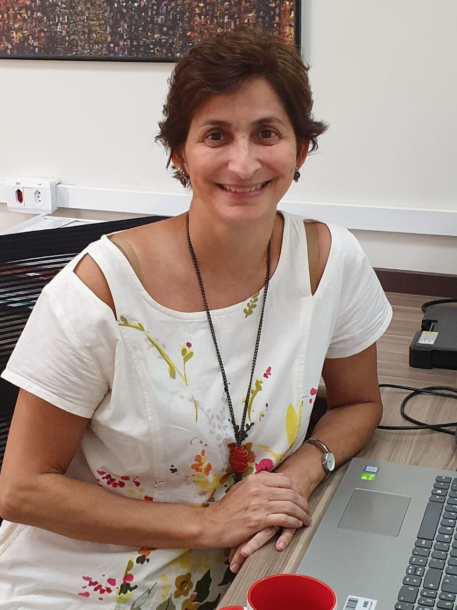]

<font size=3>Nuestras principales líneas de investigación son:</font>

* <font size=3>Ecologia Microbiana Molecular</font>
* <font size=3>Bioprospección genómica</font>
* <font size=3>Microbiología Ambiental</font>

<font size=3>
Nuestros principales intereses incluyen la compresión de la composición y el funcionamiento de las comunidades microbianas y de sus interacciones a travez del uso de abordajes multi-ómicas, con foco en ambientes asociados a petróleo y ambientes extremos como la Antártica.
</font>

---

## Grupo de Ecologia Microbiana e Multi-ômicas - GEMM


**Alumnos de maestría**

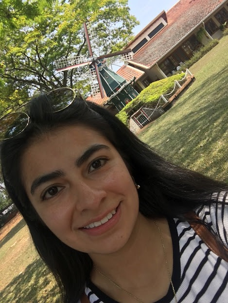 🇨🇴 <font size=2.5>**Alejandra Calderón Fajardo:** Microbióloga de la Universidad de Pamplona</font>⛽

** Alumnos de doctorado**


 🇵🇪 <font size=2.5>**MsC. Melissa Santa Cruz:** Bióloga de la Universidad de Trujillo - Perú </font> 🥶

 🇧🇷 <font size=2.5>**MsC. Jéssica Silva:** Bióloga de la Pontificia Universidade Católica de Campinas </font>⛽ 🥶

---

** Alumnos de doctorado**

 🇨🇴 <font size=2.5> **MsC. Mavi Blanco:** Biólogo de la Universidad Industrial de Santander </font> 🥶

🇧🇷 <font size=2.5>**MsC. William Medeiros:** Biológo de la Universidade Federal da Integração Latino-Americana -UNILA</font> 🥶

🇨🇴 <font size=2.5>**MsC. Kelly Hidalgo:** Microbióloga Industrial de la Pontificia Universidad Javeriana</font> ⛽ 

**Pós-Doc**

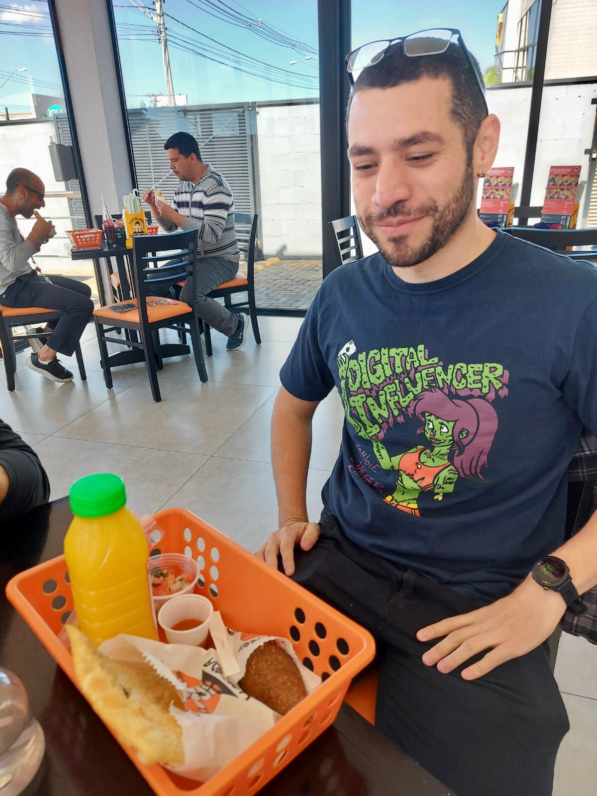🇧🇷 <font size=2.5>**Dr. Leandro Nascimento Lemos:**  Bacharel em Ciências Biológicas de la Universidade Federal do Pampa</font> 🌊

---
class: center, middle, inverse

# Práctica I Introducción a Unix

---
## Práctica I

**Contenido**

* Qué es Unix?
* Login en el servidor
* Comandos Básicos de Linux


[Tutorial](https://github.com/khidalgo85/Unix#readme)
---
class: center, middle, inverse

# Teoría Parte I: Secuenciación de ADN

---
## Tecnologías de secuenciación

Secuenciación de nueva generación NGS

**Illumina**


.center[

]

🔗 [Diferentes plataformas](https://www.illumina.com/systems/sequencing-platforms.html)

---
## Tecnologías de secuenciación

Secuenciación de tercera generación

**PacBio**

* *Long reads* ~25kb


.center[
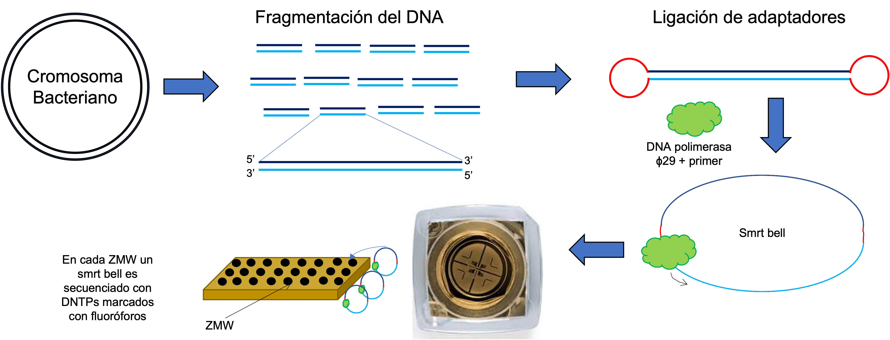
]

---
class: center, middle, inverse

# Teoría Parte II: Calidad de la secuenciación

---
## Cuáles el producto final de la secuenciación?

* Illumina: formato `.fastq` o `.fq`


.center[
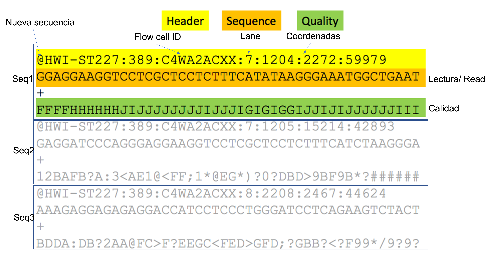
]

* Para secuenciación *paired-end*, son dos archivos uno con las lecturas *fordward* y otro con las lecturas *reverse*.

---
class: hide_logo

## Phred Quality Score

* La calidad de las secuencias está determinada por la nota o *score* *Phred*. Según la siguiente ecuación:

$$q = -10 * log_{10}(P)$$
Donde, *q* es la nota *Phred* e *P* es la probabilidad de que la base esté errada. Así entonces:

* $q = 10$ significa 1 base errada a cada 10 (90%); $p = 0.1$
* $q = 20$ significa 1 base errada a cada 100 (99%); $p = 0.01$
* $q = 30$ significa 1 base errada a cada 1000 (99.9%) $p = 0.001$
  
**Mínimo aceptable** $q>20$, **ideal** $q>30$


---
## Phred Quality Score

* Y entonces que son todos esos simbolos? 

.center[

]


---
class: hide_logo

## Phred Quality Score

Para facilitar la escrita y la lectura de la información de calidad, es usada la tabla *ASCII*, para transformar los dos dígitos de *Phred Score* en un caracter solamente, para conseguir leer facilmente la calidad de cada base.


[ASCII table](https://support.illumina.com/help/BaseSpace_OLH_009008/Content/Source/Informatics/BS/QualityScoreEncoding_swBS.htm)

---
## Como evaluar la calidad de las secuencias

**FASTQC** es un programa que permite visualizar la información de calidad de las secuencias de una manera gráfica e interactiva.


<font size=2>Nota: Durante el procesamiento de las secuencias será explorado un reporte FASTQC</font>
---
class: hide_logo

## *Trimming* (Depuración)

Es el proceso de eliminación de las lecturas con baja calidad. Es posible filtrar secuencias baseado en el *score Phred*, o por ambiguedades (remoción de NNs), remoción de adaptadores, remoción de bases al inicio o al final de las secuencias. También es posible trimar por tamaño, por ejemplo eliminar todas las *reads* menores de 50 bp.


**Programas**
*Nota: Exclusivos para secuencias cortas*
* Trimmomatic
* Trimgalore
* Fastx tool kit
---
class: center, middle, inverse

# Tiempo para colocar en práctica!

.center[

]

---

## Práctica II

**Contenido**
* Qué es conda?
* Importación de secuencias
* Organización de directorios de trabajo
* Análisis de la calidad de las secuencias
* *Trimming*


[Tutorial]()
---
class: center, middle, inverse

# Teoría Parte III: Ensamblaje de Genomas

---
class: hide_logo

.center[## Ensamblaje de Genoma de Novo]
.center[##(Sin referencia)]

.center[
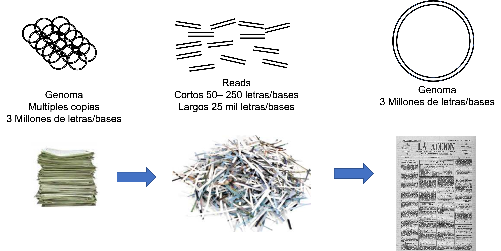
]

* Como es posible re-armar el periódico a partir de los recortes?

---
# Tipos de lecturas (recortes)

Existen diferentes tipos de lecturas/reads/secuencias, dependiendo de la tecnología y el protocolo usado. 

.center[

]

Las secuencias *single-end* y *paired-end* son protocolos de Illumina y son consideradas secuencias cortas. 

Los *long reads* o secuencias largas se pueden obtener con plataformas de secunciación de tercera generación como PacBio o Oxford Nanopore. Tienen un tamaño entre 10 mil y 15 mil pares de bases.

---
## Primera consideración

### Cobertura

La cobertura es cuantas vezes en promedio, cada base del genoma fue secuenciada. Está dado por la ecuación:

$$C = (L*N)/G$$

Donde:
L es igual al tamaño de las lecturas,
N es igual al número de lecturas, y
G es igual al tamaño aproximado del genoma.

**Ejemplo**
Fue secuenciado el genoma de una bacteria con tamaño aproximado de 2 Mbp. Se obtuvieron 3 millones de reads paired end de 100 bp. El cálculo de la cobertura para ese genoma es:

$$C = ((100*2)*3.000.000)/2.000.000$$
$$C = 300x$$

Entre mayor sea la cobertura la calidad del montaje también es mayor. Para Illumina $>100x$, PacBio $>50x$
---
class: hide_logo

### Qué significa "montar" un genoma

A partir de los pedazos (recortes) armar el genoma (página del periódico). Pero si no tenemos un molde, cómo se sabe cual es el orden de las piezas? 

.center[

]

---
class: hide_logo

## Organización del montaje

* Contigs:  Secuencias contiguas, formadas pela sobreposición de un cojunto de reads

.center[
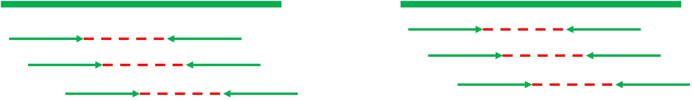
]

* Scaffolds: Unión de contigs

.center[
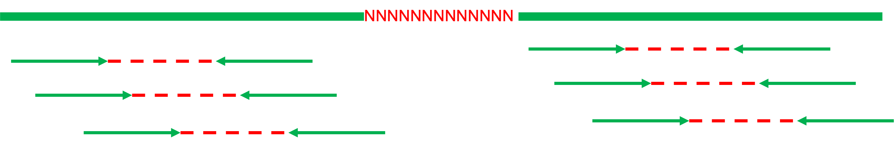
]

---
class: hide_logo

## Algorítmos

Existen diferentes algorítmos para ensamblar genomas, y deben ser usados según el tipo de secuencias (cortas o largas).

* Overlap - Layout - Consensus
  * PacBio
  
.center[
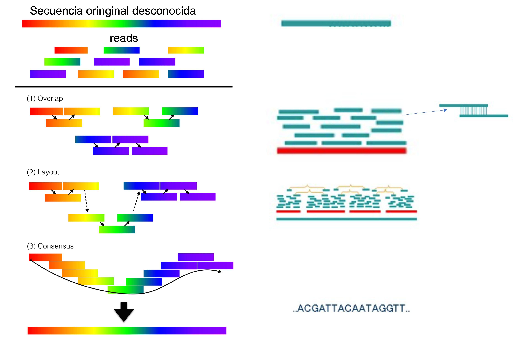
]

---
## Algorítmos
* Grafo de De Bruijn
  * Illumina

.center[
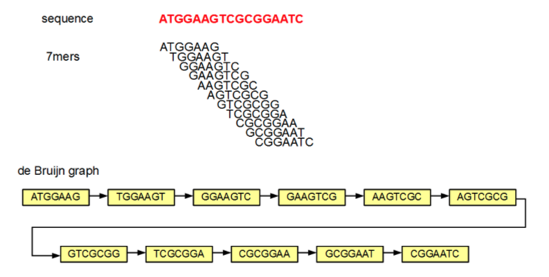
]

---
## Reads cortos vs reads largos

.center[
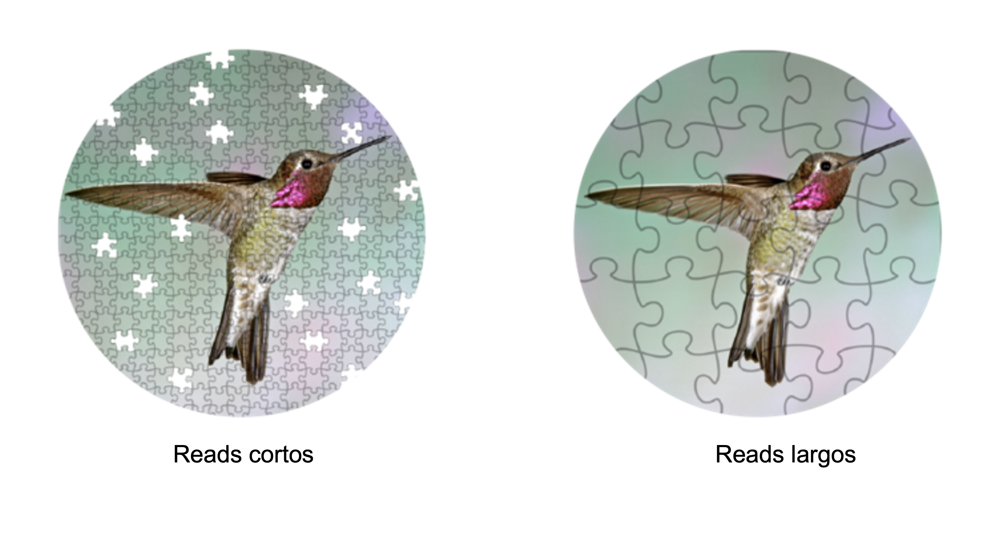
]
---
## Repeticiones: Gran problema!

.center[

]

---
### Reads cortos

.center[
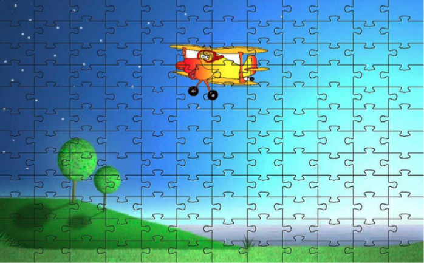
]
---
### Reads largos

.center[

]

---
## En resumen...

1. Entre más pequeñas sean las piezas (reads cortos) más complicado será el proceso
2. Piezas mayores (reads largos) facilitan el proceso de montaje
3. Puede ser usado un molde (genoma de referencia) pero debe ser *muy* próximo.
4. Un genoma de referencia "distante" genera ensambles erróneos.
5. Entre mayor sea el número de cromosomas, más dificil es el proceso de montaje.
6. Genomas con alto porcentaje de repeticiones son más dificiles de montar.

---
.center[## Programas para ensamblar]
.center[##genomas]

* Megahit (secuencias cortas)
* Spades (secuencias cortas e largas)
* Canu (secuencias largas)
* Velvet, SOAP, IDBA, etc.
---
.center[## Como evaluar la calidad]
.center[## del genoma ensamblado?]

1. Número de contigs 
2. Tamaño de los contigs
3. Tamaño del mayor contig
4. N50
5. Tamaño total del montaje
6. Completeza/ Contaminación

<font size=3> Programa para evaluar el montaje, QUAST (1-5), BUSCO (6) </font>

---
## N50

50% del total de bp que están en el 50% de los contigs.

**Ejemplo**

Un genoma de 300 Mbp fue montado en 8 contigs. Los tamaños de los contigs son: 15 Mbp, 39 Mbp, 24 Mbp, 3 Mbp, 33 Mbp, 45 Mbp, 117 Mbp y 54 Mbp.

1. Ordene de mayor a menor los tamaños de los contigs
> 117, 54, 45, 39, 33, 24, 15, 3, 3

2. Cálcule la mitad del genoma
> 150 Mbp

3. Sume los contigs hasta pasar de 150 Mbp, el tamaño de ese contig es el N50
> 54 Mbp

---
class: center, middle, inverse

# Tiempo para colocar en práctica!
.center[

]
---
class: center, middle, inverse

# Práctica III Montaje de Genomas

---
## Práctica III


**Abordaje 1**

* <font size=2>Estimación del tamaño del genoma: Jellyfish</font>
* <font size=2>Montaje del genoma: Canu</font>
* <font size=2>Evaluación de la calidad del raw assembly: Quast/BUSCO</font>
* <font size=2>Alineamiento short reads/ raw assembly: BWA</font>
* <font size=2>Polishing: Polca/MaSurCa tool kit</font>
* <font size=2>Evaluación de la calidad del ensamble mejorado: Quast/BUSCO</font>


---
## Práctica III

**Abordaje 2**
* <font size=2>Estimación del tamaño del genoma: Jellyfish</font>
* <font size=2>Montaje del genoma: Canu</font>
* <font size=2>Montaje: Spades</font>
* <font size=2>Evaluación de la calidad del raw assembly: Quast/BUSCO</font>
* <font size=2>Alineamiento short reads/ raw assembly: BWA</font>
* <font size=2>Polishing: Polca/MaSurCa tool kit</font>
* <font size=2>Evaluación de la calidad del ensamble mejorado: Quast/BUSCO</font>

---
## Práctica III

.center[
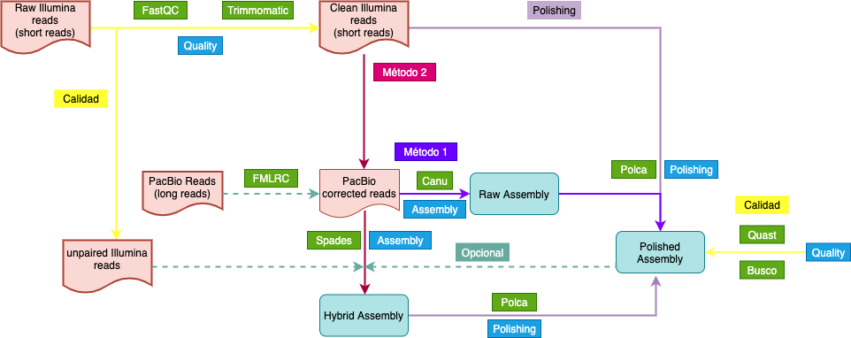
]

[Tutorial](https://github.com/khidalgo85/Genomica_Transcriptomica_Levadura#readme)

---
class: center, middle, inverse

# Teoría Parte IV: Predicción de genes

---
## Como son encontrados los genes?

Programas son capazes de identificar diferentes regiones funcionales del genoma:

* Regiones codificantes de proteínas (ORFs)
* Regiones no codificantes (UTR, íntrons, tRNA, rRNA, microRNAs, long non-coding RNAs)
* Regiones reguladoras (promoteres, enhancer, silencers)

---
## Estructura de los genes

**Procariotos**

.center[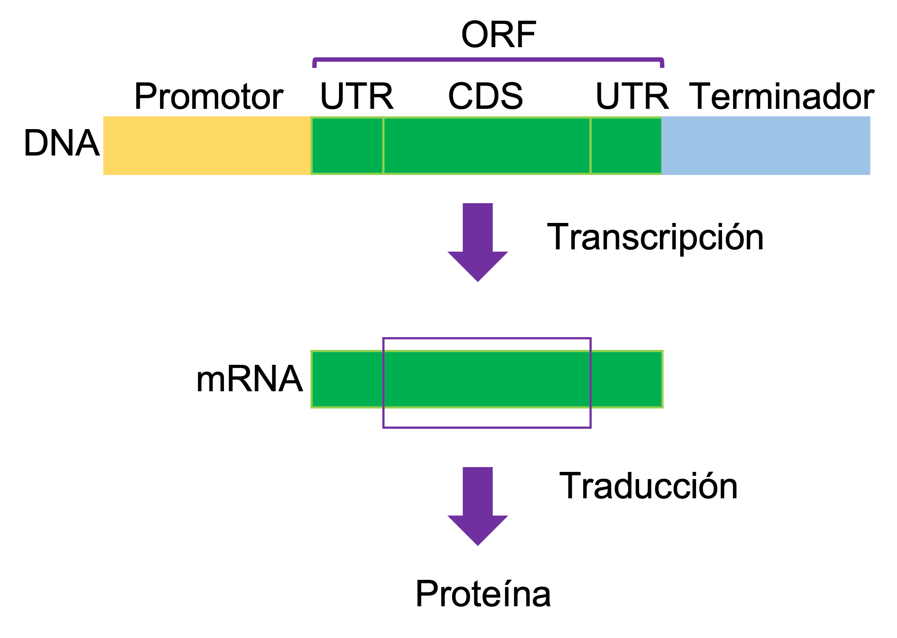]

Los ORFs son secuencias codificantes que poseen:
- Codón de iniciación
- Región codificante (CDS)
- Codón de terminación

---
## Predicción de genes en procariotos

**Para el ínicio**

Los algorítmos están entrenados para reconocer señales en la región promotora de los genes

  * Existen secuencias consenso en la región -35 y la *TATA Box* en la región -10 del promotor.

  * Codón de inicio *start codon*

**Para el final**

Los programas pueden reconocer señales la región terminadora de los genes

  * Codón de terminación *stop codon*
---
## Estructura de los genes

**Eucariotos**

.center[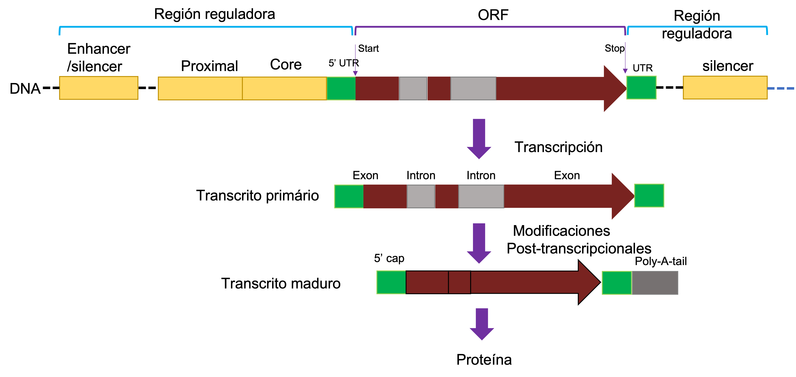]

---
## Predicción de genes en eucariotos

* **Mucho** más complejo!
* Splicing alternativo
* Los algorítmos están entrenados para reconocer señales en los introns

---
class: center, middle, inverse

# Tiempo para colocar en práctica!
.center[

]

---
## Práctica IV

**Contenido**

* Entrenamiento de los predicción genes: STAR, SamTools, Augustus, Braker
* Predicción de genes: Augustus
* Anotación de genes: Blast2Go, EggNog, UniprotK, Blast
* Análisis de vías metabólicas: KAAS, KeggMapper, BlastKoala

[Tutorial](https://github.com/khidalgo85/Genomica_Transcriptomica_Levadura#readme)
---

class: center, middle, inverse

# Teoría Parte V: Transcriptómica

---

## Transcriptómica 

* Análisis del trasncriptoma = transcriptos = mRNA
* Genes expresos/activos al momento de la extracción
* Principal uso: Análisis de la expresión diferencial (dos condiciones diferentes)

---
class: hide_logo

## RNA-Seq

.center[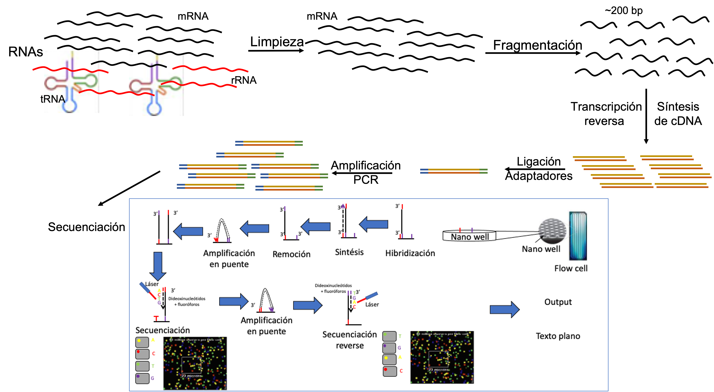]

---
class: hide_logo

## Análisis bioinformático del transcriptoma

### Etapas

* Análisis de la calidad de las secuencias (**FastQC**, PrinSEQ, **Trimmomatic**, Trimgalore)
* Alineamiento de los *reads* en el genoma montado y anotado (STAR, **HISAT2**, TopHat2, Cufflinks)
* Ensamblaje del Transcriptoma (**StringTie**, Trinity, Cufflinks)
* Cuantificación de la expresión (featureCounts, Cuffquant, HTSeq-count, **Kallisto**)
* Expresión diferencial (**DESeq2**, edgeR, **Sleuth**, Ballgown)
* Anotación: **Blast+**, **EggNOG mapper**.

---
class: hide_logo

### Normalización

Para una correcta comparación de la expresión de los genes, es necesario **normalizar** los valores de los *counts* de cada gen. Existen varios tipos de métricas, todas intentan normalizar por la profundidad de la secuenciación y el tamaño de los genes


* **RPKM:** Reads por millón de kilobases. Esta métrica primero cálcula un factor, llamado "per million", dividiendo el total de reads por un millón. Posteriormente, el conteo de cada gen es dividido por este factor, lo cual normaliza los valores por la profundidad de la seuenciación. Por último esos valores son divididos por el tamaño de cada gen en kilobases. **Solo para single-end**
* **FPKM:** Fragmentos por millon de kilobases. Debido a que RPKM es usado solo para bibliotecas *single-end*, fue diseñado el FPKM para *paired-end*. La única diferencia entre estas dos métricas es que el FPKM lleva e cuenta dos lecturas pueden mapear el mismo fragmento. 
* **TPM:** Transcriptos por millón. Para el cálculo de esta métrica, es neceario dividir el conteo de cada gen por el tamaño del gen en kilobases, dando como resultado las lecturas por kilosabes (RPK). Posteriormente los valores de RPK son todos sumados por muestra y divididos por un millón, obteniendo "per million" factor. Por último, se dividen los valores de RPK por el factor dando como resultado final el valor de TPM.

<font size=3>**Estas métricas facilitan la comparación entre muestras, siendo TPM la más usada actualmente**</font>

---
class: center, middle, inverse

# Tiempo para colocar en práctica!
.center[

]

---

## Práctica V

**Contenido**

* Control de Calidad de las secuencias RNA-seq: FastQC, Trimmomatic
* Alineamiento: HISAT2
* Ensamblaje: StringTie
* Cuantificación de la expresión: Kallisto
* Expresión diferencial: DESeq2
* Anotación: Blast, EggNOG mapper

[Tutorial](https://github.com/khidalgo85/Genomica_Transcriptomica_Levadura#readme)
---
## Consideraciones finales

* Que tenemos hasta hoy?
  * Genoma ensamblado y anotado de la levadura *C. palmiolephila*
  * Estudio del potencial genético de *C. palmiolephila* (Genómica)
  * Estudio de la expresión del genes de *C. palmiolephila* (Transcriptómica)
  
  
* Ahora tienen un bastante de información para analizar y sacar provecho! 
* Aprendieron varias herramientas bioinformáticas para análisis de genomas y transcriptomas


---

class: center, inverse

## Obrigado! 🇧🇷🇨🇴

.center[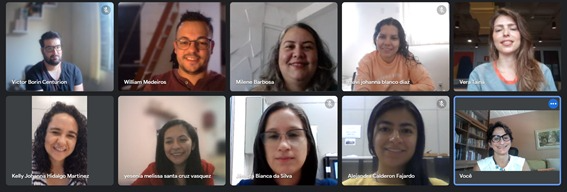]
.center[]


